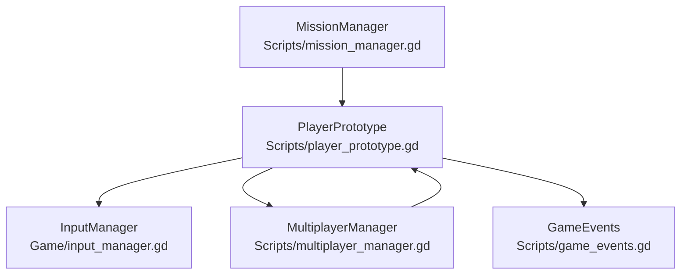
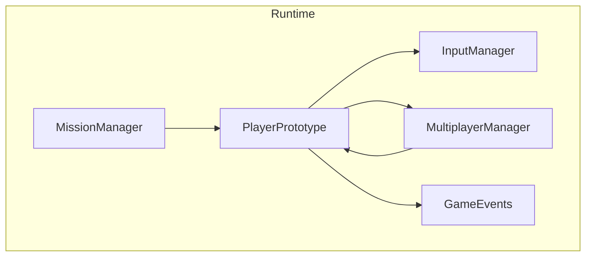
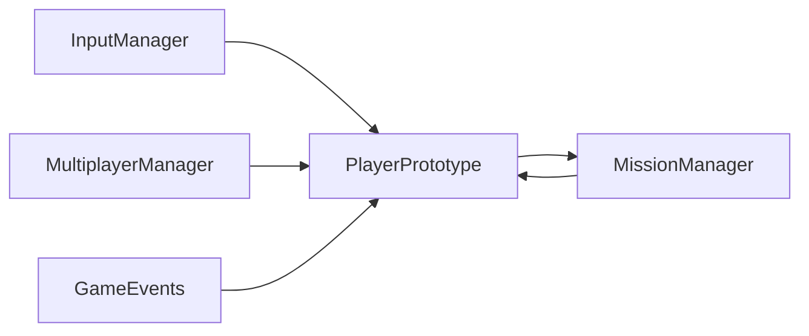

# API Reference

<cite>
**Referenced Files in This Document**
- [player_prototype.gd](file://Scripts/player_prototype.gd)
- [input_manager.gd](file://Game/input_manager.gd)
- [mission_manager.gd](file://Scripts/mission_manager.gd)
- [multiplayer_manager.gd](file://Scripts/multiplayer_manager.gd)
- [game_events.gd](file://Scripts/game_events.gd)
</cite>

## Table of Contents
1. [Introduction](#introduction)
2. [Project Structure](#project-structure)
3. [Core Components](#core-components)
4. [Architecture Overview](#architecture-overview)
5. [Detailed Component Analysis](#detailed-component-analysis)
6. [Dependency Analysis](#dependency-analysis)
7. [Performance Considerations](#performance-considerations)
8. [Troubleshooting Guide](#troubleshooting-guide)
9. [Conclusion](#conclusion)
10. [Appendices](#appendices)

## Introduction
This API Reference documents TFA Agents’ public interfaces and scripting APIs. It focuses on:
- Player Prototype API for movement, combat, height-level mechanics, damage, and multiplayer synchronization
- Input Management Interface for desktop and touch controls
- Mission System API for quest progression and HUD signaling
- Multiplayer Networking Interface for lobby, teams, and match lifecycle
- Event System for gameplay events such as power-up collection

The documentation organizes APIs by functional area, lists public methods and signals, describes parameters and return values, and provides usage guidance and integration patterns.

## Project Structure
The relevant APIs are implemented as autoload singletons and scene scripts:
- Player Prototype: Scripts/player_prototype.gd
- Input Manager: Game/input_manager.gd
- Mission Manager: Scripts/mission_manager.gd
- Multiplayer Manager: Scripts/multiplayer_manager.gd
- Game Events: Scripts/game_events.gd

**Diagram sources**
- [player_prototype.gd](file://Scripts/player_prototype.gd)
- [input_manager.gd](file://Game/input_manager.gd)
- [mission_manager.gd](file://Scripts/mission_manager.gd)
- [multiplayer_manager.gd](file://Scripts/multiplayer_manager.gd)
- [game_events.gd](file://Scripts/game_events.gd)

**Section sources**
- [player_prototype.gd](file://Scripts/player_prototype.gd)
- [input_manager.gd](file://Game/input_manager.gd)
- [mission_manager.gd](file://Scripts/mission_manager.gd)
- [multiplayer_manager.gd](file://Scripts/multiplayer_manager.gd)
- [game_events.gd](file://Scripts/game_events.gd)

## Core Components
This section summarizes the primary APIs and their responsibilities.

- Player Prototype API
  - Movement, rotation, and physics integration
  - Shooting, auto-fire, raycast hit detection, and projectile replication
  - Height-level traversal with collision and visibility effects
  - Damage, healing, reloading, and respawn logic
  - Multiplayer authority and state synchronization

- Input Management Interface
  - Desktop and touch control abstraction via Virtual Joysticks
  - Unified input handling for movement and aiming

- Mission System API
  - Start, progress, complete, fail, and clear missions
  - Built-in helpers to construct common mission types
  - Signals for HUD integration

- Multiplayer Networking Interface
  - Host/join sessions, lobby updates, readiness, and team assignment
  - Match start broadcast and scene transitions
  - Player despawn and disconnect handling

- Event System
  - Power-up collection notifications

**Section sources**
- [player_prototype.gd](file://Scripts/player_prototype.gd)
- [input_manager.gd](file://Game/input_manager.gd)
- [mission_manager.gd](file://Scripts/mission_manager.gd)
- [multiplayer_manager.gd](file://Scripts/multiplayer_manager.gd)
- [game_events.gd](file://Scripts/game_events.gd)

## Architecture Overview
The runtime architecture connects the Player Prototype with Input, Multiplayer, and Mission systems. The Player emits signals consumed by HUD and other UI components. Multiplayer synchronization ensures authoritative state updates across peers.

**Diagram sources**
- [player_prototype.gd](file://Scripts/player_prototype.gd)
- [input_manager.gd](file://Game/input_manager.gd)
- [mission_manager.gd](file://Scripts/mission_manager.gd)
- [multiplayer_manager.gd](file://Scripts/multiplayer_manager.gd)
- [game_events.gd](file://Scripts/game_events.gd)

## Detailed Component Analysis

### Player Prototype API
Public methods, signals, and properties exposed by the Player Prototype.

- Public Properties
  - speed: Movement speed
  - current_height_level: Current height level index
  - total_levels: Total number of height levels
  - team_id: Player’s team identifier
  - skin_index: Skin selection index
  - fire_cooldown: Minimum time between shots
  - shot_range: Maximum shot distance
  - touch_auto_fire_range: Detection range for auto-fire on touch
  - projectile_visual_speed: Speed for visual projectiles
  - vita_max: Maximum health
  - colpi_correnti: Current magazine rounds
  - colpi_totali: Reserve ammunition
  - capacita_caricatore: Magazine capacity
  - nome_arma: Weapon name for animations
  - player_name: Player display name

- Signals
  - height_level_changed(new_level: int)
  - health_changed(current: float, max_val: float)
  - ammo_changed(current: int, total: int)
  - reload_started(duration: float)

- Public Methods
  - change_height_level(new_level: int, force_update: bool = false) -> void
  - apply_damage(amount: float) -> void
  - receive_damage(amount: float, source_peer_id: int) -> void
  - heal(amount: float) -> void
  - add_ammo(amount: int) -> void
  - _apply_spawn_data(spawn_pos: Vector2, spawn_level: int) -> void
  - _receive_initial_state(p_team_id: int, p_skin_index: int, p_nome_arma: String, p_player_name: String = "Player") -> void
  - _send_state_to_remotes(remote_pos: Vector2, remote_rot: float, remote_level: int) -> void
  - _replicate_fire(origin: Vector2, impact_position: Vector2, target_path: NodePath, height_level: int, visual_speed: float, shooter_peer_id: int = 0) -> void
  - _broadcast_health_update(new_vita: float, new_vita_max: float) -> void
  - _die() -> void
  - respawn(spawn_pos: Vector2, spawn_level: int) -> void
  - _try_reload() -> void
  - _finish_reload() -> void
  - _play_reload_animation() -> void

- Internal Helpers
  - _can_fire() -> bool
  - _get_fire_origin() -> Vector2
  - _get_aim_direction(_fire_origin: Vector2) -> Vector2
  - _handle_touch_aim_and_fire(look_dir: Vector2, delta: float) -> void
  - _try_touch_auto_fire() -> void
  - _has_enemy_target_in_direction(fire_origin: Vector2, aim_direction: Vector2, detection_range: float) -> bool
  - _is_enemy_target(target: Variant) -> bool
  - _build_shot_data(fire_origin: Vector2, aim_direction: Vector2) -> Dictionary
  - _configure_shot_raycast_for_current_level() -> void
  - _can_apply_projectile_impacts() -> bool
  - _get_time_seconds() -> float
  - _can_apply_local_feedback() -> bool
  - _trigger_screen_shake(strength: float, duration: float) -> void
  - _update_camera_shake(delta: float) -> void
  - _setup_shader_materials() -> void
  - _update_player_position_in_shaders() -> void
  - _update_level_visibility_effects() -> void
  - _update_entity_auras_in_shaders() -> void
  - _set_entities_visibility_for_level(level: int, should_be_visible: bool) -> void
  - _get_level_shader_materials(level_index: int) -> Array[ShaderMaterial]
  - _get_level_canvas_items(level_index: int) -> Array[CanvasItem]
  - _update_team_color() -> void
  - _initialize_level_system() -> void
  - _check_and_restore_checkpoint() -> void

- Usage Examples
  - Start a match and initialize player state
    - [player_prototype.gd](file://Scripts/player_prototype.gd)
  - Fire weapon and replicate shot across network
    - [player_prototype.gd](file://Scripts/player_prototype.gd)
  - Change height level and update collision/mask
    - [player_prototype.gd](file://Scripts/player_prototype.gd)
  - Reload weapon and animate
    - [player_prototype.gd](file://Scripts/player_prototype.gd)
  - Take damage and handle death/respawn
    - [player_prototype.gd](file://Scripts/player_prototype.gd)

- Parameter Validation Rules
  - Health and ammo values are clamped to valid ranges internally
  - Shot cooldown prevents firing faster than configured
  - Friendly fire is prevented when applying damage to teammates
  - Reload is skipped if magazine is full or no reserve ammo remains

- Integration Patterns
  - Subscribe to signals for HUD updates (health, ammo, level changes)
  - Use multiplayer authority checks before applying local actions
  - Replicate authoritative actions via RPCs to clients

**Section sources**
- [player_prototype.gd](file://Scripts/player_prototype.gd)

### Input Management Interface
The Input Manager provides unified input handling for desktop and touch.

- Signals
  - None (extends CanvasLayer)

- Public Methods
  - None (script body is minimal)

- Usage Examples
  - Attach Virtual Joysticks under InputManager for left_stick and right_stick
  - Use InputManager nodes to drive movement and aiming in Player Prototype

- Integration Patterns
  - Ensure InputManager is present in the player scene
  - Disable InputManager on remote clients when authority is not owned by the peer

**Section sources**
- [input_manager.gd](file://Game/input_manager.gd)
- [player_prototype.gd](file://Scripts/player_prototype.gd)

### Mission System API
Mission Manager is an autoload singleton that manages active missions and emits HUD signals.

- Signals
  - mission_started(data: MissionData)
  - mission_progress_changed(current: int, target: int)
  - mission_completed(data: MissionData)
  - mission_failed(data: MissionData)
  - mission_cleared()

- Public Properties
  - active_mission: MissionData (read-only)
  - progress: int (read-only)

- Public Methods
  - start(data: MissionData) -> void
  - update_progress(amount: int = 1) -> void
  - set_progress(value: int) -> void
  - complete() -> void
  - fail() -> void
  - clear() -> void
  - make_eliminate(count: int, label: String = "") -> MissionData
  - make_collect(count: int, item_name: String) -> MissionData
  - make_reach(point_name: String) -> MissionData
  - make_activate(object_name: String) -> MissionData
  - make_survive(seconds: int) -> MissionData
  - make_custom(label: String, target: int = 0, color: Color = Color.WHITE) -> MissionData

- Usage Examples
  - Start a survival mission for 60 seconds
    - [mission_manager.gd](file://Scripts/mission_manager.gd)
  - Track enemy eliminations and auto-complete when threshold reached
    - [mission_manager.gd](file://Scripts/mission_manager.gd)
  - Build a custom mission with accent color
    - [mission_manager.gd](file://Scripts/mission_manager.gd)

- Parameter Validation Rules
  - Progress is clamped between 0 and target during updates
  - Completing or failing requires an active mission

- Integration Patterns
  - Connect to mission_progress_changed to update mission panel UI
  - Use make_* helpers to construct inline MissionData instances

**Section sources**
- [mission_manager.gd](file://Scripts/mission_manager.gd)

### Multiplayer Networking Interface
Multiplayer Manager encapsulates ENet backend and provides lobby/team/game lifecycle.

- Signals
  - lobby_updated(players_info: Dictionary)
  - game_started(map_path: String)
  - connection_failed(reason: String)
  - player_disconnected(peer_id: int)
  - player_connected(peer_id: int)
  - all_players_ready()

- Public Properties
  - players_info: Dictionary
  - session_max_players: int
  - team_mode: String ("teams" or "ffa")
  - team_count: int
  - pending_map_path: String
  - local_player_name: String
  - local_skin_index: int
  - is_match_running: bool

- Public Methods
  - host_game(port: int = DEFAULT_PORT, max_players: int = DEFAULT_MAX_PLAYERS) -> Error
  - join_game(ip: String, port: int = DEFAULT_PORT) -> Error
  - disconnect_game() -> void
  - leave_current_match() -> void
  - set_player_name(player_name: String) -> void
  - set_skin_index(idx: int) -> void
  - set_ready(is_ready: bool) -> void
  - start_game() -> void
  - is_host() -> bool
  - is_connected_to_session() -> bool
  - get_local_peer_id() -> int

- Internal RPCs
  - _register_player_on_server(peer_id: int, player_name: String, skin_index: int) -> void
  - _broadcast_lobby_update(info: Dictionary) -> void
  - _set_ready_on_server(peer_id: int, is_ready: bool) -> void
  - _start_game_on_all(map_path: String, final_players_info: Dictionary, synced_team_mode: String, synced_team_count: int) -> void
  - _request_despawn() -> void
  - _despawn_player_on_server(peer_id: int) -> void

- Usage Examples
  - Host a game on port 7777 with up to 12 players
    - [multiplayer_manager.gd](file://Scripts/multiplayer_manager.gd)
  - Join a hosted game by IP and port
    - [multiplayer_manager.gd](file://Scripts/multiplayer_manager.gd)
  - Mark local player ready and start when all are ready
    - [multiplayer_manager.gd](file://Scripts/multiplayer_manager.gd)

- Parameter Validation Rules
  - Max players clamped between 2 and MAX_PLAYERS
  - Team mode must be "teams" or "ffa"

- Integration Patterns
  - Listen to lobby_updated to refresh UI with player list and readiness
  - On game_started, change scene to the provided map path
  - Normalize peer keys after RPC serialization

**Section sources**
- [multiplayer_manager.gd](file://Scripts/multiplayer_manager.gd)

### Event System
Game Events provides a central signal for gameplay events.

- Signals
  - powerup_collected(powerup_type: int, level: int)

- Usage Examples
  - Emit powerup_collected when a collectible is picked up
  - Subscribe to the signal to trigger HUD feedback or scoring

**Section sources**
- [game_events.gd](file://Scripts/game_events.gd)

## Dependency Analysis
The Player Prototype depends on Input, Multiplayer, and Game Events. Mission Manager coordinates with Player for HUD updates. Multiplayer Manager orchestrates lobby and match lifecycle.

**Diagram sources**
- [player_prototype.gd](file://Scripts/player_prototype.gd)
- [input_manager.gd](file://Game/input_manager.gd)
- [mission_manager.gd](file://Scripts/mission_manager.gd)
- [multiplayer_manager.gd](file://Scripts/multiplayer_manager.gd)
- [game_events.gd](file://Scripts/game_events.gd)

**Section sources**
- [player_prototype.gd](file://Scripts/player_prototype.gd)
- [mission_manager.gd](file://Scripts/mission_manager.gd)
- [multiplayer_manager.gd](file://Scripts/multiplayer_manager.gd)
- [game_events.gd](file://Scripts/game_events.gd)

## Performance Considerations
- Multiplayer state synchronization is throttled to reduce bandwidth and CPU usage
- Screen shake and shader updates are applied conditionally based on local authority and settings
- Collision masks and navigation layers are updated per height level to optimize queries
- Projectile impacts are processed only on the server to maintain consistency

[No sources needed since this section provides general guidance]

## Troubleshooting Guide
- Player does not fire on mobile
  - Ensure InputManager exists and is enabled for the local authority
  - Verify touch aim direction is detected and auto-fire range is configured
  - [player_prototype.gd](file://Scripts/player_prototype.gd)

- Friendly fire occurs
  - Confirm team_id checks prevent damage to teammates
  - [player_prototype.gd](file://Scripts/player_prototype.gd)

- Health not updating across clients
  - Ensure RPCs are invoked on the authoritative instance
  - [player_prototype.gd](file://Scripts/player_prototype.gd)

- Mission progress not reflected in HUD
  - Subscribe to mission_progress_changed and mission_completed signals
  - [mission_manager.gd](file://Scripts/mission_manager.gd)

- Cannot connect to hosted game
  - Verify port availability and firewall settings
  - Check connection_failed signal for detailed reasons
  - [multiplayer_manager.gd](file://Scripts/multiplayer_manager.gd)

**Section sources**
- [player_prototype.gd](file://Scripts/player_prototype.gd)
- [mission_manager.gd](file://Scripts/mission_manager.gd)
- [multiplayer_manager.gd](file://Scripts/multiplayer_manager.gd)

## Conclusion
This API Reference outlines the public interfaces for the Player Prototype, Input Management, Mission System, Multiplayer Networking, and Event System. By following the documented signals, methods, and integration patterns, developers can implement robust gameplay features, synchronize state across peers, and deliver responsive UI feedback.

[No sources needed since this section summarizes without analyzing specific files]

## Appendices
- Cross-references
  - Player Prototype signals consumed by HUD and UI panels
  - Mission Manager signals for mission panel updates
  - Multiplayer Manager signals for lobby and match lifecycle
  - Game Events signal for power-up collection feedback

[No sources needed since this section provides general guidance]