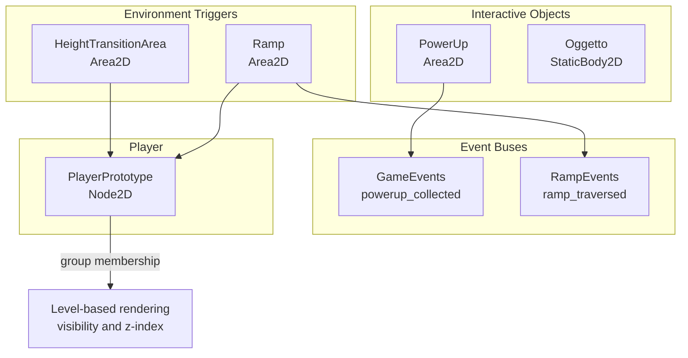
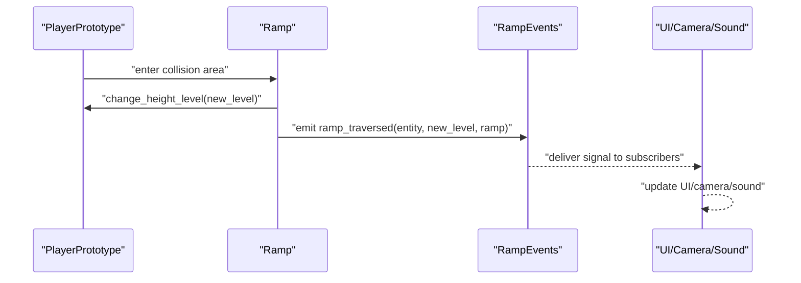
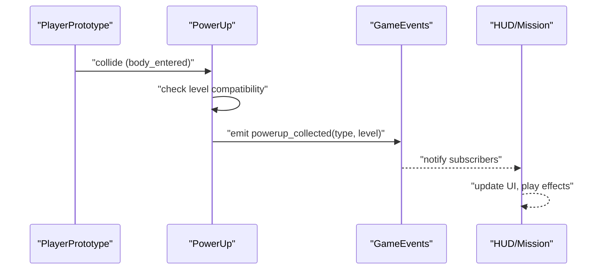
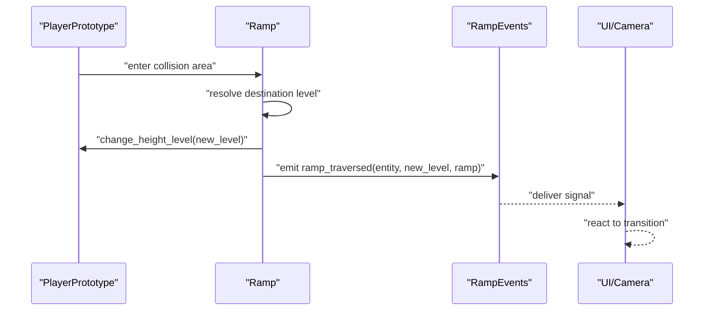
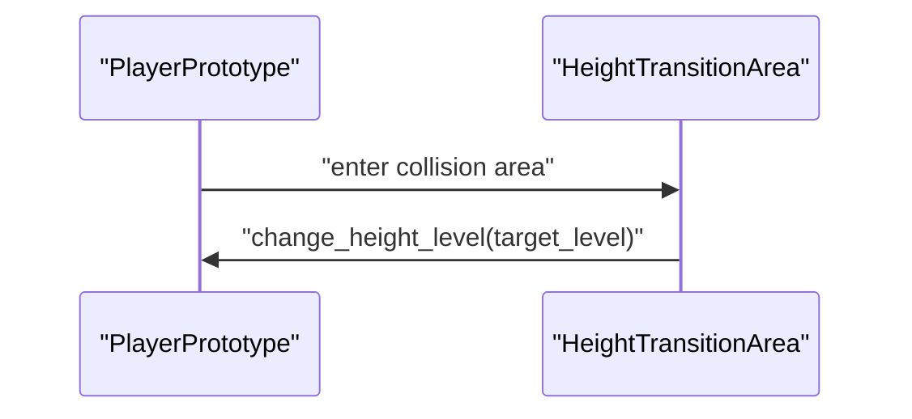
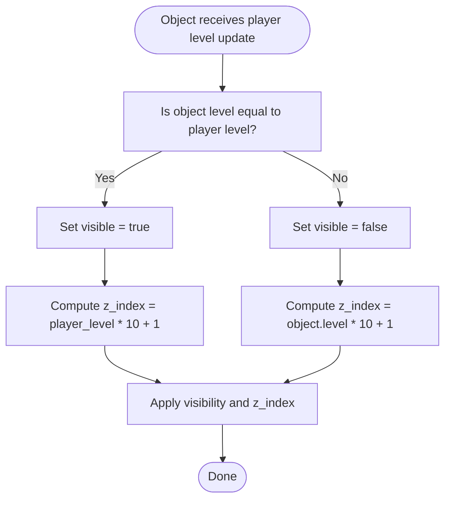
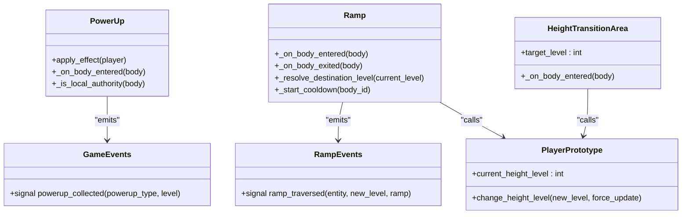

# Game Events API

<cite>
**Referenced Files in This Document**
- [game_events.gd](file://Scripts/game_events.gd)
- [ramp_events.gd](file://Scripts/ramp_events.gd)
- [height_transition_area.gd](file://Scripts/height_transition_area.gd)
- [power_up.gd](file://Scripts/power_up.gd)
- [ramp.gd](file://Scripts/ramp.gd)
- [player_prototype.gd](file://Scripts/player_prototype.gd)
- [power_up.tscn](file://Scenes/power_up.tscn)
- [ramp.tscn](file://Scenes/ramp.tscn)
</cite>

## Table of Contents
1. [Introduction](#introduction)
2. [Project Structure](#project-structure)
3. [Core Components](#core-components)
4. [Architecture Overview](#architecture-overview)
5. [Detailed Component Analysis](#detailed-component-analysis)
6. [Dependency Analysis](#dependency-analysis)
7. [Performance Considerations](#performance-considerations)
8. [Troubleshooting Guide](#troubleshooting-guide)
9. [Conclusion](#conclusion)

## Introduction
This document provides comprehensive API documentation for the Game Events system in the project. It covers event triggers, collision detection, area-based events, and interactive object handling. The system revolves around three primary event mechanisms:
- Power-up collection events emitted globally via a dedicated event bus
- Ramp traversal events signaling height transitions
- Height transition areas enabling level-aware movement

The documentation explains event registration, signal emission, handler patterns, and practical examples such as ramp activation, height transition events, power-up collection, and environmental interactions. It also addresses event priority, filtering, and performance optimization for event-heavy scenarios.

## Project Structure
The Game Events system is composed of:
- Event buses: centralized nodes emitting signals for global handlers
- Interactive objects: power-ups and destructible objects responding to collisions
- Environmental triggers: ramps and height transition areas managing level changes
- Player integration: player prototype handling level changes and group membership updates

**Diagram sources**
- [game_events.gd:1-5](file://Scripts/game_events.gd#L1-L5)
- [ramp_events.gd:1-9](file://Scripts/ramp_events.gd#L1-L9)
- [power_up.gd:123-150](file://Scripts/power_up.gd#L123-L150)
- [ramp.gd:112-143](file://Scripts/ramp.gd#L112-L143)
- [height_transition_area.gd:11-14](file://Scripts/height_transition_area.gd#L11-L14)
- [player_prototype.gd:326-336](file://Scripts/player_prototype.gd#L326-L336)

**Section sources**
- [game_events.gd:1-5](file://Scripts/game_events.gd#L1-L5)
- [ramp_events.gd:1-9](file://Scripts/ramp_events.gd#L1-L9)
- [power_up.gd:1-236](file://Scripts/power_up.gd#L1-L236)
- [ramp.gd:1-207](file://Scripts/ramp.gd#L1-L207)
- [height_transition_area.gd:1-15](file://Scripts/height_transition_area.gd#L1-L15)
- [player_prototype.gd:326-336](file://Scripts/player_prototype.gd#L326-L336)

## Core Components
This section documents the core event components and their APIs.

- GameEvents
  - Purpose: Centralized event bus for power-up collection events
  - Signal: powerup_collected(powerup_type: int, level: int)
  - Emitted by: PowerUp on successful collection by the local authority
  - Typical handlers: HUD, mission systems, audio/video feedback

- RampEvents
  - Purpose: Centralized event bus for ramp traversal events
  - Signal: ramp_traversed(entity: Node2D, new_level: int, ramp: Node2D)
  - Emitted by: Ramp when a compatible body traverses it
  - Typical handlers: UI overlays, camera effects, sound cues

- PowerUp
  - Purpose: Interactive collectible items with level-aware visibility and collision
  - Key behaviors:
    - Collision detection via Area2D body_entered
    - Level-aware visibility and z-index based on player height level
    - Effect application and global signal emission under authority
  - Methods and signals:
    - apply_effect(player: Node2D): applies type-specific effects
    - powerup_collected signal emitted via GameEvents
    - Internal connection to player height level changes

- Ramp
  - Purpose: Environment trigger enabling two-level height transitions
  - Key behaviors:
    - Collision detection via Area2D body_entered/body_exited
    - Destination level resolution based on current level and ramp configuration
    - Cooldown mechanism to prevent rapid repeated traversals
    - Visibility and z-index adjustments based on player level
  - Methods and signals:
    - change_height_level(new_level: int, force_update: bool = false): updates player level and group membership
    - ramp_traversed signal emitted via RampEvents

- HeightTransitionArea
  - Purpose: Area-based height transition trigger
  - Behavior: On body entry, attempts to call change_height_level on the colliding body

- PlayerPrototype
  - Purpose: Player entity implementing height level management
  - Key behaviors:
    - Maintains current_height_level and group membership
    - Updates groups when changing levels
    - Receives remote state updates and forces level changes when needed

**Section sources**
- [game_events.gd:1-5](file://Scripts/game_events.gd#L1-L5)
- [ramp_events.gd:1-9](file://Scripts/ramp_events.gd#L1-L9)
- [power_up.gd:123-177](file://Scripts/power_up.gd#L123-L177)
- [ramp.gd:112-150](file://Scripts/ramp.gd#L112-L150)
- [height_transition_area.gd:11-14](file://Scripts/height_transition_area.gd#L11-L14)
- [player_prototype.gd:326-336](file://Scripts/player_prototype.gd#L326-L336)

## Architecture Overview
The Game Events system follows a publish-subscribe pattern with explicit event buses and environment-triggered actions. Handlers connect to signals emitted by either interactive objects or environment triggers. The player integrates with the system through level-aware visibility and group membership updates.

**Diagram sources**
- [ramp.gd:112-143](file://Scripts/ramp.gd#L112-L143)
- [ramp_events.gd:1-9](file://Scripts/ramp_events.gd#L1-L9)

**Section sources**
- [ramp.gd:112-143](file://Scripts/ramp.gd#L112-L143)
- [ramp_events.gd:1-9](file://Scripts/ramp_events.gd#L1-L9)

## Detailed Component Analysis

### Power-up Collection Event Flow
This flow demonstrates how power-ups emit a global signal upon collection and how handlers can react to it.

**Diagram sources**
- [power_up.gd:123-150](file://Scripts/power_up.gd#L123-L150)
- [game_events.gd:1-5](file://Scripts/game_events.gd#L1-L5)

**Section sources**
- [power_up.gd:123-150](file://Scripts/power_up.gd#L123-L150)
- [game_events.gd:1-5](file://Scripts/game_events.gd#L1-L5)

### Ramp Activation and Height Transition
This flow illustrates ramp traversal, destination calculation, and event emission.

**Diagram sources**
- [ramp.gd:112-143](file://Scripts/ramp.gd#L112-L143)
- [ramp_events.gd:1-9](file://Scripts/ramp_events.gd#L1-L9)
- [player_prototype.gd:326-336](file://Scripts/player_prototype.gd#L326-L336)

**Section sources**
- [ramp.gd:112-143](file://Scripts/ramp.gd#L112-L143)
- [ramp_events.gd:1-9](file://Scripts/ramp_events.gd#L1-L9)
- [player_prototype.gd:326-336](file://Scripts/player_prototype.gd#L326-L336)

### Height Transition Area Interaction
This flow shows how entering a height transition area triggers a level change on compatible bodies.

**Diagram sources**
- [height_transition_area.gd:11-14](file://Scripts/height_transition_area.gd#L11-L14)

**Section sources**
- [height_transition_area.gd:11-14](file://Scripts/height_transition_area.gd#L11-L14)

### Level-Aware Visibility and Z-Index Logic
This flowchart outlines how objects adjust visibility and z-index based on the player's current height level.

**Diagram sources**
- [power_up.gd:227-229](file://Scripts/power_up.gd#L227-L229)
- [ramp.gd:93-101](file://Scripts/ramp.gd#L93-L101)

**Section sources**
- [power_up.gd:227-229](file://Scripts/power_up.gd#L227-L229)
- [ramp.gd:93-101](file://Scripts/ramp.gd#L93-L101)

## Dependency Analysis
The following diagram maps the dependencies among key components involved in the Game Events system.

**Diagram sources**
- [game_events.gd:1-5](file://Scripts/game_events.gd#L1-L5)
- [ramp_events.gd:1-9](file://Scripts/ramp_events.gd#L1-L9)
- [power_up.gd:123-150](file://Scripts/power_up.gd#L123-L150)
- [ramp.gd:112-143](file://Scripts/ramp.gd#L112-L143)
- [height_transition_area.gd:11-14](file://Scripts/height_transition_area.gd#L11-L14)
- [player_prototype.gd:326-336](file://Scripts/player_prototype.gd#L326-L336)

**Section sources**
- [game_events.gd:1-5](file://Scripts/game_events.gd#L1-L5)
- [ramp_events.gd:1-9](file://Scripts/ramp_events.gd#L1-L9)
- [power_up.gd:123-150](file://Scripts/power_up.gd#L123-L150)
- [ramp.gd:112-143](file://Scripts/ramp.gd#L112-L143)
- [height_transition_area.gd:11-14](file://Scripts/height_transition_area.gd#L11-L14)
- [player_prototype.gd:326-336](file://Scripts/player_prototype.gd#L326-L336)

## Performance Considerations
- Event frequency and handler cost
  - Power-ups and ramps can generate frequent signals. Keep handlers lightweight and avoid heavy computations in signal callbacks.
  - Batch UI updates when multiple events occur in quick succession.

- Collision filtering and grouping
  - Use level-based collision masks and groups to reduce unnecessary collision checks and signal emissions.
  - Ensure only relevant bodies (e.g., players) receive level-change signals.

- Cooldowns and deduplication
  - Ramps implement a cooldown mechanism to prevent repeated traversals. Extend similar patterns for frequently triggered events.
  - Track traversed bodies to avoid redundant processing.

- Authority and multiplayer synchronization
  - Emit global signals only from local authority to prevent duplicate effects in multiplayer scenarios.
  - Use RPCs for authoritative state updates and rely on signals for local reactions.

- Graphics and visibility
  - Adjust visibility and z-index based on player level to minimize rendering overhead for off-level content.
  - Disable expensive visuals (e.g., particle systems) at lower graphics presets.

[No sources needed since this section provides general guidance]

## Troubleshooting Guide
- Power-up not collected
  - Verify that the colliding body has a compatible height level and that the PowerUp emits the signal only under local authority.
  - Confirm that handlers are connected to the GameEvents signal.

- Ramp not triggering transitions
  - Ensure the player has the change_height_level method and that the ramp’s start and arrival levels are configured correctly.
  - Check that the player is in the authoritative state if using multiplayer.

- Height transition area not working
  - Confirm that the colliding body responds to change_height_level and that the target_level is set appropriately.

- Visual glitches with level-based objects
  - Verify that player height level changes update group membership and that visibility/z-index logic is applied consistently.

**Section sources**
- [power_up.gd:123-150](file://Scripts/power_up.gd#L123-L150)
- [ramp.gd:112-143](file://Scripts/ramp.gd#L112-L143)
- [height_transition_area.gd:11-14](file://Scripts/height_transition_area.gd#L11-L14)
- [player_prototype.gd:326-336](file://Scripts/player_prototype.gd#L326-L336)

## Conclusion
The Game Events system provides a robust foundation for level-aware interactions, including power-up collection, ramp traversal, and area-based height transitions. By leveraging centralized event buses, level-aware visibility, and authority-based signal emission, the system supports scalable and maintainable gameplay mechanics. Following the recommended patterns for event registration, filtering, and performance optimization ensures smooth operation even in event-heavy scenarios.

[No sources needed since this section summarizes without analyzing specific files]