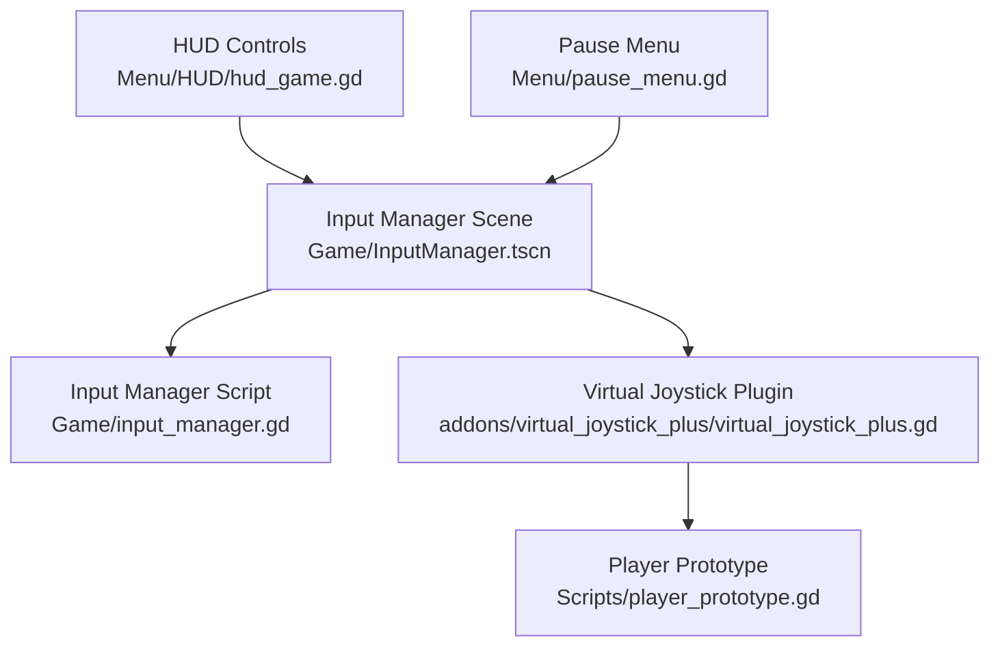
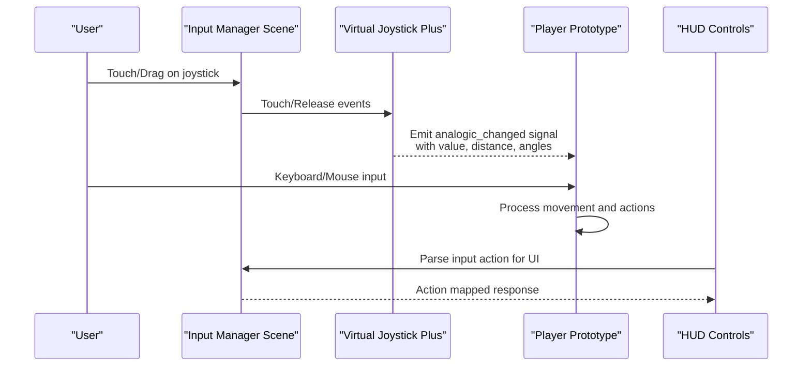
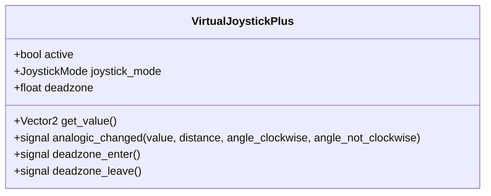
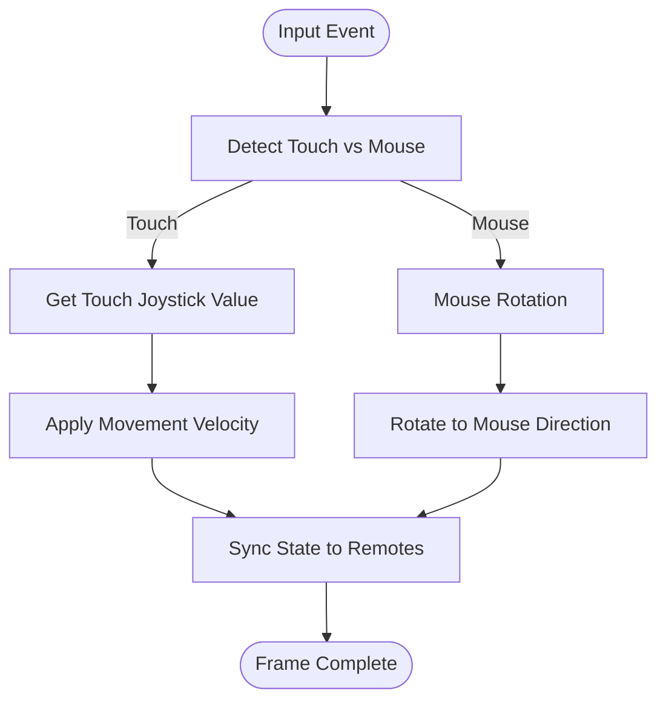
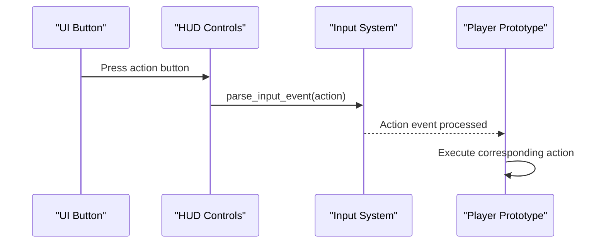
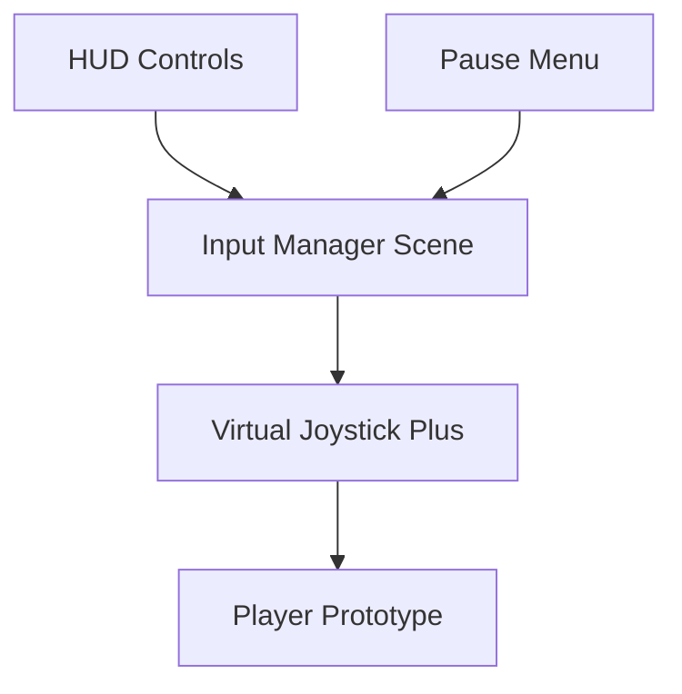

# Input Management API

<cite>
**Referenced Files in This Document**
- [input_manager.gd](file://Game/input_manager.gd)
- [InputManager.tscn](file://Game/InputManager.tscn)
- [virtual_joystick_plus.gd](file://addons/virtual_joystick_plus/virtual_joystick_plus.gd)
- [plugin.gd](file://addons/virtual_joystick_plus/plugin.gd)
- [player_prototype.gd](file://Scripts/player_prototype.gd)
- [hud_game.gd](file://Menu/HUD/hud_game.gd)
- [pause_menu.gd](file://Menu/pause_menu.gd)
</cite>

## Table of Contents
1. [Introduction](#introduction)
2. [Project Structure](#project-structure)
3. [Core Components](#core-components)
4. [Architecture Overview](#architecture-overview)
5. [Detailed Component Analysis](#detailed-component-analysis)
6. [Dependency Analysis](#dependency-analysis)
7. [Performance Considerations](#performance-considerations)
8. [Troubleshooting Guide](#troubleshooting-guide)
9. [Conclusion](#conclusion)

## Introduction
This document provides comprehensive API documentation for the Input Management system, focusing on centralized input handling, virtual joystick integration, and cross-platform input support. It covers input event processing, action mapping, touch controls, and mouse/keyboard bindings. Practical examples demonstrate custom input actions, input validation, and integration with player movement and combat systems. Mobile-specific touch controls and desktop input handling patterns are included for both platforms.

## Project Structure
The Input Management system spans three primary areas:
- Centralized input manager scene and script
- Virtual joystick plugin for touch-based input
- Player controller integrating keyboard/mouse and touch controls

**Diagram sources**
- [InputManager.tscn:1-27](file://Game/InputManager.tscn#L1-L27)
- [input_manager.gd:1-2](file://Game/input_manager.gd#L1-L2)
- [virtual_joystick_plus.gd:1-328](file://addons/virtual_joystick_plus/virtual_joystick_plus.gd#L1-L328)
- [player_prototype.gd:214-301](file://Scripts/player_prototype.gd#L214-L301)
- [hud_game.gd:155-175](file://Menu/HUD/hud_game.gd#L155-L175)
- [pause_menu.gd:1-47](file://Menu/pause_menu.gd#L1-L47)

**Section sources**
- [InputManager.tscn:1-27](file://Game/InputManager.tscn#L1-L27)
- [input_manager.gd:1-2](file://Game/input_manager.gd#L1-L2)
- [virtual_joystick_plus.gd:1-328](file://addons/virtual_joystick_plus/virtual_joystick_plus.gd#L1-L328)
- [player_prototype.gd:214-301](file://Scripts/player_prototype.gd#L214-L301)
- [hud_game.gd:155-175](file://Menu/HUD/hud_game.gd#L155-L175)
- [pause_menu.gd:1-47](file://Menu/pause_menu.gd#L1-L47)

## Core Components
- Input Manager Scene: Hosts the virtual joystick instances and manages platform-specific visibility and behavior.
- Virtual Joystick Plus: A configurable on-screen joystick emitting analog values and angles for touch-based input.
- Player Prototype: Consumes input events for movement, aiming, reloading, and firing actions across platforms.
- HUD and Menus: Demonstrate action mapping and input parsing for UI-triggered actions.

Key responsibilities:
- Centralized input handling via action names and event parsing
- Cross-platform support for keyboard/mouse and touch
- Dead-zone handling and normalized analog output
- Integration with player movement and combat systems

**Section sources**
- [InputManager.tscn:8-27](file://Game/InputManager.tscn#L8-L27)
- [virtual_joystick_plus.gd:9-23](file://addons/virtual_joystick_plus/virtual_joystick_plus.gd#L9-L23)
- [virtual_joystick_plus.gd:464-498](file://addons/virtual_joystick_plus/virtual_joystick_plus.gd#L464-L498)
- [player_prototype.gd:226-294](file://Scripts/player_prototype.gd#L226-L294)
- [hud_game.gd:155-175](file://Menu/HUD/hud_game.gd#L155-L175)

## Architecture Overview
The system integrates a central input manager with a virtual joystick plugin and player controller. Action-based input mapping ensures consistent behavior across platforms. Touch events are processed by the virtual joystick, while desktop input uses keyboard and mouse events.

**Diagram sources**
- [InputManager.tscn:8-27](file://Game/InputManager.tscn#L8-L27)
- [virtual_joystick_plus.gd:318-367](file://addons/virtual_joystick_plus/virtual_joystick_plus.gd#L318-L367)
- [virtual_joystick_plus.gd:501-519](file://addons/virtual_joystick_plus/virtual_joystick_plus.gd#L501-L519)
- [player_prototype.gd:257-294](file://Scripts/player_prototype.gd#L257-L294)
- [hud_game.gd:155-175](file://Menu/HUD/hud_game.gd#L155-L175)

## Detailed Component Analysis

### Input Manager Scene and Script
- Purpose: Acts as a container for virtual joystick instances and platform-specific configuration.
- Behavior: Manages visibility and layout for mobile touch controls; integrates with the virtual joystick plugin.

Implementation highlights:
- Scene nodes define joystick instances and properties such as preset textures, colors, and positioning.
- Script extends CanvasLayer to overlay input controls on top of gameplay.

Integration points:
- References the virtual joystick plugin script and external resources for textures.
- Supports only-mobile mode for touch-based devices.

**Section sources**
- [InputManager.tscn:8-27](file://Game/InputManager.tscn#L8-L27)
- [input_manager.gd:1-2](file://Game/input_manager.gd#L1-L2)

### Virtual Joystick Plus API
- Signals:
  - analogic_changed: Emits normalized vector, distance, and angle values when the stick moves.
  - deadzone_enter/leave: Indicates when input falls within or exits the dead zone.
- Properties:
  - active: Enables/disables joystick input.
  - joystick_mode: NORMAL, DYNAMIC, FOLLOW modes controlling touch behavior.
  - deadzone: Threshold for analog dead zone.
  - visibility_mode: Controls visibility during runtime.
  - Textures and colors: Configurable appearance for joystick and stick visuals.
- Methods:
  - get_value(): Returns the current normalized analog vector.
  - Internal helpers: Position updates, dead zone calculations, and signal emission.

Touch handling flow:
- Touch begins: Determines drag start position and updates stick accordingly.
- Drag updates: Moves stick within bounds and recalculates value and angles.
- Release: Resets values and emits signals for zero input.

**Diagram sources**
- [virtual_joystick_plus.gd:5-6](file://addons/virtual_joystick_plus/virtual_joystick_plus.gd#L5-L6)
- [virtual_joystick_plus.gd:9-23](file://addons/virtual_joystick_plus/virtual_joystick_plus.gd#L9-L23)
- [virtual_joystick_plus.gd:123-144](file://addons/virtual_joystick_plus/virtual_joystick_plus.gd#L123-L144)

**Section sources**
- [virtual_joystick_plus.gd:9-23](file://addons/virtual_joystick_plus/virtual_joystick_plus.gd#L9-L23)
- [virtual_joystick_plus.gd:123-144](file://addons/virtual_joystick_plus/virtual_joystick_plus.gd#L123-L144)
- [virtual_joystick_plus.gd:283-292](file://addons/virtual_joystick_plus/virtual_joystick_plus.gd#L283-L292)
- [virtual_joystick_plus.gd:295-316](file://addons/virtual_joystick_plus/virtual_joystick_plus.gd#L295-L316)
- [virtual_joystick_plus.gd:318-367](file://addons/virtual_joystick_plus/virtual_joystick_plus.gd#L318-L367)
- [virtual_joystick_plus.gd:368-462](file://addons/virtual_joystick_plus/virtual_joystick_plus.gd#L368-L462)
- [virtual_joystick_plus.gd:464-498](file://addons/virtual_joystick_plus/virtual_joystick_plus.gd#L464-L498)
- [virtual_joystick_plus.gd:501-519](file://addons/virtual_joystick_plus/virtual_joystick_plus.gd#L501-L519)

### Player Movement and Combat Integration
- Movement:
  - Reads WASD/Arrow keys for directional input.
  - Adds normalized joystick value for analog movement.
  - Applies smooth acceleration/velocity and movement constraints.
- Aiming and Shooting:
  - Uses touch joystick for aim when touch input is detected.
  - Falls back to mouse rotation for desktop.
  - Left mouse click triggers firing actions.
- Actions:
  - Uses action names for level transitions and reload mechanics.

**Diagram sources**
- [player_prototype.gd:257-294](file://Scripts/player_prototype.gd#L257-L294)
- [player_prototype.gd:226-245](file://Scripts/player_prototype.gd#L226-L245)

**Section sources**
- [player_prototype.gd:226-245](file://Scripts/player_prototype.gd#L226-L245)
- [player_prototype.gd:257-294](file://Scripts/player_prototype.gd#L257-L294)

### Action Mapping and UI Integration
- Action-based input:
  - Uses InputEventAction to parse UI-triggered actions.
  - Demonstrates mapping actions like pause_game and ui_accept.
- Example usage:
  - HUD triggers shooting actions by parsing action events.
  - Menus check for pause_game action to toggle menus.

**Diagram sources**
- [hud_game.gd:155-175](file://Menu/HUD/hud_game.gd#L155-L175)
- [pause_menu.gd:1-47](file://Menu/pause_menu.gd#L1-L47)

**Section sources**
- [hud_game.gd:155-175](file://Menu/HUD/hud_game.gd#L155-L175)
- [pause_menu.gd:1-47](file://Menu/pause_menu.gd#L1-L47)

## Dependency Analysis
The system exhibits clear separation of concerns:
- Input Manager Scene depends on the Virtual Joystick Plus plugin.
- Player Prototype consumes both keyboard/mouse and virtual joystick inputs.
- HUD and Menus rely on action-based input mapping.

**Diagram sources**
- [InputManager.tscn:8-27](file://Game/InputManager.tscn#L8-L27)
- [virtual_joystick_plus.gd:1-6](file://addons/virtual_joystick_plus/virtual_joystick_plus.gd#L1-L6)
- [player_prototype.gd:214-301](file://Scripts/player_prototype.gd#L214-L301)
- [hud_game.gd:155-175](file://Menu/HUD/hud_game.gd#L155-L175)
- [pause_menu.gd:1-47](file://Menu/pause_menu.gd#L1-L47)

**Section sources**
- [InputManager.tscn:8-27](file://Game/InputManager.tscn#L8-L27)
- [virtual_joystick_plus.gd:1-6](file://addons/virtual_joystick_plus/virtual_joystick_plus.gd#L1-L6)
- [player_prototype.gd:214-301](file://Scripts/player_prototype.gd#L214-L301)
- [hud_game.gd:155-175](file://Menu/HUD/hud_game.gd#L155-L175)
- [pause_menu.gd:1-47](file://Menu/pause_menu.gd#L1-L47)

## Performance Considerations
- Dead-zone filtering reduces jitter for small analog movements.
- Normalized output ensures consistent sensitivity across devices.
- Signal emission occurs only when active, minimizing overhead.
- Platform-specific visibility prevents unnecessary rendering on non-touch devices.

## Troubleshooting Guide
Common issues and resolutions:
- Joystick not responding on desktop:
  - Verify joystick_mode and active properties.
  - Confirm visibility_mode settings for runtime visibility.
- Touch controls not visible on mobile:
  - Check only_mobile flag and layout anchors.
  - Ensure scene size covers intended screen area.
- Action mapping not triggering:
  - Validate action names in InputMap and HUD/menu scripts.
  - Use Input.parse_input_event to simulate actions for testing.
- Movement feels sluggish:
  - Adjust deadzone threshold and joystick radius.
  - Review velocity lerping parameters in the player controller.

**Section sources**
- [virtual_joystick_plus.gd:123-144](file://addons/virtual_joystick_plus/virtual_joystick_plus.gd#L123-L144)
- [virtual_joystick_plus.gd:283-292](file://addons/virtual_joystick_plus/virtual_joystick_plus.gd#L283-L292)
- [InputManager.tscn:10-27](file://Game/InputManager.tscn#L10-L27)
- [hud_game.gd:155-175](file://Menu/HUD/hud_game.gd#L155-L175)
- [player_prototype.gd:257-294](file://Scripts/player_prototype.gd#L257-L294)

## Conclusion
The Input Management system provides a robust, cross-platform solution for handling keyboard/mouse and touch input. By centralizing input through action mapping and integrating a configurable virtual joystick, it enables consistent gameplay across devices. Developers can extend action mappings, customize joystick behavior, and integrate new input-driven features with minimal disruption to existing systems.