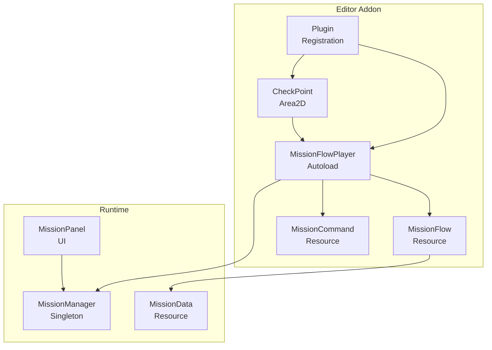
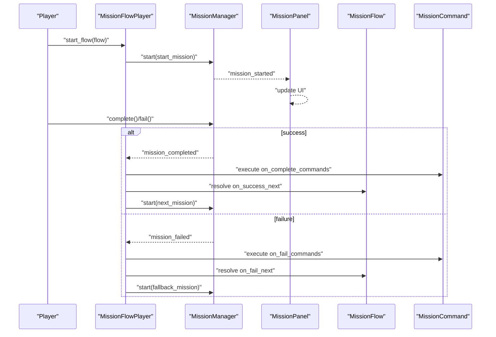
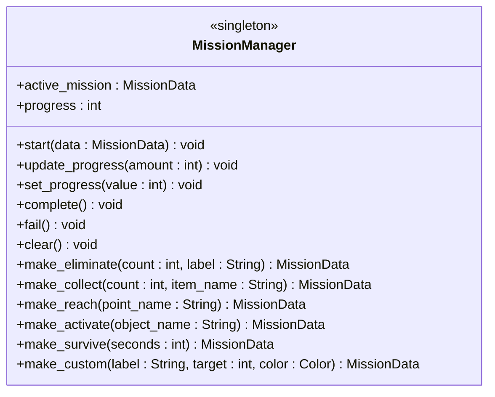
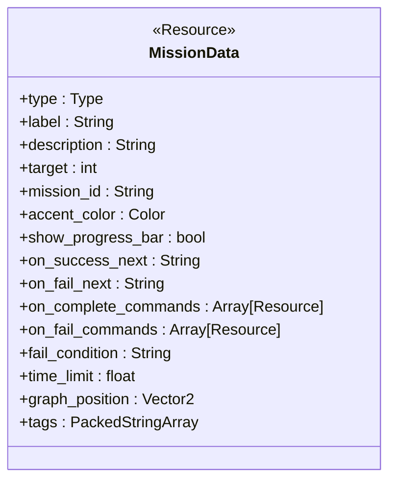
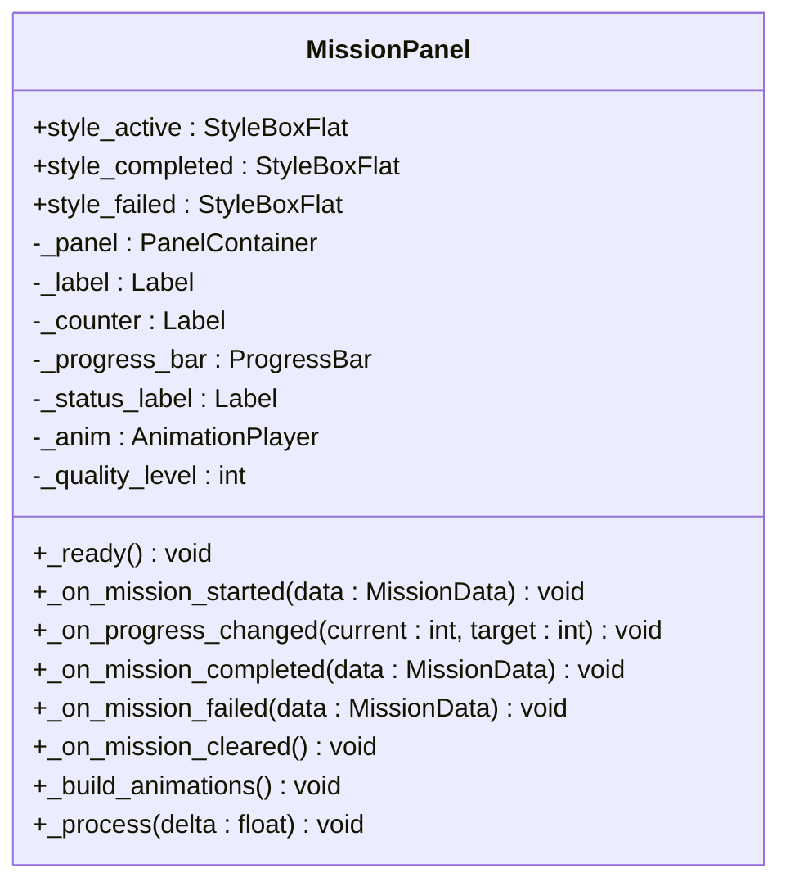
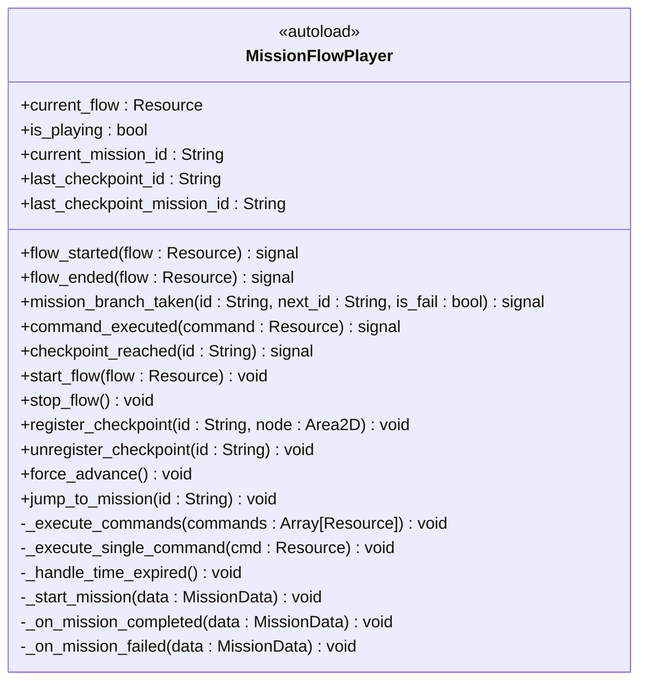
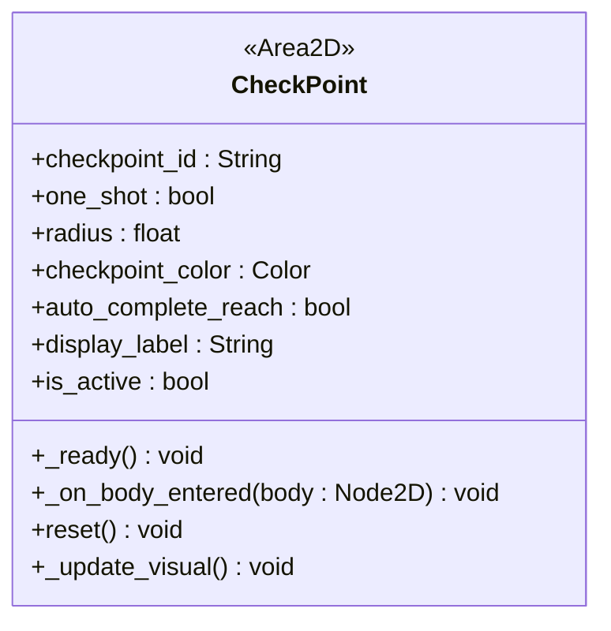
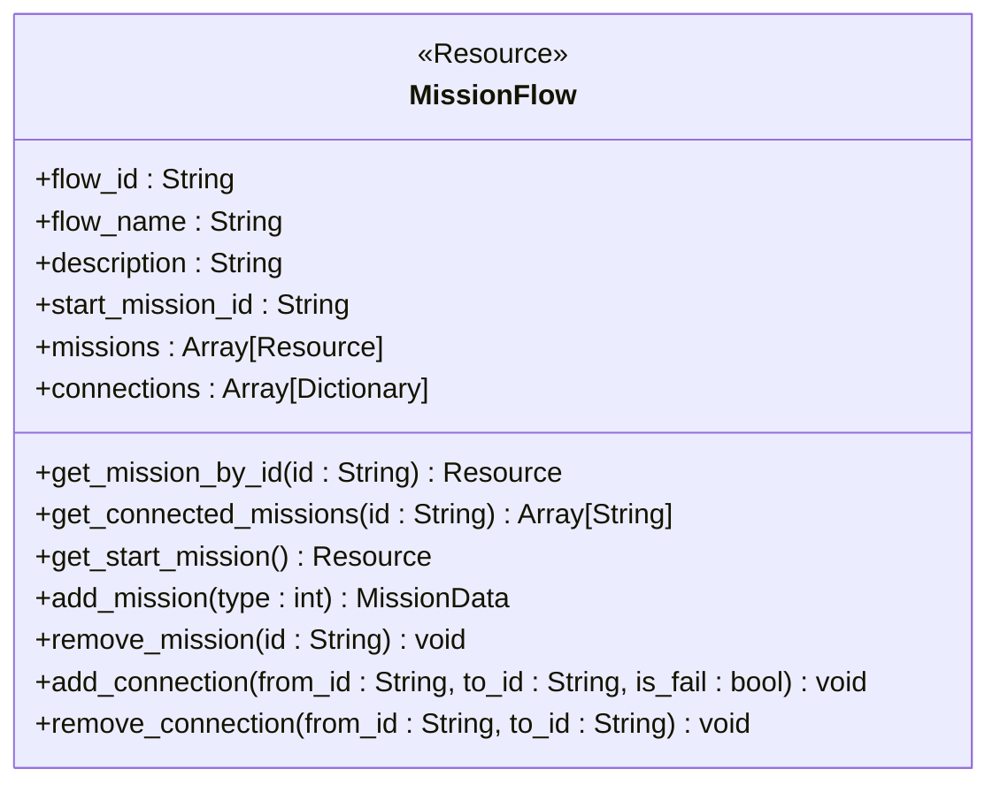
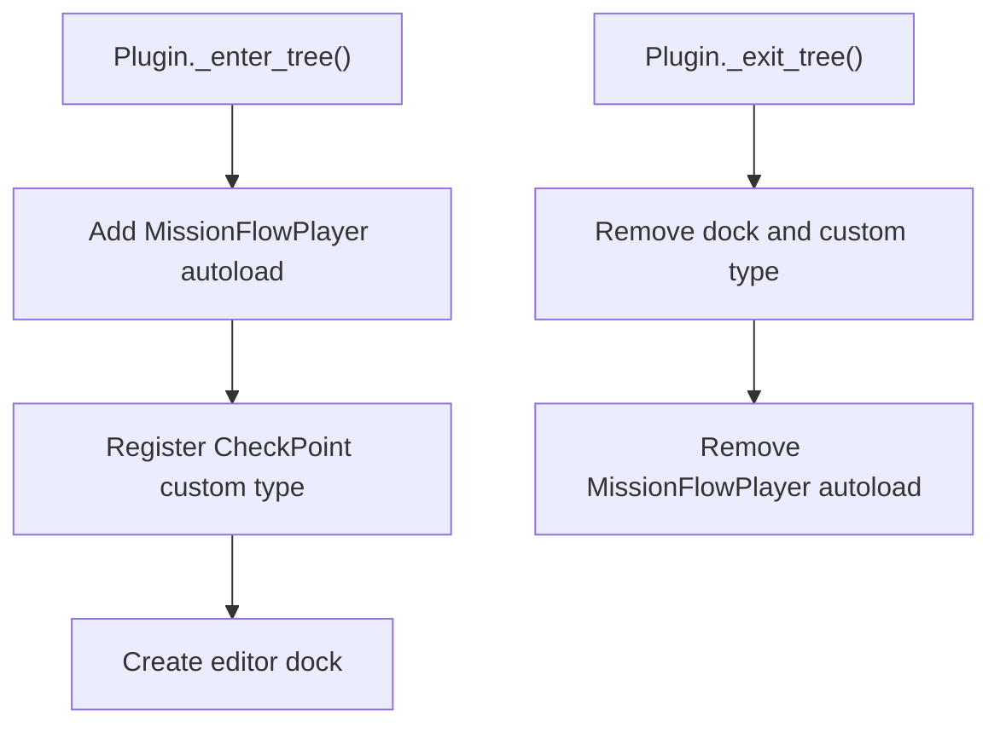
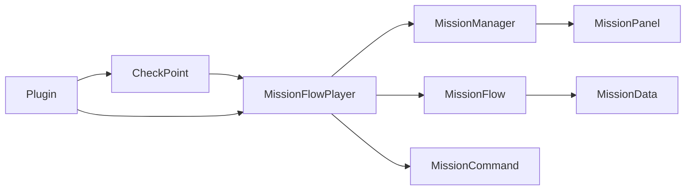

# Mission System API

<cite>
**Referenced Files in This Document**
- [mission_manager.gd](file://Scripts/mission_manager.gd)
- [mission_data.gd](file://Scripts/mission_data.gd)
- [mission_panel.gd](file://Scripts/mission_panel.gd)
- [plugin.gd](file://addons/mission_editor/plugin.gd)
- [mission_flow.gd](file://addons/mission_editor/mission_flow.gd)
- [mission_flow_player.gd](file://addons/mission_editor/mission_flow_player.gd)
- [checkpoint.gd](file://addons/mission_editor/checkpoint.gd)
- [example_tutorial_flow.gd](file://addons/mission_editor/examples/example_tutorial_flow.gd)
</cite>

## Table of Contents
1. [Introduction](#introduction)
2. [Project Structure](#project-structure)
3. [Core Components](#core-components)
4. [Architecture Overview](#architecture-overview)
5. [Detailed Component Analysis](#detailed-component-analysis)
6. [Dependency Analysis](#dependency-analysis)
7. [Performance Considerations](#performance-considerations)
8. [Troubleshooting Guide](#troubleshooting-guide)
9. [Conclusion](#conclusion)
10. [Appendices](#appendices)

## Introduction
This document provides comprehensive API documentation for the Mission System, covering MissionManager, MissionData, and MissionPanel classes. It explains mission flow control, objective tracking, checkpoint management, and dynamic mission creation. It also covers integration with the Mission Flow Editor addon, mission persistence and progress tracking, and multiplayer synchronization patterns.

## Project Structure
The Mission System consists of three core runtime components and an editor addon:
- Runtime core: MissionManager (singleton), MissionData (Resource), MissionPanel (UI)
- Editor addon: MissionFlow (Resource), MissionFlowPlayer (Autoload), CheckPoint (Area2D), MissionCommand (Resource), plugin registration

**Diagram sources**
- [mission_manager.gd:18-27](file://Scripts/mission_manager.gd#L18-L27)
- [mission_data.gd:4-15](file://Scripts/mission_data.gd#L4-L15)
- [mission_panel.gd:44-48](file://Scripts/mission_panel.gd#L44-L48)
- [mission_flow.gd:5-25](file://addons/mission_editor/mission_flow.gd#L5-L25)
- [mission_flow_player.gd:10-23](file://addons/mission_editor/mission_flow_player.gd#L10-L23)
- [checkpoint.gd:6-7](file://addons/mission_editor/checkpoint.gd#L6-L7)
- [plugin.gd:5-47](file://addons/mission_editor/plugin.gd#L5-L47)

**Section sources**
- [mission_manager.gd:1-169](file://Scripts/mission_manager.gd#L1-L169)
- [mission_data.gd:1-66](file://Scripts/mission_data.gd#L1-L66)
- [mission_panel.gd:1-359](file://Scripts/mission_panel.gd#L1-L359)
- [mission_flow.gd:1-134](file://addons/mission_editor/mission_flow.gd#L1-L134)
- [mission_flow_player.gd:1-379](file://addons/mission_editor/mission_flow_player.gd#L1-L379)
- [checkpoint.gd:1-231](file://addons/mission_editor/checkpoint.gd#L1-L231)
- [plugin.gd:1-109](file://addons/mission_editor/plugin.gd#L1-L109)

## Core Components
This section documents the public APIs and behaviors of the core components.

- MissionManager
  - Signals: mission_started, mission_progress_changed, mission_completed, mission_failed, mission_cleared
  - Public properties: active_mission (read-only), progress (read-only)
  - Public methods:
    - start(data: MissionData): starts a mission, replacing any active mission
    - update_progress(amount: int = 1): increments progress (clamped to target)
    - set_progress(value: int): sets absolute progress (clamped to target)
    - complete(): forces completion of the active mission
    - fail(): forces failure of the active mission
    - clear(): removes active mission and hides HUD
    - Factory helpers: make_eliminate, make_collect, make_reach, make_activate, make_survive, make_custom

- MissionData
  - Enum Type: ELIMINATE, COLLECT, REACH, ACTIVATE, SURVIVE, CUSTOM
  - Exported fields: type, label, description, target, mission_id, accent_color, show_progress_bar
  - Flow system fields: on_success_next, on_fail_next, on_complete_commands, on_fail_commands, fail_condition, time_limit, graph_position, tags

- MissionPanel
  - Connects automatically to MissionManager signals
  - UI updates: label, counter or progress bar, status label, animations, shader state
  - Properties: style_active, style_completed, style_failed, quality level

**Section sources**
- [mission_manager.gd:4-100](file://Scripts/mission_manager.gd#L4-L100)
- [mission_manager.gd:105-169](file://Scripts/mission_manager.gd#L105-L169)
- [mission_data.gd:7-66](file://Scripts/mission_data.gd#L7-L66)
- [mission_panel.gd:28-169](file://Scripts/mission_panel.gd#L28-L169)

## Architecture Overview
The Mission System integrates runtime mission control with a flow-based scripting system and an editor addon. MissionFlowPlayer listens to MissionManager events and orchestrates branching, command execution, and checkpoint management.

**Diagram sources**
- [mission_flow_player.gd:87-115](file://addons/mission_editor/mission_flow_player.gd#L87-L115)
- [mission_flow_player.gd:175-195](file://addons/mission_editor/mission_flow_player.gd#L175-L195)
- [mission_flow_player.gd:197-216](file://addons/mission_editor/mission_flow_player.gd#L197-L216)
- [mission_manager.gd:49-99](file://Scripts/mission_manager.gd#L49-L99)
- [mission_panel.gd:53-169](file://Scripts/mission_panel.gd#L53-L169)
- [mission_flow.gd:28-54](file://addons/mission_editor/mission_flow.gd#L28-L54)

## Detailed Component Analysis

### MissionManager
MissionManager is the central runtime controller for missions. It exposes lifecycle methods, progress manipulation, and factory helpers for quick mission creation.

Key behaviors:
- Starts a mission and emits mission_started
- Updates progress and emits mission_progress_changed
- Completes or fails the active mission and emits appropriate signals
- Provides factory helpers to create common mission types with sensible defaults

**Diagram sources**
- [mission_manager.gd:49-169](file://Scripts/mission_manager.gd#L49-L169)

**Section sources**
- [mission_manager.gd:49-100](file://Scripts/mission_manager.gd#L49-L100)
- [mission_manager.gd:105-169](file://Scripts/mission_manager.gd#L105-L169)

### MissionData
MissionData describes a single mission objective declaratively. It supports six mission types and includes flow scripting metadata.

Key fields:
- Type enum and exported properties
- Flow scripting: on_success_next, on_fail_next, on_complete_commands, on_fail_commands, time_limit, graph_position, tags

**Diagram sources**
- [mission_data.gd:17-66](file://Scripts/mission_data.gd#L17-L66)

**Section sources**
- [mission_data.gd:7-66](file://Scripts/mission_data.gd#L7-L66)

### MissionPanel
MissionPanel is the HUD component that renders mission state and reacts to MissionManager signals. It manages UI elements, animations, and shader effects.

Key behaviors:
- Connects to MissionManager signals and updates UI accordingly
- Handles boolean missions (REACH/ACTIVATE) vs numeric targets
- Applies styles and animations based on mission state
- Syncs shader parameters for visual effects

**Diagram sources**
- [mission_panel.gd:10-48](file://Scripts/mission_panel.gd#L10-L48)
- [mission_panel.gd:53-169](file://Scripts/mission_panel.gd#L53-L169)
- [mission_panel.gd:180-322](file://Scripts/mission_panel.gd#L180-L322)

**Section sources**
- [mission_panel.gd:28-169](file://Scripts/mission_panel.gd#L28-L169)
- [mission_panel.gd:180-359](file://Scripts/mission_panel.gd#L180-L359)

### MissionFlowPlayer
MissionFlowPlayer orchestrates flow-based mission sequences, branching, command execution, and checkpoint management. It integrates with MissionManager and exposes signals for external listeners.

Key behaviors:
- start_flow(flow): initializes playback, resumes from saved checkpoint if available
- listen to mission_completed/mission_failed and branch accordingly
- execute on_complete_commands/on_fail_commands
- manage time_limit and trigger failure on expiration
- register/unregister checkpoints and toggle visibility

**Diagram sources**
- [mission_flow_player.gd:10-48](file://addons/mission_editor/mission_flow_player.gd#L10-L48)
- [mission_flow_player.gd:87-158](file://addons/mission_editor/mission_flow_player.gd#L87-L158)
- [mission_flow_player.gd:175-222](file://addons/mission_editor/mission_flow_player.gd#L175-L222)
- [mission_flow_player.gd:228-379](file://addons/mission_editor/mission_flow_player.gd#L228-L379)

**Section sources**
- [mission_flow_player.gd:53-131](file://addons/mission_editor/mission_flow_player.gd#L53-L131)
- [mission_flow_player.gd:87-158](file://addons/mission_editor/mission_flow_player.gd#L87-L158)
- [mission_flow_player.gd:175-222](file://addons/mission_editor/mission_flow_player.gd#L175-L222)
- [mission_flow_player.gd:228-379](file://addons/mission_editor/mission_flow_player.gd#L228-L379)

### CheckPoint
CheckPoint is a reusable Area2D node used to mark locations for REACH/ACTIVATE missions. It integrates with MissionFlowPlayer for checkpoint registration and with MissionManager for mission completion.

Key behaviors:
- Registers itself with MissionFlowPlayer on ready
- Detects player entry and triggers completion for matching active missions
- Supports one-shot activation and visual feedback
- Exposes reset() to reuse checkpoints

**Diagram sources**
- [checkpoint.gd:9-36](file://addons/mission_editor/checkpoint.gd#L9-L36)
- [checkpoint.gd:44-150](file://addons/mission_editor/checkpoint.gd#L44-L150)
- [checkpoint.gd:165-169](file://addons/mission_editor/checkpoint.gd#L165-L169)

**Section sources**
- [checkpoint.gd:44-150](file://addons/mission_editor/checkpoint.gd#L44-L150)
- [checkpoint.gd:165-169](file://addons/mission_editor/checkpoint.gd#L165-L169)

### MissionFlow
MissionFlow is a Resource that defines a complete mission sequence, including missions, connections, and start point. It provides helpers to manage and resolve mission graphs.

Key behaviors:
- Store missions and connections
- Resolve start mission and connected missions
- Auto-generate unique mission IDs
- Clean up dangling references when removing missions

**Diagram sources**
- [mission_flow.gd:8-26](file://addons/mission_editor/mission_flow.gd#L8-L26)
- [mission_flow.gd:28-54](file://addons/mission_editor/mission_flow.gd#L28-L54)
- [mission_flow.gd:57-80](file://addons/mission_editor/mission_flow.gd#L57-L80)
- [mission_flow.gd:82-98](file://addons/mission_editor/mission_flow.gd#L82-L98)
- [mission_flow.gd:108-134](file://addons/mission_editor/mission_flow.gd#L108-L134)

**Section sources**
- [mission_flow.gd:28-54](file://addons/mission_editor/mission_flow.gd#L28-L54)
- [mission_flow.gd:57-80](file://addons/mission_editor/mission_flow.gd#L57-L80)
- [mission_flow.gd:82-98](file://addons/mission_editor/mission_flow.gd#L82-L98)
- [mission_flow.gd:108-134](file://addons/mission_editor/mission_flow.gd#L108-L134)

### Plugin Registration
The editor plugin registers MissionFlowPlayer as an autoload, adds the CheckPoint custom type, and creates the editor dock.

Key behaviors:
- Add autoload MissionFlowPlayer if missing
- Register CheckPoint as a custom type
- Create and dock the editor UI
- Provide save/open dialogs for flows

**Diagram sources**
- [plugin.gd:15-47](file://addons/mission_editor/plugin.gd#L15-L47)
- [plugin.gd:50-109](file://addons/mission_editor/plugin.gd#L50-L109)

**Section sources**
- [plugin.gd:15-47](file://addons/mission_editor/plugin.gd#L15-L47)
- [plugin.gd:50-109](file://addons/mission_editor/plugin.gd#L50-L109)

## Dependency Analysis
The following diagram shows the primary dependencies among components.

**Diagram sources**
- [mission_manager.gd:44-48](file://Scripts/mission_manager.gd#L44-L48)
- [mission_panel.gd:44-48](file://Scripts/mission_panel.gd#L44-L48)
- [mission_flow_player.gd:54-59](file://addons/mission_editor/mission_flow_player.gd#L54-L59)
- [mission_flow.gd:20-21](file://addons/mission_editor/mission_flow.gd#L20-L21)
- [checkpoint.gd:87-90](file://addons/mission_editor/checkpoint.gd#L87-L90)
- [plugin.gd:17-27](file://addons/mission_editor/plugin.gd#L17-L27)

**Section sources**
- [mission_manager.gd:44-48](file://Scripts/mission_manager.gd#L44-L48)
- [mission_panel.gd:44-48](file://Scripts/mission_panel.gd#L44-L48)
- [mission_flow_player.gd:54-59](file://addons/mission_editor/mission_flow_player.gd#L54-L59)
- [mission_flow.gd:20-21](file://addons/mission_editor/mission_flow.gd#L20-L21)
- [checkpoint.gd:87-90](file://addons/mission_editor/checkpoint.gd#L87-L90)
- [plugin.gd:17-27](file://addons/mission_editor/plugin.gd#L17-L27)

## Performance Considerations
- UI rendering: MissionPanel builds animations based on graphics preset; lower presets reduce animation complexity.
- Shader updates: MissionPanel synchronizes shader parameters each frame; keep targets minimal to avoid unnecessary updates.
- Flow execution: Command execution is asynchronous; delays and dialog durations should be tuned for gameplay pacing.
- Checkpoint detection: Area2D monitoring toggles are controlled by MissionFlowPlayer; ensure one-shot checkpoints are disabled after use to prevent redundant triggers.

## Troubleshooting Guide
Common issues and resolutions:
- Mission panel does not appear
  - Ensure MissionPanel is attached to the HUD and connected to MissionManager signals.
  - Verify MissionManager.mission_started is emitted and received by MissionPanel.
- Progress not updating
  - Confirm MissionManager.update_progress/set_progress is called and MissionManager.mission_progress_changed is emitted.
  - For boolean missions (REACH/ACTIVATE), progress is ignored; ensure target is set to 0.
- Flow branching not working
  - Verify MissionData.on_success_next/on_fail_next IDs match existing missions.
  - Ensure MissionFlowPlayer is started and listening to MissionManager signals.
- Checkpoint not triggering
  - Confirm CheckPoint.checkpoint_id is set and registered with MissionFlowPlayer.
  - Ensure player is in the "players" group and enters the area.
  - For one-shot checkpoints, remember to reset after use.

**Section sources**
- [mission_panel.gd:53-169](file://Scripts/mission_panel.gd#L53-L169)
- [mission_manager.gd:59-75](file://Scripts/mission_manager.gd#L59-L75)
- [mission_flow_player.gd:175-216](file://addons/mission_editor/mission_flow_player.gd#L175-L216)
- [checkpoint.gd:114-150](file://addons/mission_editor/checkpoint.gd#L114-L150)

## Conclusion
The Mission System provides a robust framework for runtime mission control, flow-based scripting, and interactive checkpoint management. MissionManager handles mission lifecycle and progress, MissionData encapsulates mission definitions, and MissionPanel delivers a polished UI. MissionFlowPlayer extends the system with branching, commands, and checkpoint orchestration, while the editor plugin enables authoring and integration.

## Appendices

### API Reference Tables

- MissionManager
  - Methods: start(data), update_progress(amount), set_progress(value), complete(), fail(), clear()
  - Signals: mission_started(data), mission_progress_changed(current, target), mission_completed(data), mission_failed(data), mission_cleared()
  - Properties: active_mission, progress

- MissionData
  - Fields: type, label, description, target, mission_id, accent_color, show_progress_bar
  - Flow fields: on_success_next, on_fail_next, on_complete_commands, on_fail_commands, fail_condition, time_limit, graph_position, tags

- MissionPanel
  - Nodes: MissionPanelInner, MissionLabel, MissionCounter, MissionProgressBar, MissionStatus, MissionAnim
  - Styles: style_active, style_completed, style_failed
  - Methods: _ready(), _on_mission_started(), _on_progress_changed(), _on_mission_completed(), _on_mission_failed(), _on_mission_cleared(), _build_animations()

- MissionFlowPlayer
  - Properties: current_flow, is_playing, current_mission_id, last_checkpoint_id, last_checkpoint_mission_id
  - Signals: flow_started(flow), flow_ended(flow), mission_branch_taken(id, next_id, is_fail), command_executed(command), checkpoint_reached(id)
  - Methods: start_flow(flow), stop_flow(), register_checkpoint(id, node), unregister_checkpoint(id), force_advance(), jump_to_mission(id)

- CheckPoint
  - Fields: checkpoint_id, one_shot, radius, checkpoint_color, auto_complete_reach, display_label, is_active
  - Methods: _ready(), _on_body_entered(body), reset(), _update_visual()

- MissionFlow
  - Fields: flow_id, flow_name, description, start_mission_id, missions, connections
  - Methods: get_mission_by_id(id), get_connected_missions(id), get_start_mission(), add_mission(type), remove_mission(id), add_connection(from_id, to_id, is_fail), remove_connection(from_id, to_id), _generate_unique_id(), _cleanup_connections(removed_id)

### Examples and Patterns

- Dynamic mission creation
  - Use MissionManager factory helpers to quickly create common mission types with default labels and colors.
  - Example paths:
    - [mission_manager.gd:105-169](file://Scripts/mission_manager.gd#L105-L169)

- Objective completion
  - Call MissionManager.complete() when the objective is met (e.g., eliminating enemies, collecting items).
  - Example paths:
    - [mission_manager.gd:77-86](file://Scripts/mission_manager.gd#L77-L86)

- Flow scripting
  - Define MissionData.on_success_next/on_fail_next to control branching.
  - Example paths:
    - [mission_data.gd:43-56](file://Scripts/mission_data.gd#L43-L56)
    - [mission_flow_player.gd:184-194](file://addons/mission_editor/mission_flow_player.gd#L184-L194)
    - [mission_flow_player.gd:206-215](file://addons/mission_editor/mission_flow_player.gd#L206-L215)

- Integration with Mission Editor addon
  - Start flows via MissionFlowPlayer.start_flow() and define missions in the editor.
  - Example paths:
    - [plugin.gd:15-33](file://addons/mission_editor/plugin.gd#L15-L33)
    - [mission_flow_player.gd:87-115](file://addons/mission_editor/mission_flow_player.gd#L87-L115)
    - [example_tutorial_flow.gd:14-153](file://addons/mission_editor/examples/example_tutorial_flow.gd#L14-L153)

- Mission persistence and progress tracking
  - Use MissionManager.active_mission and MissionManager.progress for runtime state.
  - Example paths:
    - [mission_manager.gd:39-44](file://Scripts/mission_manager.gd#L39-L44)

- Multiplayer mission synchronization patterns
  - Synchronize MissionManager calls across clients to maintain consistent mission state.
  - Example paths:
    - [mission_manager.gd:49-99](file://Scripts/mission_manager.gd#L49-L99)
    - [mission_flow_player.gd:175-216](file://addons/mission_editor/mission_flow_player.gd#L175-L216)