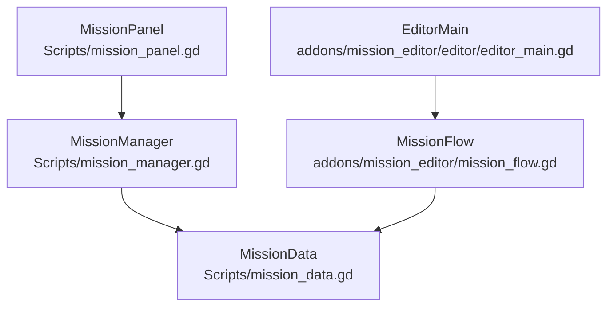
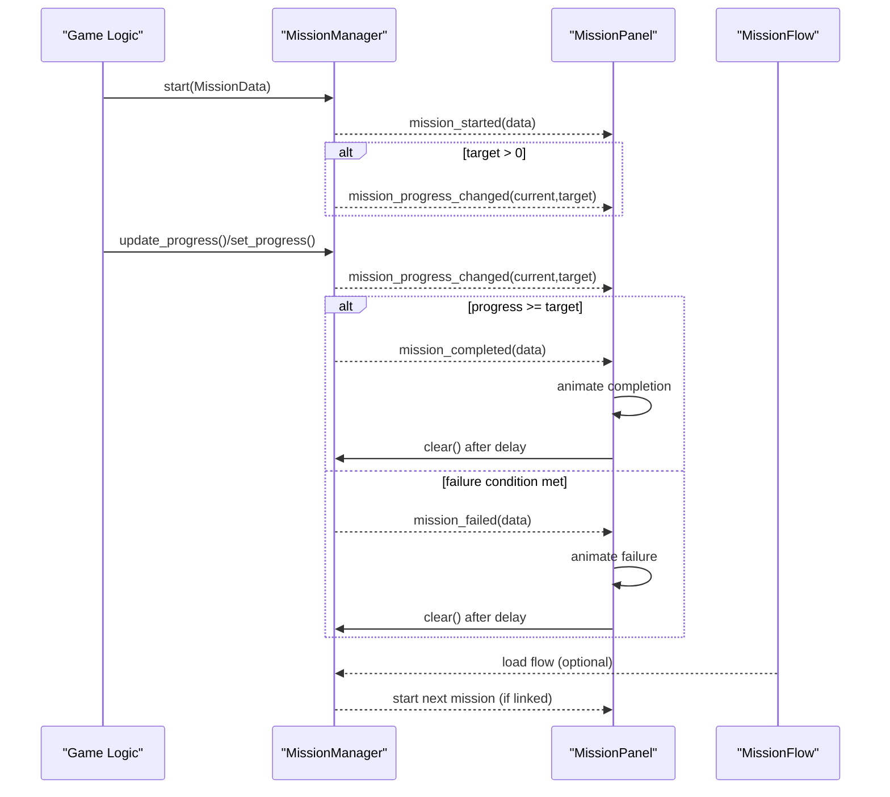
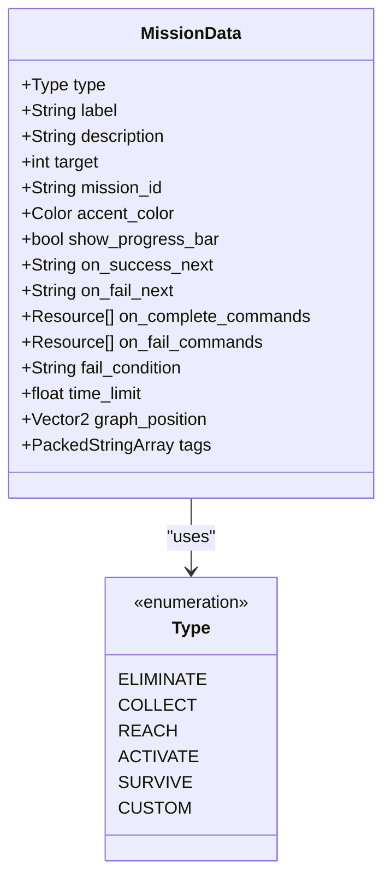
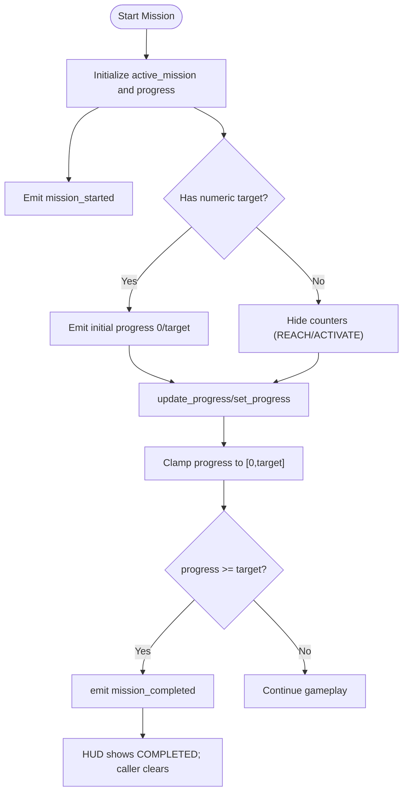
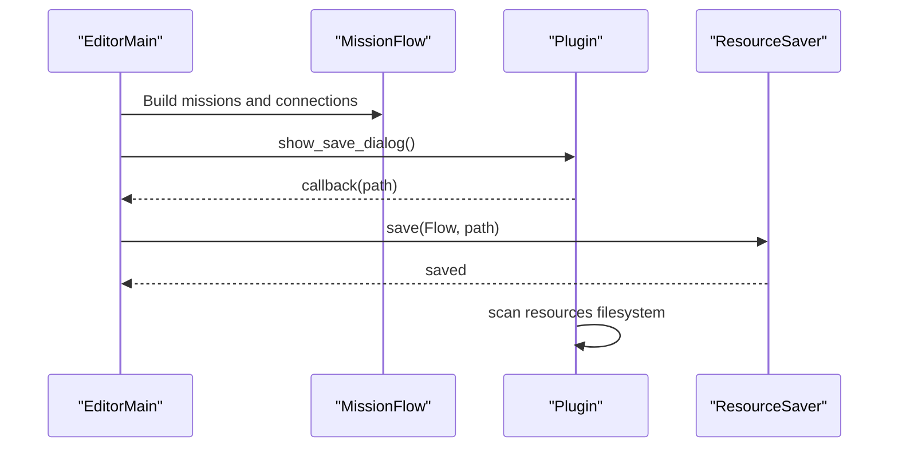

# MissionData Model

<cite>
**Referenced Files in This Document**
- [mission_data.gd](file://Scripts/mission_data.gd)
- [mission_manager.gd](file://Scripts/mission_manager.gd)
- [mission_panel.gd](file://Scripts/mission_panel.gd)
- [mission_flow.gd](file://addons/mission_editor/mission_flow.gd)
- [editor_main.gd](file://addons/mission_editor/editor/editor_main.gd)
- [creazionemissioni.md](file://creazionemissioni.md)
</cite>

## Table of Contents
1. [Introduction](#introduction)
2. [Project Structure](#project-structure)
3. [Core Components](#core-components)
4. [Architecture Overview](#architecture-overview)
5. [Detailed Component Analysis](#detailed-component-analysis)
6. [Dependency Analysis](#dependency-analysis)
7. [Performance Considerations](#performance-considerations)
8. [Troubleshooting Guide](#troubleshooting-guide)
9. [Conclusion](#conclusion)
10. [Appendices](#appendices)

## Introduction
This document provides comprehensive documentation for the MissionData model and related systems. It explains the MissionData class structure, all mission types, properties, validation rules, and integration patterns with the mission system. It also covers mission creation, serialization/deserialization, persistence, and the data flow between components.

## Project Structure
The mission system spans three primary scripts plus editor support:
- MissionData defines the mission resource model
- MissionManager is the singleton orchestrating active missions and emitting signals
- MissionPanel renders the HUD panel and reacts to mission events
- MissionFlow and editor components enable saving/loading mission flows (.tres) and graph editing

**Diagram sources**
- [mission_data.gd:1-66](file://Scripts/mission_data.gd#L1-L66)
- [mission_manager.gd:1-169](file://Scripts/mission_manager.gd#L1-L169)
- [mission_panel.gd:1-359](file://Scripts/mission_panel.gd#L1-L359)
- [mission_flow.gd:1-133](file://addons/mission_editor/mission_flow.gd#L1-L133)
- [editor_main.gd:382-777](file://addons/mission_editor/editor/editor_main.gd#L382-L777)

**Section sources**
- [mission_data.gd:1-66](file://Scripts/mission_data.gd#L1-L66)
- [mission_manager.gd:1-169](file://Scripts/mission_manager.gd#L1-L169)
- [mission_panel.gd:1-359](file://Scripts/mission_panel.gd#L1-L359)
- [mission_flow.gd:1-133](file://addons/mission_editor/mission_flow.gd#L1-L133)
- [editor_main.gd:382-777](file://addons/mission_editor/editor/editor_main.gd#L382-L777)

## Core Components
- MissionData: Resource representing a single mission with typed properties and flow controls
- MissionManager: Singleton managing lifecycle, progress, and signals
- MissionPanel: HUD renderer responding to manager signals
- MissionFlow: Resource container for mission graphs with persistence support
- EditorMain: Graphical editor for designing mission flows and saving .tres files

Key responsibilities:
- Define mission metadata (type, label, target, mission_id, accent_color, show_progress_bar)
- Support branching and commands for advanced flows
- Provide factory helpers for quick mission creation
- Persist and load mission flows for reuse

**Section sources**
- [mission_data.gd:1-66](file://Scripts/mission_data.gd#L1-L66)
- [mission_manager.gd:1-169](file://Scripts/mission_manager.gd#L1-L169)
- [mission_panel.gd:1-359](file://Scripts/mission_panel.gd#L1-L359)
- [mission_flow.gd:1-133](file://addons/mission_editor/mission_flow.gd#L1-L133)
- [editor_main.gd:382-777](file://addons/mission_editor/editor/editor_main.gd#L382-L777)

## Architecture Overview
The mission system follows a signal-driven architecture:
- MissionManager emits lifecycle signals
- MissionPanel listens and updates UI
- MissionFlow persists mission graphs and supports branching
- EditorMain enables authoring and saving flows to .tres

**Diagram sources**
- [mission_manager.gd:49-99](file://Scripts/mission_manager.gd#L49-L99)
- [mission_panel.gd:53-169](file://Scripts/mission_panel.gd#L53-L169)
- [mission_flow.gd:50-57](file://addons/mission_editor/mission_flow.gd#L50-L57)

## Detailed Component Analysis

### MissionData Model
MissionData is a Resource subclass defining a single mission. It includes:
- Type enumeration: ELIMINATE, COLLECT, REACH, ACTIVATE, SURVIVE, CUSTOM
- Core properties: type, label, description, target, mission_id, accent_color, show_progress_bar
- Flow controls: on_success_next, on_fail_next, on_complete_commands, on_fail_commands, fail_condition, time_limit, graph_position, tags

Validation rules and behaviors:
- target semantics depend on type:
  - ELIMINATE/COLLECT/SURVIVE: numeric target; progress clamped to target
  - REACH/ACTIVATE: target ignored (boolean completion); progress bar hidden
  - CUSTOM: target optional; progress managed externally
- show_progress_bar toggles UI rendering between numeric counter and progress bar
- mission_id must be unique within a flow for branching to work
- time_limit enables timeout-based failure conditions
- graph_position and tags are editor metadata for flow visualization

**Diagram sources**
- [mission_data.gd:7-65](file://Scripts/mission_data.gd#L7-L65)

**Section sources**
- [mission_data.gd:7-65](file://Scripts/mission_data.gd#L7-L65)

### Mission Types and Properties
- ELIMINATE: Eliminate N enemies; target is integer count; progress bar optional
- COLLECT: Collect N items; target is integer count; progress bar optional
- REACH: Reach a position/marker; target is ignored (boolean); no counter shown
- ACTIVATE: Activate an interactive object; target is ignored (boolean); no counter shown
- SURVIVE: Survive N seconds; target is seconds; progress bar enabled
- CUSTOM: Free-form objective; target optional; external progress management

Property usage patterns:
- label: short HUD text; supports translation keys
- description: extended tooltip/pop-up text
- accent_color: theme color applied to HUD elements
- show_progress_bar: toggles UI mode
- mission_id: unique identifier for linking flows
- on_success_next/on_fail_next: branching identifiers
- on_complete_commands/on_fail_commands: command lists executed on state transitions
- fail_condition/time_limit: dynamic failure conditions
- graph_position/tags: editor metadata

**Section sources**
- [mission_data.gd:7-65](file://Scripts/mission_data.gd#L7-L65)
- [creazionemissioni.md:25-36](file://creazionemissioni.md#L25-L36)

### MissionManager Integration
MissionManager provides:
- Lifecycle API: start(data), update_progress(amount), set_progress(value), complete(), fail(), clear()
- Signals: mission_started, mission_progress_changed, mission_completed, mission_failed, mission_cleared
- Read-only properties: active_mission, progress
- Factory helpers: make_eliminate, make_collect, make_reach, make_activate, make_survive, make_custom

Progress handling:
- Progress is clamped to [0, target]; completion triggers automatic completion signal
- Boolean-type missions (REACH/ACTIVATE) bypass numeric progress
- Factory helpers preconfigure defaults and colors

**Diagram sources**
- [mission_manager.gd:49-99](file://Scripts/mission_manager.gd#L49-L99)

**Section sources**
- [mission_manager.gd:39-99](file://Scripts/mission_manager.gd#L39-L99)
- [mission_manager.gd:105-168](file://Scripts/mission_manager.gd#L105-L168)

### MissionPanel Rendering
MissionPanel connects to MissionManager signals and updates the HUD:
- On mission_started: sets label, accent color, counter/progress bar visibility, applies active style
- On progress changed: updates counter or progress bar; pulses accent color toward white near completion
- On completion/failed: shows status label, applies style, plays animations, auto-clears after delay
- On cleared: slides out and hides

Quality settings influence animations and shader parameters.

**Section sources**
- [mission_panel.gd:53-169](file://Scripts/mission_panel.gd#L53-L169)
- [mission_panel.gd:323-359](file://Scripts/mission_panel.gd#L323-L359)

### MissionFlow Persistence and Serialization
MissionFlow is a Resource that:
- Contains flow_id, flow_name, description, start_mission_id
- Holds an array of MissionData resources (missions)
- Tracks explicit connections between missions (connections)
- Generates unique mission_ids and cleans up dangling references

Saving/loading:
- EditorMain saves flows to .tres via ResourceSaver
- Plugin exposes save/open dialogs for .tres files
- Flows can be loaded at runtime and used to start missions

**Diagram sources**
- [mission_flow.gd:1-133](file://addons/mission_editor/mission_flow.gd#L1-L133)
- [editor_main.gd:742-749](file://addons/mission_editor/editor/editor_main.gd#L742-L749)
- [plugin.gd:66-83](file://addons/mission_editor/plugin.gd#L66-L83)

**Section sources**
- [mission_flow.gd:1-133](file://addons/mission_editor/mission_flow.gd#L1-L133)
- [editor_main.gd:742-749](file://addons/mission_editor/editor/editor_main.gd#L742-L749)
- [plugin.gd:66-83](file://addons/mission_editor/plugin.gd#L66-L83)

### Creating Custom Missions
Custom missions can be created directly or via factory helpers:
- Direct instantiation: set type, label, target, mission_id, accent_color
- Factory helpers: make_custom(label, target, color) for quick creation
- Boolean-type missions (REACH/ACTIVATE): set target to 0; HUD hides counters

Examples of creation patterns are documented in the project guide.

**Section sources**
- [mission_manager.gd:105-168](file://Scripts/mission_manager.gd#L105-L168)
- [creazionemissioni.md:42-59](file://creazionemissioni.md#L42-L59)

### Mission Serialization and Deserialization
- Save flows: EditorMain invokes ResourceSaver.save(flow, path)
- Load flows: Plugin.load_flow_resource(path) returns a MissionFlow Resource
- Runtime usage: MissionManager can start missions from loaded flows; branching links are resolved by mission_id

**Section sources**
- [editor_main.gd:742-749](file://addons/mission_editor/editor/editor_main.gd#L742-L749)
- [plugin.gd:77-82](file://addons/mission_editor/plugin.gd#L77-L82)
- [mission_flow.gd:28-33](file://addons/mission_editor/mission_flow.gd#L28-L33)

### Integration with the Mission System
- Start a mission: MissionManager.start(MissionData)
- Update progress: MissionManager.update_progress() or set_progress()
- React to completion/failure: connect to mission_completed/mission_failed signals
- Chain missions: use on_success_next/on_fail_next with unique mission_id values
- Persist flows: use MissionFlow and save/load .tres files

**Section sources**
- [mission_manager.gd:49-99](file://Scripts/mission_manager.gd#L49-L99)
- [mission_flow.gd:36-47](file://addons/mission_editor/mission_flow.gd#L36-L47)
- [creazionemissioni.md:104-145](file://creazionemissioni.md#L104-L145)

## Dependency Analysis
- MissionManager depends on MissionData for mission definition and on MissionPanel via signals
- MissionPanel depends on MissionManager for state and UI updates
- MissionFlow depends on MissionData for mission entries and manages branching
- EditorMain depends on MissionFlow for editing and saving flows

**Diagram sources**
- [mission_data.gd:1-66](file://Scripts/mission_data.gd#L1-L66)
- [mission_manager.gd:1-169](file://Scripts/mission_manager.gd#L1-L169)
- [mission_panel.gd:1-359](file://Scripts/mission_panel.gd#L1-L359)
- [mission_flow.gd:1-133](file://addons/mission_editor/mission_flow.gd#L1-L133)
- [editor_main.gd:382-777](file://addons/mission_editor/editor/editor_main.gd#L382-L777)

**Section sources**
- [mission_data.gd:1-66](file://Scripts/mission_data.gd#L1-L66)
- [mission_manager.gd:1-169](file://Scripts/mission_manager.gd#L1-L169)
- [mission_panel.gd:1-359](file://Scripts/mission_panel.gd#L1-L359)
- [mission_flow.gd:1-133](file://addons/mission_editor/mission_flow.gd#L1-L133)
- [editor_main.gd:382-777](file://addons/mission_editor/editor/editor_main.gd#L382-L777)

## Performance Considerations
- Prefer factory helpers for rapid mission creation to avoid repeated property assignments
- Use boolean-type missions (REACH/ACTIVATE) when progress is unnecessary to reduce UI overhead
- Limit excessive branching depth in flows to simplify loading and navigation
- Keep mission_id unique to prevent lookup failures and dangling references

## Troubleshooting Guide
Common issues and resolutions:
- Mission does not appear in HUD:
  - Ensure mission_id is set and unique
  - Verify MissionManager.start(data) is called
- Progress not updating:
  - Confirm target > 0 for numeric missions
  - Check update_progress/set_progress calls are invoked
- Branching not working:
  - Ensure on_success_next/on_fail_next match existing mission_id
  - Rebuild connections after removing or renaming missions
- Flow fails to load:
  - Verify .tres path exists and is accessible
  - Confirm MissionFlow resource structure is intact

**Section sources**
- [mission_manager.gd:49-99](file://Scripts/mission_manager.gd#L49-L99)
- [mission_flow.gd:120-133](file://addons/mission_editor/mission_flow.gd#L120-L133)
- [plugin.gd:77-82](file://addons/mission_editor/plugin.gd#L77-L82)

## Conclusion
The MissionData model, supported by MissionManager and MissionPanel, provides a robust framework for defining, tracking, and rendering missions. MissionFlow and the editor enable persistent, graph-based mission design. By following the documented patterns and validation rules, developers can create engaging, modular mission experiences.

## Appendices

### Mission Types Reference
- ELIMINATE: Integer target; progress counter
- COLLECT: Integer target; progress counter
- REACH: Boolean completion; no counter
- ACTIVATE: Boolean completion; no counter
- SURVIVE: Seconds target; progress bar enabled
- CUSTOM: Optional target; external progress management

**Section sources**
- [mission_data.gd:7-15](file://Scripts/mission_data.gd#L7-L15)
- [mission_manager.gd:105-168](file://Scripts/mission_manager.gd#L105-L168)