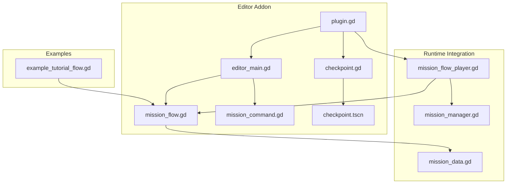
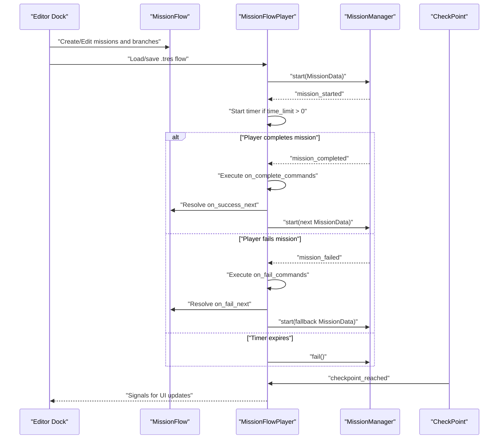
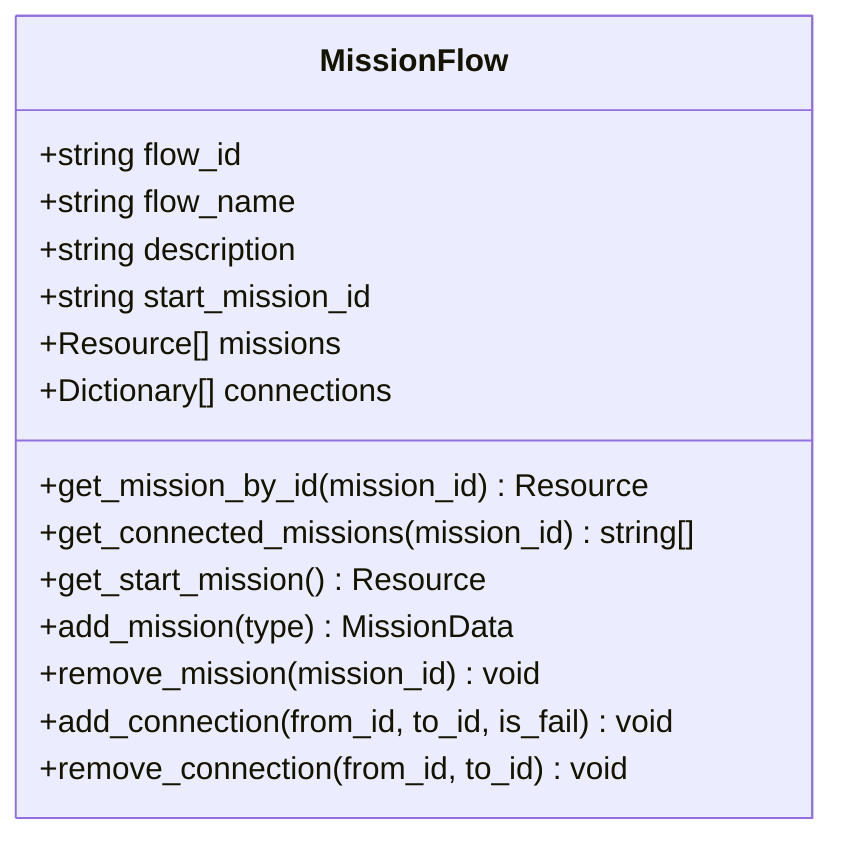
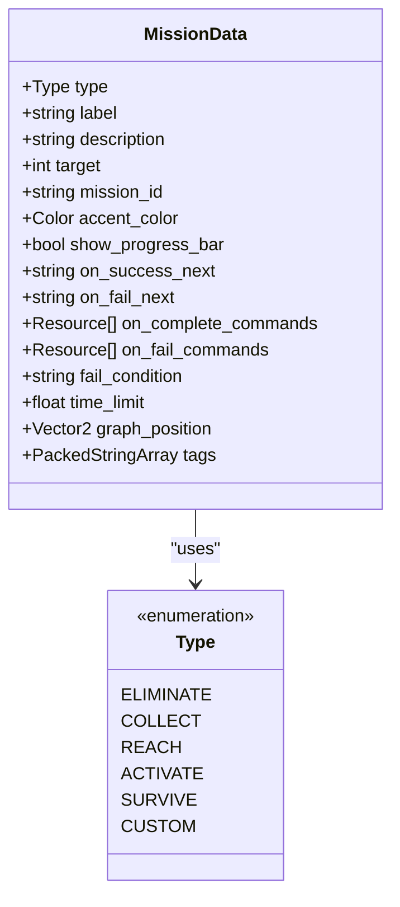
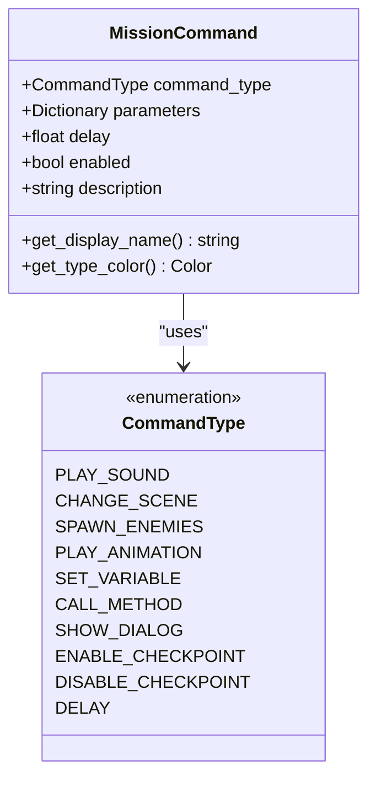
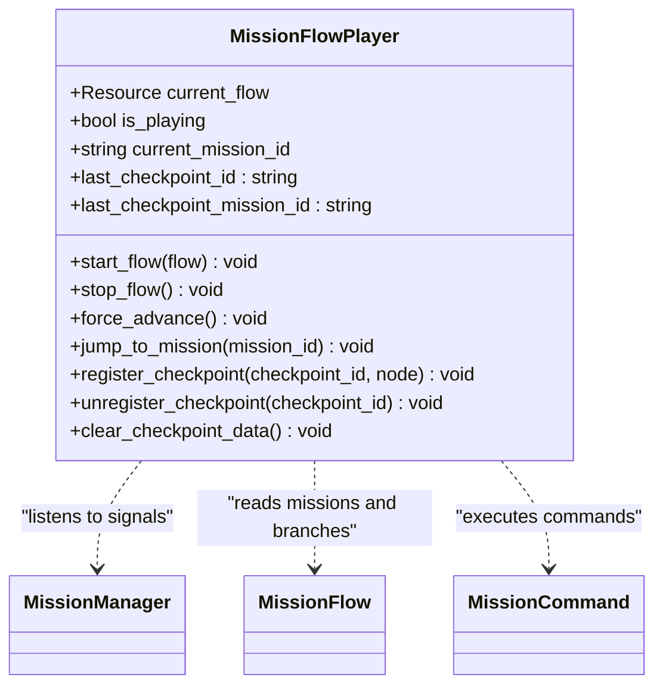
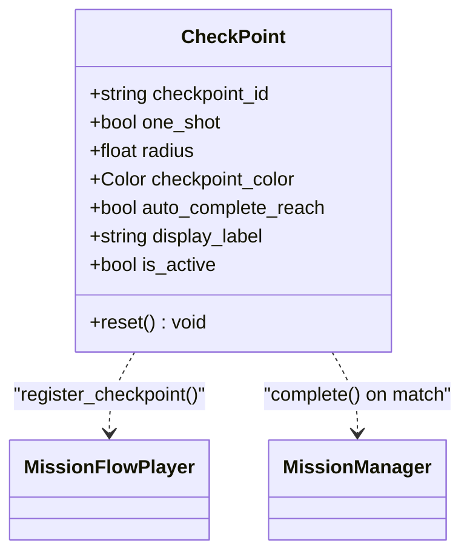
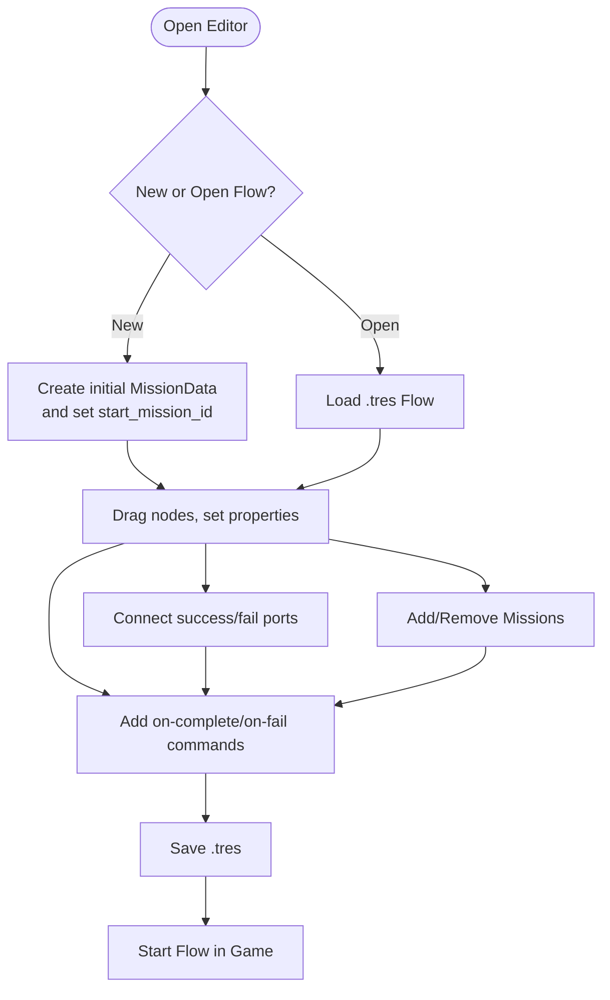
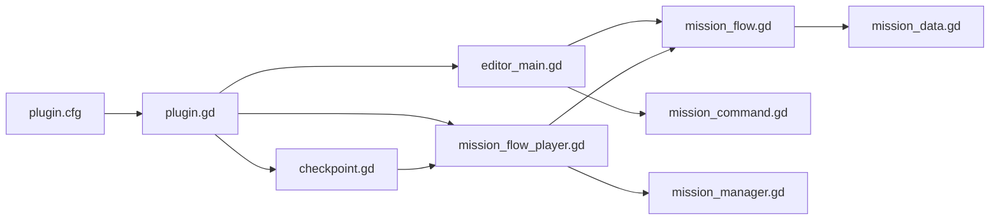

# MissionFlow and Editor Integration

<cite>
**Referenced Files in This Document**
- [plugin.gd](file://addons/mission_editor/plugin.gd)
- [plugin.cfg](file://addons/mission_editor/plugin.cfg)
- [editor_main.gd](file://addons/mission_editor/editor/editor_main.gd)
- [mission_flow.gd](file://addons/mission_editor/mission_flow.gd)
- [mission_flow_player.gd](file://addons/mission_editor/mission_flow_player.gd)
- [checkpoint.gd](file://addons/mission_editor/checkpoint.gd)
- [checkpoint.tscn](file://addons/mission_editor/checkpoint.tscn)
- [mission_command.gd](file://addons/mission_editor/mission_command.gd)
- [mission_data.gd](file://Scripts/mission_data.gd)
- [mission_manager.gd](file://Scripts/mission_manager.gd)
- [example_tutorial_flow.gd](file://addons/mission_editor/examples/example_tutorial_flow.gd)
- [GUIDA.md](file://addons/mission_editor/GUIDA.md)
- [creazionemissioni.md](file://creazionemissioni.md)
</cite>

## Table of Contents
1. [Introduction](#introduction)
2. [Project Structure](#project-structure)
3. [Core Components](#core-components)
4. [Architecture Overview](#architecture-overview)
5. [Detailed Component Analysis](#detailed-component-analysis)
6. [Dependency Analysis](#dependency-analysis)
7. [Performance Considerations](#performance-considerations)
8. [Troubleshooting Guide](#troubleshooting-guide)
9. [Conclusion](#conclusion)
10. [Appendices](#appendices)

## Introduction
This document explains the MissionFlow system and the visual mission editor addon for Godot 4.x. It covers the mission flow scripting language, checkpoint management, conditional branching, and dynamic mission creation. It also documents the integration between the editor addon and the runtime mission system, including data export/import and real-time preview capabilities. The guide includes practical examples, editor workflow steps, checkpoint placement, and mission validation strategies.

## Project Structure
The MissionFlow system is composed of:
- An editor plugin that adds a visual dock, custom CheckPoint node, and autoload for runtime.
- A flow resource that stores missions, branching, and connection metadata.
- A runtime player that orchestrates mission execution, branching, timers, and command execution.
- A CheckPoint node that integrates with the mission system for REACH/ACTIVATE triggers.
- A set of command resources that define actions executed on mission completion or failure.

**Diagram sources**
- [plugin.gd:1-109](file://addons/mission_editor/plugin.gd#L1-L109)
- [editor_main.gd:1-778](file://addons/mission_editor/editor/editor_main.gd#L1-L778)
- [mission_flow.gd:1-134](file://addons/mission_editor/mission_flow.gd#L1-L134)
- [mission_command.gd:1-98](file://addons/mission_editor/mission_command.gd#L1-L98)
- [checkpoint.gd:1-231](file://addons/mission_editor/checkpoint.gd#L1-L231)
- [checkpoint.tscn:1-96](file://addons/mission_editor/checkpoint.tscn#L1-L96)
- [mission_flow_player.gd:1-379](file://addons/mission_editor/mission_flow_player.gd#L1-L379)
- [mission_manager.gd:1-169](file://Scripts/mission_manager.gd#L1-L169)
- [mission_data.gd:1-66](file://Scripts/mission_data.gd#L1-L66)
- [example_tutorial_flow.gd:1-153](file://addons/mission_editor/examples/example_tutorial_flow.gd#L1-L153)

**Section sources**
- [plugin.gd:1-109](file://addons/mission_editor/plugin.gd#L1-L109)
- [plugin.cfg:1-8](file://addons/mission_editor/plugin.cfg#L1-L8)

## Core Components
- MissionFlow resource: Stores flow metadata, missions array, and explicit connections for graph rendering. Provides helpers to add/remove missions, connect/disconnect nodes, and resolve next missions.
- MissionData: Declares a single mission objective with type, label, target, branching fields, optional commands, and time limit.
- MissionCommand: Defines executable actions triggered on mission completion or failure, including sound playback, scene changes, enemy spawning, animations, variable setting, method calls, dialogs, checkpoint toggling, and delays.
- MissionFlowPlayer: Autoload runtime that starts/stops flows, manages timers, executes commands, handles branching, and coordinates checkpoints.
- CheckPoint: Area2D node that registers with the flow player, detects player triggers, optionally auto-completes REACH/ACTIVATE missions, and supports one-shot activation and visual effects.
- Editor Dock: Dialogic-style UI with a graph editor, mission list, inspector, and command editor for designing flows visually.

**Section sources**
- [mission_flow.gd:1-134](file://addons/mission_editor/mission_flow.gd#L1-L134)
- [mission_data.gd:1-66](file://Scripts/mission_data.gd#L1-L66)
- [mission_command.gd:1-98](file://addons/mission_editor/mission_command.gd#L1-L98)
- [mission_flow_player.gd:1-379](file://addons/mission_editor/mission_flow_player.gd#L1-L379)
- [checkpoint.gd:1-231](file://addons/mission_editor/checkpoint.gd#L1-L231)
- [editor_main.gd:1-778](file://addons/mission_editor/editor/editor_main.gd#L1-L778)

## Architecture Overview
The system integrates with the existing MissionManager singleton. The MissionFlowPlayer listens to MissionManager signals, advances missions automatically upon completion, enforces time limits, and executes custom commands. The editor addon serializes flows as .tres resources for reuse and real-time editing.

**Diagram sources**
- [mission_flow_player.gd:87-222](file://addons/mission_editor/mission_flow_player.gd#L87-L222)
- [mission_manager.gd:49-99](file://Scripts/mission_manager.gd#L49-L99)
- [checkpoint.gd:114-150](file://addons/mission_editor/checkpoint.gd#L114-L150)
- [mission_flow.gd:28-54](file://addons/mission_editor/mission_flow.gd#L28-L54)

## Detailed Component Analysis

### MissionFlow Resource
MissionFlow encapsulates a directed acyclic graph of missions with explicit connections for rendering. It provides:
- Unique flow identification and human-readable name/description.
- Start mission selection and mission collection.
- Utility methods to retrieve missions by ID, connected missions, and initial mission.
- Helpers to add/remove missions and maintain connection integrity.
- Automatic ID generation and cleanup of dangling connections.

**Diagram sources**
- [mission_flow.gd:5-134](file://addons/mission_editor/mission_flow.gd#L5-L134)

**Section sources**
- [mission_flow.gd:1-134](file://addons/mission_editor/mission_flow.gd#L1-L134)

### MissionData and Types
MissionData defines a single mission objective with:
- Type enumeration covering ELIMINATE, COLLECT, REACH, ACTIVATE, SURVIVE, CUSTOM.
- Label, description, target, mission_id, accent color, and progress bar flag.
- Branching fields: on_success_next, on_fail_next.
- Command arrays for completion and failure.
- Optional fail condition and time limit.
- Graph position and tags for editor layout and filtering.

**Diagram sources**
- [mission_data.gd:4-66](file://Scripts/mission_data.gd#L4-L66)

**Section sources**
- [mission_data.gd:1-66](file://Scripts/mission_data.gd#L1-L66)

### MissionCommand Actions
MissionCommand defines a typed action with parameters and optional delay. Supported command types include:
- PLAY_SOUND, CHANGE_SCENE, SPAWN_ENEMIES, PLAY_ANIMATION, SET_VARIABLE, CALL_METHOD, SHOW_DIALOG, ENABLE_CHECKPOINT, DISABLE_CHECKPOINT, DELAY.

**Diagram sources**
- [mission_command.gd:5-98](file://addons/mission_editor/mission_command.gd#L5-L98)

**Section sources**
- [mission_command.gd:1-98](file://addons/mission_editor/mission_command.gd#L1-L98)

### MissionFlowPlayer Runtime
MissionFlowPlayer is an autoload that:
- Starts/stops flows and tracks current state.
- Connects to MissionManager signals to react to completion/failure.
- Enforces time limits and triggers failure when expired.
- Executes commands sequentially with optional delays and emits command_executed.
- Manages checkpoint registration/unregistration and exposes APIs to force advance or jump to a mission.

**Diagram sources**
- [mission_flow_player.gd:10-379](file://addons/mission_editor/mission_flow_player.gd#L10-L379)

**Section sources**
- [mission_flow_player.gd:1-379](file://addons/mission_editor/mission_flow_player.gd#L1-L379)

### CheckPoint Node
CheckPoint is a custom Area2D node that:
- Registers itself with MissionFlowPlayer at runtime.
- Detects player group collisions and triggers checkpoint reached signal.
- Optionally auto-completes active REACH/ACTIVATE missions whose IDs match the checkpoint.
- Supports one-shot activation and visual feedback.
- Exposes editor-time drawing and runtime visibility toggling.

**Diagram sources**
- [checkpoint.gd:6-231](file://addons/mission_editor/checkpoint.gd#L6-L231)

**Section sources**
- [checkpoint.gd:1-231](file://addons/mission_editor/checkpoint.gd#L1-L231)
- [checkpoint.tscn:1-96](file://addons/mission_editor/checkpoint.tscn#L1-L96)

### Editor Dock and Workflow
The editor dock provides:
- Toolbar actions: New, Open, Save, Add Mission, Delete Mission.
- Tabs: Flow Graph (drag-and-drop graph with slots) and Mission List (textual).
- Inspector for mission properties and branching.
- Command editor for on-complete/on-fail actions with JSON parameter editing.
- Real-time status updates and resource saving/loading.

**Diagram sources**
- [editor_main.gd:101-118](file://addons/mission_editor/editor/editor_main.gd#L101-L118)
- [editor_main.gd:133-171](file://addons/mission_editor/editor/editor_main.gd#L133-L171)
- [editor_main.gd:350-452](file://addons/mission_editor/editor/editor_main.gd#L350-L452)
- [plugin.gd:67-109](file://addons/mission_editor/plugin.gd#L67-L109)

**Section sources**
- [editor_main.gd:1-778](file://addons/mission_editor/editor/editor_main.gd#L1-L778)
- [GUIDA.md:1-433](file://addons/mission_editor/GUIDA.md#L1-L433)

## Dependency Analysis
The MissionFlow system depends on:
- MissionManager singleton for mission lifecycle and HUD signaling.
- MissionData and MissionCommand resources for declarative mission definition and actions.
- CheckPoint nodes for runtime triggers and checkpoint management.
- Editor plugin for UI integration and resource persistence.

**Diagram sources**
- [plugin.cfg:1-8](file://addons/mission_editor/plugin.cfg#L1-L8)
- [plugin.gd:1-109](file://addons/mission_editor/plugin.gd#L1-L109)
- [editor_main.gd:1-778](file://addons/mission_editor/editor/editor_main.gd#L1-L778)
- [mission_flow_player.gd:1-379](file://addons/mission_editor/mission_flow_player.gd#L1-L379)
- [checkpoint.gd:1-231](file://addons/mission_editor/checkpoint.gd#L1-L231)
- [mission_flow.gd:1-134](file://addons/mission_editor/mission_flow.gd#L1-L134)
- [mission_command.gd:1-98](file://addons/mission_editor/mission_command.gd#L1-L98)
- [mission_manager.gd:1-169](file://Scripts/mission_manager.gd#L1-L169)
- [mission_data.gd:1-66](file://Scripts/mission_data.gd#L1-L66)

**Section sources**
- [plugin.gd:1-109](file://addons/mission_editor/plugin.gd#L1-L109)
- [mission_flow_player.gd:1-379](file://addons/mission_editor/mission_flow_player.gd#L1-L379)

## Performance Considerations
- Graph rendering: Keep mission counts reasonable for smooth drag-and-drop editing; avoid deeply nested branches that increase redraw overhead.
- Command execution: Use delays judiciously; long command chains can block UI responsiveness.
- CheckPoint monitoring: Disable inactive checkpoints to reduce collision checks.
- Time limits: Prefer short timers for responsive feedback; long timers increase CPU wake-ups via _process.
- Scene transitions: Minimize heavy scene loads during mission completion to prevent frame drops.

## Troubleshooting Guide
Common issues and resolutions:
- Flow not starting: Verify MissionFlowPlayer is registered as autoload and that the flow contains missions and a start mission ID.
- Branching not working: Ensure on_success_next/on_fail_next IDs match existing mission IDs; verify connections in the graph editor.
- CheckPoint not triggering: Confirm the player belongs to the "players" group, the checkpoint is active, and the checkpoint_id matches the mission’s target for REACH/ACTIVATE.
- Commands not executing: Validate command_type and parameters; ensure enabled is true and delay values are reasonable.
- Saving/loading errors: Use the built-in save/open dialogs; confirm .tres file integrity and resource filesystem scan after saving.

**Section sources**
- [mission_flow_player.gd:87-131](file://addons/mission_editor/mission_flow_player.gd#L87-L131)
- [checkpoint.gd:114-150](file://addons/mission_editor/checkpoint.gd#L114-L150)
- [plugin.gd:67-109](file://addons/mission_editor/plugin.gd#L67-L109)

## Conclusion
The MissionFlow system provides a robust, visual framework for designing branching mission sequences, integrating seamlessly with the existing MissionManager. The editor addon enables rapid prototyping and iteration, while the runtime player ensures reliable execution, branching, and dynamic command invocation. CheckPoints offer flexible trigger-based progression for REACH/ACTIVATE objectives. Together, these components support scalable mission design and real-time preview workflows.

## Appendices

### Flow Syntax and Examples
- Create flows programmatically using MissionFlow and MissionData resources, then start them via MissionFlowPlayer.
- Example flows demonstrate branching, time limits, and command chaining for completion/failure paths.

**Section sources**
- [example_tutorial_flow.gd:13-153](file://addons/mission_editor/examples/example_tutorial_flow.gd#L13-L153)
- [GUIDA.md:347-384](file://addons/mission_editor/GUIDA.md#L347-L384)

### Editor Workflow Checklist
- Install plugin, enable it in Project Settings.
- Open MissionFlowEditor dock, create a new flow, add missions, configure types and targets.
- Set branching via graph connections or inspector dropdowns.
- Add commands for on-complete/on-fail with appropriate parameters.
- Save as .tres and load in-game to preview.

**Section sources**
- [GUIDA.md:24-38](file://addons/mission_editor/GUIDA.md#L24-L38)
- [GUIDA.md:74-133](file://addons/mission_editor/GUIDA.md#L74-L133)
- [GUIDA.md:286-302](file://addons/mission_editor/GUIDA.md#L286-L302)

### Checkpoint Placement and Validation
- Place CheckPoint nodes in scenes; assign unique checkpoint_id and adjust radius/color.
- For REACH/ACTIVATE, ensure mission_id or label contains the checkpoint_id substring.
- Use ENABLE_CHECKPOINT/DISABLE_CHECKPOINT commands to control visibility/activation dynamically.

**Section sources**
- [checkpoint.gd:9-36](file://addons/mission_editor/checkpoint.gd#L9-L36)
- [checkpoint.gd:130-144](file://addons/mission_editor/checkpoint.gd#L130-L144)
- [GUIDA.md:250-284](file://addons/mission_editor/GUIDA.md#L250-L284)

### Integration Notes
- MissionFlowPlayer connects to MissionManager signals; ensure MissionManager is present and functioning.
- Use MissionFlowPlayer APIs to start/stop/jump/advance flows during gameplay.
- Export flows as .tres for distribution and reuse across scenes.

**Section sources**
- [mission_flow_player.gd:53-65](file://addons/mission_editor/mission_flow_player.gd#L53-L65)
- [creazionemissioni.md:1-292](file://creazionemissioni.md#L1-L292)