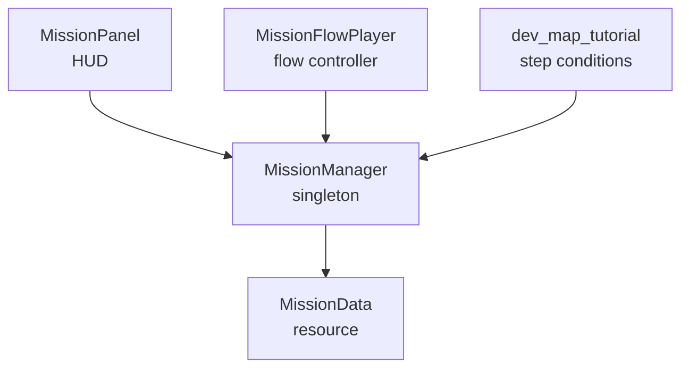
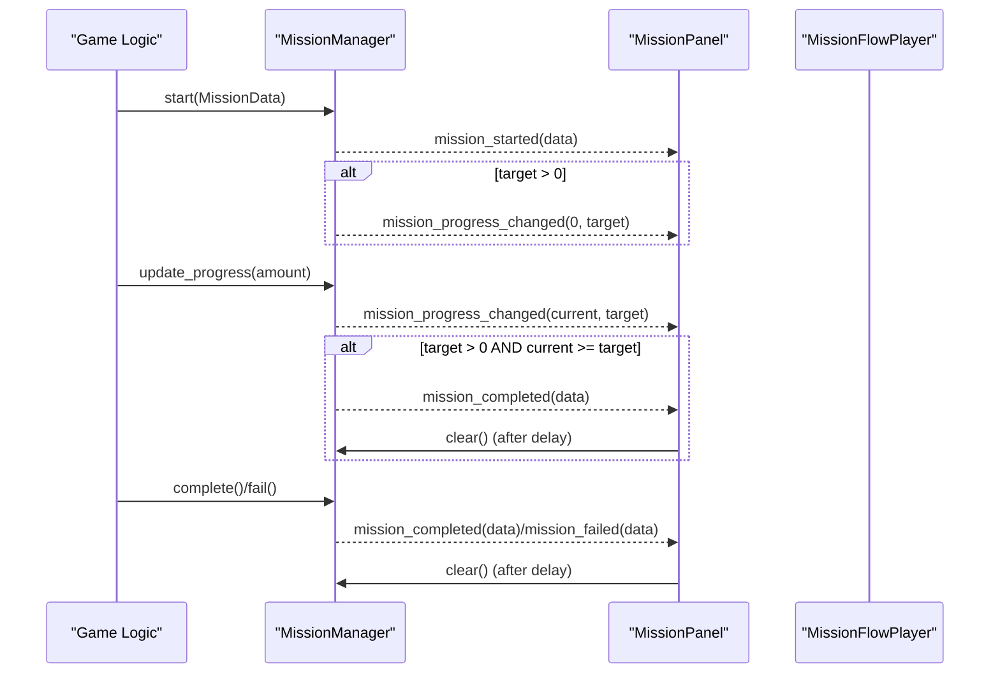
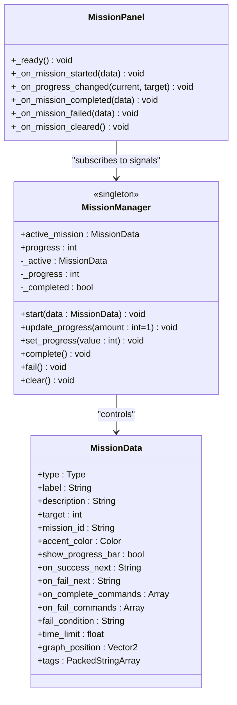
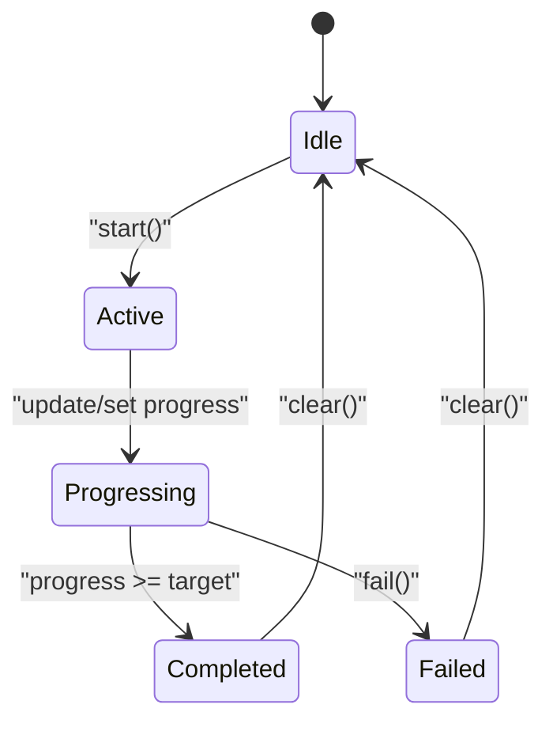
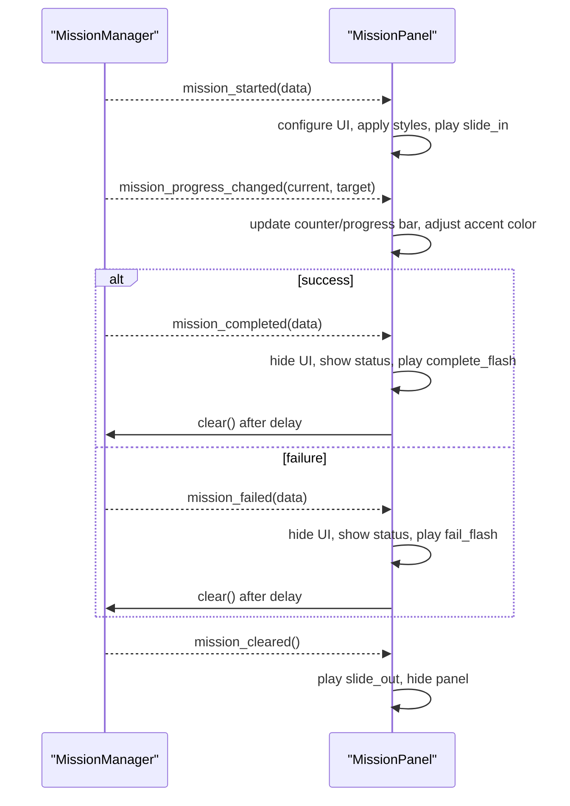
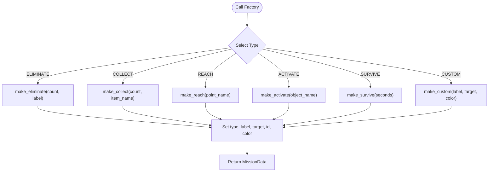
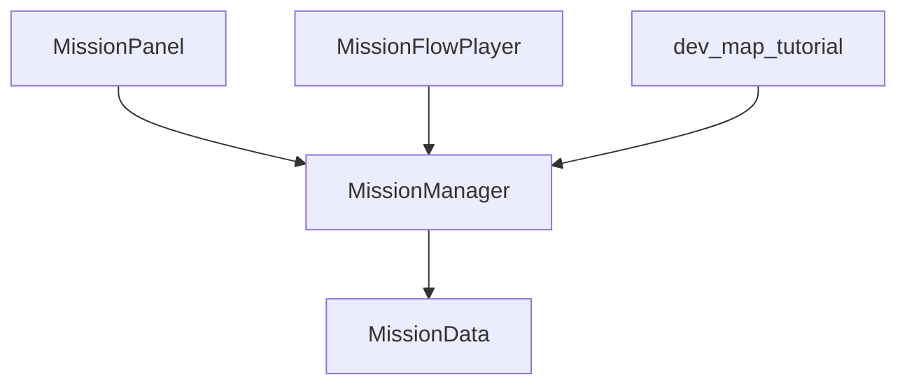

# MissionManager Core

<cite>
**Referenced Files in This Document**
- [mission_manager.gd](file://Scripts/mission_manager.gd)
- [mission_data.gd](file://Scripts/mission_data.gd)
- [mission_panel.gd](file://Scripts/mission_panel.gd)
- [creazionemissioni.md](file://creazionemissioni.md)
- [mission_flow_player.gd](file://addons/mission_editor/mission_flow_player.gd)
- [dev_map_tutorial.gd](file://Scripts/dev_map_tutorial.gd)
</cite>

## Table of Contents
1. [Introduction](#introduction)
2. [Project Structure](#project-structure)
3. [Core Components](#core-components)
4. [Architecture Overview](#architecture-overview)
5. [Detailed Component Analysis](#detailed-component-analysis)
6. [Dependency Analysis](#dependency-analysis)
7. [Performance Considerations](#performance-considerations)
8. [Troubleshooting Guide](#troubleshooting-guide)
9. [Conclusion](#conclusion)
10. [Appendices](#appendices)

## Introduction
This document provides comprehensive API documentation for the MissionManager singleton, the central orchestrator for in-game mission lifecycle management. It covers all public methods, internal state management, signal emissions, and the relationship with the HUD panel. It also documents the factory methods for creating different mission types and demonstrates practical usage scenarios for initialization, progress tracking, and completion/failure handling.

MissionManager is designed as an autoload singleton and emits signals consumed by the HUD panel and other systems. It manages a single active mission at a time, tracks progress, and supports explicit completion or failure transitions.

## Project Structure
The mission system spans several scripts:
- MissionManager singleton: orchestrates mission lifecycle and signals
- MissionData resource: describes mission metadata and behavior
- MissionPanel HUD: displays active mission UI and reacts to signals
- MissionFlowPlayer and tutorial scripts: demonstrate integration with flows and branching
- Documentation guide: examples and usage patterns

**Diagram sources**
- [mission_manager.gd:18-27](file://Scripts/mission_manager.gd#L18-L27)
- [mission_data.gd:4-15](file://Scripts/mission_data.gd#L4-L15)
- [mission_panel.gd:44-48](file://Scripts/mission_panel.gd#L44-L48)
- [mission_flow_player.gd:164-172](file://addons/mission_editor/mission_flow_player.gd#L164-L172)
- [dev_map_tutorial.gd:12-67](file://Scripts/dev_map_tutorial.gd#L12-L67)

**Section sources**
- [mission_manager.gd:18-27](file://Scripts/mission_manager.gd#L18-L27)
- [mission_data.gd:4-15](file://Scripts/mission_data.gd#L4-L15)
- [mission_panel.gd:44-48](file://Scripts/mission_panel.gd#L44-L48)
- [mission_flow_player.gd:164-172](file://addons/mission_editor/mission_flow_player.gd#L164-L172)
- [dev_map_tutorial.gd:12-67](file://Scripts/dev_map_tutorial.gd#L12-L67)

## Core Components
- MissionManager singleton
  - Public API: start(), update_progress(), set_progress(), complete(), fail(), clear()
  - Signals emitted: mission_started, mission_progress_changed, mission_completed, mission_failed, mission_cleared
  - Internal state: active mission reference, progress counter, completion flag
  - Read-only properties: active_mission, progress
  - Factory helpers: make_eliminate(), make_collect(), make_reach(), make_activate(), make_survive(), make_custom()

- MissionData resource
  - Enumerated mission types: ELIMINATE, COLLECT, REACH, ACTIVATE, SURVIVE, CUSTOM
  - Exported properties: type, label, description, target, mission_id, accent_color, show_progress_bar
  - Flow system properties: on_success_next, on_fail_next, on_complete_commands, on_fail_commands, fail_condition, time_limit, graph_position, tags

- MissionPanel HUD
  - Subscribes to MissionManager signals and updates UI accordingly
  - Handles animations and visual feedback for mission states
  - Auto-clears after completion/failure with a delay

**Section sources**
- [mission_manager.gd:49-99](file://Scripts/mission_manager.gd#L49-L99)
- [mission_manager.gd:105-168](file://Scripts/mission_manager.gd#L105-L168)
- [mission_data.gd:7-65](file://Scripts/mission_data.gd#L7-L65)
- [mission_panel.gd:53-168](file://Scripts/mission_panel.gd#L53-L168)

## Architecture Overview
MissionManager acts as the central hub for mission lifecycle events. The HUD subscribes to signals to render and animate mission states. Flow controllers and game logic trigger completion or failure, which the HUD interprets to display appropriate feedback and optionally clear the panel.

**Diagram sources**
- [mission_manager.gd:50-99](file://Scripts/mission_manager.gd#L50-L99)
- [mission_panel.gd:53-168](file://Scripts/mission_panel.gd#L53-L168)
- [mission_flow_player.gd:175-190](file://addons/mission_editor/mission_flow_player.gd#L175-L190)

## Detailed Component Analysis

### MissionManager Singleton API
MissionManager exposes a concise public API for mission lifecycle control and progress management. It maintains internal state and emits signals consumed by the HUD and other systems.

- Methods
  - start(data: MissionData): Initializes a new mission, resets progress, clears completion flag, emits mission_started, and optionally emits mission_progress_changed for missions with a numeric target.
  - update_progress(amount: int = 1): Increments progress by amount, clamps to [0, target], emits mission_progress_changed, and automatically completes the mission if threshold reached.
  - set_progress(value: int): Sets absolute progress, clamps to [0, target], emits mission_progress_changed, and automatically completes if threshold reached.
  - complete(): Marks the active mission as completed, prevents duplicate completions, emits mission_completed, and does not auto-clear.
  - fail(): Marks the active mission as failed, prevents duplicate completions, emits mission_failed.
  - clear(): Resets active mission, progress, and completion flag, emitting mission_cleared.

- Signals
  - mission_started(data: MissionData)
  - mission_progress_changed(current: int, target: int)
  - mission_completed(data: MissionData)
  - mission_failed(data: MissionData)
  - mission_cleared()

- Internal State
  - _active: MissionData (active mission)
  - _progress: int (current progress)
  - _completed: bool (completion guard)

- Read-only Properties
  - active_mission: MissionData (returns current active mission)
  - progress: int (returns current progress)

- Factory Helpers
  - make_eliminate(count: int, label: String = ""): Creates ELIMINATE mission with orange accent color.
  - make_collect(count: int, item_name: String): Creates COLLECT mission with green accent color.
  - make_reach(point_name: String): Creates REACH mission with cyan accent color (boolean).
  - make_activate(object_name: String): Creates ACTIVATE mission with yellow accent color (boolean).
  - make_survive(seconds: int): Creates SURVIVE mission with purple accent color and progress bar enabled.
  - make_custom(label: String, target: int = 0, color: Color = Color.WHITE): Creates CUSTOM mission with optional target and custom color.

**Diagram sources**
- [mission_manager.gd:39-43](file://Scripts/mission_manager.gd#L39-L43)
- [mission_manager.gd:105-168](file://Scripts/mission_manager.gd#L105-L168)
- [mission_data.gd:17-37](file://Scripts/mission_data.gd#L17-L37)
- [mission_panel.gd:53-168](file://Scripts/mission_panel.gd#L53-L168)

**Section sources**
- [mission_manager.gd:49-99](file://Scripts/mission_manager.gd#L49-L99)
- [mission_manager.gd:105-168](file://Scripts/mission_manager.gd#L105-L168)
- [mission_data.gd:17-37](file://Scripts/mission_data.gd#L17-L37)
- [mission_panel.gd:53-168](file://Scripts/mission_panel.gd#L53-L168)

### Mission Lifecycle Management
The lifecycle progresses through distinct states controlled by MissionManager and reflected in the HUD:
- Initialization: start() sets active mission, resets progress, and emits mission_started. For missions with a numeric target, it emits mission_progress_changed with initial progress 0.
- Progress Tracking: update_progress() and set_progress() adjust progress, clamp to bounds, emit mission_progress_changed, and auto-complete when target is reached.
- Completion/Failure: complete() and fail() mark the mission state and emit mission_completed or mission_failed. The HUD displays feedback and auto-clears after a short delay.
- Clearing: clear() resets state and emits mission_cleared, hiding the HUD.

**Diagram sources**
- [mission_manager.gd:50-99](file://Scripts/mission_manager.gd#L50-L99)
- [mission_panel.gd:117-168](file://Scripts/mission_panel.gd#L117-L168)

**Section sources**
- [mission_manager.gd:50-99](file://Scripts/mission_manager.gd#L50-L99)
- [mission_panel.gd:117-168](file://Scripts/mission_panel.gd#L117-L168)

### Signal Emissions and HUD Integration
MissionManager emits signals that the HUD listens to for rendering and animation:
- mission_started: initializes UI, applies accent color, configures counter/progress bar visibility, and triggers slide-in animation.
- mission_progress_changed: updates counter text or progress bar value, adjusts accent color intensity toward white near completion.
- mission_completed: hides counters, shows "COMPLETED" status, applies completed style, plays completion flash animation, and schedules clear after delay.
- mission_failed: hides counters, shows "FAILED" status, applies failed style, plays fail flash animation, and schedules clear after delay.
- mission_cleared: triggers slide-out animation and hides the panel.

**Diagram sources**
- [mission_manager.gd:23-27](file://Scripts/mission_manager.gd#L23-L27)
- [mission_panel.gd:53-168](file://Scripts/mission_panel.gd#L53-L168)

**Section sources**
- [mission_manager.gd:23-27](file://Scripts/mission_manager.gd#L23-L27)
- [mission_panel.gd:53-168](file://Scripts/mission_panel.gd#L53-L168)

### Factory Methods for Creating Mission Types
Factory helpers streamline mission creation without external .tres resources. They preconfigure type, label, target, mission_id, and accent color.

- make_eliminate(count, label="")
  - Type: ELIMINATE
  - Target: count
  - Accent: orange
  - Example usage: [creazionemissioni.md:53](file://creazionemissioni.md#L53)

- make_collect(count, item_name)
  - Type: COLLECT
  - Target: count
  - Accent: green
  - Example usage: [creazionemissioni.md:54](file://creazionemissioni.md#L54)

- make_reach(point_name)
  - Type: REACH
  - Target: 0 (boolean)
  - Accent: cyan
  - Example usage: [creazionemissioni.md:55](file://creazionemissioni.md#L55)

- make_activate(object_name)
  - Type: ACTIVATE
  - Target: 0 (boolean)
  - Accent: yellow
  - Example usage: [creazionemissioni.md:56](file://creazionemissioni.md#L56)

- make_survive(seconds)
  - Type: SURVIVE
  - Target: seconds
  - Accent: purple
  - show_progress_bar: true
  - Example usage: [creazionemissioni.md:57](file://creazionemissioni.md#L57)

- make_custom(label, target=0, color=Color.WHITE)
  - Type: CUSTOM
  - Optional target and custom color
  - Example usage: [creazionemissioni.md:58](file://creazionemissioni.md#L58)

**Diagram sources**
- [mission_manager.gd:105-168](file://Scripts/mission_manager.gd#L105-L168)

**Section sources**
- [mission_manager.gd:105-168](file://Scripts/mission_manager.gd#L105-L168)
- [creazionemissioni.md:53-58](file://creazionemissioni.md#L53-L58)

### Practical Usage Scenarios
- Mission Initialization
  - Direct MissionData creation and start
  - Factory helper usage
  - Reference: [creazionemissioni.md:42-58](file://creazionemissioni.md#L42-L58)

- Progress Tracking
  - Increment by 1 (default) or N units
  - Set absolute progress
  - Automatic completion when progress reaches target
  - Reference: [creazionemissioni.md:63-74](file://creazionemissioni.md#L63-L74)

- Completion and Failure Handling
  - Force completion or failure
  - Clear HUD panel
  - HUD auto-clear behavior after completion/failure
  - Reference: [creazionemissioni.md:76-82](file://creazionemissioni.md#L76-L82)

- Concatenating Missions
  - Chain missions using mission_completed signal and a small delay to let HUD finish
  - Reference: [creazionemissioni.md:104-145](file://creazionemissioni.md#L104-L145)

- Integration with Flow Controllers
  - MissionFlowPlayer starts missions and branches on completion/failure
  - References:
    - [mission_flow_player.gd:164-172](file://addons/mission_editor/mission_flow_player.gd#L164-L172)
    - [mission_flow_player.gd:175-190](file://addons/mission_editor/mission_flow_player.gd#L175-L190)

**Section sources**
- [creazionemissioni.md:42-82](file://creazionemissioni.md#L42-L82)
- [creazionemissioni.md:104-145](file://creazionemissioni.md#L104-L145)
- [mission_flow_player.gd:164-190](file://addons/mission_editor/mission_flow_player.gd#L164-L190)

## Dependency Analysis
MissionManager depends on MissionData resources and emits signals consumed by MissionPanel and potentially by flow controllers and game logic.

**Diagram sources**
- [mission_manager.gd:32-35](file://Scripts/mission_manager.gd#L32-L35)
- [mission_panel.gd:44-48](file://Scripts/mission_panel.gd#L44-L48)
- [mission_flow_player.gd:164-172](file://addons/mission_editor/mission_flow_player.gd#L164-L172)
- [dev_map_tutorial.gd:60-67](file://Scripts/dev_map_tutorial.gd#L60-L67)

**Section sources**
- [mission_manager.gd:32-35](file://Scripts/mission_manager.gd#L32-L35)
- [mission_panel.gd:44-48](file://Scripts/mission_panel.gd#L44-L48)
- [mission_flow_player.gd:164-172](file://addons/mission_editor/mission_flow_player.gd#L164-L172)
- [dev_map_tutorial.gd:60-67](file://Scripts/dev_map_tutorial.gd#L60-L67)

## Performance Considerations
- Signal emission frequency: mission_progress_changed is emitted frequently during progress updates. Keep UI updates minimal and avoid heavy computations in connected handlers.
- Clamp operations: Progress clamping ensures bounded updates; keep targets reasonable to prevent excessive UI churn.
- HUD animations: Quality settings affect animation complexity. Lower graphics presets reduce animation overhead.
- Flow branching: MissionFlowPlayer introduces delays for HUD transitions; ensure branching logic does not block the main thread.

## Troubleshooting Guide
- No HUD appears after starting a mission
  - Verify MissionManager is added as an autoload singleton named "MissionManager"
  - Ensure MissionPanel is attached to the HUD and connects to MissionManager signals
  - Confirm mission target > 0 emits mission_progress_changed for initial progress

- Progress not updating
  - Check that a mission is active (active_mission is not null)
  - Ensure update_progress() or set_progress() is called with valid amounts/values
  - Verify mission target is greater than zero for numeric progress

- Mission completes immediately
  - Confirm target thresholds and clamp behavior
  - Check for accidental calls to complete() or fail()

- HUD does not clear after completion/failure
  - MissionPanel auto-clears after a delay; ensure no other code interferes
  - Call clear() manually if needed

- Flow branching not working
  - Ensure MissionFlowPlayer is started with a valid flow
  - Verify mission IDs match between flow and code
  - Confirm mission_completed signal is handled and branching logic executed

**Section sources**
- [mission_panel.gd:53-168](file://Scripts/mission_panel.gd#L53-L168)
- [mission_flow_player.gd:175-190](file://addons/mission_editor/mission_flow_player.gd#L175-L190)

## Conclusion
MissionManager provides a robust, signal-driven framework for managing missions with a clean API and integrated HUD feedback. Its factory helpers accelerate development, while its read-only properties and signals enable flexible integration with flows and game logic. By following the documented patterns and troubleshooting tips, developers can implement reliable mission sequences with consistent user feedback.

## Appendices
- Quick Reference
  - Start a mission: [mission_manager.gd:50](file://Scripts/mission_manager.gd#L50)
  - Update progress: [mission_manager.gd:60](file://Scripts/mission_manager.gd#L60), [mission_manager.gd:69](file://Scripts/mission_manager.gd#L69)
  - Force completion/failure: [mission_manager.gd:78](file://Scripts/mission_manager.gd#L78), [mission_manager.gd:88](file://Scripts/mission_manager.gd#L88)
  - Clear HUD: [mission_manager.gd:95](file://Scripts/mission_manager.gd#L95)
  - Factory helpers: [mission_manager.gd:107-168](file://Scripts/mission_manager.gd#L107-L168)
  - HUD integration: [mission_panel.gd:53-168](file://Scripts/mission_panel.gd#L53-L168)
  - Flow integration: [mission_flow_player.gd:164-190](file://addons/mission_editor/mission_flow_player.gd#L164-L190)
  - Tutorial usage: [dev_map_tutorial.gd:12-67](file://Scripts/dev_map_tutorial.gd#L12-L67)