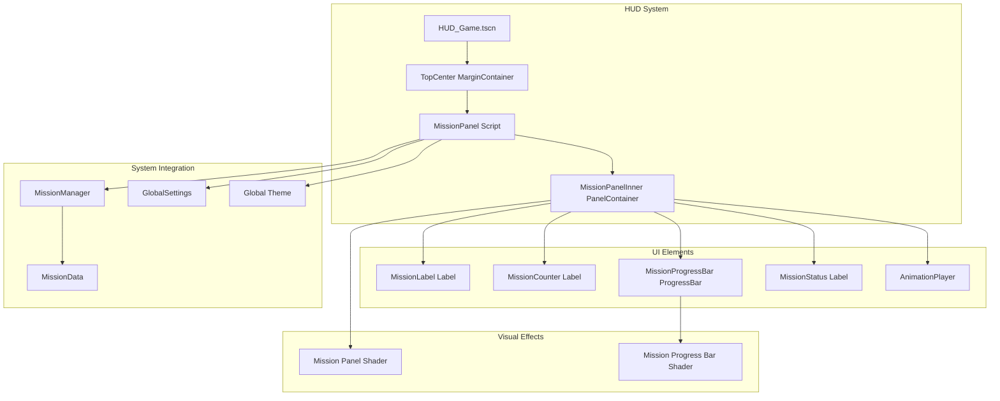
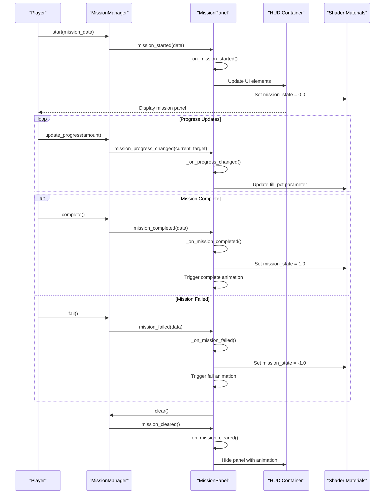
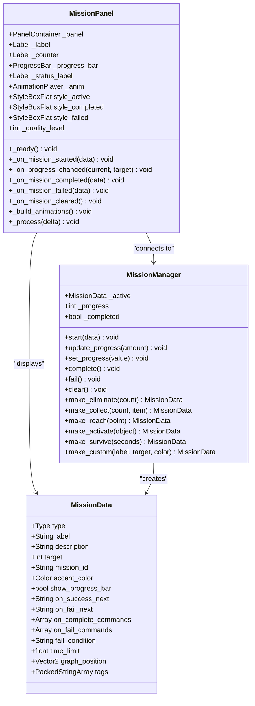
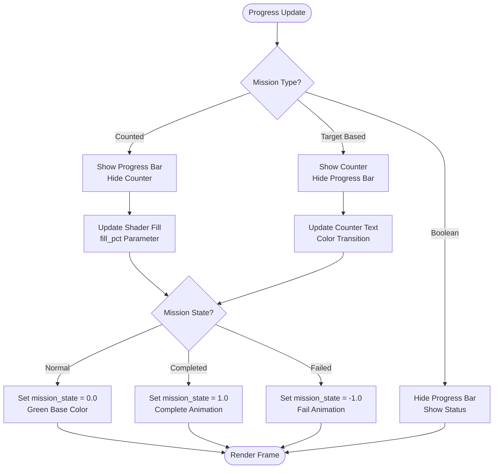
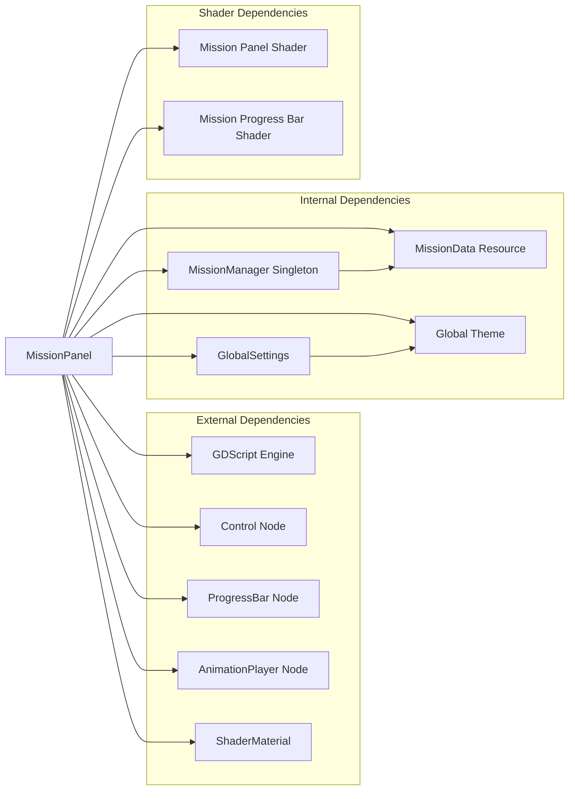

# MissionPanel UI Component

<cite>
**Referenced Files in This Document**
- [mission_panel.gd](file://Scripts/mission_panel.gd)
- [mission_manager.gd](file://Scripts/mission_manager.gd)
- [mission_data.gd](file://Scripts/mission_data.gd)
- [mission_panel.gdshader](file://Shaders/HUD/mission_panel.gdshader)
- [mission_progress_bar.gdshader](file://Shaders/HUD/mission_progress_bar.gdshader)
- [HUD_Game.tscn](file://Menu/HUD/HUD_Game.tscn)
- [hud_game.gd](file://Menu/HUD/hud_game.gd)
- [global_theme.tres](file://Assets/UI/global_theme.tres)
- [global_settings.gd](file://Scripts/global_settings.gd)
</cite>

## Table of Contents
1. [Introduction](#introduction)
2. [Project Structure](#project-structure)
3. [Core Components](#core-components)
4. [Architecture Overview](#architecture-overview)
5. [Detailed Component Analysis](#detailed-component-analysis)
6. [Dependency Analysis](#dependency-analysis)
7. [Performance Considerations](#performance-considerations)
8. [Troubleshooting Guide](#troubleshooting-guide)
9. [Conclusion](#conclusion)

## Introduction

The MissionPanel UI component is a sophisticated HUD element designed to display active mission objectives in real-time. It serves as the primary interface for communicating mission status, progress, and completion states to players during gameplay. The component integrates seamlessly with the MissionManager singleton and provides dynamic visual feedback through advanced shader effects and animated transitions.

The panel supports multiple mission types including elimination targets, collection objectives, reach points, activation events, survival challenges, and custom missions. It features adaptive quality rendering, responsive design, and comprehensive theming capabilities that integrate with the game's global UI system.

## Project Structure

The MissionPanel component is organized within the game's HUD system and consists of several interconnected files:

**Diagram sources**
- [HUD_Game.tscn:112-180](file://Menu/HUD/HUD_Game.tscn#L112-L180)
- [mission_panel.gd:10-15](file://Scripts/mission_panel.gd#L10-L15)

**Section sources**
- [HUD_Game.tscn:1-312](file://Menu/HUD/HUD_Game.tscn#L1-L312)
- [mission_panel.gd:1-359](file://Scripts/mission_panel.gd#L1-L359)

## Core Components

### MissionPanel Script Architecture

The MissionPanel script serves as the central controller for mission display functionality. It manages UI state, handles mission lifecycle events, and coordinates visual effects through shader materials and animations.

**Key Features:**
- Real-time mission status updates
- Dynamic progress visualization
- Animated transitions and state changes
- Responsive design with adaptive layouts
- Theme integration and customization
- Quality-aware rendering optimization

**Section sources**
- [mission_panel.gd:4-16](file://Scripts/mission_panel.gd#L4-L16)
- [mission_panel.gd:28-48](file://Scripts/mission_panel.gd#L28-L48)

### MissionManager Integration

The component maintains bidirectional communication with the MissionManager singleton, receiving mission lifecycle events and updating UI accordingly.

**Signal Connections:**
- `mission_started`: Initializes panel display and animations
- `mission_progress_changed`: Updates progress indicators
- `mission_completed`: Triggers completion animations and cleanup
- `mission_failed`: Displays failure state with appropriate styling
- `mission_cleared`: Handles panel dismissal and resource cleanup

**Section sources**
- [mission_panel.gd:44-48](file://Scripts/mission_panel.gd#L44-L48)
- [mission_manager.gd:23-27](file://Scripts/mission_manager.gd#L23-L27)

### Shader-Based Visual Effects

The panel utilizes custom shaders for advanced visual effects that enhance the player experience through dynamic lighting, color transitions, and animated borders.

**Shader Capabilities:**
- Animated border traversal effects
- State-based color transitions (normal, completed, failed)
- Pulsing animations synchronized with mission states
- Smooth state change transitions with timing controls
- Text protection to prevent visual interference with UI text

**Section sources**
- [mission_panel.gdshader:10-112](file://Shaders/HUD/mission_panel.gdshader#L10-L112)
- [mission_progress_bar.gdshader:8-63](file://Shaders/HUD/mission_progress_bar.gdshader#L8-L63)

## Architecture Overview

The MissionPanel operates within a layered architecture that separates concerns between UI presentation, mission state management, and visual effects:

**Diagram sources**
- [mission_panel.gd:53-168](file://Scripts/mission_panel.gd#L53-L168)
- [mission_manager.gd:50-99](file://Scripts/mission_manager.gd#L50-L99)

## Detailed Component Analysis

### Visual Presentation System

The MissionPanel employs a sophisticated visual presentation system that adapts to different mission types and quality settings:

**Diagram sources**
- [mission_panel.gd:10-15](file://Scripts/mission_panel.gd#L10-L15)
- [mission_data.gd:4-66](file://Scripts/mission_data.gd#L4-L66)
- [mission_manager.gd:18-169](file://Scripts/mission_manager.gd#L18-L169)

### Layout Management and Responsive Design

The panel implements a flexible layout system that adapts to different screen sizes and quality settings:

**Layout Structure:**
- **TopCenter MarginContainer**: Primary container positioned at the top center of the screen
- **MissionPanelInner PanelContainer**: Internal panel with customizable styling
- **VBoxContainer**: Vertical layout for organizing mission elements
- **HBoxContainer**: Horizontal layout for label and counter alignment

**Responsive Features:**
- Dynamic sizing based on content requirements
- Adaptive margins and spacing for different screen resolutions
- Quality-aware scaling and positioning
- Text protection mechanisms to prevent visual interference

**Section sources**
- [HUD_Game.tscn:124-177](file://Menu/HUD/HUD_Game.tscn#L124-L177)
- [mission_panel.gd:124-128](file://Scripts/mission_panel.gd#L124-L128)

### User Interaction Patterns

The MissionPanel responds to various user interactions and system events through a comprehensive event handling system:

**Interaction Types:**
- **Mission Lifecycle Events**: Automatic UI updates based on mission state changes
- **Progress Updates**: Real-time progress visualization with color transitions
- **Quality Changes**: Dynamic adaptation to graphics preset adjustments
- **Animation Triggers**: State-based visual feedback for mission outcomes

**Section sources**
- [mission_panel.gd:103-168](file://Scripts/mission_panel.gd#L103-L168)
- [mission_panel.gd:171-176](file://Scripts/mission_panel.gd#L171-L176)

### Progress Bar Rendering System

The progress bar component utilizes advanced shader technology for smooth, visually appealing progress indication:

**Diagram sources**
- [mission_panel.gd:82-115](file://Scripts/mission_panel.gd#L82-L115)
- [mission_progress_bar.gdshader:21-30](file://Shaders/HUD/mission_progress_bar.gdshader#L21-L30)

**Section sources**
- [mission_progress_bar.gdshader:11-62](file://Shaders/HUD/mission_progress_bar.gdshader#L11-L62)
- [mission_panel.gd:332-336](file://Scripts/mission_panel.gd#L332-L336)

### Mission Status Display System

The panel provides comprehensive status display through multiple visual indicators:

**Status Indicators:**
- **MissionLabel**: Primary mission objective text with translation support
- **MissionCounter**: Numerical progress display with accent color customization
- **MissionProgressBar**: Visual progress representation with shader effects
- **MissionStatus**: Completion/failure status messages with localized text

**Color Management:**
- Accent colors defined per mission type
- Dynamic color transitions based on progress completion
- Theme integration for consistent visual appearance
- Accessibility considerations for color visibility

**Section sources**
- [mission_panel.gd:72-126](file://Scripts/mission_panel.gd#L72-L126)
- [mission_data.gd:33-37](file://Scripts/mission_data.gd#L33-L37)

### Animation and Visual Effects System

The MissionPanel incorporates sophisticated animation systems that adapt to different quality settings:

**Animation Categories:**
- **Slide In**: Entry animation with position and opacity transitions
- **Slide Out**: Exit animation with smooth dismissal
- **Complete Flash**: Celebration animation for mission completion
- **Fail Flash**: Visual feedback for mission failure

**Quality Levels:**
- **Low (0)**: No animations for maximum performance
- **Medium (1)**: Basic fade and position transitions
- **High (2)**: Enhanced bounce and scale animations
- **Ultra (3)**: Full featured animations with advanced effects

**Section sources**
- [mission_panel.gd:180-321](file://Scripts/mission_panel.gd#L180-L321)
- [global_settings.gd:33-54](file://Scripts/global_settings.gd#L33-L54)

## Dependency Analysis

The MissionPanel component has well-defined dependencies that ensure loose coupling and maintainable architecture:

**Diagram sources**
- [mission_panel.gd:10-15](file://Scripts/mission_panel.gd#L10-L15)
- [mission_manager.gd:18-40](file://Scripts/mission_manager.gd#L18-L40)

**Section sources**
- [mission_panel.gd:32-48](file://Scripts/mission_panel.gd#L32-L48)
- [mission_manager.gd:18-40](file://Scripts/mission_manager.gd#L18-L40)

## Performance Considerations

The MissionPanel implements several performance optimization strategies:

**Quality-Based Rendering:**
- Animation disabling for low-quality settings
- Shader material optimization for different hardware capabilities
- Adaptive resolution scaling based on graphics presets
- Efficient memory management for animation resources

**Resource Management:**
- Deferred animation building to ensure proper layout calculations
- Conditional shader parameter updates to minimize GPU overhead
- Proper cleanup of animation resources during panel dismissal
- Efficient signal connection and disconnection patterns

**Optimization Strategies:**
- Minimal DOM manipulation through shader-based effects
- Batched property updates for UI elements
- Quality-aware resource allocation
- Memory-efficient animation keyframe storage

**Section sources**
- [mission_panel.gd:171-176](file://Scripts/mission_panel.gd#L171-L176)
- [mission_panel.gd:180-200](file://Scripts/mission_panel.gd#L180-L200)
- [global_settings.gd:301-306](file://Scripts/global_settings.gd#L301-L306)

## Troubleshooting Guide

Common issues and solutions for MissionPanel functionality:

**Panel Not Appearing:**
- Verify MissionManager singleton registration in autoload settings
- Check MissionData resource initialization and mission_id assignment
- Ensure proper scene hierarchy with TopCenter container
- Confirm signal connections in _ready() method

**Progress Display Issues:**
- Validate mission target values in MissionData resources
- Check shader parameter synchronization in _process() method
- Verify ProgressBar material assignment and fill_pct updates
- Ensure proper translation key availability for mission labels

**Animation Problems:**
- Confirm AnimationPlayer node setup and library creation
- Verify quality setting compatibility with desired animations
- Check root node path resolution for animation tracks
- Ensure proper animation library management and cleanup

**Shader Effect Issues:**
- Validate shader material assignment to panel and progress bar
- Check mission_state parameter synchronization across frames
- Verify shader parameter names match script assignments
- Ensure proper state_time parameter reset on state changes

**Section sources**
- [mission_panel.gd:28-48](file://Scripts/mission_panel.gd#L28-L48)
- [mission_panel.gd:323-346](file://Scripts/mission_panel.gd#L323-L346)
- [HUD_Game.tscn:124-177](file://Menu/HUD/HUD_Game.tscn#L124-L177)

## Conclusion

The MissionPanel UI component represents a sophisticated integration of game state management, visual effects, and responsive design principles. Its modular architecture ensures maintainability while providing rich visual feedback that enhances the player experience.

Key strengths include:
- **Adaptive Quality System**: Seamless performance optimization across hardware configurations
- **Dynamic Visual Effects**: Advanced shader-based animations that respond to mission states
- **Comprehensive Integration**: Tight coupling with MissionManager and HUD system
- **Accessibility Features**: Thoughtful design considerations for diverse player needs
- **Extensible Design**: Flexible architecture supporting various mission types and customization

The component successfully balances visual appeal with performance efficiency, making it suitable for both high-end and budget hardware configurations. Its integration with the broader HUD system demonstrates cohesive game architecture that prioritizes both functionality and aesthetic quality.

Future enhancements could include additional mission types, expanded customization options, and further performance optimizations for emerging hardware capabilities.