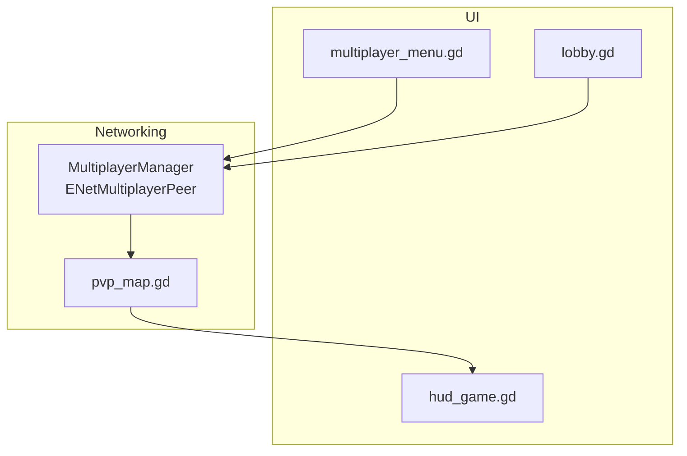
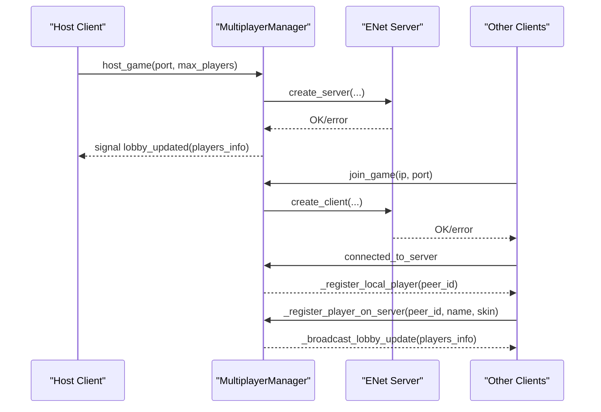
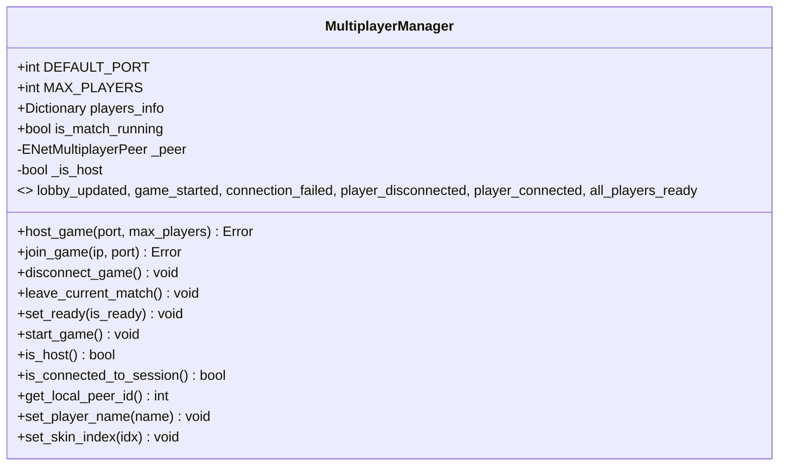
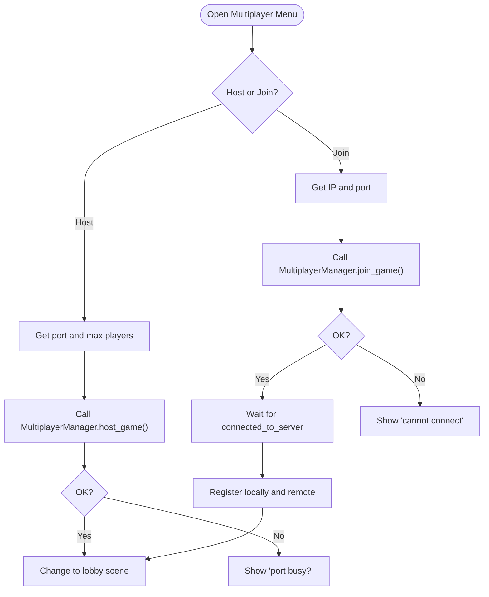
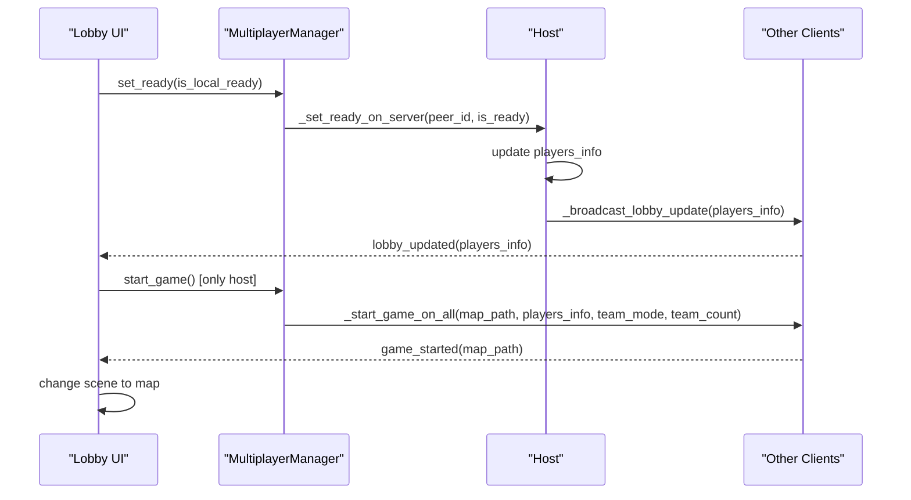
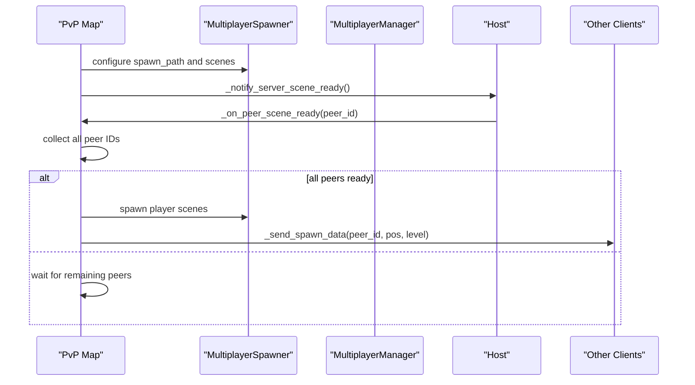
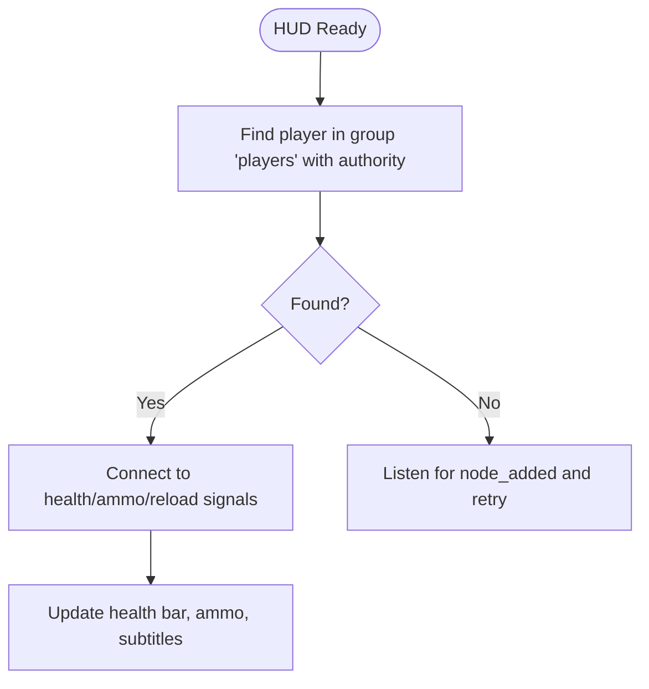
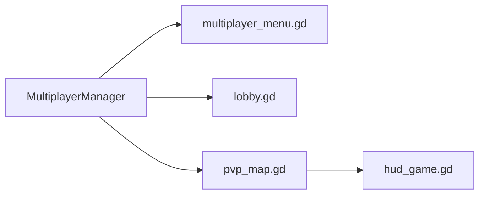

# Client-Server Architecture

<cite>
**Referenced Files in This Document**
- [multiplayer_manager.gd](file://Scripts/multiplayer_manager.gd)
- [multiplayer_menu.gd](file://Menu/multiplayer_menu.gd)
- [lobby.gd](file://Menu/lobby.gd)
- [pvp_map.gd](file://Scripts/pvp_map.gd)
- [hud_game.gd](file://Menu/HUD/hud_game.gd)
</cite>

## Table of Contents
1. [Introduction](#introduction)
2. [Project Structure](#project-structure)
3. [Core Components](#core-components)
4. [Architecture Overview](#architecture-overview)
5. [Detailed Component Analysis](#detailed-component-analysis)
6. [Dependency Analysis](#dependency-analysis)
7. [Performance Considerations](#performance-considerations)
8. [Troubleshooting Guide](#troubleshooting-guide)
9. [Conclusion](#conclusion)

## Introduction
This document explains the client-server architecture used by TFA Agents, focusing on the ENetMultiplayerPeer integration, connection lifecycle management, and peer-to-peer communication patterns. It covers the host-client relationship, unique peer ID assignment, lobby synchronization, and connection status monitoring. Practical examples illustrate server initialization, client connection, graceful disconnection, error handling, and reconnection strategies.

## Project Structure
The multiplayer system is centered around a singleton manager that encapsulates ENet networking and exposes a clean API for lobby, team, and spawn logic. UI scenes orchestrate the user flow for hosting, joining, and leaving sessions.

**Diagram sources**
- [multiplayer_menu.gd:1-121](file://Menu/multiplayer_menu.gd#L1-L121)
- [lobby.gd:1-162](file://Menu/lobby.gd#L1-L162)
- [multiplayer_manager.gd:1-304](file://Scripts/multiplayer_manager.gd#L1-L304)
- [pvp_map.gd:1-200](file://Scripts/pvp_map.gd#L1-L200)
- [hud_game.gd:1-206](file://Menu/HUD/hud_game.gd#L1-L206)

**Section sources**
- [multiplayer_menu.gd:1-121](file://Menu/multiplayer_menu.gd#L1-L121)
- [lobby.gd:1-162](file://Menu/lobby.gd#L1-L162)
- [multiplayer_manager.gd:1-304](file://Scripts/multiplayer_manager.gd#L1-L304)
- [pvp_map.gd:1-200](file://Scripts/pvp_map.gd#L1-L200)
- [hud_game.gd:1-206](file://Menu/HUD/hud_game.gd#L1-L206)

## Core Components
- MultiplayerManager: Singleton managing ENet connections, lobby state, RPCs, and game start signals.
- UI Scenes: Multiplayer menu and lobby scenes handle user actions and display connection status.
- Game Scene: PvP map initializes spawner, performs handshake, spawns players, and manages match lifecycle.
- HUD: Displays local player UI and synchronizes visuals with authoritative player nodes.

Key responsibilities:
- Host creates server, sets session limits, assigns teams, and starts the game.
- Clients connect, register themselves, mark readiness, and receive synchronized updates.
- Authority is established per player node to ensure deterministic simulation.

**Section sources**
- [multiplayer_manager.gd:1-304](file://Scripts/multiplayer_manager.gd#L1-L304)
- [multiplayer_menu.gd:1-121](file://Menu/multiplayer_menu.gd#L1-L121)
- [lobby.gd:1-162](file://Menu/lobby.gd#L1-L162)
- [pvp_map.gd:1-200](file://Scripts/pvp_map.gd#L1-L200)
- [hud_game.gd:1-206](file://Menu/HUD/hud_game.gd#L1-L206)

## Architecture Overview
The system uses ENetMultiplayerPeer under the hood via Godot’s multiplayer API. MultiplayerManager configures the peer, emits signals for UI, and coordinates RPC-based lobby and game state.

**Diagram sources**
- [multiplayer_manager.gd:74-106](file://Scripts/multiplayer_manager.gd#L74-L106)
- [multiplayer_manager.gd:226-261](file://Scripts/multiplayer_manager.gd#L226-L261)
- [multiplayer_menu.gd:63-94](file://Menu/multiplayer_menu.gd#L63-L94)

## Detailed Component Analysis

### MultiplayerManager
Responsibilities:
- Initialize ENet server or client.
- Manage lobby state dictionary keyed by peer IDs.
- Broadcast lobby updates and readiness.
- Assign teams and start the game.
- Handle connection/disconnection events and emit signals.

Unique peer ID assignment:
- Local peer ID is retrieved via the multiplayer API after connecting.
- The host registers itself with peer ID 1 and later clients receive their unique IDs from the server.

Connection lifecycle:
- Host: create_server, set multiplayer.multiplayer_peer, register local player.
- Join: create_client, set multiplayer.multiplayer_peer, wait for connected_to_server, then register remotely.
- Disconnect: clear state, reset flags.

RPCs:
- Registration, readiness, lobby broadcast, start game, despawn requests, and chat messages.

**Diagram sources**
- [multiplayer_manager.gd:1-304](file://Scripts/multiplayer_manager.gd#L1-L304)

**Section sources**
- [multiplayer_manager.gd:1-304](file://Scripts/multiplayer_manager.gd#L1-L304)

### Multiplayer Menu
Responsibilities:
- Collects user input for host and join actions.
- Applies player name to MultiplayerManager.
- Calls host_game or join_game and navigates to lobby on success.
- Displays status messages and handles errors.

**Diagram sources**
- [multiplayer_menu.gd:63-94](file://Menu/multiplayer_menu.gd#L63-L94)
- [multiplayer_manager.gd:74-106](file://Scripts/multiplayer_manager.gd#L74-L106)

**Section sources**
- [multiplayer_menu.gd:1-121](file://Menu/multiplayer_menu.gd#L1-L121)

### Lobby Scene
Responsibilities:
- Display connected players, readiness, and teams.
- Allow host to start the game when everyone is ready.
- Enable chat messaging via RPC.
- React to connection failures and navigate back to the menu.

**Diagram sources**
- [lobby.gd:95-107](file://Menu/lobby.gd#L95-L107)
- [multiplayer_manager.gd:254-274](file://Scripts/multiplayer_manager.gd#L254-L274)

**Section sources**
- [lobby.gd:1-162](file://Menu/lobby.gd#L1-L162)
- [multiplayer_manager.gd:246-274](file://Scripts/multiplayer_manager.gd#L246-L274)

### PvP Map (Game Scene)
Responsibilities:
- Initialize MultiplayerSpawner and container node for players.
- Perform scene-ready handshake to synchronize spawn timing.
- Spawn players with authority set per peer ID.
- Apply spawn data via RPC to ensure positions are synchronized.

**Diagram sources**
- [pvp_map.gd:44-109](file://Scripts/pvp_map.gd#L44-L109)
- [pvp_map.gd:164-210](file://Scripts/pvp_map.gd#L164-L210)

**Section sources**
- [pvp_map.gd:1-200](file://Scripts/pvp_map.gd#L1-L200)

### HUD (Local Player UI)
Responsibilities:
- Locate the local player node with authority.
- Subscribe to health/ammo/reload signals.
- Display subtitles and manage UI layout.

**Diagram sources**
- [hud_game.gd:27-75](file://Menu/HUD/hud_game.gd#L27-L75)

**Section sources**
- [hud_game.gd:1-206](file://Menu/HUD/hud_game.gd#L1-L206)

## Dependency Analysis
- MultiplayerManager depends on Godot’s multiplayer API and ENetMultiplayerPeer internally.
- UI scenes depend on MultiplayerManager signals and methods.
- PvP map depends on MultiplayerManager for lobby state and spawns players accordingly.
- HUD depends on the presence of the authoritative player node.

**Diagram sources**
- [multiplayer_manager.gd:1-304](file://Scripts/multiplayer_manager.gd#L1-L304)
- [multiplayer_menu.gd:1-121](file://Menu/multiplayer_menu.gd#L1-L121)
- [lobby.gd:1-162](file://Menu/lobby.gd#L1-L162)
- [pvp_map.gd:1-200](file://Scripts/pvp_map.gd#L1-L200)
- [hud_game.gd:1-206](file://Menu/HUD/hud_game.gd#L1-L206)

**Section sources**
- [multiplayer_manager.gd:1-304](file://Scripts/multiplayer_manager.gd#L1-L304)
- [multiplayer_menu.gd:1-121](file://Menu/multiplayer_menu.gd#L1-L121)
- [lobby.gd:1-162](file://Menu/lobby.gd#L1-L162)
- [pvp_map.gd:1-200](file://Scripts/pvp_map.gd#L1-L200)
- [hud_game.gd:1-206](file://Menu/HUD/hud_game.gd#L1-L206)

## Performance Considerations
- Minimize RPC payload sizes by sending only necessary fields (name, team_id, ready, skin_index).
- Use reliable RPC delivery for lobby updates and game start to avoid desyncs.
- Defer heavy operations (like spawning) until all peers confirm scene readiness.
- Keep lobby updates batched to reduce network chatter.

## Troubleshooting Guide
Common issues and resolutions:
- Cannot start server on a port:
  - Verify the port is free and accessible.
  - Check firewall/network settings.
  - The manager emits a connection failure signal with a reason.
- Cannot connect as client:
  - Confirm IP/port correctness.
  - Ensure the host started the server and is reachable on the LAN/WAN.
  - The manager emits a connection failure signal.
- Players not appearing:
  - Ensure the scene-ready handshake completes on all peers.
  - Verify MultiplayerSpawner is configured and spawnable scenes are registered.
- Readiness mismatch:
  - Host can only start the game when all players are ready.
  - Use the lobby UI to toggle readiness and confirm broadcast updates.

Reconnection logic:
- On connection failure, UI resets buttons and navigates back to the multiplayer menu.
- To reconnect, re-run the join procedure from the multiplayer menu.

Graceful disconnection:
- Use leave_current_match to despawn the local player on the server and return to the lobby or main menu.
- The manager clears internal state and resets flags.

**Section sources**
- [multiplayer_manager.gd:109-118](file://Scripts/multiplayer_manager.gd#L109-L118)
- [multiplayer_manager.gd:119-128](file://Scripts/multiplayer_manager.gd#L119-L128)
- [multiplayer_manager.gd:299-303](file://Scripts/multiplayer_manager.gd#L299-L303)
- [lobby.gd:147-151](file://Menu/lobby.gd#L147-L151)
- [multiplayer_menu.gd:101-104](file://Menu/multiplayer_menu.gd#L101-L104)

## Conclusion
TFA Agents implements a robust client-server model using ENetMultiplayerPeer behind Godot’s multiplayer abstraction. MultiplayerManager centralizes connection management, lobby coordination, and RPC-driven synchronization. The UI scenes guide users through hosting and joining, while the game scene ensures synchronized spawns and authority-per-peer replication. With clear signals, RPCs, and lifecycle hooks, the system supports reliable matchmaking, readiness checks, and graceful disconnects.