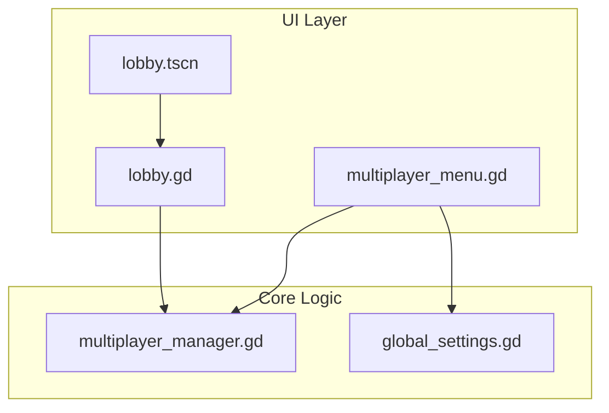
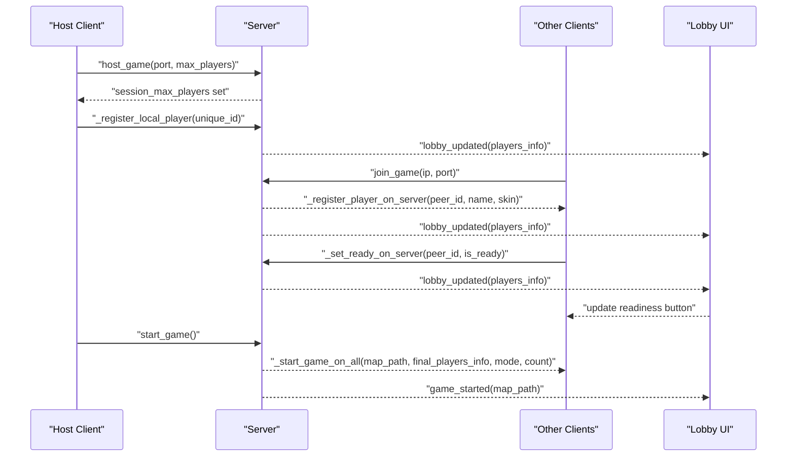
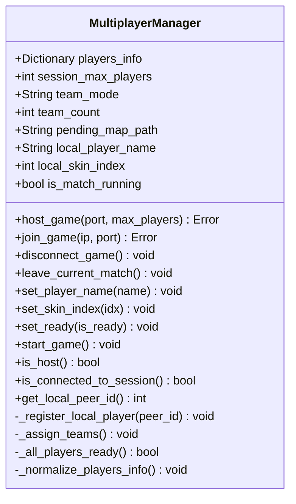
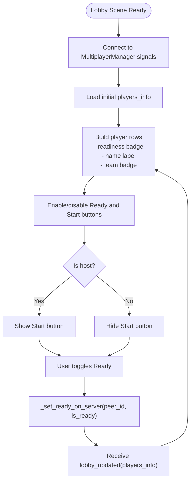
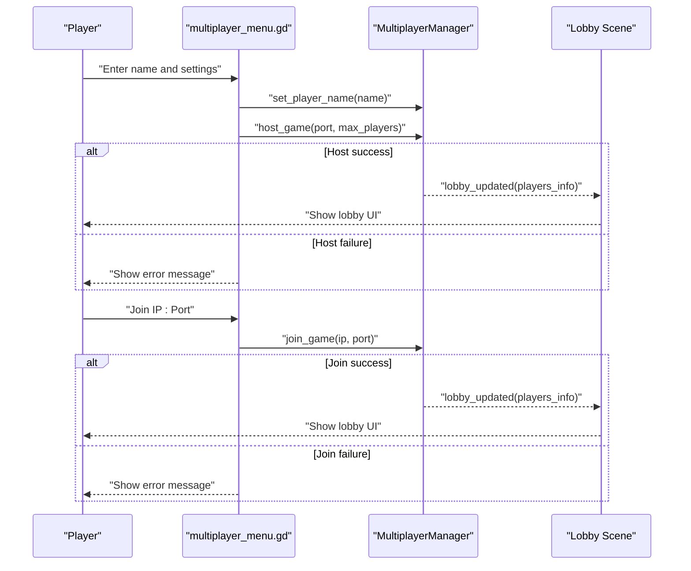

# Lobby Management System

<cite>
**Referenced Files in This Document**
- [multiplayer_manager.gd](file://Scripts/multiplayer_manager.gd)
- [lobby.gd](file://Menu/lobby.gd)
- [multiplayer_menu.gd](file://Menu/multiplayer_menu.gd)
- [lobby.tscn](file://Menu/lobby.tscn)
- [global_settings.gd](file://Scripts/global_settings.gd)
</cite>

## Table of Contents
1. [Introduction](#introduction)
2. [Project Structure](#project-structure)
3. [Core Components](#core-components)
4. [Architecture Overview](#architecture-overview)
5. [Detailed Component Analysis](#detailed-component-analysis)
6. [Dependency Analysis](#dependency-analysis)
7. [Performance Considerations](#performance-considerations)
8. [Troubleshooting Guide](#troubleshooting-guide)
9. [Conclusion](#conclusion)

## Introduction
This document describes the lobby management system for the multiplayer subsystem. It covers player registration, team assignment, lobby state synchronization, readiness tracking, and UI integration. It also documents lobby creation, joining/leaving, real-time updates, capacity limits, authentication considerations, and cleanup procedures.

## Project Structure
The lobby system spans three primary areas:
- Multiplayer core logic: centralized in a singleton that manages connections, lobby state, and synchronization
- Lobby UI: a scene and script that render the player list, readiness controls, chat, and host actions
- Multiplayer menu: initial screen to configure host settings and connect to games



**Diagram sources**
- [multiplayer_menu.gd:1-121](file://Menu/multiplayer_menu.gd#L1-L121)
- [lobby.gd:1-162](file://Menu/lobby.gd#L1-L162)
- [lobby.tscn:1-131](file://Menu/lobby.tscn#L1-L131)
- [multiplayer_manager.gd:1-322](file://Scripts/multiplayer_manager.gd#L1-L322)
- [global_settings.gd:1-618](file://Scripts/global_settings.gd#L1-L618)

**Section sources**
- [multiplayer_menu.gd:1-121](file://Menu/multiplayer_menu.gd#L1-L121)
- [lobby.gd:1-162](file://Menu/lobby.gd#L1-L162)
- [lobby.tscn:1-131](file://Menu/lobby.tscn#L1-L131)
- [multiplayer_manager.gd:1-322](file://Scripts/multiplayer_manager.gd#L1-L322)
- [global_settings.gd:1-618](file://Scripts/global_settings.gd#L1-L618)

## Core Components
- MultiplayerManager (singleton): orchestrates ENet connections, maintains lobby state, handles RPCs, and broadcasts updates
- Lobby UI (scene + script): displays players, readiness, teams, chat, and host controls
- Multiplayer Menu: host creation and client join flows, plus player name persistence

Key responsibilities:
- Player registration and authentication via player name and skin index
- Team assignment (round-robin for teams, per-player FFA)
- Readiness tracking and synchronization
- Real-time lobby updates and broadcast
- Capacity enforcement and cleanup on disconnect/leave

**Section sources**
- [multiplayer_manager.gd:1-322](file://Scripts/multiplayer_manager.gd#L1-L322)
- [lobby.gd:1-162](file://Menu/lobby.gd#L1-L162)
- [multiplayer_menu.gd:1-121](file://Menu/multiplayer_menu.gd#L1-L121)

## Architecture Overview
The system uses a client-server model with a dedicated host. The host runs the authoritative server; clients connect and receive synchronized state via RPCs. The lobby UI subscribes to signals emitted by the manager to reflect live changes.



**Diagram sources**
- [multiplayer_manager.gd:71-106](file://Scripts/multiplayer_manager.gd#L71-L106)
- [multiplayer_manager.gd:154-169](file://Scripts/multiplayer_manager.gd#L154-L169)
- [multiplayer_manager.gd:225-274](file://Scripts/multiplayer_manager.gd#L225-L274)
- [lobby.gd:17-35](file://Menu/lobby.gd#L17-L35)

## Detailed Component Analysis

### MultiplayerManager
Responsibilities:
- Connection lifecycle: host, join, disconnect, leave
- Lobby state: players_info dictionary, session_max_players, team_mode, team_count, pending_map_path
- Authentication: player name and skin index stored per peer
- Team balancing: round-robin distribution or per-player FFA
- Readiness tracking: per-peer "ready" flag synchronized to all clients
- Broadcasting: lobby updates and game start to all peers

Important behaviors:
- Capacity limits enforced during registration
- Keys normalization after RPC serialization (Godot 4 converts numeric keys to strings)
- Host-only actions: team assignment and game start
- Signals for UI updates and error handling



**Diagram sources**
- [multiplayer_manager.gd:28-47](file://Scripts/multiplayer_manager.gd#L28-L47)
- [multiplayer_manager.gd:71-106](file://Scripts/multiplayer_manager.gd#L71-L106)
- [multiplayer_manager.gd:144-152](file://Scripts/multiplayer_manager.gd#L144-L152)
- [multiplayer_manager.gd:154-169](file://Scripts/multiplayer_manager.gd#L154-L169)
- [multiplayer_manager.gd:199-210](file://Scripts/multiplayer_manager.gd#L199-L210)
- [multiplayer_manager.gd:316-322](file://Scripts/multiplayer_manager.gd#L316-L322)

**Section sources**
- [multiplayer_manager.gd:1-322](file://Scripts/multiplayer_manager.gd#L1-L322)

### Lobby UI (Scene + Script)
Responsibilities:
- Render player list with readiness, name, and team badges
- Host visibility and enablement of start button
- Readiness toggle and host start trigger
- Chat input and broadcast
- Connection failure handling and navigation

UI flow:
- On ready, subscribe to MultiplayerManager signals
- Populate player rows dynamically
- Toggle readiness and start button based on lobby state
- Send chat messages via RPC to all peers



**Diagram sources**
- [lobby.gd:17-35](file://Menu/lobby.gd#L17-L35)
- [lobby.gd:40-56](file://Menu/lobby.gd#L40-L56)
- [lobby.gd:95-102](file://Menu/lobby.gd#L95-L102)
- [multiplayer_manager.gd:253-262](file://Scripts/multiplayer_manager.gd#L253-L262)

**Section sources**
- [lobby.gd:1-162](file://Menu/lobby.gd#L1-L162)
- [lobby.tscn:1-131](file://Menu/lobby.tscn#L1-L131)

### Multiplayer Menu
Responsibilities:
- Configure host settings: port, max players, team mode, team count
- Apply player name and persist to GlobalSettings
- Initiate host or join flows
- Handle connection failures and navigate back



**Diagram sources**
- [multiplayer_menu.gd:63-78](file://Menu/multiplayer_menu.gd#L63-L78)
- [multiplayer_menu.gd:80-94](file://Menu/multiplayer_menu.gd#L80-L94)
- [multiplayer_menu.gd:107-111](file://Menu/multiplayer_menu.gd#L107-L111)
- [multiplayer_manager.gd:71-106](file://Scripts/multiplayer_manager.gd#L71-L106)

**Section sources**
- [multiplayer_menu.gd:1-121](file://Menu/multiplayer_menu.gd#L1-L121)
- [global_settings.gd:100-121](file://Scripts/global_settings.gd#L100-L121)

## Dependency Analysis
- MultiplayerManager is a singleton accessed by lobby UI and multiplayer menu
- Lobby UI depends on MultiplayerManager signals for real-time updates
- Multiplayer menu depends on MultiplayerManager for connection orchestration
- Player name persistence uses GlobalSettings

```mermaid
graph LR
MM["multiplayer_manager.gd"] <- --> LB["lobby.gd"]
MM <- --> MMENU["multiplayer_menu.gd"]
MMENU --> GS["global_settings.gd"]
LB --> LBTSCN["lobby.tscn"]
```

**Diagram sources**
- [multiplayer_manager.gd:17-22](file://Scripts/multiplayer_manager.gd#L17-L22)
- [lobby.gd:18-22](file://Menu/lobby.gd#L18-L22)
- [multiplayer_menu.gd:22-29](file://Menu/multiplayer_menu.gd#L22-L29)

**Section sources**
- [multiplayer_manager.gd:1-322](file://Scripts/multiplayer_manager.gd#L1-L322)
- [lobby.gd:1-162](file://Menu/lobby.gd#L1-L162)
- [multiplayer_menu.gd:1-121](file://Menu/multiplayer_menu.gd#L1-L121)

## Performance Considerations
- Broadcast frequency: lobby updates occur on player registration, readiness changes, and disconnects; keep player lists reasonably sized to minimize UI rebuild overhead
- RPC reliability: the system uses reliable delivery for lobby updates; avoid excessive rapid toggling of readiness to prevent frequent broadcasts
- Capacity checks: enforce session_max_players early to avoid unnecessary allocations and network churn
- UI updates: dynamic row creation occurs on each update; consider virtualization for very large lobbies (not present in current implementation)

## Troubleshooting Guide
Common issues and resolutions:
- Connection failed: the manager emits a connection_failed signal; UI displays the reason and resets buttons
- Server shutdown: server-disconnect triggers cleanup and returns to the multiplayer menu
- Full lobby: new peers are rejected when players_info reaches session_max_players
- Readiness mismatch: start button requires all players ready and minimum two players

Operational tips:
- Verify port availability before hosting
- Ensure all clients have the same team mode and team count if using team balancing
- Use leave_current_match to cleanly exit to the lobby or main menu

**Section sources**
- [multiplayer_manager.gd:299-309](file://Scripts/multiplayer_manager.gd#L299-L309)
- [multiplayer_manager.gd:230-233](file://Scripts/multiplayer_manager.gd#L230-L233)
- [lobby.gd:147-151](file://Menu/lobby.gd#L147-L151)

## Conclusion
The lobby management system provides a robust, real-time multiplayer framework with clear separation between UI and core logic. It supports player registration, readiness tracking, team balancing, and synchronized state updates across clients. The modular design allows for future enhancements such as relay servers or alternative backends while maintaining a stable API surface.