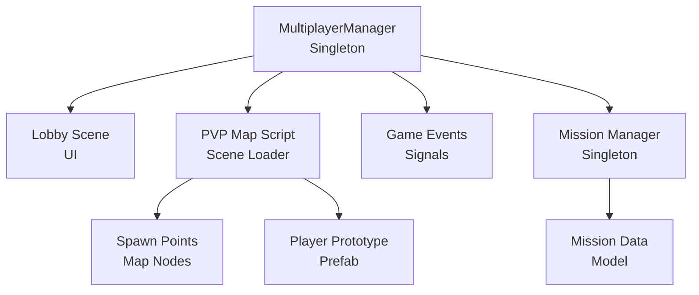
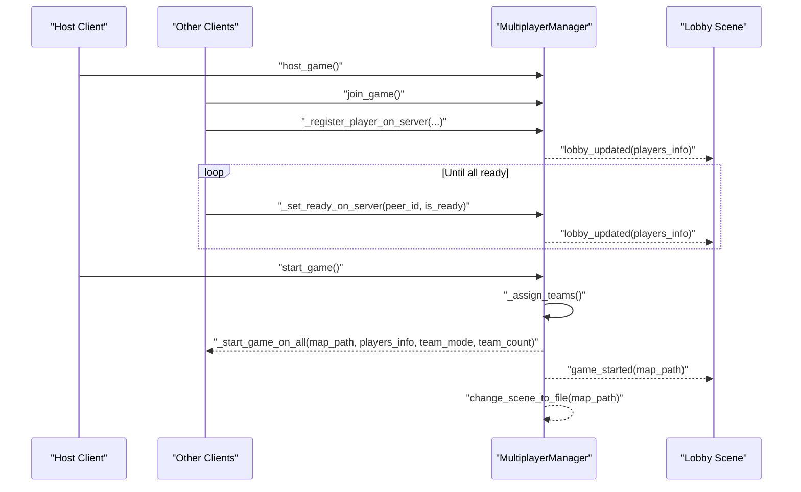
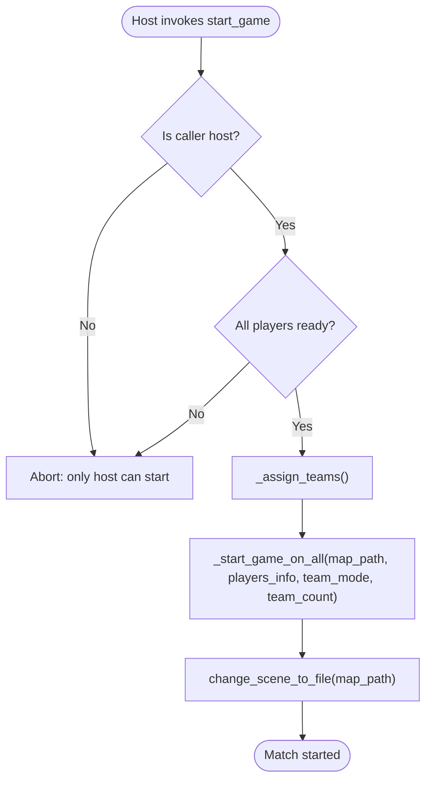
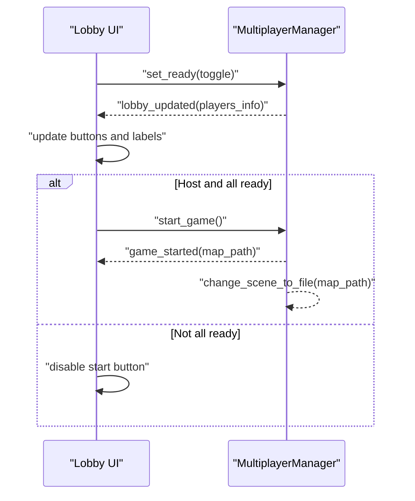
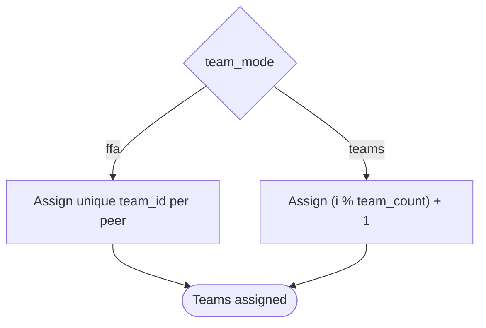
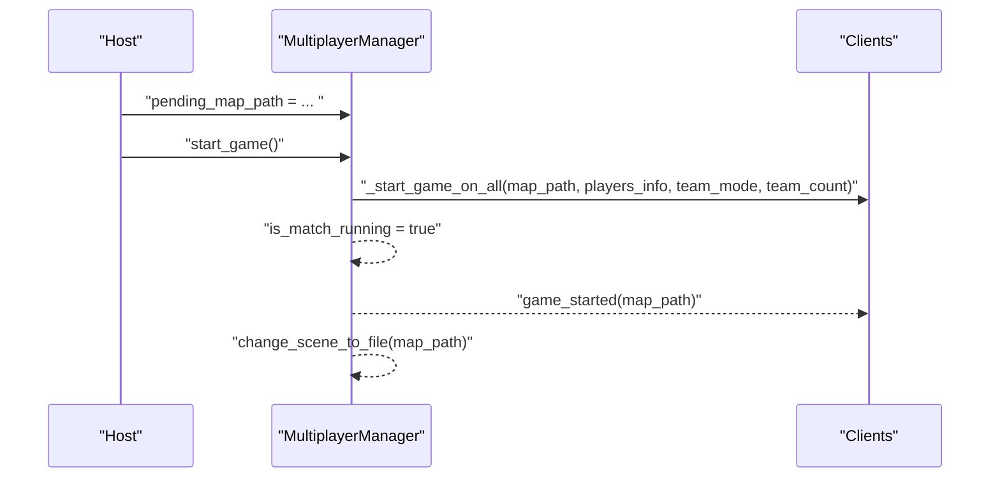
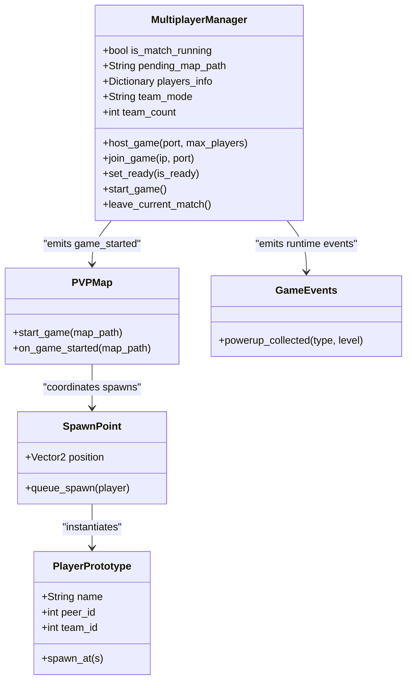
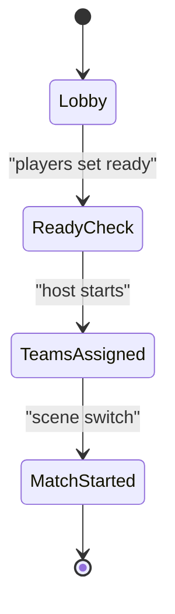
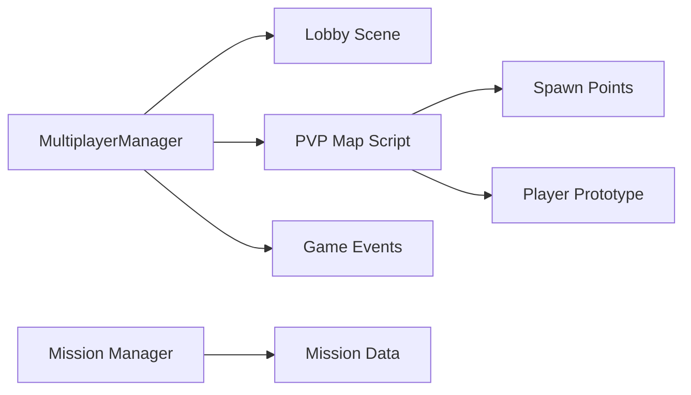

# Matchmaking and Game Startup

<cite>
**Referenced Files in This Document**
- [multiplayer_manager.gd](file://Scripts/multiplayer_manager.gd)
- [lobby.gd](file://Menu/lobby.gd)
- [pvp_map.gd](file://Scripts/pvp_map.gd)
- [spawn_point.gd](file://Scripts/spawn_point.gd)
- [player_prototype.gd](file://Scripts/player_prototype.gd)
- [mission_manager.gd](file://Scripts/mission_manager.gd)
- [mission_data.gd](file://Scripts/mission_data.gd)
- [game_events.gd](file://Scripts/game_events.gd)
</cite>

## Table of Contents
1. [Introduction](#introduction)
2. [Project Structure](#project-structure)
3. [Core Components](#core-components)
4. [Architecture Overview](#architecture-overview)
5. [Detailed Component Analysis](#detailed-component-analysis)
6. [Dependency Analysis](#dependency-analysis)
7. [Performance Considerations](#performance-considerations)
8. [Troubleshooting Guide](#troubleshooting-guide)
9. [Conclusion](#conclusion)

## Introduction
This document explains the matchmaking and game startup pipeline, including team assignment, ready-check, map selection, match coordination, and runtime state management. It covers how players form a lobby, confirm readiness, and start a match under different modes (FFA vs Teams). It also documents the game initialization sequence, player spawning coordination, and error handling during startup and recovery.

## Project Structure
The matchmaking and startup logic centers around a multiplayer manager singleton and a lobby scene. The game map script coordinates scene transitions and runtime events. Player spawning is handled by spawn points and the player prototype. Mission tracking is supported by a mission manager and mission data model.

**Diagram sources**
- [multiplayer_manager.gd:1-322](file://Scripts/multiplayer_manager.gd#L1-L322)
- [lobby.gd:1-162](file://Menu/lobby.gd#L1-L162)
- [pvp_map.gd:1-200](file://Scripts/pvp_map.gd#L1-L200)
- [spawn_point.gd:1-200](file://Scripts/spawn_point.gd#L1-L200)
- [player_prototype.gd:1-200](file://Scripts/player_prototype.gd#L1-L200)
- [mission_manager.gd:1-169](file://Scripts/mission_manager.gd#L1-L169)
- [mission_data.gd:1-200](file://Scripts/mission_data.gd#L1-L200)
- [game_events.gd:1-5](file://Scripts/game_events.gd#L1-L5)

**Section sources**
- [multiplayer_manager.gd:1-322](file://Scripts/multiplayer_manager.gd#L1-L322)
- [lobby.gd:1-162](file://Menu/lobby.gd#L1-L162)
- [pvp_map.gd:1-200](file://Scripts/pvp_map.gd#L1-L200)
- [spawn_point.gd:1-200](file://Scripts/spawn_point.gd#L1-L200)
- [player_prototype.gd:1-200](file://Scripts/player_prototype.gd#L1-L200)
- [mission_manager.gd:1-169](file://Scripts/mission_manager.gd#L1-L169)
- [mission_data.gd:1-200](file://Scripts/mission_data.gd#L1-L200)
- [game_events.gd:1-5](file://Scripts/game_events.gd#L1-L5)

## Core Components
- MultiplayerManager: Central coordinator for lobby, ready-check, team assignment, map selection, and match start. Emits signals for lobby updates, readiness, and game start. Handles ENet connections and RPCs.
- Lobby Scene: Displays connected players, readiness, and host controls. Manages ready toggles and match start button visibility.
- PVP Map Script: Receives the selected map path and starts the game scene. Coordinates runtime events.
- Spawn Points: Map nodes that define spawn locations for players.
- Player Prototype: Prefab representing a player character.
- Mission Manager: Tracks active missions, progress, completion/failure, and emits HUD-visible signals.
- Mission Data: Model describing mission type, target, label, and metadata.
- Game Events: Singleton emitting gameplay-related signals (e.g., power-up collection).

**Section sources**
- [multiplayer_manager.gd:1-322](file://Scripts/multiplayer_manager.gd#L1-L322)
- [lobby.gd:1-162](file://Menu/lobby.gd#L1-L162)
- [pvp_map.gd:1-200](file://Scripts/pvp_map.gd#L1-L200)
- [spawn_point.gd:1-200](file://Scripts/spawn_point.gd#L1-L200)
- [player_prototype.gd:1-200](file://Scripts/player_prototype.gd#L1-L200)
- [mission_manager.gd:1-169](file://Scripts/mission_manager.gd#L1-L169)
- [mission_data.gd:1-200](file://Scripts/mission_data.gd#L1-L200)
- [game_events.gd:1-5](file://Scripts/game_events.gd#L1-L5)

## Architecture Overview
The system uses a centralized matchmaking and state machine pattern:
- Host creates a server and registers the local player.
- Clients connect and register themselves; the host tracks players and readiness.
- Host triggers team assignment and match start when all players are ready.
- The lobby scene reflects readiness and enables the start button.
- On start, the manager broadcasts the chosen map and switches scenes.

**Diagram sources**
- [multiplayer_manager.gd:74-169](file://Scripts/multiplayer_manager.gd#L74-L169)
- [lobby.gd:37-108](file://Menu/lobby.gd#L37-L108)

## Detailed Component Analysis

### MultiplayerManager: Lobby, Ready-Check, Team Assignment, and Match Start
Responsibilities:
- Connection lifecycle: host server, join clients, disconnect/reset.
- Player registration and lobby state broadcasting.
- Ready-check: per-peer readiness tracked centrally.
- Team assignment: FFA assigns each player to their own team; Teams uses round-robin distribution.
- Match start: validates readiness, syncs teams and map, and transitions to the game scene.

Key behaviors:
- Host-only start: only the host can initiate a match after all players are ready.
- Readiness propagation: clients toggle readiness via RPC; server updates and broadcasts.
- Team assignment: deterministic round-robin for Teams; unique team IDs for FFA.
- Scene change: upon start, the manager switches to the configured map path.

**Diagram sources**
- [multiplayer_manager.gd:159-169](file://Scripts/multiplayer_manager.gd#L159-L169)
- [multiplayer_manager.gd:199-210](file://Scripts/multiplayer_manager.gd#L199-L210)
- [multiplayer_manager.gd:265-274](file://Scripts/multiplayer_manager.gd#L265-L274)

**Section sources**
- [multiplayer_manager.gd:74-169](file://Scripts/multiplayer_manager.gd#L74-L169)
- [multiplayer_manager.gd:199-210](file://Scripts/multiplayer_manager.gd#L199-L210)
- [multiplayer_manager.gd:265-274](file://Scripts/multiplayer_manager.gd#L265-L274)

### Lobby Scene: Ready-Check UI and Match Initiation
Responsibilities:
- Render connected players, readiness, and host controls.
- Toggle local readiness and send it to the manager.
- Enable/disable start button based on readiness and player count.
- Handle connection failures and scene transitions.

**Diagram sources**
- [lobby.gd:95-108](file://Menu/lobby.gd#L95-L108)
- [multiplayer_manager.gd:155-169](file://Scripts/multiplayer_manager.gd#L155-L169)

**Section sources**
- [lobby.gd:37-108](file://Menu/lobby.gd#L37-L108)
- [multiplayer_manager.gd:155-169](file://Scripts/multiplayer_manager.gd#L155-L169)

### Team Assignment Algorithms
- FFA Mode: Each player receives a unique team ID equal to their position order.
- Teams Mode: Players are distributed round-robin across the configured number of teams.

**Diagram sources**
- [multiplayer_manager.gd:200-209](file://Scripts/multiplayer_manager.gd#L200-L209)

**Section sources**
- [multiplayer_manager.gd:200-209](file://Scripts/multiplayer_manager.gd#L200-L209)

### Map Selection and Match Coordination
- Host sets the pending map path; clients receive the final map path and scene switch command.
- The manager normalizes keys after RPC serialization to handle integer peer IDs consistently.

**Diagram sources**
- [multiplayer_manager.gd:160-169](file://Scripts/multiplayer_manager.gd#L160-L169)
- [multiplayer_manager.gd:267-274](file://Scripts/multiplayer_manager.gd#L267-L274)
- [multiplayer_manager.gd:316-322](file://Scripts/multiplayer_manager.gd#L316-L322)

**Section sources**
- [multiplayer_manager.gd:160-169](file://Scripts/multiplayer_manager.gd#L160-L169)
- [multiplayer_manager.gd:267-274](file://Scripts/multiplayer_manager.gd#L267-L274)
- [multiplayer_manager.gd:316-322](file://Scripts/multiplayer_manager.gd#L316-L322)

### Game Initialization and Player Spawning Coordination
- The PVP map script receives the map path and starts the game scene.
- Spawn points define spawn locations; player prototypes are instantiated at spawn positions.
- Runtime events are emitted by a central game events singleton.

**Diagram sources**
- [multiplayer_manager.gd:160-169](file://Scripts/multiplayer_manager.gd#L160-L169)
- [pvp_map.gd:1-200](file://Scripts/pvp_map.gd#L1-L200)
- [spawn_point.gd:1-200](file://Scripts/spawn_point.gd#L1-L200)
- [player_prototype.gd:1-200](file://Scripts/player_prototype.gd#L1-L200)
- [game_events.gd:1-5](file://Scripts/game_events.gd#L1-L5)

**Section sources**
- [pvp_map.gd:1-200](file://Scripts/pvp_map.gd#L1-L200)
- [spawn_point.gd:1-200](file://Scripts/spawn_point.gd#L1-L200)
- [player_prototype.gd:1-200](file://Scripts/player_prototype.gd#L1-L200)
- [game_events.gd:1-5](file://Scripts/game_events.gd#L1-L5)

### Match State Management
- Ready-check: each peer toggles readiness; server aggregates and broadcasts.
- Match state: is_match_running flag flips when the host starts the game.
- Normalization: integer peer IDs are normalized after RPC serialization/deserialization.

**Diagram sources**
- [multiplayer_manager.gd:212-219](file://Scripts/multiplayer_manager.gd#L212-L219)
- [multiplayer_manager.gd:267-274](file://Scripts/multiplayer_manager.gd#L267-L274)
- [multiplayer_manager.gd:316-322](file://Scripts/multiplayer_manager.gd#L316-L322)

**Section sources**
- [multiplayer_manager.gd:212-219](file://Scripts/multiplayer_manager.gd#L212-L219)
- [multiplayer_manager.gd:267-274](file://Scripts/multiplayer_manager.gd#L267-L274)
- [multiplayer_manager.gd:316-322](file://Scripts/multiplayer_manager.gd#L316-L322)

### Examples

#### Automatic Team Assignment
- FFA: Unique team IDs assigned per peer.
- Teams: Round-robin distribution across configured team_count.

**Section sources**
- [multiplayer_manager.gd:200-209](file://Scripts/multiplayer_manager.gd#L200-L209)

#### Manual Team Switching
- The current implementation does not expose a manual team switch API in the provided files. Team assignments occur at match start based on mode and are synchronized to clients.

**Section sources**
- [multiplayer_manager.gd:199-210](file://Scripts/multiplayer_manager.gd#L199-L210)

#### Match Cancellation Procedures
- Players can leave the current match or disconnect. The manager despawns the local player on the server and returns to the lobby or main menu.

**Section sources**
- [multiplayer_manager.gd:119-142](file://Scripts/multiplayer_manager.gd#L119-L142)

## Dependency Analysis
- MultiplayerManager depends on ENet multiplayer peer and Godot’s multiplayer APIs.
- Lobby scene depends on MultiplayerManager signals and UI controls.
- PVP map script depends on MultiplayerManager’s game_started signal and map path.
- Spawn points depend on the map layout and instantiate player prototypes.
- Mission manager depends on mission data model and emits HUD-visible signals.

**Diagram sources**
- [multiplayer_manager.gd:1-322](file://Scripts/multiplayer_manager.gd#L1-L322)
- [lobby.gd:1-162](file://Menu/lobby.gd#L1-L162)
- [pvp_map.gd:1-200](file://Scripts/pvp_map.gd#L1-L200)
- [spawn_point.gd:1-200](file://Scripts/spawn_point.gd#L1-L200)
- [player_prototype.gd:1-200](file://Scripts/player_prototype.gd#L1-L200)
- [mission_manager.gd:1-169](file://Scripts/mission_manager.gd#L1-L169)
- [mission_data.gd:1-200](file://Scripts/mission_data.gd#L1-L200)
- [game_events.gd:1-5](file://Scripts/game_events.gd#L1-L5)

**Section sources**
- [multiplayer_manager.gd:1-322](file://Scripts/multiplayer_manager.gd#L1-L322)
- [lobby.gd:1-162](file://Menu/lobby.gd#L1-L162)
- [pvp_map.gd:1-200](file://Scripts/pvp_map.gd#L1-L200)
- [spawn_point.gd:1-200](file://Scripts/spawn_point.gd#L1-L200)
- [player_prototype.gd:1-200](file://Scripts/player_prototype.gd#L1-L200)
- [mission_manager.gd:1-169](file://Scripts/mission_manager.gd#L1-L169)
- [mission_data.gd:1-200](file://Scripts/mission_data.gd#L1-L200)
- [game_events.gd:1-5](file://Scripts/game_events.gd#L1-L5)

## Performance Considerations
- RPC normalization avoids repeated dictionary conversions by normalizing keys once per broadcast.
- Ready-check short-circuits when any peer is not ready, minimizing unnecessary work.
- Scene switching occurs on the host and is replicated to clients, ensuring consistent state.

[No sources needed since this section provides general guidance]

## Troubleshooting Guide
Common issues and recovery:
- Connection failure: the manager emits a connection failed signal and resets state; the lobby scene displays the reason and returns to the multiplayer menu after a delay.
- Server disconnect: the manager resets state and emits a connection failed signal; the lobby scene handles recovery.
- Player leaves during match: the manager removes the peer from the lobby and updates clients; the host can respawn the player on demand.

**Section sources**
- [multiplayer_manager.gd:299-309](file://Scripts/multiplayer_manager.gd#L299-L309)
- [lobby.gd:147-151](file://Menu/lobby.gd#L147-L151)
- [multiplayer_manager.gd:130-142](file://Scripts/multiplayer_manager.gd#L130-L142)

## Conclusion
The matchmaking and game startup system centers on a robust lobby and ready-check mechanism, deterministic team assignment, and reliable match coordination. The host orchestrates readiness and team distribution, while clients react to synchronized state updates. The design cleanly separates networking concerns from UI and game logic, enabling straightforward extensions for manual team switching and advanced match features.