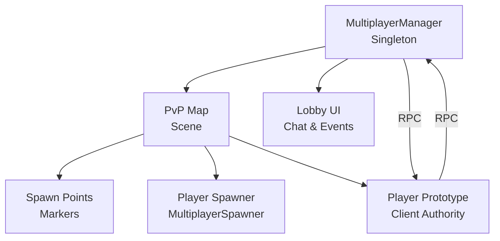
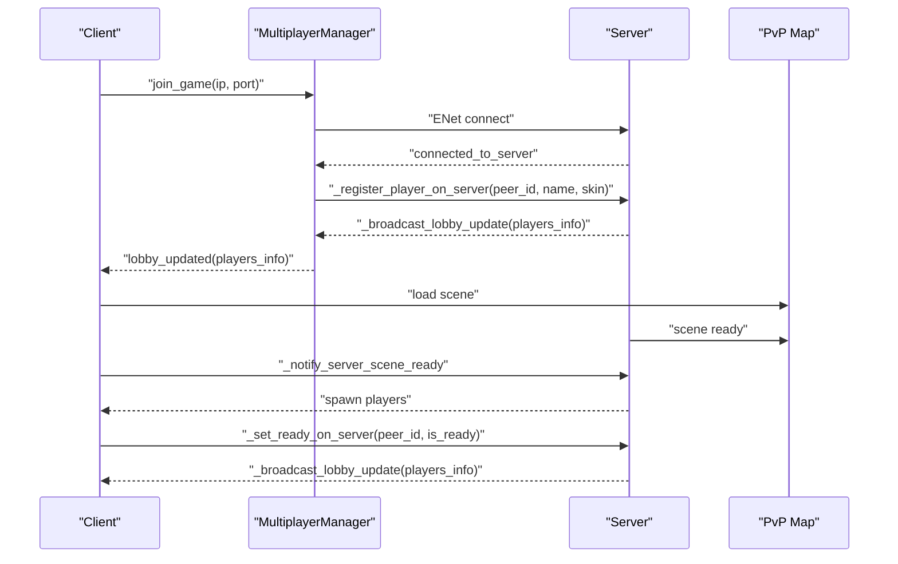
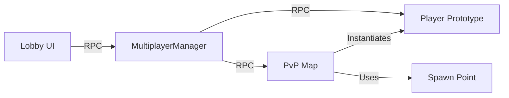

# Multiplayer Networking API

<cite>
**Referenced Files in This Document**
- [multiplayer_manager.gd](file://Scripts/multiplayer_manager.gd)
- [pvp_map.gd](file://Scripts/pvp_map.gd)
- [spawn_point.gd](file://Scripts/spawn_point.gd)
- [player_prototype.gd](file://Scripts/player_prototype.gd)
- [lobby.gd](file://Menu/lobby.gd)
</cite>

## Table of Contents
1. [Introduction](#introduction)
2. [Project Structure](#project-structure)
3. [Core Components](#core-components)
4. [Architecture Overview](#architecture-overview)
5. [Detailed Component Analysis](#detailed-component-analysis)
6. [Dependency Analysis](#dependency-analysis)
7. [Performance Considerations](#performance-considerations)
8. [Troubleshooting Guide](#troubleshooting-guide)
9. [Conclusion](#conclusion)

## Introduction
This document describes the Multiplayer Networking system for the project, focusing on the client-server architecture, lobby management, player synchronization, authority patterns, and network state management. It documents RPC methods, client prediction, state reconciliation, and practical examples such as player spawning, position synchronization, team management, and network event handling. It also covers connection management, matchmaking integration, and optimization techniques.

## Project Structure
The networking system spans several core scripts:
- MultiplayerManager: Central singleton managing ENet backend, lobby state, and RPC orchestration.
- PvP Map: Scene hosting the authoritative game logic, spawning, and handshake.
- Player Prototype: Client-side player entity with authority, prediction, and state synchronization.
- Spawn Point: Scene component defining spawn locations and team-specific spawns.
- Lobby UI: Client-side UI reacting to lobby events and sending chat messages.

**Diagram sources**
- [multiplayer_manager.gd:1-322](file://Scripts/multiplayer_manager.gd#L1-L322)
- [pvp_map.gd:1-335](file://Scripts/pvp_map.gd#L1-L335)
- [player_prototype.gd:102-304](file://Scripts/player_prototype.gd#L102-L304)
- [spawn_point.gd:1-5](file://Scripts/spawn_point.gd#L1-L5)
- [lobby.gd:117-161](file://Menu/lobby.gd#L117-L161)

**Section sources**
- [multiplayer_manager.gd:1-322](file://Scripts/multiplayer_manager.gd#L1-L322)
- [pvp_map.gd:1-335](file://Scripts/pvp_map.gd#L1-L335)
- [player_prototype.gd:102-304](file://Scripts/player_prototype.gd#L102-L304)
- [spawn_point.gd:1-5](file://Scripts/spawn_point.gd#L1-L5)
- [lobby.gd:117-161](file://Menu/lobby.gd#L117-L161)

## Core Components
- MultiplayerManager
  - Provides ENet backend, lobby state, and RPC orchestration.
  - Hosts and joins sessions, manages player registration, readiness, and team assignment.
  - Broadcasts lobby updates and starts games across peers.
- PvP Map
  - Implements scene-ready handshake, spawns players, and manages match lifecycle.
  - Uses MultiplayerSpawner and sets authority on spawned instances.
- Player Prototype
  - Implements authority, client prediction, and periodic state synchronization.
  - Receives initial state from server and applies damage with authority checks.
- Spawn Point
  - Defines spawn locations and optional team affinity.
- Lobby UI
  - Sends chat messages via RPC and reacts to connection and lobby events.

**Section sources**
- [multiplayer_manager.gd:17-48](file://Scripts/multiplayer_manager.gd#L17-L48)
- [pvp_map.gd:55-91](file://Scripts/pvp_map.gd#L55-L91)
- [player_prototype.gd:102-304](file://Scripts/player_prototype.gd#L102-L304)
- [spawn_point.gd:1-5](file://Scripts/spawn_point.gd#L1-L5)
- [lobby.gd:117-161](file://Menu/lobby.gd#L117-L161)

## Architecture Overview
The system follows a client-server model with ENet:
- Server hosts the game session and maintains authoritative state.
- Clients connect to the server and receive synchronized state.
- Authority is assigned per-player to the owning peer for deterministic updates.
- RPCs propagate lobby state, scene readiness, and gameplay events.

**Diagram sources**
- [multiplayer_manager.gd:92-106](file://Scripts/multiplayer_manager.gd#L92-L106)
- [multiplayer_manager.gd:225-262](file://Scripts/multiplayer_manager.gd#L225-L262)
- [pvp_map.gd:77-90](file://Scripts/pvp_map.gd#L77-L90)

## Detailed Component Analysis

### MultiplayerManager
Responsibilities:
- Connection management (host/join/disconnect).
- Lobby state (players_info, max players, teams).
- RPCs for lobby, readiness, and game start.
- Event emission for UI and higher-level logic.

Key APIs and Signals:
- host_game(port, max_players): Starts a server.
- join_game(ip, port): Connects to a server.
- disconnect_game(): Resets state.
- set_player_name(name), set_skin_index(idx): Pre-connection settings.
- set_ready(is_ready): Toggles readiness.
- start_game(): Host-triggered start after all players ready.
- Signals: lobby_updated, game_started, connection_failed, player_disconnected, player_connected, all_players_ready.

RPC Methods:
- _register_player_on_server(peer_id, player_name, skin_index): Server-side registration.
- _broadcast_lobby_update(info): Propagates lobby state.
- _set_ready_on_server(peer_id, is_ready): Updates readiness and emits lobby update.
- _start_game_on_all(map_path, final_players_info, team_mode, team_count): Starts match on all peers.

Authority and Keys:
- _normalize_players_info(): Converts string keys to integers after RPC serialization.

**Section sources**
- [multiplayer_manager.gd:71-106](file://Scripts/multiplayer_manager.gd#L71-L106)
- [multiplayer_manager.gd:144-157](file://Scripts/multiplayer_manager.gd#L144-L157)
- [multiplayer_manager.gd:160-169](file://Scripts/multiplayer_manager.gd#L160-L169)
- [multiplayer_manager.gd:225-262](file://Scripts/multiplayer_manager.gd#L225-L262)
- [multiplayer_manager.gd:265-274](file://Scripts/multiplayer_manager.gd#L265-L274)
- [multiplayer_manager.gd:315-322](file://Scripts/multiplayer_manager.gd#L315-L322)

### PvP Map
Responsibilities:
- Scene-ready handshake with peers.
- Player spawning via MultiplayerSpawner.
- Match lifecycle and end conditions.

Handshake:
- Server adds itself to ready list; clients send _notify_server_scene_ready.
- On all peers ready, spawns players and initializes kills.

Spawning:
- Sets MultiplayerSpawner spawn_path and registers player scene.
- Sets authority on spawned player nodes before adding to tree.

RPC Methods:
- _notify_server_scene_ready: Client-to-server scene readiness.
- _end_match: Ends match and disables physics on players.

**Section sources**
- [pvp_map.gd:55-91](file://Scripts/pvp_map.gd#L55-L91)
- [pvp_map.gd:164-169](file://Scripts/pvp_map.gd#L164-L169)
- [pvp_map.gd:322-335](file://Scripts/pvp_map.gd#L322-L335)

### Player Prototype
Responsibilities:
- Authority pattern: set_multiplayer_authority(peer_id) ensures server validates sensitive actions.
- Initial state sync: sends team/skin/name/arm to peers.
- Movement prediction: client-side interpolation and periodic state RPC.
- Damage handling: server-authoritative apply_damage with friendly fire checks.

RPC Methods:
- _sync_initial_state_to_peers: Sends initial state to peers.
- _receive_initial_state: Applies received state locally.
- _send_state_to_remotes: Periodic position/rotation/height synchronization.
- receive_damage: Server-applied damage with source identification.

Prediction and Reconciliation:
- Client predicts movement; server resolves conflicts and reconciles state.
- Friendly fire detection prevents self-damage attribution.

**Section sources**
- [player_prototype.gd:102-127](file://Scripts/player_prototype.gd#L102-L127)
- [player_prototype.gd:295-304](file://Scripts/player_prototype.gd#L295-L304)
- [player_prototype.gd:781-795](file://Scripts/player_prototype.gd#L781-L795)

### Spawn Point
Responsibilities:
- Defines spawn locations with optional team affinity and height level.

**Section sources**
- [spawn_point.gd:1-5](file://Scripts/spawn_point.gd#L1-L5)

### Lobby UI
Responsibilities:
- Chat messaging via RPC.
- Reacting to connection failures and lobby updates.

RPC Methods:
- _receive_chat_message: Displays formatted chat on clients.

**Section sources**
- [lobby.gd:117-161](file://Menu/lobby.gd#L117-L161)

## Dependency Analysis
- MultiplayerManager depends on ENetMultiplayerPeer and Godot’s multiplayer signals.
- PvP Map depends on MultiplayerManager for lobby state and on MultiplayerSpawner for instantiation.
- Player Prototype depends on MultiplayerManager for initial state and on RPCs for synchronization.
- Spawn Point is a scene component used by the map for placement logic.

**Diagram sources**
- [multiplayer_manager.gd:225-274](file://Scripts/multiplayer_manager.gd#L225-L274)
- [pvp_map.gd:58-62](file://Scripts/pvp_map.gd#L58-L62)
- [player_prototype.gd:102-127](file://Scripts/player_prototype.gd#L102-L127)
- [spawn_point.gd:1-5](file://Scripts/spawn_point.gd#L1-L5)
- [lobby.gd:117-161](file://Menu/lobby.gd#L117-L161)

**Section sources**
- [multiplayer_manager.gd:225-274](file://Scripts/multiplayer_manager.gd#L225-L274)
- [pvp_map.gd:58-62](file://Scripts/pvp_map.gd#L58-L62)
- [player_prototype.gd:102-127](file://Scripts/player_prototype.gd#L102-L127)
- [spawn_point.gd:1-5](file://Scripts/spawn_point.gd#L1-L5)
- [lobby.gd:117-161](file://Menu/lobby.gd#L117-L161)

## Performance Considerations
- Tick-based synchronization: The client sends state periodically to balance bandwidth and smoothness.
- Reliable vs unreliable RPCs: Use reliable for critical state (lobby, readiness, damage) and unreliable for frequent positional updates when acceptable loss is tolerable.
- Authority enforcement: Server validates sensitive actions to prevent expensive client-side reconciliation.
- Handshake: Scene readiness handshake avoids spawning until all peers are loaded, preventing desync spikes.
- Key normalization: Ensures dictionary keys remain integer for efficient lookups post-RPC.

[No sources needed since this section provides general guidance]

## Troubleshooting Guide
Common issues and remedies:
- Connection failures: MultiplayerManager emits connection_failed; UI resets to multiplayer menu.
- Peer disconnections: MultiplayerManager removes disconnected peers and rebroadcasts lobby state.
- Lobby full: Server rejects new peers when session_max_players is reached.
- Readiness loop: Ensure all peers call set_ready; host triggers start_game only when all are ready.
- Authority mismatches: Verify set_multiplayer_authority is called before adding player nodes to the tree.

**Section sources**
- [multiplayer_manager.gd:285-309](file://Scripts/multiplayer_manager.gd#L285-L309)
- [multiplayer_manager.gd:230-234](file://Scripts/multiplayer_manager.gd#L230-L234)
- [pvp_map.gd:92-109](file://Scripts/pvp_map.gd#L92-L109)

## Conclusion
The Multiplayer Networking system combines a robust client-server architecture with explicit authority patterns and RPC-driven state synchronization. MultiplayerManager centralizes lobby and session logic, while PvP Map orchestrates scene readiness and spawning. Player Prototype implements client prediction and reconciliation, ensuring responsive gameplay under network latency. The design supports team modes, matchmaking-like readiness, and scalable optimization through selective RPC reliability and tick-based updates.