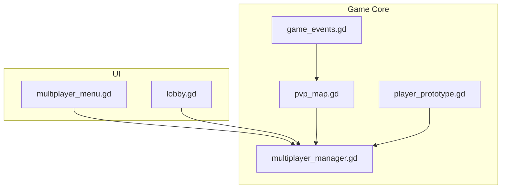
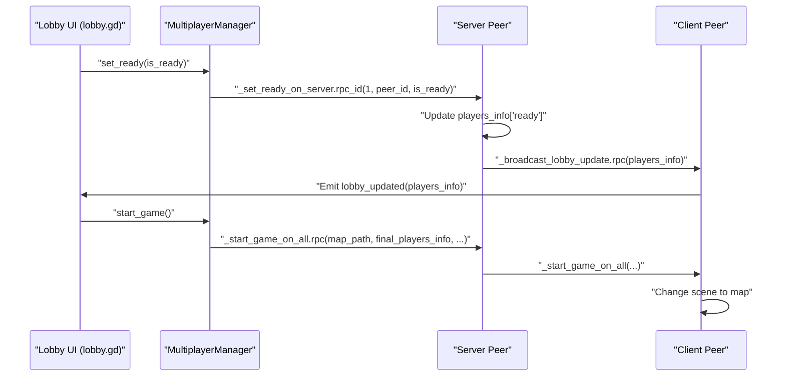
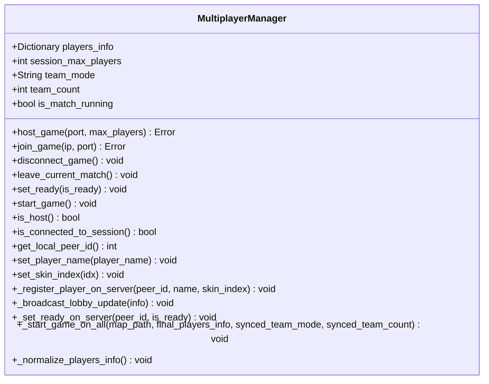
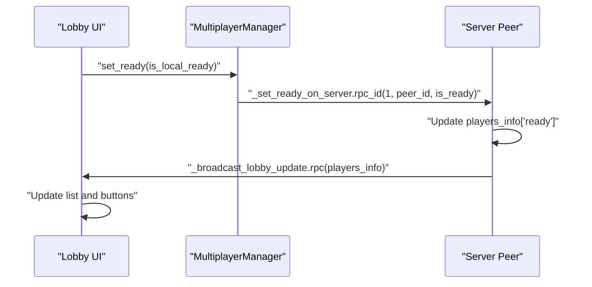
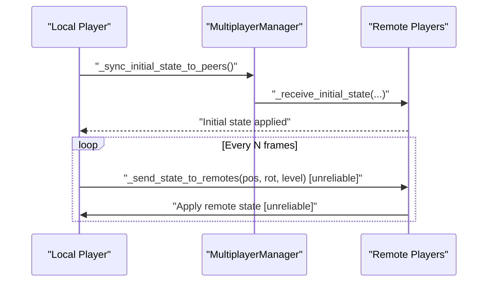
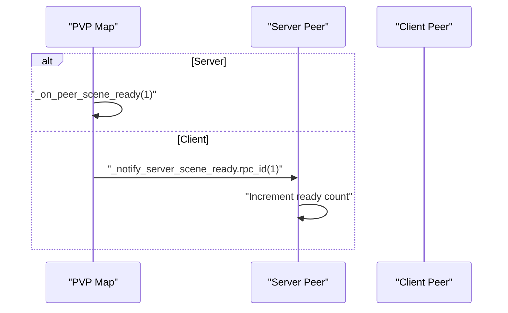

# Network Synchronization

<cite>
**Referenced Files in This Document**
- [multiplayer_manager.gd](file://Scripts/multiplayer_manager.gd)
- [lobby.gd](file://Menu/lobby.gd)
- [multiplayer_menu.gd](file://Menu/multiplayer_menu.gd)
- [player_prototype.gd](file://Scripts/player_prototype.gd)
- [pvp_map.gd](file://Scripts/pvp_map.gd)
- [game_events.gd](file://Scripts/game_events.gd)
</cite>

## Table of Contents
1. [Introduction](#introduction)
2. [Project Structure](#project-structure)
3. [Core Components](#core-components)
4. [Architecture Overview](#architecture-overview)
5. [Detailed Component Analysis](#detailed-component-analysis)
6. [Dependency Analysis](#dependency-analysis)
7. [Performance Considerations](#performance-considerations)
8. [Troubleshooting Guide](#troubleshooting-guide)
9. [Conclusion](#conclusion)
10. [Appendices](#appendices)

## Introduction
This document explains the network synchronization mechanisms implemented in the project, focusing on lobby state synchronization, player readiness updates, authoritative server patterns, RPC reliability, and client-side state broadcasting. It also covers practical topics such as conflict resolution, latency compensation, interpolation, and bandwidth management strategies grounded in the existing codebase.

## Project Structure
The networking stack centers around a singleton MultiplayerManager that encapsulates ENet-based connections and exposes a clean API for lobby management, team assignment, and match start. UI scenes coordinate lobby interactions and chat, while the player prototype handles client-side state broadcasting and remote state application. The PVP map scene participates in a handshake to signal readiness and coordinate scene transitions.



**Diagram sources**
- [multiplayer_menu.gd:1-121](file://Menu/multiplayer_menu.gd#L1-L121)
- [lobby.gd:1-162](file://Menu/lobby.gd#L1-L162)
- [multiplayer_manager.gd:1-322](file://Scripts/multiplayer_manager.gd#L1-L322)
- [pvp_map.gd:44-81](file://Scripts/pvp_map.gd#L44-L81)
- [player_prototype.gd:91-317](file://Scripts/player_prototype.gd#L91-L317)
- [game_events.gd:1-5](file://Scripts/game_events.gd#L1-L5)

**Section sources**
- [multiplayer_menu.gd:1-121](file://Menu/multiplayer_menu.gd#L1-L121)
- [lobby.gd:1-162](file://Menu/lobby.gd#L1-L162)
- [multiplayer_manager.gd:1-322](file://Scripts/multiplayer_manager.gd#L1-L322)
- [pvp_map.gd:44-81](file://Scripts/pvp_map.gd#L44-L81)
- [player_prototype.gd:91-317](file://Scripts/player_prototype.gd#L91-L317)
- [game_events.gd:1-5](file://Scripts/game_events.gd#L1-L5)

## Core Components
- MultiplayerManager: Singleton managing ENet connections, lobby state, team assignment, and match lifecycle. It exposes RPCs for registration, readiness updates, and starting the game. It normalizes dictionary keys after RPC serialization to handle Godot 4’s key conversion behavior.
- Lobby UI: Displays connected players, readiness, teams, and allows the host to start the game. It reacts to lobby updates and connection failures.
- Player Prototype: Applies spawn data reliably, broadcasts client state at intervals, and applies remote state via unreliable RPCs for smooth interpolation.
- PVP Map: Coordinates scene-ready handshake and triggers server-side readiness notifications.
- Game Events: Minimal event hub for game-specific events.

Key implementation patterns:
- Authority pattern: Server-only logic for mutating shared state (e.g., readiness, team assignment, match start).
- Reliable RPCs for critical state (registration, lobby updates, readiness, start signals).
- Unreliable RPCs for frequent client state broadcasts and remote state application.
- Client-side prediction: Movement and rotation are applied locally and periodically synchronized to peers.

**Section sources**
- [multiplayer_manager.gd:17-322](file://Scripts/multiplayer_manager.gd#L17-L322)
- [lobby.gd:17-162](file://Menu/lobby.gd#L17-L162)
- [player_prototype.gd:91-317](file://Scripts/player_prototype.gd#L91-L317)
- [pvp_map.gd:44-81](file://Scripts/pvp_map.gd#L44-L81)
- [game_events.gd:1-5](file://Scripts/game_events.gd#L1-L5)

## Architecture Overview
The system follows an authoritative server model:
- Clients send commands and readiness updates to the server via reliable RPCs.
- The server validates and mutates shared state, then broadcasts lobby updates and readiness to all clients.
- The host starts the game by sending a reliable start RPC that transitions clients to the game scene.
- During gameplay, clients broadcast movement snapshots at a fixed cadence; peers apply them unreliably for smooth rendering.



**Diagram sources**
- [multiplayer_manager.gd:225-274](file://Scripts/multiplayer_manager.gd#L225-L274)
- [lobby.gd:95-107](file://Menu/lobby.gd#L95-L107)

## Detailed Component Analysis

### MultiplayerManager
Responsibilities:
- Host/join sessions via ENet.
- Manage lobby state (players_info, max players, team mode/count).
- Register new players and normalize dictionary keys post-RPC.
- Broadcast lobby updates and readiness checks.
- Start the game and transition clients to the selected map.

Reliable RPCs:
- Registration: [_register_player_on_server:225-242](file://Scripts/multiplayer_manager.gd#L225-L242)
- Lobby update broadcast: [_broadcast_lobby_update:245-250](file://Scripts/multiplayer_manager.gd#L245-L250)
- Readiness update: [_set_ready_on_server:253-262](file://Scripts/multiplayer_manager.gd#L253-L262)
- Start game: [_start_game_on_all:265-274](file://Scripts/multiplayer_manager.gd#L265-L274)

Authority and safety:
- Server-only mutations guard readiness and team assignments.
- Key normalization ensures consistent dictionary access across peers.



**Diagram sources**
- [multiplayer_manager.gd:1-322](file://Scripts/multiplayer_manager.gd#L1-L322)

**Section sources**
- [multiplayer_manager.gd:17-322](file://Scripts/multiplayer_manager.gd#L17-L322)

### Lobby UI (lobby.gd)
Responsibilities:
- Render connected players, readiness, and teams.
- Allow the host to start the game.
- Send chat messages via a reliable RPC and append formatted messages.

Relevant flows:
- Readiness toggle: [_on_ready_button_pressed:95-98](file://Menu/lobby.gd#L95-L98)
- Start button (host): [_on_start_button_pressed:101-102](file://Menu/lobby.gd#L101-L102)
- Chat send: [_on_send_chat_button_pressed/_on_chat_input_text_submitted:113-118](file://Menu/lobby.gd#L113-L118)
- Receive chat: [_receive_chat_message:131-133](file://Menu/lobby.gd#L131-L133)



**Diagram sources**
- [lobby.gd:95-107](file://Menu/lobby.gd#L95-L107)
- [multiplayer_manager.gd:253-262](file://Scripts/multiplayer_manager.gd#L253-L262)

**Section sources**
- [lobby.gd:17-162](file://Menu/lobby.gd#L17-L162)
- [multiplayer_manager.gd:253-262](file://Scripts/multiplayer_manager.gd#L253-L262)

### Player Prototype (client-side state broadcasting and interpolation)
Responsibilities:
- Apply spawn data reliably upon receiving it from the server.
- Periodically broadcast local state (position, rotation, height level) to peers.
- Apply remote state received via unreliable RPCs for smooth interpolation.

Key RPCs and logic:
- Spawn application: [_apply_spawn_data:91-100](file://Scripts/player_prototype.gd#L91-L100)
- Initial state sync: [_sync_initial_state_to_peers:103-116](file://Scripts/player_prototype.gd#L103-L116), [_receive_initial_state:118-121](file://Scripts/player_prototype.gd#L118-L121)
- State broadcast: [_send_state_to_remotes:305-306](file://Scripts/player_prototype.gd#L305-L306)
- Remote state application: [_send_state_to_remotes:309-317](file://Scripts/player_prototype.gd#L309-L317)



**Diagram sources**
- [player_prototype.gd:91-317](file://Scripts/player_prototype.gd#L91-L317)

**Section sources**
- [player_prototype.gd:91-317](file://Scripts/player_prototype.gd#L91-L317)

### PVP Map Scene (scene-ready handshake)
Responsibilities:
- Remove undesired nodes and set up the player container and spawner.
- Coordinate a handshake so peers notify the server when they are ready; the server counts peers and proceeds accordingly.

Key flows:
- Server adds itself to the ready list and defers callback handling.
- Clients send a ready notification RPC to the server.



**Diagram sources**
- [pvp_map.gd:44-81](file://Scripts/pvp_map.gd#L44-L81)

**Section sources**
- [pvp_map.gd:44-81](file://Scripts/pvp_map.gd#L44-L81)

### Game Events Hub
Minimal event signaling for game-specific events (e.g., powerup collection). While not directly involved in synchronization, it demonstrates a pattern for decoupled event propagation.

**Section sources**
- [game_events.gd:1-5](file://Scripts/game_events.gd#L1-L5)

## Dependency Analysis
- UI depends on MultiplayerManager for lobby state and match lifecycle.
- MultiplayerManager depends on Godot’s multiplayer API and ENet backend.
- Player Prototype depends on MultiplayerManager for initial state and on peers for state broadcasts.
- PVP Map coordinates readiness and delegates start logic to MultiplayerManager.

```mermaid
graph LR
MM["multiplayer_manager.gd"] <- --> UI["lobby.gd"]
MM <- --> PV["pvp_map.gd"]
MM <- --> PL["player_prototype.gd"]
UI --> MM
PV --> MM
PL --> MM
```

**Diagram sources**
- [multiplayer_manager.gd:1-322](file://Scripts/multiplayer_manager.gd#L1-L322)
- [lobby.gd:1-162](file://Menu/lobby.gd#L1-L162)
- [pvp_map.gd:44-81](file://Scripts/pvp_map.gd#L44-L81)
- [player_prototype.gd:91-317](file://Scripts/player_prototype.gd#L91-L317)

**Section sources**
- [multiplayer_manager.gd:1-322](file://Scripts/multiplayer_manager.gd#L1-L322)
- [lobby.gd:1-162](file://Menu/lobby.gd#L1-L162)
- [pvp_map.gd:44-81](file://Scripts/pvp_map.gd#L44-L81)
- [player_prototype.gd:91-317](file://Scripts/player_prototype.gd#L91-L317)

## Performance Considerations
- Bandwidth management:
  - Use unreliable RPCs for frequent state broadcasts (movement, rotation) to reduce overhead and avoid head-of-line blocking.
  - Keep snapshot payload small (Vector2 position, single float rotation, integer level).
- Tick rate control:
  - Limit state broadcast frequency to balance responsiveness and bandwidth (e.g., every N frames).
- Interpolation:
  - Apply remote state updates unreliably and interpolate between snapshots for smooth motion.
- Latency compensation:
  - Predictive client-side movement reduces perceived latency; reconcile with server-applied state on receipt of snapshots.
- Conflict resolution:
  - Authority-based updates prevent divergent states; normalize dictionary keys after RPC to maintain consistent access patterns.
- Scene transitions:
  - Server-initiated scene change RPCs ensure all clients switch consistently.

[No sources needed since this section provides general guidance]

## Troubleshooting Guide
Common issues and remedies:
- Connection failures:
  - UI displays failure reasons and resets controls; ensure port availability and correct IP/port.
- Lobby full:
  - Server rejects new peers when session_max_players is reached; adjust host settings.
- Readiness mismatch:
  - Verify readiness RPCs are sent and lobby updates are emitted; check authority guards in server-side handlers.
- State desync:
  - Confirm reliable spawn and initial state RPCs are processed; ensure unreliable snapshots are applied without strict ordering assumptions.
- Key conversion after RPC:
  - Rely on internal normalization to handle integer/string keys; avoid manual key casting elsewhere.

**Section sources**
- [multiplayer_menu.gd:70-77](file://Menu/multiplayer_menu.gd#L70-L77)
- [multiplayer_manager.gd:230-233](file://Scripts/multiplayer_manager.gd#L230-L233)
- [multiplayer_manager.gd:253-262](file://Scripts/multiplayer_manager.gd#L253-L262)
- [multiplayer_manager.gd:315-322](file://Scripts/multiplayer_manager.gd#L315-L322)

## Conclusion
The project implements a robust authoritative networking model with clear separation of concerns:
- MultiplayerManager centralizes lobby and match logic with reliable RPCs for critical state.
- Clients broadcast movement snapshots unreliably and interpolate remotely for smooth visuals.
- The host controls match start and team distribution, ensuring consistent state across peers.
- Practical measures like tick-limited snapshots, interpolation, and normalization address performance and correctness.

[No sources needed since this section summarizes without analyzing specific files]

## Appendices

### RPC Patterns and Reliability
- Reliable RPCs:
  - Used for registration, lobby updates, readiness toggles, and match start.
  - Ensures ordered delivery and guarantees of critical state changes.
- Unreliable RPCs:
  - Used for frequent movement snapshots and remote state application.
  - Accepts potential loss/reordering for reduced bandwidth and improved responsiveness.

**Section sources**
- [multiplayer_manager.gd:225-274](file://Scripts/multiplayer_manager.gd#L225-L274)
- [player_prototype.gd:309-317](file://Scripts/player_prototype.gd#L309-L317)

### Authority Patterns
- Server-only mutation of shared state (readiness, teams, match start).
- Client-only application of remote state and local prediction.
- Explicit checks to prevent non-authoritative writes.

**Section sources**
- [multiplayer_manager.gd:227-242](file://Scripts/multiplayer_manager.gd#L227-L242)
- [multiplayer_manager.gd:255-262](file://Scripts/multiplayer_manager.gd#L255-L262)
- [player_prototype.gd:312-317](file://Scripts/player_prototype.gd#L312-L317)

### Client-Side Prediction and Interpolation
- Local movement updates are applied immediately for responsiveness.
- Periodic snapshots reconcile with server-applied state; remote snapshots are applied unreliably and interpolated.

**Section sources**
- [player_prototype.gd:276-306](file://Scripts/player_prototype.gd#L276-L306)
- [player_prototype.gd:309-317](file://Scripts/player_prototype.gd#L309-L317)

### Lobby State Synchronization and Readiness Updates
- Clients emit readiness changes; server aggregates and broadcasts updated lobby state.
- Host enables start when all players are ready.

**Section sources**
- [lobby.gd:95-107](file://Menu/lobby.gd#L95-L107)
- [multiplayer_manager.gd:253-262](file://Scripts/multiplayer_manager.gd#L253-L262)

### Real-Time Game State Propagation
- Scene-ready handshake ensures peers are loaded before starting.
- Server-driven scene transitions guarantee consistent game state across clients.

**Section sources**
- [pvp_map.gd:67-74](file://Scripts/pvp_map.gd#L67-L74)
- [multiplayer_manager.gd:265-274](file://Scripts/multiplayer_manager.gd#L265-L274)