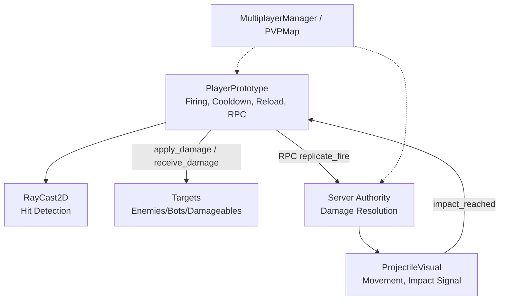
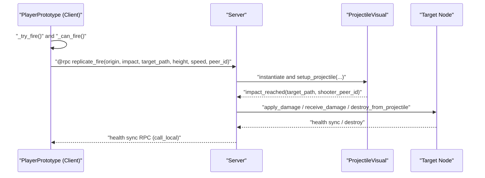
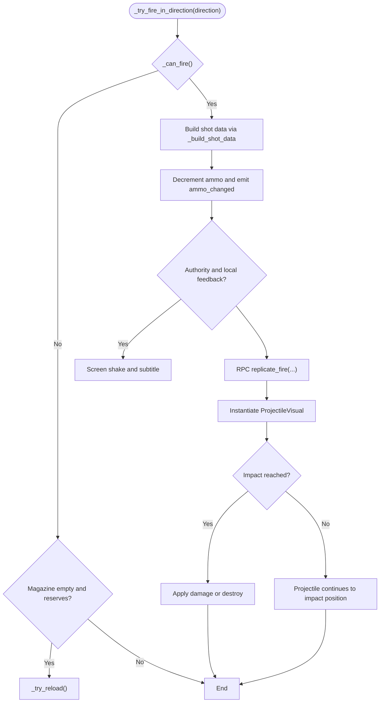
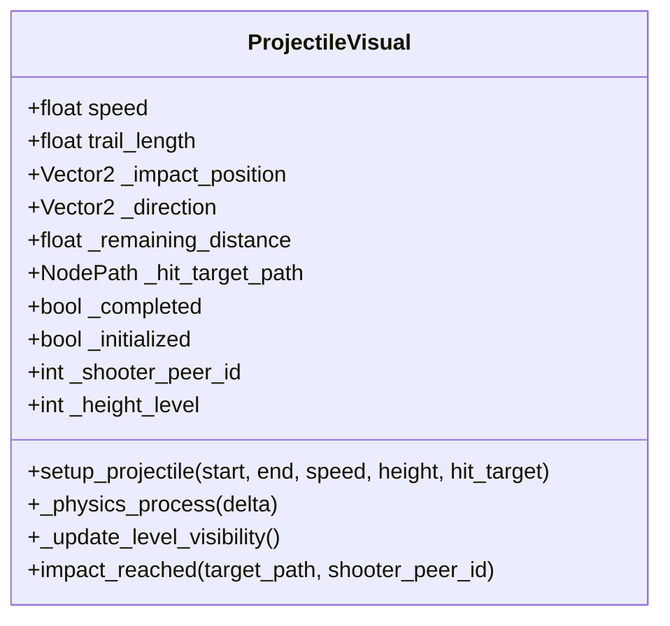
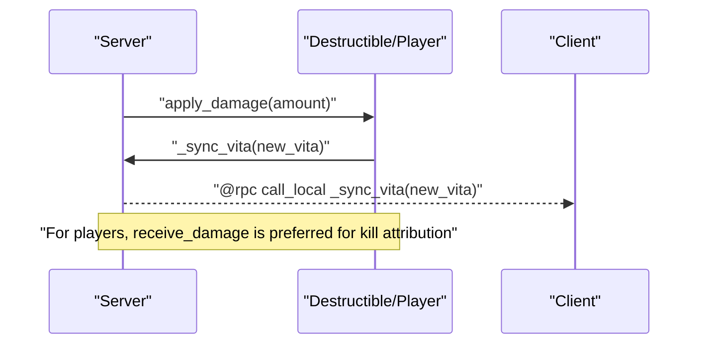
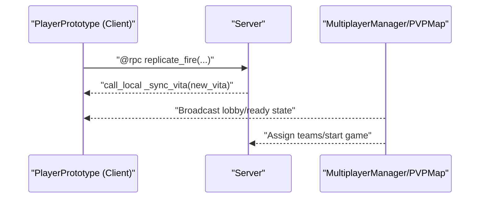
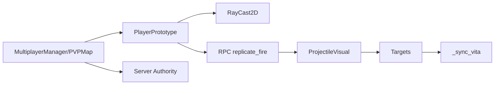

# Combat System

<cite>
**Referenced Files in This Document**
- [player_prototype.gd](file://Scripts/player_prototype.gd)
- [projectile_visual.gd](file://Scripts/projectile_visual.gd)
- [oggetto.gd](file://Scripts/oggetto.gd)
- [multiplayer_manager.gd](file://Scripts/multiplayer_manager.gd)
- [pvp_map.gd](file://Scripts/pvp_map.gd)
</cite>

## Table of Contents
1. [Introduction](#introduction)
2. [Project Structure](#project-structure)
3. [Core Components](#core-components)
4. [Architecture Overview](#architecture-overview)
5. [Detailed Component Analysis](#detailed-component-analysis)
6. [Dependency Analysis](#dependency-analysis)
7. [Performance Considerations](#performance-considerations)
8. [Troubleshooting Guide](#troubleshooting-guide)
9. [Conclusion](#conclusion)

## Introduction
This document provides comprehensive API documentation for the combat system, covering weapon mechanics, projectile physics, damage calculation, and multiplayer synchronization. It documents the firing system with cooldown management, automatic reloading, touch auto-fire functionality, and raycast-based hit detection. It also covers projectile visualization, impact handling, damage application methods, and authoritative combat resolution via RPCs.

## Project Structure
The combat system spans several scripts:
- PlayerPrototype: central combat actor with weapon stats, firing logic, raycast hit detection, reload mechanics, and RPC replication.
- ProjectileVisual: lightweight projectile entity that moves toward a target position, triggers impacts, and handles level-aware visibility.
- Object script (oggetto.gd): shared damage application and destruction logic for destructible props and crates.
- MultiplayerManager and PVPMap: network orchestration and authoritative match control.

**Diagram sources**
- [player_prototype.gd:377-443](file://Scripts/player_prototype.gd#L377-L443)
- [projectile_visual.gd:1-69](file://Scripts/projectile_visual.gd#L1-L69)
- [oggetto.gd:136-179](file://Scripts/oggetto.gd#L136-L179)
- [multiplayer_manager.gd:138-261](file://Scripts/multiplayer_manager.gd#L138-L261)
- [pvp_map.gd:44-90](file://Scripts/pvp_map.gd#L44-L90)

**Section sources**
- [player_prototype.gd:1-985](file://Scripts/player_prototype.gd#L1-L985)
- [projectile_visual.gd:1-69](file://Scripts/projectile_visual.gd#L1-L69)
- [oggetto.gd:136-179](file://Scripts/oggetto.gd#L136-L179)
- [multiplayer_manager.gd:138-261](file://Scripts/multiplayer_manager.gd#L138-L261)
- [pvp_map.gd:44-90](file://Scripts/pvp_map.gd#L44-L90)

## Core Components
- PlayerPrototype
  - Weapon stats: fire_cooldown, shot_range, touch_auto_fire_range, projectile_visual_speed, capacita_caricatore, colpi_correnti, colpi_totali, projectile_damage, reload_duration.
  - Firing pipeline: _try_fire, _try_fire_in_direction, _build_shot_data, _replicate_fire (RPC), _on_projectile_impact.
  - Cooldown and reload: _can_fire, _try_reload, _finish_reload, reload_started signal.
  - Touch auto-fire: _handle_touch_aim_and_fire, _try_touch_auto_fire, _has_enemy_target_in_direction.
  - Hit detection: shot_raycast with group-based targeting and friendly-fire checks.
  - Damage application: _on_projectile_impact routes to apply_damage/receive_damage/destroy_from_projectile.
  - Level-aware visibility and sync: height_level, z_index, collision masks, and authority checks.

- ProjectileVisual
  - Movement: setup_projectile initializes direction and distance; _physics_process advances position until completion.
  - Impact: emits impact_reached with target path and shooter peer ID.
  - Visibility: level-aware visibility via _update_level_visibility.

- Object Script (oggetto.gd)
  - apply_damage: decrements health and synchronizes health via RPC; destroys on zero health.
  - _sync_vita: authoritative health update.
  - destroy/_replicate_destroy: destruction logic for destructible props.

- MultiplayerManager and PVPMap
  - MultiplayerManager: lobby, ready state, and RPCs for registration and broadcasting.
  - PVPMap: scene handshake, player spawning, and match lifecycle RPCs.

**Section sources**
- [player_prototype.gd:11-26](file://Scripts/player_prototype.gd#L11-L26)
- [player_prototype.gd:377-443](file://Scripts/player_prototype.gd#L377-L443)
- [player_prototype.gd:484-516](file://Scripts/player_prototype.gd#L484-L516)
- [player_prototype.gd:518-556](file://Scripts/player_prototype.gd#L518-L556)
- [player_prototype.gd:547-605](file://Scripts/player_prototype.gd#L547-L605)
- [player_prototype.gd:625-639](file://Scripts/player_prototype.gd#L625-L639)
- [projectile_visual.gd:22-69](file://Scripts/projectile_visual.gd#L22-L69)
- [oggetto.gd:136-179](file://Scripts/oggetto.gd#L136-L179)
- [multiplayer_manager.gd:138-261](file://Scripts/multiplayer_manager.gd#L138-L261)
- [pvp_map.gd:44-90](file://Scripts/pvp_map.gd#L44-L90)

## Architecture Overview
The combat system follows an authoritative model:
- Client-side prediction and feedback: cooldown checks, screen shake, HUD updates, and touch aim.
- Server-side authority: RPC-driven replication of shots, impact handling, and damage application.
- Projectile visualization: clients instantiate a lightweight ProjectileVisual to render movement and emit impact events.

**Diagram sources**
- [player_prototype.gd:377-443](file://Scripts/player_prototype.gd#L377-L443)
- [player_prototype.gd:426-443](file://Scripts/player_prototype.gd#L426-L443)
- [projectile_visual.gd:4-41](file://Scripts/projectile_visual.gd#L4-L41)
- [oggetto.gd:136-179](file://Scripts/oggetto.gd#L136-L179)

## Detailed Component Analysis

### PlayerPrototype: Firing, Cooldown, and Reload
- Cooldown management
  - _can_fire enforces fire_cooldown, magazine empties, and authority checks.
  - _get_time_seconds provides monotonic timestamps for cooldown.
- Automatic reloading
  - _try_reload initiates reload if clips empty and reserves remain.
  - _finish_reload replenishes clips and emits ammo_changed.
  - reload_started signal communicates reload duration to UI.
- Touch auto-fire
  - _handle_touch_aim_and_fire smooths aim direction and triggers _try_touch_auto_fire when enemies are in range.
  - _has_enemy_target_in_direction uses shot_raycast with detection_range up to touch_auto_fire_range.
- Raycast-based hit detection
  - _build_shot_data computes impact_position and target_path using shot_raycast.
  - Friendly-fire prevention via _is_enemy_target checks team membership and groups.
- RPC replication and impact handling
  - _replicate_fire spawns ProjectileVisual and connects to impact handling.
  - _on_projectile_impact resolves target method dispatch and applies damage or destruction.

**Diagram sources**
- [player_prototype.gd:377-443](file://Scripts/player_prototype.gd#L377-L443)
- [player_prototype.gd:484-516](file://Scripts/player_prototype.gd#L484-L516)
- [player_prototype.gd:518-556](file://Scripts/player_prototype.gd#L518-L556)
- [player_prototype.gd:547-605](file://Scripts/player_prototype.gd#L547-L605)
- [projectile_visual.gd:22-69](file://Scripts/projectile_visual.gd#L22-L69)

**Section sources**
- [player_prototype.gd:377-443](file://Scripts/player_prototype.gd#L377-L443)
- [player_prototype.gd:484-516](file://Scripts/player_prototype.gd#L484-L516)
- [player_prototype.gd:518-556](file://Scripts/player_prototype.gd#L518-L556)
- [player_prototype.gd:547-605](file://Scripts/player_prototype.gd#L547-L605)
- [player_prototype.gd:625-639](file://Scripts/player_prototype.gd#L625-L639)

### ProjectileVisual: Physics and Impact
- Initialization
  - setup_projectile sets origin, destination, speed, height level, and z-index.
  - Adds itself to level-specific entity group for spatial awareness.
- Movement
  - _physics_process advances position at constant speed; completes when remaining distance is exhausted.
- Impact
  - Emits impact_reached with target path and shooter peer ID upon arrival.
- Visibility
  - _update_level_visibility ensures the projectile is only visible to the local player’s height level.

**Diagram sources**
- [projectile_visual.gd:1-69](file://Scripts/projectile_visual.gd#L1-L69)

**Section sources**
- [projectile_visual.gd:22-69](file://Scripts/projectile_visual.gd#L22-L69)

### Damage Calculation and Application
- Object targets (destructible props)
  - apply_damage decrements health and synchronizes via RPC; destroys on reaching zero.
  - _sync_vita updates health locally after authoritative server sync.
  - destroy/_replicate_destroy handle destruction logic for specific types.
- Player targets
  - receive_damage validates server authority, resolves source peer, and applies damage.
  - apply_damage supports non-multiplayer or server contexts.

**Diagram sources**
- [oggetto.gd:136-179](file://Scripts/oggetto.gd#L136-L179)
- [player_prototype.gd:781-795](file://Scripts/player_prototype.gd#L781-L795)

**Section sources**
- [oggetto.gd:136-179](file://Scripts/oggetto.gd#L136-L179)
- [player_prototype.gd:781-795](file://Scripts/player_prototype.gd#L781-L795)

### Multiplayer Synchronization and Authority
- RPCs
  - _replicate_fire: authoritative replication of shot events to all clients.
  - _sync_vita: call_local reliable RPC for health synchronization.
  - receive_damage: any_peer authoritative resolution with source attribution.
- Authority and feedback
  - _can_apply_local_feedback ensures only authorities trigger local effects.
  - _can_apply_projectile_impacts restricts impact handling to server in multiplayer.
- Network orchestration
  - MultiplayerManager handles registration, ready states, and lobby broadcasts.
  - PVPMap coordinates scene readiness, spawning, and match lifecycle.

**Diagram sources**
- [player_prototype.gd:426-443](file://Scripts/player_prototype.gd#L426-L443)
- [oggetto.gd:150-153](file://Scripts/oggetto.gd#L150-L153)
- [player_prototype.gd:787-795](file://Scripts/player_prototype.gd#L787-L795)
- [multiplayer_manager.gd:138-261](file://Scripts/multiplayer_manager.gd#L138-L261)
- [pvp_map.gd:44-90](file://Scripts/pvp_map.gd#L44-L90)

**Section sources**
- [player_prototype.gd:426-443](file://Scripts/player_prototype.gd#L426-L443)
- [oggetto.gd:150-153](file://Scripts/oggetto.gd#L150-L153)
- [player_prototype.gd:787-795](file://Scripts/player_prototype.gd#L787-L795)
- [multiplayer_manager.gd:138-261](file://Scripts/multiplayer_manager.gd#L138-L261)
- [pvp_map.gd:44-90](file://Scripts/pvp_map.gd#L44-L90)

## Dependency Analysis
- PlayerPrototype depends on:
  - RayCast2D for hit detection and friendly-fire checks.
  - ProjectileVisual for client-side visualization and impact signaling.
  - Multiplayer APIs for authority checks and RPC replication.
- ProjectileVisual depends on:
  - Height-level context to manage visibility and z-order.
- Object targets depend on:
  - apply_damage and _sync_vita for health synchronization.
- MultiplayerManager and PVPMap coordinate:
  - Scene readiness, team assignment, and match lifecycle.

**Diagram sources**
- [player_prototype.gd:33-36](file://Scripts/player_prototype.gd#L33-L36)
- [player_prototype.gd:426-443](file://Scripts/player_prototype.gd#L426-L443)
- [projectile_visual.gd:4-41](file://Scripts/projectile_visual.gd#L4-L41)
- [oggetto.gd:150-153](file://Scripts/oggetto.gd#L150-L153)
- [multiplayer_manager.gd:138-261](file://Scripts/multiplayer_manager.gd#L138-L261)
- [pvp_map.gd:44-90](file://Scripts/pvp_map.gd#L44-L90)

**Section sources**
- [player_prototype.gd:33-36](file://Scripts/player_prototype.gd#L33-L36)
- [player_prototype.gd:426-443](file://Scripts/player_prototype.gd#L426-L443)
- [projectile_visual.gd:4-41](file://Scripts/projectile_visual.gd#L4-L41)
- [oggetto.gd:150-153](file://Scripts/oggetto.gd#L150-L153)
- [multiplayer_manager.gd:138-261](file://Scripts/multiplayer_manager.gd#L138-L261)
- [pvp_map.gd:44-90](file://Scripts/pvp_map.gd#L44-L90)

## Performance Considerations
- Cooldown enforcement prevents spamming; keep fire_cooldown tuned to gameplay feel.
- Raycast range capped by shot_range and detection_range to limit unnecessary queries.
- ProjectileVisual uses fixed-speed movement; ensure speed and distance are balanced to avoid long-tail travel times.
- Level-aware visibility reduces rendering overhead by hiding projectiles on mismatched height levels.
- Authority-based damage prevents redundant client-side calculations and ensures deterministic outcomes.

## Troubleshooting Guide
- No damage applied despite hits
  - Verify target has apply_damage/receive_damage/destroy_from_projectile and that _on_projectile_impact routes correctly.
  - Confirm server authority for damage resolution and that _can_apply_projectile_impacts is satisfied in multiplayer.
- Friendly fire still occurs
  - Check _is_enemy_target logic and ensure team_id comparisons are correct.
- Reload does not trigger
  - Ensure _try_reload is invoked when colpi_correnti <= 0 and colpi_totali > 0.
- Touch auto-fire not firing
  - Confirm _using_touch and _touch_aim_active states, and that _has_enemy_target_in_direction detects targets within touch_auto_fire_range.
- Projectile not visible
  - Check _update_level_visibility and height-level alignment between player and projectile.

**Section sources**
- [player_prototype.gd:445-483](file://Scripts/player_prototype.gd#L445-L483)
- [player_prototype.gd:563-579](file://Scripts/player_prototype.gd#L563-L579)
- [player_prototype.gd:956-981](file://Scripts/player_prototype.gd#L956-L981)
- [player_prototype.gd:532-544](file://Scripts/player_prototype.gd#L532-L544)
- [projectile_visual.gd:61-69](file://Scripts/projectile_visual.gd#L61-L69)

## Conclusion
The combat system integrates client-side feedback with server-authoritative damage resolution. PlayerPrototype manages firing, cooldowns, reloads, and raycast hit detection, while ProjectileVisual provides deterministic visualization and impact signaling. Object targets implement robust health and destruction logic, synchronized via RPCs. Multiplayer orchestration ensures consistent state across clients, enabling fair and responsive combat.