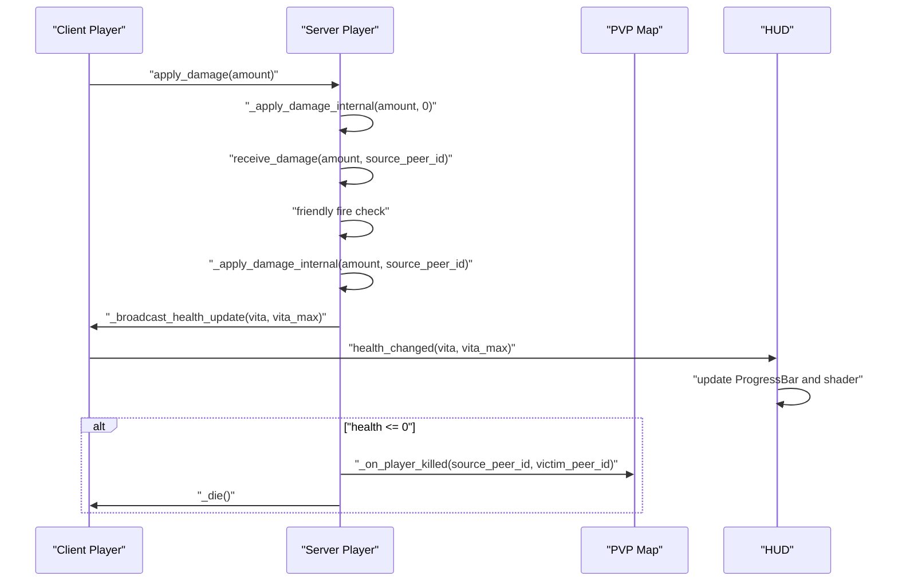
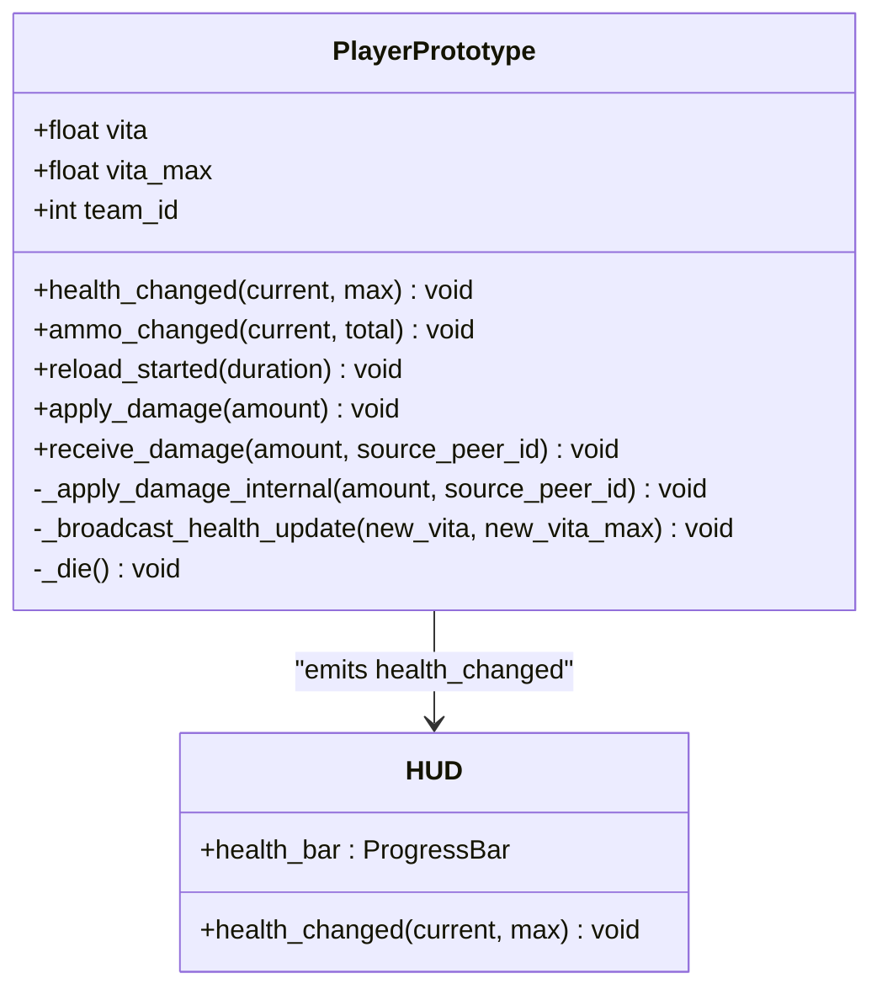
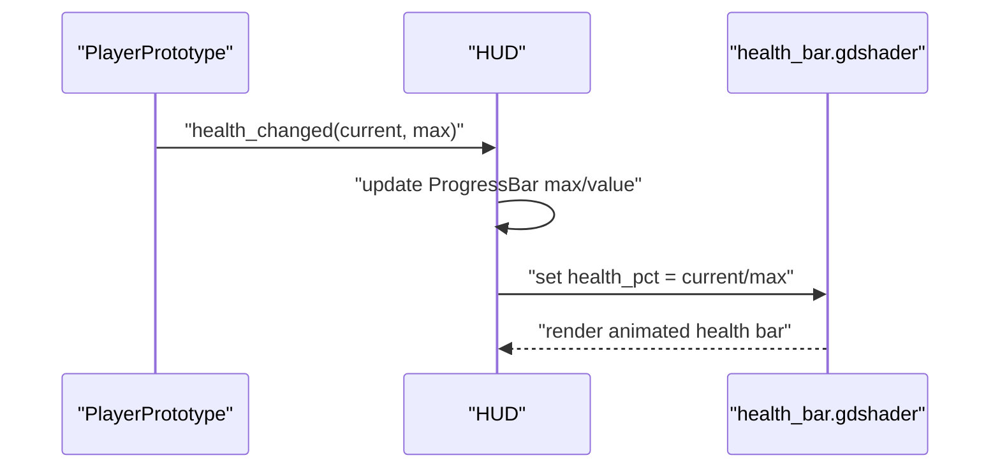
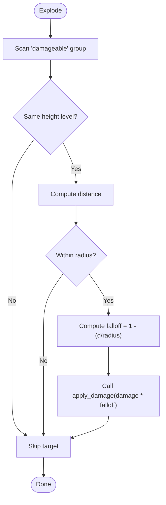
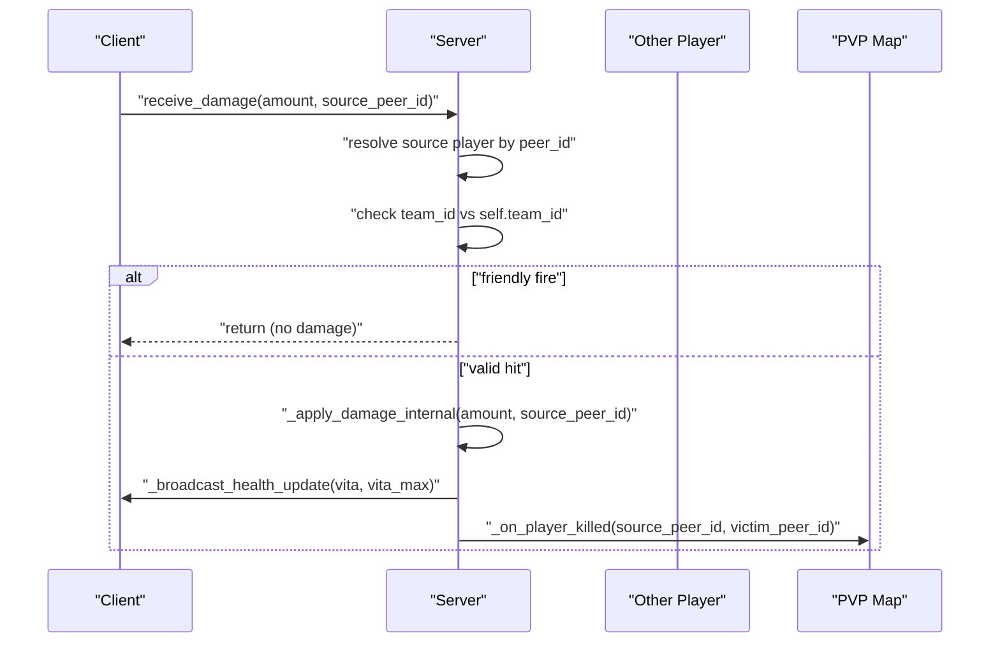
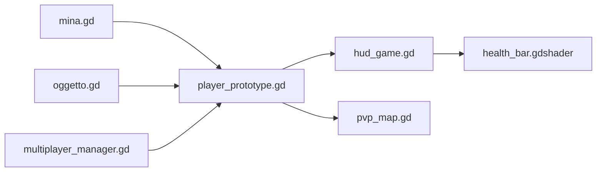

# Health and Damage Management

<cite>
**Referenced Files in This Document**
- [player_prototype.gd](file://Scripts/player_prototype.gd)
- [hud_game.gd](file://Menu/HUD/hud_game.gd)
- [health_bar.gdshader](file://Shaders/HUD/health_bar.gdshader)
- [mina.gd](file://Scripts/mina.gd)
- [oggetto.gd](file://Scripts/oggetto.gd)
- [pvp_map.gd](file://Scripts/pvp_map.gd)
- [multiplayer_manager.gd](file://Scripts/multiplayer_manager.gd)
</cite>

## Table of Contents
1. [Introduction](#introduction)
2. [Project Structure](#project-structure)
3. [Core Components](#core-components)
4. [Architecture Overview](#architecture-overview)
5. [Detailed Component Analysis](#detailed-component-analysis)
6. [Dependency Analysis](#dependency-analysis)
7. [Performance Considerations](#performance-considerations)
8. [Troubleshooting Guide](#troubleshooting-guide)
9. [Conclusion](#conclusion)

## Introduction
This document provides comprehensive API documentation for the health and damage management systems. It covers health bar visualization, damage calculation and application, damage reception RPCs, health state synchronization, and integration with multiplayer authority patterns. It also documents health modification workflows, damage source tracking, and friendly fire prevention mechanisms.

## Project Structure
The health and damage system spans several core files:
- Player prototype script defines health attributes, damage application, and RPCs.
- HUD script subscribes to health signals and updates the health bar and shader visuals.
- Explosive objects implement area damage with height-level targeting and falloff.
- Multiplayer manager and PVP map coordinate authoritative damage handling and match outcomes.

```mermaid
graph TB
subgraph "Player"
PP["player_prototype.gd"]
end
subgraph "HUD"
HUD["hud_game.gd"]
HS["health_bar.gdshader"]
end
subgraph "Environment"
MINE["mina.gd"]
OBJ["oggetto.gd"]
MAP["pvp_map.gd"]
MP["multiplayer_manager.gd"]
end
PP --> HUD
HUD --> HS
MINE --> PP
OBJ --> PP
MAP --> PP
MP --> PP
```

**Diagram sources**
- [player_prototype.gd](file://Scripts/player_prototype.gd)
- [hud_game.gd](file://Menu/HUD/hud_game.gd)
- [health_bar.gdshader](file://Shaders/HUD/health_bar.gdshader)
- [mina.gd](file://Scripts/mina.gd)
- [oggetto.gd](file://Scripts/oggetto.gd)
- [pvp_map.gd](file://Scripts/pvp_map.gd)
- [multiplayer_manager.gd](file://Scripts/multiplayer_manager.gd)

**Section sources**
- [player_prototype.gd](file://Scripts/player_prototype.gd)
- [hud_game.gd](file://Menu/HUD/hud_game.gd)
- [health_bar.gdshader](file://Shaders/HUD/health_bar.gdshader)
- [mina.gd](file://Scripts/mina.gd)
- [oggetto.gd](file://Scripts/oggetto.gd)
- [pvp_map.gd](file://Scripts/pvp_map.gd)
- [multiplayer_manager.gd](file://Scripts/multiplayer_manager.gd)

## Core Components
- Player health model and signals:
  - Health attributes: maximum and current health.
  - Signals: health_changed, ammo_changed, reload_started.
- Damage application:
  - apply_damage(amount): applies damage locally or via server authority.
  - receive_damage(amount, source_peer_id): server-side receiver with friendly fire checks and source attribution.
  - Internal application: _apply_damage_internal(amount, source_peer_id) performs damage, broadcasts updates, and triggers death when health reaches zero.
- Health synchronization:
  - _broadcast_health_update(new_vita, new_vita_max): authoritative update of health state across peers.
  - _die(): disables physics and movement on death.
- HUD integration:
  - Subscribes to health_changed and updates ProgressBar and shader visuals.
  - Uses health_pct parameter to animate the health bar shader.

Key APIs and behaviors:
- apply_damage(amount)
- receive_damage(amount, source_peer_id)
- _apply_damage_internal(amount, source_peer_id)
- _broadcast_health_update(new_vita, new_vita_max)
- _die()

**Section sources**
- [player_prototype.gd](file://Scripts/player_prototype.gd)
- [hud_game.gd](file://Menu/HUD/hud_game.gd)
- [health_bar.gdshader](file://Shaders/HUD/health_bar.gdshader)

## Architecture Overview
The system follows a centralized authority pattern for damage processing:
- Clients invoke apply_damage locally.
- Server validates and applies damage via receive_damage, preventing friendly fire and attributing kills.
- Health updates are broadcast to clients via _broadcast_health_update.
- HUD listens to health_changed to refresh visuals.



**Diagram sources**
- [player_prototype.gd](file://Scripts/player_prototype.gd)
- [pvp_map.gd](file://Scripts/pvp_map.gd)
- [hud_game.gd](file://Menu/HUD/hud_game.gd)

## Detailed Component Analysis

### Player Prototype Health and Damage API
The player prototype encapsulates health state, damage application, and RPCs. It emits health_changed to synchronize UI and supports authoritative damage handling.



**Diagram sources**
- [player_prototype.gd](file://Scripts/player_prototype.gd)
- [hud_game.gd](file://Menu/HUD/hud_game.gd)

Key behaviors:
- apply_damage(amount): invoked by clients; executes immediately on single-player or server-side.
- receive_damage(amount, source_peer_id): server-only; enforces friendly fire prevention and source attribution.
- _apply_damage_internal(amount, source_peer_id): core damage logic; clamps health to zero; broadcasts updates; triggers death and kill attribution.
- _broadcast_health_update(new_vita, new_vita_max): authoritative health sync; emits health_changed.
- _die(): disables physics on authority or local instances.

Damage source tracking:
- receive_damage resolves the source peer and passes it to _apply_damage_internal for kill attribution.
- Projectile replication stores shooter_peer_id on the visual projectile and forwards it to _on_projectile_impact, ensuring accurate source attribution.

Friendly fire prevention:
- receive_damage checks if the source player shares the same team_id; returns early to prevent friendly fire.

**Section sources**
- [player_prototype.gd](file://Scripts/player_prototype.gd)

### HUD Health Bar Integration
The HUD subscribes to health_changed and updates the progress bar and shader visuals. It dynamically adjusts health bar placement and applies a health_pct parameter to the shader.



**Diagram sources**
- [hud_game.gd](file://Menu/HUD/hud_game.gd)
- [health_bar.gdshader](file://Shaders/HUD/health_bar.gdshader)

Behavior highlights:
- Initial connection during setup ensures immediate UI sync after authority assignment.
- Shader animation uses health_pct for dynamic glow and color transitions.

**Section sources**
- [hud_game.gd](file://Menu/HUD/hud_game.gd)
- [health_bar.gdshader](file://Shaders/HUD/health_bar.gdshader)

### Area Damage Mechanics (Explosives)
Explosives apply area damage with height-level targeting and inverse-distance falloff. They iterate damageable targets and call apply_damage with attenuated damage.



**Diagram sources**
- [mina.gd](file://Scripts/mina.gd)
- [oggetto.gd](file://Scripts/oggetto.gd)

Notes:
- Height-level filtering prevents cross-level collateral damage.
- Falloff ensures damage decreases with distance.
- Explosives replicate destruction via RPCs to maintain deterministic visuals.

**Section sources**
- [mina.gd](file://Scripts/mina.gd)
- [oggetto.gd](file://Scripts/oggetto.gd)

### Multiplayer Authority and Friendly Fire
The system integrates with multiplayer authority to centralize damage processing and enforce friendly fire rules.



**Diagram sources**
- [player_prototype.gd](file://Scripts/player_prototype.gd)
- [pvp_map.gd](file://Scripts/pvp_map.gd)

Key points:
- Only the server processes receive_damage.
- Friendly fire prevention compares team_id of source and target.
- Kill attribution uses the source_peer_id passed through the RPC chain.

**Section sources**
- [player_prototype.gd](file://Scripts/player_prototype.gd)
- [pvp_map.gd](file://Scripts/pvp_map.gd)
- [multiplayer_manager.gd](file://Scripts/multiplayer_manager.gd)

## Dependency Analysis
- PlayerPrototype depends on multiplayer authority to process damage and emit health_changed.
- HUD depends on PlayerPrototype’s health_changed signal and health_pct shader parameter.
- Explosives depend on the "damageable" group and height-level metadata to apply damage.
- PVP map coordinates kill events and match termination, integrating with player death RPCs.



**Diagram sources**
- [player_prototype.gd](file://Scripts/player_prototype.gd)
- [hud_game.gd](file://Menu/HUD/hud_game.gd)
- [health_bar.gdshader](file://Shaders/HUD/health_bar.gdshader)
- [mina.gd](file://Scripts/mina.gd)
- [oggetto.gd](file://Scripts/oggetto.gd)
- [pvp_map.gd](file://Scripts/pvp_map.gd)
- [multiplayer_manager.gd](file://Scripts/multiplayer_manager.gd)

**Section sources**
- [player_prototype.gd](file://Scripts/player_prototype.gd)
- [hud_game.gd](file://Menu/HUD/hud_game.gd)
- [health_bar.gdshader](file://Shaders/HUD/health_bar.gdshader)
- [mina.gd](file://Scripts/mina.gd)
- [oggetto.gd](file://Scripts/oggetto.gd)
- [pvp_map.gd](file://Scripts/pvp_map.gd)
- [multiplayer_manager.gd](file://Scripts/multiplayer_manager.gd)

## Performance Considerations
- Centralized authority: Server-side damage processing reduces client-side prediction overhead and ensures fairness.
- Efficient broadcasting: _broadcast_health_update synchronizes only vital stats and emits a single signal to subscribed HUDs.
- Area damage filtering: Height-level checks and distance thresholds reduce unnecessary calls to apply_damage.
- Shader updates: health_pct updates are minimal and optimized for real-time rendering.

## Troubleshooting Guide
Common issues and resolutions:
- Health not updating on HUD:
  - Verify health_changed emission and connection in HUD setup.
  - Confirm ProgressBar max/value assignments and shader parameter binding.
- Friendly fire still occurs:
  - Ensure receive_damage runs on the server and team_id comparison is active.
  - Confirm source_peer_id resolution and that the source player exists in the scene tree.
- Death not triggering:
  - Check _die RPC invocation and that set_physics_process(false) is executed on authority.
  - Verify kill attribution path calls _on_player_killed on the map.
- Explosive damage not applied:
  - Confirm targets belong to the "damageable" group and share the same height level.
  - Validate distance and radius checks and falloff computation.

**Section sources**
- [player_prototype.gd](file://Scripts/player_prototype.gd)
- [hud_game.gd](file://Menu/HUD/hud_game.gd)
- [mina.gd](file://Scripts/mina.gd)
- [oggetto.gd](file://Scripts/oggetto.gd)
- [pvp_map.gd](file://Scripts/pvp_map.gd)

## Conclusion
The health and damage system combines authoritative server-side damage processing with responsive client-side HUD updates. It enforces friendly fire prevention, tracks damage sources for fair kill attribution, and scales damage with distance and height-level proximity. The modular design allows easy extension for new damage sources and synchronization patterns.