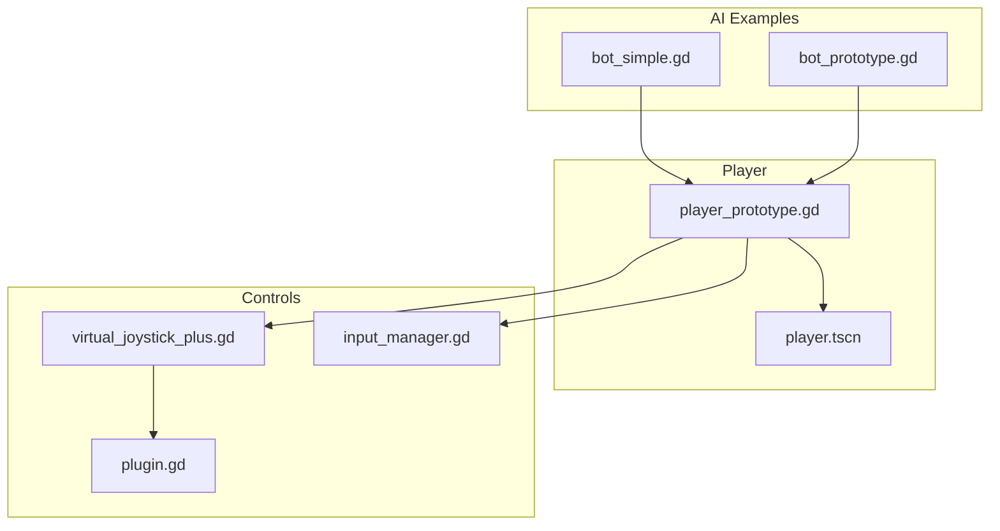
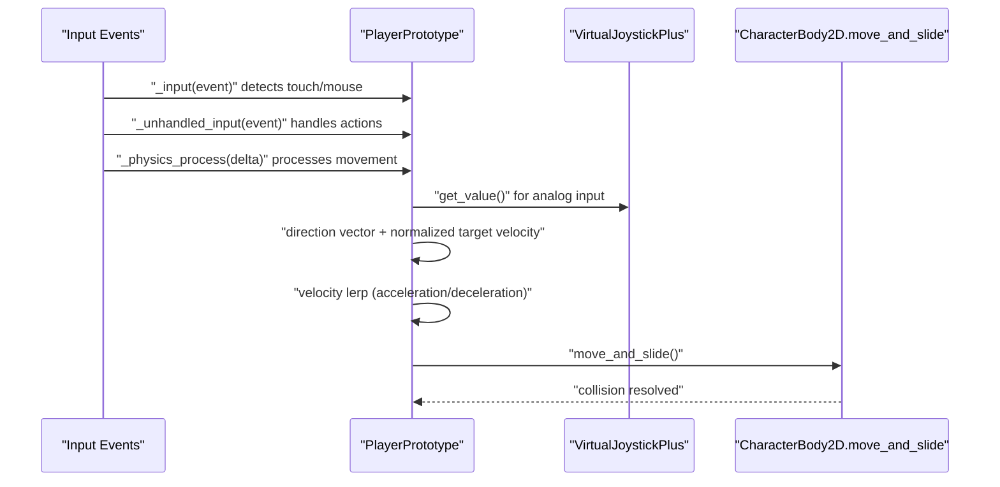
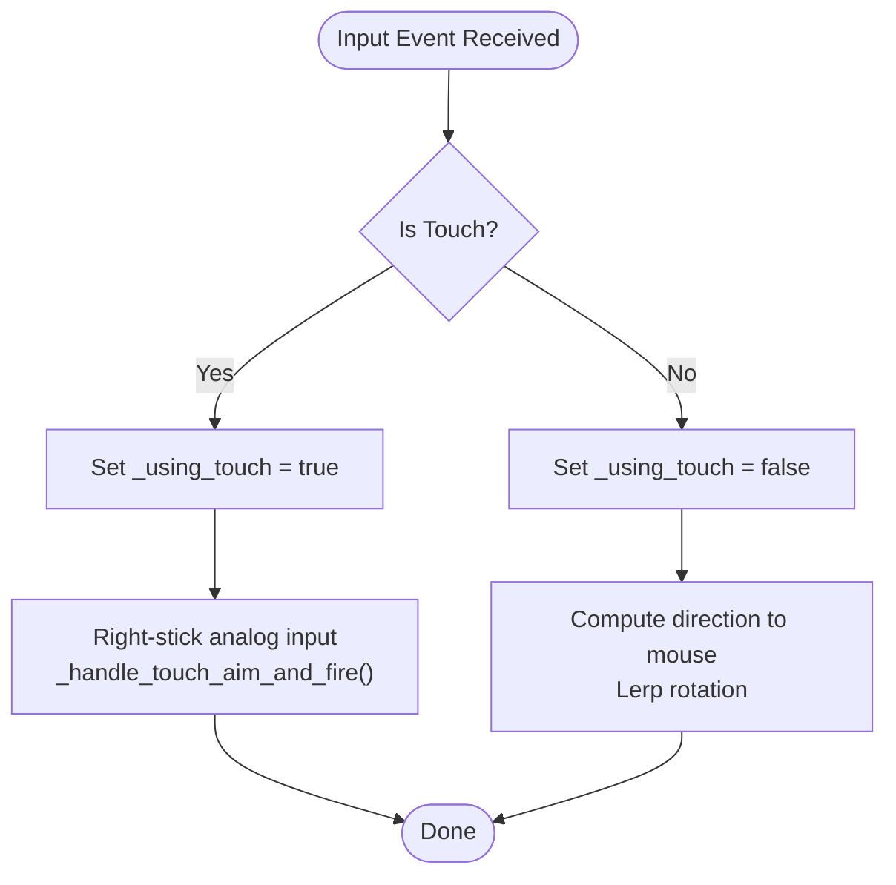
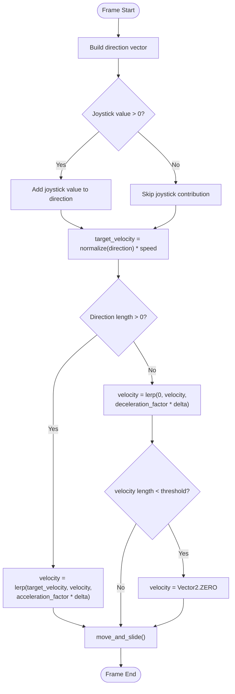
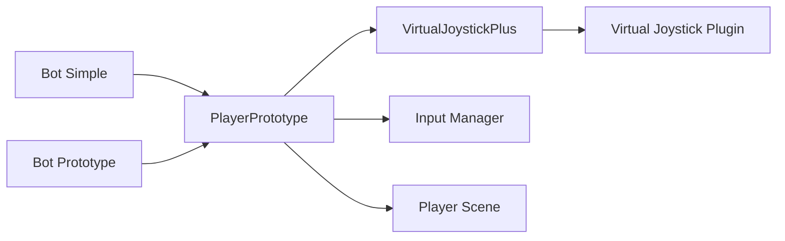

# Movement and Controls

<cite>
**Referenced Files in This Document**
- [player_prototype.gd](file://Scripts/player_prototype.gd)
- [virtual_joystick_plus.gd](file://addons/virtual_joystick_plus/virtual_joystick_plus.gd)
- [plugin.gd](file://addons/virtual_joystick_plus/plugin.gd)
- [input_manager.gd](file://Game/input_manager.gd)
- [player.tscn](file://player.tscn)
- [bot_simple.gd](file://Scripts/bot_simple.gd)
- [bot_prototype.gd](file://Scripts/bot_prototype.gd)
</cite>

## Table of Contents
1. [Introduction](#introduction)
2. [Project Structure](#project-structure)
3. [Core Components](#core-components)
4. [Architecture Overview](#architecture-overview)
5. [Detailed Component Analysis](#detailed-component-analysis)
6. [Dependency Analysis](#dependency-analysis)
7. [Performance Considerations](#performance-considerations)
8. [Troubleshooting Guide](#troubleshooting-guide)
9. [Conclusion](#conclusion)

## Introduction
This document provides detailed API documentation for the player movement and control systems. It covers keyboard WASD controls, mouse look, and touch controls for mobile devices. It also documents the CharacterBody2D implementation, velocity calculations, acceleration/deceleration curves, collision handling, VirtualJoystickPlus integration, input event processing, and platform-specific control mappings. Examples of movement function signatures, parameter descriptions, and integration patterns with the input manager system are included.

## Project Structure
The movement system spans several core files:
- Player controller logic and movement: Scripts/player_prototype.gd
- Virtual joystick addon: addons/virtual_joystick_plus/virtual_joystick_plus.gd
- Virtual joystick plugin registration: addons/virtual_joystick_plus/plugin.gd
- Input manager: Game/input_manager.gd
- Player scene: player.tscn
- Example bot movement patterns: Scripts/bot_simple.gd and Scripts/bot_prototype.gd

**Diagram sources**
- [player_prototype.gd](file://Scripts/player_prototype.gd)
- [virtual_joystick_plus.gd](file://addons/virtual_joystick_plus/virtual_joystick_plus.gd)
- [plugin.gd](file://addons/virtual_joystick_plus/plugin.gd)
- [input_manager.gd](file://Game/input_manager.gd)
- [player.tscn](file://player.tscn)
- [bot_simple.gd](file://Scripts/bot_simple.gd)
- [bot_prototype.gd](file://Scripts/bot_prototype.gd)

**Section sources**
- [player_prototype.gd](file://Scripts/player_prototype.gd)
- [virtual_joystick_plus.gd](file://addons/virtual_joystick_plus/virtual_joystick_plus.gd)
- [plugin.gd](file://addons/virtual_joystick_plus/plugin.gd)
- [input_manager.gd](file://Game/input_manager.gd)
- [player.tscn](file://player.tscn)
- [bot_simple.gd](file://Scripts/bot_simple.gd)
- [bot_prototype.gd](file://Scripts/bot_prototype.gd)

## Core Components
- Player controller: Implements keyboard WASD movement, mouse look, and optional touch controls. Uses CharacterBody2D for physics movement and integrates with VirtualJoystickPlus for analog input.
- VirtualJoystickPlus: On-screen analog stick that emits signals for analog movement and dead-zone handling.
- Input manager: Centralized input mapping and action configuration.
- Bot movement examples: Demonstrate similar movement patterns using CharacterBody2D and move_and_slide.

Key movement APIs and behaviors:
- Keyboard WASD: Uses Input.is_key_pressed for directional keys and arrow keys.
- Mouse look: Computes direction to mouse position and lerps rotation.
- Touch controls: Detects screen touch/drag events and routes to analog look and fire actions.
- Velocity blending: Combines directional input with joystick value and applies acceleration/deceleration via linear interpolation.
- Collision handling: Uses move_and_slide after setting velocity.

**Section sources**
- [player_prototype.gd](file://Scripts/player_prototype.gd)
- [virtual_joystick_plus.gd](file://addons/virtual_joystick_plus/virtual_joystick_plus.gd)
- [input_manager.gd](file://Game/input_manager.gd)

## Architecture Overview
The movement pipeline integrates input events, joystick data, and physics movement:

**Diagram sources**
- [player_prototype.gd](file://Scripts/player_prototype.gd)
- [virtual_joystick_plus.gd](file://addons/virtual_joystick_plus/virtual_joystick_plus.gd)

## Detailed Component Analysis

### Player Prototype Movement API
Responsibilities:
- Process input events for keyboard, mouse, and touch.
- Combine WASD and joystick inputs to compute movement direction.
- Apply acceleration/deceleration to velocity.
- Rotate toward mouse or joystick-based aim when not using touch.
- Integrate with multiplayer synchronization tick.

Key functions and parameters:
- _unhandled_input(event: InputEvent) -> void
  - Handles action presses (e.g., level switching, reload).
  - Processes mouse button press for firing.
- _input(event: InputEvent) -> void
  - Detects whether input is touch or mouse to toggle touch mode.
- _physics_process(delta: float) -> void
  - Builds direction vector from WASD/arrow keys.
  - Adds joystick value if present.
  - Computes normalized target velocity multiplied by speed.
  - Applies acceleration with velocity.lerp when moving; deceleration with higher factor when idle.
  - Calls move_and_slide to resolve collisions.
  - Optional touch aim and fire handling when using touch.
  - Multiplayer sync tick increment.

Platform-specific mappings:
- WASD and arrow keys for movement.
- Mouse look rotation when not using touch.
- Touch detection via InputEventScreenTouch/ScreenDrag; toggles touch mode.
- Right-stick analog input for touch-based aim.

Integration patterns:
- Uses Input.is_key_pressed for discrete key checks.
- Uses joystick.get_value() for analog input.
- Uses move_and_slide() for collision-aware movement.

Example signature references:
- [player_prototype.gd:_unhandled_input:230-250](file://Scripts/player_prototype.gd#L230-L250)
- [player_prototype.gd:_input:251-260](file://Scripts/player_prototype.gd#L251-L260)
- [player_prototype.gd:_physics_process:261-301](file://Scripts/player_prototype.gd#L261-L301)

**Section sources**
- [player_prototype.gd](file://Scripts/player_prototype.gd)

### VirtualJoystickPlus API
Responsibilities:
- Provides on-screen analog stick for mobile/touch devices.
- Emits analogic_changed signal with value, distance, and angles.
- Manages dead-zone enter/leave transitions.
- Supports dynamic activation and runtime visibility.

Public signals:
- analogic_changed(value: Vector2, distance: float, angle: float, angle_clockwise: float, angle_not_clockwise: float)
- deadzone_enter()
- deadzone_leave()

Properties and behaviors:
- Dead-zone handling adjusts raw input to zero when within threshold.
- Returns structured dictionary with processed value, distance, and angles.
- Active flag controls whether signals are emitted.

Example signature references:
- [virtual_joystick_plus.gd:analogic_changed signal:9-16](file://addons/virtual_joystick_plus/virtual_joystick_plus.gd#L9-L16)
- [virtual_joystick_plus.gd:deadzone_enter/leave signals:18-22](file://addons/virtual_joystick_plus/virtual_joystick_plus.gd#L18-L22)
- [virtual_joystick_plus.gd:_apply_deadzone:464-498](file://addons/virtual_joystick_plus/virtual_joystick_plus.gd#L464-L498)
- [virtual_joystick_plus.gd:_update_emit_signals:501-519](file://addons/virtual_joystick_plus/virtual_joystick_plus.gd#L501-L519)

**Section sources**
- [virtual_joystick_plus.gd](file://addons/virtual_joystick_plus/virtual_joystick_plus.gd)

### Input Manager Integration
Responsibilities:
- Centralizes input action mappings and configurations.
- Provides consistent action names consumed by the player controller.

Usage pattern:
- Player controller reads actions such as "cambia_piano" and weapon actions.
- Action names are configured in the input manager and mapped to physical inputs.

Example signature references:
- [input_manager.gd](file://Game/input_manager.gd)

**Section sources**
- [input_manager.gd](file://Game/input_manager.gd)

### CharacterBody2D Movement Patterns
Both bot scripts demonstrate movement patterns aligned with the player controller:
- Extend CharacterBody2D and use move_and_slide for collision-aware movement.
- Compute desired velocity from direction vectors and apply acceleration via velocity.lerp.
- Decelerate toward zero when no input is detected.
- Clamp minimum velocity threshold to zero to prevent jitter.

Example signature references:
- [bot_simple.gd](file://Scripts/bot_simple.gd)
- [bot_prototype.gd](file://Scripts/bot_prototype.gd)

**Section sources**
- [bot_simple.gd](file://Scripts/bot_simple.gd)
- [bot_prototype.gd](file://Scripts/bot_prototype.gd)

### Touch Controls Flow
Touch input is differentiated from mouse input and routed to analog look and fire actions when applicable.

**Diagram sources**
- [player_prototype.gd](file://Scripts/player_prototype.gd)

**Section sources**
- [player_prototype.gd](file://Scripts/player_prototype.gd)

### Acceleration and Deceleration Mechanics
Velocity blending uses linear interpolation with delta-time dependent factors:
- Moving: velocity.lerp(target_velocity, factor * delta) with moderate acceleration.
- Stopping: velocity.lerp(Vector2.ZERO, higher_factor * delta) for quicker stop.
- Threshold cleanup: if velocity length falls below a small threshold, snap to zero.

**Diagram sources**
- [player_prototype.gd](file://Scripts/player_prototype.gd)

**Section sources**
- [player_prototype.gd](file://Scripts/player_prototype.gd)

## Dependency Analysis
- PlayerPrototype depends on:
  - VirtualJoystickPlus for analog input.
  - Input manager for action names and mappings.
  - Scene node for mouse position and global transforms.
- VirtualJoystickPlus is registered as a custom control via plugin.gd.
- Bot scripts demonstrate equivalent movement patterns using CharacterBody2D.

**Diagram sources**
- [player_prototype.gd](file://Scripts/player_prototype.gd)
- [virtual_joystick_plus.gd](file://addons/virtual_joystick_plus/virtual_joystick_plus.gd)
- [plugin.gd](file://addons/virtual_joystick_plus/plugin.gd)
- [input_manager.gd](file://Game/input_manager.gd)
- [player.tscn](file://player.tscn)
- [bot_simple.gd](file://Scripts/bot_simple.gd)
- [bot_prototype.gd](file://Scripts/bot_prototype.gd)

**Section sources**
- [player_prototype.gd](file://Scripts/player_prototype.gd)
- [virtual_joystick_plus.gd](file://addons/virtual_joystick_plus/virtual_joystick_plus.gd)
- [plugin.gd](file://addons/virtual_joystick_plus/plugin.gd)
- [input_manager.gd](file://Game/input_manager.gd)
- [player.tscn](file://player.tscn)
- [bot_simple.gd](file://Scripts/bot_simple.gd)
- [bot_prototype.gd](file://Scripts/bot_prototype.gd)

## Performance Considerations
- Delta-time dependent interpolation ensures smooth movement across variable frame rates.
- Dead-zone handling reduces noisy input near center, minimizing unnecessary acceleration.
- Threshold snapping prevents tiny residual velocities from causing jitter.
- Using move_and_slide resolves collisions efficiently per frame.

## Troubleshooting Guide
Common issues and resolutions:
- No movement with WASD:
  - Verify Input.is_key_pressed mappings in the input manager.
  - Confirm _physics_process is being called and direction vector is built.
- Joystick not affecting movement:
  - Ensure VirtualJoystickPlus is instantiated and its value is being read.
  - Check dead-zone settings and that the stick is outside the dead zone.
- Mouse look feels sluggish:
  - Adjust the rotation lerp factor in the mouse look branch.
- Touch aim not working:
  - Confirm _input detects ScreenTouch/ScreenDrag and sets _using_touch.
  - Ensure right-stick analog input is routed to aim logic.
- Velocity does not stop:
  - Verify deceleration path and threshold check.
  - Ensure move_and_slide is called each frame.

**Section sources**
- [player_prototype.gd](file://Scripts/player_prototype.gd)
- [virtual_joystick_plus.gd](file://addons/virtual_joystick_plus/virtual_joystick_plus.gd)

## Conclusion
The movement and control system combines discrete keyboard input, analog joystick input, and mouse/touch look into a unified CharacterBody2D-driven movement model. The VirtualJoystickPlus addon provides robust analog input for mobile platforms, while the input manager centralizes action mappings. The player controller’s velocity blending and collision handling deliver responsive and predictable motion suitable for both desktop and mobile targets.