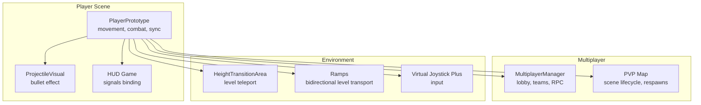
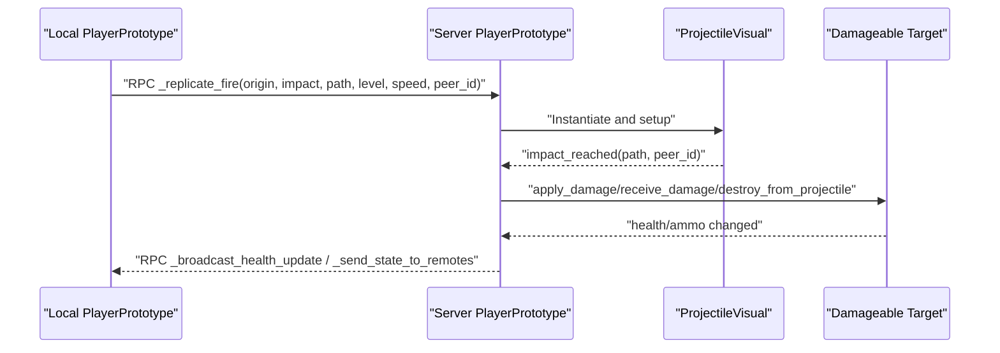
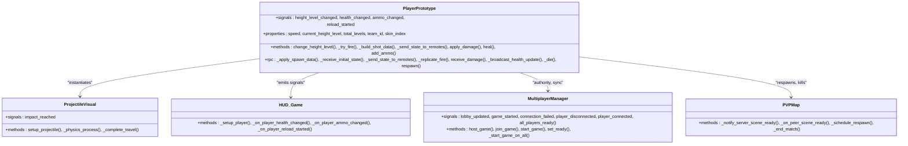

# Player System API

<cite>
**Referenced Files in This Document**
- [player_prototype.gd](file://Scripts/player_prototype.gd)
- [player.tscn](file://player.tscn)
- [projectile_visual.gd](file://Scripts/projectile_visual.gd)
- [hud_game.gd](file://Menu/HUD/hud_game.gd)
- [multiplayer_manager.gd](file://Scripts/multiplayer_manager.gd)
- [pvp_map.gd](file://Scripts/pvp_map.gd)
- [height_transition_area.gd](file://Scripts/height_transition_area.gd)
- [ramp.gd](file://Scripts/ramp.gd)
- [virtual_joystick_plus.gd](file://addons/virtual_joystick_plus/virtual_joystick_plus.gd)
</cite>

## Table of Contents
1. [Introduction](#introduction)
2. [Project Structure](#project-structure)
3. [Core Components](#core-components)
4. [Architecture Overview](#architecture-overview)
5. [Detailed Component Analysis](#detailed-component-analysis)
6. [Dependency Analysis](#dependency-analysis)
7. [Performance Considerations](#performance-considerations)
8. [Troubleshooting Guide](#troubleshooting-guide)
9. [Conclusion](#conclusion)
10. [Appendices](#appendices)

## Introduction
This document provides comprehensive API documentation for the Player System, focusing on the PlayerPrototype class and related subsystems. It covers movement mechanics, combat functions, health management, weapon systems, height level transitions, and multiplayer synchronization. The guide includes parameter descriptions, RPC method documentation, authority patterns, and practical examples for both single-player and multiplayer scenarios. Integration with input systems and HUD signaling is also explained.

## Project Structure
The Player System is composed of:
- Player scene and script: PlayerPrototype class with movement, combat, health, and synchronization logic
- Projectile visualization: ProjectileVisual class for bullet effects and impact handling
- HUD integration: Health, ammo, and reload signals connected to the HUD
- Multiplayer infrastructure: MultiplayerManager and PVP map orchestration
- Level transition utilities: HeightTransitionArea and Ramp for height-level navigation
- Input integration: Virtual joystick support for analog movement and aiming

**Diagram sources**
- [player_prototype.gd:1-1028](file://Scripts/player_prototype.gd#L1-L1028)
- [projectile_visual.gd:1-71](file://Scripts/projectile_visual.gd#L1-L71)
- [hud_game.gd:63-91](file://Menu/HUD/hud_game.gd#L63-L91)
- [multiplayer_manager.gd:1-322](file://Scripts/multiplayer_manager.gd#L1-L322)
- [pvp_map.gd:55-335](file://Scripts/pvp_map.gd#L55-L335)
- [height_transition_area.gd:1-14](file://Scripts/height_transition_area.gd#L1-L14)
- [ramp.gd:99-142](file://Scripts/ramp.gd#L99-L142)
- [virtual_joystick_plus.gd:51-519](file://addons/virtual_joystick_plus/virtual_joystick_plus.gd#L51-L519)

**Section sources**
- [player_prototype.gd:1-1028](file://Scripts/player_prototype.gd#L1-L1028)
- [player.tscn:1-155](file://player.tscn#L1-L155)

## Core Components
- PlayerPrototype: Central character controller implementing movement, aiming, shooting, reloading, health, and multiplayer synchronization
- ProjectileVisual: Lightweight projectile effect that triggers impacts and communicates target paths
- HUD integration via signals: health_changed, ammo_changed, reload_started, height_level_changed
- MultiplayerManager: Host/Join, lobby, team assignment, and RPC orchestration
- PVP map: Scene lifecycle, readiness handshake, kills tracking, and respawn scheduling
- Environment utilities: HeightTransitionArea and Ramp for height-level transitions
- Input: VirtualJoystickPlus providing analog movement and touch-based aiming

**Section sources**
- [player_prototype.gd:1-1028](file://Scripts/player_prototype.gd#L1-L1028)
- [projectile_visual.gd:1-71](file://Scripts/projectile_visual.gd#L1-L71)
- [hud_game.gd:63-91](file://Menu/HUD/hud_game.gd#L63-L91)
- [multiplayer_manager.gd:1-322](file://Scripts/multiplayer_manager.gd#L1-L322)
- [pvp_map.gd:55-335](file://Scripts/pvp_map.gd#L55-L335)
- [height_transition_area.gd:1-14](file://Scripts/height_transition_area.gd#L1-L14)
- [ramp.gd:99-142](file://Scripts/ramp.gd#L99-L142)
- [virtual_joystick_plus.gd:51-519](file://addons/virtual_joystick_plus/virtual_joystick_plus.gd#L51-L519)

## Architecture Overview
The Player System follows a client-authority model:
- Authority: The player node with matching peer ID holds authority and executes authoritative actions (shooting, damage, respawns)
- Replication: Movement and level changes are replicated to peers at a fixed cadence
- Impact handling: Server validates hits and applies damage; clients show feedback
- HUD: Signals propagate state updates to the HUD for immediate UI feedback

**Diagram sources**
- [player_prototype.gd:422-478](file://Scripts/player_prototype.gd#L422-L478)
- [projectile_visual.gd:20-71](file://Scripts/projectile_visual.gd#L20-L71)

**Section sources**
- [player_prototype.gd:294-314](file://Scripts/player_prototype.gd#L294-L314)
- [player_prototype.gd:422-478](file://Scripts/player_prototype.gd#L422-L478)
- [projectile_visual.gd:1-71](file://Scripts/projectile_visual.gd#L1-L71)

## Detailed Component Analysis

### PlayerPrototype API Reference
- Class: PlayerPrototype extends CharacterBody2D
- Signals:
  - height_level_changed(new_level: int)
  - health_changed(current: float, max_val: float)
  - ammo_changed(current: int, total: int)
  - reload_started(duration: float)

- Exported Properties (configuration):
  - speed: Movement speed
  - current_height_level: Current height level (0..total_levels-1)
  - total_levels: Number of height levels
  - team_id: Player team identifier
  - skin_index: Visual skin index
  - fire_cooldown: Minimum time between shots
  - shot_range: Maximum shot raycast distance
  - touch_auto_fire_range: Detection range for auto-fire on touch
  - projectile_visual_speed: Visual projectile speed
  - vita_max: Maximum health
  - colpi_correnti: Current magazine
  - colpi_totali: Reserve ammunition
  - capacita_caricatore: Magazine capacity
  - nome_arma: Weapon name for animation mapping
  - player_name: Player display name

- Internal Properties:
  - navigation_agent, joystick, right_stick, muzzle_marker, shot_raycast, camera_2d, global_settings, nickname_label
  - projectile_damage, reload_duration
  - _using_touch, _is_reloading, _reload_tween, _last_shot_time, _last_touch_aim_direction, _touch_aim_active, _camera_base_offset, _shake_time_left, _shake_strength
  - _sync_tick, _SYNC_EVERY

- Methods:
  - change_height_level(new_level: int, force_update: bool=false)
  - apply_damage(amount: float)
  - receive_damage(amount: float, source_peer_id: int)
  - heal(amount: float)
  - add_ammo(amount: int)
  - _try_fire()
  - _try_fire_in_direction(aim_direction: Vector2)
  - _build_shot_data(fire_origin: Vector2, aim_direction: Vector2)
  - _get_fire_origin() -> Vector2
  - _get_aim_direction(fire_origin: Vector2) -> Vector2
  - _handle_touch_aim_and_fire(look_dir: Vector2, delta: float)
  - _try_touch_auto_fire()
  - _has_enemy_target_in_direction(fire_origin: Vector2, aim_direction: Vector2, detection_range: float) -> bool
  - _is_enemy_target(target: Variant) -> bool
  - _configure_shot_raycast_for_current_level()
  - _can_apply_projectile_impacts() -> bool
  - _can_fire() -> bool
  - _try_reload()
  - _finish_reload()
  - _play_reload_animation()
  - _update_team_color()
  - _initialize_level_system()
  - _check_and_restore_checkpoint()
  - _send_state_to_remotes(remote_pos: Vector2, remote_rot: float, remote_level: int)
  - _apply_spawn_data(spawn_pos: Vector2, spawn_level: int)
  - _receive_initial_state(p_team_id: int, p_skin_index: int, p_nome_arma: String, p_player_name: String)
  - _sync_initial_state_to_peers()

- RPC Methods:
  - _apply_spawn_data(spawn_pos: Vector2, spawn_level: int)
  - _receive_initial_state(p_team_id: int, p_skin_index: int, p_nome_arma: String, p_player_name: String)
  - _send_state_to_remotes(remote_pos: Vector2, remote_rot: float, remote_level: int)
  - _replicate_fire(origin: Vector2, impact_position: Vector2, target_path: NodePath, height_level: int, visual_speed: float, shooter_peer_id: int)
  - receive_damage(amount: float, source_peer_id: int)
  - _broadcast_health_update(new_vita: float, new_vita_max: float)
  - _die()
  - respawn(spawn_pos: Vector2, spawn_level: int)

- Movement and Input:
  - Keyboard WASD and arrow keys for directional input
  - Virtual joystick for analog movement
  - Mouse look for direction; touch look for mobile devices
  - Touch auto-fire within detection range

- Combat Mechanics:
  - Cooldown enforcement via fire_cooldown
  - Raycast-based shot validation and hit registration
  - Friendly fire prevention based on team_id
  - Damage application via apply_damage or receive_damage RPC

- Health Management:
  - Health reduced by damage; death triggers respawns and HUD feedback
  - Heal and add_ammo utilities for consumables

- Weapon Systems:
  - Magazine and reserve management
  - Reload animation and audio cues
  - Weapon animation mapped by nome_arma

- Height Level Transitions:
  - change_height_level updates collision layers, masks, navigation layers, z-index, and shader visibility
  - HeightTransitionArea and Ramp provide scripted transitions

- Multiplayer Synchronization:
  - Authority determined by node name to peer ID conversion
  - State replication every _SYNC_EVERY frames
  - Initial state broadcast to peers after spawn

**Section sources**
- [player_prototype.gd:1-1028](file://Scripts/player_prototype.gd#L1-L1028)
- [player.tscn:1-155](file://player.tscn#L1-L155)

### ProjectileVisual API Reference
- Class: ProjectileVisual extends Node2D
- Signals:
  - impact_reached(target_path: NodePath, shooter_peer_id: int)

- Exported Properties:
  - speed: Projectile movement speed
  - trail_length: Visual trail length

- Methods:
  - setup_projectile(start_position: Vector2, end_position: Vector2, projectile_speed: float, height_level: int, hit_target_path: NodePath=NodePath())
  - _physics_process(delta: float)
  - _complete_travel()

**Section sources**
- [projectile_visual.gd:1-71](file://Scripts/projectile_visual.gd#L1-L71)

### HUD Integration
- The HUD subscribes to PlayerPrototype signals:
  - health_changed(current, max)
  - ammo_changed(current, total)
  - reload_started(duration)
  - height_level_changed(level)
- Initial state is emitted during _ready to populate HUD immediately

**Section sources**
- [hud_game.gd:63-91](file://Menu/HUD/hud_game.gd#L63-L91)
- [player_prototype.gd:77-82](file://Scripts/player_prototype.gd#L77-L82)

### Multiplayer Orchestration
- MultiplayerManager:
  - Host/Join sessions, lobby management, team assignment
  - RPC for lobby updates, readiness, and match start
- PVP Map:
  - Scene readiness handshake
  - Kill tracking and win condition checks
  - Respawn scheduling and RPC-based respawns

**Section sources**
- [multiplayer_manager.gd:1-322](file://Scripts/multiplayer_manager.gd#L1-L322)
- [pvp_map.gd:55-335](file://Scripts/pvp_map.gd#L55-L335)

### Height Level Transitions
- HeightTransitionArea:
  - Teleports entering bodies to target_level
- Ramp:
  - Bidirectional transport between start_level and arrival_level
  - Traversal cooldowns and group membership updates

**Section sources**
- [height_transition_area.gd:1-14](file://Scripts/height_transition_area.gd#L1-L14)
- [ramp.gd:99-142](file://Scripts/ramp.gd#L99-L142)

## Dependency Analysis

**Diagram sources**
- [player_prototype.gd:1-1028](file://Scripts/player_prototype.gd#L1-L1028)
- [projectile_visual.gd:1-71](file://Scripts/projectile_visual.gd#L1-L71)
- [hud_game.gd:63-91](file://Menu/HUD/hud_game.gd#L63-L91)
- [multiplayer_manager.gd:1-322](file://Scripts/multiplayer_manager.gd#L1-L322)
- [pvp_map.gd:55-335](file://Scripts/pvp_map.gd#L55-L335)

**Section sources**
- [player_prototype.gd:1-1028](file://Scripts/player_prototype.gd#L1-L1028)
- [projectile_visual.gd:1-71](file://Scripts/projectile_visual.gd#L1-L71)
- [hud_game.gd:63-91](file://Menu/HUD/hud_game.gd#L63-L91)
- [multiplayer_manager.gd:1-322](file://Scripts/multiplayer_manager.gd#L1-L322)
- [pvp_map.gd:55-335](file://Scripts/pvp_map.gd#L55-L335)

## Performance Considerations
- Movement smoothing and deceleration reduce jitter and stabilize camera feel
- State replication frequency controlled by _SYNC_EVERY to balance bandwidth and smoothness
- Shader-based level effects are updated per-frame; limit to local authority clients for performance
- Raycast-based shot validation occurs only when needed; avoid unnecessary updates
- Reload animations use tweens; keep durations reasonable to prevent stutter

[No sources needed since this section provides general guidance]

## Troubleshooting Guide
- Authority mismatch:
  - Ensure the player node name corresponds to the peer ID for proper authority
  - Verify is_multiplayer_authority() checks before executing authoritative actions
- Friendly fire:
  - Team-based targeting prevents self-damage; confirm team_id alignment
- Shooting not registering:
  - Check shot_raycast collision mask matches current height level
  - Confirm _can_fire() conditions (not reloading, sufficient ammo, cooldown elapsed)
- Multiplayer desync:
  - Confirm _send_state_to_remotes is invoked at expected intervals
  - Validate _apply_spawn_data and _receive_initial_state RPCs
- Respawns:
  - Ensure respawn RPC is called with correct spawn position and level
  - Verify collision layers and masks are restored post-respawn

**Section sources**
- [player_prototype.gd:57-98](file://Scripts/player_prototype.gd#L57-L98)
- [player_prototype.gd:479-489](file://Scripts/player_prototype.gd#L479-L489)
- [player_prototype.gd:304-314](file://Scripts/player_prototype.gd#L304-L314)
- [player_prototype.gd:894-936](file://Scripts/player_prototype.gd#L894-L936)

## Conclusion
The Player System integrates robust movement, combat, health, and synchronization mechanisms with clear authority patterns and multiplayer-aware design. PlayerPrototype centralizes gameplay logic, while ProjectileVisual and HUD components provide cohesive feedback. Height-level transitions are handled by dedicated utilities, and MultiplayerManager and PVP map orchestrate session lifecycle and scoring. Following the documented APIs and patterns ensures reliable single-player and multiplayer experiences.

[No sources needed since this section summarizes without analyzing specific files]

## Appendices

### Example: Player Initialization and Authority Setup
- Spawn player scene; the node name is parsed as peer ID to set authority
- On _ready, camera and input are configured based on authority
- Initial HUD signals are emitted for immediate UI population

**Section sources**
- [player_prototype.gd:57-98](file://Scripts/player_prototype.gd#L57-L98)
- [player_prototype.gd:62-89](file://Scripts/player_prototype.gd#L62-L89)

### Example: Movement Functions and Parameters
- Directional input from keyboard and virtual joystick
- Movement interpolation toward target velocity with delta-based smoothing
- Rotation interpolation toward mouse/touch direction

**Section sources**
- [player_prototype.gd:257-294](file://Scripts/player_prototype.gd#L257-L294)
- [virtual_joystick_plus.gd:51-519](file://addons/virtual_joystick_plus/virtual_joystick_plus.gd#L51-L519)

### Example: Damage Calculation and RPC Flow
- apply_damage for single-player or server-side
- receive_damage validates source team and applies damage
- _broadcast_health_update replicates health state to peers

**Section sources**
- [player_prototype.gd:776-822](file://Scripts/player_prototype.gd#L776-L822)

### Example: Shooting Mechanics and Projectile Impact
- _try_fire/_try_fire_in_direction compute aim direction and build shot data
- _replicate_fire spawns ProjectileVisual and connects impact handling
- _on_projectile_impact applies damage or destruction based on target type

**Section sources**
- [player_prototype.gd:373-478](file://Scripts/player_prototype.gd#L373-L478)
- [projectile_visual.gd:20-71](file://Scripts/projectile_visual.gd#L20-L71)

### Example: Height Level Transitions
- change_height_level updates collision layers, masks, navigation, z-index, and shader visibility
- HeightTransitionArea and Ramp provide scripted transitions

**Section sources**
- [player_prototype.gd:326-370](file://Scripts/player_prototype.gd#L326-L370)
- [height_transition_area.gd:1-14](file://Scripts/height_transition_area.gd#L1-L14)
- [ramp.gd:99-142](file://Scripts/ramp.gd#L99-L142)

### Example: Multiplayer Synchronization and Authority Patterns
- Authority set via node name to peer ID
- State replication every _SYNC_EVERY frames
- Initial state broadcast to peers after spawn

**Section sources**
- [player_prototype.gd:57-98](file://Scripts/player_prototype.gd#L57-L98)
- [player_prototype.gd:294-314](file://Scripts/player_prototype.gd#L294-L314)
- [player_prototype.gd:103-128](file://Scripts/player_prototype.gd#L103-L128)