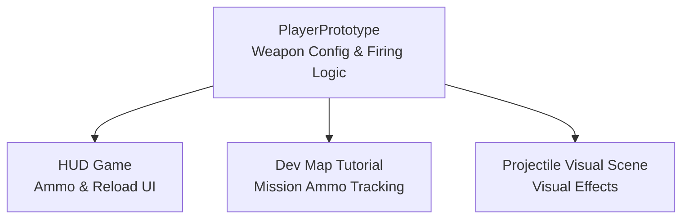
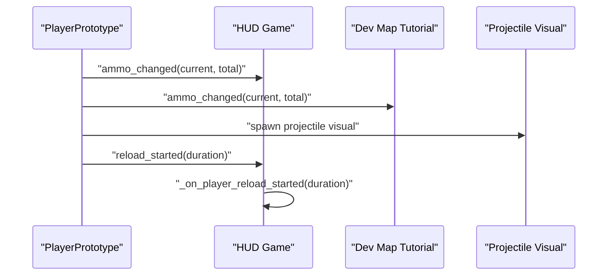
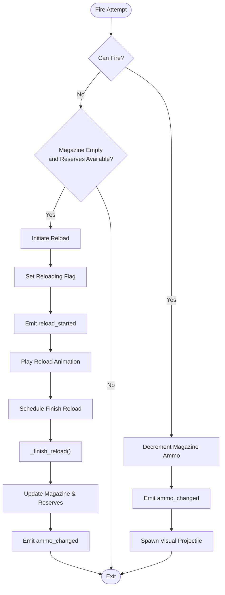
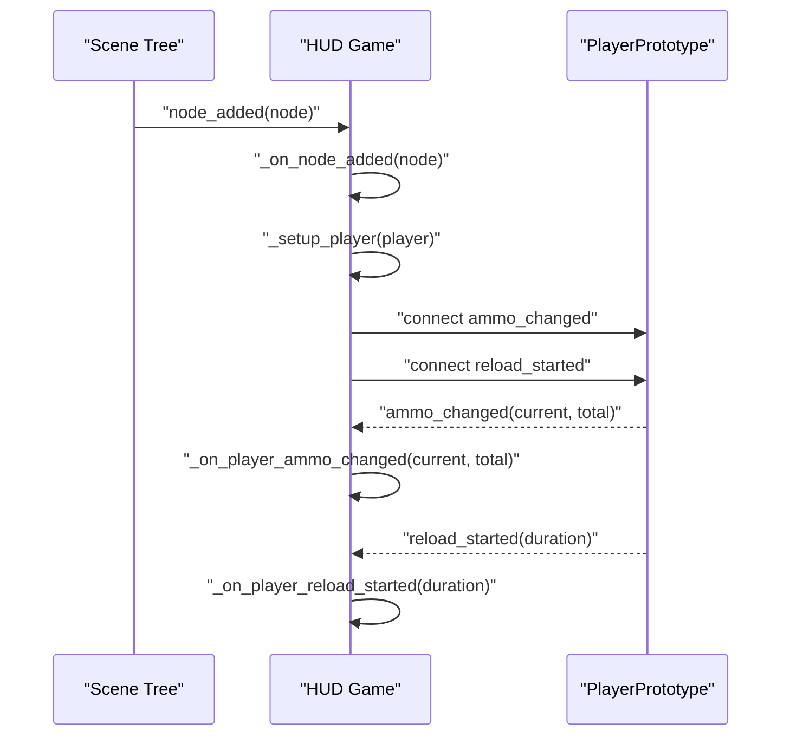
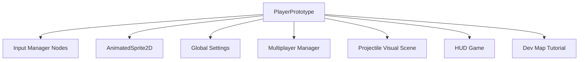

# Weapon System

<cite>
**Referenced Files in This Document**
- [player_prototype.gd](file://Scripts/player_prototype.gd)
- [hud_game.gd](file://Menu/HUD/hud_game.gd)
- [dev_map_tutorial.gd](file://Scripts/dev_map_tutorial.gd)
- [projectile_visual.tscn](file://Scenes/projectile_visual.tscn)
- [projectile_visual.gd](file://Scripts/projectile_visual.gd)
</cite>

## Table of Contents
1. [Introduction](#introduction)
2. [Project Structure](#project-structure)
3. [Core Components](#core-components)
4. [Architecture Overview](#architecture-overview)
5. [Detailed Component Analysis](#detailed-component-analysis)
6. [Dependency Analysis](#dependency-analysis)
7. [Performance Considerations](#performance-considerations)
8. [Troubleshooting Guide](#troubleshooting-guide)
9. [Conclusion](#conclusion)

## Introduction
This document provides comprehensive API documentation for the weapon system, focusing on ammunition management, weapon types, and reload mechanics. It covers weapon configuration parameters, ammo tracking (current and total rounds), capacity management, and reload duration settings. It also documents weapon switching functionality, touch auto-fire range configuration, and integration with weapon animations. Examples of weapon initialization, ammo consumption, and reload state management with proper signal emissions are included.

## Project Structure
The weapon system spans several core files:
- Player prototype script defines weapon configuration, firing logic, ammo consumption, and reload mechanics.
- HUD script subscribes to player signals to reflect real-time ammo and reload status.
- Tutorial mission script listens to ammo changes for mission completion triggers.
- Projectile visual scene and script support bullet trajectory rendering and hit effects.

**Diagram sources**
- [player_prototype.gd](file://Scripts/player_prototype.gd)
- [hud_game.gd](file://Menu/HUD/hud_game.gd)
- [dev_map_tutorial.gd](file://Scripts/dev_map_tutorial.gd)
- [projectile_visual.tscn](file://Scenes/projectile_visual.tscn)

**Section sources**
- [player_prototype.gd](file://Scripts/player_prototype.gd)
- [hud_game.gd](file://Menu/HUD/hud_game.gd)
- [dev_map_tutorial.gd](file://Scripts/dev_map_tutorial.gd)
- [projectile_visual.tscn](file://Scenes/projectile_visual.tscn)

## Core Components
- PlayerPrototype: Central weapon controller exposing configuration parameters, firing logic, ammo tracking, and reload mechanics.
- HUD Game: Subscribes to player signals to update UI elements for weapon name, current ammo, total ammo, and reload warnings.
- Dev Map Tutorial: Listens to ammo changes to drive tutorial missions.
- Projectile Visual: Renders visual bullets and impact effects.

Key weapon configuration parameters exposed via exported variables:
- Current ammo: colpi_correnti
- Total reserve ammo: colpi_totali
- Magazine capacity: capacita_caricatore
- Weapon name: nome_arma
- Fire cooldown: fire_cooldown
- Shot range: shot_range
- Touch auto-fire range: touch_auto_fire_range
- Reload duration: reload_duration
- Projectile visual speed: projectile_visual_speed

Signals emitted:
- ammo_changed(current: int, total: int)
- reload_started(duration: float)

**Section sources**
- [player_prototype.gd](file://Scripts/player_prototype.gd)
- [hud_game.gd](file://Menu/HUD/hud_game.gd)
- [dev_map_tutorial.gd](file://Scripts/dev_map_tutorial.gd)

## Architecture Overview
The weapon system follows a publish-subscribe pattern:
- Player emits signals for ammo updates and reload start.
- HUD subscribes to these signals to update UI visuals.
- Tutorial mission subscribes to ammo changes to track progress.
- Projectile visual scene instantiates and manages visual effects for fired shots.

**Diagram sources**
- [player_prototype.gd](file://Scripts/player_prototype.gd)
- [hud_game.gd](file://Menu/HUD/hud_game.gd)
- [dev_map_tutorial.gd](file://Scripts/dev_map_tutorial.gd)
- [projectile_visual.tscn](file://Scenes/projectile_visual.tscn)

## Detailed Component Analysis

### PlayerPrototype: Weapon Configuration and Mechanics
Responsibilities:
- Manage weapon configuration via exported variables.
- Handle firing logic, cooldown checks, and ammo consumption.
- Implement automatic reload when magazine is empty but reserves remain.
- Coordinate reload animation playback and duration.
- Emit signals for UI updates and external listeners.

Key exported configuration parameters:
- colpi_correnti: Current rounds in magazine.
- colpi_totali: Total reserve rounds.
- capacita_caricatore: Magazine capacity.
- nome_arma: Weapon identifier for animation selection.
- fire_cooldown: Minimum time between shots.
- shot_range: Maximum effective range.
- touch_auto_fire_range: Detection range for touch auto-fire.
- reload_duration: Duration of reload animation/state.
- projectile_visual_speed: Speed for visual projectile rendering.

Signals:
- ammo_changed(current: int, total: int): Emitted after firing or finishing reload.
- reload_started(duration: float): Emitted when reload begins.

Firing flow:
- Check authority and reloading state.
- Verify magazine has rounds and cooldown elapsed.
- Consume one round, emit ammo_changed.
- Spawn visual projectile and apply local feedback if applicable.

Reload flow:
- If not already reloading and conditions met, set reloading flag, emit reload_started, play animation.
- Schedule reload completion via tween with reload_duration.
- On completion, calculate remaining rounds to fill magazine, update ammo, emit ammo_changed.

Touch auto-fire:
- When using touch controls and aiming, scan for enemies within touch_auto_fire_range.
- If enemy detected, automatically fire in the current direction.

Animation integration:
- Select animation by weapon name; fallback to default if missing.
- Trigger reload animation during reload state.

**Diagram sources**
- [player_prototype.gd](file://Scripts/player_prototype.gd)

**Section sources**
- [player_prototype.gd](file://Scripts/player_prototype.gd)

### HUD Game: Real-Time UI Updates
Responsibilities:
- Subscribe to player signals for health, ammo, and reload events.
- Update weapon name label and ammo counters.
- Flash ammo label during reload based on duration.

Signal subscriptions:
- ammo_changed(current: int, total: int): Update current and total labels.
- reload_started(duration: float): Trigger reload flash animation.

Initialization:
- Connect to signals when a player node is added to the tree.
- Immediately sync initial state if player exposes relevant properties.

**Diagram sources**
- [hud_game.gd](file://Menu/HUD/hud_game.gd)
- [player_prototype.gd](file://Scripts/player_prototype.gd)

**Section sources**
- [hud_game.gd](file://Menu/HUD/hud_game.gd)

### Dev Map Tutorial: Mission-Based Ammo Tracking
Responsibilities:
- Track initial ammo and detect when ammo decreases to mark tutorial missions complete.
- Connect to player ammo_changed signal upon finding a valid player instance.

Connection strategy:
- Ensure connection only once and avoid stale references.
- Capture initial ammo value to compare subsequent updates.

Completion logic:
- If initial ammo is known and current drops below threshold, complete mission.
- If initial ammo was unknown, complete upon first ammo change.

**Section sources**
- [dev_map_tutorial.gd](file://Scripts/dev_map_tutorial.gd)

### Projectile Visual: Bullet Trajectory Rendering
Responsibilities:
- Instantiate visual projectiles for fired shots.
- Apply movement and collision logic for hit effects.

Integration:
- Player uses a preloaded scene reference to instantiate visuals.
- Visual scene/script coordinates with player for origin, direction, and speed.

**Section sources**
- [projectile_visual.tscn](file://Scenes/projectile_visual.tscn)
- [projectile_visual.gd](file://Scripts/projectile_visual.gd)
- [player_prototype.gd](file://Scripts/player_prototype.gd)

## Dependency Analysis
- PlayerPrototype depends on:
  - Input manager nodes for touch/mouse aim.
  - AnimatedSprite2D node for weapon animations.
  - Global settings for subtitle feedback.
  - Multiplayer manager for replication and authority checks.
  - Projectile visual scene for visual effects.
- HUD subscribes to PlayerPrototype signals and updates UI.
- Tutorial mission subscribes to PlayerPrototype ammo changes.

**Diagram sources**
- [player_prototype.gd](file://Scripts/player_prototype.gd)
- [hud_game.gd](file://Menu/HUD/hud_game.gd)
- [dev_map_tutorial.gd](file://Scripts/dev_map_tutorial.gd)

**Section sources**
- [player_prototype.gd](file://Scripts/player_prototype.gd)
- [hud_game.gd](file://Menu/HUD/hud_game.gd)
- [dev_map_tutorial.gd](file://Scripts/dev_map_tutorial.gd)

## Performance Considerations
- Cooldown enforcement prevents excessive firing and reduces unnecessary network traffic.
- Reload scheduling uses a single tween to minimize per-frame overhead.
- Signal-based UI updates ensure minimal coupling and efficient rendering.
- Projectile instantiation defers heavy work to visual scene/script.

## Troubleshooting Guide
Common issues and resolutions:
- HUD does not update ammo:
  - Ensure player node is added to the tree and signals are connected.
  - Verify labels exist and are properly referenced.
- Reload flash not triggered:
  - Confirm reload_started signal is emitted and connected in HUD.
  - Check that duration is passed correctly to the flash routine.
- Touch auto-fire not working:
  - Verify touch aim direction is being tracked and raycast detects targets within touch_auto_fire_range.
- Reload not completing:
  - Ensure reload_duration is set and tween completes callback executes.
  - Confirm magazine capacity and reserve calculations are correct.

**Section sources**
- [hud_game.gd](file://Menu/HUD/hud_game.gd)
- [player_prototype.gd](file://Scripts/player_prototype.gd)
- [dev_map_tutorial.gd](file://Scripts/dev_map_tutorial.gd)

## Conclusion
The weapon system provides a robust, extensible foundation for ammunition management, firing mechanics, and reload behavior. Its signal-driven architecture enables clean separation of concerns and seamless integration with UI and mission systems. By leveraging exported configuration parameters and standardized signals, developers can easily customize weapon behavior while maintaining consistent user feedback and reliable state transitions.