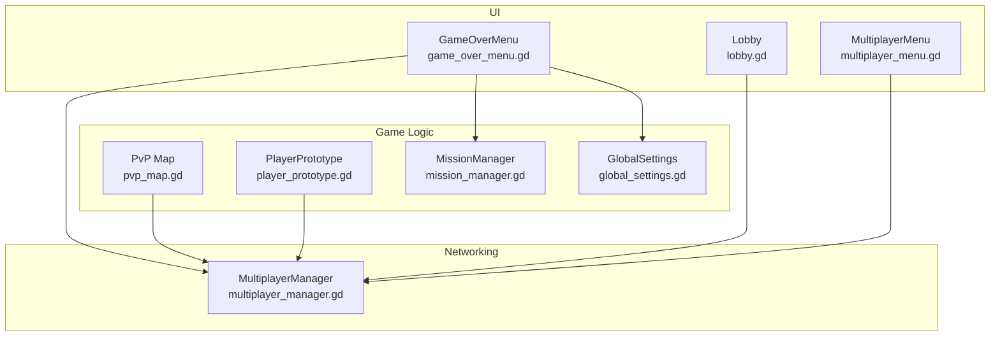
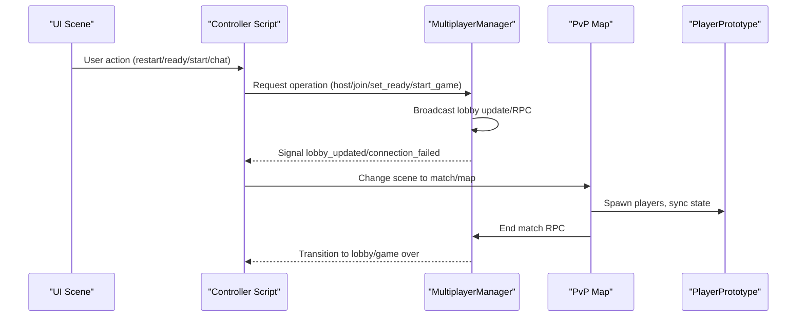
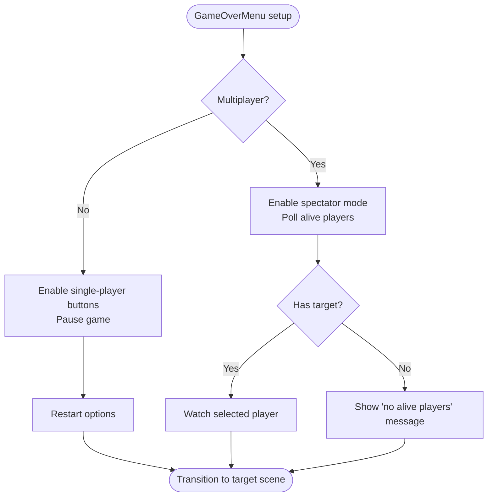
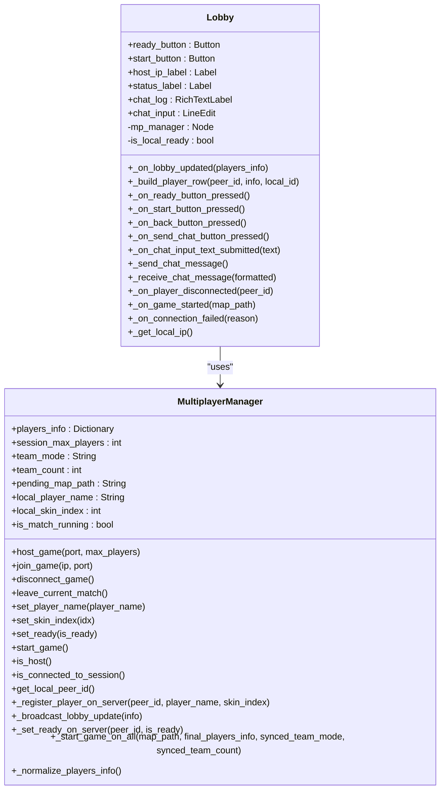
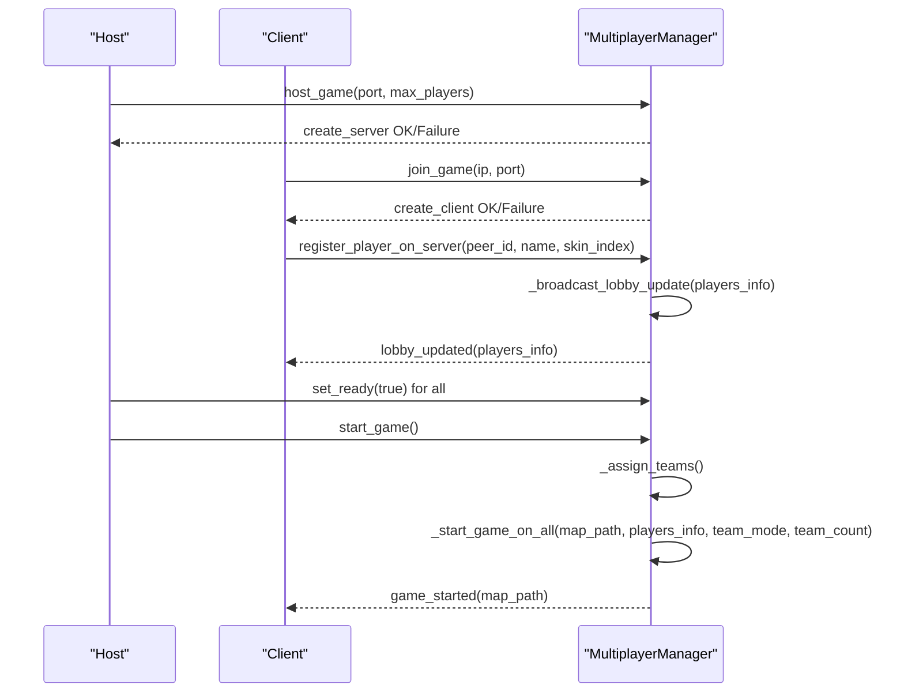
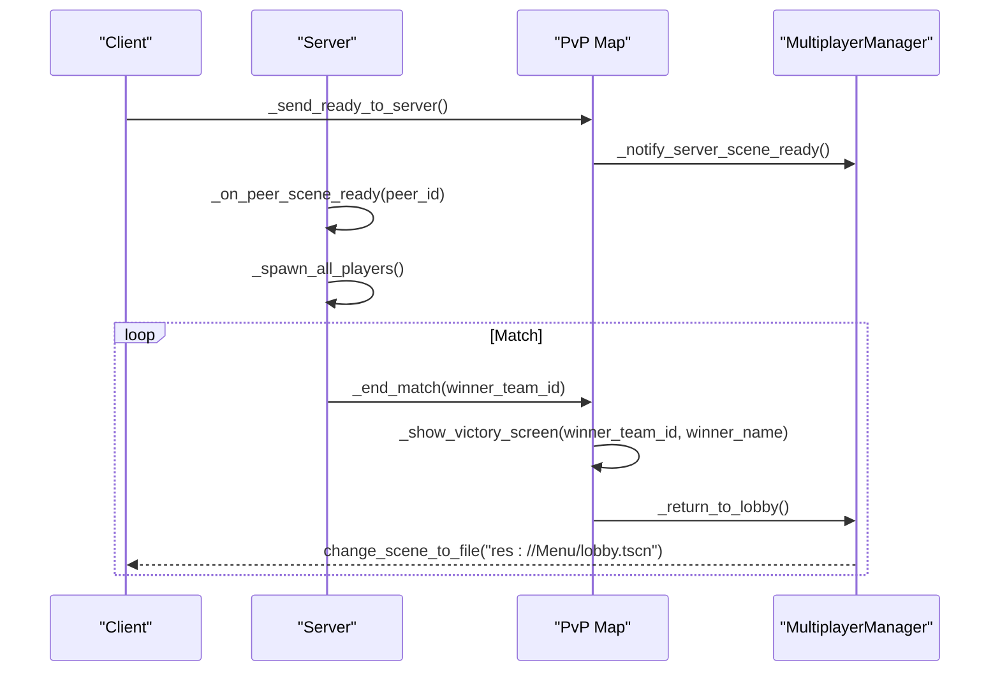
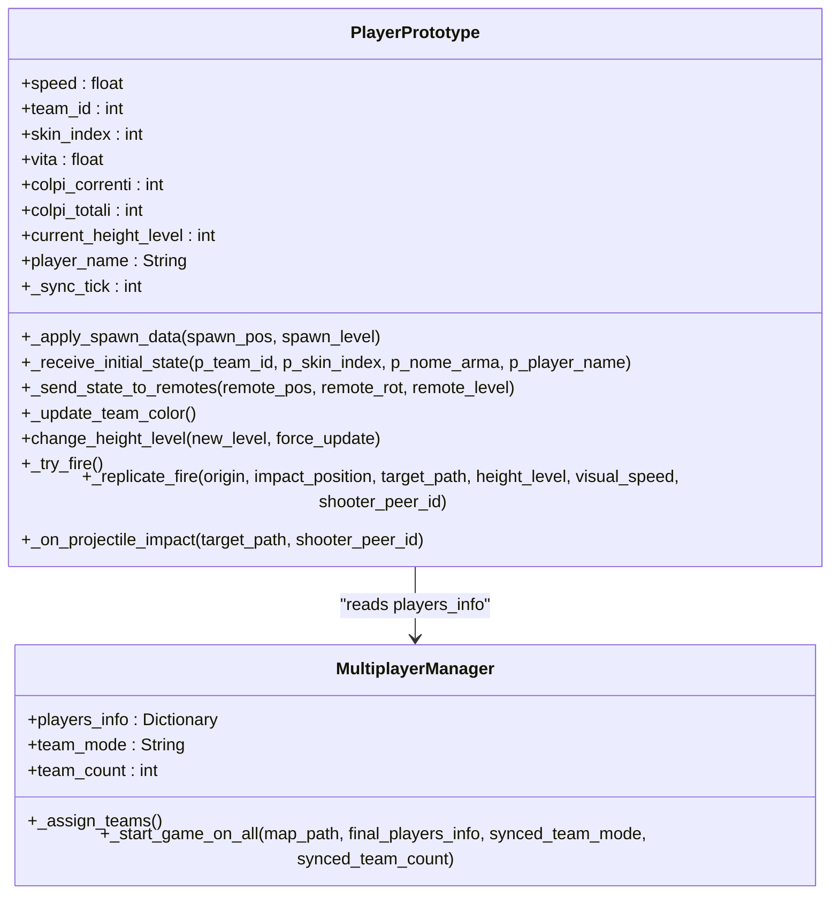
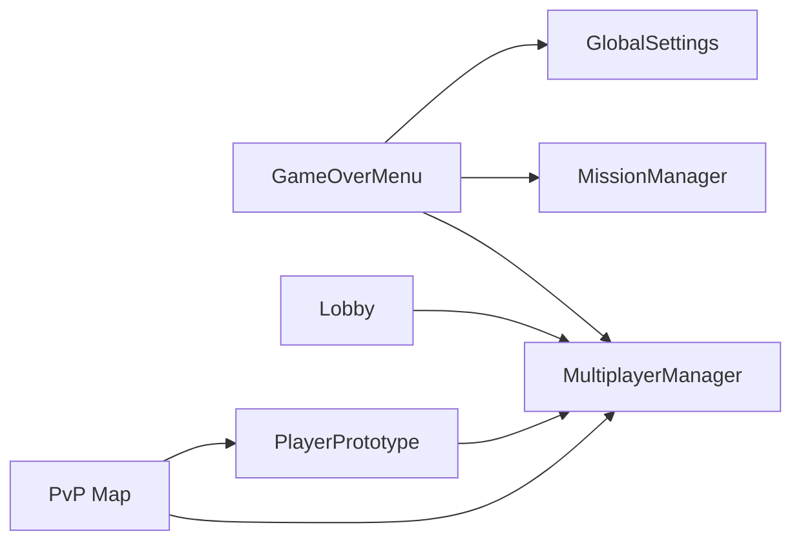

# Game Over and Lobby API

<cite>
**Referenced Files in This Document**
- [game_over_menu.gd](file://Menu/game_over_menu.gd)
- [game_over_menu.tscn](file://Menu/game_over_menu.tscn)
- [lobby.gd](file://Menu/lobby.gd)
- [lobby.tscn](file://Menu/lobby.tscn)
- [multiplayer_manager.gd](file://Scripts/multiplayer_manager.gd)
- [multiplayer_menu.gd](file://Menu/multiplayer_menu.gd)
- [pvp_map.gd](file://Scripts/pvp_map.gd)
- [player_prototype.gd](file://Scripts/player_prototype.gd)
- [mission_manager.gd](file://Scripts/mission_manager.gd)
- [global_settings.gd](file://Scripts/global_settings.gd)
</cite>

## Table of Contents
1. [Introduction](#introduction)
2. [Project Structure](#project-structure)
3. [Core Components](#core-components)
4. [Architecture Overview](#architecture-overview)
5. [Detailed Component Analysis](#detailed-component-analysis)
6. [Dependency Analysis](#dependency-analysis)
7. [Performance Considerations](#performance-considerations)
8. [Troubleshooting Guide](#troubleshooting-guide)
9. [Conclusion](#conclusion)

## Introduction
This document provides comprehensive API documentation for the game over screen and lobby systems, focusing on multiplayer room operations, score display, player statistics, and network synchronization during transitions and state preservation across scenes. It covers:
- Post-match analytics and ranking display
- Replay functionality (conceptual)
- Multiplayer room operations including lobby creation, player matching, and room management
- Examples of score calculation, ranking display, lobby creation, and player matching
- Network synchronization during transitions and state preservation across scenes

## Project Structure
The system spans several UI scenes and scripts:
- Game Over Screen: UI scene and controller script manage single-player restart options and multi-player spectator modes
- Lobby System: Hosted room management with player readiness, chat, and start conditions
- Multiplayer Manager: Centralized networking logic for hosting/joining sessions, team assignment, and broadcast updates
- PvP Map: Match lifecycle, scoring, and end-of-match transitions
- Player Prototype: Core multiplayer synchronization and state management
- Mission Manager: Single-player mission tracking (used for checkpoint handling in game over transitions)

**Diagram sources**
- [game_over_menu.gd:1-269](file://Menu/game_over_menu.gd#L1-L269)
- [lobby.gd:1-162](file://Menu/lobby.gd#L1-L162)
- [multiplayer_manager.gd:1-322](file://Scripts/multiplayer_manager.gd#L1-L322)
- [pvp_map.gd:1-436](file://Scripts/pvp_map.gd#L1-L436)
- [player_prototype.gd:1-1033](file://Scripts/player_prototype.gd#L1-L1033)
- [mission_manager.gd:1-169](file://Scripts/mission_manager.gd#L1-L169)
- [global_settings.gd:1-618](file://Scripts/global_settings.gd#L1-L618)

**Section sources**
- [game_over_menu.tscn:1-129](file://Menu/game_over_menu.tscn#L1-L129)
- [lobby.tscn:1-131](file://Menu/lobby.tscn#L1-L131)

## Core Components
- GameOverMenu: Controls single-player restart and multi-player spectator modes; manages transitions to main menu, lobby, and scene reloads
- Lobby: Hosted room UI and logic for player readiness, chat, and match start
- MultiplayerManager: Singleton managing ENet connections, lobby state, team assignment, and RPC broadcasts
- PvP Map: Match lifecycle, scoring, and end-of-match transitions
- PlayerPrototype: Multiplayer synchronization, authority, and state replication
- MissionManager: Single-player mission tracking (checkpoint handling in game over transitions)
- GlobalSettings: Settings persistence and runtime configuration

**Section sources**
- [game_over_menu.gd:1-269](file://Menu/game_over_menu.gd#L1-L269)
- [lobby.gd:1-162](file://Menu/lobby.gd#L1-L162)
- [multiplayer_manager.gd:1-322](file://Scripts/multiplayer_manager.gd#L1-L322)
- [pvp_map.gd:1-436](file://Scripts/pvp_map.gd#L1-L436)
- [player_prototype.gd:1-1033](file://Scripts/player_prototype.gd#L1-L1033)
- [mission_manager.gd:1-169](file://Scripts/mission_manager.gd#L1-L169)
- [global_settings.gd:1-618](file://Scripts/global_settings.gd#L1-L618)

## Architecture Overview
The system integrates UI scenes with centralized networking and game logic:
- UI scenes trigger actions (restart, ready, start, chat)
- MultiplayerManager handles connection, lobby updates, and RPC broadcasts
- PvP Map orchestrates match lifecycle and end-of-match transitions
- PlayerPrototype ensures authoritative state replication across peers
- GameOverMenu coordinates transitions and preserves state across scenes

**Diagram sources**
- [game_over_menu.gd:216-269](file://Menu/game_over_menu.gd#L216-L269)
- [lobby.gd:95-107](file://Menu/lobby.gd#L95-L107)
- [multiplayer_manager.gd:159-169](file://Scripts/multiplayer_manager.gd#L159-L169)
- [pvp_map.gd:322-356](file://Scripts/pvp_map.gd#L322-L356)
- [player_prototype.gd:94-144](file://Scripts/player_prototype.gd#L94-L144)

## Detailed Component Analysis

### Game Over Screen API
The GameOverMenu script controls the game over UI and transitions:
- Single-player mode: Provides restart from beginning, restart from checkpoint, and main menu options
- Multiplayer mode: Enables spectator mode with live switching between alive players
- Transitions: Cleans up mission data, clears checkpoints, and navigates to main menu or lobby

Key behaviors:
- Setup and UI configuration based on multiplayer mode
- Spectator polling and target selection logic
- Cleanup and scene transitions with checkpoint handling

**Diagram sources**
- [game_over_menu.gd:32-98](file://Menu/game_over_menu.gd#L32-L98)
- [game_over_menu.gd:104-192](file://Menu/game_over_menu.gd#L104-L192)

**Section sources**
- [game_over_menu.gd:1-269](file://Menu/game_over_menu.gd#L1-L269)
- [game_over_menu.tscn:1-129](file://Menu/game_over_menu.tscn#L1-L129)

### Lobby System API
The lobby provides hosted room management:
- Player list rendering with readiness and team badges
- Ready toggling and host-only start button
- Chat with BBCode-enabled rich text logging
- Connection status and failure handling
- IP display for sharing

**Diagram sources**
- [lobby.gd:1-162](file://Menu/lobby.gd#L1-L162)
- [multiplayer_manager.gd:1-322](file://Scripts/multiplayer_manager.gd#L1-L322)

**Section sources**
- [lobby.gd:1-162](file://Menu/lobby.gd#L1-L162)
- [lobby.tscn:1-131](file://Menu/lobby.tscn#L1-L131)

### Multiplayer Manager API
Centralized networking and lobby logic:
- Hosting/joining sessions with ENet
- Player registration and readiness tracking
- Team assignment (balanced teams or FFA)
- RPC broadcasts for lobby updates and match start
- Connection lifecycle and error handling

**Diagram sources**
- [multiplayer_manager.gd:74-169](file://Scripts/multiplayer_manager.gd#L74-L169)
- [multiplayer_manager.gd:225-274](file://Scripts/multiplayer_manager.gd#L225-L274)

**Section sources**
- [multiplayer_manager.gd:1-322](file://Scripts/multiplayer_manager.gd#L1-L322)

### PvP Map API
Match lifecycle and scoring:
- Scene readiness handshake for synchronized spawn
- Player spawning with authority and team assignment
- Kill tracking and scoreboard updates
- End-of-match RPC to show victory screen and return to lobby

**Diagram sources**
- [pvp_map.gd:77-109](file://Scripts/pvp_map.gd#L77-L109)
- [pvp_map.gd:123-200](file://Scripts/pvp_map.gd#L123-L200)
- [pvp_map.gd:322-356](file://Scripts/pvp_map.gd#L322-L356)

**Section sources**
- [pvp_map.gd:1-436](file://Scripts/pvp_map.gd#L1-L436)

### Player Prototype API
Multiplayer synchronization and authority:
- Authority assignment and remote input suppression
- Initial state sync with team, skin, weapon, and name
- Position/rotation/state replication to peers
- Level-based visibility and effects

**Diagram sources**
- [player_prototype.gd:94-144](file://Scripts/player_prototype.gd#L94-L144)
- [player_prototype.gd:309-318](file://Scripts/player_prototype.gd#L309-L318)
- [multiplayer_manager.gd:200-210](file://Scripts/multiplayer_manager.gd#L200-L210)

**Section sources**
- [player_prototype.gd:1-1033](file://Scripts/player_prototype.gd#L1-L1033)

### Mission Manager API (Single-Player)
Used for checkpoint handling in game over transitions:
- Start missions, update progress, complete/fail/clear
- Emit signals for HUD consumption

**Section sources**
- [mission_manager.gd:1-169](file://Scripts/mission_manager.gd#L1-L169)

### Global Settings API
Runtime configuration and persistence:
- Settings loading/saving, defaults, sanitization
- Graphics presets, UI scaling, subtitles, FPS cap
- Release checks and language support

**Section sources**
- [global_settings.gd:1-618](file://Scripts/global_settings.gd#L1-L618)

## Dependency Analysis
- GameOverMenu depends on MultiplayerManager for multiplayer mode detection and on MissionManager for checkpoint cleanup
- Lobby depends on MultiplayerManager for lobby updates, readiness, and start conditions
- PvP Map depends on MultiplayerManager for player info and team mode, and on PlayerPrototype for spawning and authority
- PlayerPrototype depends on MultiplayerManager for initial state and team assignment
- GlobalSettings influences camera shake and HUD feedback

**Diagram sources**
- [game_over_menu.gd:37-45](file://Menu/game_over_menu.gd#L37-L45)
- [lobby.gd:18-34](file://Menu/lobby.gd#L18-L34)
- [pvp_map.gd:5-65](file://Scripts/pvp_map.gd#L5-L65)
- [player_prototype.gd:57-88](file://Scripts/player_prototype.gd#L57-L88)
- [global_settings.gd:81-87](file://Scripts/global_settings.gd#L81-L87)

**Section sources**
- [game_over_menu.gd:1-269](file://Menu/game_over_menu.gd#L1-L269)
- [lobby.gd:1-162](file://Menu/lobby.gd#L1-L162)
- [multiplayer_manager.gd:1-322](file://Scripts/multiplayer_manager.gd#L1-L322)
- [pvp_map.gd:1-436](file://Scripts/pvp_map.gd#L1-L436)
- [player_prototype.gd:1-1033](file://Scripts/player_prototype.gd#L1-L1033)
- [mission_manager.gd:1-169](file://Scripts/mission_manager.gd#L1-L169)
- [global_settings.gd:1-618](file://Scripts/global_settings.gd#L1-L618)

## Performance Considerations
- Spectator polling interval: The GameOverMenu polls alive players at a fixed interval to keep the target list updated; adjust the polling timer to balance responsiveness and CPU usage
- Multiplayer sync tick: PlayerPrototype sends state updates every N physics frames; tune the sync tick to balance bandwidth and smoothness
- Scene transitions: Use preloading strategies to minimize scene change delays; the ResourcePreloader pattern can help reduce loading stalls
- HUD updates: Batch scoreboard updates and limit frequent UI refreshes during matches

[No sources needed since this section provides general guidance]

## Troubleshooting Guide
Common issues and resolutions:
- Connection failures: MultiplayerManager emits connection_failed; handle UI updates and reset lobby state
- Lobby full: Registration rejects peers exceeding session_max_players; inform clients and prevent joining
- Readiness mismatch: Start button disabled until all players are ready; ensure lobby updates propagate reliably
- Spectator target invalid: When watched player dies, the system automatically switches to next valid target; verify group/team membership logic
- Scene readiness handshake: If not all peers confirm readiness, spawning is delayed; ensure reliable RPC delivery

**Section sources**
- [multiplayer_manager.gd:299-309](file://Scripts/multiplayer_manager.gd#L299-L309)
- [multiplayer_manager.gd:230-242](file://Scripts/multiplayer_manager.gd#L230-L242)
- [lobby.gd:147-151](file://Menu/lobby.gd#L147-L151)
- [game_over_menu.gd:151-166](file://Menu/game_over_menu.gd#L151-L166)
- [pvp_map.gd:84-109](file://Scripts/pvp_map.gd#L84-L109)

## Conclusion
The game over and lobby systems provide a robust foundation for multiplayer room operations, score display, and match transitions. The MultiplayerManager centralizes networking logic, while the GameOverMenu and Lobby scenes offer intuitive UI controls. The PvP Map and PlayerPrototype ensure synchronized gameplay and authoritative state replication. Together, these components enable seamless transitions, reliable spectator modes, and scalable room management.