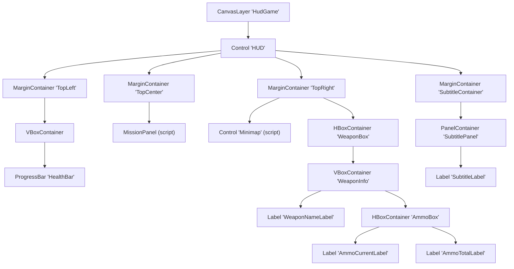
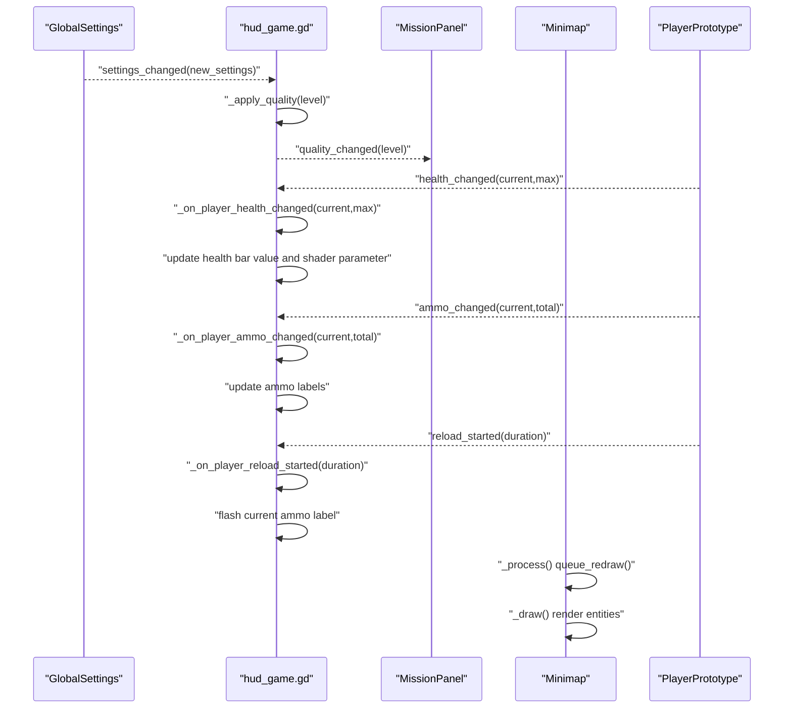
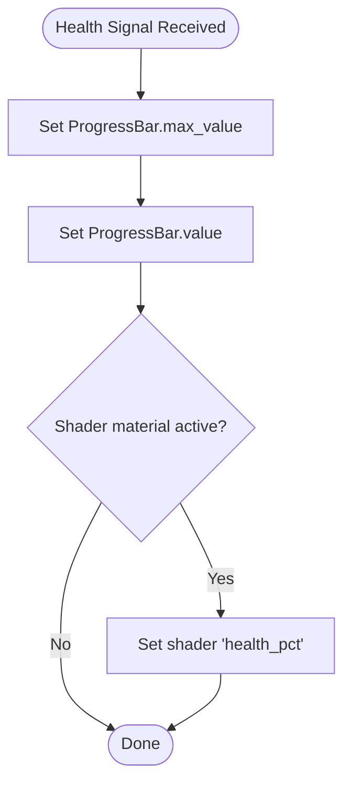
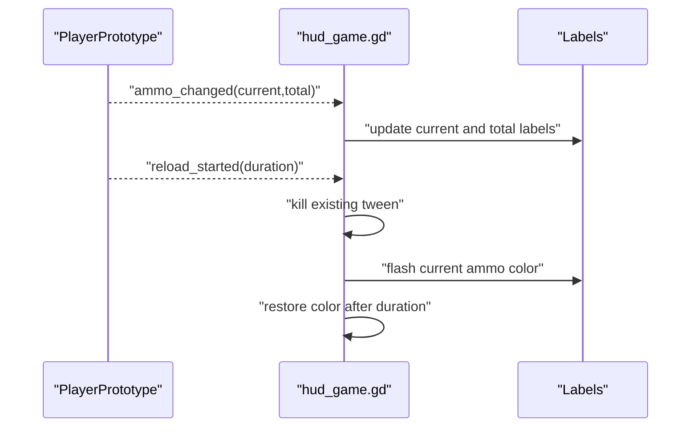
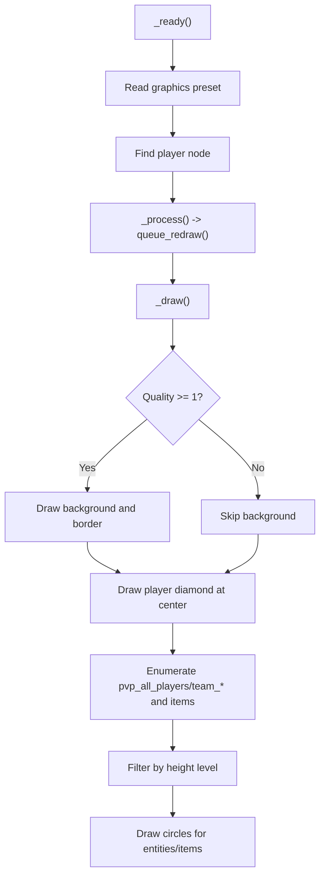
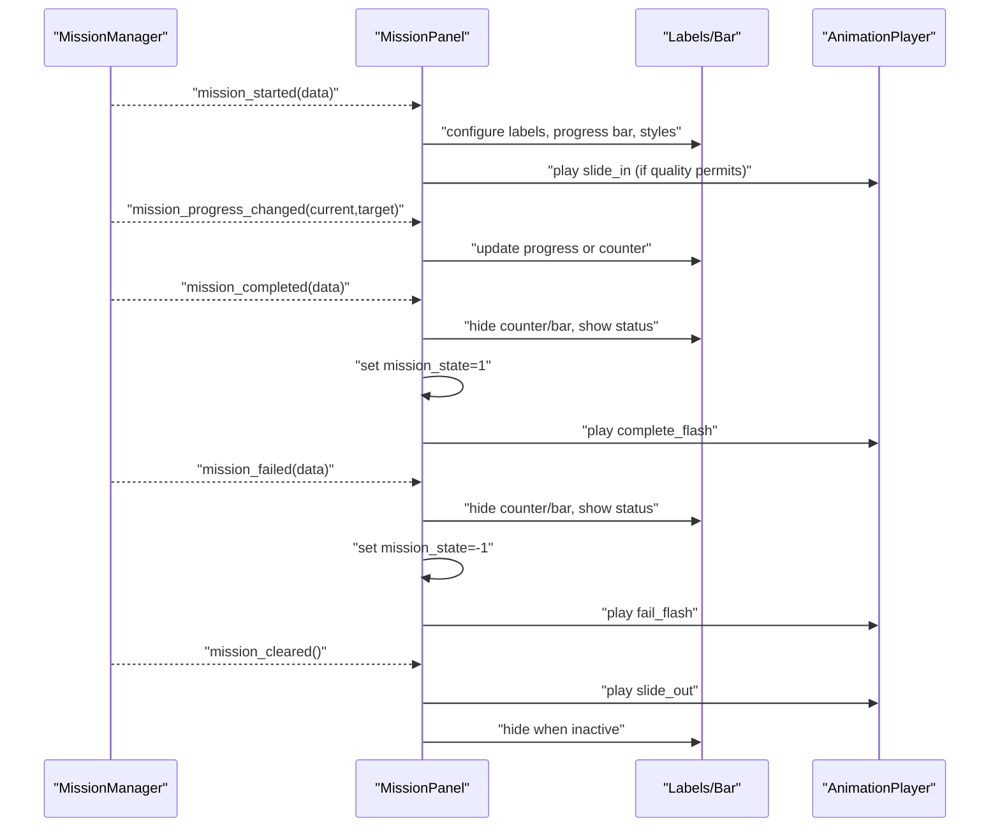
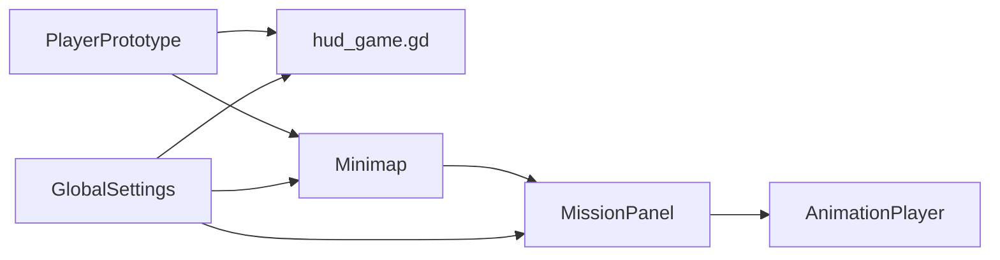

# In-Game HUD API

<cite>
**Referenced Files in This Document**
- [HUD_Game.tscn](file://Menu/HUD/HUD_Game.tscn)
- [hud_game.gd](file://Menu/HUD/hud_game.gd)
- [minimap.gd](file://Menu/HUD/minimap.gd)
- [mission_panel.gd](file://Scripts/mission_panel.gd)
- [health_bar.gdshader](file://Shaders/HUD/health_bar.gdshader)
- [minimap_overlay.gdshader](file://Shaders/HUD/minimap_overlay.gdshader)
- [global_settings.gd](file://Scripts/global_settings.gd)
- [player_prototype.gd](file://Scripts/player_prototype.gd)
- [multiplayer_manager.gd](file://Scripts/multiplayer_manager.gd)
</cite>

## Table of Contents
1. [Introduction](#introduction)
2. [Project Structure](#project-structure)
3. [Core Components](#core-components)
4. [Architecture Overview](#architecture-overview)
5. [Detailed Component Analysis](#detailed-component-analysis)
6. [Dependency Analysis](#dependency-analysis)
7. [Performance Considerations](#performance-considerations)
8. [Troubleshooting Guide](#troubleshooting-guide)
9. [Conclusion](#conclusion)

## Introduction
This document describes the in-game Heads-Up Display (HUD) system, covering health bars, ammo counters, minimap, and objective indicators. It explains HUD element positioning, data binding via signals, real-time updates, responsive layout adaptation, and cross-platform UI scaling. It also provides practical examples for updating health status, weapon state changes, minimap rendering, and objective tracking.

## Project Structure
The HUD is composed of:
- A scene hierarchy that defines UI regions and controls
- A controller script that binds UI elements to game state
- A minimap renderer that draws nearby entities and items
- A mission panel that tracks and visually presents active objectives
- Shader materials that enhance visuals for health and minimap overlays
- Global settings that drive quality presets and UI scaling

**Diagram sources**
- [HUD_Game.tscn](file://Menu/HUD/HUD_Game.tscn)

**Section sources**
- [HUD_Game.tscn](file://Menu/HUD/HUD_Game.tscn)

## Core Components
- Health Bar: Progress bar styled with a shader for dynamic color and glow based on current health percentage.
- Ammo Counters: Two labels displaying current clip and total reserve, with a warning flash during reload.
- Minimap: A custom renderer drawing teammates/enemies/items around the player with height-aware filtering.
- Objective Panel: A mission tracker that displays remaining targets, progress bars, and completion/failure feedback with animated transitions.
- Subtitles: A centered overlay panel that shows localized messages for a configured duration.
- Quality and Scaling: Graphics preset affects shader usage and animation complexity; UI scale adjusts theme font sizes and constants.

**Section sources**
- [hud_game.gd](file://Menu/HUD/hud_game.gd)
- [minimap.gd](file://Menu/HUD/minimap.gd)
- [mission_panel.gd](file://Scripts/mission_panel.gd)
- [health_bar.gdshader](file://Shaders/HUD/health_bar.gdshader)
- [minimap_overlay.gdshader](file://Shaders/HUD/minimap_overlay.gdshader)
- [global_settings.gd](file://Scripts/global_settings.gd)

## Architecture Overview
The HUD controller subscribes to the local player’s signals and updates UI elements accordingly. Global settings propagate graphics preset changes to child components. The minimap queries the scene tree for entities and renders them relative to the player’s position and height level. The mission panel listens to mission events and drives animations and shader states.

**Diagram sources**
- [hud_game.gd](file://Menu/HUD/hud_game.gd)
- [mission_panel.gd](file://Scripts/mission_panel.gd)
- [minimap.gd](file://Menu/HUD/minimap.gd)
- [player_prototype.gd](file://Scripts/player_prototype.gd)
- [global_settings.gd](file://Scripts/global_settings.gd)

## Detailed Component Analysis

### Health Bar
- Positioning: Located in the top-left region, anchored to the HUD container with margins and fixed size.
- Data Binding: The HUD controller connects to the player’s health signal and updates the progress bar’s value and max. It also sets a shader parameter for health percentage to enable dynamic color and glow.
- Real-time Updates: The shader reads the health percentage and computes a gradient from low to high, with a subtle pulse and edge glow.
- Responsive Layout: When the FPS overlay is visible, the top-left container offsets are adjusted to avoid overlap.

**Diagram sources**
- [hud_game.gd](file://Menu/HUD/hud_game.gd)
- [health_bar.gdshader](file://Shaders/HUD/health_bar.gdshader)

**Section sources**
- [HUD_Game.tscn](file://Menu/HUD/HUD_Game.tscn)
- [hud_game.gd](file://Menu/HUD/hud_game.gd)
- [health_bar.gdshader](file://Shaders/HUD/health_bar.gdshader)

### Ammo Counters
- Positioning: Right-aligned in the top-right region, inside a weapon info box with a name label and two ammo labels.
- Data Binding: The HUD controller updates the current and total ammo labels when the player emits the ammo signal.
- Real-time Updates: During reload, the current ammo label flashes between default and warning colors using a tween loop, then restores color after the reload duration.
- Touch Controls: Additional touch actions simulate shooting and reloading on demand.

**Diagram sources**
- [hud_game.gd](file://Menu/HUD/hud_game.gd)
- [player_prototype.gd](file://Scripts/player_prototype.gd)

**Section sources**
- [HUD_Game.tscn](file://Menu/HUD/HUD_Game.tscn)
- [hud_game.gd](file://Menu/HUD/hud_game.gd)

### Minimap
- Rendering: Draws a dark bordered rectangle with a diamond marker for the player at the center. Renders nearby entities and items filtered by height level and visibility thresholds.
- Colors and Scale: Exposed parameters define colors for borders, backgrounds, player, friends, enemies, and items. Scale factor controls distance-to-pixel conversion.
- Quality Levels: At higher presets, the minimap background and border are drawn; at lower presets, only points are shown.
- Multiplayer Awareness: Determines friend/enemy status using team membership and team mode.

**Diagram sources**
- [minimap.gd](file://Menu/HUD/minimap.gd)

**Section sources**
- [HUD_Game.tscn](file://Menu/HUD/HUD_Game.tscn)
- [minimap.gd](file://Menu/HUD/minimap.gd)

### Objective Panel (Mission Tracker)
- Positioning: Centered at the top, embedded in a margin container with a stylable panel.
- Data Binding: Listens to mission lifecycle signals and updates labels, progress bar, and status text.
- Visual States: Uses shader parameters to reflect normal, completed, and failed states. Applies style overrides and plays animations depending on quality preset.
- Animations: Creates animations at runtime (slide-in/out, completion flash, failure flash) based on quality level and panel size.

**Diagram sources**
- [mission_panel.gd](file://Scripts/mission_panel.gd)

**Section sources**
- [HUD_Game.tscn](file://Menu/HUD/HUD_Game.tscn)
- [mission_panel.gd](file://Scripts/mission_panel.gd)

### Subtitles Overlay
- Positioning: Centered at the bottom, embedded in a margin container with a dark panel.
- Behavior: Receives subtitle requests from global settings, shows the message for the specified duration, and auto-hides when time expires.

**Section sources**
- [HUD_Game.tscn](file://Menu/HUD/HUD_Game.tscn)
- [hud_game.gd](file://Menu/HUD/hud_game.gd)
- [global_settings.gd](file://Scripts/global_settings.gd)

### Cross-Platform UI Scaling and Quality Presets
- UI Scale: Global settings adjust the theme’s base scale and recalculate font sizes and constants for all themed controls.
- Quality Preset: Global settings apply graphics configurations to nodes and propagate a quality change signal to HUD components. The HUD controller forwards the level to child scripts to enable/disable advanced effects and animations.

**Section sources**
- [global_settings.gd](file://Scripts/global_settings.gd)
- [hud_game.gd](file://Menu/HUD/hud_game.gd)
- [mission_panel.gd](file://Scripts/mission_panel.gd)
- [minimap.gd](file://Menu/HUD/minimap.gd)

## Dependency Analysis
- HUD controller depends on:
  - PlayerPrototype signals for health, ammo, and reload events
  - GlobalSettings for subtitles and quality changes
  - MissionManager for mission lifecycle updates
- Minimap depends on:
  - Scene graph for entities and items
  - GlobalSettings for quality preset
  - MultiplayerManager for team awareness
- MissionPanel depends on:
  - MissionManager signals
  - GlobalSettings for quality preset
  - AnimationPlayer for visual feedback

**Diagram sources**
- [hud_game.gd](file://Menu/HUD/hud_game.gd)
- [mission_panel.gd](file://Scripts/mission_panel.gd)
- [minimap.gd](file://Menu/HUD/minimap.gd)
- [global_settings.gd](file://Scripts/global_settings.gd)
- [player_prototype.gd](file://Scripts/player_prototype.gd)
- [multiplayer_manager.gd](file://Scripts/multiplayer_manager.gd)

**Section sources**
- [hud_game.gd](file://Menu/HUD/hud_game.gd)
- [mission_panel.gd](file://Scripts/mission_panel.gd)
- [minimap.gd](file://Menu/HUD/minimap.gd)
- [global_settings.gd](file://Scripts/global_settings.gd)
- [player_prototype.gd](file://Scripts/player_prototype.gd)
- [multiplayer_manager.gd](file://Scripts/multiplayer_manager.gd)

## Performance Considerations
- Minimap rendering:
  - Use quality presets to reduce draw calls and visual complexity on lower-end devices.
  - Filter entities by height level to avoid off-screen or irrelevant rendering.
- Health bar shader:
  - Keep shader parameter updates minimal; the HUD controller already batches updates per frame.
- Mission panel animations:
  - Disable animations at low quality to reduce CPU/GPU overhead.
- UI scaling:
  - Adjust UI scale to balance readability and rendering cost; larger scales increase font and control sizes.

[No sources needed since this section provides general guidance]

## Troubleshooting Guide
- Health bar not updating:
  - Verify the HUD controller is connected to the player’s health signal and that the ProgressBar exists.
  - Confirm the shader parameter is being set when the material is active.
- Ammo labels not changing:
  - Ensure the player emits the ammo signal and the HUD controller updates the labels.
  - Check for overlapping tweens during reload that might interfere with color restoration.
- Minimap not rendering entities:
  - Confirm the player node is found and that entities are in the expected groups.
  - Verify height filtering matches the player’s current height level.
- Mission panel not animating:
  - Check the quality preset and whether the panel size is initialized before building animations.
  - Ensure the AnimationPlayer exists and the library is properly populated.
- Subtitles not appearing:
  - Confirm GlobalSettings subtitles are enabled and the subtitle_requested signal is emitted with a non-empty message and positive duration.

**Section sources**
- [hud_game.gd](file://Menu/HUD/hud_game.gd)
- [minimap.gd](file://Menu/HUD/minimap.gd)
- [mission_panel.gd](file://Scripts/mission_panel.gd)
- [global_settings.gd](file://Scripts/global_settings.gd)

## Conclusion
The HUD system integrates cleanly with the game’s state via signals and GlobalSettings, providing robust, scalable visuals across platforms. Health bars, ammo counters, minimap, and mission panels are data-driven, responsive, and adaptable to varying hardware capabilities through quality presets and UI scaling.