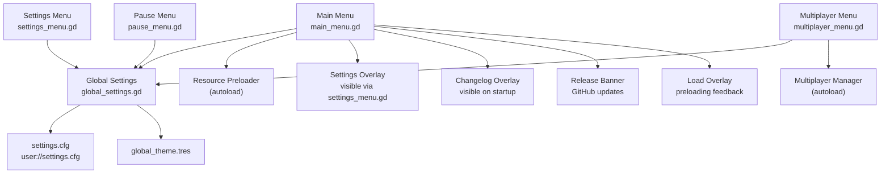
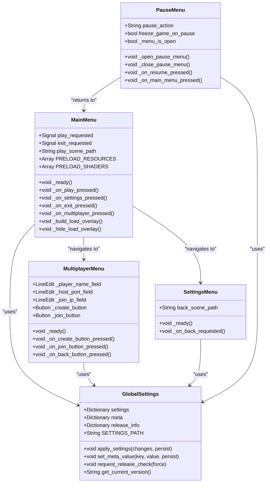
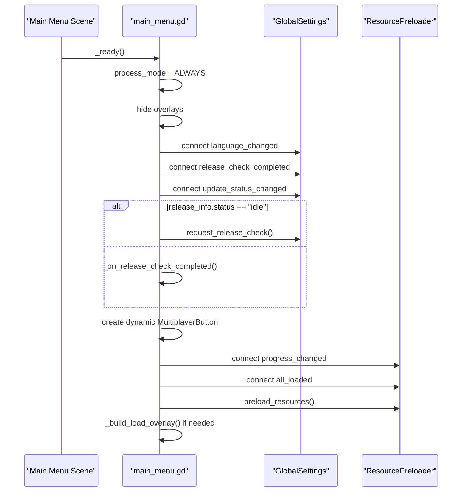
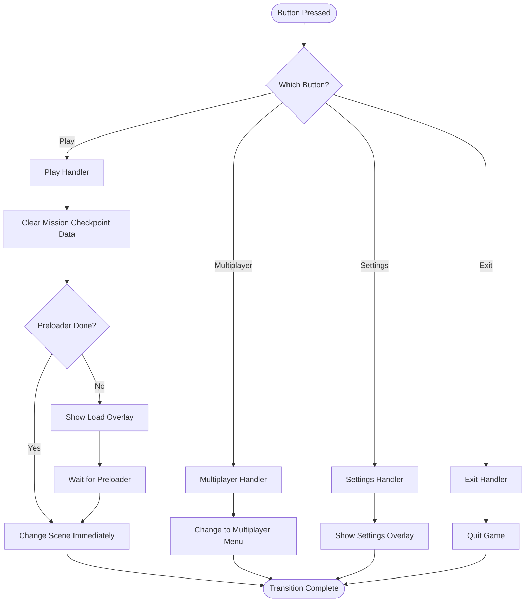
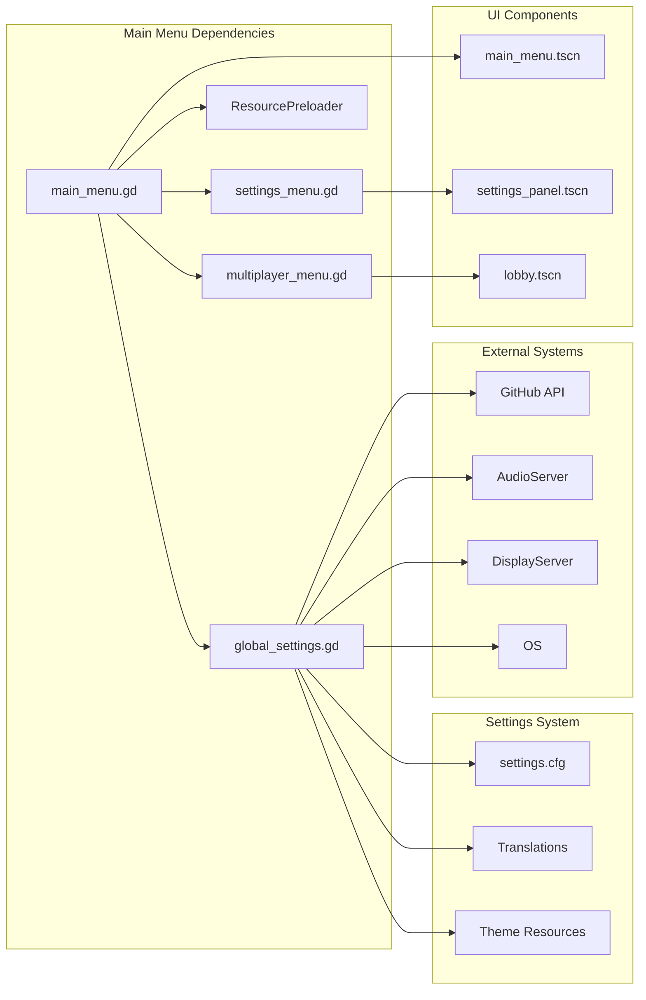

# Main Menu API

<cite>
**Referenced Files in This Document**
- [main_menu.gd](file://Menu/main_menu.gd)
- [main_menu.tscn](file://Menu/main_menu.tscn)
- [multiplayer_menu.gd](file://Menu/multiplayer_menu.gd)
- [settings_menu.gd](file://Menu/settings_menu.gd)
- [pause_menu.gd](file://Menu/pause_menu.gd)
- [global_settings.gd](file://Scripts/global_settings.gd)
</cite>

## Table of Contents
1. [Introduction](#introduction)
2. [Project Structure](#project-structure)
3. [Core Components](#core-components)
4. [Architecture Overview](#architecture-overview)
5. [Detailed Component Analysis](#detailed-component-analysis)
6. [Dependency Analysis](#dependency-analysis)
7. [Performance Considerations](#performance-considerations)
8. [Troubleshooting Guide](#troubleshooting-guide)
9. [Conclusion](#conclusion)

## Introduction
This document provides comprehensive API documentation for the main menu system, covering navigation, button events, scene transitions, initialization, user interaction handlers, state management, persistence, user preferences integration, and accessibility features. The main menu serves as the primary entry point for launching single-player gameplay, accessing settings, and navigating to multiplayer functionality.

## Project Structure
The main menu system consists of the following key components:
- Main Menu Script: Handles initialization, button events, scene transitions, and integration with global settings and resource preloading.
- Main Menu Scene: Defines the UI layout and nodes used by the main menu script.
- Multiplayer Menu: Provides host/join functionality and integrates with the multiplayer manager.
- Settings Menu: Manages settings panel navigation and back transitions.
- Pause Menu: Controls pause functionality and integrates with the main menu.
- Global Settings: Centralized settings management with persistence, language support, and release update checks.

**Diagram sources**
- [main_menu.gd:1-416](file://Menu/main_menu.gd#L1-L416)
- [multiplayer_menu.gd:1-121](file://Menu/multiplayer_menu.gd#L1-L121)
- [settings_menu.gd:1-20](file://Menu/settings_menu.gd#L1-L20)
- [pause_menu.gd:1-143](file://Menu/pause_menu.gd#L1-L143)
- [global_settings.gd:1-618](file://Scripts/global_settings.gd#L1-L618)

**Section sources**
- [main_menu.gd:1-416](file://Menu/main_menu.gd#L1-L416)
- [main_menu.tscn:1-324](file://Menu/main_menu.tscn#L1-L324)

## Core Components
The main menu system comprises several interconnected components that handle different aspects of menu functionality:

### Main Menu Controller
The main menu script extends Control and manages:
- Initialization and UI setup
- Button event handling
- Scene transitions
- Resource preloading integration
- Release update notifications
- Language and accessibility support

### Multiplayer Menu
Handles network-based gameplay with:
- Host creation functionality
- Join functionality
- Player name management
- Team mode configuration

### Settings Management
Provides centralized settings handling through:
- Persistent configuration storage
- Language switching
- Graphics preset application
- Volume and UI scaling controls

### Pause Menu Integration
Manages pause functionality that integrates with:
- Single-player vs multiplayer modes
- HUD presence detection
- Settings panel navigation

**Section sources**
- [main_menu.gd:1-416](file://Menu/main_menu.gd#L1-L416)
- [multiplayer_menu.gd:1-121](file://Menu/multiplayer_menu.gd#L1-L121)
- [settings_menu.gd:1-20](file://Menu/settings_menu.gd#L1-L20)
- [pause_menu.gd:1-143](file://Menu/pause_menu.gd#L1-L143)
- [global_settings.gd:1-618](file://Scripts/global_settings.gd#L1-L618)

## Architecture Overview
The main menu system follows a modular architecture with clear separation of concerns:

**Diagram sources**
- [main_menu.gd:1-416](file://Menu/main_menu.gd#L1-L416)
- [global_settings.gd:1-618](file://Scripts/global_settings.gd#L1-L618)
- [multiplayer_menu.gd:1-121](file://Menu/multiplayer_menu.gd#L1-L121)
- [settings_menu.gd:1-20](file://Menu/settings_menu.gd#L1-L20)
- [pause_menu.gd:1-143](file://Menu/pause_menu.gd#L1-L143)

## Detailed Component Analysis

### Main Menu Component Analysis

#### Initialization and Setup
The main menu initializes through the `_ready()` method, which handles:
- UI element binding and configuration
- Language change signal connections
- Release check initialization
- Dynamic button creation for multiplayer functionality
- Resource preloading integration

**Diagram sources**
- [main_menu.gd:56-106](file://Menu/main_menu.gd#L56-L106)
- [global_settings.gd:192-224](file://Scripts/global_settings.gd#L192-L224)

#### Button Event Handlers
The main menu provides comprehensive button event handling:

**Diagram sources**
- [main_menu.gd:119-154](file://Menu/main_menu.gd#L119-L154)

#### Scene Transition Management
The main menu handles various scene transitions:
- Single-player game launch with resource preloading
- Multiplayer menu navigation
- Settings panel integration
- Exit to desktop

#### State Management
Key state management features include:
- Dynamic button creation and configuration
- Visibility state management for overlays
- Progress tracking during resource preloading
- Release update state handling

**Section sources**
- [main_menu.gd:56-154](file://Menu/main_menu.gd#L56-L154)

### Multiplayer Menu Component Analysis

#### Host Creation Functionality
The multiplayer menu provides comprehensive host creation capabilities:
- Port configuration with validation
- Maximum player count adjustment
- Team mode selection (teams vs FFA)
- Team count configuration for team mode

#### Join Functionality
Network joining features include:
- IP address validation
- Port configuration with defaults
- Connection status reporting
- Error handling for connection failures

#### Player Name Management
Player name persistence and management:
- Loading saved player names from global settings
- Default name assignment
- Real-time name updates to multiplayer manager

**Section sources**
- [multiplayer_menu.gd:22-121](file://Menu/multiplayer_menu.gd#L22-L121)

### Settings Management Component Analysis

#### Persistence Layer
Settings persistence through the GlobalSettings system:
- Configuration file storage (user://settings.cfg)
- Default value management
- Type-safe setting retrieval and modification
- Automatic serialization/deserialization

#### Language Support
Comprehensive internationalization:
- Supported language codes (Italian, English)
- Runtime language switching
- Translation key system
- Theme font size adaptation

#### Release Update Integration
Automated release checking:
- GitHub API integration
- Version comparison logic
- Update notification system
- Download progress tracking

**Section sources**
- [global_settings.gd:8-618](file://Scripts/global_settings.gd#L8-L618)

### Pause Menu Integration

#### Mode Detection
Intelligent mode detection:
- Single-player vs multiplayer differentiation
- HUD presence detection
- Automatic pause button visibility management

#### Settings Panel Navigation
Integrated settings management:
- Settings panel visibility control
- Back navigation handling
- Settings persistence during pause

**Section sources**
- [pause_menu.gd:28-143](file://Menu/pause_menu.gd#L28-L143)

## Dependency Analysis

**Diagram sources**
- [main_menu.gd:23-25](file://Menu/main_menu.gd#L23-L25)
- [global_settings.gd:8-79](file://Scripts/global_settings.gd#L8-L79)
- [main_menu.tscn:1-324](file://Menu/main_menu.tscn#L1-L324)

### Component Coupling
The main menu system demonstrates appropriate separation of concerns:
- Loose coupling between UI and logic through exported signals
- Clear dependency injection for external systems
- Modular design enabling easy testing and maintenance

### Circular Dependencies
No circular dependencies detected in the main menu system architecture.

**Section sources**
- [main_menu.gd:1-416](file://Menu/main_menu.gd#L1-L416)
- [global_settings.gd:1-618](file://Scripts/global_settings.gd#L1-L618)

## Performance Considerations

### Resource Preloading Strategy
The main menu implements efficient resource preloading:
- Background loading of scenes and shaders
- Progress indication overlay
- Conditional loading based on completion status
- Memory-efficient resource management

### UI Responsiveness
Performance optimizations include:
- Deferred UI updates using call_deferred
- Throttled FPS counter updates
- Efficient theme application
- Minimal garbage collection during runtime

### Network Operations
Multiplayer menu performance considerations:
- Non-blocking connection attempts
- Graceful error handling
- Connection timeout management
- Resource cleanup on failure

## Troubleshooting Guide

### Common Issues and Solutions

#### Menu Not Responding to Input
- Verify `_unhandled_input` method is properly connected
- Check `process_mode` is set to `PROCESS_MODE_ALWAYS`
- Ensure nodes are properly bound in `_ready()`

#### Scene Transition Failures
- Validate scene file paths exist
- Check resource preloader completion status
- Verify autoload nodes are available

#### Settings Not Persisting
- Confirm settings.cfg file write permissions
- Check `_save_config()` method execution
- Verify settings dictionary keys match defaults

#### Multiplayer Connection Issues
- Validate IP address format
- Check port availability
- Ensure firewall allows connections
- Verify multiplayer manager autoload

**Section sources**
- [main_menu.gd:109-117](file://Menu/main_menu.gd#L109-L117)
- [multiplayer_menu.gd:80-94](file://Menu/multiplayer_menu.gd#L80-L94)
- [global_settings.gd:238-244](file://Scripts/global_settings.gd#L238-L244)

## Conclusion
The main menu system provides a robust, extensible foundation for game navigation with comprehensive features for resource management, user preferences, and multiplayer connectivity. The modular architecture ensures maintainability while the integrated settings system provides seamless user experience across different platforms and languages. The implementation demonstrates best practices in UI responsiveness, error handling, and performance optimization.