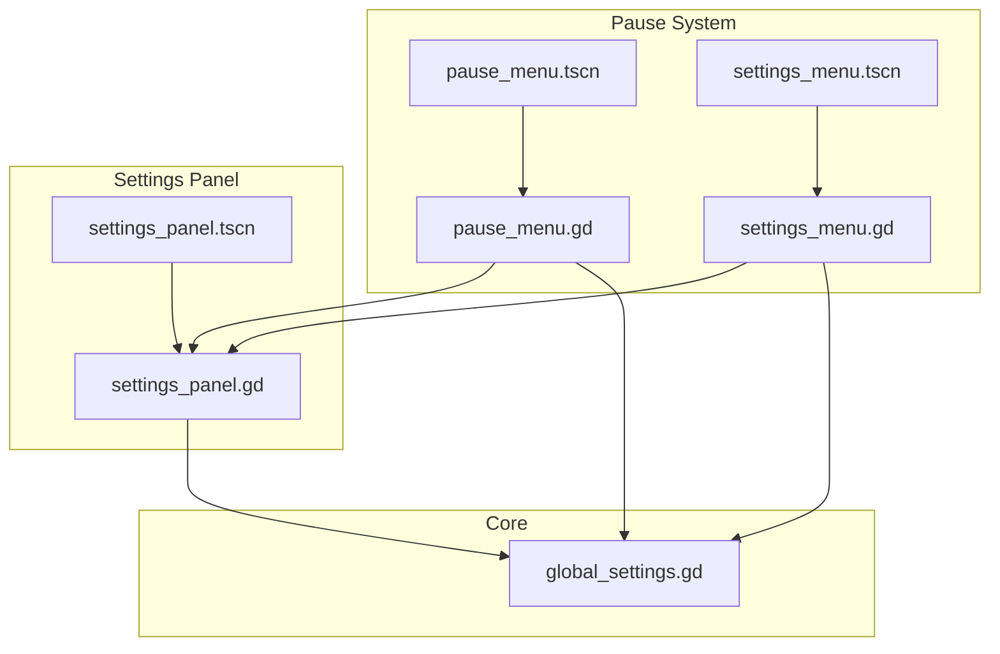
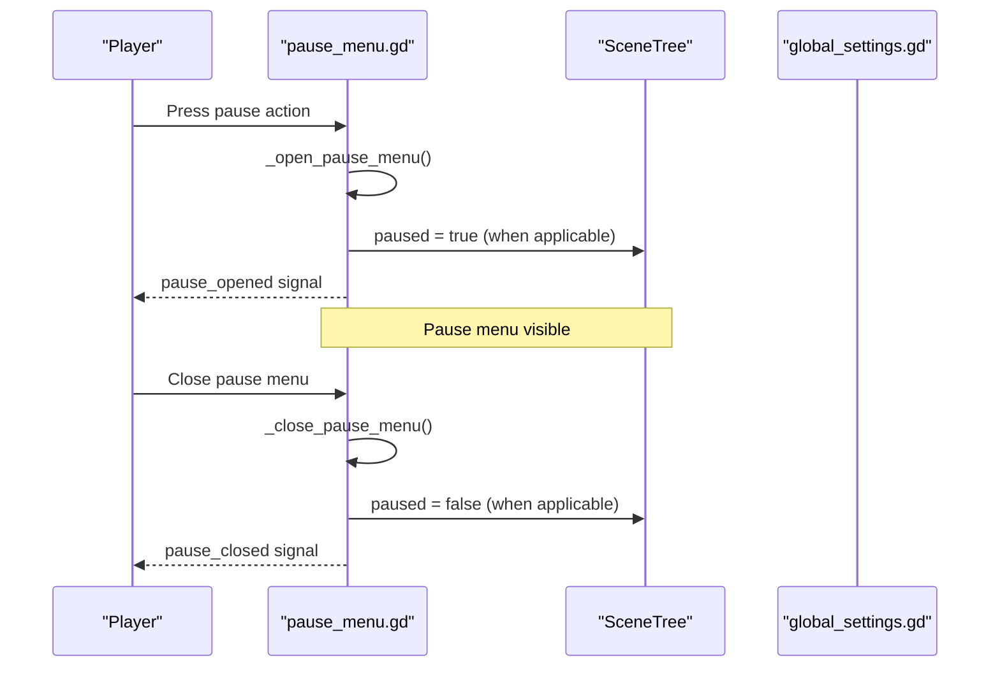
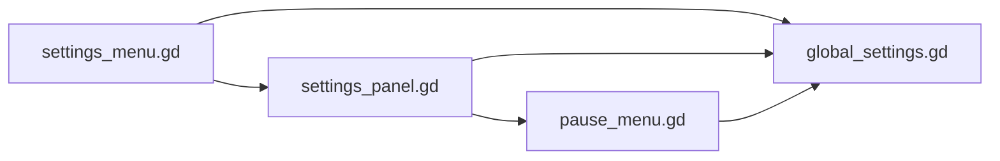

# Settings and Pause API

<cite>
**Referenced Files in This Document**
- [pause_menu.gd](file://Menu/pause_menu.gd)
- [pause_menu.tscn](file://Menu/pause_menu.tscn)
- [settings_menu.gd](file://Menu/settings_menu.gd)
- [settings_menu.tscn](file://Menu/settings_menu.tscn)
- [settings_panel.gd](file://Menu/settings_panel.gd)
- [settings_panel.tscn](file://Menu/settings_panel.tscn)
- [global_settings.gd](file://Scripts/global_settings.gd)
- [hud_game.gd](file://Menu/HUD/hud_game.gd)
</cite>

## Table of Contents
1. [Introduction](#introduction)
2. [Project Structure](#project-structure)
3. [Core Components](#core-components)
4. [Architecture Overview](#architecture-overview)
5. [Detailed Component Analysis](#detailed-component-analysis)
6. [Dependency Analysis](#dependency-analysis)
7. [Performance Considerations](#performance-considerations)
8. [Troubleshooting Guide](#troubleshooting-guide)
9. [Conclusion](#conclusion)

## Introduction
This document provides comprehensive API documentation for the settings and pause menu systems. It covers audio controls, graphics options, interface preferences, and game state management during pause. The documentation explains settings persistence, configuration validation, real-time parameter application, and includes practical examples for volume adjustment, resolution changes, and pause state handling. It also documents the settings reset functionality and default value management.

## Project Structure
The settings and pause systems are composed of scene scripts and UI panels orchestrated by a central settings manager:

- Pause menu system: Scene and controller logic for opening/closing the pause menu and transitioning to menus.
- Settings panel: UI-driven configuration for audio, graphics, and interface options.
- Global settings manager: Central service for loading/saving settings, validating values, applying changes, and broadcasting updates.

**Diagram sources**
- [pause_menu.gd:1-143](file://Menu/pause_menu.gd#L1-L143)
- [pause_menu.tscn:1-105](file://Menu/pause_menu.tscn#L1-L105)
- [settings_menu.gd:1-20](file://Menu/settings_menu.gd#L1-L20)
- [settings_menu.tscn:1-45](file://Menu/settings_menu.tscn#L1-L45)
- [settings_panel.gd:1-202](file://Menu/settings_panel.gd#L1-L202)
- [settings_panel.tscn:1-338](file://Menu/settings_panel.tscn#L1-L338)
- [global_settings.gd:1-618](file://Scripts/global_settings.gd#L1-L618)

**Section sources**
- [pause_menu.gd:1-143](file://Menu/pause_menu.gd#L1-L143)
- [settings_panel.gd:1-202](file://Menu/settings_panel.gd#L1-L202)
- [global_settings.gd:1-618](file://Scripts/global_settings.gd#L1-L618)

## Core Components
- Pause menu controller: Handles input, toggles UI visibility, manages game tree pause state, and transitions to main menu or lobby.
- Settings panel controller: Binds UI controls to settings keys, validates and applies changes, and resets to defaults.
- Global settings manager: Provides settings storage, validation, persistence, and real-time application to engine/system resources.

Key responsibilities:
- Real-time application: Changes are applied immediately upon user interaction.
- Persistence: Settings are saved to disk via a configuration file.
- Validation: Values are sanitized against supported ranges and options.
- Signals: Emits change notifications for UI synchronization and language updates.

**Section sources**
- [pause_menu.gd:28-82](file://Menu/pause_menu.gd#L28-L82)
- [settings_panel.gd:25-31](file://Menu/settings_panel.gd#L25-L31)
- [global_settings.gd:164-186](file://Scripts/global_settings.gd#L164-L186)

## Architecture Overview
The pause and settings systems integrate through a shared settings manager that exposes a simple API for reading/writing settings and applying them to engine subsystems.

**Diagram sources**
- [pause_menu.gd:47-82](file://Menu/pause_menu.gd#L47-L82)
- [pause_menu.gd:115-118](file://Menu/pause_menu.gd#L115-L118)

**Section sources**
- [pause_menu.gd:47-82](file://Menu/pause_menu.gd#L47-L82)

## Detailed Component Analysis

### Pause Menu API
The pause menu controller manages the pause overlay, button visibility, and game state. It supports single-player freezing and multi-player passthrough behavior.

- Signals:
  - pause_opened: Emitted when the pause menu opens.
  - pause_closed: Emitted when the pause menu closes.
  - main_menu_requested: Emitted when transitioning to the main menu or lobby.

- Public behavior:
  - Toggle pause menu visibility on pause action.
  - Freeze/unfreeze gameplay depending on multiplayer context.
  - Navigate to main menu or lobby scene.

- Exported properties:
  - main_menu_scene_path: Target scene for returning to main menu.
  - pause_action: Input action name to toggle pause.
  - freeze_game_on_pause: Whether to pause the game tree.
  - disable_pause_button_when_open: Hide the on-screen pause button while open.

- Internal logic highlights:
  - _should_freeze_game(): Freezes only in single-player mode.
  - _open_pause_menu/_close_pause_menu: Manage visibility and tree pause state.
  - _on_main_menu_pressed: Emits main_menu_requested and changes scene accordingly.

Example usage:
- Open/close pause menu via input action.
- Transition to main menu or lobby depending on multiplayer state.

**Section sources**
- [pause_menu.gd:1-143](file://Menu/pause_menu.gd#L1-L143)
- [pause_menu.tscn:1-105](file://Menu/pause_menu.tscn#L1-L105)

### Settings Panel API
The settings panel binds UI controls to settings keys and applies changes in real time. It also handles reset to defaults and language-aware UI updates.

- Controls and keys:
  - Master volume slider mapped to "master_volume".
  - Window mode option mapped to "window_mode".
  - VSync toggle mapped to "vsync".
  - FPS cap option mapped to "fps_cap".
  - Graphics preset option mapped to "graphics_preset".
  - UI scale option mapped to "ui_scale".
  - Language option mapped to "language".
  - Show FPS toggle mapped to "show_fps".
  - Subtitles toggle mapped to "subtitles".
  - Screen shake toggle mapped to "screen_shake".

- Real-time application:
  - Sliders and toggles call apply_settings on change.
  - Option selections collect and apply all visible settings.

- Reset functionality:
  - Reset button triggers reset_to_defaults on the global settings manager.

- UI synchronization:
  - On settings_changed, the panel rebinds control values.
  - On language_changed, options and labels refresh.

Example usage:
- Adjust master volume and observe immediate audio change.
- Change window mode and see display mode update.
- Switch language and verify UI text updates.

**Section sources**
- [settings_panel.gd:1-202](file://Menu/settings_panel.gd#L1-L202)
- [settings_panel.tscn:1-338](file://Menu/settings_panel.tscn#L1-L338)

### Global Settings Manager API
The global settings manager is the central authority for settings lifecycle: loading, validation, persistence, and application.

- Defaults and metadata:
  - DEFAULTS: Initial values for all settings.
  - DEFAULT_META: Metadata defaults (e.g., last seen version).
  - SUPPORTED_LANGUAGES: Allowed language codes.
  - FPS_CAP_OPTIONS and UI_SCALE_OPTIONS: Valid discrete values.

- Persistence:
  - SETTINGS_PATH: Persistent storage location.
  - _load_config(): Loads persisted settings and meta, then applies them.
  - _save_config(): Writes current settings and meta to disk.

- Validation:
  - _sanitize_settings(): Clamps numeric values, filters invalid options, and normalizes language codes.

- Application:
  - apply_settings(changes, persist): Merges changes, sanitizes, applies to engine/system, persists optionally, emits signals.
  - reset_to_defaults(): Resets to DEFAULTS and persists.

- Real-time application functions:
  - _apply_master_volume(percent): Converts percentage to decibels and sets master bus volume.
  - _apply_window_mode(index): Sets window mode via DisplayServer.
  - _apply_vsync(enabled): Toggles VSync via DisplayServer.
  - _apply_fps_cap(value): Sets Engine.max_fps.
  - _apply_graphics_preset(index): Applies lighting/shadow/glow presets to nodes.
  - _apply_ui_scale(ui_scale_value): Updates theme base scale and recalculates font sizes/constants.
  - _apply_language(code): Switches TranslationServer locale.
  - _apply_show_fps(enabled): Shows/hides FPS overlay.
  - _apply_subtitles(enabled): Emits subtitle clearing when disabled.

- Signals:
  - settings_changed(settings): Emitted after successful application.
  - language_changed(language_code): Emitted when language changes.

Example usage:
- Apply a single setting change (e.g., master volume) and persist automatically.
- Reset all settings to defaults and reload UI.

**Section sources**
- [global_settings.gd:14-618](file://Scripts/global_settings.gd#L14-L618)

### Settings Persistence and Validation
- Persistence model:
  - Settings are stored in a configuration file under the user path.
  - Two sections: settings and meta.
  - Load occurs at startup; subsequent changes are saved immediately.

- Validation model:
  - Numeric clamping ensures values stay within supported ranges.
  - Option filtering ensures only supported values are accepted.
  - Language normalization enforces supported locales.

- Example scenarios:
  - Volume out of range is clamped to valid bounds.
  - Unsupported language falls back to default.
  - Invalid FPS cap values revert to a supported option.

**Section sources**
- [global_settings.gd:226-244](file://Scripts/global_settings.gd#L226-L244)
- [global_settings.gd:247-262](file://Scripts/global_settings.gd#L247-L262)

### Real-Time Parameter Application
- Immediate feedback:
  - UI updates reflect new values instantly.
  - Engine/system changes take effect without restarting.

- Examples:
  - Master volume slider updates audio bus volume in real time.
  - Window mode switch updates display immediately.
  - UI scale change resizes fonts and constants dynamically.

**Section sources**
- [settings_panel.gd:162-179](file://Menu/settings_panel.gd#L162-L179)
- [global_settings.gd:272-327](file://Scripts/global_settings.gd#L272-L327)

### Pause State Handling
- Single-player vs multi-player:
  - In single-player, the game tree is paused when the pause menu opens.
  - In multi-player, the pause menu remains interactive without pausing simulation.

- Scene transitions:
  - From pause menu, pressing main menu navigates to the lobby in multi-player or to the configured main menu scene otherwise.

**Section sources**
- [pause_menu.gd:115-118](file://Menu/pause_menu.gd#L115-L118)
- [pause_menu.gd:99-112](file://Menu/pause_menu.gd#L99-L112)

### Settings Reset and Defaults
- Reset behavior:
  - Reset button triggers reset_to_defaults, which reapplies DEFAULTS and persists them.
  - UI rebinds all controls to default values.

- Default values:
  - Defined centrally and used for initial load and reset.

**Section sources**
- [settings_panel.gd:182-183](file://Menu/settings_panel.gd#L182-L183)
- [global_settings.gd:188-189](file://Scripts/global_settings.gd#L188-L189)

### Key Bindings and Input Integration
- Pause action:
  - The pause menu listens for a configurable input action to toggle the menu.
  - The HUD integrates with the pause system by simulating the pause action when the pause button is pressed.

- Rebinding:
  - No explicit key rebinding UI is present in the examined files. Key mapping is managed by the engine's input system outside the scope of these components.

**Section sources**
- [pause_menu.gd:47-53](file://Menu/pause_menu.gd#L47-L53)
- [hud_game.gd:153-158](file://Menu/HUD/hud_game.gd#L153-L158)

## Dependency Analysis
The pause and settings systems depend on the global settings manager for centralized configuration handling.

**Diagram sources**
- [pause_menu.gd](file://Menu/pause_menu.gd#L12)
- [settings_menu.gd](file://Menu/settings_menu.gd#L3)
- [settings_panel.gd](file://Menu/settings_panel.gd#L5)

**Section sources**
- [pause_menu.gd](file://Menu/pause_menu.gd#L12)
- [settings_panel.gd](file://Menu/settings_panel.gd#L5)

## Performance Considerations
- Real-time application overhead is minimal since settings are applied directly to engine subsystems.
- Graphics preset application traverses the scene tree; consider avoiding frequent changes during intense gameplay.
- FPS cap and VSync changes are immediate; monitor impact on battery life on mobile platforms.
- Language switching triggers UI refresh; avoid excessive toggling during gameplay.

## Troubleshooting Guide
- Settings not persisting:
  - Verify the settings file exists at the expected user path and is writable.
  - Ensure apply_settings is called with persist enabled (default).

- Invalid settings ignored:
  - Confirm values fall within supported ranges or options.
  - Check that unsupported languages normalize to defaults.

- Pause menu does not close:
  - Ensure the pause action is properly bound and recognized.
  - Verify _close_pause_menu is reachable and not blocked by overlays.

- Graphics preset not applied:
  - Confirm the preset index is valid and graphics nodes exist in the scene tree.
  - Check that _apply_graphics_to_branch is invoked after scene initialization.

**Section sources**
- [global_settings.gd:226-244](file://Scripts/global_settings.gd#L226-L244)
- [global_settings.gd:247-262](file://Scripts/global_settings.gd#L247-L262)
- [pause_menu.gd:71-82](file://Menu/pause_menu.gd#L71-L82)

## Conclusion
The settings and pause systems provide a robust, real-time configuration experience with strong validation and persistence. The pause menu offers flexible behavior across single-player and multi-player contexts, while the settings panel enables immediate adjustments to audio, graphics, and interface preferences. The global settings manager centralizes configuration logic, ensuring consistency and reliability across the application.