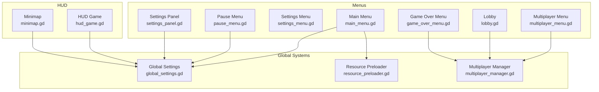
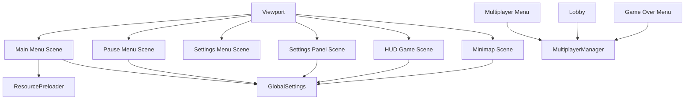
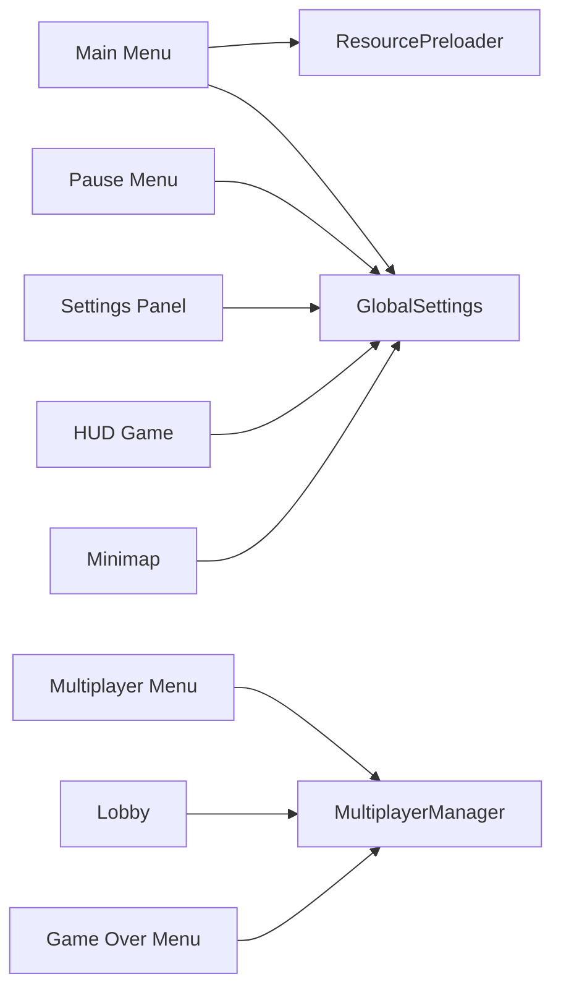

# UI and HUD API

<cite>
**Referenced Files in This Document**
- [main_menu.gd](file://Menu/main_menu.gd)
- [pause_menu.gd](file://Menu/pause_menu.gd)
- [settings_menu.gd](file://Menu/settings_menu.gd)
- [settings_panel.gd](file://Menu/settings_panel.gd)
- [hud_game.gd](file://Menu/HUD/hud_game.gd)
- [minimap.gd](file://Menu/HUD/minimap.gd)
- [global_settings.gd](file://Scripts/global_settings.gd)
- [resource_preloader.gd](file://Scripts/resource_preloader.gd)
- [multiplayer_menu.gd](file://Menu/multiplayer_menu.gd)
- [lobby.gd](file://Menu/lobby.gd)
- [multiplayer_manager.gd](file://Scripts/multiplayer_manager.gd)
- [game_over_menu.gd](file://Menu/game_over_menu.gd)
</cite>

## Table of Contents
1. [Introduction](#introduction)
2. [Project Structure](#project-structure)
3. [Core Components](#core-components)
4. [Architecture Overview](#architecture-overview)
5. [Detailed Component Analysis](#detailed-component-analysis)
6. [Dependency Analysis](#dependency-analysis)
7. [Performance Considerations](#performance-considerations)
8. [Troubleshooting Guide](#troubleshooting-guide)
9. [Conclusion](#conclusion)

## Introduction
This document provides comprehensive API documentation for the UI and HUD system, covering the main menu, in-game HUD, minimap, settings panel, pause menu, and related systems. It explains UI component initialization, data binding, event handling, responsive design patterns, UI scaling, localization integration, and accessibility features. It also documents settings persistence, cross-scene communication, and HUD element updates.

## Project Structure
The UI system is organized around modular scenes and scripts:
- Menus: Main menu, pause menu, settings menu, settings panel, multiplayer menu, lobby, and game over screen
- HUD: Health bar, weapon/ammo display, subtitles, pause button, scoreboard, and minimap
- Global systems: Settings, resource preloading, and multiplayer management

**Diagram sources**
- [main_menu.gd:1-416](file://Menu/main_menu.gd#L1-L416)
- [pause_menu.gd:1-143](file://Menu/pause_menu.gd#L1-L143)
- [settings_menu.gd:1-20](file://Menu/settings_menu.gd#L1-L20)
- [settings_panel.gd:1-202](file://Menu/settings_panel.gd#L1-L202)
- [hud_game.gd:1-206](file://Menu/HUD/hud_game.gd#L1-L206)
- [minimap.gd:1-114](file://Menu/HUD/minimap.gd#L1-L114)
- [global_settings.gd:1-618](file://Scripts/global_settings.gd#L1-L618)
- [resource_preloader.gd:1-226](file://Scripts/resource_preloader.gd#L1-L226)
- [multiplayer_menu.gd:1-121](file://Menu/multiplayer_menu.gd#L1-L121)
- [lobby.gd:1-162](file://Menu/lobby.gd#L1-L162)
- [multiplayer_manager.gd:1-322](file://Scripts/multiplayer_manager.gd#L1-L322)

**Section sources**
- [main_menu.gd:1-416](file://Menu/main_menu.gd#L1-L416)
- [pause_menu.gd:1-143](file://Menu/pause_menu.gd#L1-L143)
- [settings_menu.gd:1-20](file://Menu/settings_menu.gd#L1-L20)
- [settings_panel.gd:1-202](file://Menu/settings_panel.gd#L1-L202)
- [hud_game.gd:1-206](file://Menu/HUD/hud_game.gd#L1-L206)
- [minimap.gd:1-114](file://Menu/HUD/minimap.gd#L1-L114)
- [global_settings.gd:1-618](file://Scripts/global_settings.gd#L1-L618)
- [resource_preloader.gd:1-226](file://Scripts/resource_preloader.gd#L1-L226)
- [multiplayer_menu.gd:1-121](file://Menu/multiplayer_menu.gd#L1-L121)
- [lobby.gd:1-162](file://Menu/lobby.gd#L1-L162)
- [multiplayer_manager.gd:1-322](file://Scripts/multiplayer_manager.gd#L1-L322)

## Core Components
- Main Menu: Handles play, settings, exit, release checks, and asynchronous resource preloading with a dynamic loading overlay
- Pause Menu: Toggles pause overlay, integrates with HUD presence, and supports single-player vs. multiplayer modes
- Settings Menu and Panel: Centralized settings management with persistence, localization, graphics presets, UI scale, and audio controls
- HUD Game: Displays health, weapon/ammo, subtitles, scoreboard, and responds to quality settings
- Minimap: Renders teammates/enemies/items with height-aware filtering and quality-dependent rendering
- Global Settings: Singleton managing settings persistence, localization, graphics presets, UI scaling, FPS overlay, and subtitle requests
- Resource Preloader: Background resource and shader warm-up with progress signals and seamless scene transitions
- Multiplayer Menu and Lobby: Host/join flows, readiness toggles, team modes, and chat
- Multiplayer Manager: ENet-based networking abstraction with lobby, team assignment, and game start orchestration
- Game Over Menu: Single-player restart and checkpoint options, and multiplayer spectator mode

**Section sources**
- [main_menu.gd:1-416](file://Menu/main_menu.gd#L1-L416)
- [pause_menu.gd:1-143](file://Menu/pause_menu.gd#L1-L143)
- [settings_menu.gd:1-20](file://Menu/settings_menu.gd#L1-L20)
- [settings_panel.gd:1-202](file://Menu/settings_panel.gd#L1-L202)
- [hud_game.gd:1-206](file://Menu/HUD/hud_game.gd#L1-L206)
- [minimap.gd:1-114](file://Menu/HUD/minimap.gd#L1-L114)
- [global_settings.gd:1-618](file://Scripts/global_settings.gd#L1-L618)
- [resource_preloader.gd:1-226](file://Scripts/resource_preloader.gd#L1-L226)
- [multiplayer_menu.gd:1-121](file://Menu/multiplayer_menu.gd#L1-L121)
- [lobby.gd:1-162](file://Menu/lobby.gd#L1-L162)
- [multiplayer_manager.gd:1-322](file://Scripts/multiplayer_manager.gd#L1-L322)
- [game_over_menu.gd:1-269](file://Menu/game_over_menu.gd#L1-L269)

## Architecture Overview
The UI system follows a layered architecture:
- Scene Layer: Menus and HUD scenes define UI hierarchy and node references
- Script Layer: Scripts manage initialization, events, and data binding
- Global Layer: GlobalSettings centralizes persistence, localization, and global UI behavior
- Networking Layer: MultiplayerManager handles lobby, teams, and game lifecycle
- Resource Layer: ResourcePreloader performs background loading and warm-up

**Diagram sources**
- [main_menu.gd:1-416](file://Menu/main_menu.gd#L1-L416)
- [pause_menu.gd:1-143](file://Menu/pause_menu.gd#L1-L143)
- [settings_menu.gd:1-20](file://Menu/settings_menu.gd#L1-L20)
- [settings_panel.gd:1-202](file://Menu/settings_panel.gd#L1-L202)
- [hud_game.gd:1-206](file://Menu/HUD/hud_game.gd#L1-L206)
- [minimap.gd:1-114](file://Menu/HUD/minimap.gd#L1-L114)
- [global_settings.gd:1-618](file://Scripts/global_settings.gd#L1-L618)
- [resource_preloader.gd:1-226](file://Scripts/resource_preloader.gd#L1-L226)
- [multiplayer_menu.gd:1-121](file://Menu/multiplayer_menu.gd#L1-L121)
- [lobby.gd:1-162](file://Menu/lobby.gd#L1-L162)
- [multiplayer_manager.gd:1-322](file://Scripts/multiplayer_manager.gd#L1-L322)

## Detailed Component Analysis

### Main Menu API
Responsibilities:
- Initialize UI nodes and overlays
- Connect to GlobalSettings for language and release updates
- Manage asynchronous resource preloading and a dynamic loading overlay
- Handle play, settings, and exit actions
- Localize UI strings and refresh on language changes
- Show startup changelog and handle release banner interactions

Key APIs and Behaviors:
- Signals: play_requested, exit_requested
- Initialization: _ready() sets visibility, connects signals, and triggers preloading
- Preloading: Uses ResourcePreloader with progress_changed and all_loaded signals
- Dynamic overlay: _build_load_overlay(), _update_load_bar(), _hide_load_overlay()
- Navigation: _on_play_pressed() with checkpoint cleanup and scene switching
- Localization: _refresh_texts() and _on_language_changed()

Example usage patterns:
- Trigger play flow: connect to play_requested and switch scene after preloading completes
- Show settings: toggle SettingsOverlay visibility
- Handle release updates: listen to release_check_completed and update UI accordingly

**Section sources**
- [main_menu.gd:1-416](file://Menu/main_menu.gd#L1-L416)
- [resource_preloader.gd:1-226](file://Scripts/resource_preloader.gd#L1-L226)
- [global_settings.gd:1-618](file://Scripts/global_settings.gd#L1-L618)

### Pause Menu API
Responsibilities:
- Toggle pause overlay and settings panel
- Respect HUD presence and multiplayer state
- Freeze/unfreeze gameplay based on mode
- Localize UI strings and update mode label

Key APIs and Behaviors:
- Signals: pause_opened, pause_closed, main_menu_requested
- Inputs: _unhandled_input() listens for pause_game action
- Visibility: _open_pause_menu() and _close_pause_menu() control overlay and panels
- Mode detection: _check_hud_presence() hides pause button when HUD exists
- Multiplayer handling: _on_main_menu_pressed() routes to lobby or main menu depending on session

**Section sources**
- [pause_menu.gd:1-143](file://Menu/pause_menu.gd#L1-L143)
- [multiplayer_manager.gd:1-322](file://Scripts/multiplayer_manager.gd#L1-L322)

### Settings Menu and Settings Panel API
Responsibilities:
- Settings Menu: Basic navigation back to previous scene
- Settings Panel: Full settings management with persistence and live updates

Settings Panel APIs:
- Signals: back_requested
- Initialization: _ready() connects signals, populates options, and applies current settings
- Options population: Window mode, VSync, FPS cap, graphics preset, UI scale, language
- Data binding: _apply_settings_to_controls(), _collect_settings(), _on_setting_changed()
- Persistence: apply_settings() merges and sanitizes values, emits settings_changed
- Localization: _update_texts() and _on_language_changed() refresh UI labels
- Live toggles: _refresh_toggle_texts() updates labels for toggle controls

**Section sources**
- [settings_menu.gd:1-20](file://Menu/settings_menu.gd#L1-L20)
- [settings_panel.gd:1-202](file://Menu/settings_panel.gd#L1-L202)
- [global_settings.gd:1-618](file://Scripts/global_settings.gd#L1-L618)

### HUD Game API
Responsibilities:
- Bind to local player and update health, ammo, weapon name
- Render subtitles and manage their duration
- Expose pause simulation and shooting/reload actions
- Adjust health bar position based on FPS panel visibility
- React to graphics quality changes

Key APIs and Behaviors:
- Player binding: _setup_player() connects to player signals and initializes UI
- Health: _on_player_health_changed() updates ProgressBar and optional shader parameter
- Ammo: _on_player_ammo_changed() updates current and total labels
- Reload flash: _on_player_reload_started() animates ammo label color
- Subtitles: _on_subtitle_requested() shows/hides subtitle panel
- Scoreboard: update_scoreboard() toggles and updates text
- Pause: _on_pause_pressed() simulates pause_game action
- Quality: _on_settings_changed() and _apply_quality() propagate quality level

**Section sources**
- [hud_game.gd:1-206](file://Menu/HUD/hud_game.gd#L1-L206)
- [global_settings.gd:1-618](file://Scripts/global_settings.gd#L1-L618)

### Minimap API
Responsibilities:
- Draw player, teammates, enemies, and items with height filtering
- Scale rendering based on quality level
- Track player node and redraw when visible

Key APIs and Behaviors:
- Initialization: Reads initial quality from GlobalSettings and connects to settings_changed
- Player tracking: Finds player in "players" group or listens for node_added
- Drawing: _draw() renders background/border (quality-dependent), player diamond, entities, and items
- Filtering: Compares current_height_level between entities and player
- Quality: _on_settings_changed() updates internal quality level

**Section sources**
- [minimap.gd:1-114](file://Menu/HUD/minimap.gd#L1-L114)
- [global_settings.gd:1-618](file://Scripts/global_settings.gd#L1-L618)

### Multiplayer Menu and Lobby API
Responsibilities:
- Multiplayer Menu: Host/join flows, team mode selection, and player name persistence
- Lobby: Player list, readiness toggles, start button, chat, and connection status

Multiplayer Menu APIs:
- Host: _on_create_button_pressed() validates inputs, sets team mode/count, and starts server
- Join: _on_join_button_pressed() validates IP/port and attempts connection
- Back: _on_back_button_pressed() disconnects and returns to main menu
- Name persistence: _apply_player_name() stores player name in GlobalSettings

Lobby APIs:
- UI list: _on_lobby_updated() builds rows with readiness, name, and team badges
- Readiness: _on_ready_button_pressed() toggles local readiness
- Start: _on_start_button_pressed() starts the game (host only)
- Chat: _on_send_chat_button_pressed() and _receive_chat_message() for BBCode chat
- Connection failure: _on_connection_failed() resets UI and navigates back

**Section sources**
- [multiplayer_menu.gd:1-121](file://Menu/multiplayer_menu.gd#L1-L121)
- [lobby.gd:1-162](file://Menu/lobby.gd#L1-L162)
- [multiplayer_manager.gd:1-322](file://Scripts/multiplayer_manager.gd#L1-L322)

### Game Over Menu API
Responsibilities:
- Single-player: Restart from beginning or checkpoint, return to main menu
- Multiplayer: Spectate other players with prev/next navigation

Key APIs and Behaviors:
- Setup: _configure_ui() switches containers based on multiplayer mode
- Single-player: _on_restart_begin_pressed(), _on_restart_checkpoint_pressed(), _on_main_menu_pressed()
- Multiplayer: _update_spectatable_players(), _on_spectate_prev_pressed(), _on_spectate_next_pressed()
- Cleanup: _cleanup_game() restores paused state and clears mission data

**Section sources**
- [game_over_menu.gd:1-269](file://Menu/game_over_menu.gd#L1-L269)

### Global Settings API
Responsibilities:
- Settings persistence and defaults
- Localization and translation
- Graphics presets and UI scaling
- FPS overlay and subtitle requests
- Release checking and update status

Key APIs and Behaviors:
- Persistence: get_settings(), apply_settings(), reset_to_defaults(), _load_config(), _save_config()
- Sanitization: _sanitize_settings() clamps values to supported ranges
- Graphics: _apply_graphics_preset(), _apply_graphics_to_node(), _apply_graphics_to_branch()
- UI Scale: _apply_ui_scale() adjusts theme base scale and font/constants
- Language: _apply_language() sets TranslationServer locale
- FPS: _apply_show_fps() toggles FPS overlay visibility
- Subtitles: show_subtitle() and show_subtitle_key() emit subtitle_requested
- Releases: request_release_check(), _fetch_release_info(), begin_release_update(), update_status_changed

**Section sources**
- [global_settings.gd:1-618](file://Scripts/global_settings.gd#L1-L618)

### Resource Preloader API
Responsibilities:
- Background loading of scenes and synchronous shader warm-up
- Progress reporting and completion signaling
- Seamless scene transitions when resources are ready

Key APIs and Behaviors:
- preload_resources(): Requests threaded loading for top-level scenes
- preload_shaders(): Loads shaders synchronously and creates ShaderMaterial instances
- get_progress(): Computes overall progress based on completed and in-progress loads
- is_done(): Returns whether all requested resources are loaded
- change_scene_when_ready(): Queues scene change to occur after loading completes
- Signals: progress_changed(overall), all_loaded()

**Section sources**
- [resource_preloader.gd:1-226](file://Scripts/resource_preloader.gd#L1-L226)

### Multiplayer Manager API
Responsibilities:
- ENet-based networking abstraction
- Lobby management, team assignment, and game start
- Player registration, readiness, and chat-like messaging

Key APIs and Behaviors:
- Host/Join: host_game(), join_game(), disconnect_game()
- Session state: is_host(), is_connected_to_session(), get_local_peer_id()
- Lobby: set_ready(), start_game() (host only), lobby_updated signal
- Team modes: team_mode ("teams" or "ffa"), team_count
- RPC: _register_player_on_server(), _set_ready_on_server(), _start_game_on_all()
- Events: connection_failed, player_disconnected, player_connected, all_players_ready

**Section sources**
- [multiplayer_manager.gd:1-322](file://Scripts/multiplayer_manager.gd#L1-L322)

## Dependency Analysis
The UI system exhibits clear separation of concerns:
- Menus depend on GlobalSettings for localization and settings, and on ResourcePreloader for smooth transitions
- HUD depends on GlobalSettings for quality and subtitles, and on the player node for stats
- Minimap depends on GlobalSettings for quality and on the tree for entity discovery
- Multiplayer components depend on MultiplayerManager for network state and lobby updates

**Diagram sources**
- [main_menu.gd:1-416](file://Menu/main_menu.gd#L1-L416)
- [pause_menu.gd:1-143](file://Menu/pause_menu.gd#L1-L143)
- [settings_panel.gd:1-202](file://Menu/settings_panel.gd#L1-L202)
- [hud_game.gd:1-206](file://Menu/HUD/hud_game.gd#L1-L206)
- [minimap.gd:1-114](file://Menu/HUD/minimap.gd#L1-L114)
- [global_settings.gd:1-618](file://Scripts/global_settings.gd#L1-L618)
- [resource_preloader.gd:1-226](file://Scripts/resource_preloader.gd#L1-L226)
- [multiplayer_menu.gd:1-121](file://Menu/multiplayer_menu.gd#L1-L121)
- [lobby.gd:1-162](file://Menu/lobby.gd#L1-L162)
- [multiplayer_manager.gd:1-322](file://Scripts/multiplayer_manager.gd#L1-L322)

**Section sources**
- [global_settings.gd:1-618](file://Scripts/global_settings.gd#L1-L618)
- [resource_preloader.gd:1-226](file://Scripts/resource_preloader.gd#L1-L226)
- [multiplayer_manager.gd:1-322](file://Scripts/multiplayer_manager.gd#L1-L322)

## Performance Considerations
- Asynchronous resource preloading: Use ResourcePreloader to avoid frame drops during scene transitions
- Quality-dependent rendering: Minimap and HUD adapt visuals based on graphics preset to balance fidelity and performance
- UI scaling: GlobalSettings scales fonts and constants to maintain readability across resolutions
- FPS overlay: Optional FPS counter can be toggled to monitor performance impact
- Shader warm-up: Preloading shaders reduces first-frame stutter in advanced effects

[No sources needed since this section provides general guidance]

## Troubleshooting Guide
Common issues and resolutions:
- Settings not applying: Verify apply_settings() emits settings_changed and that controls are not mid-load (_is_loading flag)
- Localization not updating: Ensure language_changed is connected and _on_language_changed() refreshes texts and options
- Pause overlay not hiding: Confirm _close_pause_menu() restores pause state and visibility; check HUD presence logic
- Minimap not drawing: Ensure player node is found and visible; verify height filtering conditions
- Multiplayer start disabled: Confirm all players are ready and host privileges are correct
- Resource preloading stalls: Check progress_changed signals and finalize logic; ensure change_scene_when_ready() is called after all_loaded

**Section sources**
- [settings_panel.gd:1-202](file://Menu/settings_panel.gd#L1-L202)
- [global_settings.gd:1-618](file://Scripts/global_settings.gd#L1-L618)
- [pause_menu.gd:1-143](file://Menu/pause_menu.gd#L1-L143)
- [minimap.gd:1-114](file://Menu/HUD/minimap.gd#L1-L114)
- [multiplayer_manager.gd:1-322](file://Scripts/multiplayer_manager.gd#L1-L322)
- [resource_preloader.gd:1-226](file://Scripts/resource_preloader.gd#L1-L226)

## Conclusion
The UI and HUD system provides a robust, modular foundation for menus, HUD elements, settings, and multiplayer flows. It leverages a centralized GlobalSettings singleton for persistence and responsiveness, ResourcePreloader for seamless transitions, and MultiplayerManager for networking. The system supports localization, UI scaling, quality-based rendering, and accessibility-friendly controls, enabling scalable enhancements while maintaining clean separation of concerns.