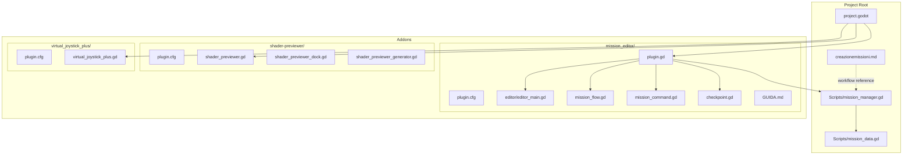
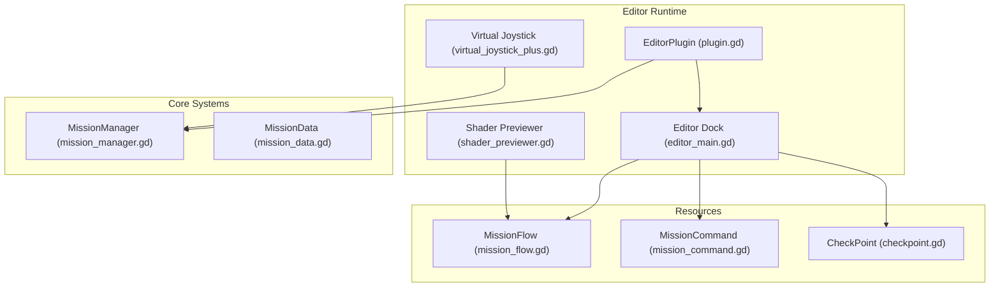
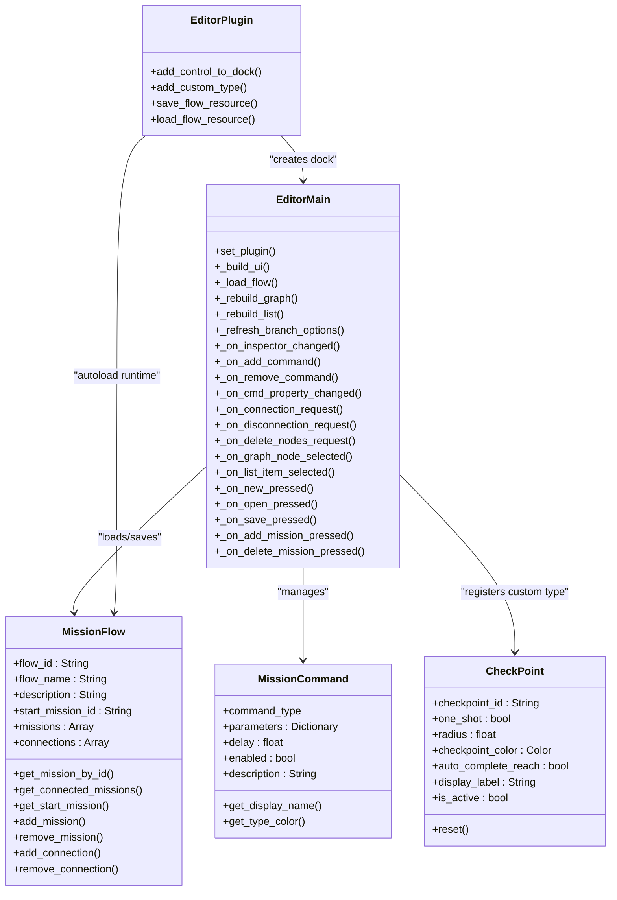
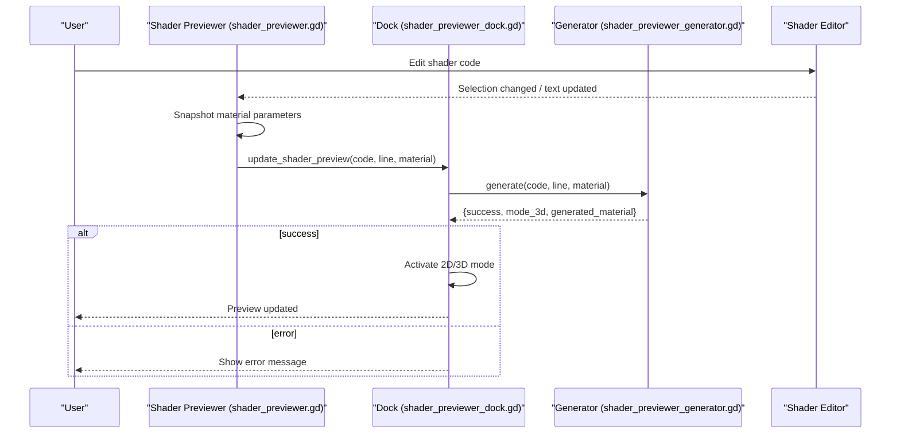
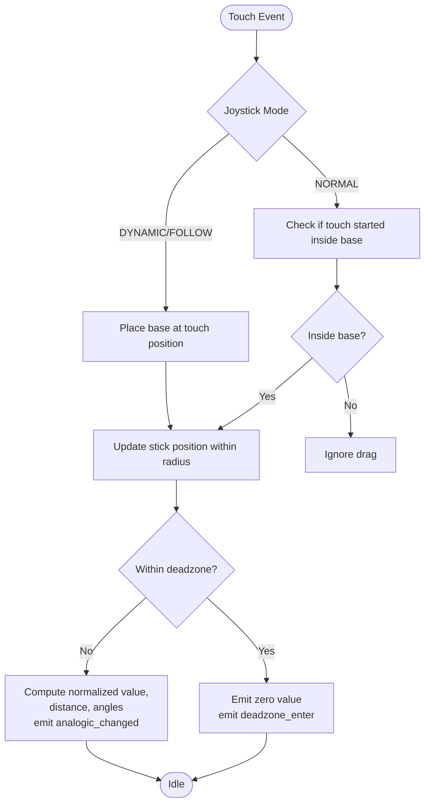
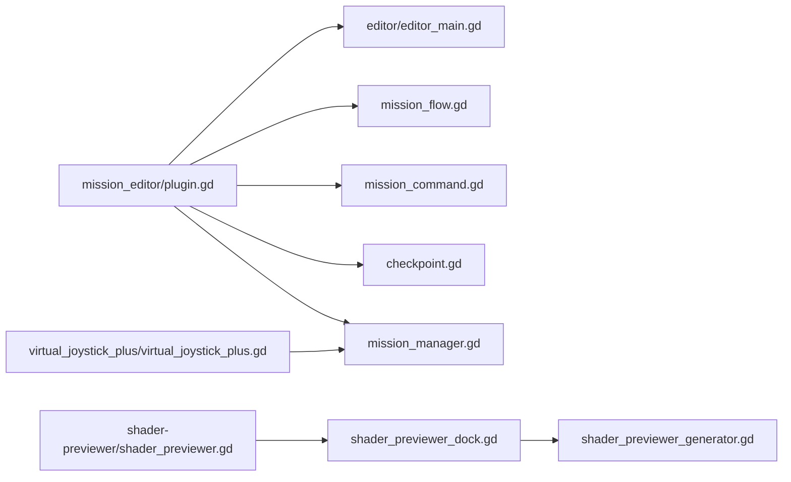
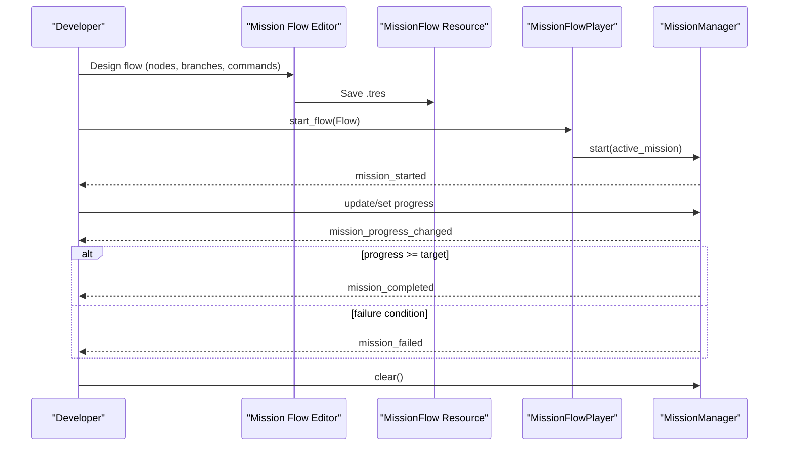

# Addons and Development Tools

<cite>
**Referenced Files in This Document**
- [plugin.cfg](file://addons/mission_editor/plugin.cfg)
- [plugin.gd](file://addons/mission_editor/plugin.gd)
- [editor_main.gd](file://addons/mission_editor/editor/editor_main.gd)
- [mission_flow.gd](file://addons/mission_editor/mission_flow.gd)
- [checkpoint.gd](file://addons/mission_editor/checkpoint.gd)
- [mission_command.gd](file://addons/mission_editor/mission_command.gd)
- [GUIDA.md](file://addons/mission_editor/GUIDA.md)
- [shader_previewer.gd](file://addons/shader-previewer/shader_previewer.gd)
- [shader_previewer_dock.gd](file://addons/shader-previewer/shader_previewer_dock.gd)
- [shader_previewer_generator.gd](file://addons/shader-previewer/shader_previewer_generator.gd)
- [plugin.cfg](file://addons/shader-previewer/plugin.cfg)
- [virtual_joystick_plus.gd](file://addons/virtual_joystick_plus/virtual_joystick_plus.gd)
- [plugin.cfg](file://addons/virtual_joystick_plus/plugin.cfg)
- [mission_manager.gd](file://Scripts/mission_manager.gd)
- [mission_data.gd](file://Scripts/mission_data.gd)
- [creazionemissioni.md](file://creazionemissioni.md)
</cite>

## Table of Contents
1. [Introduction](#introduction)
2. [Project Structure](#project-structure)
3. [Core Components](#core-components)
4. [Architecture Overview](#architecture-overview)
5. [Detailed Component Analysis](#detailed-component-analysis)
6. [Dependency Analysis](#dependency-analysis)
7. [Performance Considerations](#performance-considerations)
8. [Troubleshooting Guide](#troubleshooting-guide)
9. [Conclusion](#conclusion)
10. [Appendices](#appendices)

## Introduction
This document describes the TFA Agents addon ecosystem and development tools. It covers:
- Mission Flow Editor: a visual, Dialogic-style editor for designing branching mission flows, checkpoints, and runtime commands.
- Shader Previewer: a real-time shader debugging and preview tool integrated with the Godot shader editor.
- Virtual Joystick Plus: a configurable on-screen analog control for mobile and touch-based input.

It also documents how to install, configure, and use each addon, along with the mission creation workflow, shader development best practices, mobile control customization, and guidelines for extending the addon framework.

## Project Structure
The addon ecosystem lives under the addons/ directory, with dedicated plugins for mission authoring, shader development, and mobile controls. The core mission system resides in Scripts/ and is complemented by a comprehensive guide for mission creation workflows.

**Diagram sources**
- [plugin.gd:1-109](file://addons/mission_editor/plugin.gd#L1-L109)
- [shader_previewer.gd:1-267](file://addons/shader-previewer/shader_previewer.gd#L1-L267)
- [virtual_joystick_plus.gd:1-657](file://addons/virtual_joystick_plus/virtual_joystick_plus.gd#L1-L657)
- [mission_manager.gd:1-169](file://Scripts/mission_manager.gd#L1-L169)
- [mission_data.gd:1-66](file://Scripts/mission_data.gd#L1-L66)

**Section sources**
- [plugin.cfg:1-8](file://addons/mission_editor/plugin.cfg#L1-L8)
- [plugin.cfg:1-8](file://addons/shader-previewer/plugin.cfg#L1-L8)
- [plugin.cfg:1-9](file://addons/virtual_joystick_plus/plugin.cfg#L1-L9)
- [creazionemissioni.md:1-292](file://creazionemissioni.md#L1-L292)

## Core Components
- Mission Flow Editor
  - Adds a dock, registers a custom CheckPoint node, and injects an autoload for runtime mission flow playback.
  - Provides a visual graph editor, inspector, and command panel for branching missions and triggering runtime actions.
- Shader Previewer
  - Integrates with the Godot shader editor to preview shader outputs in real time, supporting canvas_item and spatial shaders.
  - Offers 2D and 3D preview modes, shape switching, lighting toggles, and floating/docked panels.
- Virtual Joystick Plus
  - A fully configurable on-screen analog stick for mobile and touch interfaces.
  - Supports NORMAL, DYNAMIC, and FOLLOW modes, deadzones, visibility modes, and texture presets.

**Section sources**
- [plugin.gd:1-109](file://addons/mission_editor/plugin.gd#L1-L109)
- [editor_main.gd:1-778](file://addons/mission_editor/editor/editor_main.gd#L1-L778)
- [shader_previewer.gd:1-267](file://addons/shader-previewer/shader_previewer.gd#L1-L267)
- [shader_previewer_dock.gd:1-451](file://addons/shader-previewer/shader_previewer_dock.gd#L1-L451)
- [virtual_joystick_plus.gd:1-657](file://addons/virtual_joystick_plus/virtual_joystick_plus.gd#L1-L657)

## Architecture Overview
The addons integrate with the Godot editor and runtime systems. The Mission Flow Editor builds on the existing MissionManager/MissionData infrastructure to enable visual mission design and branching. The Shader Previewer augments the shader editor experience. The Virtual Joystick Plus integrates into scenes to provide analog input.

**Diagram sources**
- [plugin.gd:1-109](file://addons/mission_editor/plugin.gd#L1-L109)
- [editor_main.gd:1-778](file://addons/mission_editor/editor/editor_main.gd#L1-L778)
- [mission_flow.gd:1-134](file://addons/mission_editor/mission_flow.gd#L1-L134)
- [mission_command.gd:1-98](file://addons/mission_editor/mission_command.gd#L1-L98)
- [checkpoint.gd:1-231](file://addons/mission_editor/checkpoint.gd#L1-L231)
- [mission_manager.gd:1-169](file://Scripts/mission_manager.gd#L1-L169)
- [mission_data.gd:1-66](file://Scripts/mission_data.gd#L1-L66)
- [shader_previewer.gd:1-267](file://addons/shader-previewer/shader_previewer.gd#L1-L267)
- [virtual_joystick_plus.gd:1-657](file://addons/virtual_joystick_plus/virtual_joystick_plus.gd#L1-L657)

## Detailed Component Analysis

### Mission Flow Editor
The Mission Flow Editor is a visual authoring tool for mission flows. It exposes:
- A dock with toolbar, graph editor, mission list, inspector, and command editor.
- A MissionFlow resource to serialize flows as .tres files.
- A CheckPoint node for REACH/ACTIVATE triggers.
- MissionCommand resources to define runtime actions on success/failure.

Key behaviors:
- Registers an autoload for runtime playback.
- Adds a custom CheckPoint node type.
- Creates a dock and wires UI events to update the flow resource.
- Supports saving/loading .tres files and generating unique mission IDs.

**Diagram sources**
- [plugin.gd:1-109](file://addons/mission_editor/plugin.gd#L1-L109)
- [editor_main.gd:1-778](file://addons/mission_editor/editor/editor_main.gd#L1-L778)
- [mission_flow.gd:1-134](file://addons/mission_editor/mission_flow.gd#L1-L134)
- [mission_command.gd:1-98](file://addons/mission_editor/mission_command.gd#L1-L98)
- [checkpoint.gd:1-231](file://addons/mission_editor/checkpoint.gd#L1-L231)

**Section sources**
- [plugin.gd:1-109](file://addons/mission_editor/plugin.gd#L1-L109)
- [editor_main.gd:1-778](file://addons/mission_editor/editor/editor_main.gd#L1-L778)
- [mission_flow.gd:1-134](file://addons/mission_editor/mission_flow.gd#L1-L134)
- [mission_command.gd:1-98](file://addons/mission_editor/mission_command.gd#L1-L98)
- [checkpoint.gd:1-231](file://addons/mission_editor/checkpoint.gd#L1-L231)
- [GUIDA.md:1-433](file://addons/mission_editor/GUIDA.md#L1-L433)

### Shader Previewer
The Shader Previewer integrates with the Godot shader editor to provide live previews of shader outputs. It:
- Detects the active shader editor and tracks changes.
- Generates a preview material by injecting an assignment into the selected line’s fragment function.
- Supports 2D and 3D preview modes, shape selection, lighting toggles, and floating/docked panels.
- Syncs material parameters from a selected node’s material to the preview.

**Diagram sources**
- [shader_previewer.gd:1-267](file://addons/shader-previewer/shader_previewer.gd#L1-L267)
- [shader_previewer_dock.gd:1-451](file://addons/shader-previewer/shader_previewer_dock.gd#L1-L451)
- [shader_previewer_generator.gd:1-301](file://addons/shader-previewer/shader_previewer_generator.gd#L1-L301)

**Section sources**
- [shader_previewer.gd:1-267](file://addons/shader-previewer/shader_previewer.gd#L1-L267)
- [shader_previewer_dock.gd:1-451](file://addons/shader-previewer/shader_previewer_dock.gd#L1-L451)
- [shader_previewer_generator.gd:1-301](file://addons/shader-previewer/shader_previewer_generator.gd#L1-L301)

### Virtual Joystick Plus
Virtual Joystick Plus provides an analog control for mobile and touch interfaces. It supports:
- Joystick modes: NORMAL, DYNAMIC, FOLLOW.
- Visibility modes: always visible or visible only while touched.
- Deadzone configuration and angle reporting.
- Texture presets and color/opacity controls.
- Signals for analogic changes and deadzone transitions.

**Diagram sources**
- [virtual_joystick_plus.gd:1-657](file://addons/virtual_joystick_plus/virtual_joystick_plus.gd#L1-L657)

**Section sources**
- [virtual_joystick_plus.gd:1-657](file://addons/virtual_joystick_plus/virtual_joystick_plus.gd#L1-L657)
- [plugin.cfg:1-9](file://addons/virtual_joystick_plus/plugin.cfg#L1-L9)

## Dependency Analysis
- Mission Flow Editor depends on:
  - MissionManager/MissionData for runtime behavior.
  - EditorPlugin for dock creation and custom node registration.
  - Resource serialization (.tres) for flows and commands.
- Shader Previewer depends on:
  - The active shader editor and its CodeEdit.
  - A selected node with compatible ShaderMaterial uniforms.
  - Generator logic to inject preview assignments.
- Virtual Joystick Plus depends on:
  - Input events and Control drawing APIs.
  - Optional textures and signal emission for game logic.

**Diagram sources**
- [plugin.gd:1-109](file://addons/mission_editor/plugin.gd#L1-L109)
- [editor_main.gd:1-778](file://addons/mission_editor/editor/editor_main.gd#L1-L778)
- [mission_flow.gd:1-134](file://addons/mission_editor/mission_flow.gd#L1-L134)
- [mission_command.gd:1-98](file://addons/mission_editor/mission_command.gd#L1-L98)
- [checkpoint.gd:1-231](file://addons/mission_editor/checkpoint.gd#L1-L231)
- [mission_manager.gd:1-169](file://Scripts/mission_manager.gd#L1-L169)
- [shader_previewer.gd:1-267](file://addons/shader-previewer/shader_previewer.gd#L1-L267)
- [shader_previewer_dock.gd:1-451](file://addons/shader-previewer/shader_previewer_dock.gd#L1-L451)
- [shader_previewer_generator.gd:1-301](file://addons/shader-previewer/shader_previewer_generator.gd#L1-L301)
- [virtual_joystick_plus.gd:1-657](file://addons/virtual_joystick_plus/virtual_joystick_plus.gd#L1-L657)

**Section sources**
- [plugin.gd:1-109](file://addons/mission_editor/plugin.gd#L1-L109)
- [shader_previewer.gd:1-267](file://addons/shader-previewer/shader_previewer.gd#L1-L267)
- [virtual_joystick_plus.gd:1-657](file://addons/virtual_joystick_plus/virtual_joystick_plus.gd#L1-L657)

## Performance Considerations
- Mission Flow Editor
  - Graph updates and resource saves occur on user actions; avoid excessive reflows by batching UI updates.
  - Unique mission ID generation is linear in the number of missions; keep flow sizes reasonable for large graphs.
- Shader Previewer
  - Real-time preview regenerates a temporary ShaderMaterial; minimize frequent edits to reduce overhead.
  - 3D preview uses a SubViewport; keep preview geometry simple for smooth updates.
- Virtual Joystick Plus
  - Drawing and input handling are lightweight; ensure only_mobile visibility avoids unnecessary draws on desktop.

[No sources needed since this section provides general guidance]

## Troubleshooting Guide
- Mission Flow Editor
  - If the dock does not appear, ensure the plugin is enabled in Project Settings → Plugins.
  - Checkpoints require a non-empty checkpoint_id; warnings are shown when missing.
  - To save/load flows, use the Save/Open toolbar actions; .tres files are standard Godot resources.
- Shader Previewer
  - If no preview appears, select a node using the shader and ensure uniforms match.
  - Preview only works for canvas_item/spatial shaders and assignments inside the fragment() function.
  - The dock can be toggled between floating and docked modes.
- Virtual Joystick Plus
  - If textures are not drawn, verify joystick_texture and stick_texture are assigned when use_textures is enabled.
  - Visibility_mode VISIBILITY_WHEN_TOUCHED hides the joystick until a touch begins.

**Section sources**
- [checkpoint.gd:226-231](file://addons/mission_editor/checkpoint.gd#L226-L231)
- [GUIDA.md:24-37](file://addons/mission_editor/GUIDA.md#L24-L37)
- [shader_previewer_generator.gd:107-162](file://addons/shader-previewer/shader_previewer_generator.gd#L107-L162)
- [virtual_joystick_plus.gd:375-383](file://addons/virtual_joystick_plus/virtual_joystick_plus.gd#L375-L383)

## Conclusion
The TFA Agents addon ecosystem provides powerful authoring and development tools:
- The Mission Flow Editor streamlines mission design and branching with a visual interface and runtime integration.
- The Shader Previewer accelerates shader iteration with real-time feedback.
- The Virtual Joystick Plus delivers flexible, customizable analog input for mobile play.

These tools integrate seamlessly with the existing mission system and can be extended to fit evolving project needs.

[No sources needed since this section summarizes without analyzing specific files]

## Appendices

### Installation and Activation
- Mission Flow Editor
  - Enable the plugin in Project → Project Settings → Plugins.
  - The dock “MissionFlowEditor” appears; autoload “MissionFlowPlayer” is added automatically.
- Shader Previewer
  - Enable the plugin; a “Shader Preview” dock appears in the editor.
- Virtual Joystick Plus
  - Enable the plugin; add the VirtualJoystickPlus node to your scene and connect its signals to your player logic.

**Section sources**
- [plugin.cfg:1-8](file://addons/mission_editor/plugin.cfg#L1-L8)
- [plugin.cfg:1-8](file://addons/shader-previewer/plugin.cfg#L1-L8)
- [plugin.cfg:1-9](file://addons/virtual_joystick_plus/plugin.cfg#L1-L9)
- [GUIDA.md:24-37](file://addons/mission_editor/GUIDA.md#L24-L37)

### Mission Creation Workflow
- Use MissionManager to start, update, and complete missions.
- Build flows with the Mission Flow Editor:
  - Create a new flow, add missions, configure types and targets, and connect branches.
  - Use CheckPoints for REACH/ACTIVATE triggers.
  - Add commands for sound, scene changes, spawning, animations, and variable setting.
- Save flows as .tres and load them at runtime via MissionFlowPlayer.

**Diagram sources**
- [mission_manager.gd:1-169](file://Scripts/mission_manager.gd#L1-L169)
- [mission_flow.gd:1-134](file://addons/mission_editor/mission_flow.gd#L1-L134)
- [editor_main.gd:1-778](file://addons/mission_editor/editor/editor_main.gd#L1-L778)

**Section sources**
- [creazionemissioni.md:1-292](file://creazionemissioni.md#L1-L292)
- [GUIDA.md:305-344](file://addons/mission_editor/GUIDA.md#L305-L344)

### Shader Development Best Practices
- Keep preview targets simple; focus on the fragment() function and single-line assignments for clarity.
- Match node materials by uniform names/types; mismatched materials will prevent preview.
- Use the 3D preview to inspect normal/albedo variations; adjust lighting to reveal details.
- Prefer canvas_item for UI overlays and spatial for 3D surfaces.

**Section sources**
- [shader_previewer_generator.gd:107-162](file://addons/shader-previewer/shader_previewer_generator.gd#L107-L162)
- [shader_previewer_dock.gd:428-450](file://addons/shader-previewer/shader_previewer_dock.gd#L428-L450)

### Mobile Control Customization
- Choose joystick_mode (NORMAL/DYNAMIC/FOLLOW) based on UX needs.
- Adjust deadzone to reduce accidental inputs; configure visibility_mode for on-demand appearance.
- Customize textures and colors; ensure borders are appropriate when using texture presets.
- Connect to analogic_changed to drive movement or camera controls.

**Section sources**
- [virtual_joystick_plus.gd:1-657](file://addons/virtual_joystick_plus/virtual_joystick_plus.gd#L1-L657)

### Extending the Addon Framework
- Mission Flow Editor
  - Add new command types by extending MissionCommand and updating the command panel UI.
  - Extend MissionFlow to include additional metadata or connection types.
- Shader Previewer
  - Extend the generator to support additional assignment patterns or built-in variables.
  - Add new preview modes by modifying the dock and generator logic.
- Virtual Joystick Plus
  - Add new preset textures and expose new export variables.
  - Introduce new visibility or interaction modes by extending input handling and drawing logic.

**Section sources**
- [mission_command.gd:1-98](file://addons/mission_editor/mission_command.gd#L1-L98)
- [mission_flow.gd:1-134](file://addons/mission_editor/mission_flow.gd#L1-L134)
- [shader_previewer_generator.gd:1-301](file://addons/shader-previewer/shader_previewer_generator.gd#L1-L301)
- [virtual_joystick_plus.gd:1-657](file://addons/virtual_joystick_plus/virtual_joystick_plus.gd#L1-L657)