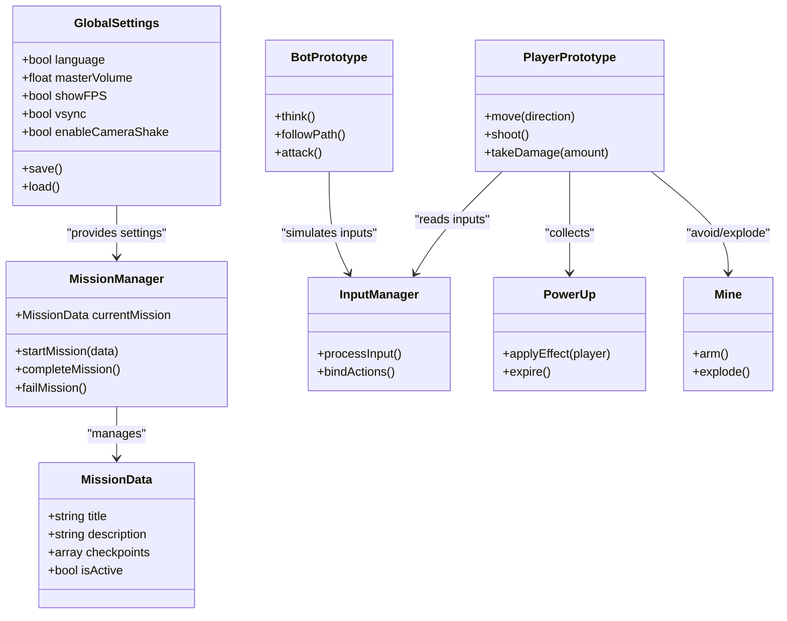
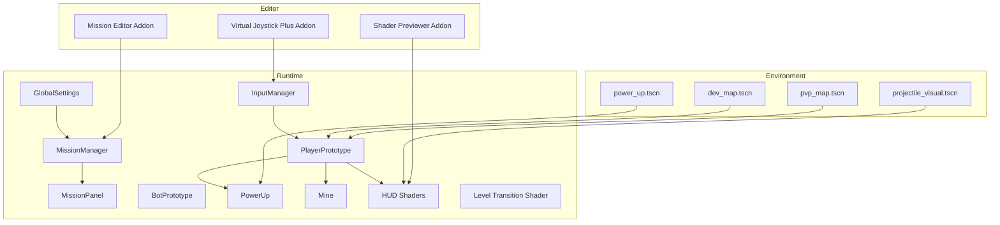
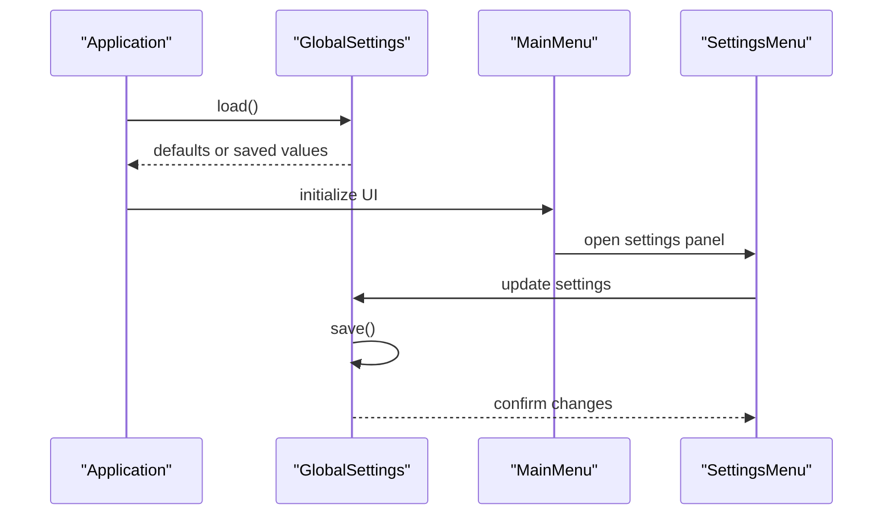
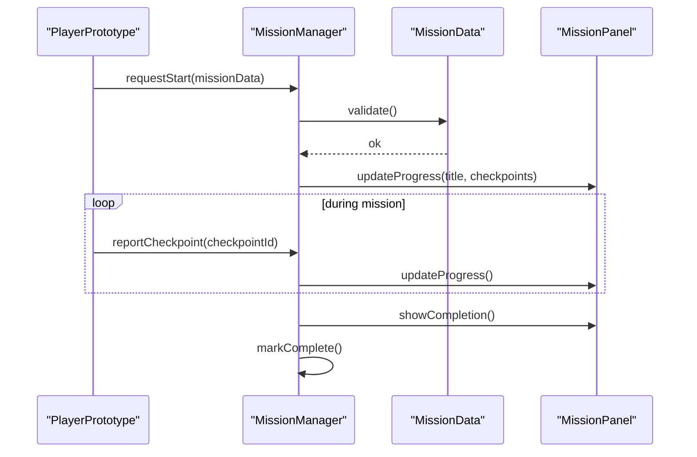
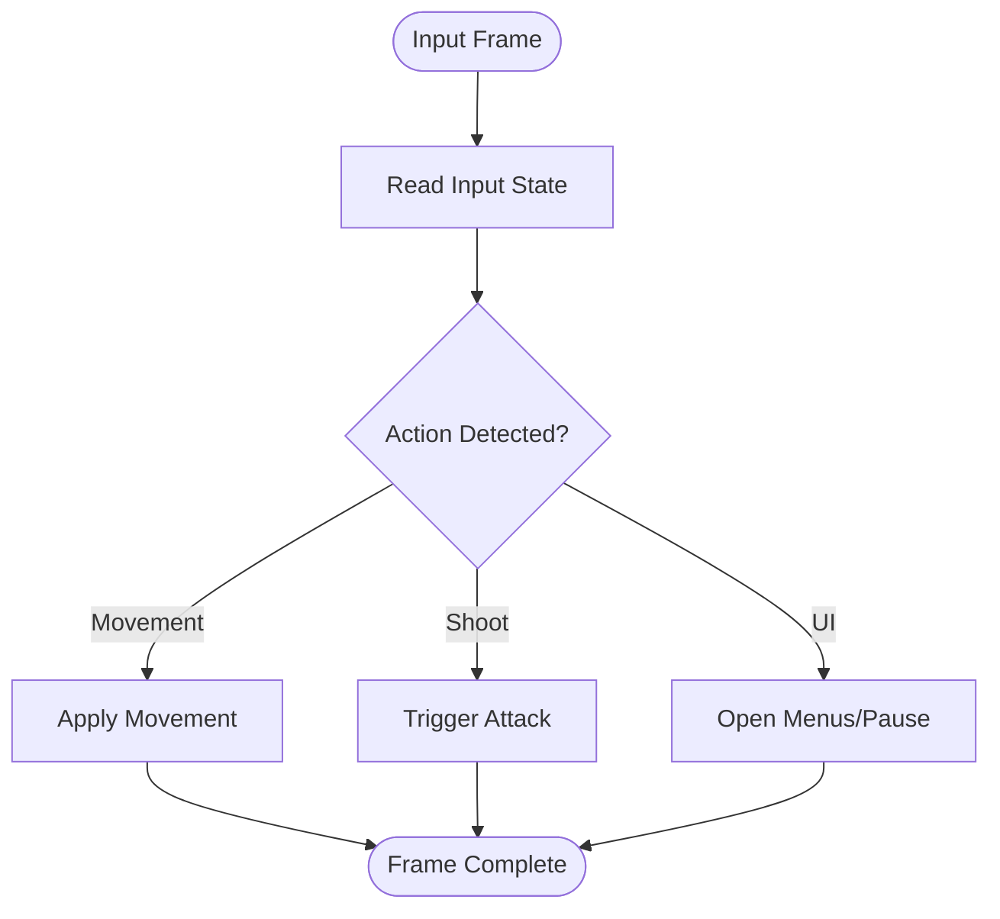
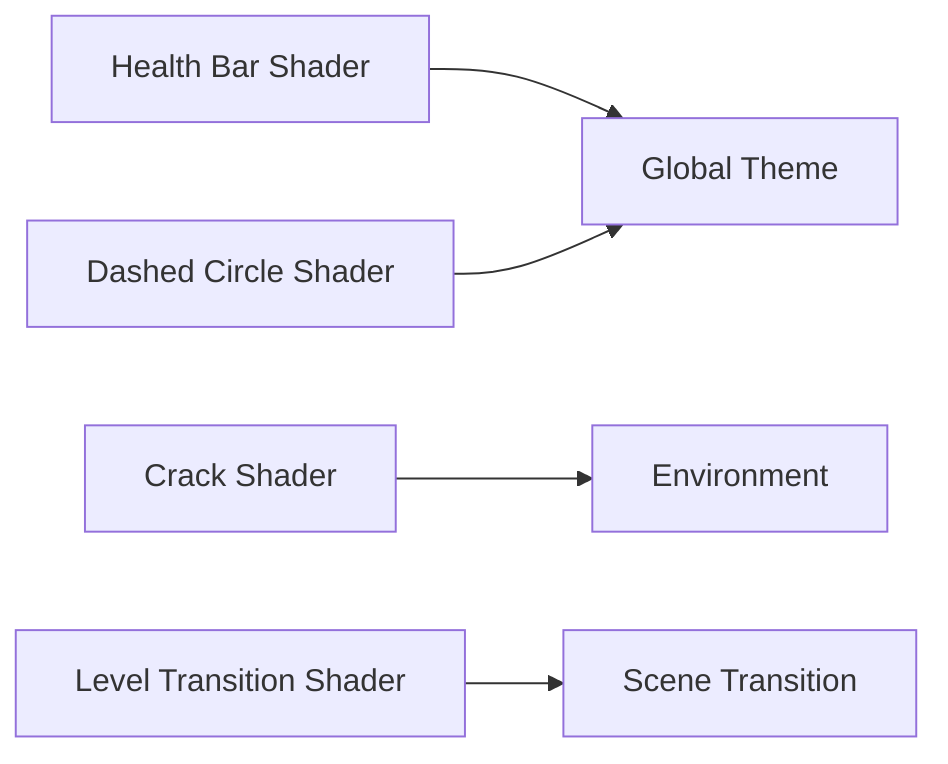
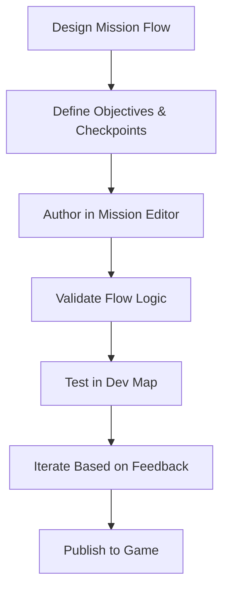
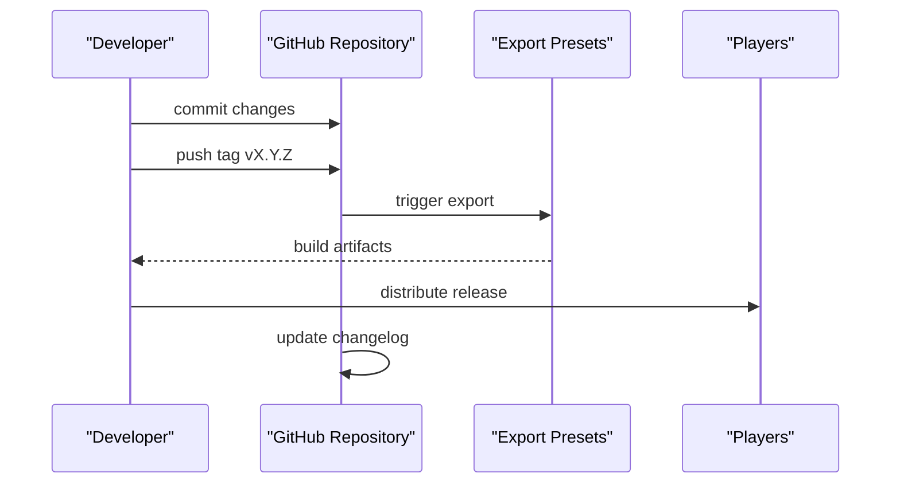
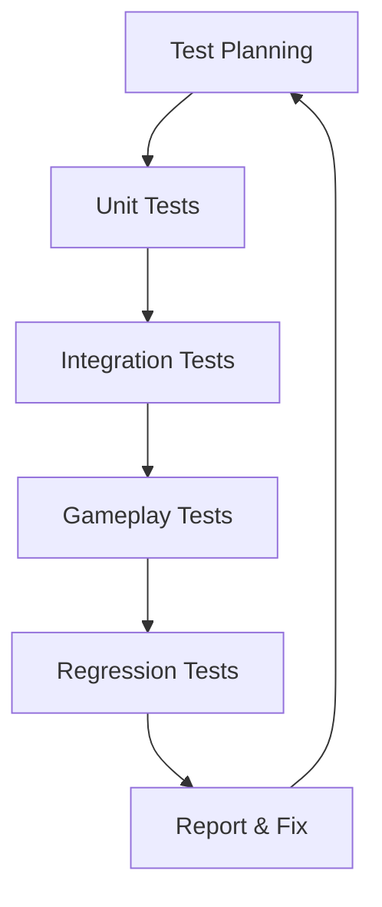

# Development Guidelines and AI Assistant Rules

<cite>
**Referenced Files in This Document**
- [README.md](file://README.md)
- [CHANGELOG.md](file://CHANGELOG.md)
- [.continue/rules/godotrule.md](file://.continue/rules/godotrule.md)
- [creazionemissioni.md](file://creazionemissioni.md)
- [guida_release_github.md](file://guida_release_github.md)
- [addons/mission_editor/GUIDA.md](file://addons/mission_editor/GUIDA.md)
- [export_presets.cfg](file://export_presets.cfg)
- [project.godot](file://project.godot)
- [Scripts/global_settings.gd](file://Scripts/global_settings.gd)
- [Scripts/mission_manager.gd](file://Scripts/mission_manager.gd)
- [Scripts/mission_data.gd](file://Scripts/mission_data.gd)
- [Scripts/mission_panel.gd](file://Scripts/mission_panel.gd)
- [Menu/main_menu.gd](file://Menu/main_menu.gd)
- [Menu/settings_menu.gd](file://Menu/settings_menu.gd)
- [Menu/pause_menu.gd](file://Menu/pause_menu.gd)
- [Menu/lobby.gd](file://Menu/lobby.gd)
- [Menu/multiplayer_menu.gd](file://Menu/multiplayer_menu.gd)
- [Game/input_manager.gd](file://Game/input_manager.gd)
- [Scripts/player_prototype.gd](file://Scripts/player_prototype.gd)
- [Scripts/bot_prototype.gd](file://Scripts/bot_prototype.gd)
- [Scripts/power_up.gd](file://Scripts/power_up.gd)
- [Scripts/mina.gd](file://Scripts/mina.gd)
- [Maps/dev_map.tscn](file://Maps/dev_map.tscn)
- [Maps/pvp_map.tscn](file://Maps/pvp_map.tscn)
- [Scenes/power_up.tscn](file://Scenes/power_up.tscn)
- [Scenes/projectile_visual.tscn](file://Scenes/projectile_visual.tscn)
- [Shaders/HUD/health_bar.gdshader](file://Shaders/HUD/health_bar.gdshader)
- [Shaders/crack_shader.gdshader](file://Shaders/crack_shader.gdshader)
- [Shaders/dashed_circle.gdshader](file://Shaders/dashed_circle.gdshader)
- [Shaders/level_transition.gdshader](file://Shaders/level_transition.gdshader)
- [addons/mission_editor/plugin.cfg](file://addons/mission_editor/plugin.cfg)
- [addons/shader-previewer/plugin.cfg](file://addons/shader-previewer/plugin.cfg)
- [addons/virtual_joystick_plus/plugin.cfg](file://addons/virtual_joystick_plus/plugin.cfg)
</cite>

## Table of Contents
1. [Introduction](#introduction)
2. [Project Structure](#project-structure)
3. [Core Components](#core-components)
4. [Architecture Overview](#architecture-overview)
5. [Detailed Component Analysis](#detailed-component-analysis)
6. [AI Assistant Rules and Coding Standards](#ai-assistant-rules-and-coding-standards)
7. [Mission Creation Processes](#mission-creation-processes)
8. [Release Procedures](#release-procedures)
9. [Development Workflows and Quality Assurance](#development-workflows-and-quality-assurance)
10. [Testing Methodologies](#testing-methodologies)
11. [Deployment Strategies](#deployment-strategies)
12. [Contributing Guidelines](#contributing-guidelines)
13. [Troubleshooting Guide](#troubleshooting-guide)
14. [Conclusion](#conclusion)

## Introduction
This document provides comprehensive development guidelines for TFA Agents, focusing on AI assistant collaboration rules, mission creation best practices, and GitHub release procedures. It consolidates existing project documentation and establishes standardized workflows for coding, testing, QA, and deployment. The guidelines are designed to improve team collaboration, maintain code quality, and streamline releases.

## Project Structure
The project follows a Godot-centric organization with clear separation of assets, scenes, scripts, menus, and editor plugins. Key areas include:
- Assets: textures, audio, animations, and materials
- Scenes: tilesets, power-ups, projectiles, ramps
- Scripts: game logic, missions, HUD, input, and utilities
- Menus: main menu, settings, pause, lobby, multiplayer
- Addons: mission editor, shader previewer, virtual joystick
- Export presets and project configuration for builds

```mermaid
graph TB
subgraph "Project Root"
P["project.godot"]
EP["export_presets.cfg"]
end
subgraph "Assets"
A1["Textures & Animations"]
A2["Audio & Music"]
A3["Materials & Shaders"]
end
subgraph "Scenes"
S1["Maps"]
S2["Power-ups"]
S3["Projectiles"]
S4["Ramps"]
end
subgraph "Scripts"
G1["Game Logic"]
M1["Missions"]
H1["HUD & UI"]
I1["Input & Controls"]
U1["Utilities"]
end
subgraph "Menus"
MU1["Main Menu"]
MU2["Settings"]
MU3["Pause"]
MU4["Lobby"]
MU5["Multiplayer"]
end
subgraph "Addons"
AD1["Mission Editor"]
AD2["Shader Previewer"]
AD3["Virtual Joystick Plus"]
end
P --> A1
P --> A2
P --> A3
P --> S1
P --> S2
P --> S3
P --> S4
P --> G1
P --> M1
P --> H1
P --> I1
P --> U1
P --> MU1
P --> MU2
P --> MU3
P --> MU4
P --> MU5
P --> AD1
P --> AD2
P --> AD3
```

**Section sources**
- [project.godot](file://project.godot)
- [export_presets.cfg](file://export_presets.cfg)

## Core Components
Key runtime components include:
- Global settings singleton for persistent configuration
- Mission manager and data structures for unified mission handling
- HUD and UI systems for progress, minimap, and panels
- Input manager for player controls
- Player and bot prototypes for AI agents
- Power-up and mine mechanics
- Shader-based visual effects for HUD and environment

**Diagram sources**
- [Scripts/global_settings.gd](file://Scripts/global_settings.gd)
- [Scripts/mission_manager.gd](file://Scripts/mission_manager.gd)
- [Scripts/mission_data.gd](file://Scripts/mission_data.gd)
- [Game/input_manager.gd](file://Game/input_manager.gd)
- [Scripts/player_prototype.gd](file://Scripts/player_prototype.gd)
- [Scripts/bot_prototype.gd](file://Scripts/bot_prototype.gd)
- [Scripts/power_up.gd](file://Scripts/power_up.gd)
- [Scripts/mina.gd](file://Scripts/mina.gd)

**Section sources**
- [Scripts/global_settings.gd](file://Scripts/global_settings.gd)
- [Scripts/mission_manager.gd](file://Scripts/mission_manager.gd)
- [Scripts/mission_data.gd](file://Scripts/mission_data.gd)
- [Scripts/mission_panel.gd](file://Scripts/mission_panel.gd)
- [Game/input_manager.gd](file://Game/input_manager.gd)
- [Scripts/player_prototype.gd](file://Scripts/player_prototype.gd)
- [Scripts/bot_prototype.gd](file://Scripts/bot_prototype.gd)
- [Scripts/power_up.gd](file://Scripts/power_up.gd)
- [Scripts/mina.gd](file://Scripts/mina.gd)

## Architecture Overview
The system architecture integrates modular scripts, scene-based environments, and editor plugins. The mission system centralizes gameplay logic, while menus provide user interaction and settings persistence. Shaders enhance visual fidelity for HUD and transitions.

**Diagram sources**
- [Scripts/global_settings.gd](file://Scripts/global_settings.gd)
- [Scripts/mission_manager.gd](file://Scripts/mission_manager.gd)
- [Scripts/mission_panel.gd](file://Scripts/mission_panel.gd)
- [Game/input_manager.gd](file://Game/input_manager.gd)
- [Scripts/player_prototype.gd](file://Scripts/player_prototype.gd)
- [Scripts/bot_prototype.gd](file://Scripts/bot_prototype.gd)
- [Scripts/power_up.gd](file://Scripts/power_up.gd)
- [Scripts/mina.gd](file://Scripts/mina.gd)
- [Shaders/HUD/health_bar.gdshader](file://Shaders/HUD/health_bar.gdshader)
- [Shaders/level_transition.gdshader](file://Shaders/level_transition.gdshader)
- [Maps/dev_map.tscn](file://Maps/dev_map.tscn)
- [Maps/pvp_map.tscn](file://Maps/pvp_map.tscn)
- [Scenes/power_up.tscn](file://Scenes/power_up.tscn)
- [Scenes/projectile_visual.tscn](file://Scenes/projectile_visual.tscn)
- [addons/mission_editor/plugin.cfg](file://addons/mission_editor/plugin.cfg)
- [addons/shader-previewer/plugin.cfg](file://addons/shader-previewer/plugin.cfg)
- [addons/virtual_joystick_plus/plugin.cfg](file://addons/virtual_joystick_plus/plugin.cfg)

## Detailed Component Analysis

### Global Settings and Persistence
Global settings manage persistent configuration such as language, volume, FPS, VSync, UI scale, and camera shake. They integrate with menus and the main application lifecycle.

**Diagram sources**
- [Scripts/global_settings.gd](file://Scripts/global_settings.gd)
- [Menu/main_menu.gd](file://Menu/main_menu.gd)
- [Menu/settings_menu.gd](file://Menu/settings_menu.gd)

**Section sources**
- [Scripts/global_settings.gd](file://Scripts/global_settings.gd)
- [Menu/main_menu.gd](file://Menu/main_menu.gd)
- [Menu/settings_menu.gd](file://Menu/settings_menu.gd)

### Mission System
The mission system provides a unified framework for creating, managing, and displaying missions. It includes data structures, a manager, and UI panels.

**Diagram sources**
- [Scripts/mission_manager.gd](file://Scripts/mission_manager.gd)
- [Scripts/mission_data.gd](file://Scripts/mission_data.gd)
- [Scripts/mission_panel.gd](file://Scripts/mission_panel.gd)

**Section sources**
- [Scripts/mission_manager.gd](file://Scripts/mission_manager.gd)
- [Scripts/mission_data.gd](file://Scripts/mission_data.gd)
- [Scripts/mission_panel.gd](file://Scripts/mission_panel.gd)

### Input and Controls
The input manager binds actions and translates them into player and bot behaviors. It supports both human and AI-driven control.

**Diagram sources**
- [Game/input_manager.gd](file://Game/input_manager.gd)
- [Scripts/player_prototype.gd](file://Scripts/player_prototype.gd)
- [Scripts/bot_prototype.gd](file://Scripts/bot_prototype.gd)

**Section sources**
- [Game/input_manager.gd](file://Game/input_manager.gd)
- [Scripts/player_prototype.gd](file://Scripts/player_prototype.gd)
- [Scripts/bot_prototype.gd](file://Scripts/bot_prototype.gd)

### Visual Effects and Shaders
Shaders enhance HUD elements and environmental transitions. They are integrated via theme resources and material overrides.

**Diagram sources**
- [Shaders/HUD/health_bar.gdshader](file://Shaders/HUD/health_bar.gdshader)
- [Shaders/dashed_circle.gdshader](file://Shaders/dashed_circle.gdshader)
- [Shaders/crack_shader.gdshader](file://Shaders/crack_shader.gdshader)
- [Shaders/level_transition.gdshader](file://Shaders/level_transition.gdshader)

**Section sources**
- [Shaders/HUD/health_bar.gdshader](file://Shaders/HUD/health_bar.gdshader)
- [Shaders/dashed_circle.gdshader](file://Shaders/dashed_circle.gdshader)
- [Shaders/crack_shader.gdshader](file://Shaders/crack_shader.gdshader)
- [Shaders/level_transition.gdshader](file://Shaders/level_transition.gdshader)

## AI Assistant Rules and Coding Standards
AI assistants should adhere to the following rules when collaborating on TFA Agents:
- Respect project structure: place new scripts under Scripts/, scenes under Scenes/, and assets under Assets/.
- Follow Godot conventions: use PascalCase for classes, snake_case for variables, and meaningful function names.
- Keep scripts modular: encapsulate logic into reusable classes and single-responsibility functions.
- Maintain backward compatibility: avoid breaking changes to public APIs without updating documentation.
- Use versioned changelog entries: document changes in CHANGELOG.md with clear summaries.
- Leverage existing singletons: use GlobalSettings for persistent configuration and shared state.
- Utilize editor addons: integrate with mission editor, shader previewer, and virtual joystick plus for enhanced workflows.
- Reference existing patterns: mirror input handling, HUD updates, and mission progression logic from established scripts.

**Section sources**
- [Scripts/global_settings.gd](file://Scripts/global_settings.gd)
- [addons/mission_editor/plugin.cfg](file://addons/mission_editor/plugin.cfg)
- [addons/shader-previewer/plugin.cfg](file://addons/shader-previewer/plugin.cfg)
- [addons/virtual_joystick_plus/plugin.cfg](file://addons/virtual_joystick_plus/plugin.cfg)
- [CHANGELOG.md](file://CHANGELOG.md)

## Mission Creation Processes
Mission creation involves designing flow sequences, checkpoints, and objectives. The mission editor addon provides an authoring environment, while the mission manager handles runtime execution.

**Diagram sources**
- [addons/mission_editor/GUIDA.md](file://addons/mission_editor/GUIDA.md)
- [creazionemissioni.md](file://creazionemissioni.md)
- [Maps/dev_map.tscn](file://Maps/dev_map.tscn)
- [Scripts/mission_manager.gd](file://Scripts/mission_manager.gd)

**Section sources**
- [addons/mission_editor/GUIDA.md](file://addons/mission_editor/GUIDA.md)
- [creazionemissioni.md](file://creazionemissioni.md)
- [Scripts/mission_manager.gd](file://Scripts/mission_manager.gd)
- [Maps/dev_map.tscn](file://Maps/dev_map.tscn)

## Release Procedures
Releases are coordinated through GitHub with automated changelog synchronization and export presets for distribution.

**Diagram sources**
- [guida_release_github.md](file://guida_release_github.md)
- [export_presets.cfg](file://export_presets.cfg)
- [CHANGELOG.md](file://CHANGELOG.md)

**Section sources**
- [guida_release_github.md](file://guida_release_github.md)
- [export_presets.cfg](file://export_presets.cfg)
- [CHANGELOG.md](file://CHANGELOG.md)

## Development Workflows and Quality Assurance
Recommended workflows:
- Feature branching: create feature branches from develop, merge via pull requests with review.
- Continuous integration: run automated tests and lint checks before merging.
- Versioning: increment semantic versions in preparation for releases.
- Documentation: keep README.md and internal docs aligned with code changes.
- Asset management: organize assets by category and version them appropriately.

Quality assurance practices:
- Unit testing: validate individual script behaviors (e.g., input handling, mission progression).
- Integration testing: test mission flows and HUD updates.
- Regression testing: verify menu navigation, settings persistence, and shader rendering.
- Accessibility: ensure UI scaling and language settings work across locales.

**Section sources**
- [README.md](file://README.md)
- [CHANGELOG.md](file://CHANGELOG.md)

## Testing Methodologies
Testing approaches:
- Script-level tests: verify GlobalSettings persistence, InputManager action mapping, and MissionManager state transitions.
- Scene-level tests: validate HUD updates, minimap rendering, and shader overlays.
- Gameplay tests: confirm player movement, bot AI behavior, power-up collection, and mine interactions.
- Multiplayer tests: simulate lobby and multiplayer menus under various network conditions.

[No sources needed since this diagram shows conceptual workflow, not actual code structure]

## Deployment Strategies
Deployment strategies:
- Export presets: configure platform-specific exports in export_presets.cfg.
- CI/CD: automate export and release packaging on tagged commits.
- Distribution channels: publish releases to GitHub and platform stores.
- Post-release monitoring: track changelog visibility and user feedback.

**Section sources**
- [export_presets.cfg](file://export_presets.cfg)
- [guida_release_github.md](file://guida_release_github.md)

## Contributing Guidelines
Guidelines for contributors:
- Fork and branch: create feature branches for changes.
- Commit messages: use clear, descriptive messages aligned with changelog entries.
- Pull requests: include summary, testing notes, and changelog updates.
- Code review: address reviewer feedback promptly and re-run tests.
- Documentation: update relevant docs and examples.

**Section sources**
- [README.md](file://README.md)
- [CHANGELOG.md](file://CHANGELOG.md)

## Troubleshooting Guide
Common issues and resolutions:
- Settings not persisting: verify GlobalSettings.save/load paths and permissions.
- Mission not starting: check MissionManager initialization and MissionData validity.
- HUD not updating: confirm MissionPanel connections and shader material assignments.
- Input not responding: validate InputManager bindings and action mappings.
- Shader rendering errors: ensure shader resources are properly imported and referenced.

**Section sources**
- [Scripts/global_settings.gd](file://Scripts/global_settings.gd)
- [Scripts/mission_manager.gd](file://Scripts/mission_manager.gd)
- [Scripts/mission_panel.gd](file://Scripts/mission_panel.gd)
- [Game/input_manager.gd](file://Game/input_manager.gd)
- [Shaders/HUD/health_bar.gdshader](file://Shaders/HUD/health_bar.gdshader)

## Conclusion
These guidelines establish a consistent foundation for developing TFA Agents with AI collaboration, robust mission creation, and streamlined releases. By adhering to structured workflows, coding standards, and QA practices, teams can maintain quality and accelerate delivery.