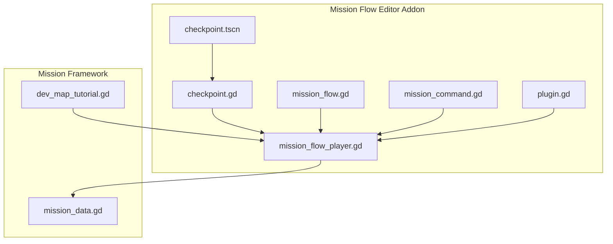
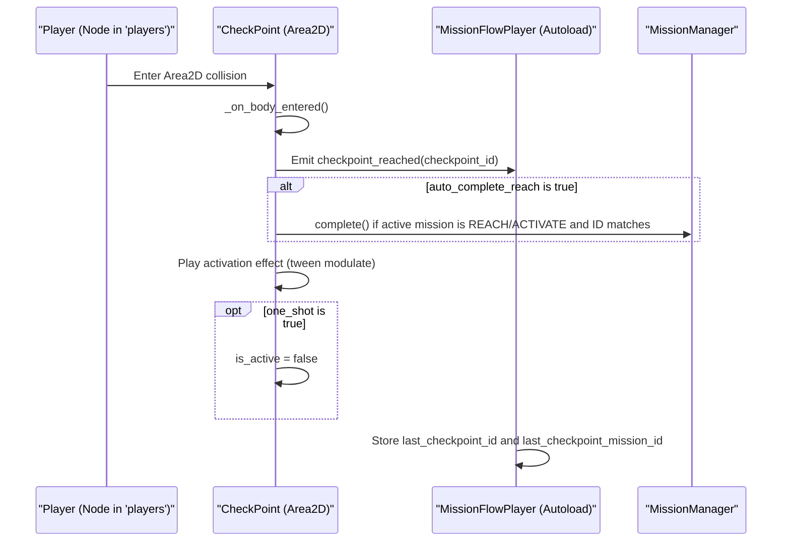
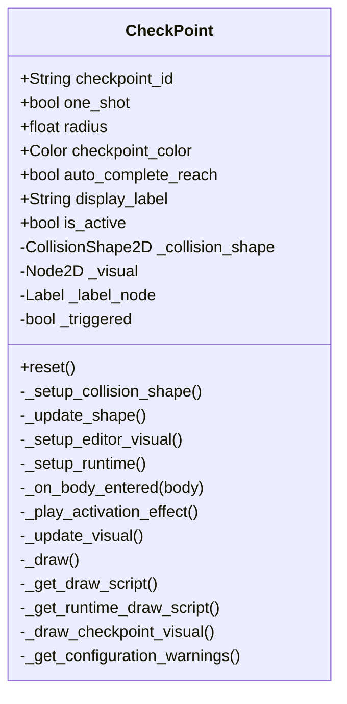
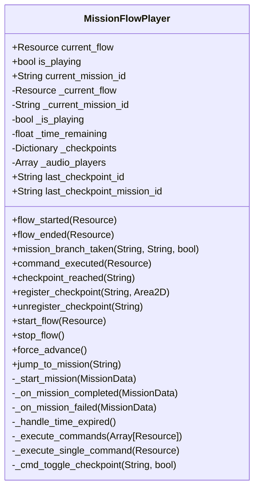
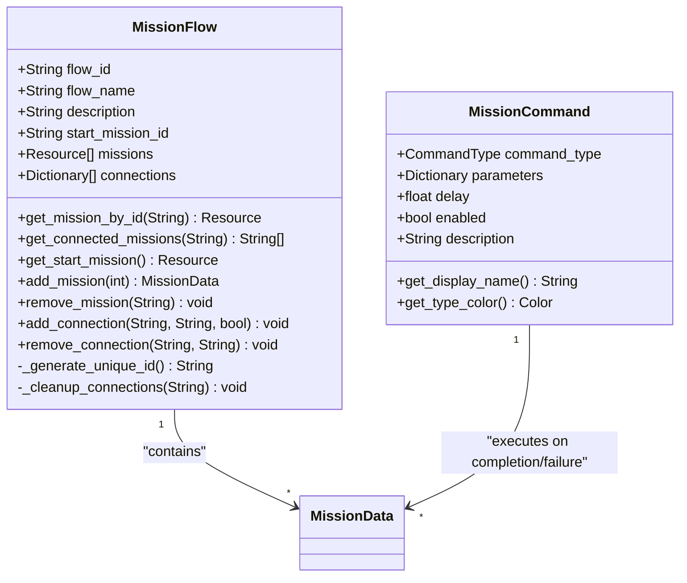
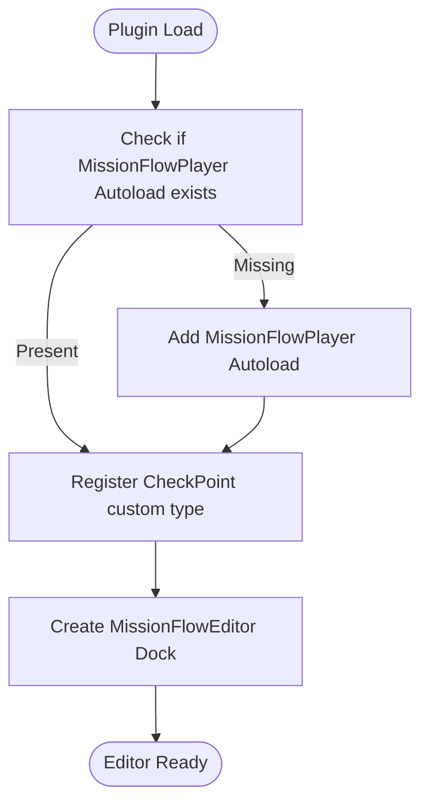
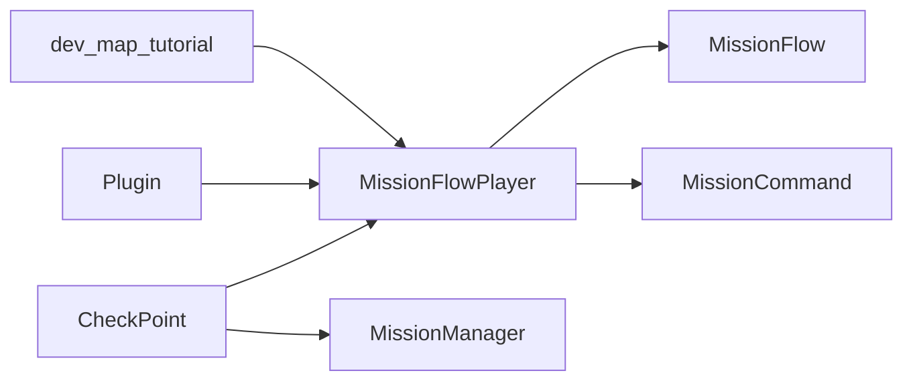

# Checkpoint System

<cite>
**Referenced Files in This Document**
- [checkpoint.gd](file://addons/mission_editor/checkpoint.gd)
- [checkpoint.tscn](file://addons/mission_editor/checkpoint.tscn)
- [mission_flow_player.gd](file://addons/mission_editor/mission_flow_player.gd)
- [mission_flow.gd](file://addons/mission_editor/mission_flow.gd)
- [mission_command.gd](file://addons/mission_editor/mission_command.gd)
- [plugin.gd](file://addons/mission_editor/plugin.gd)
- [mission_data.gd](file://Scripts/mission_data.gd)
- [dev_map_tutorial.gd](file://Scripts/dev_map_tutorial.gd)
</cite>

## Table of Contents
1. [Introduction](#introduction)
2. [Project Structure](#project-structure)
3. [Core Components](#core-components)
4. [Architecture Overview](#architecture-overview)
5. [Detailed Component Analysis](#detailed-component-analysis)
6. [Dependency Analysis](#dependency-analysis)
7. [Performance Considerations](#performance-considerations)
8. [Troubleshooting Guide](#troubleshooting-guide)
9. [Conclusion](#conclusion)
10. [Appendices](#appendices)

## Introduction
This document explains the checkpoint management system used by the Mission Flow Editor addon. It covers how checkpoints are placed and configured in scenes, how they detect collisions with the player, how they trigger mission completion for REACH and ACTIVATE objectives, and how they integrate with the Mission Flow Player to persist state across restarts. It also documents visual indicators, optional labels, and the reset mechanism. Examples of different checkpoint types and activation conditions are included, along with integration tips for mission objectives and troubleshooting guidance.

## Project Structure
The checkpoint system spans several files within the Mission Flow Editor addon and integrates with the broader mission framework:
- Checkpoint entity definition and behavior
- Runtime registration and state management
- Mission flow orchestration and branching
- Command system enabling/disabling checkpoints
- Editor plugin integration and scene template

**Diagram sources**
- [checkpoint.gd:1-231](file://addons/mission_editor/checkpoint.gd#L1-L231)
- [checkpoint.tscn:1-96](file://addons/mission_editor/checkpoint.tscn#L1-L96)
- [mission_flow_player.gd:1-379](file://addons/mission_editor/mission_flow_player.gd#L1-L379)
- [mission_flow.gd:1-134](file://addons/mission_editor/mission_flow.gd#L1-L134)
- [mission_command.gd:1-98](file://addons/mission_editor/mission_command.gd#L1-L98)
- [plugin.gd:1-109](file://addons/mission_editor/plugin.gd#L1-L109)
- [mission_data.gd:1-66](file://Scripts/mission_data.gd#L1-L66)
- [dev_map_tutorial.gd:1-260](file://Scripts/dev_map_tutorial.gd#L1-L260)

**Section sources**
- [checkpoint.gd:1-231](file://addons/mission_editor/checkpoint.gd#L1-L231)
- [mission_flow_player.gd:1-379](file://addons/mission_editor/mission_flow_player.gd#L1-L379)
- [mission_flow.gd:1-134](file://addons/mission_editor/mission_flow.gd#L1-L134)
- [mission_command.gd:1-98](file://addons/mission_editor/mission_command.gd#L1-L98)
- [plugin.gd:1-109](file://addons/mission_editor/plugin.gd#L1-L109)
- [mission_data.gd:1-66](file://Scripts/mission_data.gd#L1-L66)
- [dev_map_tutorial.gd:1-260](file://Scripts/dev_map_tutorial.gd#L1-L260)

## Core Components
- CheckPoint (Area2D): A placeable entity that defines a circular collision area, visual indicator, optional label, and activation behavior. It registers itself with the Mission Flow Player and emits a signal when the player enters its area.
- MissionFlowPlayer: An Autoload that orchestrates mission flows, tracks checkpoints, persists last checkpoint state, and executes commands including enabling/disabling checkpoints.
- MissionFlow: A savable resource representing a mission graph with explicit connections and start mission selection.
- MissionCommand: A resource describing executable actions triggered on mission completion or failure, including enabling/disabling checkpoints by ID.
- Plugin: Registers the CheckPoint custom node type, adds MissionFlowPlayer as an Autoload, and manages the editor dock.

Key behaviors:
- Collision detection via a CircleShape2D child node.
- Activation triggers when a node in the "players" group enters the area.
- Optional auto-completion of REACH/ACTIVATE missions when the checkpoint ID matches the active mission.
- Visual feedback via a runtime draw script and optional label.
- Persistence of last checkpoint ID to resume flows after restart.

**Section sources**
- [checkpoint.gd:1-231](file://addons/mission_editor/checkpoint.gd#L1-L231)
- [mission_flow_player.gd:1-379](file://addons/mission_editor/mission_flow_player.gd#L1-L379)
- [mission_flow.gd:1-134](file://addons/mission_editor/mission_flow.gd#L1-L134)
- [mission_command.gd:1-98](file://addons/mission_editor/mission_command.gd#L1-L98)
- [plugin.gd:1-109](file://addons/mission_editor/plugin.gd#L1-L109)

## Architecture Overview
The checkpoint system integrates collision detection, mission state, and flow orchestration:

**Diagram sources**
- [checkpoint.gd:114-150](file://addons/mission_editor/checkpoint.gd#L114-L150)
- [mission_flow_player.gd:60-64](file://addons/mission_editor/mission_flow_player.gd#L60-L64)

## Detailed Component Analysis

### CheckPoint Component
The CheckPoint extends Area2D and encapsulates:
- Unique identifier and activation controls
- Collision shape configuration and update
- Editor and runtime visuals
- Player collision handling and mission auto-completion
- Optional label rendering
- Reset functionality

**Diagram sources**
- [checkpoint.gd:1-231](file://addons/mission_editor/checkpoint.gd#L1-L231)

Behavior highlights:
- Collision shape creation and updates are handled automatically.
- Editor mode draws a circle and ID label; runtime mode draws a semi-transparent ring.
- On player entry, emits a signal to MissionFlowPlayer and optionally completes active REACH/ACTIVATE missions.
- Supports one-shot deactivation and manual reset.

**Section sources**
- [checkpoint.gd:44-169](file://addons/mission_editor/checkpoint.gd#L44-L169)
- [checkpoint.gd:114-150](file://addons/mission_editor/checkpoint.gd#L114-L150)
- [checkpoint.gd:171-231](file://addons/mission_editor/checkpoint.gd#L171-L231)

### MissionFlowPlayer Integration
MissionFlowPlayer maintains:
- Current flow and mission state
- Registered checkpoints by ID
- Last checkpoint ID and mission ID for persistence
- Execution of commands including enabling/disabling checkpoints

**Diagram sources**
- [mission_flow_player.gd:1-379](file://addons/mission_editor/mission_flow_player.gd#L1-L379)

Operational flow:
- Registers checkpoints during CheckPoint._ready().
- Stores last checkpoint ID and mission ID upon checkpoint_reached.
- Provides command execution to enable/disable checkpoints by ID.

**Section sources**
- [mission_flow_player.gd:133-141](file://addons/mission_editor/mission_flow_player.gd#L133-L141)
- [mission_flow_player.gd:60-64](file://addons/mission_editor/mission_flow_player.gd#L60-L64)
- [mission_flow_player.gd:268-267](file://addons/mission_editor/mission_flow_player.gd#L268-L267)

### Mission Flow and Commands
- MissionFlow: Defines a graph of missions, start mission, and explicit connections.
- MissionCommand: Describes actions executed on mission completion/failure, including enabling/disabling checkpoints by ID.

**Diagram sources**
- [mission_flow.gd:1-134](file://addons/mission_editor/mission_flow.gd#L1-L134)
- [mission_command.gd:1-98](file://addons/mission_editor/mission_command.gd#L1-L98)

**Section sources**
- [mission_flow.gd:28-55](file://addons/mission_editor/mission_flow.gd#L28-L55)
- [mission_command.gd:8-42](file://addons/mission_editor/mission_command.gd#L8-L42)

### Editor Plugin Integration
The plugin registers the CheckPoint custom node type, ensures MissionFlowPlayer is available as an Autoload, and manages the editor dock.

**Diagram sources**
- [plugin.gd:15-48](file://addons/mission_editor/plugin.gd#L15-L48)

**Section sources**
- [plugin.gd:15-48](file://addons/mission_editor/plugin.gd#L15-L48)

### Checkpoint Positioning and Visual Indicators
- Positioning: Place the CheckPoint node in the scene at desired coordinates; its CollisionShape2D is managed automatically.
- Visual indicators:
  - Editor: Draws a circle and ID label.
  - Runtime: Draws a semi-transparent ring via a dynamic draw script.
- Optional label: A Label node positioned above the checkpoint can display contextual text.

**Section sources**
- [checkpoint.gd:53-72](file://addons/mission_editor/checkpoint.gd#L53-L72)
- [checkpoint.gd:74-111](file://addons/mission_editor/checkpoint.gd#L74-L111)
- [checkpoint.gd:171-179](file://addons/mission_editor/checkpoint.gd#L171-L179)
- [checkpoint.gd:198-216](file://addons/mission_editor/checkpoint.gd#L198-L216)

### Audio Feedback Systems
While the CheckPoint itself does not play sounds, MissionFlowPlayer supports audio playback via MissionCommand. You can trigger sounds on mission events or checkpoint activation by adding a PLAY_SOUND command to a mission’s on_complete_commands or on_fail_commands.

**Section sources**
- [mission_flow_player.gd:269-287](file://addons/mission_editor/mission_flow_player.gd#L269-L287)
- [mission_command.gd:26-35](file://addons/mission_editor/mission_command.gd#L26-L35)

### Integration with Mission Objectives
- REACH missions: Auto-complete when the player enters a checkpoint whose ID matches the mission’s ID or label.
- ACTIVATE missions: Similar matching logic applies for activation-type objectives.
- Tutorial integration: The tutorial script demonstrates hiding a checkpoint until the appropriate step and toggling visibility based on the current mission.

**Section sources**
- [checkpoint.gd:130-144](file://addons/mission_editor/checkpoint.gd#L130-L144)
- [mission_data.gd:7-15](file://Scripts/mission_data.gd#L7-L15)
- [dev_map_tutorial.gd:55-59](file://Scripts/dev_map_tutorial.gd#L55-L59)
- [dev_map_tutorial.gd:152-154](file://Scripts/dev_map_tutorial.gd#L152-L154)

## Dependency Analysis
The system exhibits clear separation of concerns:
- CheckPoint depends on MissionFlowPlayer signals and MissionManager for auto-completion.
- MissionFlowPlayer depends on MissionManager for mission lifecycle and on MissionCommand for action execution.
- MissionFlow provides structure for mission sequencing and branching.
- Plugin integrates editor-time and runtime behavior.

**Diagram sources**
- [checkpoint.gd:86-90](file://addons/mission_editor/checkpoint.gd#L86-L90)
- [mission_flow_player.gd:53-59](file://addons/mission_editor/mission_flow_player.gd#L53-L59)
- [mission_flow_player.gd:228-267](file://addons/mission_editor/mission_flow_player.gd#L228-L267)
- [plugin.gd:15-27](file://addons/mission_editor/plugin.gd#L15-L27)
- [dev_map_tutorial.gd:63-67](file://Scripts/dev_map_tutorial.gd#L63-L67)

**Section sources**
- [checkpoint.gd:86-90](file://addons/mission_editor/checkpoint.gd#L86-L90)
- [mission_flow_player.gd:53-59](file://addons/mission_editor/mission_flow_player.gd#L53-L59)
- [mission_flow_player.gd:228-267](file://addons/mission_editor/mission_flow_player.gd#L228-L267)
- [plugin.gd:15-27](file://addons/mission_editor/plugin.gd#L15-L27)
- [dev_map_tutorial.gd:63-67](file://Scripts/dev_map_tutorial.gd#L63-L67)

## Performance Considerations
- Collision shape updates: Radius changes trigger shape recreation; keep radius changes infrequent during gameplay.
- One-shot behavior: Prevents repeated triggers, reducing unnecessary signal emissions.
- Visual drawing: Runtime draw script is lightweight; avoid excessive custom visuals on many checkpoints.
- Signal emission: checkpoint_reached is emitted once per activation; ensure downstream handlers are efficient.

[No sources needed since this section provides general guidance]

## Troubleshooting Guide
Common issues and resolutions:
- Checkpoint not triggering:
  - Verify the player belongs to the "players" group.
  - Confirm is_active is true and one_shot is not prematurely disabling the checkpoint.
  - Ensure the checkpoint_id is set; missing IDs produce configuration warnings.
- Auto-completion not working:
  - For REACH/ACTIVATE, ensure the active mission’s ID or label contains the checkpoint_id substring.
- Visual artifacts:
  - Editor visuals rely on dynamic scripts; ensure the node is properly initialized.
- Persistence resets unexpectedly:
  - Use the tutorial menu buttons to clear checkpoint data when restarting from the beginning.
- Enabling/disabling checkpoints via commands:
  - Use MissionCommand with CommandType ENABLE_CHECKPOINT/DISABLE_CHECKPOINT and provide the checkpoint_id parameter.

**Section sources**
- [checkpoint.gd:114-121](file://addons/mission_editor/checkpoint.gd#L114-L121)
- [checkpoint.gd:226-230](file://addons/mission_editor/checkpoint.gd#L226-L230)
- [mission_flow_player.gd:373-379](file://addons/mission_editor/mission_flow_player.gd#L373-L379)
- [mission_command.gd:33-34](file://addons/mission_editor/mission_command.gd#L33-L34)

## Conclusion
The checkpoint system provides a robust, extensible mechanism for mission-driven world markers. It combines simple collision detection with powerful flow orchestration, enabling seamless REACH/ACTIVATE mission completion, persistent state across restarts, and flexible editor integration. By leveraging MissionCommands and MissionFlow, developers can create complex scripted sequences while maintaining clarity and ease of authoring.

[No sources needed since this section summarizes without analyzing specific files]

## Appendices

### Checkpoint Types and Activation Conditions
- REACH checkpoint: Auto-completes when the player enters the area and the active mission is REACH with a matching ID or label.
- ACTIVATE checkpoint: Similar matching logic applies for ACTIVATE-type missions.
- Conditional activation: Use MissionCommand ENABLE_CHECKPOINT/DISABLE_CHECKPOINT to toggle checkpoints dynamically.

**Section sources**
- [checkpoint.gd:130-144](file://addons/mission_editor/checkpoint.gd#L130-L144)
- [mission_command.gd:17-18](file://addons/mission_editor/mission_command.gd#L17-L18)
- [mission_command.gd:33-34](file://addons/mission_editor/mission_command.gd#L33-L4)

### Example Workflows
- Tutorial checkpoint visibility: The tutorial script hides a checkpoint until the REACH step and unhides it when the mission starts.
- Restart from checkpoint: The tutorial script demonstrates clearing checkpoint data to restart from the beginning.

**Section sources**
- [dev_map_tutorial.gd:55-59](file://Scripts/dev_map_tutorial.gd#L55-L59)
- [dev_map_tutorial.gd:152-154](file://Scripts/dev_map_tutorial.gd#L152-L154)