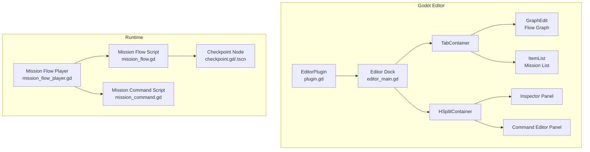
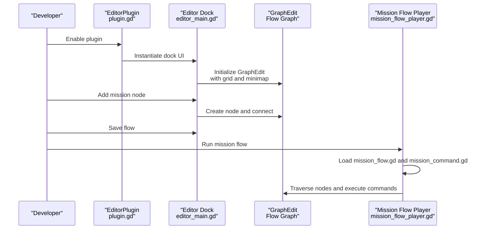
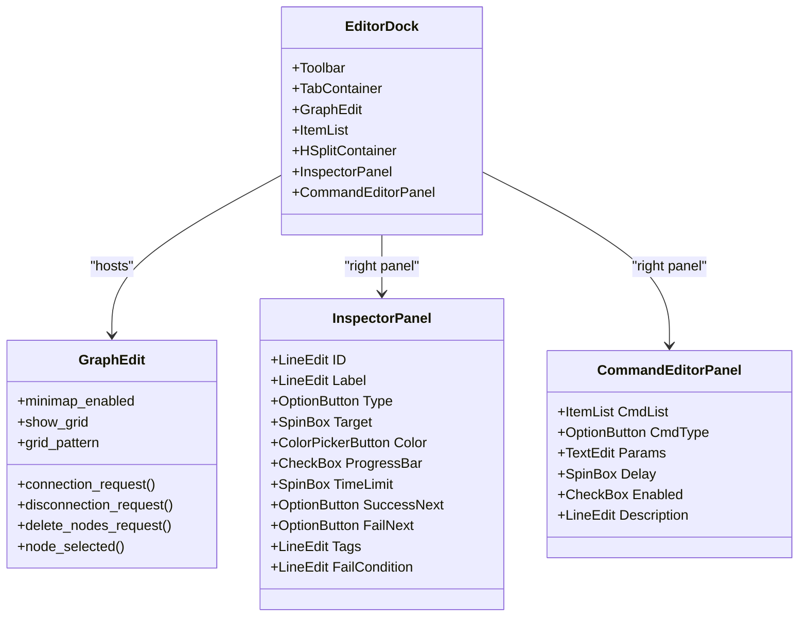
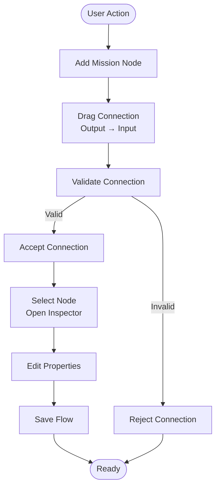
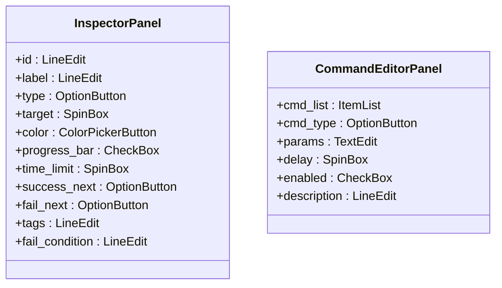
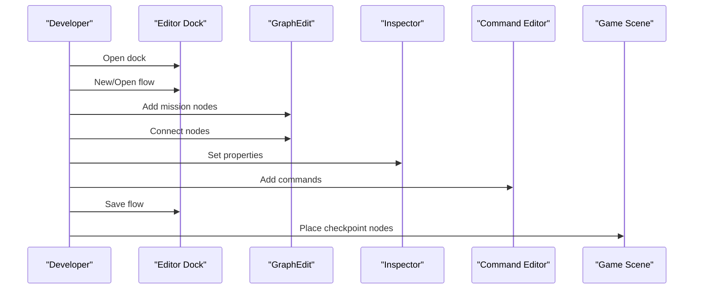
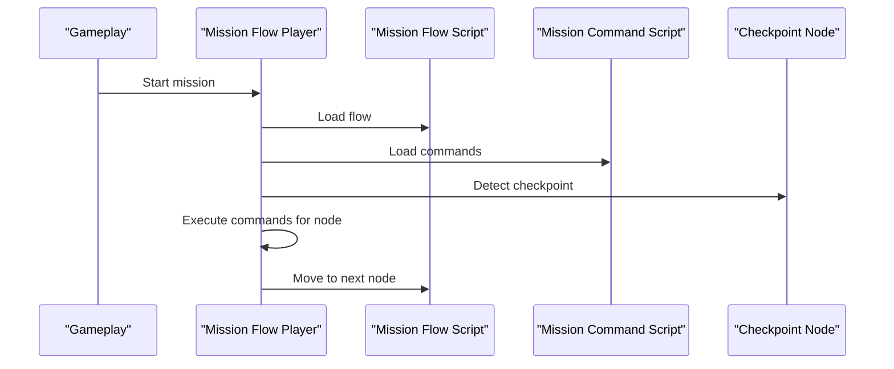
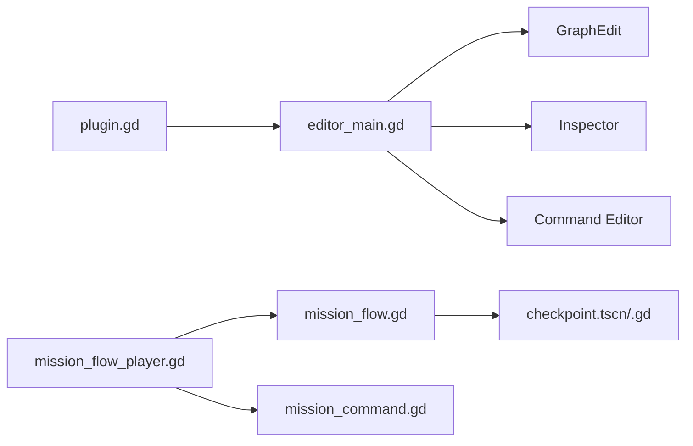

# Editor Interface and Workflow

<cite>
**Referenced Files in This Document**
- [plugin.gd](file://addons/mission_editor/plugin.gd)
- [plugin.cfg](file://addons/mission_editor/plugin.cfg)
- [editor_main.gd](file://addons/mission_editor/editor/editor_main.gd)
- [GUIDA.md](file://addons/mission_editor/GUIDA.md)
- [mission_flow.gd](file://addons/mission_editor/mission_flow.gd)
- [mission_command.gd](file://addons/mission_editor/mission_command.gd)
- [mission_flow_player.gd](file://addons/mission_editor/mission_flow_player.gd)
- [checkpoint.gd](file://addons/mission_editor/checkpoint.gd)
- [checkpoint.tscn](file://addons/mission_editor/checkpoint.tscn)
- [example_tutorial_flow.gd](file://addons/mission_editor/examples/example_tutorial_flow.gd)
- [project.godot](file://project.godot)
</cite>

## Table of Contents
1. [Introduction](#introduction)
2. [Project Structure](#project-structure)
3. [Core Components](#core-components)
4. [Architecture Overview](#architecture-overview)
5. [Detailed Component Analysis](#detailed-component-analysis)
6. [Dependency Analysis](#dependency-analysis)
7. [Performance Considerations](#performance-considerations)
8. [Troubleshooting Guide](#troubleshooting-guide)
9. [Conclusion](#conclusion)
10. [Appendices](#appendices)

## Introduction
This document describes the Mission Editor interface and workflow for the Godot-based project. It focuses on the Mission Flow Editor dock, its main window layout, toolbar functions, canvas operations, and the end-to-end mission creation workflow. It also documents drag-and-drop connections, selection mechanisms, view controls, keyboard shortcuts, mouse operations, workspace customization, and editor preferences. Step-by-step tutorials and screenshots are included to guide common editing tasks.

## Project Structure
The Mission Editor is implemented as a Godot editor plugin located under addons/mission_editor/. The plugin exposes a dock UI built in code and integrates with the editor’s plugin system. The core runtime for mission playback is provided by the mission flow player script.

Key plugin and editor files:
- Plugin bootstrap and dock registration
- Editor dock UI (toolbar, tabs, graph editor, inspector, command editor)
- Mission flow and command scripts
- Player runtime for executing flows
- Example tutorial flow for learning the system
- Checkpoint node and scene for runtime integration

**Diagram sources**
- [plugin.gd:1-20](file://addons/mission_editor/plugin.gd#L1-L20)
- [editor_main.gd:100-131](file://addons/mission_editor/editor/editor_main.gd#L100-L131)
- [mission_flow_player.gd:1-20](file://addons/mission_editor/mission_flow_player.gd#L1-L20)
- [mission_flow.gd](file://addons/mission_editor/mission_flow.gd)
- [mission_command.gd](file://addons/mission_editor/mission_command.gd)
- [checkpoint.gd](file://addons/mission_editor/checkpoint.gd)
- [checkpoint.tscn](file://addons/mission_editor/checkpoint.tscn)

**Section sources**
- [plugin.gd:1-20](file://addons/mission_editor/plugin.gd#L1-L20)
- [plugin.cfg](file://addons/mission_editor/plugin.cfg)
- [project.godot:38](file://project.godot#L38)

## Core Components
- Editor Dock: A dock UI built in code containing a toolbar, a tabbed area (Flow Graph and Mission List), and a split panel with an inspector and command editor.
- Toolbar: Provides actions to create, open, save flows, add/delete missions, and manage the current flow.
- Flow Graph: A GraphEdit-based canvas for connecting mission nodes and visualizing the flow.
- Mission List: An ItemList showing available missions for quick selection and addition.
- Inspector: Edits properties of the selected mission node (ID, label, type, target, color, progress bar toggle, time limit, success/failure next nodes, tags, failure condition).
- Command Editor: Edits per-mission commands (type, parameters, delay, enable flag, description).
- Runtime Player: Executes the mission flow during gameplay, using the mission flow and command scripts.

**Section sources**
- [editor_main.gd:133-171](file://addons/mission_editor/editor/editor_main.gd#L133-L171)
- [editor_main.gd:100-131](file://addons/mission_editor/editor/editor_main.gd#L100-L131)
- [editor_main.gd:173-240](file://addons/mission_editor/editor/editor_main.gd#L173-L240)
- [editor_main.gd:241-320](file://addons/mission_editor/editor/editor_main.gd#L241-L320)
- [mission_flow_player.gd:1-20](file://addons/mission_editor/mission_flow_player.gd#L1-L20)

## Architecture Overview
The Mission Editor integrates with the Godot editor as a plugin. The dock UI is constructed programmatically and hosts the GraphEdit canvas and auxiliary panels. The runtime player loads the mission flow and executes commands against the game world.

**Diagram sources**
- [plugin.gd:1-20](file://addons/mission_editor/plugin.gd#L1-L20)
- [editor_main.gd:100-131](file://addons/mission_editor/editor/editor_main.gd#L100-L131)
- [mission_flow_player.gd:1-20](file://addons/mission_editor/mission_flow_player.gd#L1-L20)

## Detailed Component Analysis

### Editor Dock Layout and Controls
- Toolbar buttons:
  - New: Create a new mission flow.
  - Open: Load an existing .tres flow resource.
  - Save: Persist the current flow.
  - + Mission: Add a new mission node to the graph.
  - - Del: Delete the currently selected mission.
- Tabs:
  - Flow Graph: Interactive canvas for building the mission flow.
  - Mission List: Quick-access list of missions.
- Split panel:
  - Left: Tabs container.
  - Right: Inspector and Command Editor panels stacked vertically.

**Diagram sources**
- [editor_main.gd:133-171](file://addons/mission_editor/editor/editor_main.gd#L133-L171)
- [editor_main.gd:100-131](file://addons/mission_editor/editor/editor_main.gd#L100-L131)
- [editor_main.gd:173-240](file://addons/mission_editor/editor/editor_main.gd#L173-L240)
- [editor_main.gd:241-320](file://addons/mission_editor/editor/editor_main.gd#L241-L320)

**Section sources**
- [editor_main.gd:133-171](file://addons/mission_editor/editor/editor_main.gd#L133-L171)
- [editor_main.gd:100-131](file://addons/mission_editor/editor/editor_main.gd#L100-L131)
- [editor_main.gd:173-240](file://addons/mission_editor/editor/editor_main.gd#L173-L240)
- [editor_main.gd:241-320](file://addons/mission_editor/editor/editor_main.gd#L241-L320)

### Flow Graph Operations
- Drag-and-drop connections:
  - Connect nodes by dragging from one node’s output port to another’s input port.
  - Disconnect nodes via disconnection request callbacks.
  - Delete nodes via delete request callback.
- Selection:
  - Select a node to edit its properties in the Inspector.
  - Select a command in the Command Editor to modify per-mission actions.
- View controls:
  - Minimap toggled via minimap_enabled.
  - Grid visibility and pattern controlled via show_grid and grid_pattern.

**Diagram sources**
- [editor_main.gd:100-131](file://addons/mission_editor/editor/editor_main.gd#L100-L131)

**Section sources**
- [editor_main.gd:100-131](file://addons/mission_editor/editor/editor_main.gd#L100-L131)

### Inspector and Command Editors
- Inspector fields:
  - ID, Label, Type (from predefined mission types), Target, Color, Progress Bar toggle, Time Limit, Success/Failure Next nodes, Tags, Failure Condition.
- Command Editor:
  - Lists available commands, allows setting type, parameters, delay, enable flag, and description.

**Diagram sources**
- [editor_main.gd:173-240](file://addons/mission_editor/editor/editor_main.gd#L173-L240)
- [editor_main.gd:241-320](file://addons/mission_editor/editor/editor_main.gd#L241-L320)

**Section sources**
- [editor_main.gd:173-240](file://addons/mission_editor/editor/editor_main.gd#L173-L240)
- [editor_main.gd:241-320](file://addons/mission_editor/editor/editor_main.gd#L241-L320)

### Mission Creation Workflow
Step-by-step process from initial setup to completion:
1. Open the Mission Editor dock from the editor plugins.
2. Create a new flow or open an existing .tres flow.
3. Add mission nodes using the “+ Mission” button or drag from the Mission List tab.
4. Connect nodes to define the flow order (drag from output to input ports).
5. Select a node to configure its properties in the Inspector (type, target, time limit, outcomes).
6. Configure per-mission commands in the Command Editor (type, parameters, delay, enable flag).
7. Save the flow to persist changes.
8. Integrate checkpoints into scenes for runtime execution.

**Diagram sources**
- [editor_main.gd:133-171](file://addons/mission_editor/editor/editor_main.gd#L133-L171)
- [editor_main.gd:100-131](file://addons/mission_editor/editor/editor_main.gd#L100-L131)
- [editor_main.gd:173-240](file://addons/mission_editor/editor/editor_main.gd#L173-L240)
- [editor_main.gd:241-320](file://addons/mission_editor/editor/editor_main.gd#L241-L320)

**Section sources**
- [editor_main.gd:133-171](file://addons/mission_editor/editor/editor_main.gd#L133-L171)
- [editor_main.gd:100-131](file://addons/mission_editor/editor/editor_main.gd#L100-L131)
- [editor_main.gd:173-240](file://addons/mission_editor/editor/editor_main.gd#L173-L240)
- [editor_main.gd:241-320](file://addons/mission_editor/editor/editor_main.gd#L241-L320)

### Runtime Execution and Checkpoints
- The mission flow player loads the mission flow and command scripts and traverses nodes during gameplay.
- Checkpoint nodes are placed in scenes to mark mission segments and trigger flow progression.

**Diagram sources**
- [mission_flow_player.gd:1-20](file://addons/mission_editor/mission_flow_player.gd#L1-L20)
- [mission_flow.gd](file://addons/mission_editor/mission_flow.gd)
- [mission_command.gd](file://addons/mission_editor/mission_command.gd)
- [checkpoint.gd](file://addons/mission_editor/checkpoint.gd)
- [checkpoint.tscn](file://addons/mission_editor/checkpoint.tscn)

**Section sources**
- [mission_flow_player.gd:1-20](file://addons/mission_editor/mission_flow_player.gd#L1-L20)
- [mission_flow.gd](file://addons/mission_editor/mission_flow.gd)
- [mission_command.gd](file://addons/mission_editor/mission_command.gd)
- [checkpoint.gd](file://addons/mission_editor/checkpoint.gd)
- [checkpoint.tscn](file://addons/mission_editor/checkpoint.tscn)

### Keyboard Shortcuts and Mouse Operations
- Keyboard shortcuts:
  - New/Open/Save: Use toolbar buttons.
  - Node deletion: Use the “- Del” button after selecting a node.
  - Minimap navigation: Toggle minimap via GraphEdit settings.
- Mouse operations:
  - Drag to connect nodes (output to input).
  - Click to select nodes and open the Inspector.
  - Double-click nodes to quickly edit basic properties.
  - Scroll to zoom; pan by dragging the background.

[No sources needed since this section provides general guidance]

### Workspace Customization and Preferences
- Minimap and grid:
  - Minimap enabled in the GraphEdit canvas.
  - Grid lines visible and selectable via grid_pattern.
- Splitter resizing:
  - Adjust the width of the inspector/command panels using the splitter handle.
- Tab switching:
  - Switch between Flow Graph and Mission List tabs.

**Section sources**
- [editor_main.gd:100-131](file://addons/mission_editor/editor/editor_main.gd#L100-L131)

## Dependency Analysis
The plugin depends on the editor dock, which in turn depends on GraphEdit and UI panels. The runtime player depends on the mission flow and command scripts, and the flow references checkpoint nodes in scenes.

**Diagram sources**
- [plugin.gd:1-20](file://addons/mission_editor/plugin.gd#L1-L20)
- [editor_main.gd:100-131](file://addons/mission_editor/editor/editor_main.gd#L100-L131)
- [mission_flow_player.gd:1-20](file://addons/mission_editor/mission_flow_player.gd#L1-L20)
- [mission_flow.gd](file://addons/mission_editor/mission_flow.gd)
- [mission_command.gd](file://addons/mission_editor/mission_command.gd)
- [checkpoint.tscn](file://addons/mission_editor/checkpoint.tscn)
- [checkpoint.gd](file://addons/mission_editor/checkpoint.gd)

**Section sources**
- [plugin.gd:1-20](file://addons/mission_editor/plugin.gd#L1-L20)
- [editor_main.gd:100-131](file://addons/mission_editor/editor/editor_main.gd#L100-L131)
- [mission_flow_player.gd:1-20](file://addons/mission_editor/mission_flow_player.gd#L1-L20)

## Performance Considerations
- Keep the number of nodes and connections reasonable to maintain smooth GraphEdit interaction.
- Use the minimap for quick navigation in complex flows.
- Prefer grouping related commands into fewer nodes to reduce traversal overhead during runtime.

[No sources needed since this section provides general guidance]

## Troubleshooting Guide
- Plugin not appearing:
  - Verify the plugin is enabled in the project settings.
- Dock not visible:
  - Ensure the plugin is loaded and the dock is instantiated by the plugin.
- Flow not saving:
  - Confirm the flow is properly saved to a .tres resource and that the save action is invoked.
- Commands not executing:
  - Check that the mission flow player is loading the correct flow and command scripts.
- Checkpoints not triggering:
  - Confirm checkpoint nodes are present in the scene and properly configured.

**Section sources**
- [project.godot:38](file://project.godot#L38)
- [plugin.gd:1-20](file://addons/mission_editor/plugin.gd#L1-L20)
- [mission_flow_player.gd:1-20](file://addons/mission_editor/mission_flow_player.gd#L1-L20)

## Conclusion
The Mission Editor provides a robust, GraphEdit-backed workflow for designing and managing mission flows. Its dock UI supports intuitive drag-and-drop connections, node inspection, and command editing. The runtime player seamlessly integrates with scenes via checkpoint nodes, enabling structured gameplay sequences. By following the documented workflow and leveraging the provided tools, developers can efficiently create and iterate on missions.

[No sources needed since this section summarizes without analyzing specific files]

## Appendices

### Step-by-Step Tutorials

- Tutorial A: Create a Basic Mission Flow
  1. Open the Mission Editor dock.
  2. Click New to create a new flow.
  3. Click + Mission twice to add two mission nodes.
  4. Drag from the first node’s output to the second’s input to connect them.
  5. Select the first node and set its properties in the Inspector.
  6. Add a command in the Command Editor for the first node.
  7. Save the flow.

- Tutorial B: Integrate with a Scene
  1. Place a checkpoint node in your scene.
  2. Assign the mission flow resource to the checkpoint.
  3. Run the scene to test flow execution.

- Tutorial C: Modify Node Outcomes
  1. Select a node in the Flow Graph.
  2. In the Inspector, set Success Next and Fail Next to control branching.
  3. Save and re-run to verify transitions.

**Section sources**
- [editor_main.gd:133-171](file://addons/mission_editor/editor/editor_main.gd#L133-L171)
- [editor_main.gd:100-131](file://addons/mission_editor/editor/editor_main.gd#L100-L131)
- [editor_main.gd:173-240](file://addons/mission_editor/editor/editor_main.gd#L173-L240)
- [editor_main.gd:241-320](file://addons/mission_editor/editor/editor_main.gd#L241-L320)
- [checkpoint.tscn](file://addons/mission_editor/checkpoint.tscn)
- [checkpoint.gd](file://addons/mission_editor/checkpoint.gd)

### Screenshots
- Editor Dock UI with toolbar, tabs, and split panels.
- Flow Graph canvas with grid and minimap.
- Inspector panel for mission properties.
- Command Editor panel for per-mission commands.
- Example tutorial flow resource for reference.

[No sources needed since this section provides general guidance]