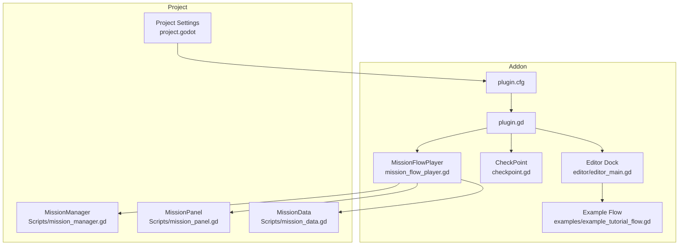
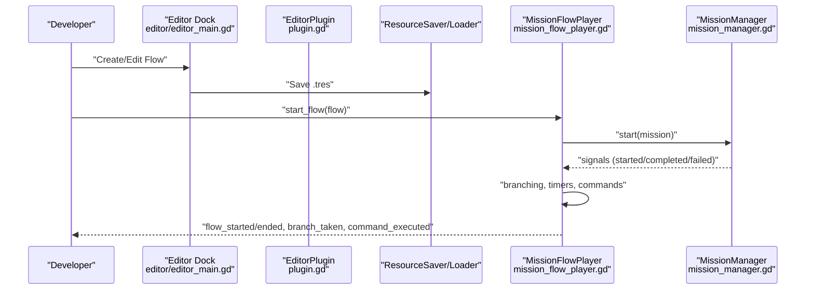
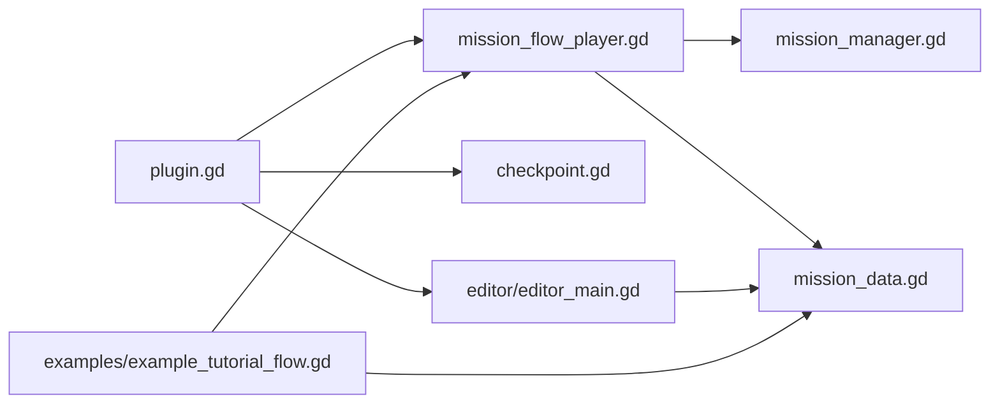

# Installation and Setup

<cite>
**Referenced Files in This Document**
- [plugin.cfg](file://addons/mission_editor/plugin.cfg)
- [plugin.gd](file://addons/mission_editor/plugin.gd)
- [GUIDA.md](file://addons/mission_editor/GUIDA.md)
- [project.godot](file://project.godot)
- [mission_manager.gd](file://Scripts/mission_manager.gd)
- [mission_data.gd](file://Scripts/mission_data.gd)
- [mission_panel.gd](file://Scripts/mission_panel.gd)
- [mission_flow_player.gd](file://addons/mission_editor/mission_flow_player.gd)
- [checkpoint.gd](file://addons/mission_editor/checkpoint.gd)
- [editor_main.gd](file://addons/mission_editor/editor/editor_main.gd)
- [example_tutorial_flow.gd](file://addons/mission_editor/examples/example_tutorial_flow.gd)
</cite>

## Table of Contents
1. [Introduction](#introduction)
2. [Project Structure](#project-structure)
3. [Core Components](#core-components)
4. [Architecture Overview](#architecture-overview)
5. [Detailed Component Analysis](#detailed-component-analysis)
6. [Dependency Analysis](#dependency-analysis)
7. [Performance Considerations](#performance-considerations)
8. [Troubleshooting Guide](#troubleshooting-guide)
9. [Conclusion](#conclusion)

## Introduction
This guide explains how to install and set up the Mission Editor addon in a Godot project. It covers enabling the plugin, configuring autoloads, understanding the plugin’s configuration file, integrating with existing mission systems, and initializing the editor workspace. It also documents compatibility expectations and provides verification steps and troubleshooting tips.

## Project Structure
The Mission Editor addon resides under the addons/mission_editor folder and integrates with the existing mission system present in the project. The key locations are:
- Addon registration and entry point: addons/mission_editor/plugin.cfg, addons/mission_editor/plugin.gd
- Runtime integration: addons/mission_editor/mission_flow_player.gd
- Existing mission system: Scripts/mission_manager.gd, Scripts/mission_data.gd, Scripts/mission_panel.gd
- Editor dock and UI: addons/mission_editor/editor/editor_main.gd
- Example flow: addons/mission_editor/examples/example_tutorial_flow.gd
- Project configuration: project.godot

**Diagram sources**
- [project.godot:37-39](file://project.godot#L37-L39)
- [plugin.cfg:1-8](file://addons/mission_editor/plugin.cfg#L1-L8)
- [plugin.gd:15-47](file://addons/mission_editor/plugin.gd#L15-L47)
- [mission_flow_player.gd:10-64](file://addons/mission_editor/mission_flow_player.gd#L10-L64)
- [mission_manager.gd:18-27](file://Scripts/mission_manager.gd#L18-L27)
- [mission_panel.gd:43-48](file://Scripts/mission_panel.gd#L43-L48)
- [mission_data.gd:4-15](file://Scripts/mission_data.gd#L4-L15)
- [editor_main.gd:5-22](file://addons/mission_editor/editor/editor_main.gd#L5-L22)
- [example_tutorial_flow.gd:14-152](file://addons/mission_editor/examples/example_tutorial_flow.gd#L14-L152)

**Section sources**
- [project.godot:37-39](file://project.godot#L37-L39)
- [plugin.cfg:1-8](file://addons/mission_editor/plugin.cfg#L1-L8)
- [plugin.gd:15-47](file://addons/mission_editor/plugin.gd#L15-L47)

## Core Components
- Plugin registration and activation: The addon registers itself via plugin.cfg and activates in the editor via plugin.gd. It adds an editor dock, a custom node type, and an autoload for runtime.
- Runtime flow player: MissionFlowPlayer integrates with MissionManager and MissionData to run flows, handle branching, timers, and commands.
- Existing mission system: MissionManager, MissionData, and MissionPanel provide the foundational mission lifecycle and HUD integration.
- Editor dock: The visual flow editor allows creating, connecting, and editing missions and commands.

Key responsibilities:
- plugin.gd: Registers autoload, custom node, and editor dock; exposes helpers for saving/loading flows.
- mission_flow_player.gd: Manages flow playback, branching, timers, checkpoint notifications, and command execution.
- mission_manager.gd: Public API for starting, progressing, completing, failing, and clearing missions.
- mission_data.gd: Defines mission attributes and flow-specific fields (branching, commands, time limit).
- mission_panel.gd: Updates HUD based on MissionManager signals.
- editor_main.gd: Provides the visual graph editor UI and inspector for flows and commands.

**Section sources**
- [plugin.gd:15-47](file://addons/mission_editor/plugin.gd#L15-L47)
- [mission_flow_player.gd:10-64](file://addons/mission_editor/mission_flow_player.gd#L10-L64)
- [mission_manager.gd:18-27](file://Scripts/mission_manager.gd#L18-L27)
- [mission_data.gd:4-15](file://Scripts/mission_data.gd#L4-L15)
- [mission_panel.gd:43-48](file://Scripts/mission_panel.gd#L43-L48)
- [editor_main.gd:5-22](file://addons/mission_editor/editor/editor_main.gd#L5-L22)

## Architecture Overview
The addon extends the existing mission system by adding a visual flow editor and runtime player. The editor creates and edits MissionData resources, which MissionFlowPlayer consumes to drive gameplay via MissionManager.

**Diagram sources**
- [editor_main.gd:742-749](file://addons/mission_editor/editor/editor_main.gd#L742-L749)
- [plugin.gd:67-82](file://addons/mission_editor/plugin.gd#L67-L82)
- [mission_flow_player.gd:87-115](file://addons/mission_editor/mission_flow_player.gd#L87-L115)
- [mission_manager.gd:50-99](file://Scripts/mission_manager.gd#L50-L99)

## Detailed Component Analysis

### Plugin Registration and Activation
- plugin.cfg defines the plugin metadata and entry script.
- plugin.gd:
  - Adds MissionFlowPlayer autoload if missing.
  - Registers the CheckPoint custom node type.
  - Creates and docks the editor UI.
  - Exposes save/open dialogs and resource handlers.

Verification steps:
- Confirm the plugin appears enabled in Project Settings > Plugins.
- Verify the MissionFlowEditor dock is visible in the editor.
- Confirm MissionFlowPlayer autoload exists in Project Settings > Autoload.

**Section sources**
- [plugin.cfg:1-8](file://addons/mission_editor/plugin.cfg#L1-L8)
- [plugin.gd:15-47](file://addons/mission_editor/plugin.gd#L15-L47)
- [plugin.gd:50-57](file://addons/mission_editor/plugin.gd#L50-L57)
- [project.godot:23-31](file://project.godot#L23-L31)

### Editor Dock and Flow Editing
- editor_main.gd builds the toolbar, graph editor, mission list, inspector, and command editor.
- It supports creating new flows, opening/saving .tres resources, adding/removing missions, and editing mission properties and commands.

Workflow highlights:
- New/Open/Save toolbar actions.
- Graph connections for success/fail branches.
- Inspector for mission fields and branching dropdowns.
- Command editor with type selection, JSON parameters, delays, and toggles.

**Section sources**
- [editor_main.gd:76-131](file://addons/mission_editor/editor/editor_main.gd#L76-L131)
- [editor_main.gd:350-359](file://addons/mission_editor/editor/editor_main.gd#L350-L359)
- [editor_main.gd:698-714](file://addons/mission_editor/editor/editor_main.gd#L698-L714)
- [editor_main.gd:728-749](file://addons/mission_editor/editor/editor_main.gd#L728-L749)

### Runtime Flow Player and Integration
- mission_flow_player.gd:
  - Connects to MissionManager signals.
  - Starts missions, handles branching, timers, and command execution.
  - Emits signals for flow events and checkpoint triggers.
  - Supports jumping to missions and forcing advancement.

Integration points:
- Uses MissionData resources produced by the editor.
- Works with MissionManager for mission lifecycle.
- Interacts with CheckPoint nodes for REACH/ACTIVATE missions.

**Section sources**
- [mission_flow_player.gd:53-64](file://addons/mission_editor/mission_flow_player.gd#L53-L64)
- [mission_flow_player.gd:87-115](file://addons/mission_editor/mission_flow_player.gd#L87-L115)
- [mission_flow_player.gd:175-216](file://addons/mission_editor/mission_flow_player.gd#L175-L216)
- [mission_flow_player.gd:228-267](file://addons/mission_editor/mission_flow_player.gd#L228-L267)

### CheckPoint Node
- checkpoint.gd:
  - Detects player entry and notifies MissionFlowPlayer.
  - Can auto-complete REACH/ACTIVATE missions based on ID matching.
  - Supports one-shot activation and optional display label.
  - Registers with MissionFlowPlayer for runtime checkpoint tracking.

Usage:
- Place CheckPoint nodes in scenes.
- Configure checkpoint_id and properties.
- Link missions to checkpoints via IDs.

**Section sources**
- [checkpoint.gd:44-150](file://addons/mission_editor/checkpoint.gd#L44-L150)
- [checkpoint.gd:164-168](file://addons/mission_editor/checkpoint.gd#L164-L168)

### Example Flow Creation
- example_tutorial_flow.gd demonstrates building a flow programmatically and linking commands to missions.
- It serves as a reference for creating flows and using MissionFlowPlayer.start_flow.

**Section sources**
- [example_tutorial_flow.gd:14-152](file://addons/mission_editor/examples/example_tutorial_flow.gd#L14-L152)

## Dependency Analysis
The addon depends on:
- Godot Editor (tool scripts and editor dock).
- Existing MissionManager, MissionData, and MissionPanel for runtime behavior.
- Resource system (.tres) for storing flows and commands.

**Diagram sources**
- [plugin.gd:7-9](file://addons/mission_editor/plugin.gd#L7-L9)
- [mission_flow_player.gd:12-13](file://addons/mission_editor/mission_flow_player.gd#L12-L13)
- [mission_manager.gd:18-27](file://Scripts/mission_manager.gd#L18-L27)
- [mission_data.gd:4-5](file://Scripts/mission_data.gd#L4-L5)
- [editor_main.gd:597-598](file://addons/mission_editor/editor/editor_main.gd#L597-L598)
- [example_tutorial_flow.gd:15-17](file://addons/mission_editor/examples/example_tutorial_flow.gd#L15-L17)

**Section sources**
- [plugin.gd:7-9](file://addons/mission_editor/plugin.gd#L7-L9)
- [mission_flow_player.gd:12-13](file://addons/mission_editor/mission_flow_player.gd#L12-L13)
- [mission_manager.gd:18-27](file://Scripts/mission_manager.gd#L18-L27)
- [mission_data.gd:4-5](file://Scripts/mission_data.gd#L4-L5)
- [editor_main.gd:597-598](file://addons/mission_editor/editor/editor_main.gd#L597-L598)
- [example_tutorial_flow.gd:15-17](file://addons/mission_editor/examples/example_tutorial_flow.gd#L15-L17)

## Performance Considerations
- Keep mission graphs concise to reduce editor rendering overhead.
- Prefer fewer, larger commands over many small ones to minimize signal emissions.
- Use time limits judiciously to avoid frequent timer updates.
- Avoid heavy command operations (e.g., scene changes) during tight loops.

## Troubleshooting Guide
Common issues and resolutions:
- Plugin not appearing in Project Settings:
  - Ensure plugin.cfg is present and valid.
  - Verify the plugin is enabled in Project Settings > Plugins.
- Editor dock missing:
  - Confirm plugin.gd registered the dock and that the plugin is enabled.
  - Restart the editor if necessary.
- MissionFlowPlayer autoload missing:
  - plugin.gd automatically adds it; check Project Settings > Autoload for MissionFlowPlayer.
- Flows not loading/saving:
  - Use the editor’s Open/Save actions to select .tres files.
  - Ensure the file path is valid and accessible.
- CheckPoints not triggering:
  - Verify checkpoint_id is set and the player is in the "players" group.
  - Ensure CheckPoint is active and not one-shot after first use.
- Branching not working:
  - Confirm mission IDs in on_success_next/on_fail_next match existing nodes.
  - Rebuild the graph/list after editing to refresh selections.
- HUD not updating:
  - Ensure MissionPanel is attached to the HUD node and connected to MissionManager signals.
  - Verify MissionManager is present and functioning.

**Section sources**
- [plugin.cfg:1-8](file://addons/mission_editor/plugin.cfg#L1-L8)
- [plugin.gd:15-47](file://addons/mission_editor/plugin.gd#L15-L47)
- [project.godot:23-31](file://project.godot#L23-L31)
- [checkpoint.gd:226-231](file://addons/mission_editor/checkpoint.gd#L226-L231)
- [mission_panel.gd:43-48](file://Scripts/mission_panel.gd#L43-L48)

## Conclusion
The Mission Editor addon integrates seamlessly with the existing mission system by extending it with a visual flow editor and a runtime player. By enabling the plugin, verifying autoloads, and using the editor dock, you can create, edit, and play flows that leverage MissionManager and MissionData. The provided example flow and integration points simplify adoption into existing projects.