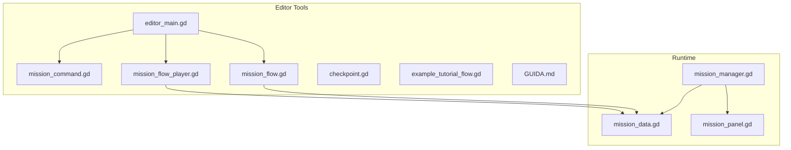
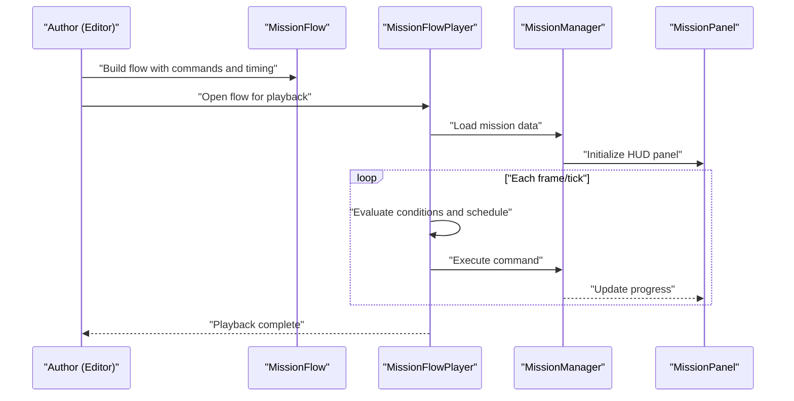
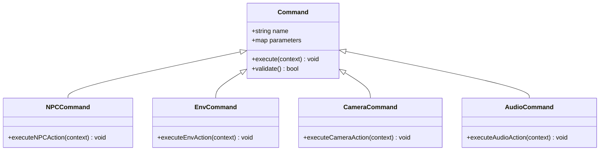
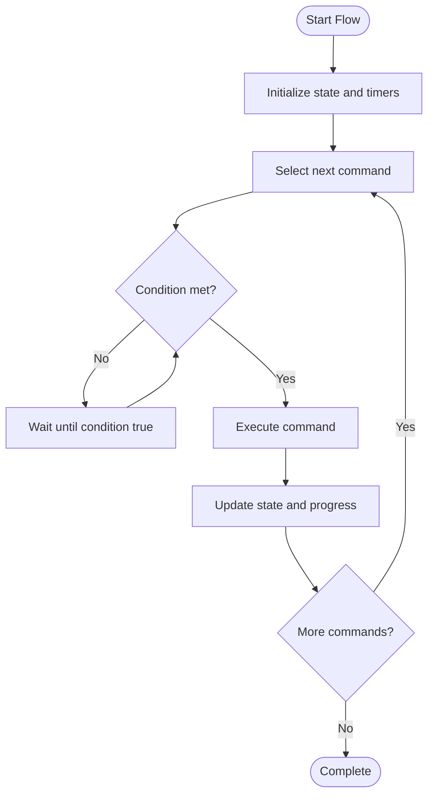
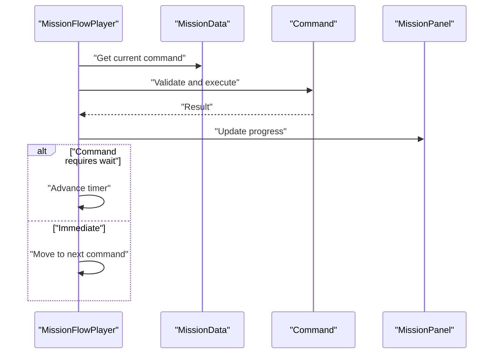
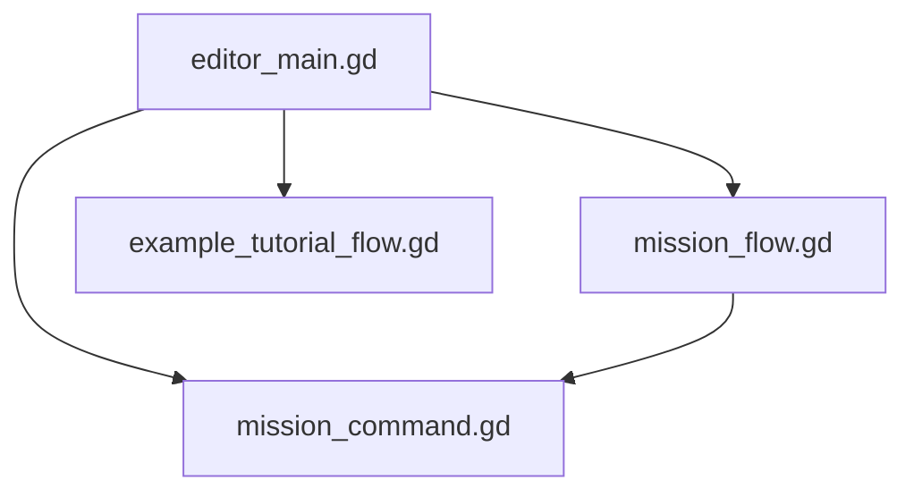
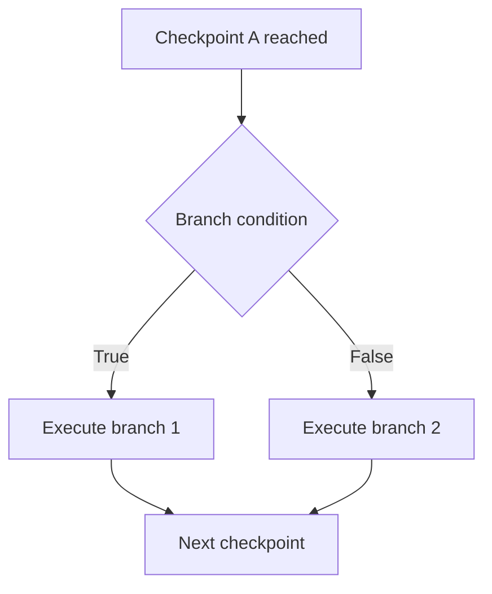
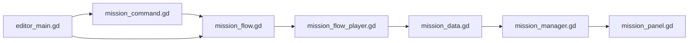

# Mission Commands and Actions

<cite>
**Referenced Files in This Document**
- [mission_command.gd](file://addons/mission_editor/mission_command.gd)
- [mission_flow.gd](file://addons/mission_editor/mission_flow.gd)
- [mission_flow_player.gd](file://addons/mission_editor/mission_flow_player.gd)
- [editor_main.gd](file://addons/mission_editor/editor/editor_main.gd)
- [checkpoint.gd](file://addons/mission_editor/checkpoint.gd)
- [mission_data.gd](file://Scripts/mission_data.gd)
- [mission_manager.gd](file://Scripts/mission_manager.gd)
- [mission_panel.gd](file://Scripts/mission_panel.gd)
- [example_tutorial_flow.gd](file://addons/mission_editor/examples/example_tutorial_flow.gd)
- [GUIDA.md](file://addons/mission_editor/GUIDA.md)
</cite>

## Table of Contents
1. [Introduction](#introduction)
2. [Project Structure](#project-structure)
3. [Core Components](#core-components)
4. [Architecture Overview](#architecture-overview)
5. [Detailed Component Analysis](#detailed-component-analysis)
6. [Command Reference](#command-reference)
7. [Dependency Analysis](#dependency-analysis)
8. [Performance Considerations](#performance-considerations)
9. [Troubleshooting Guide](#troubleshooting-guide)
10. [Conclusion](#conclusion)

## Introduction
This document describes the mission command system used to define scripted sequences of events in the game. It covers command types, parameters, execution contexts, chaining, timing, conditionals, and specialized actions for NPCs, environment, camera, and audio. It also provides validation, error handling, and performance guidance for complex command sequences.

## Project Structure
The mission system spans editor tools and runtime scripts:
- Editor tools under addons/mission_editor provide command definitions, flow orchestration, playback, and a GUI for authoring missions.
- Runtime scripts under Scripts handle mission loading, execution, and UI panel updates.

**Diagram sources**
- [mission_command.gd](file://addons/mission_editor/mission_command.gd)
- [mission_flow.gd](file://addons/mission_editor/mission_flow.gd)
- [mission_flow_player.gd](file://addons/mission_editor/mission_flow_player.gd)
- [editor_main.gd](file://addons/mission_editor/editor/editor_main.gd)
- [checkpoint.gd](file://addons/mission_editor/checkpoint.gd)
- [mission_data.gd](file://Scripts/mission_data.gd)
- [mission_manager.gd](file://Scripts/mission_manager.gd)
- [mission_panel.gd](file://Scripts/mission_panel.gd)

**Section sources**
- [mission_command.gd](file://addons/mission_editor/mission_command.gd)
- [mission_flow.gd](file://addons/mission_editor/mission_flow.gd)
- [mission_flow_player.gd](file://addons/mission_editor/mission_flow_player.gd)
- [editor_main.gd](file://addons/mission_editor/editor/editor_main.gd)
- [checkpoint.gd](file://addons/mission_editor/checkpoint.gd)
- [mission_data.gd](file://Scripts/mission_data.gd)
- [mission_manager.gd](file://Scripts/mission_manager.gd)
- [mission_panel.gd](file://Scripts/mission_panel.gd)

## Core Components
- Command definition module: Defines command types, parameters, and execution semantics.
- Flow orchestration: Manages command sequencing, timing, and conditional branching.
- Playback engine: Executes flows during gameplay with progress tracking and state management.
- Editor UI: Provides authoring tools and a live preview of mission flows.
- Runtime integration: Loads mission data, manages execution lifecycle, and updates UI.

Key responsibilities:
- Define command signatures and validation rules.
- Schedule and execute commands with timing controls.
- Support conditional execution based on checkpoints and flags.
- Provide feedback and progress to the HUD panel.

**Section sources**
- [mission_command.gd](file://addons/mission_editor/mission_command.gd)
- [mission_flow.gd](file://addons/mission_editor/mission_flow.gd)
- [mission_flow_player.gd](file://addons/mission_editor/mission_flow_player.gd)
- [mission_data.gd](file://Scripts/mission_data.gd)
- [mission_manager.gd](file://Scripts/mission_manager.gd)
- [mission_panel.gd](file://Scripts/mission_panel.gd)

## Architecture Overview
The mission system separates authoring from runtime:
- Authoring: Editor constructs flows from commands, sets timing, and defines checkpoints.
- Execution: Player reads the flow, schedules commands, and runs them with timing and conditions.
- Integration: Manager loads mission data and updates the HUD panel with progress.

**Diagram sources**
- [mission_flow.gd](file://addons/mission_editor/mission_flow.gd)
- [mission_flow_player.gd](file://addons/mission_editor/mission_flow_player.gd)
- [mission_manager.gd](file://Scripts/mission_manager.gd)
- [mission_panel.gd](file://Scripts/mission_panel.gd)

## Detailed Component Analysis

### Command Definition Module
Defines the set of available commands, their parameters, and execution semantics. Each command encapsulates:
- Name and category (e.g., NPC, Environment, Camera, Audio).
- Parameter schema with types and defaults.
- Execution delegate that performs the action.
- Validation logic to ensure parameters are correct before scheduling.

**Diagram sources**
- [mission_command.gd](file://addons/mission_editor/mission_command.gd)

**Section sources**
- [mission_command.gd](file://addons/mission_editor/mission_command.gd)

### Flow Orchestration
Manages command sequencing, timing, and conditional execution:
- Stores a list of commands with associated timing and conditions.
- Schedules commands based on elapsed time or trigger events.
- Supports conditional branches using checkpoints and flags.
- Tracks current position and completion state.

**Diagram sources**
- [mission_flow.gd](file://addons/mission_editor/mission_flow.gd)

**Section sources**
- [mission_flow.gd](file://addons/mission_editor/mission_flow.gd)

### Playback Engine
Executes flows during runtime:
- Reads mission data and initializes the player.
- Evaluates conditions per tick/frame.
- Invokes command execution delegates.
- Updates HUD panel with progress and status.

**Diagram sources**
- [mission_flow_player.gd](file://addons/mission_editor/mission_flow_player.gd)
- [mission_data.gd](file://Scripts/mission_data.gd)
- [mission_panel.gd](file://Scripts/mission_panel.gd)

**Section sources**
- [mission_flow_player.gd](file://addons/mission_editor/mission_flow_player.gd)
- [mission_data.gd](file://Scripts/mission_data.gd)
- [mission_panel.gd](file://Scripts/mission_panel.gd)

### Editor Integration
Provides authoring tools:
- Editor UI to construct flows and assign commands.
- Real-time preview of command execution.
- Example flows demonstrating typical usage patterns.

**Diagram sources**
- [editor_main.gd](file://addons/mission_editor/editor/editor_main.gd)
- [mission_flow.gd](file://addons/mission_editor/mission_flow.gd)
- [mission_command.gd](file://addons/mission_editor/mission_command.gd)
- [example_tutorial_flow.gd](file://addons/mission_editor/examples/example_tutorial_flow.gd)

**Section sources**
- [editor_main.gd](file://addons/mission_editor/editor/editor_main.gd)
- [mission_flow.gd](file://addons/mission_editor/mission_flow.gd)
- [mission_command.gd](file://addons/mission_editor/mission_command.gd)
- [example_tutorial_flow.gd](file://addons/mission_editor/examples/example_tutorial_flow.gd)

### Checkpoints and Conditions
Checkpoints mark significant points in a mission:
- Used to gate subsequent commands.
- Can store flags indicating completion states.
- Enable branching logic based on mission progress.

**Diagram sources**
- [checkpoint.gd](file://addons/mission_editor/checkpoint.gd)
- [mission_flow.gd](file://addons/mission_editor/mission_flow.gd)

**Section sources**
- [checkpoint.gd](file://addons/mission_editor/checkpoint.gd)
- [mission_flow.gd](file://addons/mission_editor/mission_flow.gd)

## Command Reference

### Command Categories and Types
- NPC Commands: Control character behavior, movement, animations, and states.
- Environment Commands: Modify lighting, weather, terrain, and scene objects.
- Camera Commands: Set camera positions, transitions, effects, and focus.
- Audio Commands: Trigger sounds, music, and audio cues.
- Flow Control: Timing, waits, loops, and conditional branching.

### Command Execution Context
- Context includes current scene, active entities, and runtime state.
- Commands receive context to resolve targets and apply changes.
- Validation ensures parameters are present and correct before execution.

### Command Chaining and Timing
- Sequential execution by default.
- Optional delays or waits between commands.
- Conditional execution based on checkpoints and flags.

### Specialized Commands
- NPC Behavior: Spawn, move, animate, interact, despawn.
- Environmental Changes: Toggle lights, change materials, activate effects.
- Camera Effects: Cut, ease, track targets, apply blur/fade.
- Sound Triggers: Play SFX, music, stop audio, set volumes.

### Parameter Descriptions
- Parameters vary by command type but generally include:
  - Target identifiers (entity, node, tag).
  - Values (floats, vectors, booleans).
  - Timing (delay, duration, interpolation).
  - Flags (checkpoint names, boolean states).

### Usage Examples
- See example tutorial flow for practical command combinations and sequencing.
- Use checkpoints to gate progression and enable branching.

### Integration Patterns
- Load mission data via manager and initialize HUD panel.
- Run playback loop each frame/tick.
- Update UI with progress and status messages.

**Section sources**
- [mission_command.gd](file://addons/mission_editor/mission_command.gd)
- [mission_flow.gd](file://addons/mission_editor/mission_flow.gd)
- [mission_flow_player.gd](file://addons/mission_editor/mission_flow_player.gd)
- [mission_data.gd](file://Scripts/mission_data.gd)
- [mission_manager.gd](file://Scripts/mission_manager.gd)
- [mission_panel.gd](file://Scripts/mission_panel.gd)
- [example_tutorial_flow.gd](file://addons/mission_editor/examples/example_tutorial_flow.gd)

## Dependency Analysis
The system exhibits clear separation of concerns:
- Editor depends on command definitions to validate and build flows.
- Player depends on mission data and commands to execute flows.
- Manager depends on mission data and panel to manage runtime state.
- Panel depends on manager for progress updates.

**Diagram sources**
- [mission_command.gd](file://addons/mission_editor/mission_command.gd)
- [mission_flow.gd](file://addons/mission_editor/mission_flow.gd)
- [mission_flow_player.gd](file://addons/mission_editor/mission_flow_player.gd)
- [mission_data.gd](file://Scripts/mission_data.gd)
- [mission_manager.gd](file://Scripts/mission_manager.gd)
- [mission_panel.gd](file://Scripts/mission_panel.gd)
- [editor_main.gd](file://addons/mission_editor/editor/editor_main.gd)

**Section sources**
- [mission_command.gd](file://addons/mission_editor/mission_command.gd)
- [mission_flow.gd](file://addons/mission_editor/mission_flow.gd)
- [mission_flow_player.gd](file://addons/mission_editor/mission_flow_player.gd)
- [mission_data.gd](file://Scripts/mission_data.gd)
- [mission_manager.gd](file://Scripts/mission_manager.gd)
- [mission_panel.gd](file://Scripts/mission_panel.gd)
- [editor_main.gd](file://addons/mission_editor/editor/editor_main.gd)

## Performance Considerations
- Minimize expensive operations inside tight loops or per-frame ticks.
- Batch updates to reduce redundant UI refreshes.
- Use efficient parameter validation to avoid repeated checks.
- Prefer lightweight command delegates and avoid heavy scene operations per command.
- Limit concurrent command execution to prevent contention.

## Troubleshooting Guide
Common issues and resolutions:
- Invalid parameters: Ensure all required parameters are provided and typed correctly.
- Condition not met: Verify checkpoint flags and branching logic.
- Timing conflicts: Adjust delays and ensure commands do not overlap unexpectedly.
- Execution errors: Wrap critical sections with error handling and log failures.

Validation and error handling:
- Commands should validate parameters before scheduling.
- Player should catch and report execution errors without halting the entire flow.
- Use checkpoints to isolate failing segments and continue from safe points.

**Section sources**
- [mission_command.gd](file://addons/mission_editor/mission_command.gd)
- [mission_flow_player.gd](file://addons/mission_editor/mission_flow_player.gd)

## Conclusion
The mission command system provides a flexible framework for scripting gameplay sequences. By separating command definitions, flow orchestration, and playback, it enables authors to compose complex narratives while keeping runtime performance predictable. Use checkpoints for branching, parameter validation for reliability, and structured timing for polished pacing.