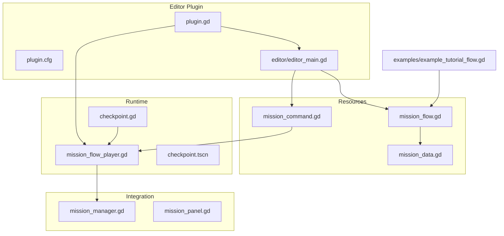
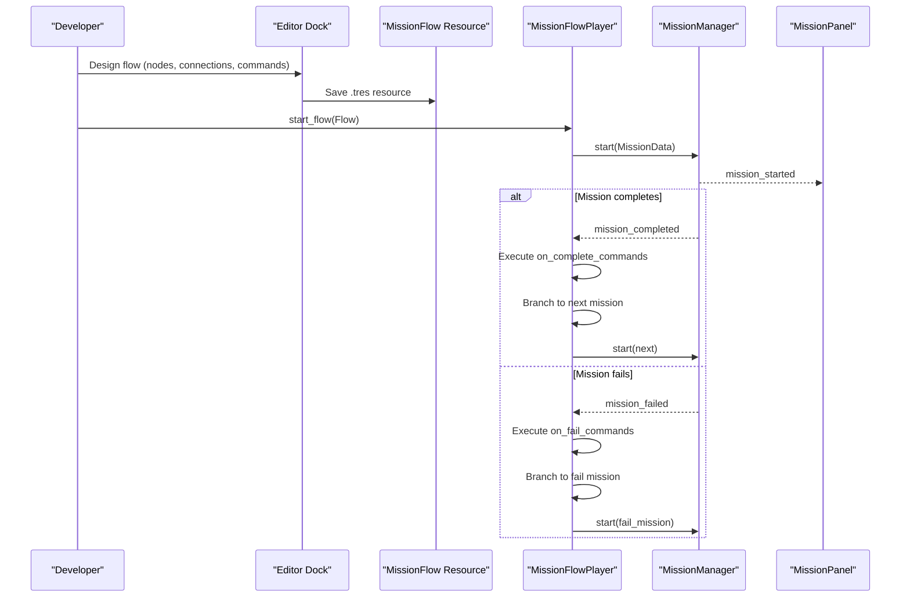
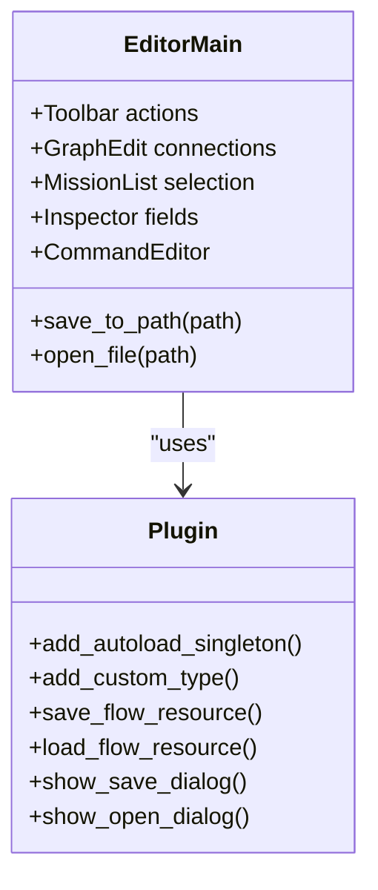
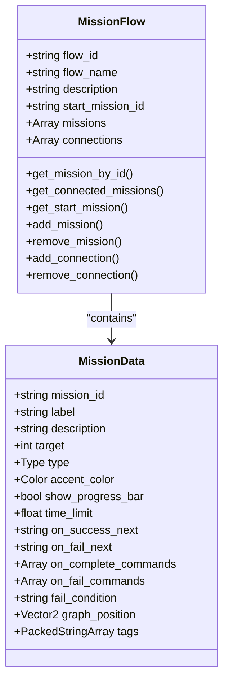
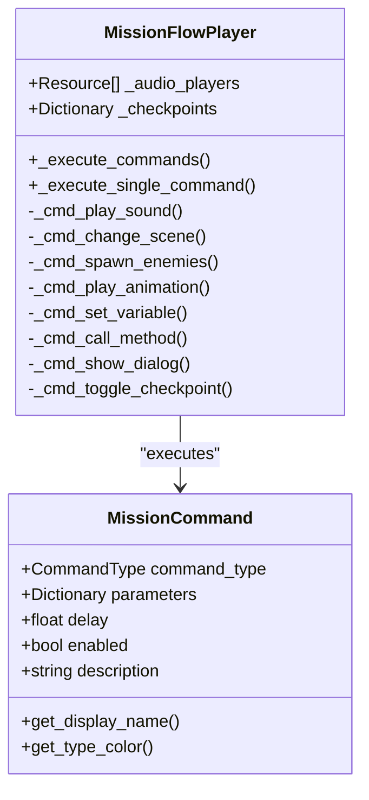
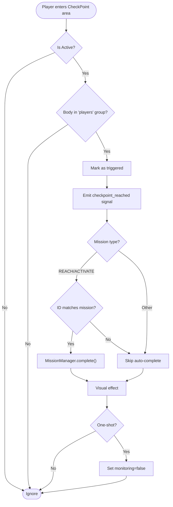
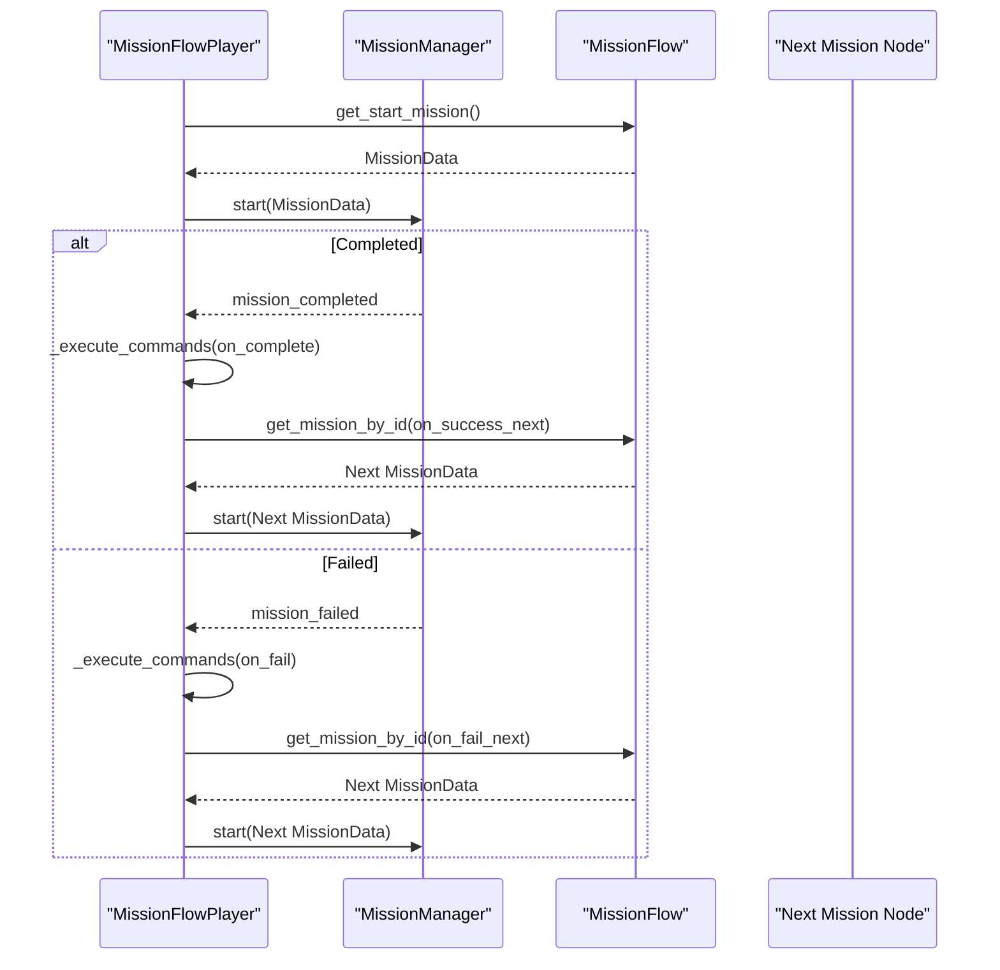
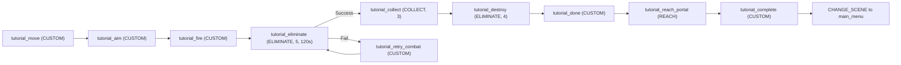
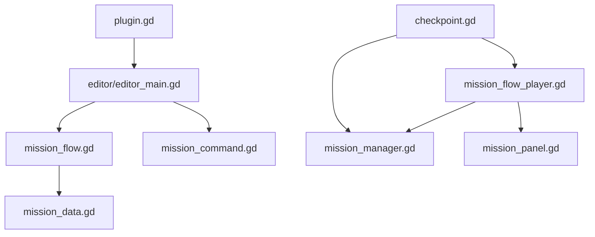

# Mission Editor Addon

<cite>
**Referenced Files in This Document**
- [plugin.gd](file://addons/mission_editor/plugin.gd)
- [plugin.cfg](file://addons/mission_editor/plugin.cfg)
- [GUIDA.md](file://addons/mission_editor/GUIDA.md)
- [editor_main.gd](file://addons/mission_editor/editor/editor_main.gd)
- [mission_flow.gd](file://addons/mission_editor/mission_flow.gd)
- [mission_command.gd](file://addons/mission_editor/mission_command.gd)
- [mission_flow_player.gd](file://addons/mission_editor/mission_flow_player.gd)
- [checkpoint.gd](file://addons/mission_editor/checkpoint.gd)
- [checkpoint.tscn](file://addons/mission_editor/checkpoint.tscn)
- [example_tutorial_flow.gd](file://addons/mission_editor/examples/example_tutorial_flow.gd)
- [mission_data.gd](file://Scripts/mission_data.gd)
- [mission_manager.gd](file://Scripts/mission_manager.gd)
- [mission_panel.gd](file://Scripts/mission_panel.gd)
- [creazionemissioni.md](file://creazionemissioni.md)
</cite>

## Table of Contents
1. [Introduction](#introduction)
2. [Project Structure](#project-structure)
3. [Core Components](#core-components)
4. [Architecture Overview](#architecture-overview)
5. [Detailed Component Analysis](#detailed-component-analysis)
6. [Dependency Analysis](#dependency-analysis)
7. [Performance Considerations](#performance-considerations)
8. [Troubleshooting Guide](#troubleshooting-guide)
9. [Conclusion](#conclusion)
10. [Appendices](#appendices)

## Introduction
The Mission Editor addon enables visual creation and management of branching mission flows in top-down games built with Godot 4. It integrates seamlessly with the existing MissionManager system, adding a Dialogic-style flow editor, checkpoint nodes, and a robust command system for scripted actions. This guide documents installation, editor usage, mission flow scripting, checkpoint mechanics, and practical tutorials for building custom missions.

## Project Structure
The Mission Editor resides under addons/mission_editor and consists of:
- Editor plugin entry point and dock UI
- Flow and command resources
- Runtime flow player and checkpoint node
- Example flows and documentation

**Diagram sources**
- [plugin.gd:1-109](file://addons/mission_editor/plugin.gd#L1-L109)
- [plugin.cfg:1-8](file://addons/mission_editor/plugin.cfg#L1-L8)
- [editor_main.gd:1-778](file://addons/mission_editor/editor/editor_main.gd#L1-L778)
- [mission_flow.gd:1-134](file://addons/mission_editor/mission_flow.gd#L1-L134)
- [mission_command.gd:1-98](file://addons/mission_editor/mission_command.gd#L1-L98)
- [mission_flow_player.gd:1-379](file://addons/mission_editor/mission_flow_player.gd#L1-L379)
- [checkpoint.gd:1-231](file://addons/mission_editor/checkpoint.gd#L1-L231)
- [checkpoint.tscn:1-96](file://addons/mission_editor/checkpoint.tscn#L1-L96)
- [mission_data.gd:1-66](file://Scripts/mission_data.gd#L1-L66)
- [mission_manager.gd:1-169](file://Scripts/mission_manager.gd#L1-L169)
- [mission_panel.gd:1-359](file://Scripts/mission_panel.gd#L1-L359)
- [example_tutorial_flow.gd:1-153](file://addons/mission_editor/examples/example_tutorial_flow.gd#L1-L153)

**Section sources**
- [plugin.gd:1-109](file://addons/mission_editor/plugin.gd#L1-L109)
- [plugin.cfg:1-8](file://addons/mission_editor/plugin.cfg#L1-L8)
- [GUIDA.md:40-82](file://addons/mission_editor/GUIDA.md#L40-L82)

## Core Components
- Mission Flow Resource: Defines a flow with missions, connections, and start mission.
- Mission Command Resource: Encapsulates executable actions triggered on mission completion or failure.
- Mission Flow Player: Runtime engine that starts flows, handles branching, executes commands, manages timers, and coordinates checkpoints.
- CheckPoint Node: Area2D node placed in scenes to trigger mission completion for REACH/ACTIVATE types and toggle checkpoint activity.
- Editor Dock: Visual graph editor with inspector and command editor for designing flows.
- Integration: Works with MissionManager and MissionPanel for HUD updates and mission lifecycle.

**Section sources**
- [mission_flow.gd:1-134](file://addons/mission_editor/mission_flow.gd#L1-L134)
- [mission_command.gd:1-98](file://addons/mission_editor/mission_command.gd#L1-L98)
- [mission_flow_player.gd:1-379](file://addons/mission_editor/mission_flow_player.gd#L1-L379)
- [checkpoint.gd:1-231](file://addons/mission_editor/checkpoint.gd#L1-L231)
- [editor_main.gd:1-778](file://addons/mission_editor/editor/editor_main.gd#L1-L778)
- [mission_data.gd:1-66](file://Scripts/mission_data.gd#L1-L66)
- [mission_manager.gd:1-169](file://Scripts/mission_manager.gd#L1-L169)
- [mission_panel.gd:1-359](file://Scripts/mission_panel.gd#L1-L359)

## Architecture Overview
The Mission Editor extends the existing MissionManager architecture with a visual flow designer and runtime flow player. The flow designer creates MissionFlow resources containing MissionData nodes and connections. At runtime, MissionFlowPlayer reads the flow, starts missions via MissionManager, triggers commands, and manages branching and timers.

**Diagram sources**
- [editor_main.gd:698-778](file://addons/mission_editor/editor/editor_main.gd#L698-L778)
- [mission_flow_player.gd:87-216](file://addons/mission_editor/mission_flow_player.gd#L87-L216)
- [mission_manager.gd:49-99](file://Scripts/mission_manager.gd#L49-L99)
- [mission_panel.gd:53-169](file://Scripts/mission_panel.gd#L53-L169)

## Detailed Component Analysis

### Plugin and Editor Dock
The plugin registers the editor dock, adds the MissionFlowPlayer autoload, and exposes save/open dialogs. The dock builds a toolbar, graph editor, mission list, inspector, and command editor. It supports drag-and-drop connections, branch selection, and command editing with JSON parameters.

**Diagram sources**
- [editor_main.gd:1-778](file://addons/mission_editor/editor/editor_main.gd#L1-L778)
- [plugin.gd:15-109](file://addons/mission_editor/plugin.gd#L15-L109)

**Section sources**
- [plugin.gd:15-109](file://addons/mission_editor/plugin.gd#L15-L109)
- [editor_main.gd:76-131](file://addons/mission_editor/editor/editor_main.gd#L76-L131)
- [editor_main.gd:133-171](file://addons/mission_editor/editor/editor_main.gd#L133-L171)
- [editor_main.gd:350-452](file://addons/mission_editor/editor/editor_main.gd#L350-L452)
- [editor_main.gd:698-778](file://addons/mission_editor/editor/editor_main.gd#L698-L778)

### Mission Flow Resource
MissionFlow stores flow metadata, missions array, and explicit connections. It provides helpers to retrieve missions, get connected missions, and manage IDs and positions.

**Diagram sources**
- [mission_flow.gd:1-134](file://addons/mission_editor/mission_flow.gd#L1-L134)
- [mission_data.gd:1-66](file://Scripts/mission_data.gd#L1-L66)

**Section sources**
- [mission_flow.gd:28-57](file://addons/mission_editor/mission_flow.gd#L28-L57)
- [mission_data.gd:7-66](file://Scripts/mission_data.gd#L7-L66)

### Mission Command System
MissionCommand defines typed commands with JSON parameters, delay, and activation flag. The runtime player executes commands in order, honoring delays and enabling/disabling.

**Diagram sources**
- [mission_command.gd:1-98](file://addons/mission_editor/mission_command.gd#L1-L98)
- [mission_flow_player.gd:228-379](file://addons/mission_editor/mission_flow_player.gd#L228-L379)

**Section sources**
- [mission_command.gd:8-46](file://addons/mission_editor/mission_command.gd#L8-L46)
- [mission_flow_player.gd:242-379](file://addons/mission_editor/mission_flow_player.gd#L242-L379)

### CheckPoint Node Mechanics
CheckPoint is a configurable Area2D that can auto-complete REACH/ACTIVATE missions when the player group enters its area. It supports one-shot activation, visual feedback, optional display label, and runtime toggling via commands.

**Diagram sources**
- [checkpoint.gd:114-150](file://addons/mission_editor/checkpoint.gd#L114-L150)
- [mission_flow_player.gd:133-141](file://addons/mission_editor/mission_flow_player.gd#L133-L141)

**Section sources**
- [checkpoint.gd:9-36](file://addons/mission_editor/checkpoint.gd#L9-L36)
- [checkpoint.gd:86-112](file://addons/mission_editor/checkpoint.gd#L86-L112)
- [checkpoint.gd:114-150](file://addons/mission_editor/checkpoint.gd#L114-L150)
- [checkpoint.tscn:1-96](file://addons/mission_editor/checkpoint.tscn#L1-L96)

### Runtime Flow Execution
MissionFlowPlayer orchestrates flow playback, branching, timers, and command execution. It connects to MissionManager signals and emits its own signals for UI and external systems.

**Diagram sources**
- [mission_flow_player.gd:87-216](file://addons/mission_editor/mission_flow_player.gd#L87-L216)
- [mission_flow.gd:28-57](file://addons/mission_editor/mission_flow.gd#L28-L57)
- [mission_manager.gd:77-93](file://Scripts/mission_manager.gd#L77-L93)

**Section sources**
- [mission_flow_player.gd:67-76](file://addons/mission_editor/mission_flow_player.gd#L67-L76)
- [mission_flow_player.gd:175-216](file://addons/mission_editor/mission_flow_player.gd#L175-L216)

### Example Tutorial Flow
The example demonstrates a linear tutorial with branching on combat failure and scene transitions at the end.

**Diagram sources**
- [example_tutorial_flow.gd:14-153](file://addons/mission_editor/examples/example_tutorial_flow.gd#L14-L153)

**Section sources**
- [example_tutorial_flow.gd:14-153](file://addons/mission_editor/examples/example_tutorial_flow.gd#L14-L153)

## Dependency Analysis
The plugin depends on editor interfaces to create docks and handle file dialogs. The dock depends on flow/command resources and MissionData. The runtime player depends on MissionManager and MissionPanel. CheckPoint depends on MissionManager for auto-completion and MissionFlowPlayer for registration.

**Diagram sources**
- [plugin.gd:15-109](file://addons/mission_editor/plugin.gd#L15-L109)
- [editor_main.gd:597-608](file://addons/mission_editor/editor/editor_main.gd#L597-L608)
- [mission_flow_player.gd:12-14](file://addons/mission_editor/mission_flow_player.gd#L12-L14)
- [checkpoint.gd:86-91](file://addons/mission_editor/checkpoint.gd#L86-L91)

**Section sources**
- [plugin.gd:15-48](file://addons/mission_editor/plugin.gd#L15-L48)
- [editor_main.gd:597-627](file://addons/mission_editor/editor/editor_main.gd#L597-L627)
- [mission_flow_player.gd:53-64](file://addons/mission_editor/mission_flow_player.gd#L53-L64)
- [checkpoint.gd:86-91](file://addons/mission_editor/checkpoint.gd#L86-L91)

## Performance Considerations
- Minimize heavy command operations during gameplay (e.g., avoid long scene loads in tight loops).
- Use delays judiciously to prevent UI stuttering.
- Keep mission command lists concise to reduce runtime overhead.
- Prefer one-shot checkpoints to avoid repeated triggers.
- Use time limits thoughtfully to balance challenge and pacing.

## Troubleshooting Guide
Common issues and resolutions:
- Flow not starting: Ensure MissionFlowPlayer autoload exists and start_flow is called with a valid MissionFlow resource.
- Missions not advancing: Verify on_success_next/on_fail_next IDs exist and are correctly set in the inspector.
- Commands not executing: Confirm command.enabled is true and parameters are valid JSON.
- Checkpoints not triggering: Ensure checkpoint_id is set, node is in the "players" group, and is_active is true.
- Time limit not working: Confirm time_limit is greater than zero and MissionManager is emitting completion/failure signals.
- HUD not updating: Ensure MissionPanel is attached to the correct nodes and MissionManager signals are connected.

**Section sources**
- [mission_flow_player.gd:87-131](file://addons/mission_editor/mission_flow_player.gd#L87-L131)
- [mission_flow_player.gd:228-240](file://addons/mission_editor/mission_flow_player.gd#L228-L240)
- [checkpoint.gd:114-150](file://addons/mission_editor/checkpoint.gd#L114-L150)
- [mission_panel.gd:43-49](file://Scripts/mission_panel.gd#L43-L49)

## Conclusion
The Mission Editor addon provides a powerful, visual way to design branching mission flows while leveraging the existing MissionManager infrastructure. With intuitive editors, flexible command system, and checkpoint mechanics, developers can rapidly prototype and deploy complex narrative-driven gameplay experiences.

## Appendices

### Installation and Activation
- Enable the plugin in Project Settings → Plugins.
- The plugin automatically adds:
  - MissionFlowEditor dock
  - MissionFlowPlayer autoload
  - CheckPoint custom node type

**Section sources**
- [plugin.gd:15-48](file://addons/mission_editor/plugin.gd#L15-L48)
- [GUIDA.md:24-38](file://addons/mission_editor/GUIDA.md#L24-L38)

### Creating a New Flow
- Click New in the editor toolbar.
- Add missions with + Mission.
- Configure mission properties in the inspector.
- Connect missions via drag-and-drop or inspector branches.
- Save with Save to persist as .tres.

**Section sources**
- [editor_main.gd:698-714](file://addons/mission_editor/editor/editor_main.gd#L698-L714)
- [editor_main.gd:751-767](file://addons/mission_editor/editor/editor_main.gd#L751-L767)
- [editor_main.gd:350-452](file://addons/mission_editor/editor/editor_main.gd#L350-L452)

### Adding and Editing Commands
- Select a mission and choose On Complete or On Fail.
- Click + Add Cmd to create a new command.
- Set Type and Parameters (JSON).
- Adjust Delay and Active flags.
- Use the command list to reorder or remove commands.

**Section sources**
- [editor_main.gd:557-652](file://addons/mission_editor/editor/editor_main.gd#L557-L652)
- [mission_command.gd:22-46](file://addons/mission_editor/mission_command.gd#L22-L46)

### CheckPoint Placement and Behavior
- Add CheckPoint in the scene tree under Area2D → CheckPoint.
- Set checkpoint_id and optional display_label.
- Configure radius, color, and one_shot.
- Auto-complete works for REACH/ACTIVATE when IDs match mission label or ID.

**Section sources**
- [checkpoint.gd:9-36](file://addons/mission_editor/checkpoint.gd#L9-L36)
- [checkpoint.gd:130-144](file://addons/mission_editor/checkpoint.gd#L130-L144)
- [checkpoint.tscn:1-96](file://addons/mission_editor/checkpoint.tscn#L1-L96)

### Using Flows in Game Code
- Load a saved .tres and call MissionFlowPlayer.start_flow().
- Stop or jump to specific missions using stop_flow() and jump_to_mission().
- Listen to flow_started, flow_ended, mission_branch_taken, command_executed, and checkpoint_reached.

**Section sources**
- [mission_flow_player.gd:87-158](file://addons/mission_editor/mission_flow_player.gd#L87-L158)
- [mission_flow_player.gd:18-23](file://addons/mission_editor/mission_flow_player.gd#L18-L23)

### Step-by-Step Tutorial: Linear Mission Flow
- Create a new flow and add 6 missions (move, aim, fire, eliminate, collect, destroy).
- Set CUSTOM type for tutorial steps and ELIMINATE/COLLECT for objectives.
- Link missions sequentially via on_success_next.
- Add a retry branch from eliminate to tutorial_retry_combat.
- Add a final CUSTOM mission with a CHANGE_SCENE command to return to main menu.

**Section sources**
- [example_tutorial_flow.gd:14-153](file://addons/mission_editor/examples/example_tutorial_flow.gd#L14-L153)
- [GUIDA.md:347-384](file://addons/mission_editor/GUIDA.md#L347-L384)

### Best Practices for Mission Design
- Keep mission objectives clear and visually distinct.
- Use branching sparingly to avoid confusion.
- Employ time limits to create tension but remain fair.
- Utilize HUD feedback and short dialog messages for guidance.
- Reuse checkpoint IDs consistently across missions and scenes.
- Test checkpoint auto-completion with representative player movement.

**Section sources**
- [creazionemissioni.md:246-292](file://creazionemissioni.md#L246-L292)
- [checkpoint.gd:24-26](file://addons/mission_editor/checkpoint.gd#L24-L26)

### Templates for Different Mission Types
- Elimination: ELIMINATE with target set to number of bots; track with "bots" group.
- Collection: COLLECT with target set to number of items; track with "item" group.
- Reach/Activate: REACH/ACTIVATE with target 0; pair with CheckPoint ID.
- Survival: SURVIVE with target set to seconds; use progress bar for countdown.
- Custom: CUSTOM with target 0 or desired numeric goal; drive progress externally.

**Section sources**
- [mission_data.gd:7-15](file://Scripts/mission_data.gd#L7-L15)
- [creazionemissioni.md:25-37](file://creazionemissioni.md#L25-L37)