# Mission Flow and Scripting

<cite>
**Referenced Files in This Document**
- [mission_flow.gd](file://addons/mission_editor/mission_flow.gd)
- [mission_flow_player.gd](file://addons/mission_editor/mission_flow_player.gd)
- [mission_command.gd](file://addons/mission_editor/mission_command.gd)
- [mission_data.gd](file://Scripts/mission_data.gd)
- [mission_manager.gd](file://Scripts/mission_manager.gd)
- [checkpoint.gd](file://addons/mission_editor/checkpoint.gd)
- [plugin.gd](file://addons/mission_editor/plugin.gd)
- [editor_main.gd](file://addons/mission_editor/editor/editor_main.gd)
- [example_tutorial_flow.gd](file://addons/mission_editor/examples/example_tutorial_flow.gd)
- [GUIDA.md](file://addons/mission_editor/GUIDA.md)
</cite>

## Table of Contents
1. [Introduction](#introduction)
2. [Project Structure](#project-structure)
3. [Core Components](#core-components)
4. [Architecture Overview](#architecture-overview)
5. [Detailed Component Analysis](#detailed-component-analysis)
6. [Dependency Analysis](#dependency-analysis)
7. [Performance Considerations](#performance-considerations)
8. [Troubleshooting Guide](#troubleshooting-guide)
9. [Conclusion](#conclusion)
10. [Appendices](#appendices)

## Introduction
This document explains the mission flow scripting system for top-down games built with Godot. It covers the mission flow architecture, flow control logic, execution mechanisms, and runtime player behavior. It documents the scripting syntax for commands, branching logic, and conditional triggers. Practical examples demonstrate how to build branching narratives, objective chains, and dynamic mission elements. Best practices for design, performance, and debugging are included.

## Project Structure
The mission flow system is implemented as a plugin with editor tools and a runtime player. Key parts:
- Editor plugin and dock for designing flows visually
- Flow container resource storing missions and connections
- Runtime player that orchestrates flow execution and branching
- Mission data resource describing objectives
- Mission manager singleton coordinating HUD and progress
- Checkpoint nodes for REACH/ACTIVATE objectives
- Command resource for scripted actions executed on completion/failure

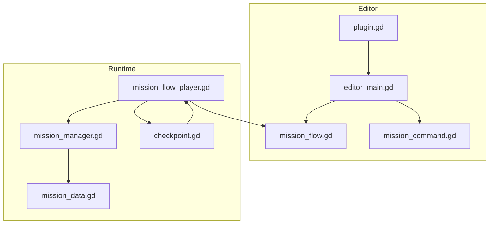

**Diagram sources**
- [plugin.gd:1-109](file://addons/mission_editor/plugin.gd#L1-L109)
- [editor_main.gd:1-778](file://addons/mission_editor/editor/editor_main.gd#L1-L778)
- [mission_flow.gd:1-134](file://addons/mission_editor/mission_flow.gd#L1-L134)
- [mission_command.gd:1-98](file://addons/mission_editor/mission_command.gd#L1-L98)
- [mission_flow_player.gd:1-379](file://addons/mission_editor/mission_flow_player.gd#L1-L379)
- [mission_manager.gd:1-169](file://Scripts/mission_manager.gd#L1-L169)
- [checkpoint.gd:1-231](file://addons/mission_editor/checkpoint.gd#L1-L231)
- [mission_data.gd:1-66](file://Scripts/mission_data.gd#L1-L66)

**Section sources**
- [plugin.gd:1-109](file://addons/mission_editor/plugin.gd#L1-L109)
- [GUIDA.md:1-433](file://addons/mission_editor/GUIDA.md#L1-L433)

## Core Components
- MissionFlow: Resource container for a flow graph with missions, connections, and entry point.
- MissionData: Declares a single mission objective with type, target, branching, timers, and commands.
- MissionCommand: Defines executable actions triggered on success/failure.
- MissionFlowPlayer: Autoload runtime that starts flows, manages branching, executes commands, handles checkpoints, and timers.
- MissionManager: Autoload singleton that runs missions, emits signals, and updates HUD.
- CheckPoint: Area2D node that triggers REACH/ACTIVATE completions and toggles visibility.
- EditorDock: Visual designer for flows, missions, and commands.

**Section sources**
- [mission_flow.gd:1-134](file://addons/mission_editor/mission_flow.gd#L1-L134)
- [mission_data.gd:1-66](file://Scripts/mission_data.gd#L1-L66)
- [mission_command.gd:1-98](file://addons/mission_editor/mission_command.gd#L1-L98)
- [mission_flow_player.gd:1-379](file://addons/mission_editor/mission_flow_player.gd#L1-L379)
- [mission_manager.gd:1-169](file://Scripts/mission_manager.gd#L1-L169)
- [checkpoint.gd:1-231](file://addons/mission_editor/checkpoint.gd#L1-L231)
- [editor_main.gd:1-778](file://addons/mission_editor/editor/editor_main.gd#L1-L778)

## Architecture Overview
The system integrates editor and runtime:
- Editor builds a MissionFlow resource graph with MissionData nodes and explicit connections.
- Runtime MissionFlowPlayer subscribes to MissionManager signals, advances missions, executes commands, and manages timers and checkpoints.
- CheckPoints notify the runtime to complete REACH/ACTIVATE objectives and toggle checkpoint visibility.

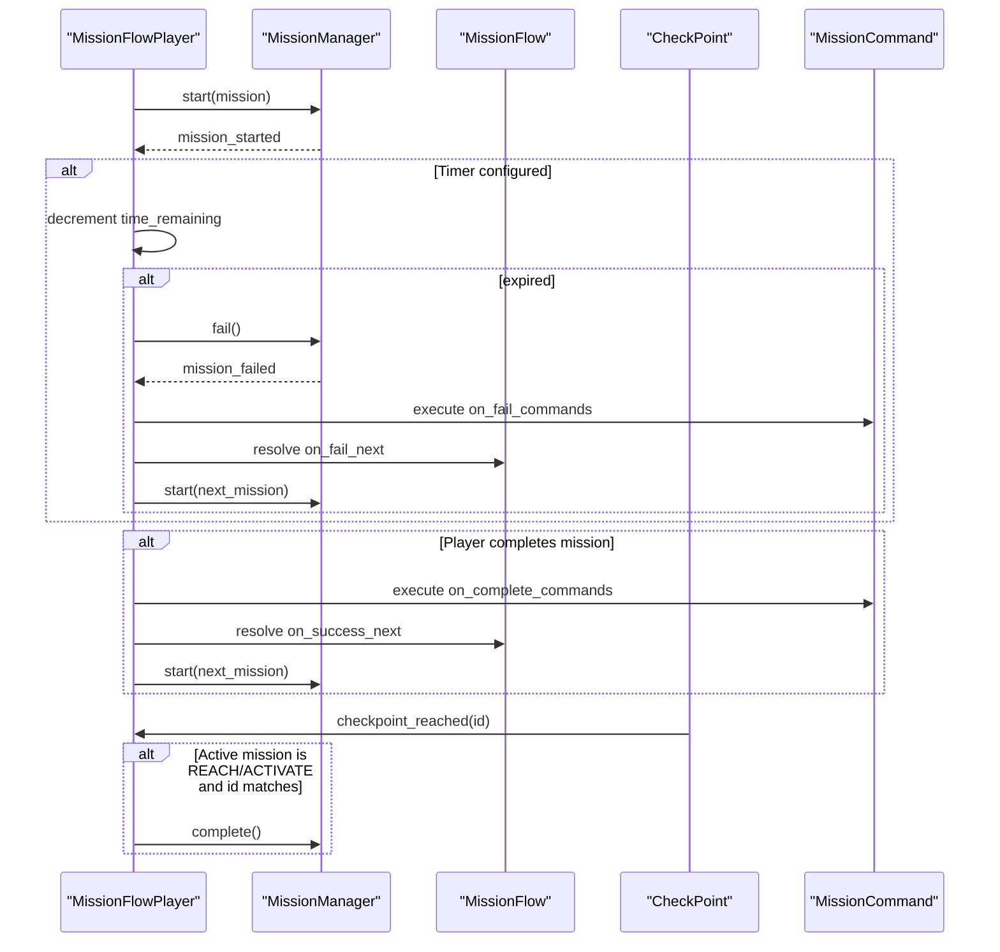

**Diagram sources**
- [mission_flow_player.gd:87-222](file://addons/mission_editor/mission_flow_player.gd#L87-L222)
- [mission_manager.gd:49-99](file://Scripts/mission_manager.gd#L49-L99)
- [mission_flow.gd:28-54](file://addons/mission_editor/mission_flow.gd#L28-L54)
- [checkpoint.gd:114-149](file://addons/mission_editor/checkpoint.gd#L114-L149)
- [mission_command.gd:8-20](file://addons/mission_editor/mission_command.gd#L8-L20)

## Detailed Component Analysis

### MissionFlow (Flow Container)
MissionFlow stores:
- flow_id, flow_name, description
- start_mission_id
- missions: array of MissionData
- connections: explicit graph edges for editor visualization

Key behaviors:
- Retrieve mission by ID
- Get connected missions (success/fail)
- Get start mission
- Add/remove missions
- Add/remove connections
- Generate unique IDs and clean up dangling references

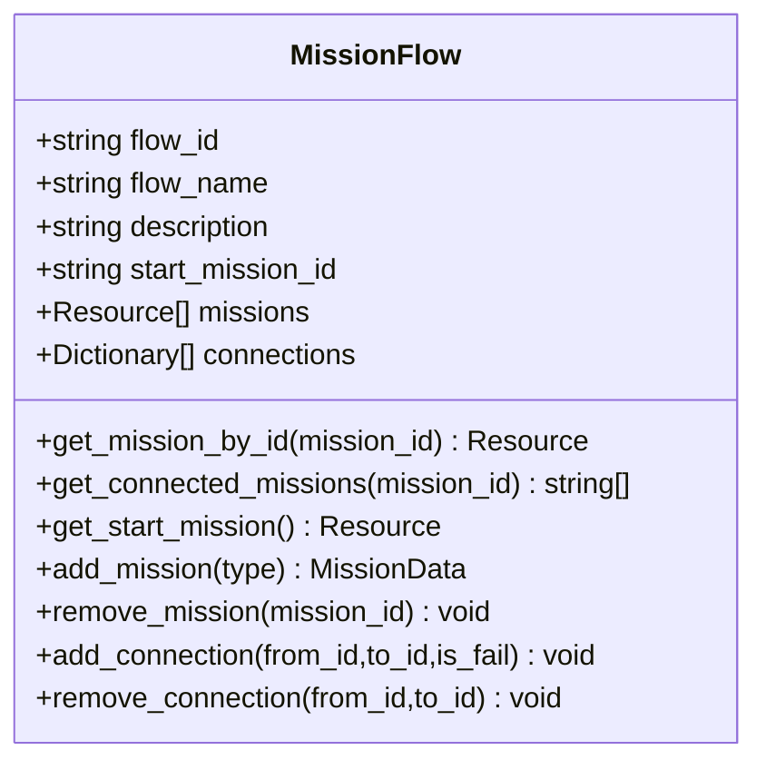

**Diagram sources**
- [mission_flow.gd:5-134](file://addons/mission_editor/mission_flow.gd#L5-L134)

**Section sources**
- [mission_flow.gd:1-134](file://addons/mission_editor/mission_flow.gd#L1-L134)

### MissionData (Objective Definition)
MissionData describes a single mission objective:
- type: ELIMINATE, COLLECT, REACH, ACTIVATE, SURVIVE, CUSTOM
- label, description, target
- mission_id, accent_color, show_progress_bar
- branching: on_success_next, on_fail_next
- commands: on_complete_commands, on_fail_commands
- fail_condition, time_limit, graph_position, tags

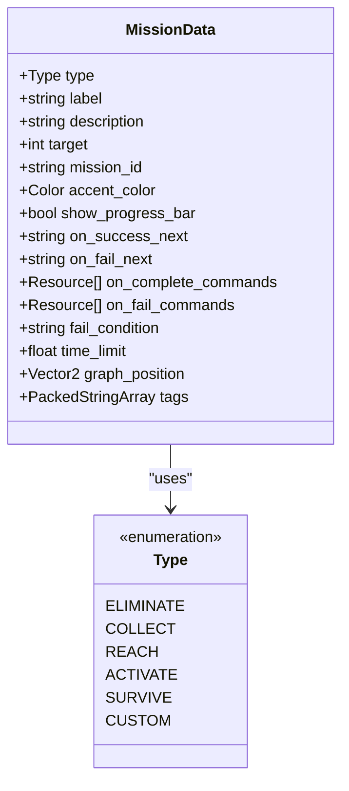

**Diagram sources**
- [mission_data.gd:7-66](file://Scripts/mission_data.gd#L7-L66)

**Section sources**
- [mission_data.gd:1-66](file://Scripts/mission_data.gd#L1-L66)

### MissionCommand (Scripted Actions)
MissionCommand defines executable actions:
- command_type: PLAY_SOUND, CHANGE_SCENE, SPAWN_ENEMIES, PLAY_ANIMATION, SET_VARIABLE, CALL_METHOD, SHOW_DIALOG, ENABLE_CHECKPOINT, DISABLE_CHECKPOINT, DELAY
- parameters: JSON dictionary depending on type
- delay: seconds before execution
- enabled: whether to execute
- description: human-readable label

Execution logic:
- _execute_commands iterates commands, respects delays, and emits command_executed
- _execute_single_command dispatches to typed handlers

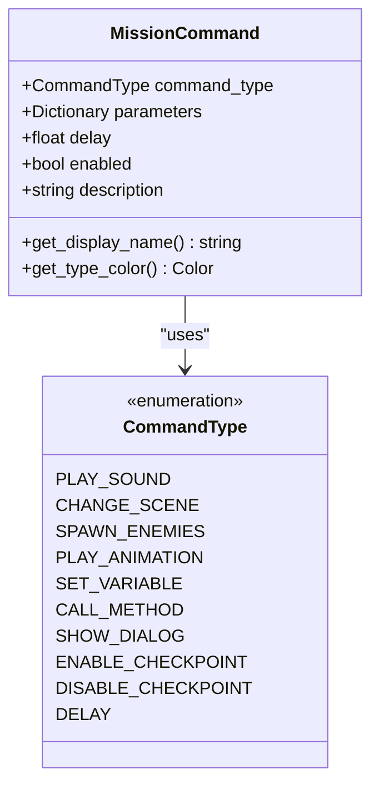

**Diagram sources**
- [mission_command.gd:8-98](file://addons/mission_editor/mission_command.gd#L8-L98)

**Section sources**
- [mission_command.gd:1-98](file://addons/mission_editor/mission_command.gd#L1-L98)

### MissionFlowPlayer (Runtime Orchestrator)
Responsibilities:
- Lifecycle: start_flow, stop_flow, clear_checkpoint_data
- State: current_flow, is_playing, current_mission_id
- Execution: _start_mission, _on_mission_completed, _on_mission_failed, _handle_time_expired
- Commands: _execute_commands, _execute_single_command and handlers
- Checkpoints: register/unregister, toggle visibility, track last checkpoint
- Jump/advance: jump_to_mission, force_advance

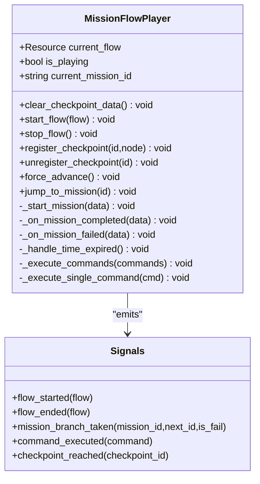

**Diagram sources**
- [mission_flow_player.gd:10-379](file://addons/mission_editor/mission_flow_player.gd#L10-L379)

**Section sources**
- [mission_flow_player.gd:1-379](file://addons/mission_editor/mission_flow_player.gd#L1-L379)

### MissionManager (HUD and Progress)
MissionManager coordinates:
- Signals: mission_started, mission_progress_changed, mission_completed, mission_failed, mission_cleared
- Methods: start(data), update_progress(amount), set_progress(value), complete(), fail(), clear()
- Factory helpers: make_eliminate, make_collect, make_reach, make_activate, make_survive, make_custom

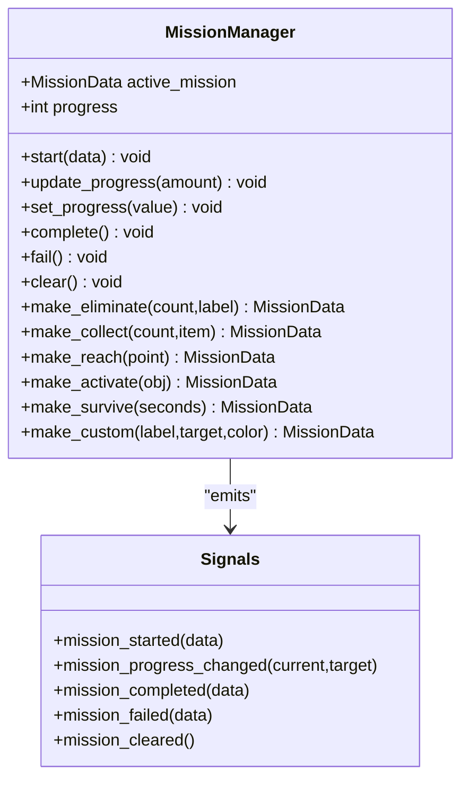

**Diagram sources**
- [mission_manager.gd:18-169](file://Scripts/mission_manager.gd#L18-L169)

**Section sources**
- [mission_manager.gd:1-169](file://Scripts/mission_manager.gd#L1-L169)

### CheckPoint (REACH/ACTIVATE Trigger)
CheckPoint integrates with the flow:
- Registers itself with MissionFlowPlayer on ready
- Emits checkpoint_reached signal on player enter
- Auto-completes active REACH/ACTIVATE missions whose IDs match
- Supports one-shot activation and runtime visual effects

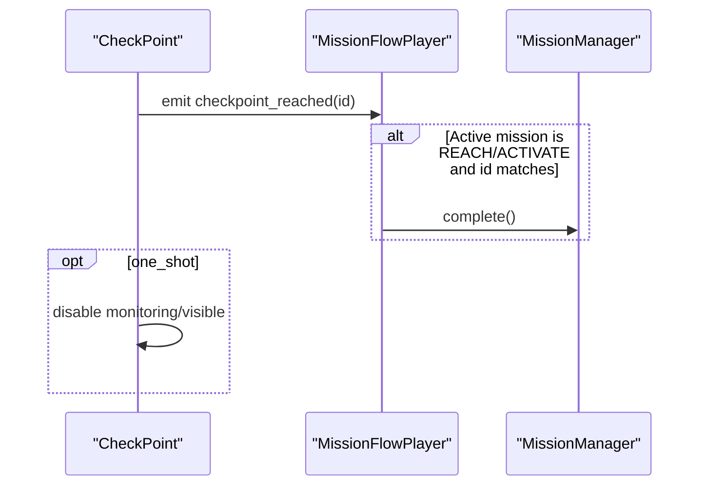

**Diagram sources**
- [checkpoint.gd:86-150](file://addons/mission_editor/checkpoint.gd#L86-L150)
- [mission_flow_player.gd:133-140](file://addons/mission_editor/mission_flow_player.gd#L133-L140)

**Section sources**
- [checkpoint.gd:1-231](file://addons/mission_editor/checkpoint.gd#L1-L231)

### Editor Dock (Visual Flow Designer)
The dock provides:
- Toolbar: New, Open, Save, Add Mission, Delete Mission
- Tabs: Flow Graph (GraphEdit), Mission List
- Inspector: Edit MissionData fields and branching
- Command Editor: Manage on_complete/on_fail commands
- Graph interactions: connect/disconnect nodes, delete nodes, select items

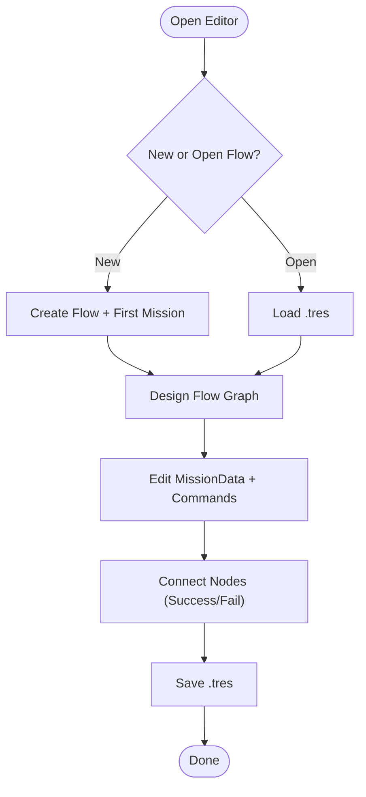

**Diagram sources**
- [editor_main.gd:133-171](file://addons/mission_editor/editor/editor_main.gd#L133-L171)
- [editor_main.gd:350-452](file://addons/mission_editor/editor/editor_main.gd#L350-L452)
- [editor_main.gd:557-652](file://addons/mission_editor/editor/editor_main.gd#L557-L652)

**Section sources**
- [editor_main.gd:1-778](file://addons/mission_editor/editor/editor_main.gd#L1-L778)

### Tutorial Flow Example
The example demonstrates:
- A linear tutorial chain with branching on combat failure
- Completion commands (sound, dialog, scene change)
- Checkpoint-based REACH objectives
- Time limits and retry loops

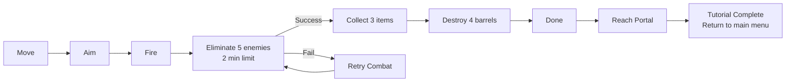

**Diagram sources**
- [example_tutorial_flow.gd:14-153](file://addons/mission_editor/examples/example_tutorial_flow.gd#L14-L153)

**Section sources**
- [example_tutorial_flow.gd:1-153](file://addons/mission_editor/examples/example_tutorial_flow.gd#L1-L153)

## Dependency Analysis
- Editor depends on MissionFlow and MissionCommand resources to render and edit flows.
- Runtime depends on MissionManager for mission lifecycle and on MissionFlow for navigation.
- CheckPoint depends on MissionFlowPlayer for registration and on MissionManager for completion.
- Plugin registers the dock, autoload, and custom node type.

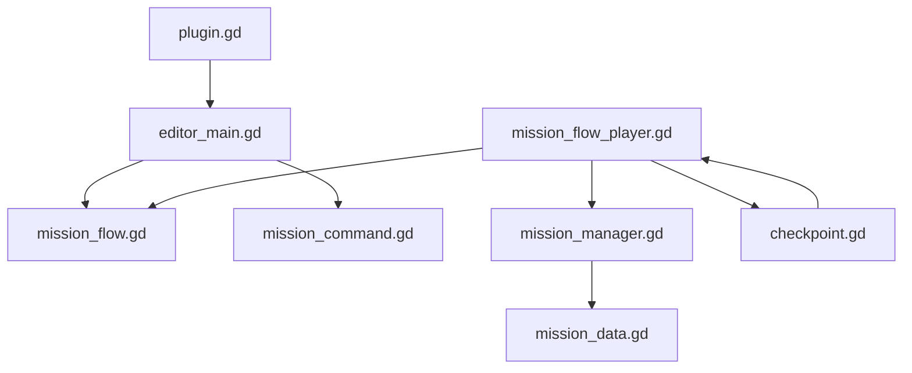

**Diagram sources**
- [plugin.gd:15-48](file://addons/mission_editor/plugin.gd#L15-L48)
- [mission_flow_player.gd:12-13](file://addons/mission_editor/mission_flow_player.gd#L12-L13)
- [checkpoint.gd:86-90](file://addons/mission_editor/checkpoint.gd#L86-L90)

**Section sources**
- [plugin.gd:1-109](file://addons/mission_editor/plugin.gd#L1-L109)
- [mission_flow_player.gd:1-379](file://addons/mission_editor/mission_flow_player.gd#L1-L379)
- [checkpoint.gd:1-231](file://addons/mission_editor/checkpoint.gd#L1-L231)

## Performance Considerations
- Minimize heavy commands during tight loops; batch operations where possible.
- Use delays judiciously to avoid blocking UI; keep dialogs short.
- Prefer lightweight audio players and avoid spawning many instances simultaneously.
- Keep mission chains linear where feasible to reduce branching complexity.
- Use checkpoints sparingly; excessive toggling can cause frequent redraws.
- Avoid long-running timers inside missions; rely on MissionFlowPlayer’s timer to fail fast.

[No sources needed since this section provides general guidance]

## Troubleshooting Guide
Common issues and resolutions:
- Flow does not start: verify MissionFlowPlayer is registered as autoload and that the flow resource is valid.
- Branching not triggered: ensure on_success_next/on_fail_next IDs exist and are set in MissionData.
- Commands not executing: confirm command.enabled is true and parameters are valid JSON.
- Checkpoint not completing: ensure checkpoint_id matches the active mission’s ID or label; verify one_shot is not prematurely disabling the node.
- Time limit not failing: ensure MissionData.time_limit is set and MissionFlowPlayer is running; verify no external code resets the timer.
- Signals not firing: connect to MissionFlowPlayer signals after startup; ensure the node exists in /root.

**Section sources**
- [mission_flow_player.gd:87-131](file://addons/mission_editor/mission_flow_player.gd#L87-L131)
- [checkpoint.gd:114-149](file://addons/mission_editor/checkpoint.gd#L114-L149)
- [mission_command.gd:38-45](file://addons/mission_editor/mission_command.gd#L38-L45)

## Conclusion
The mission flow system provides a robust framework for narrative-driven gameplay in top-down games. By combining visual flow design with flexible command scripting and checkpoint-based objectives, developers can create branching stories, dynamic challenges, and polished tutorials. Following the best practices outlined here ensures maintainable, performant, and debuggable flows.

[No sources needed since this section summarizes without analyzing specific files]

## Appendices

### Scripting Syntax and Command Sequences
- Command types and parameters are defined in MissionCommand.
- Commands execute in order with optional delays; each command emits command_executed.
- Typical sequences include sound cues, dialogs, scene transitions, and checkpoint toggles.

**Section sources**
- [mission_command.gd:8-36](file://addons/mission_editor/mission_command.gd#L8-L36)
- [mission_flow_player.gd:228-239](file://addons/mission_editor/mission_flow_player.gd#L228-L239)

### Conditional Logic Implementation
- MissionData.fail_condition allows custom failure conditions (text-based).
- Time limits in MissionData.time_limit trigger automatic failure via MissionFlowPlayer.
- CheckPoint auto-completion complements manual completion triggers.

**Section sources**
- [mission_data.gd:55-59](file://Scripts/mission_data.gd#L55-L59)
- [mission_flow_player.gd:218-222](file://addons/mission_editor/mission_flow_player.gd#L218-L222)
- [checkpoint.gd:130-143](file://addons/mission_editor/checkpoint.gd#L130-L143)

### Practical Examples
- Tutorial flow example demonstrates branching, retry loops, and post-completion actions.
- Use the example as a template for your own flows.

**Section sources**
- [example_tutorial_flow.gd:14-153](file://addons/mission_editor/examples/example_tutorial_flow.gd#L14-L153)