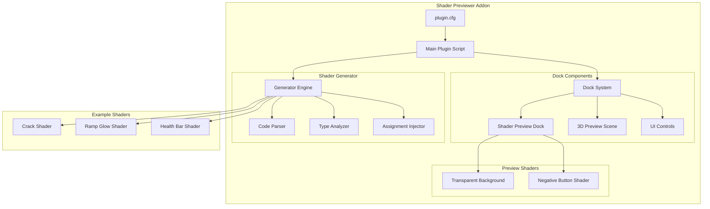
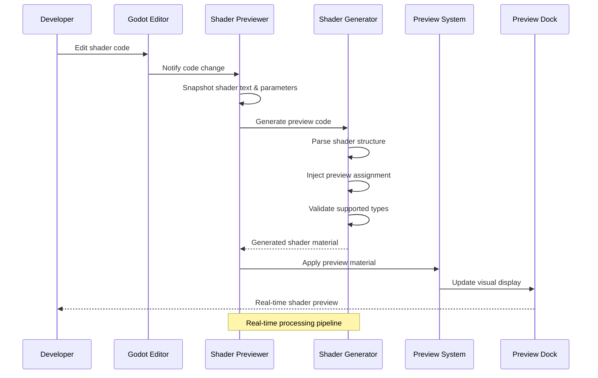
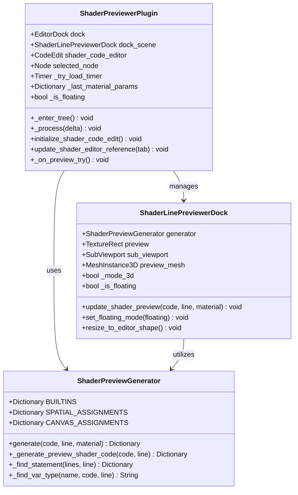
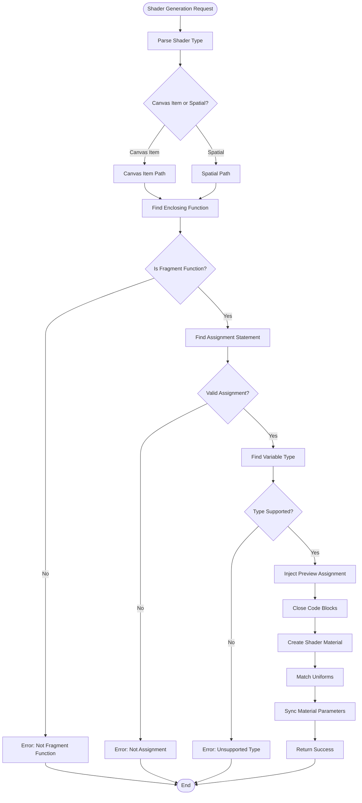
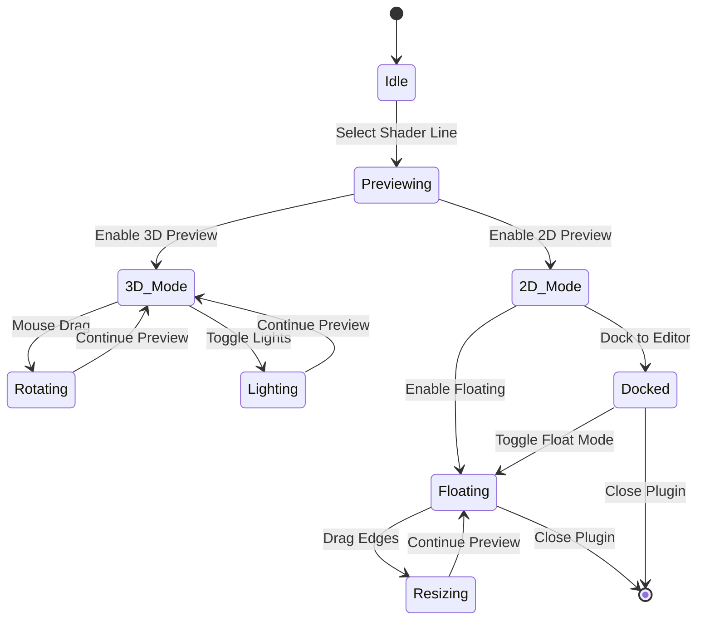
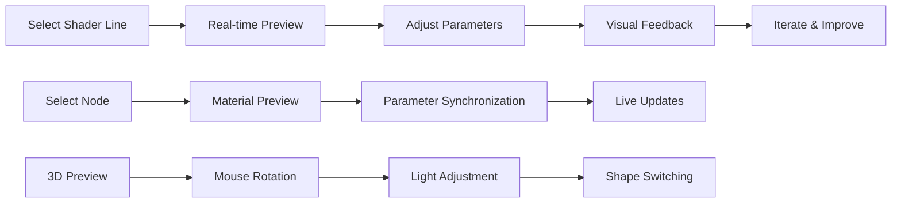
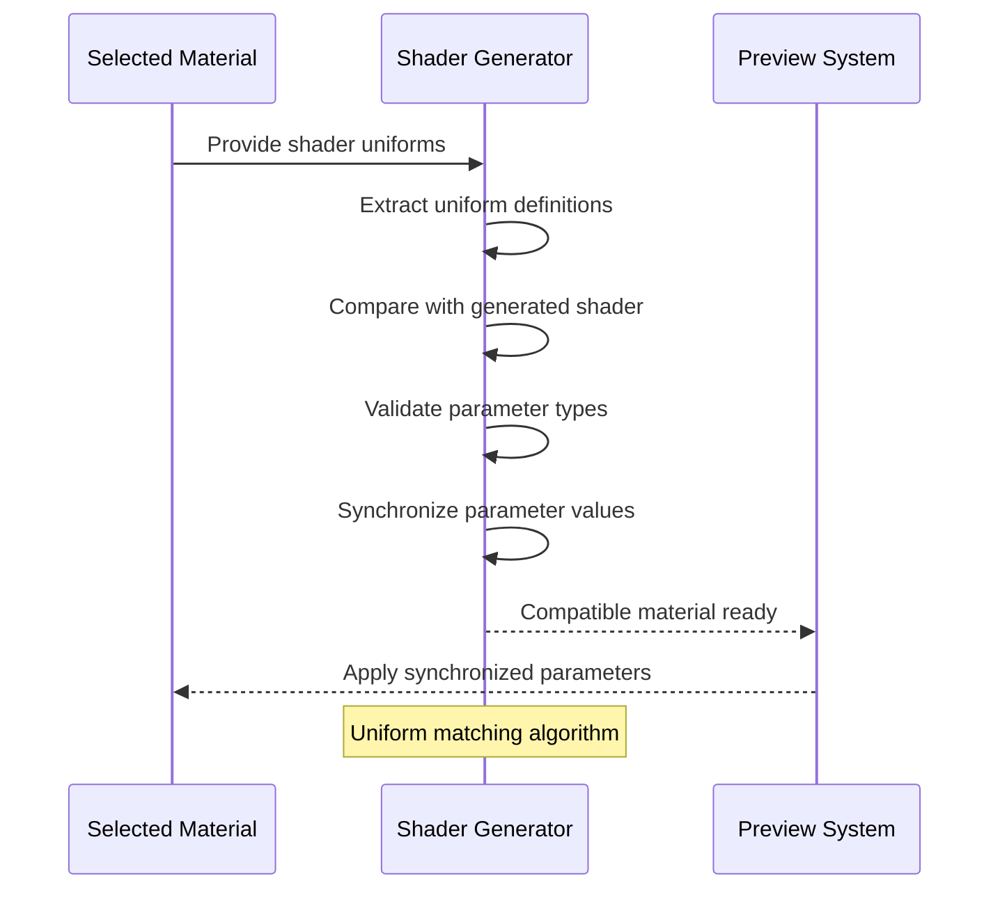
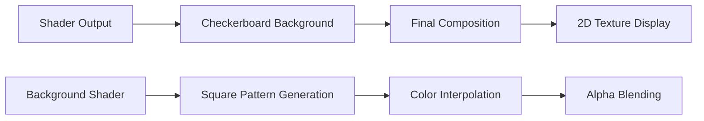

# Shader Previewer Addon

<cite>
**Referenced Files in This Document**
- [plugin.cfg](file://addons/shader-previewer/plugin.cfg)
- [shader_previewer.gd](file://addons/shader-previewer/shader_previewer.gd)
- [shader_previewer_dock.gd](file://addons/shader-previewer/shader_previewer_dock.gd)
- [shader_previewer_dock.tscn](file://addons/shader-previewer/shader_previewer_dock.tscn)
- [shader_previewer_generator.gd](file://addons/shader-previewer/shader_previewer_generator.gd)
- [preview_transparent_background.gdshader](file://addons/shader-previewer/preview_transparent_background.gdshader)
- [previewer_negative_buttons.gdshader](file://addons/shader-previewer/previewer_negative_buttons.gdshader)
- [crack_shader.gdshader](file://Shaders/crack_shader.gdshader)
- [ramp_glow.gdshader](file://Shaders/ramp_glow.gdshader)
- [health_bar.gdshader](file://Shaders/health_bar.gdshader)
</cite>

## Table of Contents
1. [Introduction](#introduction)
2. [Project Structure](#project-structure)
3. [Core Components](#core-components)
4. [Architecture Overview](#architecture-overview)
5. [Detailed Component Analysis](#detailed-component-analysis)
6. [Installation and Setup](#installation-and-setup)
7. [Shader Preview Interface](#shader-preview-interface)
8. [Shader Development Workflows](#shader-development-workflows)
9. [Material Testing Procedures](#material-testing-procedures)
10. [Visual Debugging Techniques](#visual-debugging-techniques)
11. [Preview Modes and Controls](#preview-modes-and-controls)
12. [Performance Optimization](#performance-optimization)
13. [Troubleshooting Guide](#troubleshooting-guide)
14. [Conclusion](#conclusion)

## Introduction

The Shader Previewer addon is a powerful real-time shader development and testing tool designed specifically for TFA Agents and the Godot engine. This plugin enables developers to instantly visualize and debug GLSL shaders while working in the Godot editor, providing immediate feedback on shader modifications without requiring scene recompilation or external tools.

The addon serves as a bridge between shader development and visual testing, allowing developers to:
- Preview shader effects in real-time as they write code
- Test materials against various 3D shapes and lighting conditions
- Debug shader logic through visual inspection
- Validate shader parameters and uniform values
- Compare different shader implementations side-by-side

This documentation provides comprehensive coverage of the plugin's installation, configuration, interface usage, and advanced development workflows for optimal shader creation and testing.

## Project Structure

The Shader Previewer addon follows a modular architecture with clear separation of concerns across multiple components:



**Diagram sources**
- [shader_previewer.gd:1-267](file://addons/shader-previewer/shader_previewer.gd#L1-L267)
- [shader_previewer_dock.gd:1-451](file://addons/shader-previewer/shader_previewer_dock.gd#L1-L451)
- [shader_previewer_generator.gd:1-301](file://addons/shader-previewer/shader_previewer_generator.gd#L1-L301)

**Section sources**
- [plugin.cfg:1-8](file://addons/shader-previewer/plugin.cfg#L1-L8)
- [shader_previewer.gd:25-77](file://addons/shader-previewer/shader_previewer.gd#L25-L77)

## Core Components

The Shader Previewer consists of several interconnected components that work together to provide seamless shader preview functionality:

### Main Plugin System
The core plugin extends Godot's EditorPlugin class and manages the overall lifecycle of the preview system. It handles editor integration, dock management, and real-time shader compilation.

### Shader Preview Dock
A sophisticated UI component that displays shader previews in either 2D or 3D modes. The dock supports floating mode, resizing, and positioning control for optimal developer workflow.

### Shader Generator Engine
An intelligent code parser that analyzes shader source code, identifies previewable assignments, and generates temporary shader variants for real-time visualization.

### Preview Shader Materials
Specialized shader materials that provide transparent backgrounds and UI contrast adjustment for optimal preview visibility.

**Section sources**
- [shader_previewer.gd:110-117](file://addons/shader-previewer/shader_previewer.gd#L110-L117)
- [shader_previewer_dock.gd:428-450](file://addons/shader-previewer/shader_previewer_dock.gd#L428-L450)
- [shader_previewer_generator.gd:75-102](file://addons/shader-previewer/shader_previewer_generator.gd#L75-L102)

## Architecture Overview

The Shader Previewer implements a sophisticated real-time preview architecture that processes shader code and generates visual feedback:



**Diagram sources**
- [shader_previewer.gd:51-66](file://addons/shader-previewer/shader_previewer.gd#L51-L66)
- [shader_previewer_generator.gd:75-102](file://addons/shader-previewer/shader_previewer_generator.gd#L75-L102)
- [shader_previewer_dock.gd:428-444](file://addons/shader-previewer/shader_previewer_dock.gd#L428-L444)

The architecture ensures minimal performance impact while providing instant visual feedback through careful code parsing and targeted shader modification.

## Detailed Component Analysis

### Main Plugin Script Analysis

The primary plugin script orchestrates the entire preview system through careful event handling and editor integration:



**Diagram sources**
- [shader_previewer.gd:1-267](file://addons/shader-previewer/shader_previewer.gd#L1-L267)
- [shader_previewer_dock.gd:1-451](file://addons/shader-previewer/shader_previewer_dock.gd#L1-L451)
- [shader_previewer_generator.gd:1-301](file://addons/shader-previewer/shader_previewer_generator.gd#L1-L301)

### Shader Generator Engine

The generator engine performs sophisticated shader analysis and code transformation:



**Diagram sources**
- [shader_previewer_generator.gd:107-162](file://addons/shader-previewer/shader_previewer_generator.gd#L107-L162)
- [shader_previewer_generator.gd:194-235](file://addons/shader-previewer/shader_previewer_generator.gd#L194-L235)

**Section sources**
- [shader_previewer_generator.gd:107-162](file://addons/shader-previewer/shader_previewer_generator.gd#L107-L162)
- [shader_previewer_generator.gd:194-235](file://addons/shader-previewer/shader_previewer_generator.gd#L194-L235)

### Preview Dock System

The preview dock provides a flexible interface for displaying shader results with multiple interaction modes:



**Diagram sources**
- [shader_previewer_dock.gd:108-133](file://addons/shader-previewer/shader_previewer_dock.gd#L108-L133)
- [shader_previewer_dock.gd:272-376](file://addons/shader-previewer/shader_previewer_dock.gd#L272-L376)

**Section sources**
- [shader_previewer_dock.gd:108-133](file://addons/shader-previewer/shader_previewer_dock.gd#L108-L133)
- [shader_previewer_dock.gd:272-376](file://addons/shader-previewer/shader_previewer_dock.gd#L272-L376)

## Installation and Setup

### Prerequisites
- Godot 4.x editor with GDScript support
- Basic understanding of shader programming concepts
- Access to the TFA Agents project structure

### Installation Steps

1. **Copy Addon Files**: Place the `shader-previewer` folder into your project's `addons/` directory
2. **Enable Plugin**: Go to Project Settings → Plugins and enable the Shader Previewer
3. **Restart Editor**: Restart Godot to properly load the plugin
4. **Verify Installation**: Check that "Shader Preview" appears in the editor docks

### Initial Configuration
The plugin automatically configures itself upon first use:
- Creates a dedicated dock in the right-bottom area
- Establishes connections with the TextShaderEditor
- Sets up floating mode by default for optimal workflow

**Section sources**
- [plugin.cfg:1-8](file://addons/shader-previewer/plugin.cfg#L1-L8)
- [shader_previewer.gd:25-49](file://addons/shader-previewer/shader_previewer.gd#L25-L49)

## Shader Preview Interface

### Interface Elements

The preview interface consists of several key components designed for optimal developer experience:

#### Preview Area
The central display area shows real-time shader results with transparent background support for accurate visualization.

#### Control Panel
Accessible when hovering over the preview area, featuring:
- **Floating Toggle**: Switch between docked and floating modes
- **Shape Selection**: Choose between sphere, cube, and quad preview geometry
- **Light Controls**: Toggle individual light sources in 3D mode
- **Movement Controls**: Drag to rotate 3D preview objects

#### Status Display
Shows helpful messages and error information during shader processing.

### Interaction Patterns



**Diagram sources**
- [shader_previewer_dock.gd:84-94](file://addons/shader-previewer/shader_previewer_dock.gd#L84-L94)
- [shader_previewer_dock.gd:445-450](file://addons/shader-previewer/shader_previewer_dock.gd#L445-L450)

**Section sources**
- [shader_previewer_dock.gd:84-94](file://addons/shader-previewer/shader_previewer_dock.gd#L84-L94)
- [shader_previewer_dock.gd:445-450](file://addons/shader-previewer/shader_previewer_dock.gd#L445-L450)

## Shader Development Workflows

### Real-time Development Cycle

The Shader Previewer enables an efficient iterative development process:

1. **Write Shader Code**: Develop shader logic in the TextShaderEditor
2. **Select Target Line**: Click on the assignment statement you want to preview
3. **Immediate Feedback**: See visual results in the preview dock
4. **Parameter Adjustment**: Modify shader parameters and observe changes
5. **Validation**: Test against different materials and scenarios

### Best Practices for Shader Development

#### Code Organization
- Keep previewable assignments focused and isolated
- Use meaningful variable names for easier debugging
- Structure shader logic for incremental testing

#### Performance Considerations
- Minimize expensive operations in frequently executed paths
- Use appropriate precision for calculations
- Consider computational complexity trade-offs

### Example Development Scenarios

#### Basic Parameter Testing
```glsl
// Example of a testable shader assignment
float intensity = sin(TIME) * 0.5 + 0.5;
ALBEDO = vec3(intensity);
```

#### Complex Mathematical Functions
```glsl
// Test procedural patterns
vec2 uv = UV * 10.0;
float pattern = sin(uv.x) * cos(uv.y);
COLOR = vec4(pattern, pattern, pattern, 1.0);
```

**Section sources**
- [shader_previewer_generator.gd:124-144](file://addons/shader-previewer/shader_previewer_generator.gd#L124-L144)
- [shader_previewer_generator.gd:237-260](file://addons/shader-previewer/shader_previewer_generator.gd#L237-L260)

## Material Testing Procedures

### Material Compatibility Testing

The plugin validates shader compatibility with existing materials before generating previews:



**Diagram sources**
- [shader_previewer_generator.gd:266-287](file://addons/shader-previewer/shader_previewer_generator.gd#L266-L287)
- [shader_previewer_generator.gd:289-300](file://addons/shader-previewer/shader_previewer_generator.gd#L289-L300)

### Testing Different Material Types

#### Canvas Item Materials
- Sprite materials with texture sampling
- UI overlay materials
- Particle effect materials

#### Spatial Materials
- 3D mesh materials with lighting
- Terrain rendering materials
- Post-processing effect materials

### Parameter Synchronization

The system automatically synchronizes material parameters to maintain realistic preview conditions:

| Parameter Type | Synchronization Method | Preview Impact |
|---------------|----------------------|----------------|
| Uniform Values | Direct value copying | Immediate visual changes |
| Texture References | Resource path preservation | Accurate texture sampling |
| Hint Parameters | Value range enforcement | Realistic parameter limits |

**Section sources**
- [shader_previewer_generator.gd:266-287](file://addons/shader-previewer/shader_previewer_generator.gd#L266-L287)
- [shader_previewer_generator.gd:289-300](file://addons/shader-previewer/shader_previewer_generator.gd#L289-L300)

## Visual Debugging Techniques

### Debug Visualization Methods

The Shader Previewer provides several techniques for effective shader debugging:

#### Assignment Injection Technique
The generator intelligently injects preview assignments into shader code to visualize intermediate values:

```glsl
// Original shader line
vec3 base_color = texture(TEXTURE, UV).rgb;

// Generated preview injection
vec3 base_color = texture(TEXTURE, UV).rgb;
ALBEDO = base_color; // Visual representation
```

#### Type Support Matrix
The system supports previewing of fundamental shader data types:

| Type | Canvas Item Support | Spatial Support | Preview Method |
|------|-------------------|-----------------|----------------|
| bool | ✅ | ✅ | Convert to grayscale |
| int | ✅ | ✅ | Convert to grayscale |
| float | ✅ | ✅ | Convert to grayscale |
| vec2 | ✅ | ✅ | Use red/green channels |
| vec3 | ✅ | ✅ | Use RGB channels |
| vec4 | ✅ | ✅ | Use RGBA channels |

#### Error Handling and Reporting

The system provides detailed error messages for common shader development issues:

- **Unsupported Shader Type**: Only canvas_item and spatial shaders are supported
- **Invalid Assignment**: Only direct assignment statements can be previewed
- **Type Mismatch**: Preview unavailable for unsupported data types
- **Missing Dependencies**: Node selection required for material preview

**Section sources**
- [shader_previewer_generator.gd:4-53](file://addons/shader-previewer/shader_previewer_generator.gd#L4-L53)
- [shader_previewer_generator.gd:141-144](file://addons/shader-previewer/shader_previewer_generator.gd#L141-L144)

## Preview Modes and Controls

### 2D Preview Mode

The default preview mode displays shader results against a checkerboard background for accurate transparency and alpha channel visualization:



**Diagram sources**
- [preview_transparent_background.gdshader:15-24](file://addons/shader-previewer/preview_transparent_background.gdshader#L15-L24)

### 3D Preview Mode

Advanced 3D preview capabilities enable realistic material testing with interactive lighting:

#### Geometry Options
- **Sphere**: Default geometry for general material testing
- **Cube**: Box geometry for surface detail examination
- **Quad**: Flat surface for 2D-like material evaluation

#### Lighting Controls
- **Light 1**: Front-right directional light
- **Light 2**: Bottom ambient light
- **Interactive Rotation**: Mouse drag to rotate preview object

#### Camera and Viewport
- **Fixed Camera Position**: Optimized for material preview
- **SubViewport Rendering**: Dedicated rendering context
- **Transparent Background**: Enables accurate material visualization

**Section sources**
- [shader_previewer_dock.gd:156-184](file://addons/shader-previewer/shader_previewer_dock.gd#L156-L184)
- [shader_previewer_dock.tscn:337-347](file://addons/shader-previewer/shader_previewer_dock.tscn#L337-L347)

### Floating vs Docked Modes

The plugin offers flexible positioning options:

#### Floating Mode Features
- Independent window that floats above the editor
- Customizable size and position
- Full-screen preview capability
- Resizable interface with visual feedback

#### Docked Mode Benefits
- Integrated with editor layout
- Consistent with other editor panels
- Automatic sizing with code editor
- Space-efficient for smaller screens

**Section sources**
- [shader_previewer_dock.gd:108-133](file://addons/shader-previewer/shader_previewer_dock.gd#L108-L133)
- [shader_previewer.gd:233-258](file://addons/shader-previewer/shader_previewer.gd#L233-L258)

## Performance Optimization

### Real-time Processing Efficiency

The Shader Previewer implements several optimization strategies to minimize performance impact:

#### Change Detection System
- **Smart Comparison**: Only updates when shader text, caret position, or material parameters change
- **Snapshot Mechanism**: Maintains state snapshots to detect meaningful changes
- **Debounced Updates**: Prevents excessive regeneration during rapid editing

#### Memory Management
- **Temporary Materials**: Generates preview materials that are discarded after use
- **Resource Cleanup**: Properly disposes of shader resources and textures
- **Reference Tracking**: Monitors editor component references to prevent memory leaks

### Rendering Optimizations

#### Efficient Shader Compilation
- **Selective Parsing**: Only processes the modified shader section
- **Code Injection**: Minimal code changes to maintain performance
- **Caching Strategy**: Reuses compiled shader variants when possible

#### Preview Quality Settings
- **SubViewport Configuration**: Optimized rendering settings for preview quality
- **Anti-aliasing Control**: Configurable AA settings for balancing quality and performance
- **Resolution Scaling**: Adapts preview resolution to available performance

### Editor Integration Optimizations

#### Event Handling
- **Signal Connections**: Efficient signal-based communication between components
- **Timer Management**: Controlled update intervals to prevent blocking the editor
- **Selection Monitoring**: Optimized node selection detection and caching

**Section sources**
- [shader_previewer.gd:51-66](file://addons/shader-previewer/shader_previewer.gd#L51-L66)
- [shader_previewer_dock.gd:389-404](file://addons/shader-previewer/shader_previewer_dock.gd#L389-L404)

## Troubleshooting Guide

### Common Issues and Solutions

#### Plugin Not Appearing
**Symptoms**: Shader Preview dock missing from editor
**Causes**: Plugin not enabled or installation incomplete
**Solutions**:
1. Verify plugin.cfg exists in addon directory
2. Check Project Settings → Plugins for Shader Previewer
3. Restart Godot editor completely

#### No Preview Updates
**Symptoms**: Changes to shader code don't reflect in preview
**Causes**: Editor connection issues or invalid shader syntax
**Solutions**:
1. Ensure TextShaderEditor is open and active
2. Check for syntax errors in shader code
3. Verify shader_type declaration is present
4. Confirm assignment statement is selected

#### Error Messages in Preview
**Common Error Messages**:
- "No shader_type statement found": Add proper shader_type declaration
- "Preview only supports canvas_item and spatial shaders": Use supported shader types
- "Preview only supports assignments in fragment() function": Move code to fragment()
- "Preview unavailable for current assignment": Check supported data types

#### Performance Issues
**Symptoms**: Slow response or editor lag during preview
**Causes**: Complex shader operations or frequent edits
**Solutions**:
1. Simplify shader expressions during development
2. Avoid heavy computations in previewable sections
3. Use fewer uniform parameters
4. Consider switching to docked mode for better performance

### Advanced Debugging Techniques

#### Shader Code Validation
Use the built-in error reporting to identify issues:
1. Check preview dock for error messages
2. Review shader syntax in TextShaderEditor
3. Verify uniform declarations match material parameters

#### Material Compatibility Verification
Ensure materials are compatible with preview generation:
1. Select a node using the target shader material
2. Verify material parameters match shader expectations
3. Check for missing texture or uniform resources

**Section sources**
- [shader_previewer_generator.gd:112-135](file://addons/shader-previewer/shader_previewer_generator.gd#L112-L135)
- [shader_previewer_dock.gd:407-419](file://addons/shader-previewer/shader_previewer_dock.gd#L407-L419)

## Conclusion

The Shader Previewer addon represents a significant advancement in shader development workflow for TFA Agents and Godot projects. By providing real-time visual feedback, comprehensive material testing capabilities, and intuitive debugging tools, it streamlines the often complex process of shader development.

Key benefits of the addon include:
- **Instant Visual Feedback**: Real-time shader preview eliminates guesswork
- **Material Compatibility**: Seamless integration with existing materials and nodes
- **Flexible Preview Modes**: Both 2D and 3D preview options for comprehensive testing
- **Performance Optimized**: Carefully designed architecture minimizes editor impact
- **Developer Friendly**: Intuitive interface with comprehensive error reporting

The plugin's modular architecture and robust error handling make it suitable for both beginners learning shader concepts and experienced developers implementing complex visual effects. Its integration with the Godot editor ecosystem ensures it fits naturally into existing development workflows while providing powerful capabilities for shader experimentation and refinement.

For optimal results, combine the Shader Previewer with established shader development best practices, including incremental testing, performance profiling, and systematic debugging approaches. The addon's comprehensive feature set positions it as an essential tool for anyone serious about developing high-quality shaders for TFA Agents and similar projects.