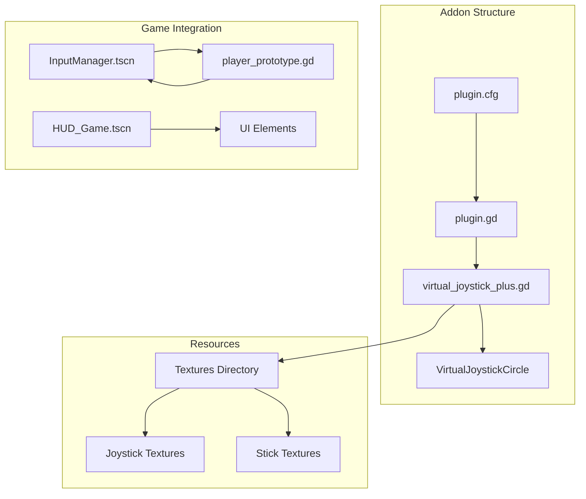
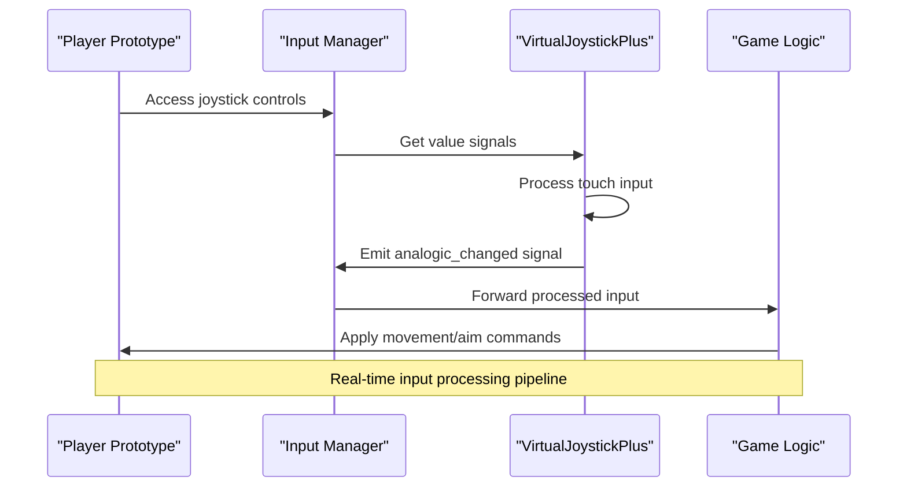
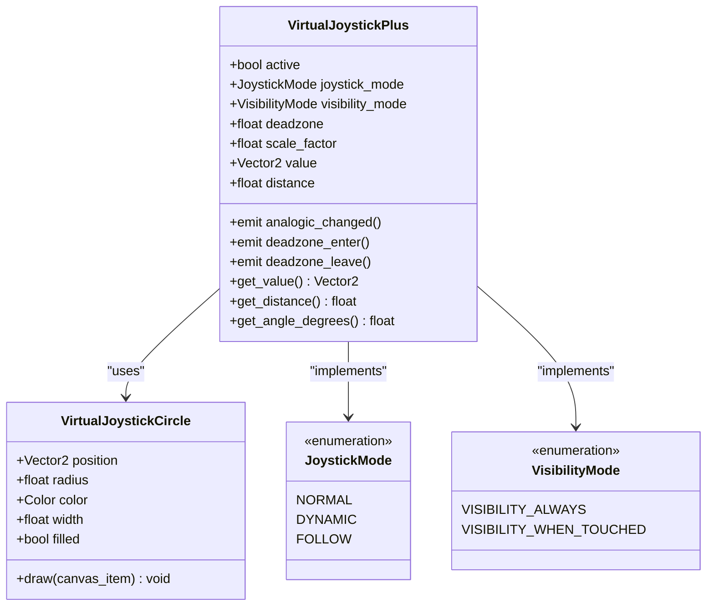
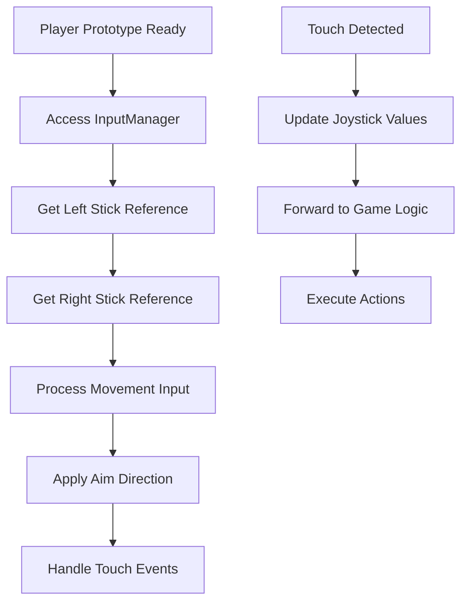

# Virtual Joystick Plus Addon

<cite>
**Referenced Files in This Document**
- [plugin.cfg](file://addons/virtual_joystick_plus/plugin.cfg)
- [plugin.gd](file://addons/virtual_joystick_plus/plugin.gd)
- [virtual_joystick_plus.gd](file://addons/virtual_joystick_plus/virtual_joystick_plus.gd)
- [InputManager.tscn](file://Game/InputManager.tscn)
- [input_manager.gd](file://Game/input_manager.gd)
- [HUD_Game.tscn](file://Menu/HUD/HUD_Game.tscn)
- [player_prototype.gd](file://Scripts/player_prototype.gd)
</cite>

## Table of Contents
1. [Introduction](#introduction)
2. [Project Structure](#project-structure)
3. [Core Components](#core-components)
4. [Architecture Overview](#architecture-overview)
5. [Detailed Component Analysis](#detailed-component-analysis)
6. [Installation and Setup](#installation-and-setup)
7. [Configuration and Customization](#configuration-and-customization)
8. [Integration Guide](#integration-guide)
9. [Mobile Game Development Best Practices](#mobile-game-development-best-practices)
10. [Performance Optimization](#performance-optimization)
11. [Troubleshooting Guide](#troubleshooting-guide)
12. [Conclusion](#conclusion)

## Introduction

Virtual Joystick Plus is a comprehensive Godot addon designed specifically for mobile game development, providing analog touch controls for TFA Agents. This lightweight yet fully configurable plugin enables developers to create responsive virtual joysticks that work seamlessly across different control schemes and device types.

The addon addresses the critical need for intuitive touch-based controls in mobile gaming, offering a robust solution for analog movement input, weapon aiming, and various other interactive elements. It provides extensive customization options while maintaining optimal performance characteristics essential for smooth gameplay experiences.

## Project Structure

The Virtual Joystick Plus addon follows a modular architecture within the TFA Agents project structure, integrating seamlessly with the existing game framework. The addon consists of several key components that work together to provide comprehensive touch control functionality.

**Diagram sources**
- [plugin.cfg:1-9](file://addons/virtual_joystick_plus/plugin.cfg#L1-L9)
- [plugin.gd:1-12](file://addons/virtual_joystick_plus/plugin.gd#L1-L12)
- [virtual_joystick_plus.gd:1-657](file://addons/virtual_joystick_plus/virtual_joystick_plus.gd#L1-L657)

**Section sources**
- [plugin.cfg:1-9](file://addons/virtual_joystick_plus/plugin.cfg#L1-L9)
- [plugin.gd:1-12](file://addons/virtual_joystick_plus/plugin.gd#L1-L12)

## Core Components

The Virtual Joystick Plus addon comprises several core components that work together to provide comprehensive touch control functionality:

### VirtualJoystickPlus Class
The main control class extends Godot's Control node and provides the primary interface for joystick functionality. It includes sophisticated touch handling, signal emission, and rendering capabilities.

### VirtualJoystickCircle Class
A specialized internal class responsible for rendering both the joystick base and the movable stick element. This class handles the visual representation and ensures proper scaling and positioning.

### Plugin System
The addon integrates with Godot's editor plugin system, allowing seamless addition of the VirtualJoystickPlus control to the editor's node creation menu.

**Section sources**
- [virtual_joystick_plus.gd:1-657](file://addons/virtual_joystick_plus/virtual_joystick_plus.gd#L1-L657)
- [plugin.gd:1-12](file://addons/virtual_joystick_plus/plugin.gd#L1-L12)

## Architecture Overview

The addon follows a layered architecture that separates concerns between touch input handling, visual rendering, and game integration:

**Diagram sources**
- [player_prototype.gd:29-31](file://Scripts/player_prototype.gd#L29-L31)
- [InputManager.tscn:10-47](file://Game/InputManager.tscn#L10-L47)
- [virtual_joystick_plus.gd:9-22](file://addons/virtual_joystick_plus/virtual_joystick_plus.gd#L9-L22)

The architecture ensures efficient input processing with minimal overhead, making it suitable for real-time mobile gaming scenarios.

## Detailed Component Analysis

### VirtualJoystickPlus Implementation

The core VirtualJoystickPlus class implements sophisticated touch handling with support for multiple interaction modes:

**Diagram sources**
- [virtual_joystick_plus.gd:5-104](file://addons/virtual_joystick_plus/virtual_joystick_plus.gd#L5-L104)
- [virtual_joystick_plus.gd:627-657](file://addons/virtual_joystick_plus/virtual_joystick_plus.gd#L627-L657)

### Touch Input Processing

The addon implements three distinct joystick modes to accommodate different control schemes:

#### NORMAL Mode
Classic fixed-position joystick that only responds to touches starting within its base area, providing traditional thumbstick behavior.

#### DYNAMIC Mode
Joystick appears at the touch position within the control area and remains fixed until release, enabling precise directional control.

#### FOLLOW Mode
Similar to DYNAMIC but with base movement following finger motion when reaching maximum radius, constrained within control boundaries.

**Section sources**
- [virtual_joystick_plus.gd:88-97](file://addons/virtual_joystick_plus/virtual_joystick_plus.gd#L88-L97)

### Signal System

The joystick emits multiple signals for comprehensive input feedback:

- `analogic_changed`: Provides normalized vector, distance, and angle data
- `deadzone_enter`: Triggered when input falls below deadzone threshold
- `deadzone_leave`: Triggered when input exceeds deadzone threshold

**Section sources**
- [virtual_joystick_plus.gd:9-22](file://addons/virtual_joystick_plus/virtual_joystick_plus.gd#L9-L22)

## Installation and Setup

### Plugin Registration

The Virtual Joystick Plus addon registers itself with Godot's editor through the plugin system, making it available in the node creation menu.

### Scene Integration

To integrate the joystick into your game scenes:

1. Create a CanvasLayer node named "InputManager"
2. Add VirtualJoystickPlus nodes as children for left and right control schemes
3. Configure positioning and appearance according to your design requirements

**Section sources**
- [plugin.gd:7-11](file://addons/virtual_joystick_plus/plugin.gd#L7-L11)
- [InputManager.tscn:8-47](file://Game/InputManager.tscn#L8-L47)

## Configuration and Customization

### Visual Customization Options

The addon provides extensive visual customization through multiple property categories:

#### Base Joystick Properties
- **Joystick Use Textures**: Toggle between textured and colored rendering
- **Preset Selection**: Choose from six available texture presets
- **Custom Textures**: Load custom joystick images
- **Base Color**: Set the solid color appearance
- **Opacity Control**: Adjust transparency levels
- **Border Settings**: Configure border width and appearance

#### Thumb Stick Properties
- **Stick Use Textures**: Toggle textured stick rendering
- **Preset Selection**: Choose from six stick texture presets
- **Custom Textures**: Load custom stick images
- **Stick Color**: Set the solid color appearance
- **Opacity Control**: Adjust stick transparency

### Positioning and Layout

The joystick supports flexible positioning through relative coordinate systems:

- **Relative Position**: Normalized coordinates (0.0-1.0) for flexible layout
- **Scale Factor**: Global scaling for different screen sizes
- **Only Mobile**: Automatic hiding on non-mobile platforms
- **Visibility Modes**: Always visible or touch-activated display

**Section sources**
- [virtual_joystick_plus.gd:196-274](file://addons/virtual_joystick_plus/virtual_joystick_plus.gd#L196-L274)

### Texture Packs

The addon includes six complete texture packs for both joysticks and sticks, providing diverse visual styles:

- **Preset 1-6**: Six distinct texture variations for joysticks
- **Preset 1-6**: Six corresponding stick texture variations
- **Default Textures**: Preloaded base textures for immediate use

**Section sources**
- [virtual_joystick_plus.gd:57-69](file://addons/virtual_joystick_plus/virtual_joystick_plus.gd#L57-L69)

## Integration Guide

### Game Script Integration

The player prototype demonstrates proper integration patterns:

**Diagram sources**
- [player_prototype.gd:29-31](file://Scripts/player_prototype.gd#L29-L31)
- [player_prototype.gd:272-287](file://Scripts/player_prototype.gd#L272-L287)

### Multiplayer Considerations

The integration supports multiplayer scenarios with proper authority handling and state synchronization.

**Section sources**
- [player_prototype.gd:73-85](file://Scripts/player_prototype.gd#L73-L85)

### HUD Integration

The addon works seamlessly with the game's HUD system, as demonstrated in the HUD scene integration.

**Section sources**
- [HUD_Game.tscn:1-312](file://Menu/HUD/HUD_Game.tscn#L1-L312)

## Mobile Game Development Best Practices

### Touch Interface Design

For optimal mobile gaming experiences, consider these design principles:

#### Size and Placement
- Ensure adequate touch target size for comfortable thumb interaction
- Position controls within easy reach of the player's dominant hand
- Consider landscape vs. portrait orientation requirements

#### Visual Feedback
- Provide clear visual indicators for active controls
- Implement appropriate haptic feedback for touch interactions
- Ensure sufficient contrast between controls and backgrounds

#### Responsiveness
- Minimize input latency through efficient signal processing
- Implement predictive input handling for smooth gameplay
- Optimize rendering performance for consistent frame rates

### Performance Considerations

The addon is optimized for mobile performance through several key mechanisms:

- Efficient touch event processing with minimal overhead
- Optimized rendering pipeline avoiding unnecessary redraws
- Memory-efficient texture management and caching
- Scalable performance across different device capabilities

## Performance Optimization

### Rendering Optimization

The VirtualJoystickPlus implements several rendering optimizations:

- **Conditional Redraw**: Only redraws when visibility or configuration changes
- **Efficient Transform Management**: Minimizes transform calculations during updates
- **Texture Caching**: Preloads and caches textures for quick access
- **Scaled Rendering**: Uses texture scaling instead of expensive resampling

### Input Processing Efficiency

The touch input system is designed for maximum efficiency:

- **Direct Event Handling**: Processes InputEventScreenTouch and InputEventScreenDrag efficiently
- **Minimal State Tracking**: Maintains only essential state variables
- **Optimized Calculations**: Uses vector math for efficient distance and angle calculations
- **Deadzone Optimization**: Early exit conditions for inactive input states

### Memory Management

The addon follows best practices for memory management:

- **Resource Preloading**: Loads textures during initialization to avoid runtime delays
- **Object Pooling**: Reuses internal objects where possible
- **Weak References**: Uses appropriate reference types to prevent memory leaks
- **Cleanup Procedures**: Proper cleanup during node removal or scene changes

## Troubleshooting Guide

### Common Issues and Solutions

#### Joystick Not Responding
- Verify the `active` property is set to `true`
- Check that the control area covers the intended touch region
- Ensure proper scene hierarchy with InputManager as parent

#### Visual Display Problems
- Confirm texture files are properly imported and accessible
- Verify texture dimensions match expected aspect ratios
- Check opacity settings for visibility issues

#### Performance Issues
- Reduce texture resolution for lower-end devices
- Disable unused visual effects like antialiasing
- Monitor for excessive redraw calls in the editor

#### Multiplatform Compatibility
- Use the `only_mobile` property to hide controls on desktop
- Test touch responsiveness across different device types
- Verify proper scaling on various screen densities

**Section sources**
- [virtual_joystick_plus.gd:375-383](file://addons/virtual_joystick_plus/virtual_joystick_plus.gd#L375-L383)

### Debugging Techniques

For debugging touch control issues:

1. **Signal Monitoring**: Connect to `analogic_changed` to monitor input values
2. **State Inspection**: Check `_in_deadzone` and `_click_in` properties
3. **Event Logging**: Monitor touch event processing in `_gui_input`
4. **Performance Profiling**: Use Godot's profiler to identify bottlenecks

## Conclusion

Virtual Joystick Plus provides a comprehensive solution for mobile touch controls in TFA Agents, offering developers the flexibility to create intuitive and responsive touch interfaces. Its modular architecture, extensive customization options, and performance optimizations make it an ideal choice for mobile game development.

The addon successfully bridges the gap between traditional desktop input methods and modern touch-based interactions, enabling developers to create engaging mobile gaming experiences without sacrificing performance or visual quality. Its integration with the existing TFA Agents framework demonstrates the importance of thoughtful plugin design and seamless ecosystem integration.

Through careful attention to mobile-specific considerations, the addon delivers a robust foundation for touch-based gameplay mechanics while maintaining compatibility with the broader game development workflow.