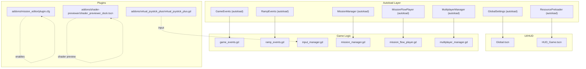
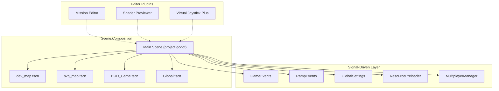
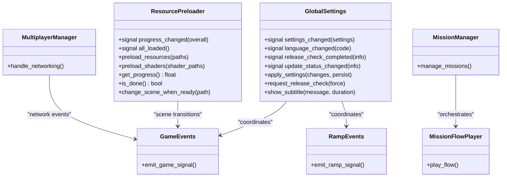
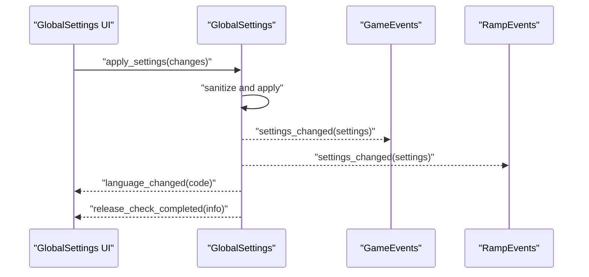
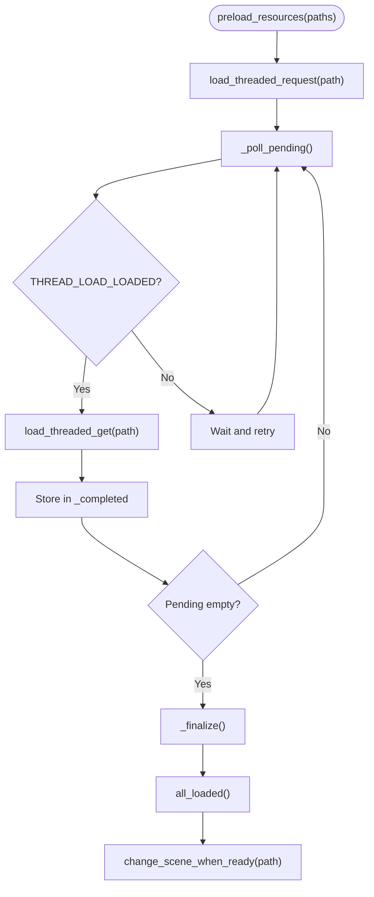
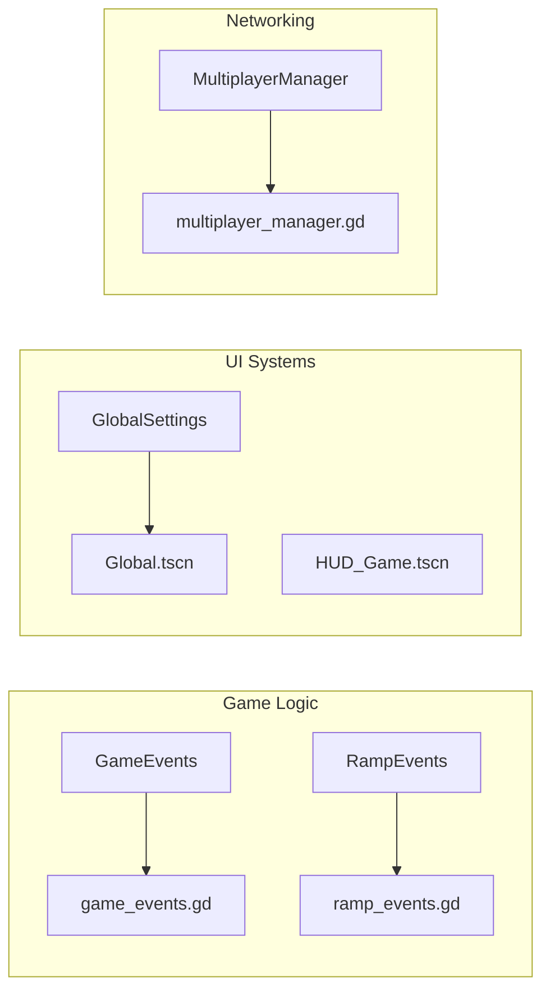
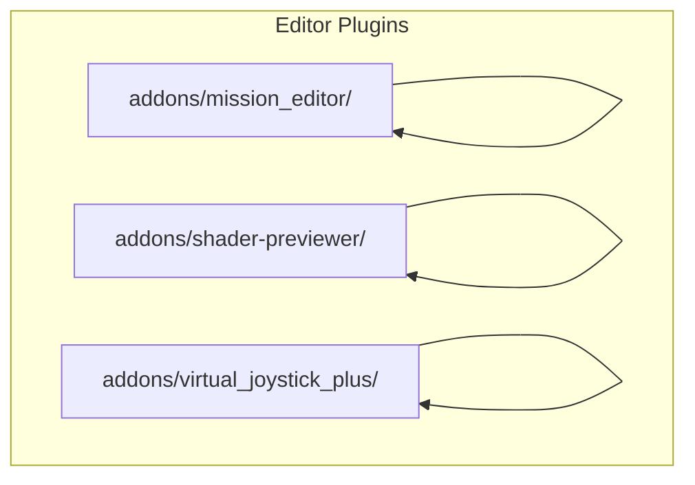
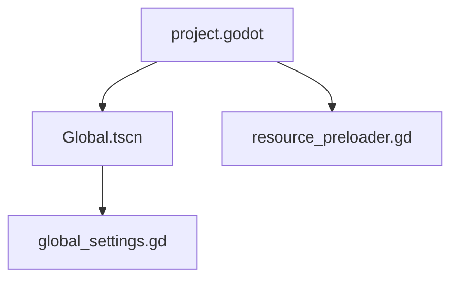

# Architecture Overview

<cite>
**Referenced Files in This Document**
- [project.godot](file://project.godot)
- [Global.tscn](file://Global.tscn)
- [global_settings.gd](file://Scripts/global_settings.gd)
- [resource_preloader.gd](file://Scripts/resource_preloader.gd)
- [input_manager.gd](file://Game/input_manager.gd)
- [game_events.gd](file://Scripts/game_events.gd)
- [ramp_events.gd](file://Scripts/ramp_events.gd)
- [multiplayer_manager.gd](file://Scripts/multiplayer_manager.gd)
- [mission_manager.gd](file://Scripts/mission_manager.gd)
- [mission_flow_player.gd](file://Scripts/mission_flow_player.gd)
- [plugin.cfg](file://addons/mission_editor/plugin.cfg)
- [shader_previewer_dock.tscn](file://addons/shader-previewer/shader_previewer_dock.tscn)
- [virtual_joystick_plus.gd](file://addons/virtual_joystick_plus/virtual_joystick_plus.gd)
</cite>

## Table of Contents
1. [Introduction](#introduction)
2. [Project Structure](#project-structure)
3. [Core Components](#core-components)
4. [Architecture Overview](#architecture-overview)
5. [Detailed Component Analysis](#detailed-component-analysis)
6. [Dependency Analysis](#dependency-analysis)
7. [Performance Considerations](#performance-considerations)
8. [Troubleshooting Guide](#troubleshooting-guide)
9. [Conclusion](#conclusion)

## Introduction
This document describes the high-level architecture of TFA Agents, focusing on scene-based composition, signal-driven communication, and component-based organization. It documents the autoload system, resource management strategies, inter-component communication mechanisms, and the separation of concerns between game logic, UI systems, and networking. Architectural patterns such as observer pattern for signals, factory pattern for scene instantiation, and singleton pattern for resource management are identified. The plugin architecture for mission editing and shader development tools is also covered.

## Project Structure
The project is organized around Godot’s scene-centric workflow with autoloaded singletons and modular scripts. Key areas:
- Autoloaded managers and events: centralized orchestration for settings, missions, ramps, and scenes.
- UI and HUD: global overlay and HUD scenes with dedicated scripts.
- Game logic: modular scripts for gameplay mechanics, events, and multiplayer.
- Plugins: editor extensions for mission authoring and shader previewing.

**Diagram sources**
- [project.godot:23-31](file://project.godot#L23-L31)
- [Global.tscn:1-32](file://Global.tscn#L1-L32)
- [input_manager.gd:1-2](file://Game/input_manager.gd#L1-L2)
- [plugin.cfg](file://addons/mission_editor/plugin.cfg)

**Section sources**
- [project.godot:11-16](file://project.godot#L11-L16)
- [project.godot:23-31](file://project.godot#L23-L31)
- [project.godot:37-39](file://project.godot#L37-L39)

## Core Components
- Autoloaded Managers and Events
  - GameEvents and RampEvents act as central signal hubs for gameplay and ramp-related actions.
  - MissionManager and MissionFlowPlayer coordinate scripted sequences and flow playback.
  - MultiplayerManager handles networking concerns and state synchronization.
  - ResourcePreloader is a singleton responsible for asynchronous resource preloading and scene transitions.
  - GlobalSettings is a singleton managing application-wide settings, UI scaling, audio, and release checks.

- UI and HUD
  - Global.tscn defines a persistent CanvasLayer with an FPS overlay and theme integration.
  - HUD_Game.tscn provides in-game HUD elements and integrates with GlobalSettings for subtitles and overlays.

- Plugin Architecture
  - Mission Editor plugin for designing scripted sequences.
  - Shader Previewer plugin for developing and previewing shaders.
  - Virtual Joystick Plus plugin for mobile-friendly input.

**Section sources**
- [project.godot:23-31](file://project.godot#L23-L31)
- [Global.tscn:1-32](file://Global.tscn#L1-L32)
- [global_settings.gd:1-618](file://Scripts/global_settings.gd#L1-L618)
- [resource_preloader.gd:1-226](file://Scripts/resource_preloader.gd#L1-L226)

## Architecture Overview
The system follows a scene-first composition model with autoload singletons providing cross-scene services. Signals propagate events across components, enabling loose coupling. ResourcePreloader ensures smooth scene transitions by warming up resources asynchronously. Plugins extend editor capabilities for mission creation and shader development.

**Diagram sources**
- [project.godot:13-15](file://project.godot#L13-L15)
- [project.godot:23-31](file://project.godot#L23-L31)
- [plugin.cfg](file://addons/mission_editor/plugin.cfg)

## Detailed Component Analysis

### Autoload System and Singletons
- GlobalSettings
  - Singleton managing settings persistence, language, graphics presets, UI scaling, and release checks.
  - Emits signals for settings changes and language updates.
  - Applies settings to engine, display, audio, and theme subsystems.

- ResourcePreloader
  - Singleton coordinating asynchronous resource loading and shader warm-up.
  - Provides progress reporting and triggers scene transitions when ready.
  - Uses polling to avoid blocking during threaded loading.

- MissionManager and MissionFlowPlayer
  - MissionManager orchestrates scripted missions and mission data.
  - MissionFlowPlayer executes scripted sequences and interacts with gameplay systems.

- MultiplayerManager
  - Handles networking concerns and state synchronization across clients.

- GameEvents and RampEvents
  - Centralized signal emitters for game and ramp-related events.

**Diagram sources**
- [global_settings.gd:1-618](file://Scripts/global_settings.gd#L1-L618)
- [resource_preloader.gd:1-226](file://Scripts/resource_preloader.gd#L1-L226)
- [mission_manager.gd](file://Scripts/mission_manager.gd)
- [mission_flow_player.gd](file://Scripts/mission_flow_player.gd)
- [multiplayer_manager.gd](file://Scripts/multiplayer_manager.gd)
- [game_events.gd](file://Scripts/game_events.gd)
- [ramp_events.gd](file://Scripts/ramp_events.gd)

**Section sources**
- [global_settings.gd:1-618](file://Scripts/global_settings.gd#L1-L618)
- [resource_preloader.gd:1-226](file://Scripts/resource_preloader.gd#L1-L226)
- [project.godot:23-31](file://project.godot#L23-L31)

### Signal-Driven Communication Patterns
- Observer Pattern via Signals
  - Components emit signals (e.g., settings_changed, release_check_completed) to notify subscribers.
  - Subscribers connect to signals to react to state changes without tight coupling.
  - Example: GlobalSettings emits language_changed to update UI and audio settings.

- Event Propagation
  - GameEvents and RampEvents centralize event emission for gameplay and ramp logic.
  - Other components subscribe to these events to maintain separation of concerns.

**Diagram sources**
- [global_settings.gd:164-185](file://Scripts/global_settings.gd#L164-L185)
- [game_events.gd](file://Scripts/game_events.gd)
- [ramp_events.gd](file://Scripts/ramp_events.gd)

**Section sources**
- [global_settings.gd:3-11](file://Scripts/global_settings.gd#L3-L11)
- [project.godot:23-31](file://project.godot#L23-L31)

### Factory Pattern for Scene Instantiation
- ResourcePreloader coordinates scene preloading and transitions.
- It acts as a factory for “ready-to-use” scenes by caching PackedScene instances after threaded loading.
- Scene transitions leverage change_scene_to_packed when available for performance.

**Diagram sources**
- [resource_preloader.gd:77-103](file://Scripts/resource_preloader.gd#L77-L103)
- [resource_preloader.gd:165-192](file://Scripts/resource_preloader.gd#L165-L192)
- [resource_preloader.gd:194-207](file://Scripts/resource_preloader.gd#L194-L207)
- [resource_preloader.gd:216-226](file://Scripts/resource_preloader.gd#L216-L226)

**Section sources**
- [resource_preloader.gd:77-103](file://Scripts/resource_preloader.gd#L77-L103)
- [resource_preloader.gd:165-192](file://Scripts/resource_preloader.gd#L165-L192)
- [resource_preloader.gd:216-226](file://Scripts/resource_preloader.gd#L216-L226)

### Separation of Concerns
- Game Logic
  - Managed by modular scripts (e.g., game_events.gd, ramp_events.gd) emitting signals consumed by other systems.
- UI Systems
  - Global.tscn and HUD scenes provide overlays and controls; GlobalSettings manages UI scaling and theme.
- Networking
  - MultiplayerManager encapsulates network concerns and integrates with GameEvents for synchronized state.

**Diagram sources**
- [project.godot:23-31](file://project.godot#L23-L31)
- [Global.tscn:1-32](file://Global.tscn#L1-L32)
- [global_settings.gd:1-618](file://Scripts/global_settings.gd#L1-L618)
- [multiplayer_manager.gd](file://Scripts/multiplayer_manager.gd)

**Section sources**
- [project.godot:23-31](file://project.godot#L23-L31)
- [Global.tscn:1-32](file://Global.tscn#L1-L32)
- [global_settings.gd:1-618](file://Scripts/global_settings.gd#L1-L618)

### Plugin Architecture for Mission Editing and Shader Development
- Mission Editor
  - Adds a dedicated editor dock and tools for designing scripted sequences.
  - Enabled via editor_plugins configuration.

- Shader Previewer
  - Provides a dock for previewing shaders with interactive materials and geometry.
  - Includes assets and generator scripts for quick iteration.

- Virtual Joystick Plus
  - Mobile-friendly input abstraction integrated with input_manager.gd.

**Diagram sources**
- [project.godot:37-39](file://project.godot#L37-L39)
- [plugin.cfg](file://addons/mission_editor/plugin.cfg)
- [shader_previewer_dock.tscn](file://addons/shader-previewer/shader_previewer_dock.tscn)
- [virtual_joystick_plus.gd](file://addons/virtual_joystick_plus/virtual_joystick_plus.gd)

**Section sources**
- [project.godot:37-39](file://project.godot#L37-L39)
- [plugin.cfg](file://addons/mission_editor/plugin.cfg)

## Dependency Analysis
- Autoload dependencies
  - Global.tscn depends on global_settings.gd script and global_theme.tres.
  - Autoload entries define cross-scene singletons and their initialization order.
- Runtime dependencies
  - ResourcePreloader depends on Godot’s ResourceLoader threading APIs.
  - GlobalSettings depends on AudioServer, DisplayServer, and TranslationServer.
- Plugin dependencies
  - Editor plugins are enabled via project.godot and integrate with the editor UI.

**Diagram sources**
- [project.godot:23-31](file://project.godot#L23-L31)
- [Global.tscn:3-9](file://Global.tscn#L3-L9)
- [global_settings.gd:1-618](file://Scripts/global_settings.gd#L1-L618)
- [resource_preloader.gd:1-226](file://Scripts/resource_preloader.gd#L1-L226)

**Section sources**
- [project.godot:23-31](file://project.godot#L23-L31)
- [Global.tscn:3-9](file://Global.tscn#L3-L9)
- [global_settings.gd:1-618](file://Scripts/global_settings.gd#L1-L618)
- [resource_preloader.gd:1-226](file://Scripts/resource_preloader.gd#L1-L226)

## Performance Considerations
- Asynchronous Resource Loading
  - ResourcePreloader avoids blocking the main thread by polling load_threaded status and deferring scene changes until resources are ready.
- Graphics Presets
  - GlobalSettings applies graphics presets to nodes dynamically, adjusting light energy and glow visibility to balance quality and performance.
- Input Emulation
  - Virtual Joystick Plus supports touch emulation for mouse devices, improving UX on mobile targets.

[No sources needed since this section provides general guidance]

## Troubleshooting Guide
- Settings Not Persisting
  - Verify settings are saved to the expected path and sections in the ConfigFile.
  - Ensure settings_changed is emitted after applying changes.

- Release Check Failures
  - Check network connectivity and API host/port configuration.
  - Validate JSON parsing and version comparison logic.

- Scene Transition Delays
  - Confirm ResourcePreloader is initialized and emitting progress.
  - Ensure change_scene_when_ready is called after all_loaded is emitted.

- Plugin Not Appearing
  - Verify plugin.cfg is present and editor_plugins includes the plugin path.

**Section sources**
- [global_settings.gd:226-244](file://Scripts/global_settings.gd#L226-L244)
- [global_settings.gd:406-522](file://Scripts/global_settings.gd#L406-L522)
- [resource_preloader.gd:194-207](file://Scripts/resource_preloader.gd#L194-L207)
- [project.godot:37-39](file://project.godot#L37-L39)

## Conclusion
TFA Agents employs a clean, scene-first architecture with autoload singletons providing centralized services. Signals enable decoupled communication across game logic, UI, and networking. ResourcePreloader ensures smooth transitions through asynchronous loading and caching. The plugin architecture extends authoring and development workflows. Together, these patterns deliver a scalable and maintainable foundation for gameplay, UI, and tooling.