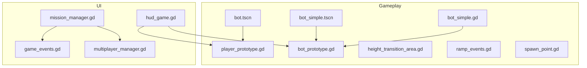
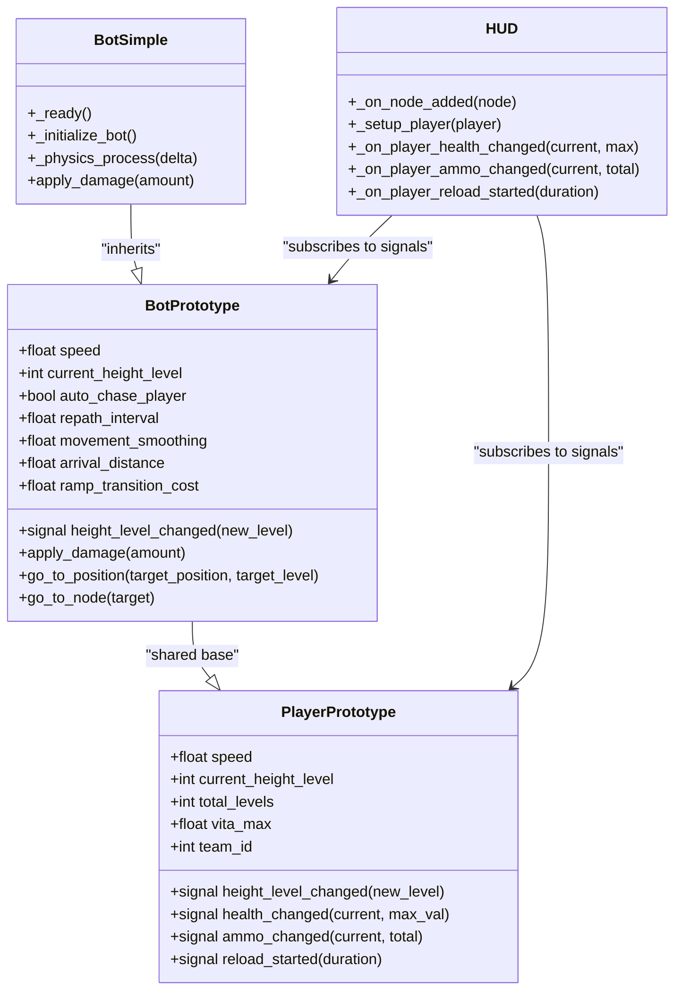
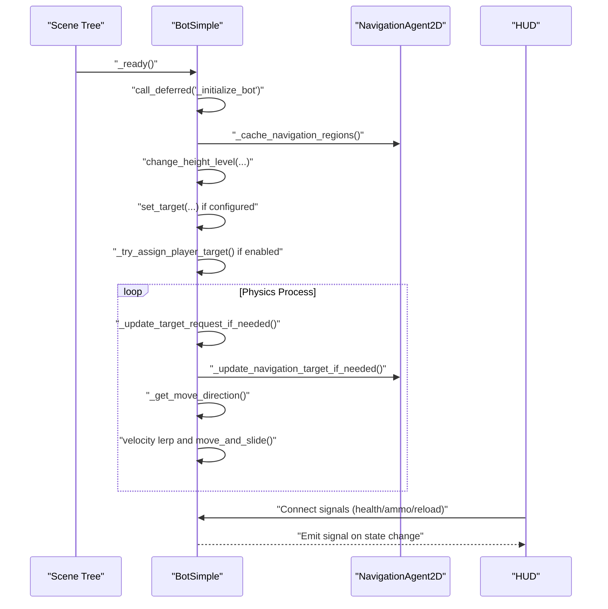
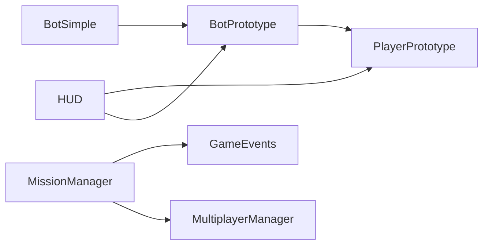

# Component-Based System Design

<cite>
**Referenced Files in This Document**
- [player_prototype.gd](file://Scripts/player_prototype.gd)
- [bot_prototype.gd](file://Scripts/bot_prototype.gd)
- [bot_simple.gd](file://Scripts/bot_simple.gd)
- [bot.tscn](file://bot.tscn)
- [bot_simple.tscn](file://bot_simple.tscn)
- [hud_game.gd](file://Menu/HUD/hud_game.gd)
- [game_events.gd](file://Scripts/game_events.gd)
- [multiplayer_manager.gd](file://Scripts/multiplayer_manager.gd)
- [mission_manager.gd](file://Scripts/mission_manager.gd)
- [spawn_point.gd](file://Scripts/spawn_point.gd)
- [height_transition_area.gd](file://Scripts/height_transition_area.gd)
- [ramp_events.gd](file://Scripts/ramp_events.gd)
</cite>

## Table of Contents
1. [Introduction](#introduction)
2. [Project Structure](#project-structure)
3. [Core Components](#core-components)
4. [Architecture Overview](#architecture-overview)
5. [Detailed Component Analysis](#detailed-component-analysis)
6. [Dependency Analysis](#dependency-analysis)
7. [Performance Considerations](#performance-considerations)
8. [Troubleshooting Guide](#troubleshooting-guide)
9. [Conclusion](#conclusion)

## Introduction
This document explains the component-based architecture used by TFA Agents, focusing on how game objects are composed from reusable components, the relationship between base prototypes (player_prototype and bot_prototype) and specialized implementations, and how components communicate via signals and direct method calls. It also covers lifecycle management, initialization order, dependency relationships, and practical patterns for extending behavior through composition and inheritance.

## Project Structure
TFA Agents organizes gameplay logic around prototype scripts that define shared capabilities and specialized scene configurations that attach these prototypes as scripts. UI and gameplay systems are modularized into separate scripts and scenes, enabling reuse and clear separation of concerns.

**Diagram sources**
- [player_prototype.gd:1-27](file://Scripts/player_prototype.gd#L1-L27)
- [bot_prototype.gd:1-125](file://Scripts/bot_prototype.gd#L1-L125)
- [bot_simple.gd:35-301](file://Scripts/bot_simple.gd#L35-L301)
- [bot.tscn:1-31](file://bot.tscn#L1-L31)
- [bot_simple.tscn:1-31](file://bot_simple.tscn#L1-L31)
- [hud_game.gd:63-91](file://Menu/HUD/hud_game.gd#L63-L91)
- [game_events.gd:1-50](file://Scripts/game_events.gd#L1-L50)
- [multiplayer_manager.gd:1-50](file://Scripts/multiplayer_manager.gd#L1-L50)
- [mission_manager.gd:1-50](file://Scripts/mission_manager.gd#L1-L50)
- [height_transition_area.gd:1-50](file://Scripts/height_transition_area.gd#L1-L50)
- [ramp_events.gd:1-50](file://Scripts/ramp_events.gd#L1-L50)
- [spawn_point.gd:1-50](file://Scripts/spawn_point.gd#L1-L50)

**Section sources**
- [player_prototype.gd:1-27](file://Scripts/player_prototype.gd#L1-L27)
- [bot_prototype.gd:1-125](file://Scripts/bot_prototype.gd#L1-L125)
- [bot_simple.gd:35-301](file://Scripts/bot_simple.gd#L35-L301)
- [bot.tscn:1-31](file://bot.tscn#L1-L31)
- [bot_simple.tscn:1-31](file://bot_simple.tscn#L1-L31)
- [hud_game.gd:63-91](file://Menu/HUD/hud_game.gd#L63-L91)

## Core Components
This section introduces the foundational building blocks that compose agents and gameplay systems.

- Player Prototype
  - Defines shared agent attributes and signals for health, ammo, reload, and height transitions.
  - Provides exported properties for movement, combat, and visual parameters.
  - Serves as the base for player-controlled agents.

- Bot Prototype
  - Extends the agent foundation with AI-driven movement, navigation, targeting, and ramp traversal logic.
  - Exposes configuration for pathfinding, smoothing, collision, and targeting behaviors.
  - Offers public methods for navigation commands and damage handling.

- Bot Simple
  - Specialized bot implementation that inherits from the bot prototype.
  - Adds runtime initialization, group membership, automatic target assignment, and physics-driven movement.
  - Demonstrates composition through on-ready initialization and deferred setup.

- UI and Gameplay Integration
  - HUD subscribes to player/bot signals to reflect real-time state changes.
  - Mission and multiplayer managers coordinate events and authority across scenes.

**Section sources**
- [player_prototype.gd:1-27](file://Scripts/player_prototype.gd#L1-L27)
- [bot_prototype.gd:1-125](file://Scripts/bot_prototype.gd#L1-L125)
- [bot_simple.gd:35-301](file://Scripts/bot_simple.gd#L35-L301)
- [hud_game.gd:63-91](file://Menu/HUD/hud_game.gd#L63-L91)

## Architecture Overview
The system follows a prototype-and-scene composition pattern:
- Base prototypes encapsulate behavior and expose signals for cross-component communication.
- Scene files (tscn) define visual nodes and attach prototype scripts, enabling consistent behavior across instances.
- UI and manager scripts subscribe to signals and orchestrate higher-level gameplay logic.

**Diagram sources**
- [player_prototype.gd:1-27](file://Scripts/player_prototype.gd#L1-L27)
- [bot_prototype.gd:1-125](file://Scripts/bot_prototype.gd#L1-L125)
- [bot_simple.gd:35-301](file://Scripts/bot_simple.gd#L35-L301)
- [hud_game.gd:63-91](file://Menu/HUD/hud_game.gd#L63-L91)

## Detailed Component Analysis

### Player Prototype
- Purpose: Shared agent definition for players and potentially AI players.
- Signals: height_level_changed, health_changed, ammo_changed, reload_started.
- Exported properties: Movement, combat stats, and visual parameters.
- Composition pattern: Other scripts and scenes extend this prototype to inherit behavior and signals.

**Section sources**
- [player_prototype.gd:1-27](file://Scripts/player_prototype.gd#L1-L27)

### Bot Prototype
- Purpose: AI agent with navigation, targeting, and ramp mechanics.
- Signals: height_level_changed.
- Public methods: apply_damage, go_to_position, go_to_node.
- Internal systems: NavigationAgent2D, RayCast2D, Line2D for debugging, and internal state machines for route updates and direction smoothing.

**Section sources**
- [bot_prototype.gd:1-125](file://Scripts/bot_prototype.gd#L1-L125)

### Bot Simple
- Lifecycle:
  - _ready: Adds to groups, defers initialization to avoid race conditions during scene load.
  - _initialize_bot: Caches navigation regions, sets height level, enables raycast, assigns target if configured, otherwise attempts auto chase.
  - _physics_process: Updates target assignment, navigation path, movement velocity, and visual direction.
- Communication:
  - Emits signals indirectly through inherited mechanisms (e.g., health changes).
  - Receives signals from HUD to update UI state.
- Damage handling: apply_damage reduces health and frees the node when health reaches zero.

**Diagram sources**
- [bot_simple.gd:35-301](file://Scripts/bot_simple.gd#L35-L301)
- [hud_game.gd:63-91](file://Menu/HUD/hud_game.gd#L63-L91)

**Section sources**
- [bot_simple.gd:35-301](file://Scripts/bot_simple.gd#L35-L301)
- [hud_game.gd:63-91](file://Menu/HUD/hud_game.gd#L63-L91)

### Scene Attachments and Prototypes
- bot.tscn and bot_simple.tscn define visual nodes and attach bot_prototype.gd as script, ensuring consistent behavior across instances.
- These scenes demonstrate composition: the script (prototype) provides behavior while the scene defines visuals and collision shapes.

**Section sources**
- [bot.tscn:1-31](file://bot.tscn#L1-L31)
- [bot_simple.tscn:1-31](file://bot_simple.tscn#L1-L31)

### UI Integration and Signal Subscription
- HUD subscribes to player/bot signals upon detecting a local authority player node.
- It connects to health_changed, ammo_changed, and reload_started to update UI elements.
- Initial state is applied immediately after connection to ensure UI parity.

**Section sources**
- [hud_game.gd:63-91](file://Menu/HUD/hud_game.gd#L63-L91)

### Manager Systems
- game_events.gd coordinates game-wide events.
- multiplayer_manager.gd manages authoritative gameplay and synchronization.
- mission_manager.gd orchestrates scripted sequences and integrates with external editors.

**Section sources**
- [game_events.gd:1-50](file://Scripts/game_events.gd#L1-L50)
- [multiplayer_manager.gd:1-50](file://Scripts/multiplayer_manager.gd#L1-L50)
- [mission_manager.gd:1-50](file://Scripts/mission_manager.gd#L1-L50)

## Dependency Analysis
The system exhibits clear dependency relationships:
- BotSimple depends on BotPrototype for AI behaviors and on HUD for UI feedback.
- HUD depends on PlayerPrototype/BotPrototype signals for state updates.
- Managers depend on event and multiplayer systems to coordinate gameplay.

**Diagram sources**
- [bot_simple.gd:35-301](file://Scripts/bot_simple.gd#L35-L301)
- [bot_prototype.gd:1-125](file://Scripts/bot_prototype.gd#L1-L125)
- [player_prototype.gd:1-27](file://Scripts/player_prototype.gd#L1-L27)
- [hud_game.gd:63-91](file://Menu/HUD/hud_game.gd#L63-L91)
- [mission_manager.gd:1-50](file://Scripts/mission_manager.gd#L1-L50)
- [game_events.gd:1-50](file://Scripts/game_events.gd#L1-L50)
- [multiplayer_manager.gd:1-50](file://Scripts/multiplayer_manager.gd#L1-L50)

**Section sources**
- [bot_simple.gd:35-301](file://Scripts/bot_simple.gd#L35-L301)
- [bot_prototype.gd:1-125](file://Scripts/bot_prototype.gd#L1-L125)
- [player_prototype.gd:1-27](file://Scripts/player_prototype.gd#L1-L27)
- [hud_game.gd:63-91](file://Menu/HUD/hud_game.gd#L63-L91)
- [mission_manager.gd:1-50](file://Scripts/mission_manager.gd#L1-L50)
- [game_events.gd:1-50](file://Scripts/game_events.gd#L1-L50)
- [multiplayer_manager.gd:1-50](file://Scripts/multiplayer_manager.gd#L1-L50)

## Performance Considerations
- Deferred Initialization: Using call_deferred in _ready ensures that scene-dependent nodes are ready before initializing complex subsystems like navigation.
- Movement Smoothing: Clamp interpolation weights to prevent overshoot and stabilize movement transitions.
- Signal Subscription: Connect signals lazily and disconnect when appropriate to minimize overhead.
- Pathfinding Updates: Limit repath frequency and clear paths when targets are unreachable to reduce unnecessary computation.

## Troubleshooting Guide
- No Target Assigned: If auto_chase_player is enabled but no target appears, verify that _try_assign_player_target resolves a valid player node and that groups are set correctly.
- Navigation Issues: Ensure navigation regions are cached and named consistently; confirm that the current height level matches the target’s level for path updates.
- Signal Not Updating UI: Confirm that the HUD connects to signals after detecting a local authority player and that initial state is applied post-connection.
- Damage Not Applied: Verify that apply_damage is called with positive amounts and that health checks trigger destruction.

**Section sources**
- [bot_simple.gd:35-301](file://Scripts/bot_simple.gd#L35-L301)
- [hud_game.gd:63-91](file://Menu/HUD/hud_game.gd#L63-L91)

## Conclusion
TFA Agents employs a robust component-based architecture centered on prototype scripts and scene attachments. The player_prototype and bot_prototype define shared behaviors and signals, while specialized implementations like bot_simple demonstrate composition and lifecycle management. UI and manager systems integrate through explicit signal subscriptions, enabling clean decoupling and extensibility. This design supports adding new behaviors by inheriting from prototypes and composing additional systems without modifying core logic.