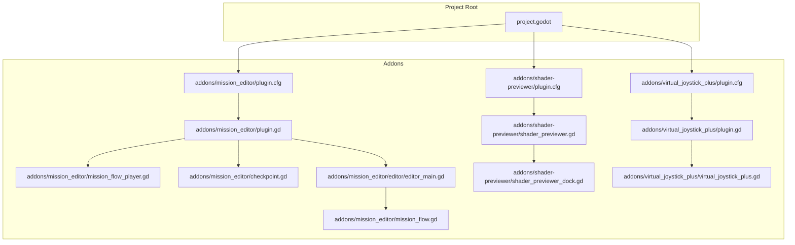
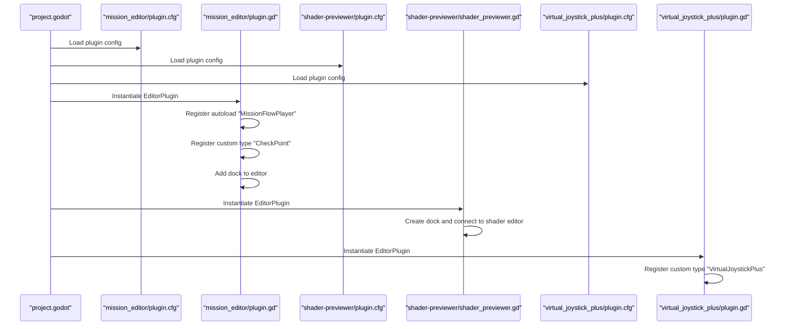
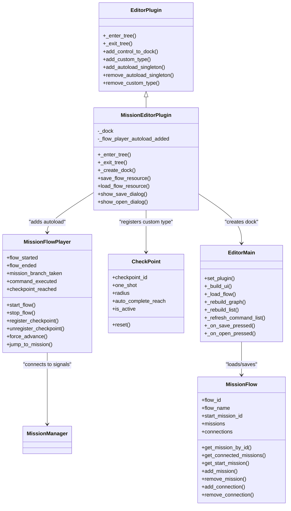
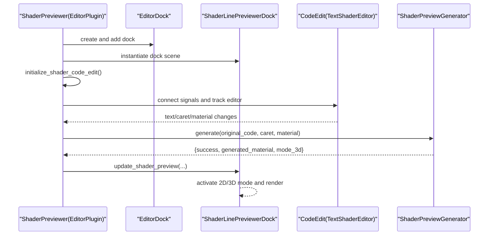
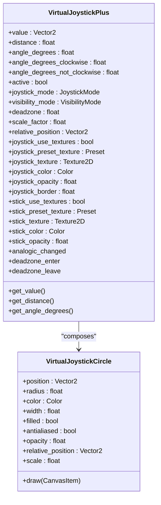
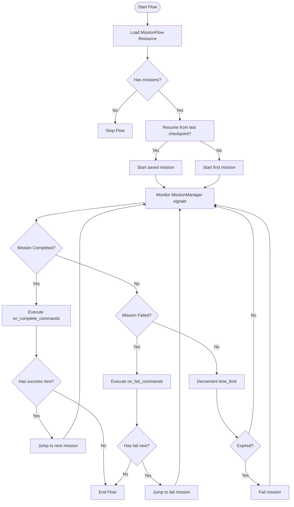
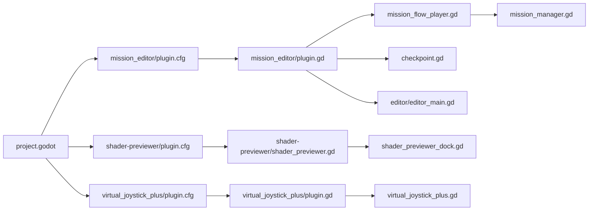

# Plugin Architecture and Extensibility

<cite>
**Referenced Files in This Document**
- [project.godot](file://project.godot)
- [plugin.cfg](file://addons/mission_editor/plugin.cfg)
- [plugin.gd](file://addons/mission_editor/plugin.gd)
- [mission_flow_player.gd](file://addons/mission_editor/mission_flow_player.gd)
- [checkpoint.gd](file://addons/mission_editor/checkpoint.gd)
- [editor_main.gd](file://addons/mission_editor/editor/editor_main.gd)
- [mission_flow.gd](file://addons/mission_editor/mission_flow.gd)
- [shader_previewer plugin.cfg](file://addons/shader-previewer/plugin.cfg)
- [shader_previewer.gd](file://addons/shader-previewer/shader_previewer.gd)
- [shader_previewer_dock.gd](file://addons/shader-previewer/shader_previewer_dock.gd)
- [virtual_joystick_plus plugin.cfg](file://addons/virtual_joystick_plus/plugin.cfg)
- [virtual_joystick_plus plugin.gd](file://addons/virtual_joystick_plus/plugin.gd)
- [virtual_joystick_plus.gd](file://addons/virtual_joystick_plus/virtual_joystick_plus.gd)
- [mission_manager.gd](file://Scripts/mission_manager.gd)
- [game_over_menu.gd](file://Menu/game_over_menu.gd)
</cite>

## Table of Contents
1. [Introduction](#introduction)
2. [Project Structure](#project-structure)
3. [Core Components](#core-components)
4. [Architecture Overview](#architecture-overview)
5. [Detailed Component Analysis](#detailed-component-analysis)
6. [Dependency Analysis](#dependency-analysis)
7. [Performance Considerations](#performance-considerations)
8. [Troubleshooting Guide](#troubleshooting-guide)
9. [Conclusion](#conclusion)
10. [Appendices](#appendices)

## Introduction
This document explains the plugin architecture and extensibility framework used by TFA Agents. It focuses on how third-party addons integrate with the main project, the plugin registration system, and how custom functionality can be extended. It documents three main plugins:
- mission_editor: a visual mission flow editor for Dialogic-style mission creation, branching, and runtime execution.
- shader-previewer: a real-time shader previewer/dock integrated into the Godot editor.
- virtual_joystick_plus: a mobile-friendly virtual joystick control for touch-based interfaces.

It also covers the plugin loading mechanism, configuration options, and how plugins interact with core game systems such as MissionManager and runtime flows.

## Project Structure
Plugins live under the addons/ directory and are registered via plugin.cfg files. Each plugin’s entry point is a dedicated plugin.gd script that extends EditorPlugin in tool context. The mission_editor plugin additionally registers an autoload singleton for runtime mission flow playback.

**Diagram sources**
- [project.godot](file://project.godot)
- [plugin.cfg](file://addons/mission_editor/plugin.cfg)
- [plugin.gd](file://addons/mission_editor/plugin.gd)
- [mission_flow_player.gd](file://addons/mission_editor/mission_flow_player.gd)
- [checkpoint.gd](file://addons/mission_editor/checkpoint.gd)
- [editor_main.gd](file://addons/mission_editor/editor/editor_main.gd)
- [mission_flow.gd](file://addons/mission_editor/mission_flow.gd)
- [shader_previewer plugin.cfg](file://addons/shader-previewer/plugin.cfg)
- [shader_previewer.gd](file://addons/shader-previewer/shader_previewer.gd)
- [shader_previewer_dock.gd](file://addons/shader-previewer/shader_previewer_dock.gd)
- [virtual_joystick_plus plugin.cfg](file://addons/virtual_joystick_plus/plugin.cfg)
- [virtual_joystick_plus plugin.gd](file://addons/virtual_joystick_plus/plugin.gd)
- [virtual_joystick_plus.gd](file://addons/virtual_joystick_plus/virtual_joystick_plus.gd)

**Section sources**
- [plugin.cfg](file://addons/mission_editor/plugin.cfg)
- [shader_previewer plugin.cfg](file://addons/shader-previewer/plugin.cfg)
- [virtual_joystick_plus plugin.cfg](file://addons/virtual_joystick_plus/plugin.cfg)

## Core Components
- Plugin registration and lifecycle
  - Each plugin exposes a plugin.cfg with metadata and a script field pointing to its entry point.
  - The entry point extends EditorPlugin and implements _enter_tree/_exit_tree to register docks, custom types, and autoload singletons.
- mission_editor
  - Registers MissionFlowPlayer autoload, CheckPoint custom type, and a right-side dock with a visual flow editor.
  - Provides runtime flow execution integrating with MissionManager.
- shader-previewer
  - Adds a dock to the editor that previews shader code in real time, supports 2D and 3D modes, and can float alongside the shader editor.
- virtual_joystick_plus
  - Exposes a VirtualJoystickPlus Control as a custom editor type and provides a runtime joystick node for mobile/touch input.

**Section sources**
- [plugin.gd](file://addons/mission_editor/plugin.gd)
- [mission_flow_player.gd](file://addons/mission_editor/mission_flow_player.gd)
- [checkpoint.gd](file://addons/mission_editor/checkpoint.gd)
- [editor_main.gd](file://addons/mission_editor/editor/editor_main.gd)
- [shader_previewer.gd](file://addons/shader-previewer/shader_previewer.gd)
- [shader_previewer_dock.gd](file://addons/shader-previewer/shader_previewer_dock.gd)
- [virtual_joystick_plus plugin.gd](file://addons/virtual_joystick_plus/plugin.gd)
- [virtual_joystick_plus.gd](file://addons/virtual_joystick_plus/virtual_joystick_plus.gd)

## Architecture Overview
The plugin system integrates with the Godot editor and runtime as follows:
- Editor plugins are enabled via project settings and registered through plugin.cfg.
- EditorPlugin entry points add docks, custom node types, and autoload singletons.
- Runtime plugins (like mission_editor) rely on existing core systems (MissionManager) to orchestrate gameplay.

**Diagram sources**
- [plugin.cfg](file://addons/mission_editor/plugin.cfg)
- [plugin.gd](file://addons/mission_editor/plugin.gd)
- [shader_previewer plugin.cfg](file://addons/shader-previewer/plugin.cfg)
- [shader_previewer.gd](file://addons/shader-previewer/shader_previewer.gd)
- [virtual_joystick_plus plugin.cfg](file://addons/virtual_joystick_plus/plugin.cfg)
- [virtual_joystick_plus plugin.gd](file://addons/virtual_joystick_plus/plugin.gd)

## Detailed Component Analysis

### mission_editor: Visual Mission Flow Editor
- Registration and autoload
  - On entering the editor, the plugin checks for the MissionFlowPlayer autoload and adds it if missing. It also registers the CheckPoint custom type and creates the main editor dock.
- Editor dock and UI
  - The dock hosts a toolbar, a graph editor for mission nodes, a mission list, and an inspector/command editor panel. It supports saving/loading flows to .tres resources and updating the graph dynamically.
- Runtime flow execution
  - MissionFlowPlayer listens to MissionManager signals and advances flows, executes commands, handles branching, timers, and checkpoints. It can resume from saved checkpoint data.

**Diagram sources**
- [plugin.gd](file://addons/mission_editor/plugin.gd)
- [mission_flow_player.gd](file://addons/mission_editor/mission_flow_player.gd)
- [checkpoint.gd](file://addons/mission_editor/checkpoint.gd)
- [editor_main.gd](file://addons/mission_editor/editor/editor_main.gd)
- [mission_flow.gd](file://addons/mission_editor/mission_flow.gd)
- [mission_manager.gd](file://Scripts/mission_manager.gd)

**Section sources**
- [plugin.gd](file://addons/mission_editor/plugin.gd)
- [mission_flow_player.gd](file://addons/mission_editor/mission_flow_player.gd)
- [checkpoint.gd](file://addons/mission_editor/checkpoint.gd)
- [editor_main.gd](file://addons/mission_editor/editor/editor_main.gd)
- [mission_flow.gd](file://addons/mission_editor/mission_flow.gd)

### shader-previewer: Real-Time Shader Previewer
- Dock integration
  - The plugin creates an EditorDock and attaches a ShaderLinePreviewerDock scene. It connects to the active shader editor and tracks tab changes.
- Real-time preview
  - On editor input, it snapshots shader text and material parameters, generates a preview material, and updates either a 2D texture or a 3D mesh preview.
- Floating and docking
  - Supports floating mode and resizing/moving when docked, and auto-hides/shows controls on hover.

**Diagram sources**
- [shader_previewer.gd](file://addons/shader-previewer/shader_previewer.gd)
- [shader_previewer_dock.gd](file://addons/shader-previewer/shader_previewer_dock.gd)

**Section sources**
- [shader_previewer.gd](file://addons/shader-previewer/shader_previewer.gd)
- [shader_previewer_dock.gd](file://addons/shader-previewer/shader_previewer_dock.gd)

### virtual_joystick_plus: Mobile Controls
- Editor integration
  - Registers VirtualJoystickPlus as a custom Control type in the editor, enabling drag-and-drop placement.
- Runtime joystick
  - Provides a fully configurable on-screen joystick with multiple presets, deadzone, scaling, visibility modes, and dynamic base-following behavior.
  - Emits analogic_changed and deadzone_enter/leave signals for input handling.

**Diagram sources**
- [virtual_joystick_plus.gd](file://addons/virtual_joystick_plus/virtual_joystick_plus.gd)

**Section sources**
- [virtual_joystick_plus plugin.gd](file://addons/virtual_joystick_plus/plugin.gd)
- [virtual_joystick_plus.gd](file://addons/virtual_joystick_plus/virtual_joystick_plus.gd)

### Runtime Flow Execution Flow
This flow shows how MissionFlowPlayer orchestrates missions and integrates with MissionManager.

**Diagram sources**
- [mission_flow_player.gd](file://addons/mission_editor/mission_flow_player.gd)
- [mission_manager.gd](file://Scripts/mission_manager.gd)

**Section sources**
- [mission_flow_player.gd](file://addons/mission_editor/mission_flow_player.gd)
- [mission_manager.gd](file://Scripts/mission_manager.gd)

## Dependency Analysis
- Plugin discovery and activation
  - Godot reads plugin.cfg entries and instantiates the specified EditorPlugin scripts.
- mission_editor dependencies
  - Depends on MissionManager (autoload) for mission lifecycle signals.
  - Uses MissionFlow resource and MissionCommand resources for flow definition and commands.
  - Integrates CheckPoint nodes placed in scenes to support REACH/ACTIVATE missions.
- shader-previewer dependencies
  - Requires access to the active TextShaderEditor CodeEdit to mirror text and caret position.
  - Uses a ShaderPreviewGenerator to produce preview materials.
- virtual_joystick_plus dependencies
  - Exposes a custom Control node for editor usage and runtime input handling.

**Diagram sources**
- [project.godot](file://project.godot)
- [plugin.cfg](file://addons/mission_editor/plugin.cfg)
- [shader_previewer plugin.cfg](file://addons/shader-previewer/plugin.cfg)
- [virtual_joystick_plus plugin.cfg](file://addons/virtual_joystick_plus/plugin.cfg)
- [plugin.gd](file://addons/mission_editor/plugin.gd)
- [mission_flow_player.gd](file://addons/mission_editor/mission_flow_player.gd)
- [checkpoint.gd](file://addons/mission_editor/checkpoint.gd)
- [editor_main.gd](file://addons/mission_editor/editor/editor_main.gd)
- [shader_previewer.gd](file://addons/shader-previewer/shader_previewer.gd)
- [shader_previewer_dock.gd](file://addons/shader-previewer/shader_previewer_dock.gd)
- [virtual_joystick_plus plugin.gd](file://addons/virtual_joystick_plus/plugin.gd)
- [virtual_joystick_plus.gd](file://addons/virtual_joystick_plus/virtual_joystick_plus.gd)
- [mission_manager.gd](file://Scripts/mission_manager.gd)

**Section sources**
- [plugin.gd](file://addons/mission_editor/plugin.gd)
- [mission_flow_player.gd](file://addons/mission_editor/mission_flow_player.gd)
- [shader_previewer.gd](file://addons/shader-previewer/shader_previewer.gd)
- [virtual_joystick_plus plugin.gd](file://addons/virtual_joystick_plus/plugin.gd)
- [mission_manager.gd](file://Scripts/mission_manager.gd)

## Performance Considerations
- mission_editor
  - Graph rebuilds and list refreshes occur on edits; avoid excessive reflows by batching UI updates.
  - Saving/loading flows uses ResourceSaver; ensure paths are valid and scan the resource filesystem afterward.
- shader-previewer
  - Real-time preview triggers on text changes; debounce or throttle updates if heavy shader compilation occurs.
  - 3D preview rendering depends on material regeneration; keep shader complexity reasonable for smooth updates.
- virtual_joystick_plus
  - Drawing and signal emission are lightweight; ensure deadzone thresholds are tuned to reduce noisy inputs.

[No sources needed since this section provides general guidance]

## Troubleshooting Guide
- Plugin does not appear in editor
  - Verify plugin.cfg exists and is valid; ensure the script path matches the plugin entry point.
- mission_editor autoload missing
  - The plugin adds MissionFlowPlayer autoload if absent; confirm autoload settings in Project > Autoload.
- CheckPoint nodes not recognized
  - Confirm the CheckPoint custom type is registered; ensure checkpoint_id is set on CheckPoint nodes.
- shader-previewer dock not connecting to shader editor
  - The plugin attempts to initialize the CodeEdit reference after startup; ensure the shader editor is open and try switching tabs.
- virtual_joystick_plus not visible on desktop
  - If only_mobile is enabled, the joystick hides on non-mobile platforms; disable only_mobile or test on Android/iOS.

**Section sources**
- [plugin.gd](file://addons/mission_editor/plugin.gd)
- [mission_flow_player.gd](file://addons/mission_editor/mission_flow_player.gd)
- [checkpoint.gd](file://addons/mission_editor/checkpoint.gd)
- [shader_previewer.gd](file://addons/shader-previewer/shader_previewer.gd)
- [virtual_joystick_plus plugin.gd](file://addons/virtual_joystick_plus/plugin.gd)
- [virtual_joystick_plus.gd](file://addons/virtual_joystick_plus/virtual_joystick_plus.gd)

## Conclusion
TFA Agents’ plugin architecture leverages Godot’s EditorPlugin system to extend the editor with powerful authoring tools and runtime capabilities. The mission_editor plugin integrates tightly with MissionManager to provide a robust mission flow system, while shader-previewer enhances shader development ergonomics directly in the editor. The virtual_joystick_plus plugin delivers a flexible, configurable input solution for mobile play. Together, these plugins demonstrate a clean separation of concerns, strong integration points with core systems, and extensible patterns suitable for third-party addons.

[No sources needed since this section summarizes without analyzing specific files]

## Appendices

### Plugin Loading Mechanism
- plugin.cfg
  - Contains [plugin] section with name, description, author, version, and script fields.
- EditorPlugin lifecycle
  - _enter_tree: register autoload, custom types, and docks.
  - _exit_tree: remove docks, custom types, and autoload if added by the plugin.

**Section sources**
- [plugin.cfg](file://addons/mission_editor/plugin.cfg)
- [shader_previewer plugin.cfg](file://addons/shader-previewer/plugin.cfg)
- [virtual_joystick_plus plugin.cfg](file://addons/virtual_joystick_plus/plugin.cfg)
- [plugin.gd](file://addons/mission_editor/plugin.gd)
- [shader_previewer.gd](file://addons/shader-previewer/shader_previewer.gd)
- [virtual_joystick_plus plugin.gd](file://addons/virtual_joystick_plus/plugin.gd)

### Configuration Options
- mission_editor
  - Editor dock UI: toolbar actions, graph editor, inspector, command editor.
  - Flow resources: save/load .tres files; manage missions and connections.
- shader-previewer
  - Dock: floating vs docked, resize/move, 2D/3D preview modes, light toggles, shape selection.
- virtual_joystick_plus
  - Exported properties for textures/colors/borders, visibility modes, deadzone, scale, and joystick modes.

**Section sources**
- [editor_main.gd](file://addons/mission_editor/editor/editor_main.gd)
- [shader_previewer_dock.gd](file://addons/shader-previewer/shader_previewer_dock.gd)
- [virtual_joystick_plus.gd](file://addons/virtual_joystick_plus/virtual_joystick_plus.gd)

### Extending Existing Functionality
- Adding new mission types
  - Extend MissionData.Type and update mission flow UI and execution logic in MissionFlowPlayer.
- New command types
  - Add command type constants and handlers in MissionFlowPlayer’s command execution switch.
- Custom editor panels
  - Create a new dock scene and register it via EditorPlugin.add_control_to_dock in your plugin entry point.
- Runtime input controls
  - Use VirtualJoystickPlus as a base and extend it for specialized behaviors; expose signals consumers can connect to.

**Section sources**
- [mission_flow_player.gd](file://addons/mission_editor/mission_flow_player.gd)
- [mission_flow.gd](file://addons/mission_editor/mission_flow.gd)
- [virtual_joystick_plus.gd](file://addons/virtual_joystick_plus/virtual_joystick_plus.gd)