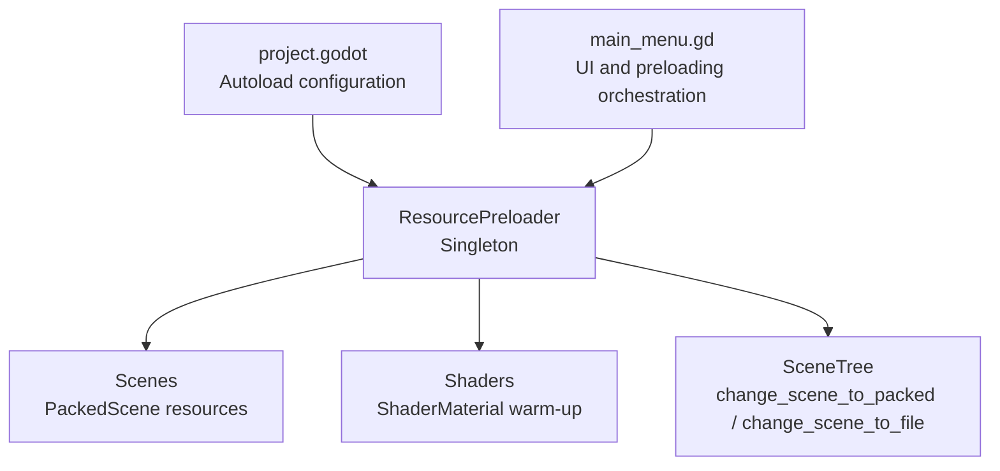
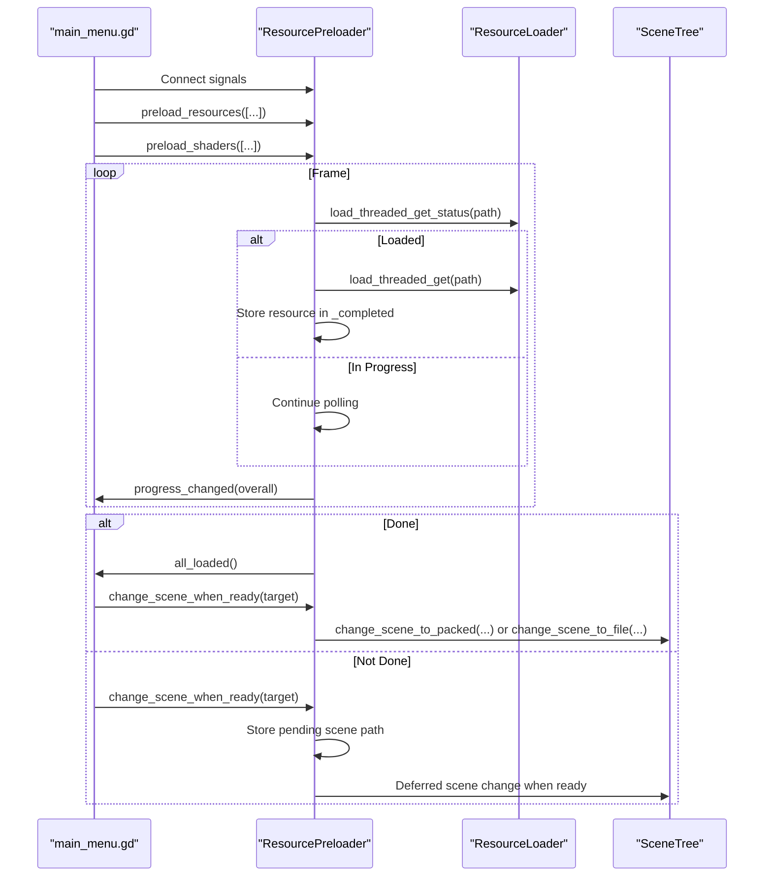
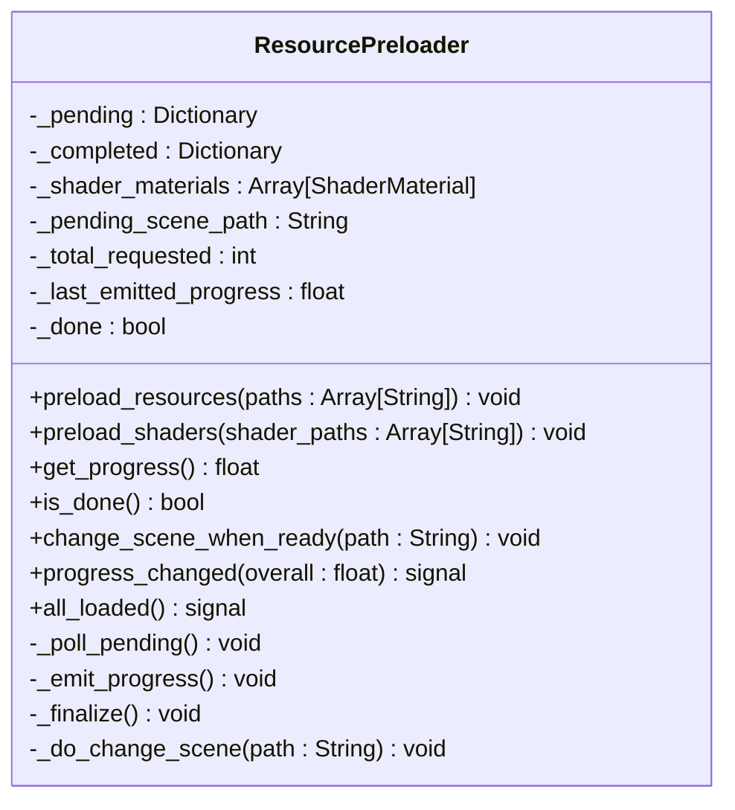
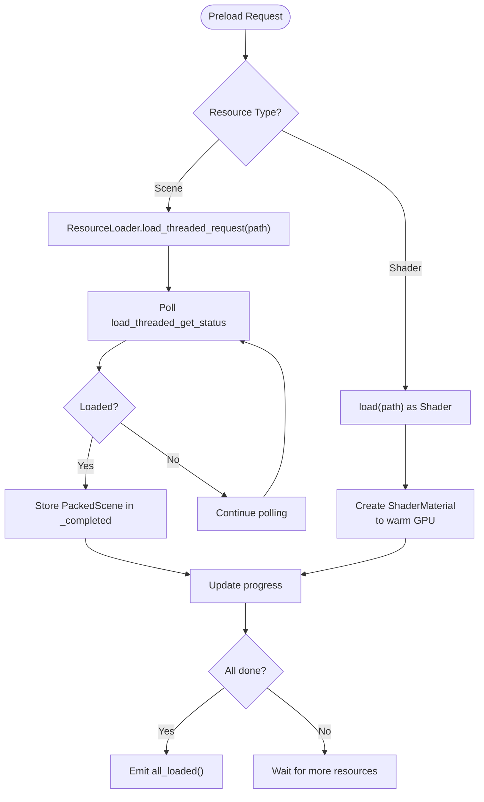
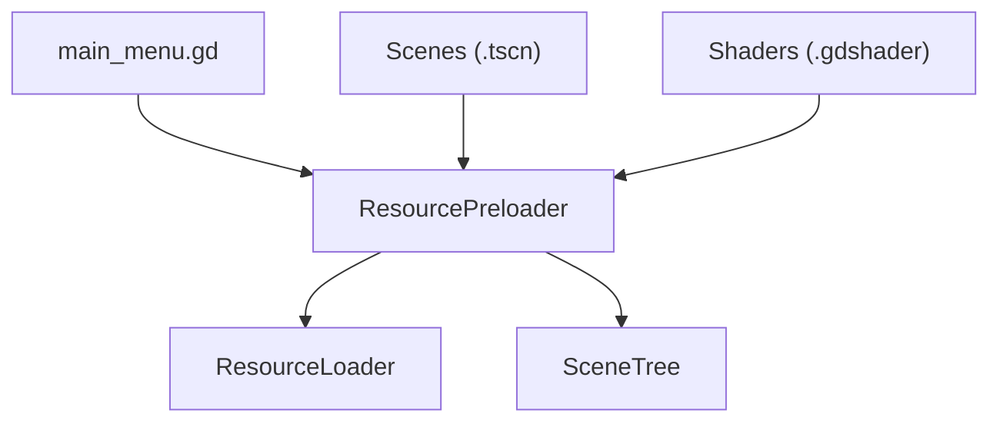

# Resource Management and Preloading

<cite>
**Referenced Files in This Document**
- [resource_preloader.gd](file://Scripts/resource_preloader.gd)
- [project.godot](file://project.godot)
- [main_menu.gd](file://Menu/main_menu.gd)
- [Mina.tscn](file://Game/Oggetti/Mina.tscn)
- [InputManager.tscn](file://Game/InputManager.tscn)
- [HUD_Game.tscn](file://Menu/HUD/HUD_Game.tscn)
</cite>

## Table of Contents
1. [Introduction](#introduction)
2. [Project Structure](#project-structure)
3. [Core Components](#core-components)
4. [Architecture Overview](#architecture-overview)
5. [Detailed Component Analysis](#detailed-component-analysis)
6. [Dependency Analysis](#dependency-analysis)
7. [Performance Considerations](#performance-considerations)
8. [Troubleshooting Guide](#troubleshooting-guide)
9. [Conclusion](#conclusion)

## Introduction
This document explains TFA Agents' resource management architecture with a focus on the ResourcePreloader singleton pattern, asset loading strategies, and caching mechanisms. It documents the autoload system configuration in project.godot, resource path organization, and the distinction between lazy and eager loading. It also covers how scenes, textures, and shaders are managed and accessed throughout the game, along with performance optimization techniques, memory management strategies, and best practices for organizing assets and loading workflows.

## Project Structure
The project uses Godot's autoload system to initialize a singleton ResourcePreloader that coordinates asynchronous resource preloading and scene transitions. The autoload configuration in project.godot ensures the singleton is available globally, while individual scenes define which resources to preload and when to trigger scene changes.

**Diagram sources**
- [project.godot:23-31](file://project.godot#L23-L31)
- [resource_preloader.gd:20-26](file://Scripts/resource_preloader.gd#L20-L26)
- [main_menu.gd:91-105](file://Menu/main_menu.gd#L91-L105)

**Section sources**
- [project.godot:23-31](file://project.godot#L23-L31)
- [main_menu.gd:91-105](file://Menu/main_menu.gd#L91-L105)

## Core Components
- ResourcePreloader singleton: Implements asynchronous resource preloading, progress tracking, and scene switching. It uses Godot's threaded loader for scenes and synchronous shader compilation with GPU warm-up via dummy ShaderMaterial instances.
- Autoload configuration: project.godot defines ResourcePreloader as an autoload singleton, ensuring it is initialized before any scene.
- Scene orchestration: UI scripts (e.g., main_menu.gd) connect to ResourcePreloader signals, configure preload lists, and trigger scene changes when ready.

Key responsibilities:
- Asynchronous scene preloading using ResourceLoader.load_threaded_request/get
- Shader warm-up by synchronously loading Shader resources and instantiating ShaderMaterial
- Progress reporting via signals and throttled updates
- Finalizing and transitioning to scenes using change_scene_to_packed or change_scene_to_file

**Section sources**
- [resource_preloader.gd:75-103](file://Scripts/resource_preloader.gd#L75-L103)
- [resource_preloader.gd:105-125](file://Scripts/resource_preloader.gd#L105-L125)
- [resource_preloader.gd:128-148](file://Scripts/resource_preloader.gd#L128-L148)
- [resource_preloader.gd:151-158](file://Scripts/resource_preloader.gd#L151-L158)
- [project.godot:23-31](file://project.godot#L23-L31)

## Architecture Overview
The resource management architecture centers on a single autoloaded singleton that handles background loading and scene transitions. UI screens configure which resources to preload and react to progress updates.

**Diagram sources**
- [main_menu.gd:91-105](file://Menu/main_menu.gd#L91-L105)
- [resource_preloader.gd:63-69](file://Scripts/resource_preloader.gd#L63-L69)
- [resource_preloader.gd:165-191](file://Scripts/resource_preloader.gd#L165-L191)
- [resource_preloader.gd:209-213](file://Scripts/resource_preloader.gd#L209-L213)
- [resource_preloader.gd:194-206](file://Scripts/resource_preloader.gd#L194-L206)
- [resource_preloader.gd:216-225](file://Scripts/resource_preloader.gd#L216-L225)

## Detailed Component Analysis

### ResourcePreloader Singleton Pattern
ResourcePreloader is a singleton Node that:
- Exposes public APIs for preloading scenes and shaders
- Tracks pending and completed resources
- Emits progress and completion signals
- Defers scene changes until resources are ready

Implementation highlights:
- Uses a polling loop in _process to check load status without blocking the main thread
- Throttles progress emissions to avoid excessive signal spam
- Stores completed PackedScene resources for fast scene transitions via change_scene_to_packed
- Maintains ShaderMaterial instances for GPU warm-up during shader preloading

**Diagram sources**
- [resource_preloader.gd:20-26](file://Scripts/resource_preloader.gd#L20-L26)
- [resource_preloader.gd:32-51](file://Scripts/resource_preloader.gd#L32-L51)
- [resource_preloader.gd:75-103](file://Scripts/resource_preloader.gd#L75-L103)
- [resource_preloader.gd:105-125](file://Scripts/resource_preloader.gd#L105-L125)
- [resource_preloader.gd:128-148](file://Scripts/resource_preloader.gd#L128-L148)
- [resource_preloader.gd:151-158](file://Scripts/resource_preloader.gd#L151-L158)
- [resource_preloader.gd:165-191](file://Scripts/resource_preloader.gd#L165-L191)
- [resource_preloader.gd:194-206](file://Scripts/resource_preloader.gd#L194-L206)
- [resource_preloader.gd:209-213](file://Scripts/resource_preloader.gd#L209-L213)
- [resource_preloader.gd:216-225](file://Scripts/resource_preloader.gd#L216-L225)

**Section sources**
- [resource_preloader.gd:58-69](file://Scripts/resource_preloader.gd#L58-L69)
- [resource_preloader.gd:75-103](file://Scripts/resource_preloader.gd#L75-L103)
- [resource_preloader.gd:105-125](file://Scripts/resource_preloader.gd#L105-L125)
- [resource_preloader.gd:128-148](file://Scripts/resource_preloader.gd#L128-L148)
- [resource_preloader.gd:151-158](file://Scripts/resource_preloader.gd#L151-L158)
- [resource_preloader.gd:165-191](file://Scripts/resource_preloader.gd#L165-L191)
- [resource_preloader.gd:194-206](file://Scripts/resource_preloader.gd#L194-L206)
- [resource_preloader.gd:209-213](file://Scripts/resource_preloader.gd#L209-L213)
- [resource_preloader.gd:216-225](file://Scripts/resource_preloader.gd#L216-L225)

### Autoload System Configuration
The autoload system initializes ResourcePreloader automatically at startup. This ensures it is available globally for UI scripts to connect to and coordinate preloading.

- Autoload keys in project.godot include ResourcePreloader mapped to the singleton script
- Other autoloads (e.g., GlobalSettings, MissionManager) support gameplay systems but are outside the scope of this document

Best practice:
- Keep autoloads minimal and focused; ResourcePreloader is a good candidate because it is lightweight and essential for smooth transitions

**Section sources**
- [project.godot:23-31](file://project.godot#L23-L31)

### Resource Path Organization
Resources are organized under res:// with clear folder structures:
- Scenes: Maps/, Scenes/
- Scripts: Scripts/
- Assets: Assets/ (Textures, UI themes, animations, etc.)
- Shaders: Shaders/
- Add-ons: addons/

Resource paths are referenced consistently using res:// scheme, enabling portability across platforms and builds.

**Section sources**
- [main_menu.gd:11-21](file://Menu/main_menu.gd#L11-L21)
- [Mina.tscn:14-35](file://Game/Oggetti/Mina.tscn#L14-L35)
- [InputManager.tscn:2-5](file://Game/InputManager.tscn#L2-L5)

### Lazy vs Eager Loading Approaches
- Eager loading: Scenes and shaders configured in main_menu.gd are preloaded before gameplay begins. This prevents hitches during initial scene transitions.
- Lazy loading: Individual scripts can still use direct resource loading for on-demand assets (e.g., audio effects, particle visuals). This keeps memory usage lower but risks frame drops if loading occurs mid-frame.

Recommendation:
- Preload heavy assets (scenes, complex shaders) eagerly
- Load small, infrequent assets lazily to reduce peak memory usage

**Section sources**
- [main_menu.gd:8-21](file://Menu/main_menu.gd#L8-L21)
- [resource_preloader.gd:75-103](file://Scripts/resource_preloader.gd#L75-L103)
- [resource_preloader.gd:105-125](file://Scripts/resource_preloader.gd#L105-L125)

### Managing Different Resource Types
- Scenes: Preloaded via ResourceLoader.load_threaded_request; stored in _completed for fast transition using change_scene_to_packed when available
- Textures: Referenced from scenes and sub-resources; preloading indirectly happens when scenes are preloaded
- Shaders: Preloaded synchronously; dummy ShaderMaterial instances force GPU compilation and caching

**Diagram sources**
- [resource_preloader.gd:75-103](file://Scripts/resource_preloader.gd#L75-L103)
- [resource_preloader.gd:105-125](file://Scripts/resource_preloader.gd#L105-L125)
- [resource_preloader.gd:165-191](file://Scripts/resource_preloader.gd#L165-L191)
- [resource_preloader.gd:128-148](file://Scripts/resource_preloader.gd#L128-L148)

**Section sources**
- [resource_preloader.gd:75-103](file://Scripts/resource_preloader.gd#L75-L103)
- [resource_preloader.gd:105-125](file://Scripts/resource_preloader.gd#L105-L125)
- [resource_preloader.gd:165-191](file://Scripts/resource_preloader.gd#L165-L191)
- [resource_preloader.gd:128-148](file://Scripts/resource_preloader.gd#L128-L148)

### Access Patterns Throughout the Game
- UI scripts (e.g., main_menu.gd) orchestrate preloading and handle user-triggered scene changes
- Scenes reference external resources via ext_resource entries; textures and sprites are often defined as sub-resources
- HUD and gameplay scenes may reference shared assets (e.g., UI themes, shader materials)

Examples:
- main_menu.gd configures PRELOAD_RESOURCES and PRELOAD_SHADERS and connects to ResourcePreloader signals
- Mina.tscn references explosion textures and defines SpriteFrames for animations
- HUD_Game.tscn integrates UI elements that rely on theme resources

**Section sources**
- [main_menu.gd:8-21](file://Menu/main_menu.gd#L8-L21)
- [main_menu.gd:91-105](file://Menu/main_menu.gd#L91-L105)
- [Mina.tscn:14-127](file://Game/Oggetti/Mina.tscn#L14-L127)
- [HUD_Game.tscn](file://Menu/HUD/HUD_Game.tscn)

## Dependency Analysis
ResourcePreloader depends on:
- ResourceLoader for threaded scene loading and status queries
- SceneTree for scene transitions (change_scene_to_packed or change_scene_to_file)
- UI scripts for initiating preloading and scene changes

**Diagram sources**
- [resource_preloader.gd:165-191](file://Scripts/resource_preloader.gd#L165-L191)
- [resource_preloader.gd:216-225](file://Scripts/resource_preloader.gd#L216-L225)
- [main_menu.gd:91-105](file://Menu/main_menu.gd#L91-L105)

**Section sources**
- [resource_preloader.gd:165-191](file://Scripts/resource_preloader.gd#L165-L191)
- [resource_preloader.gd:216-225](file://Scripts/resource_preloader.gd#L216-L225)
- [main_menu.gd:91-105](file://Menu/main_menu.gd#L91-L105)

## Performance Considerations
- Asynchronous scene loading: Using load_threaded_request avoids main-thread stalls; ResourcePreloader polls status each frame without invoking load_threaded_get during _process to prevent freezes
- GPU warm-up: ShaderMaterial instances created during shader preloading force shader compilation and caching, reducing first-use latency during gameplay
- Progress throttling: Emission of progress_changed is throttled to reduce signal overhead
- Fast scene transitions: When a PackedScene is cached, change_scene_to_packed is used for immediate transitions without re-reading from disk

Recommendations:
- Preload only top-level scenes; Godot auto-resolves dependencies
- Keep shader lists concise and relevant to gameplay
- Monitor progress and show a loading overlay only when preloading is in progress
- Avoid loading large assets on the main thread during gameplay

**Section sources**
- [resource_preloader.gd:4-7](file://Scripts/resource_preloader.gd#L4-L7)
- [resource_preloader.gd:105-125](file://Scripts/resource_preloader.gd#L105-L125)
- [resource_preloader.gd:209-213](file://Scripts/resource_preloader.gd#L209-L213)
- [resource_preloader.gd:216-225](file://Scripts/resource_preloader.gd#L216-L225)
- [main_menu.gd:103-105](file://Menu/main_menu.gd#L103-L105)

## Troubleshooting Guide
Common issues and resolutions:
- No progress updates: Ensure signals are connected before calling preload_resources; connecting after is too late and may miss initial progress
- Scene fails to load: ResourcePreloader logs errors for failed or invalid resources; verify paths and existence
- Freezes during loading: Confirm that load_threaded_get is not called inside _process; ResourcePreloader avoids this by deferring retrieval until status indicates readiness
- Unexpected scene transitions: change_scene_when_ready stores the target path and defers the transition until preloading completes

Debugging tips:
- Check ResourcePreloader logs for warnings and errors
- Verify autoload configuration in project.godot
- Confirm that UI scripts connect to progress_changed and all_loaded before starting preloading

**Section sources**
- [main_menu.gd:92-99](file://Menu/main_menu.gd#L92-L99)
- [resource_preloader.gd:85-92](file://Scripts/resource_preloader.gd#L85-L92)
- [resource_preloader.gd:182-185](file://Scripts/resource_preloader.gd#L182-L185)
- [resource_preloader.gd:4-7](file://Scripts/resource_preloader.gd#L4-L7)
- [resource_preloader.gd:153-158](file://Scripts/resource_preloader.gd#L153-L158)

## Conclusion
TFA Agents employs a robust resource management architecture centered on a singleton ResourcePreloader that performs asynchronous scene preloading and shader warm-up. The autoload system guarantees availability of the singleton, while UI scripts orchestrate preloading and transitions. By combining eager loading for heavy assets with lazy loading for smaller items, the system achieves smooth gameplay transitions and efficient memory usage. Following the outlined best practices and troubleshooting steps will help maintain optimal performance and reliability.