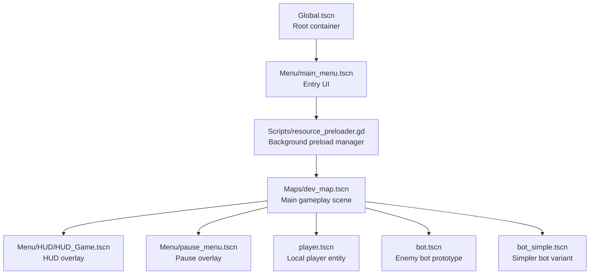
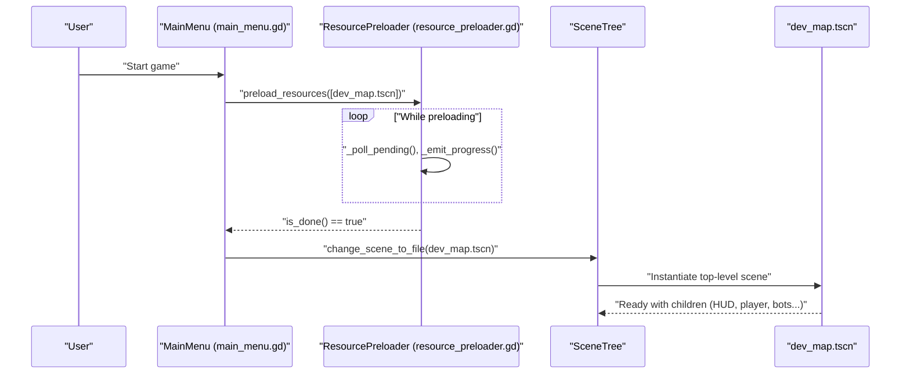
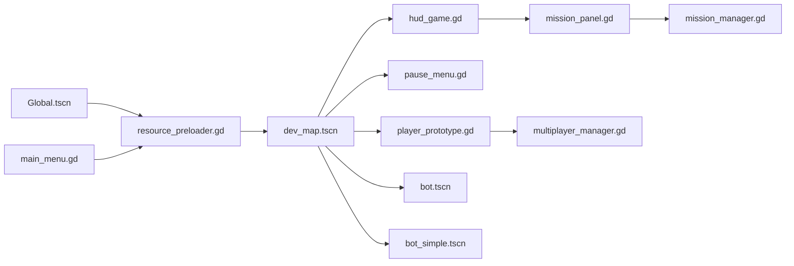

# Scene Hierarchy and Composition

<cite>
**Referenced Files in This Document**
- [Global.tscn](file://Global.tscn)
- [main_menu.gd](file://Menu/main_menu.gd)
- [resource_preloader.gd](file://Scripts/resource_preloader.gd)
- [dev_map.tscn](file://Maps/dev_map.tscn)
- [bot.tscn](file://bot.tscn)
- [bot_simple.tscn](file://bot_simple.tscn)
- [player_prototype.gd](file://Scripts/player_prototype.gd)
- [hud_game.gd](file://Menu/HUD/hud_game.gd)
- [pause_menu.gd](file://Menu/pause_menu.gd)
- [game_over_menu.gd](file://Menu/game_over_menu.gd)
- [multiplayer_manager.gd](file://Scripts/multiplayer_manager.gd)
- [mission_manager.gd](file://Scripts/mission_manager.gd)
- [mission_panel.gd](file://Scripts/mission_panel.gd)
</cite>

## Table of Contents
1. [Introduction](#introduction)
2. [Project Structure](#project-structure)
3. [Core Components](#core-components)
4. [Architecture Overview](#architecture-overview)
5. [Detailed Component Analysis](#detailed-component-analysis)
6. [Dependency Analysis](#dependency-analysis)
7. [Performance Considerations](#performance-considerations)
8. [Troubleshooting Guide](#troubleshooting-guide)
9. [Conclusion](#conclusion)

## Introduction
This document explains the scene hierarchy and composition architecture used in TFA Agents. It focuses on how scenes are organized around a central container, how autoloaded scenes and resource preloading orchestrate loading transitions, and how gameplay entities (players and bots) are instantiated and integrated into the world. It also covers parent-child relationships, UI overlays, and cross-scene coordination via global nodes and managers.

## Project Structure
TFA Agents uses a layered scene architecture:
- A central Global.tscn acts as the root container for the entire application lifecycle.
- Menus and UI scenes are separate, designed to be loaded independently.
- Gameplay maps (e.g., dev_map.tscn) are top-level scenes that instantiate players, bots, HUD, and other gameplay elements.
- Autoloaded scripts coordinate resource preloading and scene transitions.

**Diagram sources**
- [Global.tscn](file://Global.tscn)
- [main_menu.gd](file://Menu/main_menu.gd)
- [resource_preloader.gd](file://Scripts/resource_preloader.gd)
- [dev_map.tscn](file://Maps/dev_map.tscn)
- [hud_game.gd](file://Menu/HUD/hud_game.gd)
- [pause_menu.gd](file://Menu/pause_menu.gd)
- [player_prototype.gd](file://Scripts/player_prototype.gd)
- [bot.tscn](file://bot.tscn)
- [bot_simple.tscn](file://bot_simple.tscn)

**Section sources**
- [Global.tscn](file://Global.tscn)
- [main_menu.gd](file://Menu/main_menu.gd)
- [resource_preloader.gd](file://Scripts/resource_preloader.gd)
- [dev_map.tscn](file://Maps/dev_map.tscn)

## Core Components
- Global.tscn: Central root container that hosts the application’s lifecycle and manages autoloaded nodes. It ensures consistent initialization order and provides a single place to attach persistent systems.
- Resource preloader: Background loader that warms up scenes and shaders before transitioning to gameplay, reporting progress and switching scenes when ready.
- Main menu: Entry UI that triggers preloading of top-level scenes and navigates to the selected map.
- Gameplay map (dev_map): Top-level scene that instantiates players, bots, HUD, pause menu, and other gameplay elements. It serves as the parent for all runtime entities.
- HUD and pause overlays: Separate scenes attached to the map to provide UI feedback and controls without cluttering the gameplay logic.
- Player and bot scenes: Reusable prototypes instantiated inside the map. They encapsulate movement, collision, and AI behaviors.

**Section sources**
- [Global.tscn](file://Global.tscn)
- [resource_preloader.gd](file://Scripts/resource_preloader.gd)
- [main_menu.gd](file://Menu/main_menu.gd)
- [dev_map.tscn](file://Maps/dev_map.tscn)
- [hud_game.gd](file://Menu/HUD/hud_game.gd)
- [pause_menu.gd](file://Menu/pause_menu.gd)
- [player_prototype.gd](file://Scripts/player_prototype.gd)
- [bot.tscn](file://bot.tscn)
- [bot_simple.tscn](file://bot_simple.tscn)

## Architecture Overview
The architecture follows a strict separation of concerns:
- UI scenes (menu, HUD, pause) are independent and can be loaded/unloaded freely.
- Gameplay scenes are top-level and self-contained, instantiating child entities.
- A centralized preloading pipeline ensures smooth transitions by warming up resources before scene switches.

**Diagram sources**
- [main_menu.gd](file://Menu/main_menu.gd)
- [resource_preloader.gd](file://Scripts/resource_preloader.gd)
- [dev_map.tscn](file://Maps/dev_map.tscn)

## Detailed Component Analysis

### Global.tscn: Central Container
- Acts as the root container for autoloaded nodes and initial UI.
- Ensures consistent startup behavior and provides a stable anchor for persistent managers and UI layers.

**Section sources**
- [Global.tscn](file://Global.tscn)

### Resource Preloader: Background Warm-Up and Scene Switching
- Manages threaded resource loading for top-level scenes and shader materials.
- Emits progress updates and defers scene changes until readiness.
- Uses cached PackedScene instances for fast scene transitions.

Key behaviors:
- Tracks pending loads and computes a normalized progress value.
- Switches to a target scene either immediately (if ready) or after completion.
- Chooses efficient change methods depending on whether resources are cached.

**Section sources**
- [resource_preloader.gd](file://Scripts/resource_preloader.gd)

### Main Menu: Entry Point and Preloading Trigger
- Declares top-level scenes to preload and shader materials to warm up.
- Initiates preloading and then switches to the selected map when ready.
- Keeps lists of scenes and shaders to ensure all required assets are warmed before gameplay.

Best practices:
- Include only top-level scene paths in preload lists; dependencies are resolved automatically.
- Warm up simple shader texts synchronously to avoid runtime stalls.

**Section sources**
- [main_menu.gd](file://Menu/main_menu.gd)

### Gameplay Map (dev_map): Parent of Runtime Entities
- Serves as the top-level scene for gameplay.
- Instantiates HUD, pause menu, player, and multiple bot variants.
- Provides a stable parent for all dynamic entities, enabling consistent coordinate spaces and group membership.

Parent-child relationships:
- HUD and pause menus are direct children of the map.
- Player and bots are children of the map, inheriting its transform and height-level context.

**Section sources**
- [dev_map.tscn](file://Maps/dev_map.tscn)

### HUD Overlay: UI Layer on Top of Gameplay
- Attached as a CanvasLayer child of the map.
- Receives references to UI elements and exposes signals for quality changes.
- Integrates with gameplay systems to reflect health, ammo, subtitles, and pause actions.

Integration points:
- References UI nodes via onready declarations.
- Connects to pause button events to toggle overlays.

**Section sources**
- [hud_game.gd](file://Menu/HUD/hud_game.gd)

### Pause Menu: Temporary Overlay
- Loaded as a child of the map during gameplay.
- Handles input to return to previous scenes and cleans up on exit.

**Section sources**
- [pause_menu.gd](file://Menu/pause_menu.gd)

### Player Entity: Local Character Prototype
- Implemented as a reusable scene (player.tscn) instantiated inside the map.
- Supports dynamic effects (e.g., blood splatter) attached to the map root for consistent rendering and grouping.

Notable patterns:
- Spawns temporary visuals under the map root to maintain visibility and height-level alignment.
- Uses tweens for fade-out effects and integrates with multiplayer feedback.

**Section sources**
- [player_prototype.gd](file://Scripts/player_prototype.gd)

### Bot Entities: Enemy Prototypes
- Two bot prototypes are available: a generic bot and a simpler variant.
- Both are instantiated inside the map as children, inheriting its coordinate system and height-level context.
- Useful for testing navigation and gameplay mechanics without duplicating logic.

**Section sources**
- [bot.tscn](file://bot.tscn)
- [bot_simple.tscn](file://bot_simple.tscn)

### Cross-Scene Coordination: Managers and Panels
- Mission-related UI and logic are coordinated via dedicated managers and panels.
- Panels attach to HUD containers and subscribe to mission state changes to update visuals.

**Section sources**
- [mission_panel.gd](file://Scripts/mission_panel.gd)
- [mission_manager.gd](file://Scripts/mission_manager.gd)
- [multiplayer_manager.gd](file://Scripts/multiplayer_manager.gd)

## Dependency Analysis
The system exhibits low coupling and clear boundaries:
- UI scenes depend on the tree for navigation but remain decoupled from gameplay logic.
- Gameplay scenes own their entities and manage their lifecycles.
- Global.tscn anchors autoloaded systems that coordinate transitions and state.

**Diagram sources**
- [Global.tscn](file://Global.tscn)
- [resource_preloader.gd](file://Scripts/resource_preloader.gd)
- [main_menu.gd](file://Menu/main_menu.gd)
- [dev_map.tscn](file://Maps/dev_map.tscn)
- [hud_game.gd](file://Menu/HUD/hud_game.gd)
- [pause_menu.gd](file://Menu/pause_menu.gd)
- [player_prototype.gd](file://Scripts/player_prototype.gd)
- [bot.tscn](file://bot.tscn)
- [bot_simple.tscn](file://bot_simple.tscn)
- [mission_manager.gd](file://Scripts/mission_manager.gd)
- [mission_panel.gd](file://Scripts/mission_panel.gd)
- [multiplayer_manager.gd](file://Scripts/multiplayer_manager.gd)

## Performance Considerations
- Warm-up preloading: Use the resource preloader to load top-level scenes and simple shader texts before switching to gameplay. This avoids stuttering during scene transitions.
- Efficient scene switching: Prefer cached PackedScene instances to minimize disk reads and speed up transitions.
- UI overlays: Keep HUD and pause menus lightweight and avoid heavy computations in their ready routines.
- Dynamic effects: Attach transient visuals to the map root to leverage existing batching and avoid deep hierarchies.

## Troubleshooting Guide
Common issues and resolutions:
- Stuttering on scene switch: Verify that top-level scenes and essential shaders are preloaded and that change_scene_to_packed is used when possible.
- HUD not updating: Ensure HUD is a child of the map and that onready references resolve correctly; check signal connections for quality changes.
- Bots not spawning: Confirm that bot instances are declared as children of the map and that their groups and height levels are set appropriately.
- Death UI not appearing: Verify that the local feedback branch is enabled and that the death UI is added as a child of the player node.
- Returning to menu from game over: Ensure cleanup routines reset mission checkpoints and that scene paths are valid.

**Section sources**
- [resource_preloader.gd](file://Scripts/resource_preloader.gd)
- [hud_game.gd](file://Menu/HUD/hud_game.gd)
- [game_over_menu.gd](file://Menu/game_over_menu.gd)
- [player_prototype.gd](file://Scripts/player_prototype.gd)
- [dev_map.tscn](file://Maps/dev_map.tscn)

## Conclusion
TFA Agents employs a clean, layered scene architecture centered on a global container and a robust preloading pipeline. Menus, HUD, and gameplay maps are clearly separated, while gameplay entities are instantiated as children of the map for consistent behavior. Following the described patterns ensures maintainable hierarchies, smooth transitions, and scalable composition of gameplay systems.