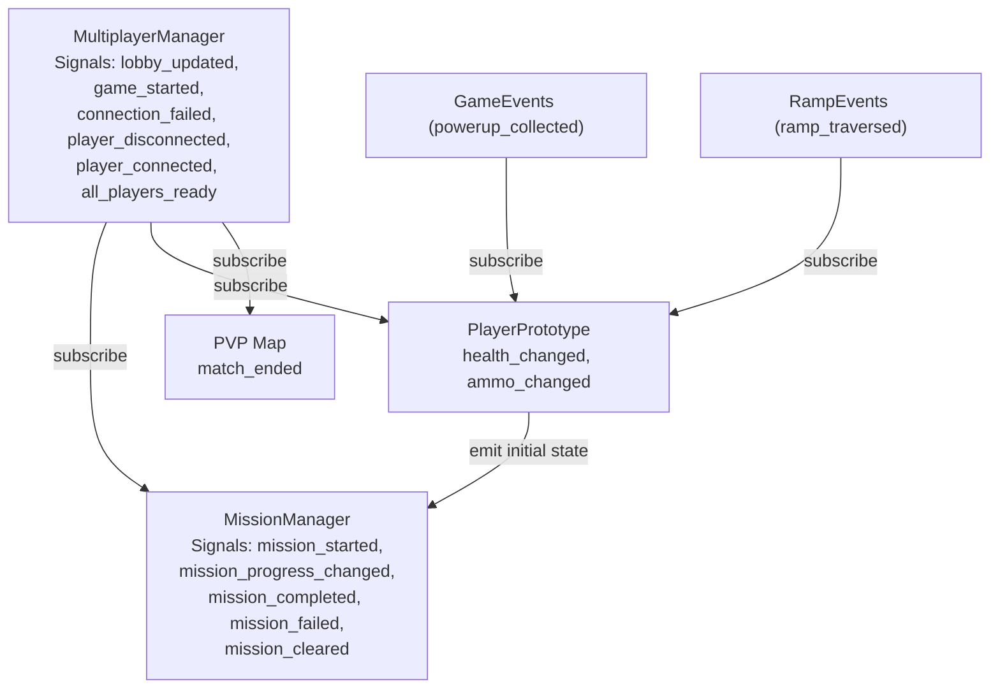
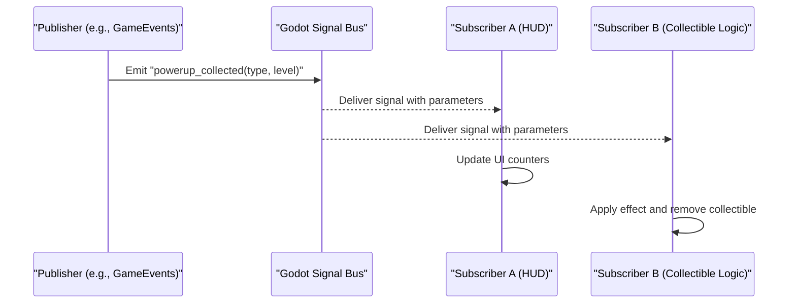
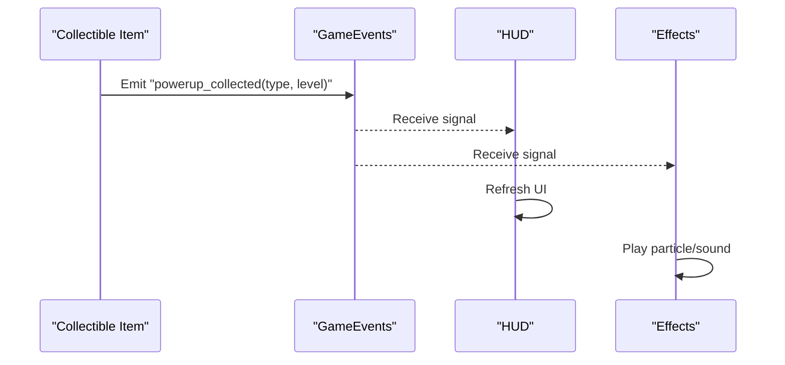
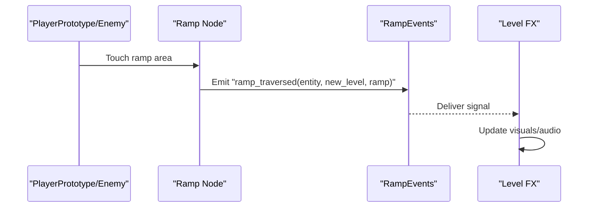
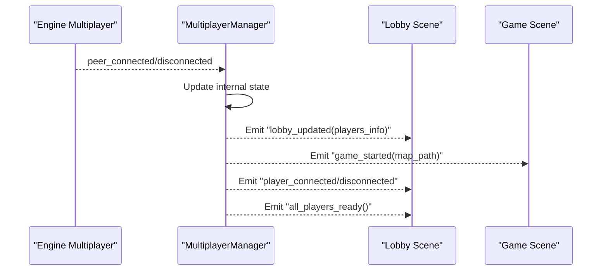
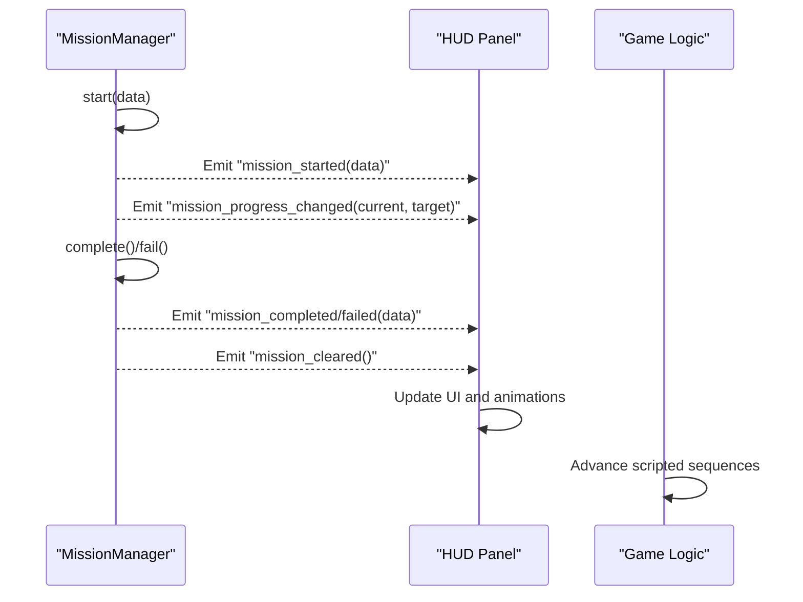
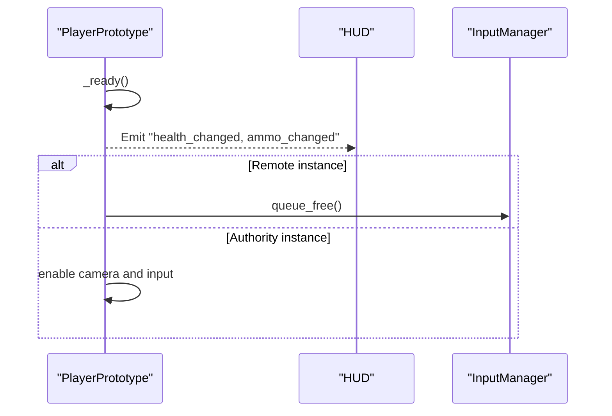
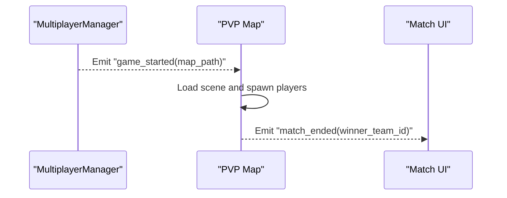
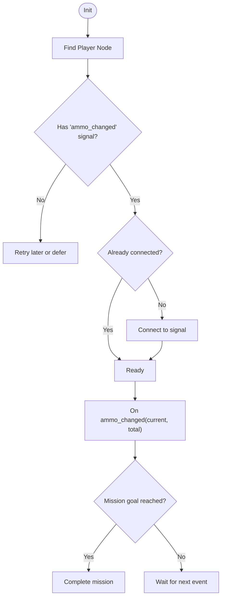
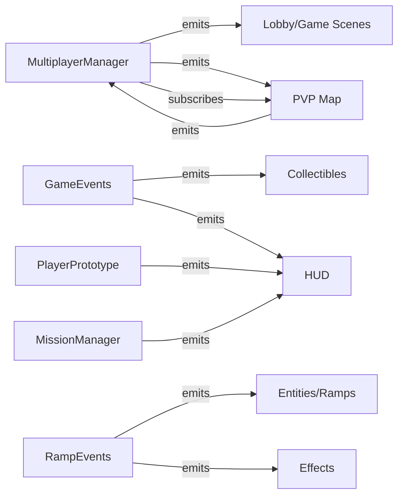

# Signal-Based Communication

<cite>
**Referenced Files in This Document**
- [game_events.gd](file://Scripts/game_events.gd)
- [ramp_events.gd](file://Scripts/ramp_events.gd)
- [multiplayer_manager.gd](file://Scripts/multiplayer_manager.gd)
- [mission_manager.gd](file://Scripts/mission_manager.gd)
- [player_prototype.gd](file://Scripts/player_prototype.gd)
- [pvp_map.gd](file://Scripts/pvp_map.gd)
- [dev_map_tutorial.gd](file://Scripts/dev_map_tutorial.gd)
</cite>

## Table of Contents
1. [Introduction](#introduction)
2. [Project Structure](#project-structure)
3. [Core Components](#core-components)
4. [Architecture Overview](#architecture-overview)
5. [Detailed Component Analysis](#detailed-component-analysis)
6. [Dependency Analysis](#dependency-analysis)
7. [Performance Considerations](#performance-considerations)
8. [Troubleshooting Guide](#troubleshooting-guide)
9. [Conclusion](#conclusion)

## Introduction
This document explains the signal-driven communication architecture used by TFA Agents in Godot. It focuses on how the observer pattern is implemented via Godot’s signal system to achieve decoupled component communication. It documents the major signal channels (GameEvents, RampEvents, MultiplayerManager, and MissionManager), describes emission patterns, parameter passing, subscription management, and provides practical examples for common scenarios such as player actions, mission events, and multiplayer synchronization. It also covers signal cleanup, memory management, and debugging techniques tailored to signal-heavy architectures.

## Project Structure
The signal architecture spans several autoload singletons and scene scripts:
- GameEvents: centralized power-up collection notifications.
- RampEvents: notifications for height-level transitions caused by ramps.
- MultiplayerManager: lobby lifecycle, connection events, and game start signals.
- MissionManager: mission lifecycle and progress signals for HUD and gameplay logic.
- PlayerPrototype: emits initial state signals and participates in multiplayer sync.
- PVP Map: integrates MultiplayerManager and emits match-specific signals.
- DevMapTutorial: demonstrates signal subscription and event-driven mission completion.

**Diagram sources**
- [game_events.gd:1-5](file://Scripts/game_events.gd#L1-L5)
- [ramp_events.gd:1-9](file://Scripts/ramp_events.gd#L1-L9)
- [multiplayer_manager.gd:15-22](file://Scripts/multiplayer_manager.gd#L15-L22)
- [pvp_map.gd:17](file://Scripts/pvp_map.gd#L17)
- [mission_manager.gd:23-27](file://Scripts/mission_manager.gd#L23-L27)
- [player_prototype.gd:77-81](file://Scripts/player_prototype.gd#L77-L81)

**Section sources**
- [game_events.gd:1-5](file://Scripts/game_events.gd#L1-L5)
- [ramp_events.gd:1-9](file://Scripts/ramp_events.gd#L1-L9)
- [multiplayer_manager.gd:15-22](file://Scripts/multiplayer_manager.gd#L15-L22)
- [mission_manager.gd:23-27](file://Scripts/mission_manager.gd#L23-L27)
- [player_prototype.gd:77-81](file://Scripts/player_prototype.gd#L77-L81)
- [pvp_map.gd:17](file://Scripts/pvp_map.gd#L17)

## Core Components
- GameEvents
  - Purpose: Broadcast power-up collection events to interested subscribers.
  - Signal: powerup_collected(powerup_type: int, level: int)
  - Typical usage: Subscribe to collectible behaviors and HUD updates.
- RampEvents
  - Purpose: Notify when an entity crosses a ramp and changes height level.
  - Signal: ramp_traversed(entity: Node2D, new_level: int, ramp: Node2D)
  - Typical usage: Trigger effects, audio cues, or level-aware logic.
- MultiplayerManager (Autoload)
  - Signals: lobby_updated, game_started, connection_failed, player_disconnected, player_connected, all_players_ready.
  - Role: Centralizes networking and emits domain events for lobby and match lifecycle.
- MissionManager (Autoload)
  - Signals: mission_started, mission_progress_changed, mission_completed, mission_failed, mission_cleared.
  - Role: Manages mission state and emits UI/HUD events.
- PlayerPrototype
  - Emits initial state signals: health_changed, ammo_changed.
  - Integrates with multiplayer authority and HUD subscriptions.

**Section sources**
- [game_events.gd:1-5](file://Scripts/game_events.gd#L1-L5)
- [ramp_events.gd:1-9](file://Scripts/ramp_events.gd#L1-L9)
- [multiplayer_manager.gd:15-22](file://Scripts/multiplayer_manager.gd#L15-L22)
- [mission_manager.gd:23-27](file://Scripts/mission_manager.gd#L23-L27)
- [player_prototype.gd:77-81](file://Scripts/player_prototype.gd#L77-L81)

## Architecture Overview
The system uses a publish-subscribe model:
- Publishers: Singletons and scene nodes emit signals when state changes occur.
- Subscribers: UI, HUD, gameplay logic, and networking code connect to these signals.
- Decoupling: Components only depend on signal contracts, not on each other’s internals.

[No sources needed since this diagram shows conceptual workflow, not actual code structure]

## Detailed Component Analysis

### GameEvents Channel
- Signal contract: powerup_collected(powerup_type: int, level: int)
- Emission pattern: emitted when a collectible is processed; publishers are typically items or triggers.
- Subscription management: subscribers connect during initialization and optionally guard with checks to avoid redundant connections.
- Parameter passing: minimal and typed; pass only what subscribers need to react efficiently.
- Example scenario: HUD subscribes to update counters; gameplay logic applies buff/debuff.

**Diagram sources**
- [game_events.gd:1-5](file://Scripts/game_events.gd#L1-L5)

**Section sources**
- [game_events.gd:1-5](file://Scripts/game_events.gd#L1-L5)

### RampEvents Channel
- Signal contract: ramp_traversed(entity: Node2D, new_level: int, ramp: Node2D)
- Emission pattern: emitted by ramp collision logic when an entity enters/leaves a ramp area.
- Subscription management: subscribers can filter by entity type or ramp identity.
- Parameter passing: includes the entity, resulting level, and the ramp node for context.
- Example scenario: trigger level-specific visuals/audio or adjust physics.

**Diagram sources**
- [ramp_events.gd:1-9](file://Scripts/ramp_events.gd#L1-L9)

**Section sources**
- [ramp_events.gd:1-9](file://Scripts/ramp_events.gd#L1-L9)

### MultiplayerManager Signals
- Signals:
  - lobby_updated(players_info: Dictionary)
  - game_started(map_path: String)
  - connection_failed(reason: String)
  - player_disconnected(peer_id: int)
  - player_connected(peer_id: int)
  - all_players_ready()
- Emission pattern: emitted in response to network events and state changes.
- Subscription management: subsystems subscribe in _ready or on demand; peers connect to engine multiplayer signals and re-emit domain signals.
- Parameter passing: dictionaries and primitives; RPCs synchronize state and then emit signals locally.
- Example scenario: Lobby UI subscribes to lobby_updated; game scene subscribes to game_started to load the map.

**Diagram sources**
- [multiplayer_manager.gd:15-22](file://Scripts/multiplayer_manager.gd#L15-L22)
- [multiplayer_manager.gd:59-64](file://Scripts/multiplayer_manager.gd#L59-L64)
- [multiplayer_manager.gd:280-308](file://Scripts/multiplayer_manager.gd#L280-L308)

**Section sources**
- [multiplayer_manager.gd:15-22](file://Scripts/multiplayer_manager.gd#L15-L22)
- [multiplayer_manager.gd:59-64](file://Scripts/multiplayer_manager.gd#L59-L64)
- [multiplayer_manager.gd:280-308](file://Scripts/multiplayer_manager.gd#L280-L308)

### MissionManager Signals
- Signals:
  - mission_started(data: MissionData)
  - mission_progress_changed(current: int, target: int)
  - mission_completed(data: MissionData)
  - mission_failed(data: MissionData)
  - mission_cleared()
- Emission pattern: emitted when missions start, progress, complete, fail, or clear.
- Subscription management: HUD and gameplay logic subscribe to these signals to render and react.
- Parameter passing: MissionData carries mission metadata; progress signals carry numeric targets.
- Example scenario: HUD subscribes to mission_started and mission_progress_changed to show progress bars.

**Diagram sources**
- [mission_manager.gd:23-27](file://Scripts/mission_manager.gd#L23-L27)
- [mission_manager.gd:50-99](file://Scripts/mission_manager.gd#L50-L99)

**Section sources**
- [mission_manager.gd:23-27](file://Scripts/mission_manager.gd#L23-L27)
- [mission_manager.gd:50-99](file://Scripts/mission_manager.gd#L50-L99)

### PlayerPrototype Signal Integration
- Initial state emissions: health_changed, ammo_changed are emitted during _ready to inform HUD and other listeners.
- Multiplayer awareness: authority and remote instances behave differently; input manager is conditionally removed for non-authority clients.
- Example scenario: HUD subscribes to these signals to keep UI synchronized with live stats.

**Diagram sources**
- [player_prototype.gd:77-81](file://Scripts/player_prototype.gd#L77-L81)
- [player_prototype.gd:73-75](file://Scripts/player_prototype.gd#L73-L75)

**Section sources**
- [player_prototype.gd:77-81](file://Scripts/player_prototype.gd#L77-L81)
- [player_prototype.gd:73-75](file://Scripts/player_prototype.gd#L73-L75)

### PVP Map Multiplayer Integration
- Subscribes to MultiplayerManager signals to orchestrate match lifecycle.
- Emits match_ended(winner_team_id: int) to notify higher-level systems.
- Example scenario: When all conditions are met, MultiplayerManager emits game_started, the map loads, and later emits match_ended.

**Diagram sources**
- [multiplayer_manager.gd:266-274](file://Scripts/multiplayer_manager.gd#L266-L274)
- [pvp_map.gd:17](file://Scripts/pvp_map.gd#L17)

**Section sources**
- [multiplayer_manager.gd:266-274](file://Scripts/multiplayer_manager.gd#L266-L274)
- [pvp_map.gd:17](file://Scripts/pvp_map.gd#L17)

### Tutorial Map Signal Subscription Pattern
- Demonstrates robust subscription management: guards against missing signals and repeated connections.
- Example scenario: Tutorial listens to player.ammo_changed to complete a “fire X rounds” mission.

**Diagram sources**
- [dev_map_tutorial.gd:239-259](file://Scripts/dev_map_tutorial.gd#L239-L259)

**Section sources**
- [dev_map_tutorial.gd:239-259](file://Scripts/dev_map_tutorial.gd#L239-L259)

## Dependency Analysis
- Coupling: Low to moderate. Components depend only on signal contracts, not on each other’s classes.
- External dependencies: Engine multiplayer signals and autoload singletons.
- Potential circular dependencies: None observed among the documented components; signals are uni-directional.

**Diagram sources**
- [multiplayer_manager.gd:15-22](file://Scripts/multiplayer_manager.gd#L15-L22)
- [pvp_map.gd:17](file://Scripts/pvp_map.gd#L17)
- [game_events.gd:1-5](file://Scripts/game_events.gd#L1-L5)
- [ramp_events.gd:1-9](file://Scripts/ramp_events.gd#L1-L9)
- [player_prototype.gd:77-81](file://Scripts/player_prototype.gd#L77-L81)
- [mission_manager.gd:23-27](file://Scripts/mission_manager.gd#L23-L27)

**Section sources**
- [multiplayer_manager.gd:15-22](file://Scripts/multiplayer_manager.gd#L15-L22)
- [pvp_map.gd:17](file://Scripts/pvp_map.gd#L17)
- [game_events.gd:1-5](file://Scripts/game_events.gd#L1-L5)
- [ramp_events.gd:1-9](file://Scripts/ramp_events.gd#L1-L9)
- [player_prototype.gd:77-81](file://Scripts/player_prototype.gd#L77-L81)
- [mission_manager.gd:23-27](file://Scripts/mission_manager.gd#L23-L27)

## Performance Considerations
- Signal fan-out cost: Each emitted signal dispatches to all connected slots. Prefer narrow subscriptions and avoid emitting excessively frequent signals.
- Parameter size: Keep emitted parameters small and immutable where possible to reduce overhead.
- Redundant connections: Guard connections with checks to prevent duplicate connections and unnecessary overhead.
- Deferred initialization: Use call_deferred for expensive initializations after signals are guaranteed to be available.
- Memory pressure: Disconnect signals when nodes exit tree or scenes change to prevent dangling references.

[No sources needed since this section provides general guidance]

## Troubleshooting Guide
- No subscribers receive signals:
  - Verify autoload singletons are registered and nodes are connected to the intended signals.
  - Ensure signals are emitted after subscribers connect; consider emitting initial state on _ready.
- Duplicate or missed events:
  - Add guards around connect() calls to avoid repeated connections.
  - Confirm signal parameters match the slot signature.
- Multiplayer desync:
  - Use RPCs to synchronize state, then emit local signals to update UI/logic.
  - Normalize dictionary keys post-RPC to maintain integer peer IDs.
- Debugging tips:
  - Print signal emissions and subscriptions for visibility.
  - Temporarily connect a debug slot to capture all emissions from a channel.
  - Validate authority vs. remote instances to ensure correct input and camera behavior.

**Section sources**
- [dev_map_tutorial.gd:239-259](file://Scripts/dev_map_tutorial.gd#L239-L259)
- [multiplayer_manager.gd:316-322](file://Scripts/multiplayer_manager.gd#L316-L322)
- [player_prototype.gd:73-75](file://Scripts/player_prototype.gd#L73-L75)

## Conclusion
TFA Agents employs a clean, signal-driven architecture leveraging Godot’s observer pattern. Autoload singletons act as publishers for domain events—GameEvents, RampEvents, MultiplayerManager, and MissionManager—while UI and gameplay logic subscribe to these signals. This design yields low coupling, predictable event flows, and scalable extension points. By following disciplined subscription management, parameter contracts, and multiplayer synchronization patterns, teams can build reliable, maintainable features such as player actions, mission progression, and multiplayer coordination.