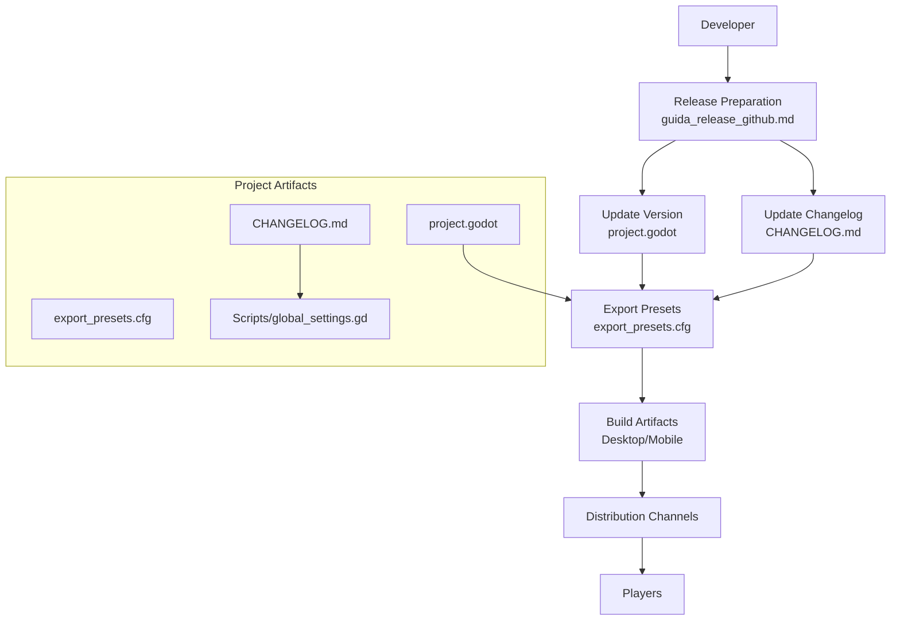
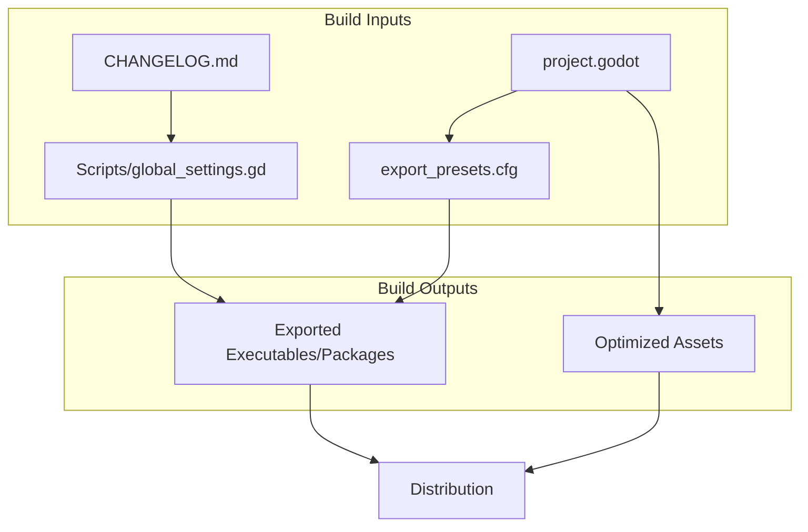

# Build and Deployment

<cite>
**Referenced Files in This Document**
- [export_presets.cfg](file://export_presets.cfg)
- [project.godot](file://project.godot)
- [guida_release_github.md](file://guida_release_github.md)
- [CHANGELOG.md](file://CHANGELOG.md)
- [global_settings.gd](file://Scripts/global_settings.gd)
- [bot.tscn](file://bot.tscn)
- [player.tscn](file://player.tscn)
- [Global.tscn](file://Global.tscn)
- [Menu/main_menu.tscn](file://Menu/main_menu.tscn)
- [Menu/settings_menu.tscn](file://Menu/settings_menu.tscn)
- [Maps/pvp_map.tscn](file://Maps/pvp_map.tscn)
- [Maps/dev_map.tscn](file://Maps/dev_map.tscn)
- [Scenes/power_up.tscn](file://Scenes/power_up.tscn)
- [Scenes/projectile_visual.tscn](file://Scenes/projectile_visual.tscn)
- [Shaders/HUD/health_bar.gdshader](file://Shaders/HUD/health_bar.gdshader)
- [Shaders/crack_shader.gdshader](file://Shaders/crack_shader.gdshader)
- [addons/mission_editor/plugin.cfg](file://addons/mission_editor/plugin.cfg)
- [addons/shader-previewer/plugin.cfg](file://addons/shader-previewer/plugin.cfg)
- [addons/virtual_joystick_plus/plugin.cfg](file://addons/virtual_joystick_plus/plugin.cfg)
</cite>

## Table of Contents
1. [Introduction](#introduction)
2. [Project Structure](#project-structure)
3. [Core Components](#core-components)
4. [Architecture Overview](#architecture-overview)
5. [Detailed Component Analysis](#detailed-component-analysis)
6. [Dependency Analysis](#dependency-analysis)
7. [Performance Considerations](#performance-considerations)
8. [Troubleshooting Guide](#troubleshooting-guide)
9. [Conclusion](#conclusion)
10. [Appendices](#appendices)

## Introduction
This document provides comprehensive build and deployment guidance for TFA Agents, a Godot-based project. It covers export configuration setup, platform-specific build procedures, distribution methods, release preparation workflow, version management, automated deployment processes, platform-specific requirements, optimization settings, troubleshooting, continuous integration setup, testing procedures, and quality assurance steps prior to release.

## Project Structure
TFA Agents follows a modular Godot project layout with scenes, scripts, addons, and assets organized by feature and domain. Key areas include:
- Export presets and project configuration for builds
- Release and changelog management
- Core gameplay scenes and scripts
- Addons for development and tooling support

```mermaid
graph TB
subgraph "Project Root"
P["project.godot"]
EP["export_presets.cfg"]
CH["CHANGELOG.md"]
GR["guida_release_github.md"]
end
subgraph "Gameplay"
BOT["bot.tscn"]
PL["player.tscn"]
GLOB["Global.tscn"]
PV["Maps/pvp_map.tscn"]
DV["Maps/dev_map.tscn"]
PU["Scenes/power_up.tscn"]
PR["Scenes/projectile_visual.tscn"]
end
subgraph "UI & Menus"
MM["Menu/main_menu.tscn"]
SM["Menu/settings_menu.tscn"]
end
subgraph "Addons"
ME["addons/mission_editor/plugin.cfg"]
SP["addons/shader-previewer/plugin.cfg"]
VJ["addons/virtual_joystick_plus/plugin.cfg"]
end
subgraph "Code"
GS["Scripts/global_settings.gd"]
end
P --> EP
P --> CH
P --> GR
P --> BOT
P --> PL
P --> GLOB
P --> PV
P --> DV
P --> PU
P --> PR
P --> MM
P --> SM
P --> GS
P --> ME
P --> SP
P --> VJ
```

**Diagram sources**
- [project.godot](file://project.godot)
- [export_presets.cfg](file://export_presets.cfg)
- [guida_release_github.md](file://guida_release_github.md)
- [CHANGELOG.md](file://CHANGELOG.md)
- [bot.tscn](file://bot.tscn)
- [player.tscn](file://player.tscn)
- [Global.tscn](file://Global.tscn)
- [Maps/pvp_map.tscn](file://Maps/pvp_map.tscn)
- [Maps/dev_map.tscn](file://Maps/dev_map.tscn)
- [Scenes/power_up.tscn](file://Scenes/power_up.tscn)
- [Scenes/projectile_visual.tscn](file://Scenes/projectile_visual.tscn)
- [Menu/main_menu.tscn](file://Menu/main_menu.tscn)
- [Menu/settings_menu.tscn](file://Menu/settings_menu.tscn)
- [addons/mission_editor/plugin.cfg](file://addons/mission_editor/plugin.cfg)
- [addons/shader-previewer/plugin.cfg](file://addons/shader-previewer/plugin.cfg)
- [addons/virtual_joystick_plus/plugin.cfg](file://addons/virtual_joystick_plus/plugin.cfg)
- [Scripts/global_settings.gd](file://Scripts/global_settings.gd)

**Section sources**
- [project.godot](file://project.godot)
- [export_presets.cfg](file://export_presets.cfg)
- [guida_release_github.md](file://guida_release_github.md)
- [CHANGELOG.md](file://CHANGELOG.md)

## Core Components
- Export configuration: Centralized via export presets for desktop and mobile targets.
- Project metadata: Version and engine configuration managed in the project file.
- Release workflow: Changelog updates and version increments coordinated with export settings.
- Asset pipeline: Scenes and shaders integrated into builds; addons enabled per target.
- Runtime behavior: Global settings script references the changelog path for in-game update notifications.

Key responsibilities:
- export_presets.cfg: Defines export templates, icons, version info, and platform-specific options.
- project.godot: Holds project version, engine settings, and plugin enablement flags.
- guida_release_github.md: Documents release steps, including version bump and changelog updates.
- global_settings.gd: Loads changelog path for runtime use.

**Section sources**
- [export_presets.cfg](file://export_presets.cfg)
- [project.godot](file://project.godot)
- [guida_release_github.md](file://guida_release_github.md)
- [global_settings.gd](file://Scripts/global_settings.gd)

## Architecture Overview
The build and deployment architecture ties together export presets, project versioning, release documentation, and asset integration. The following diagram maps the primary artifacts and their relationships during a typical release cycle.

**Diagram sources**
- [guida_release_github.md](file://guida_release_github.md)
- [project.godot](file://project.godot)
- [export_presets.cfg](file://export_presets.cfg)
- [CHANGELOG.md](file://CHANGELOG.md)
- [global_settings.gd](file://Scripts/global_settings.gd)

## Detailed Component Analysis

### Export Configuration Setup
- Purpose: Define export templates, icons, version, and platform-specific options for desktop and mobile builds.
- Key areas:
  - Export template selection and icon paths
  - Version embedding and build metadata
  - Platform-specific compression and optimization settings
  - Archive packaging for distribution

Recommended actions:
- Keep export presets synchronized with project version.
- Validate icon sizes and formats for each target platform.
- Review compression and optimization settings per platform.

**Section sources**
- [export_presets.cfg](file://export_presets.cfg)

### Project Version Management
- Purpose: Maintain semantic versioning and engine compatibility.
- Key areas:
  - Version field in project settings
  - Engine and plugin compatibility flags
  - Version used by export presets and release docs

Recommended actions:
- Increment version according to release guidelines.
- Ensure export presets reflect the current project version.
- Verify plugin configurations align with engine version.

**Section sources**
- [project.godot](file://project.godot)
- [guida_release_github.md](file://guida_release_github.md)

### Release Preparation Workflow
- Steps:
  - Update project version in project settings.
  - Update CHANGELOG.md with new entries.
  - Stage project.godot and CHANGELOG.md for commit.
  - Perform exports for target platforms.
  - Publish artifacts and notify players.

Quality gates:
- Version and changelog consistency.
- Successful export for all target platforms.
- Distribution channels updated.

**Section sources**
- [guida_release_github.md](file://guida_release_github.md)
- [project.godot](file://project.godot)
- [CHANGELOG.md](file://CHANGELOG.md)

### Automated Deployment Processes
- Suggested approach:
  - CI job triggers on version-tagged commits.
  - Job runs exports for desktop and mobile using export presets.
  - Artifacts uploaded to distribution channels.
  - Post-deployment verification via smoke tests.

Benefits:
- Consistent builds across environments.
- Reduced manual errors.
- Faster release cycles.

[No sources needed since this section provides general guidance]

### Platform-Specific Build Procedures
- Desktop (Windows/macOS/Linux):
  - Use export presets configured for desktop targets.
  - Validate executable icon and metadata.
  - Package archives for distribution.
- Mobile (Android/iOS):
  - Configure export presets for mobile targets.
  - Set signing keys and entitlements as required.
  - Optimize textures and audio for mobile performance.

Validation checklist:
- Executables launch without errors.
- Assets load correctly.
- Controls and UI responsive.

**Section sources**
- [export_presets.cfg](file://export_presets.cfg)

### Distribution Methods
- Digital distribution:
  - Storefronts (e.g., Steam, Itch.io) using exported packages.
  - Direct download links with checksums.
- In-place updates:
  - Global settings script references changelog for update prompts.
  - Ensure changelog accessibility post-release.

**Section sources**
- [global_settings.gd](file://Scripts/global_settings.gd)

### Continuous Integration Setup
- Recommended CI tasks:
  - Install Godot Editor/Exporter.
  - Checkout repository and restore dependencies.
  - Run export jobs for each target platform.
  - Upload artifacts and generate release notes.
- Quality checks:
  - Linting for scripts and configuration.
  - Smoke tests on exported builds.

[No sources needed since this section provides general guidance]

### Testing Procedures and QA
- Pre-release testing:
  - Playtesting on target platforms.
  - Verify asset loading and rendering.
  - Test controls and menus.
- Regression checks:
  - Re-run key scenarios after changes.
  - Validate export settings and packaging.

[No sources needed since this section provides general guidance]

### Optimization Settings
- Compression and packaging:
  - Adjust compression levels in export presets.
  - Enable platform-specific optimizations.
- Asset optimization:
  - Reduce texture sizes and optimize audio.
  - Minimize shader complexity where possible.

[No sources needed since this section provides general guidance]

## Dependency Analysis
The build and deployment process depends on several interrelated components. The following diagram illustrates dependencies among project artifacts and their roles in the build pipeline.

**Diagram sources**
- [project.godot](file://project.godot)
- [export_presets.cfg](file://export_presets.cfg)
- [CHANGELOG.md](file://CHANGELOG.md)
- [global_settings.gd](file://Scripts/global_settings.gd)

**Section sources**
- [project.godot](file://project.godot)
- [export_presets.cfg](file://export_presets.cfg)
- [global_settings.gd](file://Scripts/global_settings.gd)

## Performance Considerations
- Export-time optimizations:
  - Enable platform-specific compression and stripping.
  - Reduce debug symbols for production builds.
- Runtime performance:
  - Optimize shaders and materials.
  - Profile scenes and assets on target devices.

[No sources needed since this section provides general guidance]

## Troubleshooting Guide
Common build and deployment issues:
- Version mismatch:
  - Symptom: Export fails or version does not match expectations.
  - Action: Align project version with export presets and release docs.
- Missing assets:
  - Symptom: Crashes or missing visuals at runtime.
  - Action: Verify scene and asset paths; re-import assets if needed.
- Export failures:
  - Symptom: Packaging errors or invalid executables.
  - Action: Validate export preset settings; check icon and metadata paths.
- Changelog not visible:
  - Symptom: Update prompts not appearing.
  - Action: Confirm changelog path and accessibility in exported builds.

**Section sources**
- [project.godot](file://project.godot)
- [export_presets.cfg](file://export_presets.cfg)
- [global_settings.gd](file://Scripts/global_settings.gd)

## Conclusion
TFA Agents’ build and deployment process centers on coordinated export configuration, project versioning, and release documentation. By following the outlined procedures—version updates, changelog maintenance, platform-specific exports, and distribution—teams can achieve reliable releases with minimal friction. Integrating CI and QA ensures consistent quality and faster iteration.

[No sources needed since this section summarizes without analyzing specific files]

## Appendices

### Appendix A: Export Presets Reference
- Location: [export_presets.cfg](file://export_presets.cfg)
- Highlights:
  - Export template selection
  - Icon and metadata configuration
  - Platform-specific options

**Section sources**
- [export_presets.cfg](file://export_presets.cfg)

### Appendix B: Project Settings Reference
- Location: [project.godot](file://project.godot)
- Highlights:
  - Version field
  - Engine and plugin settings

**Section sources**
- [project.godot](file://project.godot)

### Appendix C: Release Workflow Reference
- Location: [guida_release_github.md](file://guida_release_github.md)
- Highlights:
  - Version bump procedure
  - Changelog update steps
  - Commit and export steps

**Section sources**
- [guida_release_github.md](file://guida_release_github.md)

### Appendix D: Changelog Reference
- Location: [CHANGELOG.md](file://CHANGELOG.md)
- Highlights:
  - Version history
  - Changes per release

**Section sources**
- [CHANGELOG.md](file://CHANGELOG.md)

### Appendix E: Runtime Changelog Path
- Location: [global_settings.gd](file://Scripts/global_settings.gd)
- Highlights:
  - Changelog path used by the game

**Section sources**
- [global_settings.gd](file://Scripts/global_settings.gd)