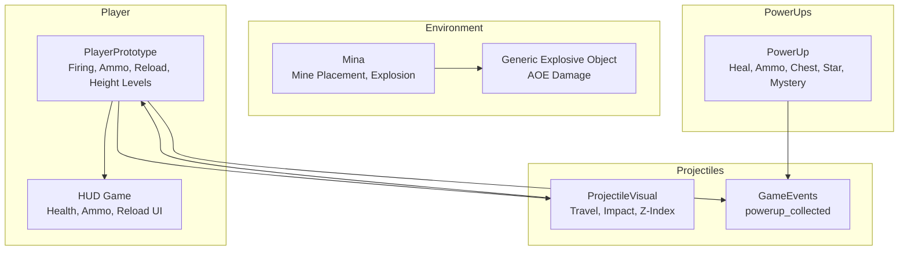
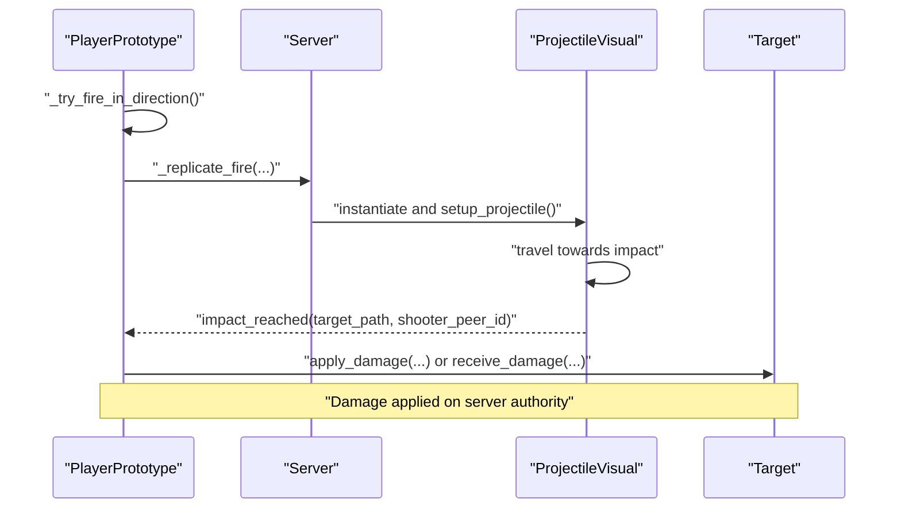
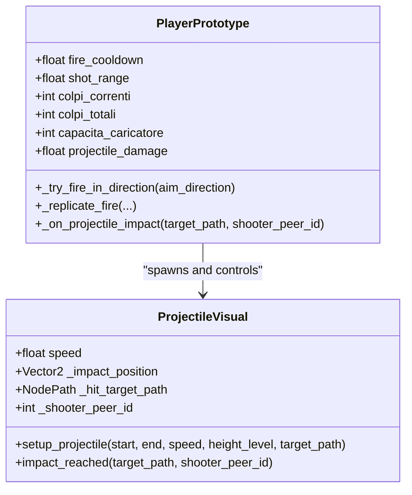
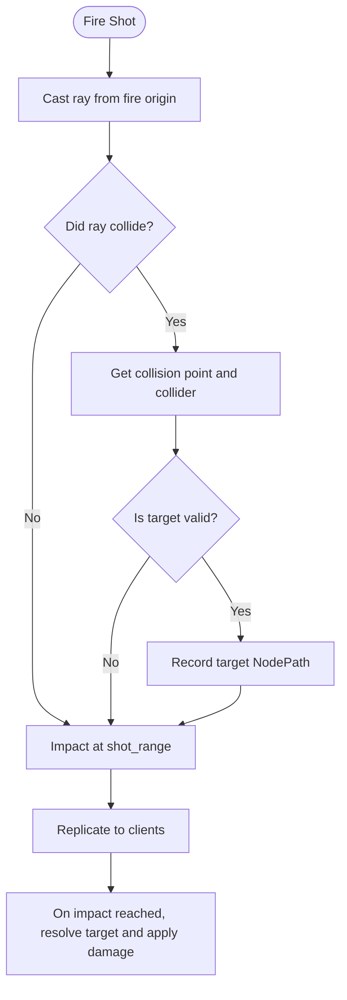
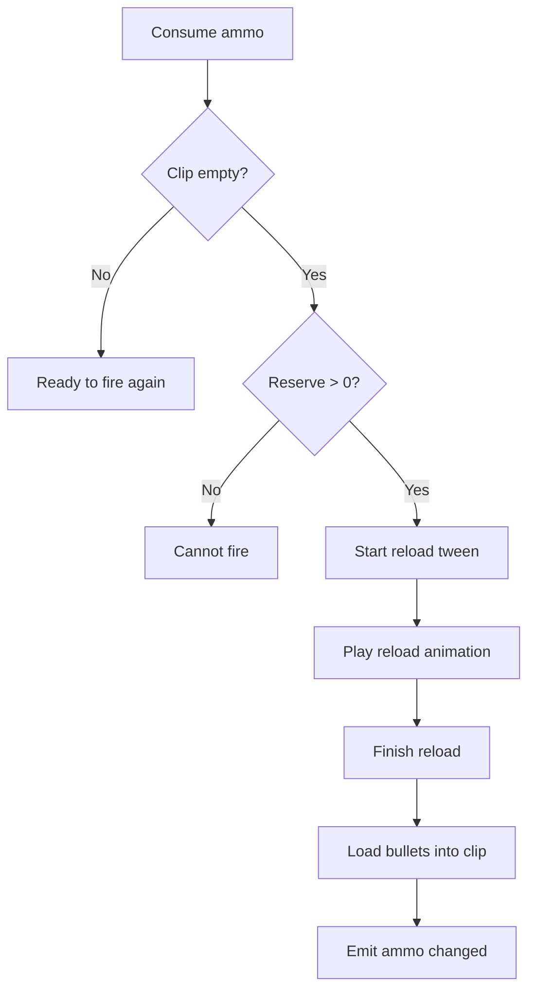
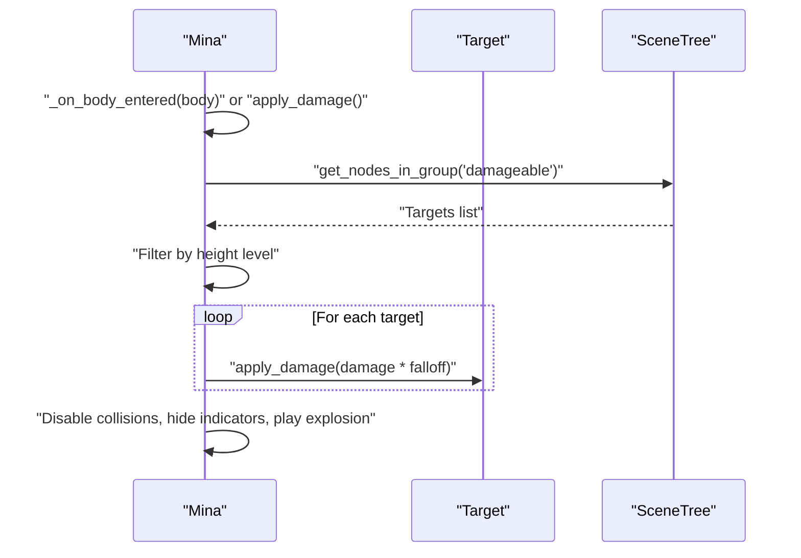
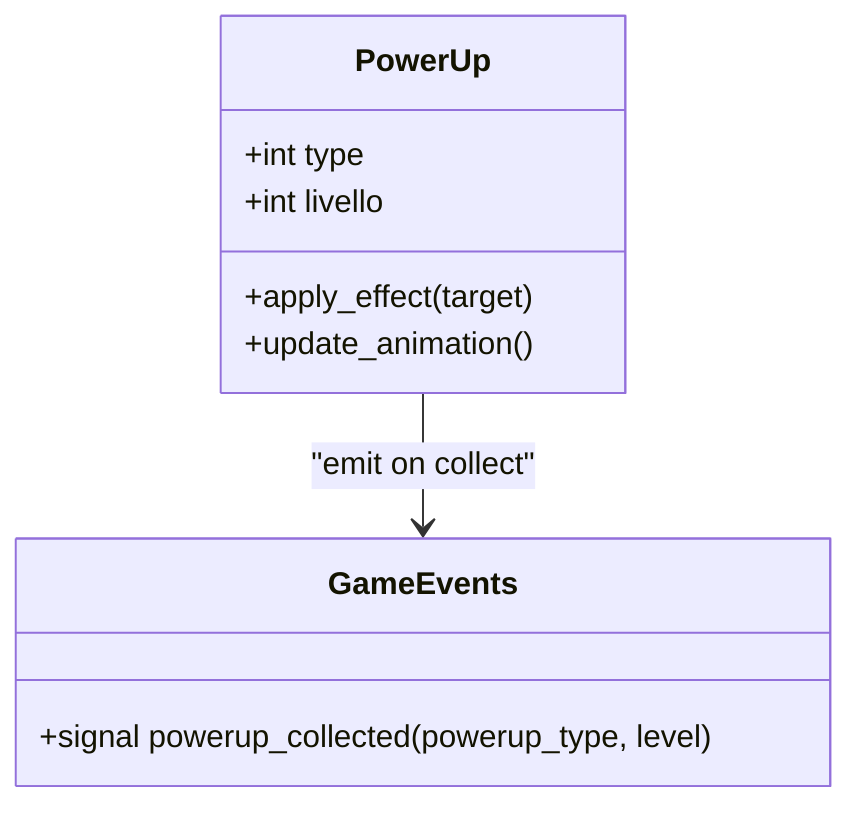
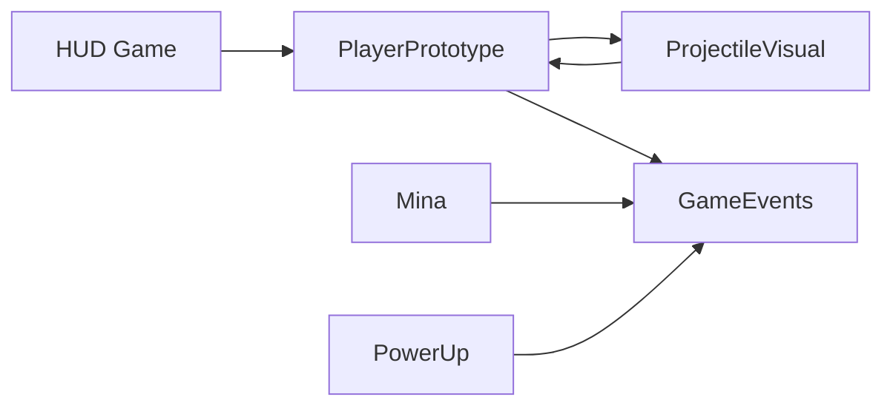

# Combat System

<cite>
**Referenced Files in This Document**
- [player_prototype.gd](file://Scripts/player_prototype.gd)
- [projectile_visual.gd](file://Scripts/projectile_visual.gd)
- [mina.gd](file://Scripts/mina.gd)
- [power_up.gd](file://Scripts/power_up.gd)
- [hud_game.gd](file://Menu/HUD/hud_game.gd)
- [game_events.gd](file://Scripts/game_events.gd)
- [Mina.tscn](file://Game/Oggetti/Mina.tscn)
- [projectile_visual.tscn](file://Scenes/projectile_visual.tscn)
</cite>

## Table of Contents
1. [Introduction](#introduction)
2. [Project Structure](#project-structure)
3. [Core Components](#core-components)
4. [Architecture Overview](#architecture-overview)
5. [Detailed Component Analysis](#detailed-component-analysis)
6. [Dependency Analysis](#dependency-analysis)
7. [Performance Considerations](#performance-considerations)
8. [Troubleshooting Guide](#troubleshooting-guide)
9. [Conclusion](#conclusion)

## Introduction
This document describes the Combat System in TFA Agents, focusing on weapon mechanics, projectile physics, damage calculation, ammo management, mine placement and explosions, area-of-effect mechanics, power-ups, projectile visualization, hit detection, collision handling, weapon switching, reload animations, and inventory management. It also outlines combat interactions with enemy AI and environmental destruction systems.

## Project Structure
The combat system spans several scripts and scenes:
- Player character behavior and weapon logic
- Projectile visualization and impact handling
- Explosive mine mechanics and blast zones
- Power-up collection and effects
- HUD updates for health, ammo, and reload events
- Centralized game events for power-up collection

**Diagram sources**
- [player_prototype.gd](file://Scripts/player_prototype.gd)
- [projectile_visual.gd](file://Scripts/projectile_visual.gd)
- [mina.gd](file://Scripts/mina.gd)
- [power_up.gd](file://Scripts/power_up.gd)
- [game_events.gd](file://Scripts/game_events.gd)
- [hud_game.gd](file://Menu/HUD/hud_game.gd)

**Section sources**
- [player_prototype.gd](file://Scripts/player_prototype.gd)
- [projectile_visual.gd](file://Scripts/projectile_visual.gd)
- [mina.gd](file://Scripts/mina.gd)
- [power_up.gd](file://Scripts/power_up.gd)
- [hud_game.gd](file://Menu/HUD/hud_game.gd)
- [game_events.gd](file://Scripts/game_events.gd)

## Core Components
- PlayerPrototype: Implements weapon firing, cooldowns, ammo consumption, reload mechanics, height-level-aware targeting, and RPC-based replication of shots and impacts.
- ProjectileVisual: Handles visual projectile movement, collision detection, and impact delivery to targets.
- Mina: Implements placed mines that explode on contact or damage, with height-level checks and area damage falloff.
- PowerUp: Manages collectible items (health, ammo, weapon chests, coins, collectibles, mystery) and emits centralized events.
- HUD Game: Subscribes to player signals to update health, ammo, and reload visuals.
- GameEvents: Central event bus for power-up collection.

**Section sources**
- [player_prototype.gd](file://Scripts/player_prototype.gd)
- [projectile_visual.gd](file://Scripts/projectile_visual.gd)
- [mina.gd](file://Scripts/mina.gd)
- [power_up.gd](file://Scripts/power_up.gd)
- [hud_game.gd](file://Menu/HUD/hud_game.gd)
- [game_events.gd](file://Scripts/game_events.gd)

## Architecture Overview
The combat pipeline begins when the player fires. The PlayerPrototype validates readiness, consumes ammo, and spawns a ProjectileVisual instance. The projectile travels toward the impact position, optionally triggers an impact signal upon reaching the target, and applies damage to the target via method dispatch. On the server, explosions from mines and other explosives apply area damage with distance-based falloff. Power-ups are collected centrally and broadcast via GameEvents.

**Diagram sources**
- [player_prototype.gd](file://Scripts/player_prototype.gd)
- [projectile_visual.gd](file://Scripts/projectile_visual.gd)

## Detailed Component Analysis

### Weapon Mechanics and Firing
- Firing rate and cooldown: Controlled by a configurable cooldown exported property and internal last-shot tracking.
- Range and accuracy: Shot range determines maximum travel distance; raycast-based hit detection adjusts impact position to the closest valid target.
- Friendly fire prevention: Team-aware targeting ensures players on the same team are not damaged.
- Multiplayer replication: RPC sends shot origin, impact position, target path, height level, and visual speed to clients for synchronized visuals.

Key behaviors:
- Cooldown enforcement and auto-reload when clip is empty but reserves remain.
- Ammo consumption and HUD emission on each shot.
- Screen shake and subtitle feedback on local client when applicable.

**Section sources**
- [player_prototype.gd](file://Scripts/player_prototype.gd)

### Projectile Physics and Visualization
- Movement: ProjectileVisual calculates direction and remaining distance each frame, moves along the trajectory, and updates a trailing effect.
- Height-level rendering: Z-index is set based on height level to ensure proper layering.
- Impact delivery: Upon reaching the destination, the projectile emits an impact signal containing the target’s NodePath and the shooter’s peer ID. The player resolves the target and applies damage.

**Diagram sources**
- [player_prototype.gd](file://Scripts/player_prototype.gd)
- [projectile_visual.gd](file://Scripts/projectile_visual.gd)

**Section sources**
- [projectile_visual.gd](file://Scripts/projectile_visual.gd)
- [player_prototype.gd](file://Scripts/player_prototype.gd)

### Damage Calculation and Hit Detection
- Direct hits: If a raycast collides with a valid target (enemy, bot, or damageable group), the impact position is snapped to the collision point and the target’s NodePath is recorded.
- Target validation: Players are checked against friendly fire rules using team IDs; other nodes are validated via groups.
- Damage application: The player resolves the target from the NodePath and calls either an apply_damage method or receive_damage with the shooter’s peer ID for attribution.

**Diagram sources**
- [player_prototype.gd](file://Scripts/player_prototype.gd)

**Section sources**
- [player_prototype.gd](file://Scripts/player_prototype.gd)

### Ammo Management and Reload Mechanics
- Clip capacity and reserves: Configurable magazine capacity and total reserve ammunition.
- Reload animation: A weapon sprite tween plays a reload animation while a tween interval counts down the reload duration.
- Finish reload: Adds loaded rounds up to clip capacity and decrements reserves; emits HUD updates and optional subtitles.

**Diagram sources**
- [player_prototype.gd](file://Scripts/player_prototype.gd)

**Section sources**
- [player_prototype.gd](file://Scripts/player_prototype.gd)

### Mine Placement System and Explosions
- Placement: Mines are placed on the ground and associated with a height level; only targets on the same level are affected.
- Trigger conditions: Explodes when stepped on by an enemy or when taking damage from enemy fire.
- Explosion mechanics: Server iterates damageable entities on the same level, computes distance to the mine, applies damage with inverse-distance falloff, disables collisions, hides indicators, removes shader material, and starts explosion visuals.

**Diagram sources**
- [mina.gd](file://Scripts/mina.gd)

**Section sources**
- [mina.gd](file://Scripts/mina.gd)
- [Mina.tscn](file://Game/Oggetti/Mina.tscn)

### Area-of-Effect Mechanics
- Distance-based falloff: Damage decreases proportionally to the ratio of distance to explosion radius.
- Height-level filtering: Only entities on the same height level as the mine are considered for damage.
- Server-authoritative application: Ensures consistent damage application across network sessions.

**Section sources**
- [mina.gd](file://Scripts/mina.gd)

### Power-Up System
- Types: Health packs, ammo crates, weapon chests, currency, collectibles, and mystery items.
- Collection: On overlap, if the target is on the same height level and is a player, the server emits a centralized powerup_collected event and applies the effect locally or on the server.
- Effects: Applied immediately on the collecting entity; HUD and gameplay responses are handled by subscribers.

**Diagram sources**
- [power_up.gd](file://Scripts/power_up.gd)
- [game_events.gd](file://Scripts/game_events.gd)

**Section sources**
- [power_up.gd](file://Scripts/power_up.gd)
- [game_events.gd](file://Scripts/game_events.gd)

### Projectile Visualization Details
- Scene reference: ProjectileVisual scene is preloaded and instantiated by the player.
- Trail rendering: Optional trail effect updates during travel.
- Z-index alignment: Ensures visual layering matches height level.

**Section sources**
- [player_prototype.gd](file://Scripts/player_prototype.gd)
- [projectile_visual.tscn](file://Scenes/projectile_visual.tscn)

### Inventory and Weapon Switching
- Current weapon name: Exposed as an exported property for HUD display and identification.
- Inventory management: Ammunition is tracked per weapon type; switching implies changing the active weapon’s stats and HUD representation.
- Note: The provided code does not show explicit weapon switch logic; weapon selection and HUD updates rely on the active weapon’s exported properties and HUD subscriptions.

**Section sources**
- [player_prototype.gd](file://Scripts/player_prototype.gd)
- [hud_game.gd](file://Menu/HUD/hud_game.gd)

### Enemy AI Behavior and Environmental Destruction
- Enemy targets: Targets are validated via groups and team checks; bots and generic damageables are valid targets.
- Environmental destruction: Explosives (mine and generic object) reduce health of nearby damageables with falloff; destroyed objects remove collision and visual effects.

**Section sources**
- [player_prototype.gd](file://Scripts/player_prototype.gd)
- [mina.gd](file://Scripts/mina.gd)

## Dependency Analysis
- PlayerPrototype depends on:
  - ProjectileVisual scene for visual bullets
  - GameEvents for power-up collection
  - HUD for UI updates
- ProjectileVisual depends on:
  - Scene tree to resolve NodePaths and deliver impacts
- Mina depends on:
  - SceneTree to enumerate damageable entities
  - Network authority for deterministic explosion application
- PowerUp depends on:
  - GameEvents for centralized collection notifications

**Diagram sources**
- [player_prototype.gd](file://Scripts/player_prototype.gd)
- [projectile_visual.gd](file://Scripts/projectile_visual.gd)
- [mina.gd](file://Scripts/mina.gd)
- [power_up.gd](file://Scripts/power_up.gd)
- [game_events.gd](file://Scripts/game_events.gd)
- [hud_game.gd](file://Menu/HUD/hud_game.gd)

**Section sources**
- [player_prototype.gd](file://Scripts/player_prototype.gd)
- [projectile_visual.gd](file://Scripts/projectile_visual.gd)
- [mina.gd](file://Scripts/mina.gd)
- [power_up.gd](file://Scripts/power_up.gd)
- [game_events.gd](file://Scripts/game_events.gd)
- [hud_game.gd](file://Menu/HUD/hud_game.gd)

## Performance Considerations
- Server-authoritative damage: Ensures deterministic outcomes and reduces client-side prediction overhead.
- Raycast culling: Limiting shot range and using early exit when aim direction is near zero avoids unnecessary computations.
- Area damage iteration: Filtering by height level reduces the number of targets processed for explosions.
- Deferred calls: Using deferred method calls for damage application prevents immediate reentrancy and stabilizes the simulation.

## Troubleshooting Guide
- No damage on hit:
  - Verify target is in a recognized group and not a friendly unit.
  - Confirm the raycast is updating and returning a collider.
- Reload not completing:
  - Ensure reload tween is started and not interrupted.
  - Check that clip capacity and reserve counts are sufficient.
- Mine not exploding:
  - Confirm the stepping entity shares the same height level.
  - Verify the server is authoritative for explosion triggers.
- Power-up not collected:
  - Ensure the collector is on the same height level and is a player.
  - Confirm the server emits the powerup_collected signal.

**Section sources**
- [player_prototype.gd](file://Scripts/player_prototype.gd)
- [mina.gd](file://Scripts/mina.gd)
- [power_up.gd](file://Scripts/power_up.gd)

## Conclusion
The TFA Agents Combat System integrates precise weapon mechanics, reliable projectile visualization, server-authoritative damage application, and robust area-of-effect explosions. PlayerPrototype orchestrates firing, ammo, and reload logic, while ProjectileVisual delivers consistent visuals and impact delivery. Mina implements height-level-aware explosions with distance-based falloff, and PowerUp centralizes item collection via GameEvents. Together, these components form a cohesive, network-friendly combat framework suitable for both single-player and multiplayer scenarios.