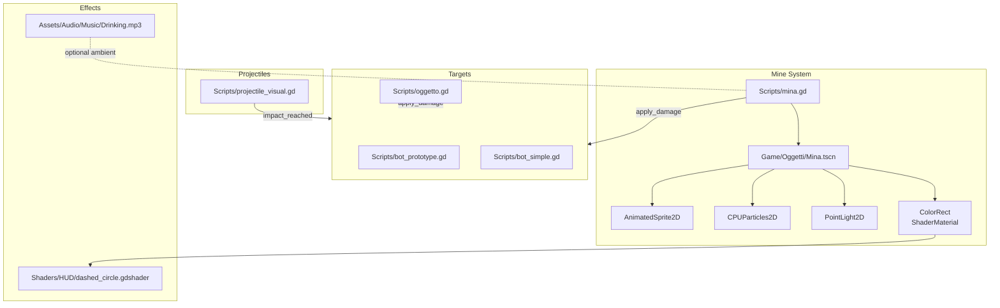
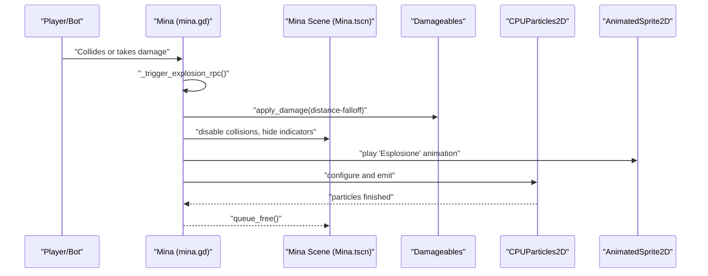
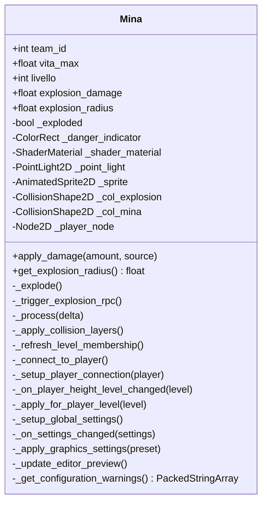
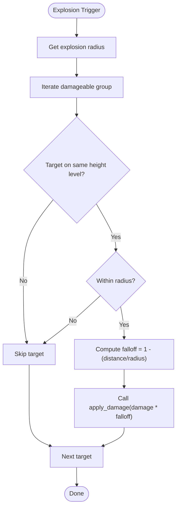
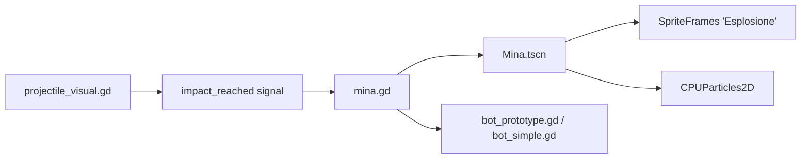

# Explosive System

<cite>
**Referenced Files in This Document**
- [mina.gd](file://Scripts/mina.gd)
- [Mina.tscn](file://Game/Oggetti/Mina.tscn)
- [projectile_visual.gd](file://Scripts/projectile_visual.gd)
- [oggetto.gd](file://Scripts/oggetto.gd)
- [bot_prototype.gd](file://Scripts/bot_prototype.gd)
- [bot_simple.gd](file://Scripts/bot_simple.gd)
- [dashed_circle.gdshader](file://Shaders/HUD/dashed_circle.gdshader)
- [Drinking.mp3](file://Assets/Audio/Music/Drinking.mp3)
</cite>

## Table of Contents
1. [Introduction](#introduction)
2. [Project Structure](#project-structure)
3. [Core Components](#core-components)
4. [Architecture Overview](#architecture-overview)
5. [Detailed Component Analysis](#detailed-component-analysis)
6. [Dependency Analysis](#dependency-analysis)
7. [Performance Considerations](#performance-considerations)
8. [Troubleshooting Guide](#troubleshooting-guide)
9. [Conclusion](#conclusion)

## Introduction
This document describes the explosive system implemented in the project, focusing on mine placement, proximity-triggered detonation, area-of-effect (AoE) damage calculations, and the visual/audio feedback pipeline. It also covers explosive timing, multiplayer synchronization, and how explosions interact with different surfaces, obstacles, and enemy units. The system supports height-level-aware targeting, dynamic lighting indicators, animated explosion sprites, and configurable particle effects.

## Project Structure
The explosive system spans several scripts and scenes:
- Mine entity logic and visuals are implemented in a dedicated script and scene.
- Projectile visuals demonstrate trajectory and impact signaling, informing how projectiles interact with targets prior to explosion.
- Generic destructible objects share similar explosion logic for barrels and crates.
- Player and bot entities implement a shared damage interface consumed by explosions.

**Diagram sources**
- [mina.gd:57-114](file://Scripts/mina.gd#L57-L114)
- [Mina.tscn:199-235](file://Game/Oggetti/Mina.tscn#L199-L235)
- [projectile_visual.gd:43-99](file://Scripts/projectile_visual.gd#L43-L99)
- [oggetto.gd:136-248](file://Scripts/oggetto.gd#L136-L248)
- [bot_prototype.gd:58-85](file://Scripts/bot_prototype.gd#L58-L85)
- [bot_simple.gd:40-292](file://Scripts/bot_simple.gd#L40-L292)
- [dashed_circle.gdshader](file://Shaders/HUD/dashed_circle.gdshader)
- [Drinking.mp3](file://Assets/Audio/Music/Drinking.mp3)

**Section sources**
- [mina.gd:57-114](file://Scripts/mina.gd#L57-L114)
- [Mina.tscn:199-235](file://Game/Oggetti/Mina.tscn#L199-L235)
- [projectile_visual.gd:43-99](file://Scripts/projectile_visual.gd#L43-L99)
- [oggetto.gd:136-248](file://Scripts/oggetto.gd#L136-L248)
- [bot_prototype.gd:58-85](file://Scripts/bot_prototype.gd#L58-L85)
- [bot_simple.gd:40-292](file://Scripts/bot_simple.gd#L40-L292)

## Core Components
- Mine entity: Proximity-triggered explosive with AoE damage, dynamic light indicator, and visual explosion.
- Explosion rendering: Animated sprite frames and CPU particles configured by graphics preset.
- Damage delivery: Distance-based falloff applied to all damageable entities on the same height level.
- Multiplayer synchronization: RPC-based detonation and damage replication.
- Projectile visualization: Trajectory, height-level visibility, and impact signal emission.

Key implementation references:
- Mine lifecycle and explosion: [mina.gd:118-285](file://Scripts/mina.gd#L118-L285)
- Mine scene setup and effects: [Mina.tscn:199-235](file://Game/Oggetti/Mina.tscn#L199-L235)
- Projectile impact signaling: [projectile_visual.gd:92-99](file://Scripts/projectile_visual.gd#L92-L99)
- Generic explosion logic for destructibles: [oggetto.gd:181-248](file://Scripts/oggetto.gd#L181-L248)
- Target damage interface: [bot_prototype.gd:85](file://Scripts/bot_prototype.gd#L85), [bot_simple.gd:292](file://Scripts/bot_simple.gd#L292)

**Section sources**
- [mina.gd:118-285](file://Scripts/mina.gd#L118-L285)
- [Mina.tscn:199-235](file://Game/Oggetti/Mina.tscn#L199-L235)
- [projectile_visual.gd:92-99](file://Scripts/projectile_visual.gd#L92-L99)
- [oggetto.gd:181-248](file://Scripts/oggetto.gd#L181-L248)
- [bot_prototype.gd:85](file://Scripts/bot_prototype.gd#L85)
- [bot_simple.gd:292](file://Scripts/bot_simple.gd#L292)

## Architecture Overview
The explosive system follows a layered architecture:
- Entity layer: Mine and destructible objects expose an explosion method and a damage method.
- Detection layer: Mines detect targets via Area2D signals and height-level checks.
- Damage layer: Explosion computes distance-based falloff and applies damage to eligible targets.
- Rendering layer: Animated sprite and particles visualize the blast; dynamic light and shader-based danger indicator provide feedback.
- Networking layer: RPC ensures server-authoritative detonation and synchronized damage application.

**Diagram sources**
- [mina.gd:160-204](file://Scripts/mina.gd#L160-L204)
- [mina.gd:211-285](file://Scripts/mina.gd#L211-L285)
- [Mina.tscn:218-235](file://Game/Oggetti/Mina.tscn#L218-L235)

## Detailed Component Analysis

### Mine Entity (Mina)
Responsibilities:
- Proximity-triggered detonation via Area2D body_entered.
- Height-level filtering to limit blast to same elevation.
- Team-aware detection to avoid friendly detonation.
- Server-authoritative explosion via RPC.
- Dynamic light and danger indicator for player feedback.
- Particle and sprite explosion rendering with graphics preset scaling.

**Diagram sources**
- [mina.gd:6-114](file://Scripts/mina.gd#L6-L114)
- [mina.gd:118-285](file://Scripts/mina.gd#L118-L285)

Key behaviors:
- Proximity indicator and light color change based on player distance and team alignment: [mina.gd:118-158](file://Scripts/mina.gd#L118-L158)
- Trigger on body enter when target is on the same height level and not friendly: [mina.gd:160-184](file://Scripts/mina.gd#L160-L184)
- Damage application with distance-based falloff: [mina.gd:217-241](file://Scripts/mina.gd#L217-L241)
- Visual explosion and particle scaling: [mina.gd:257-285](file://Scripts/mina.gd#L257-L285)

**Section sources**
- [mina.gd:6-114](file://Scripts/mina.gd#L6-L114)
- [mina.gd:118-184](file://Scripts/mina.gd#L118-L184)
- [mina.gd:211-285](file://Scripts/mina.gd#L211-L285)

### Explosion Rendering and Effects
- Animated explosion sprite: Two animation sets are defined in the scene, including a looping variant and a non-looping blast animation: [Mina.tscn:53-187](file://Game/Oggetti/Mina.tscn#L53-L187)
- CPU particles: Emission sphere radius, initial velocity, scale amounts, and lifetime are tuned to explosion radius and graphics preset: [Mina.tscn:218-235](file://Game/Oggetti/Mina.tscn#L218-L235)
- Dynamic light and danger indicator: Radial gradient texture and shader material for the danger ring; energy and color vary with proximity and team: [mina.gd:68-102](file://Scripts/mina.gd#L68-L102), [mina.gd:118-158](file://Scripts/mina.gd#L118-L158)
- Graphics preset integration: Animation speed and particle count scale with quality presets; shadows enabled only at higher presets: [mina.gd:379-403](file://Scripts/mina.gd#L379-L403)

**Section sources**
- [Mina.tscn:53-187](file://Game/Oggetti/Mina.tscn#L53-L187)
- [Mina.tscn:218-235](file://Game/Oggetti/Mina.tscn#L218-L235)
- [mina.gd:68-102](file://Scripts/mina.gd#L68-L102)
- [mina.gd:118-158](file://Scripts/mina.gd#L118-L158)
- [mina.gd:379-403](file://Scripts/mina.gd#L379-L403)

### Damage Calculation and Falloff
- Distance check against explosion radius: [mina.gd:237-239](file://Scripts/mina.gd#L237-L239)
- Falloff computation: [mina.gd:240](file://Scripts/mina.gd#L240)
- Damage application via target method: [mina.gd:241](file://Scripts/mina.gd#L241)
- Height-level filtering prevents cross-level damage propagation: [mina.gd:224-232](file://Scripts/mina.gd#L224-L232)

**Diagram sources**
- [mina.gd:217-241](file://Scripts/mina.gd#L217-L241)

**Section sources**
- [mina.gd:217-241](file://Scripts/mina.gd#L217-L241)

### Projectile Impact and Detonation Timing
- Projectile trajectory with speed and direction: [projectile_visual.gd:22-41](file://Scripts/projectile_visual.gd#L22-L41)
- Level-aware visibility: [projectile_visual.gd:61-69](file://Scripts/projectile_visual.gd#L61-L69)
- Impact emission: [projectile_visual.gd:92-99](file://Scripts/projectile_visual.gd#L92-L99)
- Detonation timing: Explosions occur after impact; the mine explosion sequence runs immediately upon trigger: [mina.gd:202-204](file://Scripts/mina.gd#L202-L204), [mina.gd:211-285](file://Scripts/mina.gd#L211-L285)

**Section sources**
- [projectile_visual.gd:22-41](file://Scripts/projectile_visual.gd#L22-L41)
- [projectile_visual.gd:61-69](file://Scripts/projectile_visual.gd#L61-L69)
- [projectile_visual.gd:92-99](file://Scripts/projectile_visual.gd#L92-L99)
- [mina.gd:202-204](file://Scripts/mina.gd#L202-L204)
- [mina.gd:211-285](file://Scripts/mina.gd#L211-L285)

### Multiplayer and Remote Detonation
- RPC-based explosion trigger: [mina.gd:202-204](file://Scripts/mina.gd#L202-L204)
- Server authority enforced for damage application: [mina.gd:217](file://Scripts/mina.gd#L217)
- Friendly fire prevention via team detection: [mina.gd:176-179](file://Scripts/mina.gd#L176-L179)

**Section sources**
- [mina.gd:202-204](file://Scripts/mina.gd#L202-L204)
- [mina.gd:217](file://Scripts/mina.gd#L217)
- [mina.gd:176-179](file://Scripts/mina.gd#L176-L179)

### Generic Destructible Explosions (Barrels/Crates)
- Shared explosion routine applies damage to nearby targets with falloff: [oggetto.gd:181-248](file://Scripts/oggetto.gd#L181-L248)
- Visual and particle behavior mirrors the mine system: [oggetto.gd:220-248](file://Scripts/oggetto.gd#L220-L248)

**Section sources**
- [oggetto.gd:181-248](file://Scripts/oggetto.gd#L181-L248)
- [oggetto.gd:220-248](file://Scripts/oggetto.gd#L220-L248)

### Environmental Interactions and Obstacles
- Height-level awareness ensures explosions affect only entities on the same elevation: [mina.gd:224-232](file://Scripts/mina.gd#L224-L232)
- Collision layer/mask derived from height level prevent cross-level detection: [mina.gd:301-310](file://Scripts/mina.gd#L301-L310)
- Friendly indicator color changes to green when player is on the same team, otherwise red: [mina.gd:133-149](file://Scripts/mina.gd#L133-L149)

**Section sources**
- [mina.gd:224-232](file://Scripts/mina.gd#L224-L232)
- [mina.gd:301-310](file://Scripts/mina.gd#L301-L310)
- [mina.gd:133-149](file://Scripts/mina.gd#L133-L149)

## Dependency Analysis
- Mina depends on:
  - Scene resources for sprite frames, particles, and collision shapes: [Mina.tscn:53-187](file://Game/Oggetti/Mina.tscn#L53-L187)
  - Shader material for the danger indicator: [mina.gd:76-84](file://Scripts/mina.gd#L76-L84)
  - Global settings for graphics preset: [mina.gd:270-274](file://Scripts/mina.gd#L270-L274)
- Targets depend on:
  - Shared apply_damage interface: [bot_prototype.gd:85](file://Scripts/bot_prototype.gd#L85), [bot_simple.gd:292](file://Scripts/bot_simple.gd#L292)
- Projectiles:
  - Emit impact signal consumed by systems that place mines or trigger explosions: [projectile_visual.gd:92-99](file://Scripts/projectile_visual.gd#L92-L99)

**Diagram sources**
- [mina.gd:57-114](file://Scripts/mina.gd#L57-L114)
- [Mina.tscn:53-187](file://Game/Oggetti/Mina.tscn#L53-L187)
- [projectile_visual.gd:92-99](file://Scripts/projectile_visual.gd#L92-L99)
- [bot_prototype.gd:85](file://Scripts/bot_prototype.gd#L85)
- [bot_simple.gd:292](file://Scripts/bot_simple.gd#L292)

**Section sources**
- [mina.gd:57-114](file://Scripts/mina.gd#L57-L114)
- [Mina.tscn:53-187](file://Game/Oggetti/Mina.tscn#L53-L187)
- [projectile_visual.gd:92-99](file://Scripts/projectile_visual.gd#L92-L99)
- [bot_prototype.gd:85](file://Scripts/bot_prototype.gd#L85)
- [bot_simple.gd:292](file://Scripts/bot_simple.gd#L292)

## Performance Considerations
- Graphics preset scaling:
  - Particle counts and animation speeds adapt to preset, reducing cost on lower settings: [mina.gd:379-403](file://Scripts/mina.gd#L379-L403)
- Deferred collision disabling avoids immediate physics recalculation during explosion: [mina.gd:244-245](file://Scripts/mina.gd#L244-L245)
- One-shot particle emission with short lifetime minimizes long-lived effect overhead: [Mina.tscn:220-222](file://Game/Oggetti/Mina.tscn#L220-L222)
- Height-level filtering reduces unnecessary damage iterations: [mina.gd:224-232](file://Scripts/mina.gd#L224-L232)

[No sources needed since this section provides general guidance]

## Troubleshooting Guide
- Mine does not explode:
  - Verify height level alignment and team detection logic: [mina.gd:166-174](file://Scripts/mina.gd#L166-L174), [mina.gd:176-179](file://Scripts/mina.gd#L176-L179)
  - Confirm collision layer/mask configuration for the Area2D: [mina.gd:301-310](file://Scripts/mina.gd#L301-L310)
- Damage not applied:
  - Ensure targets implement apply_damage and are in the "damageable" group: [bot_prototype.gd:58](file://Scripts/bot_prototype.gd#L58), [bot_simple.gd:40](file://Scripts/bot_simple.gd#L40)
- Visual artifacts:
  - Check graphics preset settings and shader parameter quality: [mina.gd:375-382](file://Scripts/mina.gd#L375-L382)
- Friendly fire concerns:
  - Validate team detection and indicator color logic: [mina.gd:133-149](file://Scripts/mina.gd#L133-L149)

**Section sources**
- [mina.gd:166-179](file://Scripts/mina.gd#L166-L179)
- [mina.gd:301-310](file://Scripts/mina.gd#L301-L310)
- [bot_prototype.gd:58](file://Scripts/bot_prototype.gd#L58)
- [bot_simple.gd:40](file://Scripts/bot_simple.gd#L40)
- [mina.gd:375-382](file://Scripts/mina.gd#L375-L382)
- [mina.gd:133-149](file://Scripts/mina.gd#L133-L149)

## Conclusion
The explosive system integrates proximity-triggered mines, precise AoE damage with distance falloff, and robust visual feedback. Height-level awareness and team detection ensure contextual interactions, while RPC-based synchronization maintains authoritative gameplay. The modular design allows reuse for other destructible objects and can be extended to support additional triggers (e.g., timed charges) by adapting the activation conditions and adding timer logic.