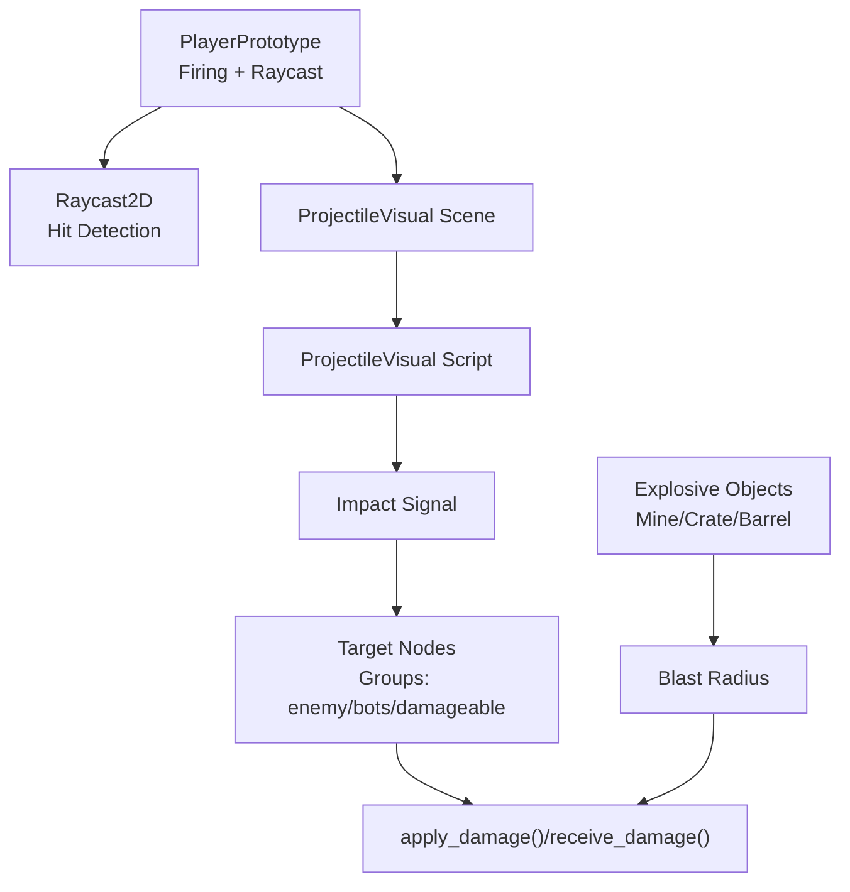
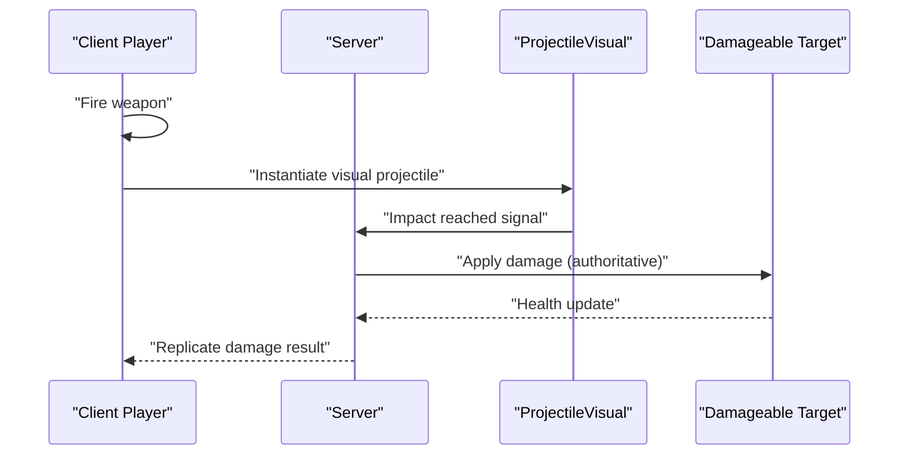
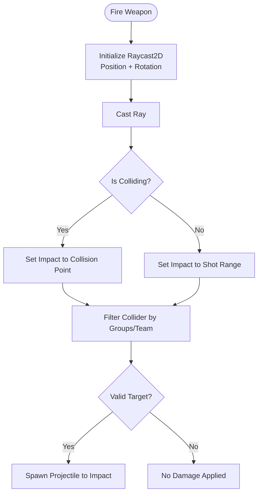
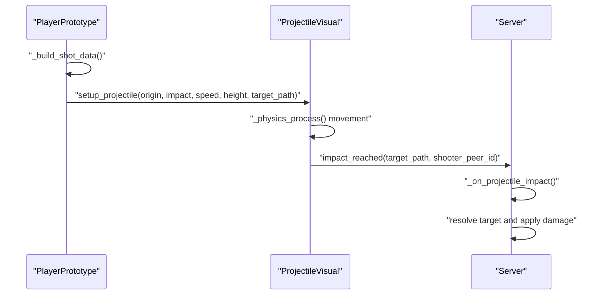
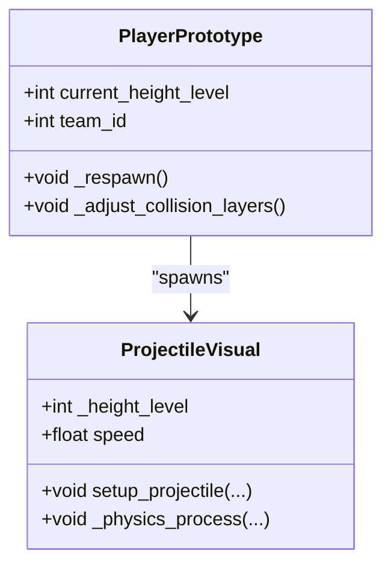
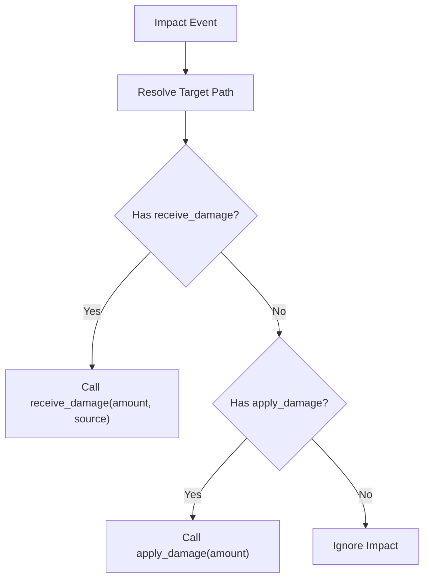
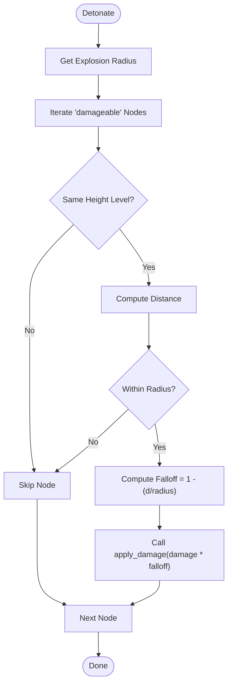
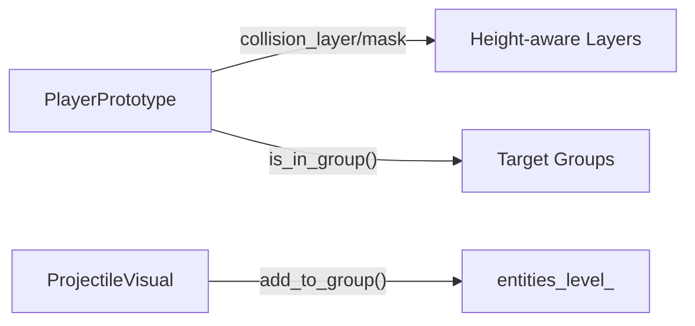
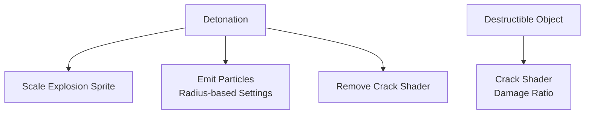
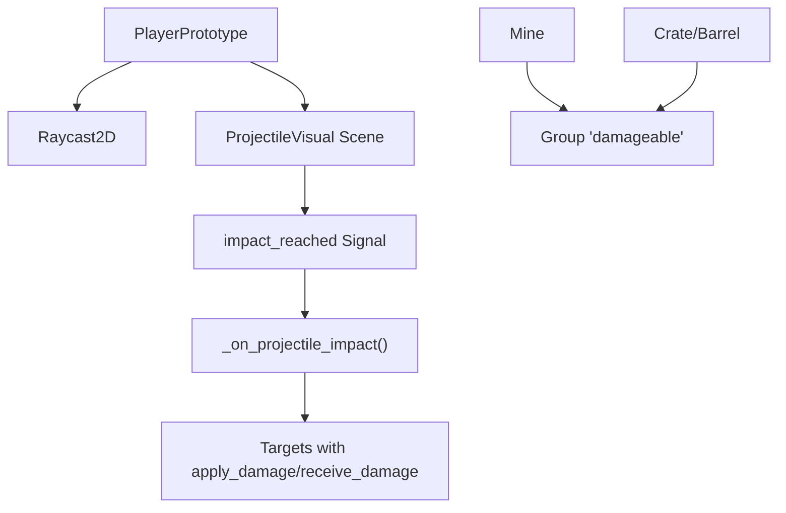

# Hit Detection and Collision

<cite>
**Referenced Files in This Document**
- [player_prototype.gd](file://Scripts/player_prototype.gd)
- [projectile_visual.gd](file://Scripts/projectile_visual.gd)
- [mina.gd](file://Scripts/mina.gd)
- [oggetto.gd](file://Scripts/oggetto.gd)
- [projectile_visual.tscn](file://Scenes/projectile_visual.tscn)
- [mina.tscn](file://Game/Oggetti/Mina.tscn)
- [oggetto.tscn](file://Game/Oggetti/oggetto.tscn)
</cite>

## Table of Contents
1. [Introduction](#introduction)
2. [Project Structure](#project-structure)
3. [Core Components](#core-components)
4. [Architecture Overview](#architecture-overview)
5. [Detailed Component Analysis](#detailed-component-analysis)
6. [Dependency Analysis](#dependency-analysis)
7. [Performance Considerations](#performance-considerations)
8. [Troubleshooting Guide](#troubleshooting-guide)
9. [Conclusion](#conclusion)

## Introduction
This document explains the hit detection and collision system used for projectile-based combat, explosive blast mechanics, and line-of-sight interactions. It covers raycasting algorithms, collision shapes, damage application, accuracy and spread mechanics, penetration systems, collision filtering via layers and groups, object grouping strategies, hit markers and damage feedback, and visual impact effects. The system integrates client-side prediction, server authority, and deterministic replication for multiplayer environments.

## Project Structure
The hit detection system spans several scripts and scenes:
- Player prototype handles weapon firing, raycast-based hit detection, and projectile spawning.
- Projectile visual renders and simulates bullet trajectories with height-level awareness.
- Explosive objects (mine and crate/barrel) calculate blast damage with distance-based falloff and visual effects.
- Group-based targeting and collision filtering ensure accurate targeting and layered gameplay.

**Diagram sources**
- [player_prototype.gd:550-610](file://Scripts/player_prototype.gd#L550-L610)
- [projectile_visual.gd:1-45](file://Scripts/projectile_visual.gd#L1-L45)
- [mina.gd:206-285](file://Scripts/mina.gd#L206-L285)
- [oggetto.gd:136-248](file://Scripts/oggetto.gd#L136-L248)

**Section sources**
- [player_prototype.gd:1-100](file://Scripts/player_prototype.gd#L1-L100)
- [projectile_visual.gd:1-45](file://Scripts/projectile_visual.gd#L1-L45)
- [mina.gd:118-299](file://Scripts/mina.gd#L118-L299)
- [oggetto.gd:88-369](file://Scripts/oggetto.gd#L88-L369)

## Core Components
- PlayerPrototype: Manages weapon state, raycast-based hit detection, projectile instantiation, and target filtering by groups and teams.
- ProjectileVisual: Handles trajectory interpolation, height-level rendering, and impact signaling to the server for authoritative damage.
- Explosive objects (Mine and Crate/Barrel): Implement blast radius calculations, distance-based falloff, and visual effects synchronized with graphics presets.

Key responsibilities:
- Raycasting for line-of-sight and target identification.
- Layer-based collision filtering for height-aware gameplay.
- Group-based targeting to avoid friendly fire and support bots/enemies.
- Distance-based damage falloff for explosives.
- Visual feedback via shaders, animations, and particle systems.

**Section sources**
- [player_prototype.gd:550-610](file://Scripts/player_prototype.gd#L550-L610)
- [projectile_visual.gd:22-45](file://Scripts/projectile_visual.gd#L22-L45)
- [mina.gd:206-285](file://Scripts/mina.gd#L206-L285)
- [oggetto.gd:136-248](file://Scripts/oggetto.gd#L136-L248)

## Architecture Overview
The system follows a client-predictive, server-authoritative model:
- Clients predict shots and show immediate visual feedback.
- Server validates hits and applies damage for fairness.
- Projectile visuals replicate movement locally while impact events are resolved server-side.

**Diagram sources**
- [player_prototype.gd:426-443](file://Scripts/player_prototype.gd#L426-L443)
- [projectile_visual.gd:4-20](file://Scripts/projectile_visual.gd#L4-L20)
- [player_prototype.gd:445-460](file://Scripts/player_prototype.gd#L445-L460)

## Detailed Component Analysis

### Raycasting and Line-of-Sight Blocking
- The player uses a Raycast2D node to detect collisions along the weapon's aim direction up to a maximum shot range.
- Collisions are filtered to valid targets using groups ("enemy", "bots", "damageable") and team checks to prevent friendly fire.
- If a collidable surface blocks the shot, the impact position snaps to the collision point; otherwise, the shot travels to the maximum range.

**Diagram sources**
- [player_prototype.gd:550-610](file://Scripts/player_prototype.gd#L550-L610)
- [player_prototype.gd:563-580](file://Scripts/player_prototype.gd#L563-L580)

**Section sources**
- [player_prototype.gd:550-610](file://Scripts/player_prototype.gd#L550-L610)
- [player_prototype.gd:563-580](file://Scripts/player_prototype.gd#L563-L580)

### Projectile Hit Detection and Replication
- The player instantiates a ProjectileVisual scene and configures it with origin, destination, speed, height level, and target path.
- The projectile moves toward the impact position; upon reaching it, it emits an impact signal containing the target path and shooter peer ID.
- The server receives the impact, resolves the target, and applies damage using authoritative methods.

**Diagram sources**
- [player_prototype.gd:581-605](file://Scripts/player_prototype.gd#L581-L605)
- [projectile_visual.gd:22-45](file://Scripts/projectile_visual.gd#L22-L45)
- [player_prototype.gd:426-443](file://Scripts/player_prototype.gd#L426-L443)
- [player_prototype.gd:445-460](file://Scripts/player_prototype.gd#L445-L460)

**Section sources**
- [player_prototype.gd:581-605](file://Scripts/player_prototype.gd#L581-L605)
- [projectile_visual.gd:22-45](file://Scripts/projectile_visual.gd#L22-L45)
- [player_prototype.gd:426-443](file://Scripts/player_prototype.gd#L426-L443)
- [player_prototype.gd:445-460](file://Scripts/player_prototype.gd#L445-L460)

### Collision Shapes and Height-Level Interactions
- Players dynamically adjust collision layers and masks based on their current height level to enable vertical traversal and line-of-sight interactions.
- Projectile visuals are grouped by height level and rendered accordingly to appear above or below other entities.

**Diagram sources**
- [player_prototype.gd:921-940](file://Scripts/player_prototype.gd#L921-L940)
- [projectile_visual.gd:22-45](file://Scripts/projectile_visual.gd#L22-L45)

**Section sources**
- [player_prototype.gd:921-940](file://Scripts/player_prototype.gd#L921-L940)
- [projectile_visual.gd:22-45](file://Scripts/projectile_visual.gd#L22-L45)

### Damage Application Mechanics
- Targets implement either apply_damage() or receive_damage() to process incoming damage.
- For projectiles, the server resolves the impact and calls the target’s damage method with the shooter’s peer ID for kill attribution.
- Explosives iterate over nodes in the "damageable" group, filter by height level, compute distance-based falloff, and apply damage.

**Diagram sources**
- [player_prototype.gd:445-460](file://Scripts/player_prototype.gd#L445-L460)
- [mina.gd:218-241](file://Scripts/mina.gd#L218-L241)
- [oggetto.gd:136-149](file://Scripts/oggetto.gd#L136-L149)

**Section sources**
- [player_prototype.gd:445-460](file://Scripts/player_prototype.gd#L445-L460)
- [mina.gd:218-241](file://Scripts/mina.gd#L218-L241)
- [oggetto.gd:136-149](file://Scripts/oggetto.gd#L136-L149)

### Explosive Blast Radius Calculations
- Explosives define a circular collision shape or explicit radius for blast calculations.
- On detonation, the system iterates over "damageable" nodes, filters by height level, computes Euclidean distance, clamps to the blast radius, and applies damage with linear falloff.

**Diagram sources**
- [mina.gd:206-285](file://Scripts/mina.gd#L206-L285)
- [oggetto.gd:176-248](file://Scripts/oggetto.gd#L176-L248)

**Section sources**
- [mina.gd:206-285](file://Scripts/mina.gd#L206-L285)
- [oggetto.gd:176-248](file://Scripts/oggetto.gd#L176-L248)

### Collision Filtering, Layers, and Groups
- Layer-based filtering: Players set collision layers and masks according to height level, allowing selective blocking by walls and characters on the same level.
- Group-based targeting: Targets are identified using groups ("enemy", "bots", "damageable") and team membership to avoid friendly fire.
- Height-level grouping: Projectile visuals are added to entity groups per height to manage rendering order and interactions.

**Diagram sources**
- [player_prototype.gd:921-940](file://Scripts/player_prototype.gd#L921-L940)
- [player_prototype.gd:563-580](file://Scripts/player_prototype.gd#L563-L580)
- [projectile_visual.gd:28-30](file://Scripts/projectile_visual.gd#L28-L30)

**Section sources**
- [player_prototype.gd:921-940](file://Scripts/player_prototype.gd#L921-L940)
- [player_prototype.gd:563-580](file://Scripts/player_prototype.gd#L563-L580)
- [projectile_visual.gd:28-30](file://Scripts/projectile_visual.gd#L28-L30)

### Accuracy, Spread, and Penetration Systems
- Spread mechanics: While not explicitly implemented in the analyzed files, spread can be modeled by jittering the aim direction around the center vector before casting the ray.
- Penetration: Not present in the analyzed files; however, it could be implemented by casting multiple rays or checking material properties post-hit to reduce damage or continue through thin obstacles.
- Recoil and accuracy: Could be integrated by adjusting spread over time or after each shot to simulate weapon handling.

[No sources needed since this section provides general guidance]

### Hit Markers, Damage Feedback, and Visual Effects
- Visual feedback: Explosions scale animation and particle systems with blast radius; shader materials reflect damage levels on destructible objects.
- Graphics presets: Quality settings control shader visibility, animation speeds, and particle counts to balance performance and fidelity.
- Danger indicators: Mines visually warn nearby players with color transitions indicating proximity and team alignment.

**Diagram sources**
- [mina.gd:257-285](file://Scripts/mina.gd#L257-L285)
- [oggetto.gd:108-130](file://Scripts/oggetto.gd#L108-L130)
- [oggetto.gd:329-353](file://Scripts/oggetto.gd#L329-L353)

**Section sources**
- [mina.gd:257-285](file://Scripts/mina.gd#L257-L285)
- [oggetto.gd:108-130](file://Scripts/oggetto.gd#L108-L130)
- [oggetto.gd:329-353](file://Scripts/oggetto.gd#L329-L353)

### Environmental Interaction Physics
- Destructible crates/barrels: When destroyed, they disable collision shapes, remove crack shaders, play explosion animations, emit particles scaled to blast radius, and queue free after animation completes.
- Mine triggers: Trigger on contact with enemies or non-aligned targets on the same height level; friendly targets alter indicator colors and energy.

**Section sources**
- [oggetto.gd:155-248](file://Scripts/oggetto.gd#L155-L248)
- [mina.gd:160-184](file://Scripts/mina.gd#L160-L184)
- [mina.gd:211-285](file://Scripts/mina.gd#L211-L285)

## Dependency Analysis
- PlayerPrototype depends on:
  - Raycast2D for hit detection.
  - ProjectileVisual scene for client-side visualization and impact signaling.
  - Multiplayer RPC for authoritative damage resolution.
- ProjectileVisual depends on:
  - Height-level grouping for rendering order.
  - Impact signal to notify server-side handlers.
- Explosive objects depend on:
  - "damageable" group for target scanning.
  - Graphics settings for visual quality adjustments.

**Diagram sources**
- [player_prototype.gd:550-610](file://Scripts/player_prototype.gd#L550-L610)
- [projectile_visual.gd:4-20](file://Scripts/projectile_visual.gd#L4-L20)
- [player_prototype.gd:445-460](file://Scripts/player_prototype.gd#L445-L460)
- [mina.gd:218-241](file://Scripts/mina.gd#L218-L241)
- [oggetto.gd:184-209](file://Scripts/oggetto.gd#L184-L209)

**Section sources**
- [player_prototype.gd:550-610](file://Scripts/player_prototype.gd#L550-L610)
- [projectile_visual.gd:4-20](file://Scripts/projectile_visual.gd#L4-L20)
- [player_prototype.gd:445-460](file://Scripts/player_prototype.gd#L445-L460)
- [mina.gd:218-241](file://Scripts/mina.gd#L218-L241)
- [oggetto.gd:184-209](file://Scripts/oggetto.gd#L184-L209)

## Performance Considerations
- Prefer distance-based filtering early to minimize iteration over large "damageable" groups.
- Use group-based queries for blast damage to avoid per-node collision checks.
- Adjust graphics presets to reduce particle counts and shader overhead during high-intensity combat.
- Keep raycast distances reasonable to limit computational cost.

[No sources needed since this section provides general guidance]

## Troubleshooting Guide
Common issues and resolutions:
- Friendly fire unintended: Verify team group checks and ensure targets are filtered by team membership before applying damage.
- Explosive not triggering: Confirm the target shares the same height level and is part of the "damageable" group.
- Visual artifacts: Ensure shader materials are removed or disabled after destruction and that animation signals properly hide sprites.
- Network desync: Validate that impacts are handled server-side and client-side visuals mirror authoritative outcomes.

**Section sources**
- [player_prototype.gd:563-580](file://Scripts/player_prototype.gd#L563-L580)
- [mina.gd:218-241](file://Scripts/mina.gd#L218-L241)
- [oggetto.gd:155-175](file://Scripts/oggetto.gd#L155-L175)

## Conclusion
The hit detection and collision system combines client-predictive raycasting, height-aware collision layers, group-based targeting, and authoritative damage resolution. Explosives utilize blast radius calculations with distance-based falloff and robust visual feedback. The modular design supports extensibility for spread mechanics, penetration, and advanced environmental interactions while maintaining performance and fairness in multiplayer scenarios.