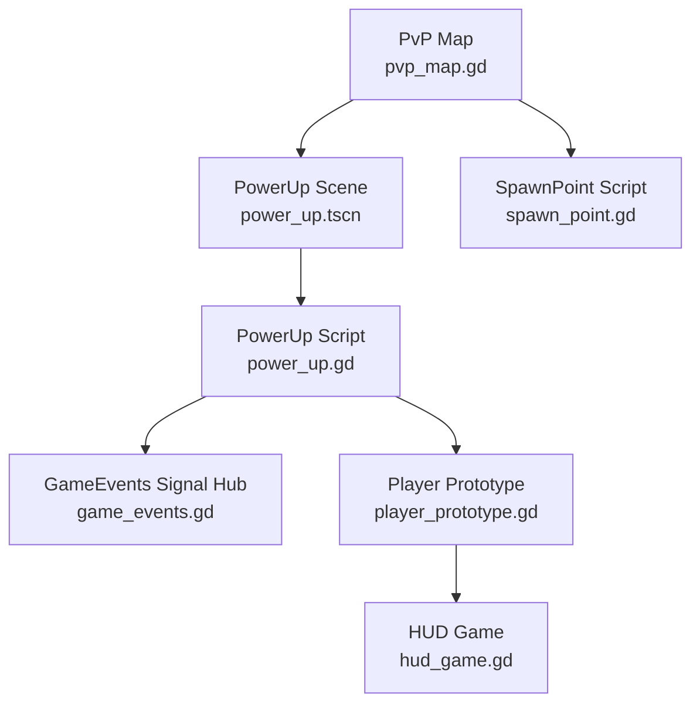
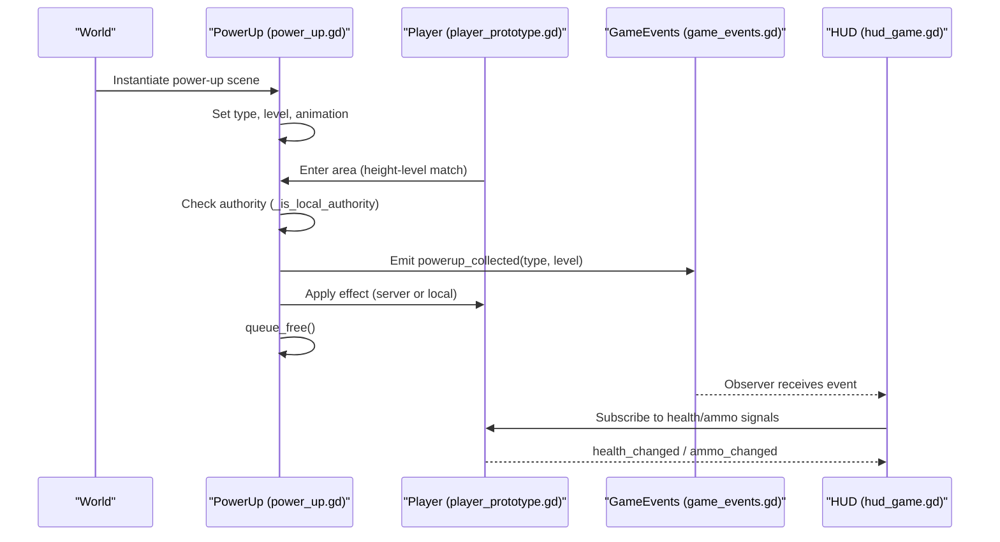
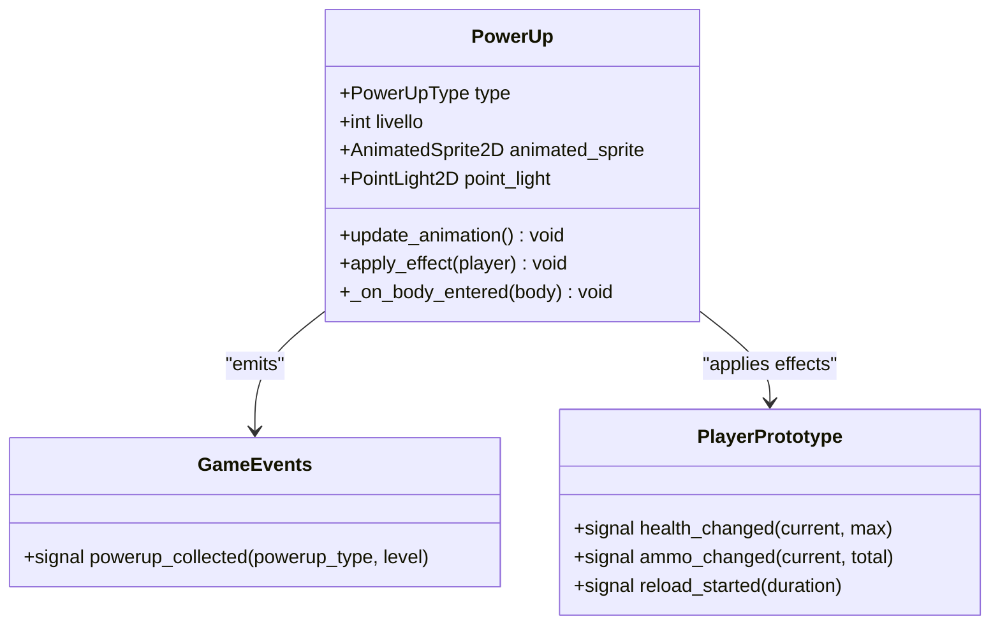
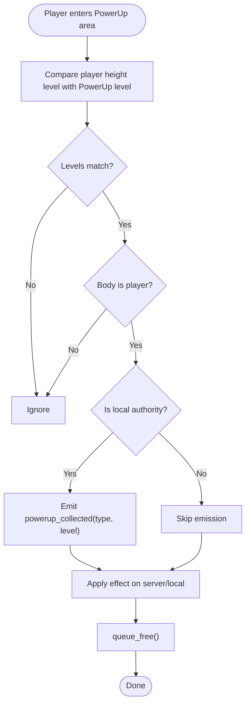
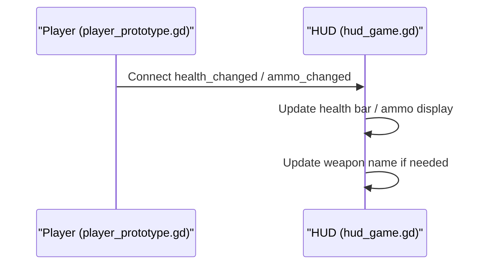
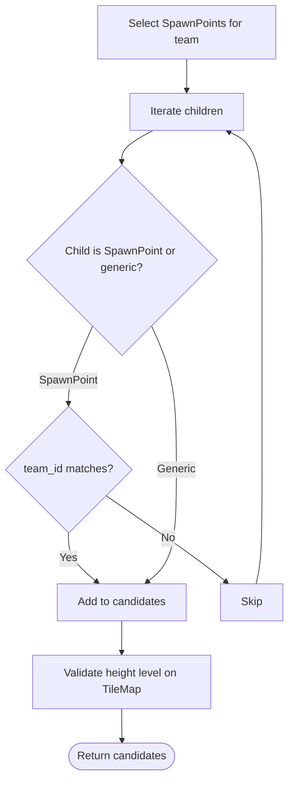
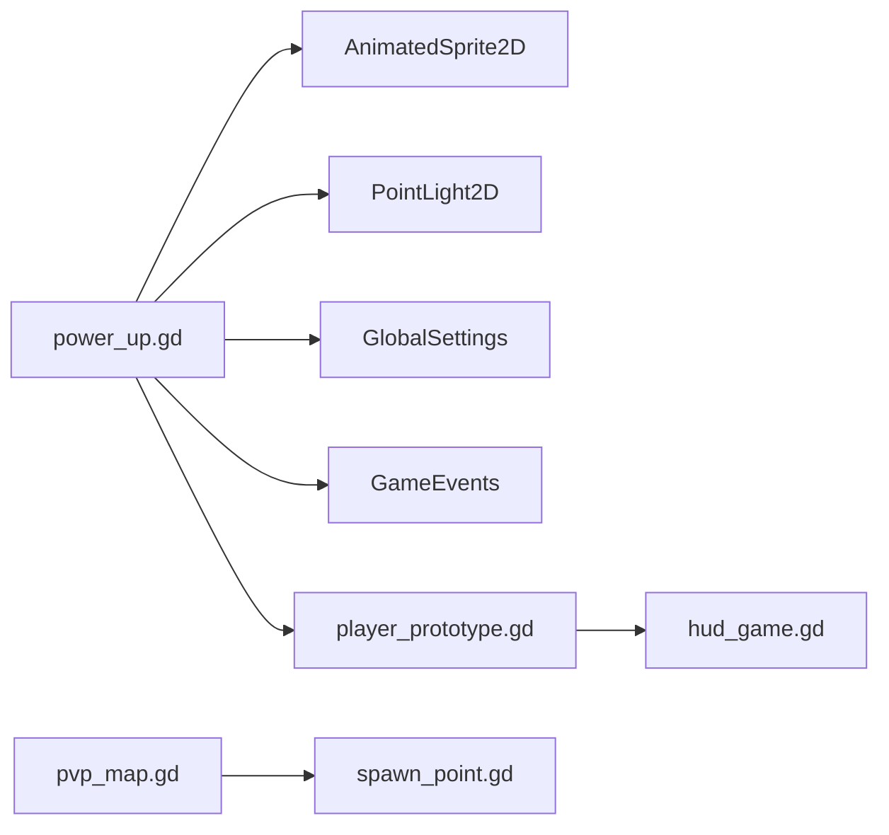

# Power-Up System

<cite>
**Referenced Files in This Document**
- [power_up.gd](file://Scripts/power_up.gd)
- [power_up.tscn](file://Scenes/power_up.tscn)
- [spawn_point.gd](file://Scripts/spawn_point.gd)
- [pvp_map.gd](file://Scripts/pvp_map.gd)
- [game_events.gd](file://Scripts/game_events.gd)
- [player_prototype.gd](file://Scripts/player_prototype.gd)
- [hud_game.gd](file://Menu/HUD/hud_game.gd)
</cite>

## Table of Contents
1. [Introduction](#introduction)
2. [Project Structure](#project-structure)
3. [Core Components](#core-components)
4. [Architecture Overview](#architecture-overview)
5. [Detailed Component Analysis](#detailed-component-analysis)
6. [Dependency Analysis](#dependency-analysis)
7. [Performance Considerations](#performance-considerations)
8. [Troubleshooting Guide](#troubleshooting-guide)
9. [Conclusion](#conclusion)

## Introduction
This document describes the power-up system present in the project, focusing on the collection mechanics, item categorization, animation integration, and inventory signals used by players. It also explains how power-ups are visually represented, how collection events propagate, and how the system integrates with the player’s health and ammo states. Where applicable, spawn-related infrastructure is described to clarify how power-ups are placed and managed in the world.

## Project Structure
The power-up system is composed of:
- A scene that defines the visual and behavioral template for power-ups
- A script that implements power-up logic, animations, and collection handling
- A signal hub that broadcasts collection events
- Player-side scripts that react to collection events and update HUD/UI
- Spawn point infrastructure that supports height-aware placement

**Diagram sources**
- [power_up.tscn](file://Scenes/power_up.tscn)
- [power_up.gd](file://Scripts/power_up.gd)
- [game_events.gd](file://Scripts/game_events.gd)
- [player_prototype.gd](file://Scripts/player_prototype.gd)
- [hud_game.gd](file://Menu/HUD/hud_game.gd)
- [pvp_map.gd](file://Scripts/pvp_map.gd)
- [spawn_point.gd](file://Scripts/spawn_point.gd)

**Section sources**
- [power_up.tscn](file://Scenes/power_up.tscn)
- [power_up.gd](file://Scripts/power_up.gd)
- [game_events.gd](file://Scripts/game_events.gd)
- [player_prototype.gd](file://Scripts/player_prototype.gd)
- [hud_game.gd](file://Menu/HUD/hud_game.gd)
- [pvp_map.gd](file://Scripts/pvp_map.gd)
- [spawn_point.gd](file://Scripts/spawn_point.gd)

## Core Components
- PowerUp scene and script: Defines power-up types, animations, collision filtering by height level, and collection behavior.
- GameEvents: Centralized signal hub for power-up collection events.
- Player prototype: Exposes health and ammo change signals consumed by the HUD.
- HUD: Subscribes to player signals to reflect updates in UI.
- PvP map and spawn points: Provide height-aware spawn selection and support height-level alignment for power-ups.

Key capabilities:
- Height-aware visibility and collection: Power-ups only interact with players on the same height level.
- Animation-driven visuals: Each power-up type plays a dedicated animation.
- Authority-aware application: Effects are applied on the server or locally when not in multiplayer.
- Event propagation: Collection emits a global signal for observers.

**Section sources**
- [power_up.gd](file://Scripts/power_up.gd)
- [game_events.gd](file://Scripts/game_events.gd)
- [player_prototype.gd](file://Scripts/player_prototype.gd)
- [hud_game.gd](file://Menu/HUD/hud_game.gd)
- [pvp_map.gd](file://Scripts/pvp_map.gd)
- [spawn_point.gd](file://Scripts/spawn_point.gd)

## Architecture Overview
The power-up lifecycle spans creation, height-level alignment, collision detection, authority-based effect application, and UI updates.

**Diagram sources**
- [power_up.gd](file://Scripts/power_up.gd)
- [game_events.gd](file://Scripts/game_events.gd)
- [player_prototype.gd](file://Scripts/player_prototype.gd)
- [hud_game.gd](file://Menu/HUD/hud_game.gd)

## Detailed Component Analysis

### PowerUp Script and Scene
Responsibilities:
- Define power-up categories and animations
- Filter collisions by height level
- Emit collection events and apply effects
- Manage material glow and quality settings

**Diagram sources**
- [power_up.gd](file://Scripts/power_up.gd)
- [game_events.gd](file://Scripts/game_events.gd)
- [player_prototype.gd](file://Scripts/player_prototype.gd)

Behavior highlights:
- Type-to-animation mapping ensures distinct visuals per category.
- Height-level comparison prevents cross-level collection.
- Authority-aware logic ensures deterministic effect application.
- Destruction occurs after collection to prevent reuse.

Effects and categories:
- Health packs: restore life (visualized as “Cura”).
- Ammo: replenish magazine and reserve (visualized as “Munizioni”).
- Money: credits for purchases (visualized as “Crediti”).
- Chest: weapon upgrade (visualized as “Armi”).
- Star: collectible (visualized as “Collezionabile”).
- Mystery: randomized bonus (visualized as “Mistero”).

Note: Duration, stacking, and rarity systems are not implemented in the referenced code. The above categories represent the current visual and grouping semantics.

**Section sources**
- [power_up.gd](file://Scripts/power_up.gd)
- [power_up.tscn](file://Scenes/power_up.tscn)

### Collection Detection and Authority Flow

**Diagram sources**
- [power_up.gd](file://Scripts/power_up.gd)

**Section sources**
- [power_up.gd](file://Scripts/power_up.gd)

### Inventory Integration and HUD Updates
- Player prototype exposes signals for health and ammo changes.
- HUD subscribes to these signals to update UI elements.
- This enables immediate feedback when power-ups are collected.

**Diagram sources**
- [player_prototype.gd](file://Scripts/player_prototype.gd)
- [hud_game.gd](file://Menu/HUD/hud_game.gd)

**Section sources**
- [player_prototype.gd](file://Scripts/player_prototype.gd)
- [hud_game.gd](file://Menu/HUD/hud_game.gd)

### Spawn Point Management and Height-Level Alignment
- Spawn points define team affinity and height level.
- The map selects appropriate spawn points and validates height levels against the tilemap.
- While not directly spawning power-ups, the height-level concept aligns with how power-ups filter eligible collectors.

**Diagram sources**
- [pvp_map.gd](file://Scripts/pvp_map.gd)
- [spawn_point.gd](file://Scripts/spawn_point.gd)

**Section sources**
- [pvp_map.gd](file://Scripts/pvp_map.gd)
- [spawn_point.gd](file://Scripts/spawn_point.gd)

## Dependency Analysis
- PowerUp depends on:
  - AnimatedSprite2D for visuals
  - PointLight2D for glow
  - GlobalSettings for graphics preset
  - GameEvents for broadcasting collection
  - PlayerPrototype for applying effects
- PlayerPrototype depends on HUD for UI updates.
- PvP map and spawn points provide height-level context for placement and filtering.

**Diagram sources**
- [power_up.gd](file://Scripts/power_up.gd)
- [game_events.gd](file://Scripts/game_events.gd)
- [player_prototype.gd](file://Scripts/player_prototype.gd)
- [hud_game.gd](file://Menu/HUD/hud_game.gd)
- [pvp_map.gd](file://Scripts/pvp_map.gd)
- [spawn_point.gd](file://Scripts/spawn_point.gd)

**Section sources**
- [power_up.gd](file://Scripts/power_up.gd)
- [player_prototype.gd](file://Scripts/player_prototype.gd)
- [hud_game.gd](file://Menu/HUD/hud_game.gd)
- [pvp_map.gd](file://Scripts/pvp_map.gd)
- [spawn_point.gd](file://Scripts/spawn_point.gd)

## Performance Considerations
- Animation playback is type-specific and lightweight; ensure only visible sprites are active.
- Glow material is applied per power-up; keep intensity minimal to avoid overdraw.
- Collision checks compare height levels; maintain a small number of height levels to reduce comparisons.
- Authority-based effect application avoids redundant work in multiplayer.

## Troubleshooting Guide
- Power-up does not animate:
  - Verify the AnimatedSprite2D is properly configured and the animation names match the type mapping.
- Player cannot pick up power-ups:
  - Confirm the player and power-up share the same height level.
  - Ensure the player is in the “players” group or named “Player”.
- No HUD update after collection:
  - Check that the HUD connects to the player’s health/ammo signals.
- Effect not applied:
  - In multiplayer, ensure the server applies effects or the local authority path is taken.

**Section sources**
- [power_up.gd](file://Scripts/power_up.gd)
- [hud_game.gd](file://Menu/HUD/hud_game.gd)
- [player_prototype.gd](file://Scripts/player_prototype.gd)

## Conclusion
The power-up system centers around a clear separation of concerns: visual representation and collection logic in the PowerUp script, centralized event broadcasting via GameEvents, and UI updates handled by the HUD through player signals. Height-level alignment ensures spatial coherence, while authority-aware application maintains determinism in multiplayer scenarios. Areas for future expansion include explicit duration and stacking mechanics, rarity weighting, and structured spawn scheduling.