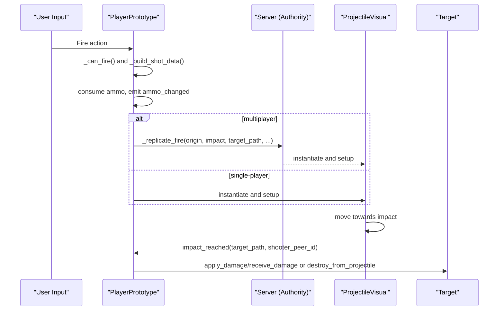
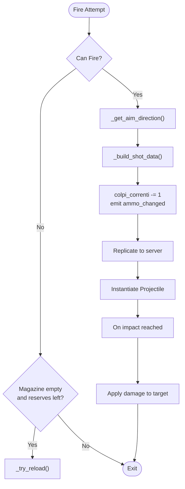
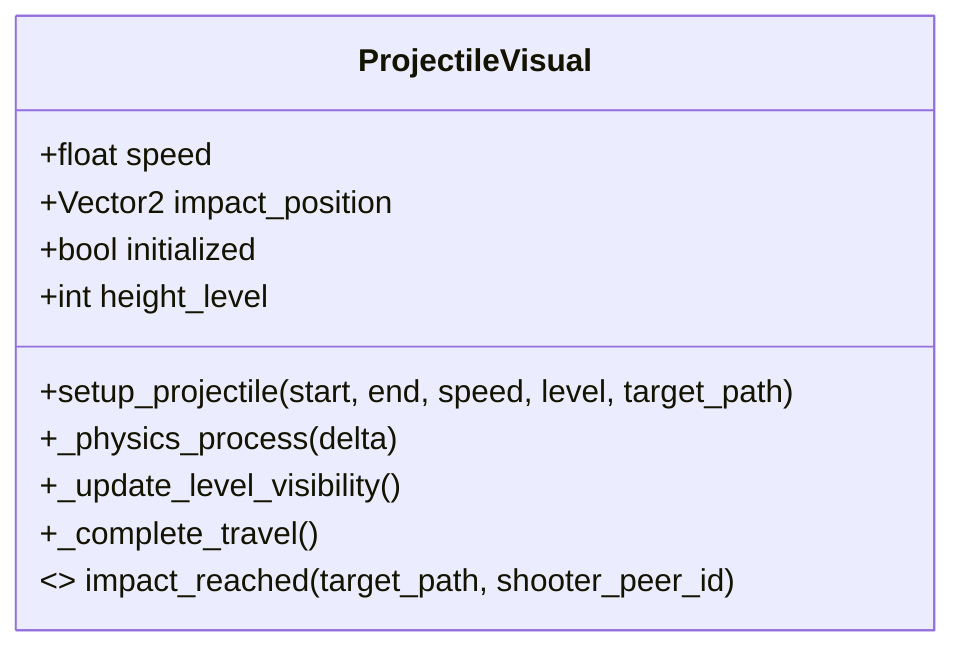
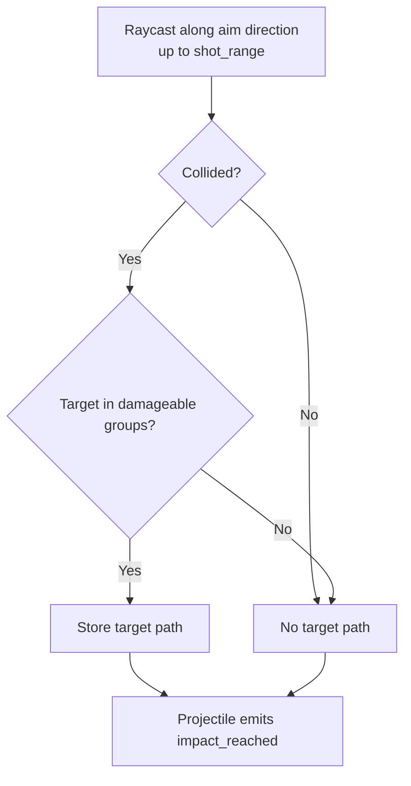
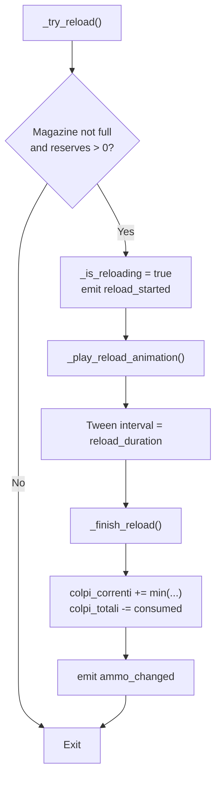
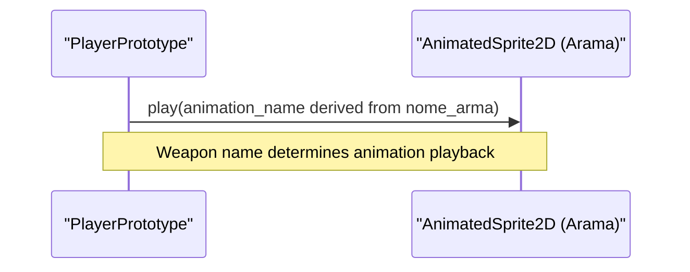
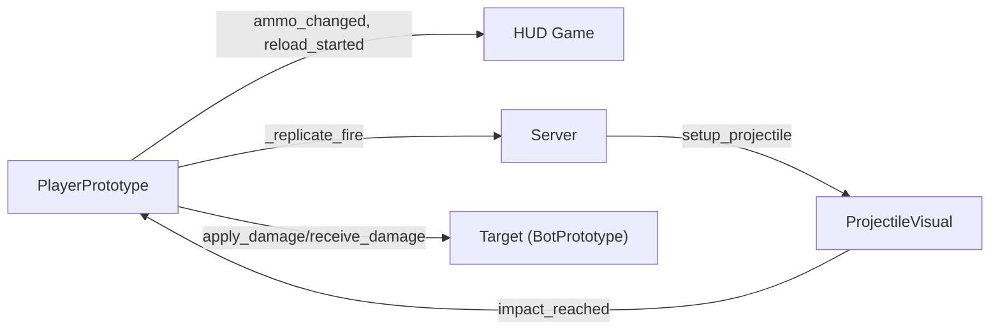
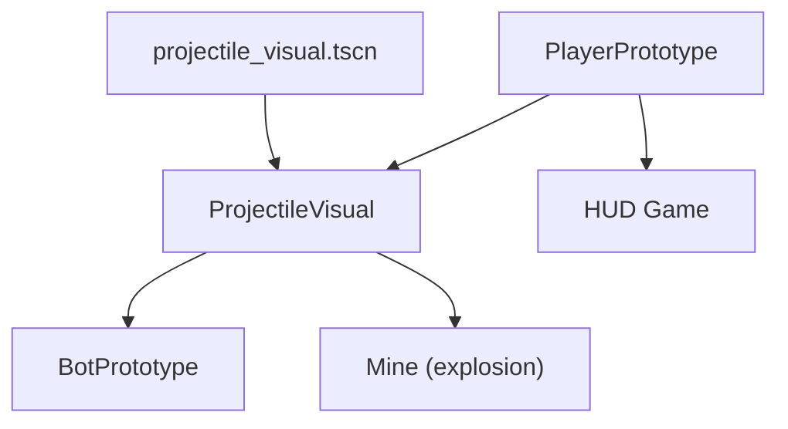

# Weapon Mechanics

<cite>
**Referenced Files in This Document**
- [player_prototype.gd](file://Scripts/player_prototype.gd)
- [projectile_visual.gd](file://Scripts/projectile_visual.gd)
- [projectile_visual.tscn](file://Scenes/projectile_visual.tscn)
- [hud_game.gd](file://Menu/HUD/hud_game.gd)
- [bot_prototype.gd](file://Scripts/bot_prototype.gd)
- [mina.gd](file://Scripts/mina.gd)
</cite>

## Table of Contents
1. [Introduction](#introduction)
2. [Project Structure](#project-structure)
3. [Core Components](#core-components)
4. [Architecture Overview](#architecture-overview)
5. [Detailed Component Analysis](#detailed-component-analysis)
6. [Dependency Analysis](#dependency-analysis)
7. [Performance Considerations](#performance-considerations)
8. [Troubleshooting Guide](#troubleshooting-guide)
9. [Conclusion](#conclusion)

## Introduction
This document describes the weapon mechanics system in TFA Agents, focusing on firing behavior, projectile physics, damage delivery, and ammo management. It also covers weapon animations, height-level-aware targeting, and the HUD integration for feedback. Where applicable, we explain how projectiles are instantiated and animated, how hits are detected, and how the system handles multiplayer synchronization. Upgrade and attachment systems are not present in the current codebase; therefore, customization and heat/overheat mechanics are not implemented and are not covered here.

## Project Structure
The weapon system spans several scripts and scenes:
- Player-side weapon logic and state management
- Projectile visualization and lifecycle
- HUD integration for ammo and feedback
- Enemy behavior (for hit detection and destruction)
- Explosive mine visuals (used for explosion effects)

```mermaid
graph TB
subgraph "Player"
PP["PlayerPrototype<br/>Firing, ammo, reload, HUD sync"]
end
subgraph "Projectiles"
PV["ProjectileVisual<br/>Movement, visibility, impact"]
PVS["projectile_visual.tscn<br/>Scene with Sprite/Trail/Light"]
end
subgraph "HUD"
HUD["HUD Game<br/>Ammo, subtitles, reload flash"]
end
subgraph "Enemies"
BOT["BotPrototype<br/>Damage, destroy"]
MINE["Mine<br/>Explosion animation"]
end
PP --> PV
PP --> HUD
PV --> BOT
PV --> MINE
PVS --> PV
```

**Diagram sources**
- [player_prototype.gd:1-1028](file://Scripts/player_prototype.gd#L1-L1028)
- [projectile_visual.gd:1-99](file://Scripts/projectile_visual.gd#L1-L99)
- [projectile_visual.tscn:1-38](file://Scenes/projectile_visual.tscn#L1-L38)
- [hud_game.gd:1-206](file://Menu/HUD/hud_game.gd#L1-L206)
- [bot_prototype.gd:1-687](file://Scripts/bot_prototype.gd#L1-L687)
- [mina.gd](file://Scripts/mina.gd)

**Section sources**
- [player_prototype.gd:1-1028](file://Scripts/player_prototype.gd#L1-L1028)
- [projectile_visual.gd:1-99](file://Scripts/projectile_visual.gd#L1-L99)
- [projectile_visual.tscn:1-38](file://Scenes/projectile_visual.tscn#L1-L38)
- [hud_game.gd:1-206](file://Menu/HUD/hud_game.gd#L1-L206)
- [bot_prototype.gd:1-687](file://Scripts/bot_prototype.gd#L1-L687)
- [mina.gd](file://Scripts/mina.gd)

## Core Components
- PlayerPrototype: Manages weapon state, firing logic, ammo consumption, reload, and multiplayer replication of shots.
- ProjectileVisual: Moves along a trajectory, updates visibility by height level, and emits an impact signal.
- HUD Game: Subscribes to player signals to reflect health, ammo, and reload events.
- BotPrototype: Receives damage and can be destroyed by projectiles.
- Mine: Provides explosion visuals used for impact effects.

Key exported weapon parameters on the player include:
- Firing rate via cooldown
- Range and auto-fire detection range
- Projectile speed and damage
- Ammo capacity, reserve, and reload duration
- Weapon name for animation mapping

**Section sources**
- [player_prototype.gd:11-40](file://Scripts/player_prototype.gd#L11-L40)
- [player_prototype.gd:379-490](file://Scripts/player_prototype.gd#L379-L490)
- [projectile_visual.gd:6-20](file://Scripts/projectile_visual.gd#L6-L20)
- [hud_game.gd:69-134](file://Menu/HUD/hud_game.gd#L69-L134)
- [bot_prototype.gd:82-91](file://Scripts/bot_prototype.gd#L82-L91)
- [mina.gd](file://Scripts/mina.gd)

## Architecture Overview
The weapon firing pipeline is client-authoritative on the local player and replicated to peers. The player builds shot data (origin, direction, impact, target path), instantiates a projectile scene, and connects to the impact signal. On hit, the projectile emits a signal carrying the target path and shooter ID so the player can apply damage.



**Diagram sources**
- [player_prototype.gd:379-440](file://Scripts/player_prototype.gd#L379-L440)
- [player_prototype.gd:422-440](file://Scripts/player_prototype.gd#L422-L440)
- [projectile_visual.gd:22-99](file://Scripts/projectile_visual.gd#L22-L99)
- [bot_prototype.gd:82-91](file://Scripts/bot_prototype.gd#L82-L91)

## Detailed Component Analysis

### Player Prototype: Firing, Cooldowns, and Ammo
- Firing triggers:
  - Mouse click or touch input invokes a fire attempt.
  - Touch auto-fire detects enemies within a short range and fires automatically while aiming.
- Cooldown:
  - Enforced via a minimum elapsed time since last shot.
- Ammo:
  - Consumed on successful shot; HUD updates.
  - Auto-reload occurs when the magazine is empty but reserves remain.
- Multiplayer:
  - Local authority replicates shot data to server, which instantiates the projectile and relays impact back to clients.



**Diagram sources**
- [player_prototype.gd:373-420](file://Scripts/player_prototype.gd#L373-L420)
- [player_prototype.gd:422-440](file://Scripts/player_prototype.gd#L422-L440)
- [player_prototype.gd:441-478](file://Scripts/player_prototype.gd#L441-L478)

**Section sources**
- [player_prototype.gd:226-245](file://Scripts/player_prototype.gd#L226-L245)
- [player_prototype.gd:251-255](file://Scripts/player_prototype.gd#L251-L255)
- [player_prototype.gd:379-420](file://Scripts/player_prototype.gd#L379-L420)
- [player_prototype.gd:441-478](file://Scripts/player_prototype.gd#L441-L478)

### Projectile Visual: Trajectory, Visibility, and Impact
- Movement:
  - Moves at a constant speed along the computed direction until reaching the impact point.
- Height-level visibility:
  - Only visible to the local player’s current height level; otherwise invisible and non-collidable.
- Impact:
  - Emits a signal with the target node path and shooter peer ID upon reaching destination.



**Diagram sources**
- [projectile_visual.gd:1-99](file://Scripts/projectile_visual.gd#L1-L99)

**Section sources**
- [projectile_visual.gd:22-99](file://Scripts/projectile_visual.gd#L22-L99)
- [projectile_visual.tscn:8-38](file://Scenes/projectile_visual.tscn#L8-L38)

### Damage Calculation and Targeting
- Damage:
  - Defined as an exported property on the player and applied to targets on impact.
- Targeting:
  - Uses a raycast aligned with the aim direction up to the weapon’s range.
  - If a collidable target is hit, the projectile stores the target path for later damage application.
- Friendly fire:
  - Not enforced in the projectile impact handler; logic checks team on the receiving end.



**Diagram sources**
- [player_prototype.gd:576-607](file://Scripts/player_prototype.gd#L576-L607)
- [player_prototype.gd:441-478](file://Scripts/player_prototype.gd#L441-L478)

**Section sources**
- [player_prototype.gd:38-39](file://Scripts/player_prototype.gd#L38-L39)
- [player_prototype.gd:576-607](file://Scripts/player_prototype.gd#L576-L607)
- [player_prototype.gd:441-478](file://Scripts/player_prototype.gd#L441-L478)

### Reload System and HUD Feedback
- Reload:
  - Starts when the magazine is not full and reserves remain.
  - A tween runs for the reload duration; on completion, clips are filled from reserves.
- HUD:
  - Subscribes to reload_started to visually warn low ammo during reload.
  - Updates current and total ammo labels.



**Diagram sources**
- [player_prototype.gd:951-977](file://Scripts/player_prototype.gd#L951-L977)
- [hud_game.gd:117-134](file://Menu/HUD/hud_game.gd#L117-L134)

**Section sources**
- [player_prototype.gd:951-992](file://Scripts/player_prototype.gd#L951-L992)
- [hud_game.gd:111-134](file://Menu/HUD/hud_game.gd#L111-L134)

### Weapon Animations and Switching
- Animation mapping:
  - The weapon animation is selected based on the weapon name and played on a sprite node.
- Switching:
  - The weapon name is part of the initial state received by the player; changing weapons would require updating this field and re-mapping the animation.



**Diagram sources**
- [player_prototype.gd:114-140](file://Scripts/player_prototype.gd#L114-L140)

**Section sources**
- [player_prototype.gd:114-140](file://Scripts/player_prototype.gd#L114-L140)

### Height-Level Awareness and Multiplayer Synchronization
- Height-level:
  - Players and projectiles belong to groups per level; visibility and collisions are level-aware.
- Multiplayer:
  - Authority replicates shot data; server instantiates the projectile and relays impact back to clients.



**Diagram sources**
- [player_prototype.gd:69-80](file://Scripts/player_prototype.gd#L69-L80)
- [player_prototype.gd:422-440](file://Scripts/player_prototype.gd#L422-L440)
- [projectile_visual.gd:22-99](file://Scripts/projectile_visual.gd#L22-L99)
- [bot_prototype.gd:82-91](file://Scripts/bot_prototype.gd#L82-L91)

**Section sources**
- [player_prototype.gd:326-371](file://Scripts/player_prototype.gd#L326-L371)
- [projectile_visual.gd:61-70](file://Scripts/projectile_visual.gd#L61-L70)

### Explosions and Visual Effects
- Explosion visuals:
  - Mines and other destructible objects trigger explosion animations and sprites.
- These visuals are separate from the weapon’s projectile but contribute to impact feedback.

**Section sources**
- [mina.gd](file://Scripts/mina.gd)

## Dependency Analysis
- PlayerPrototype depends on:
  - ProjectileVisual scene instantiation and impact signal.
  - HUD signals for ammo and reload feedback.
  - Multiplayer RPCs for authoritative replication.
- ProjectileVisual depends on:
  - Scene configuration for sprite/trail/light.
  - Level-aware visibility logic.
- BotPrototype depends on:
  - Damage application methods to process hits.



**Diagram sources**
- [player_prototype.gd:1-1028](file://Scripts/player_prototype.gd#L1-L1028)
- [projectile_visual.gd:1-99](file://Scripts/projectile_visual.gd#L1-L99)
- [projectile_visual.tscn:1-38](file://Scenes/projectile_visual.tscn#L1-L38)
- [hud_game.gd:1-206](file://Menu/HUD/hud_game.gd#L1-L206)
- [bot_prototype.gd:1-687](file://Scripts/bot_prototype.gd#L1-L687)
- [mina.gd](file://Scripts/mina.gd)

**Section sources**
- [player_prototype.gd:1-1028](file://Scripts/player_prototype.gd#L1-L1028)
- [projectile_visual.gd:1-99](file://Scripts/projectile_visual.gd#L1-L99)
- [projectile_visual.tscn:1-38](file://Scenes/projectile_visual.tscn#L1-L38)
- [hud_game.gd:1-206](file://Menu/HUD/hud_game.gd#L1-L206)
- [bot_prototype.gd:1-687](file://Scripts/bot_prototype.gd#L1-L687)
- [mina.gd](file://Scripts/mina.gd)

## Performance Considerations
- Projectile instantiation:
  - Instantiation occurs per shot; keep projectile scene lightweight (minimal children, simple materials).
- Raycast usage:
  - Shot raycast is updated per frame; ensure collision masks are set per level to limit unnecessary checks.
- Level visibility:
  - Projectile visibility toggled per level reduces rendering overhead for off-level shots.
- Multiplayer:
  - Replication sends minimal shot data; avoid excessive impact callbacks by limiting target group checks.

## Troubleshooting Guide
- No damage on hit:
  - Verify the target has a method to accept damage and that the target path is set after raycast collision.
- Friendly fire:
  - The impact handler does not prevent friendly fire; ensure the receiver enforces team checks.
- Reload not triggering:
  - Confirm magazine is empty and reserves are greater than zero; check HUD reload warning animation.
- Projectile not visible:
  - Ensure the local player and projectile share the same height level; otherwise visibility is disabled.

**Section sources**
- [player_prototype.gd:441-478](file://Scripts/player_prototype.gd#L441-L478)
- [projectile_visual.gd:61-70](file://Scripts/projectile_visual.gd#L61-L70)
- [hud_game.gd:117-134](file://Menu/HUD/hud_game.gd#L117-L134)

## Conclusion
The weapon system centers on a client-authoritative firing model with server replication, a straightforward projectile lifecycle, and level-aware visibility. Damage is applied via targeted signals, and the HUD provides real-time feedback. While upgrades, attachments, heat generation, and overheat prevention are not implemented, the modular design allows future extensions to integrate these features with minimal refactoring.