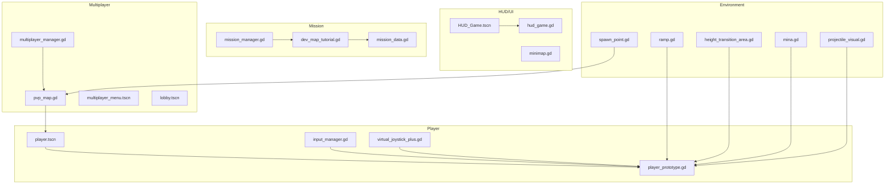
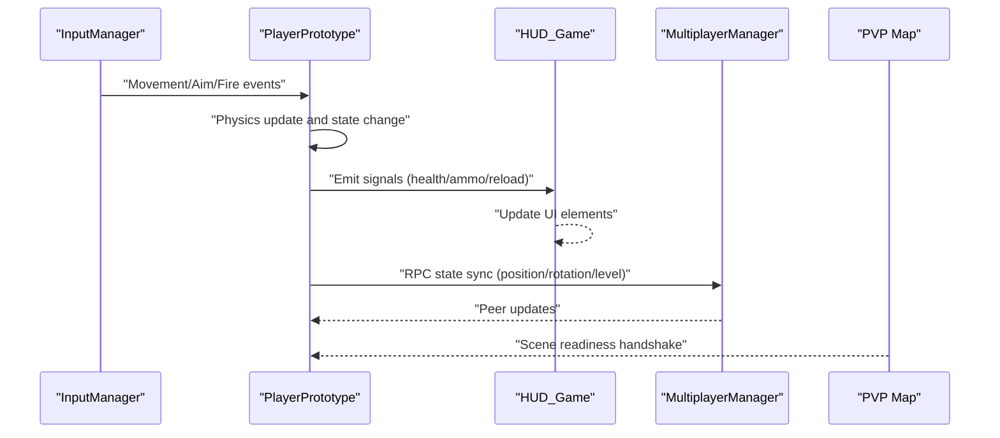
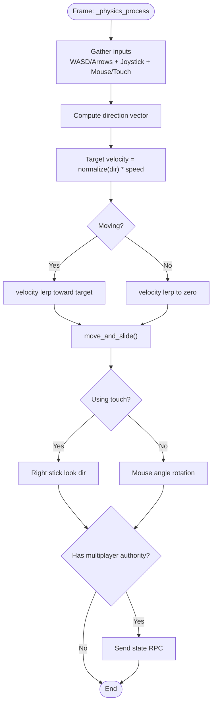
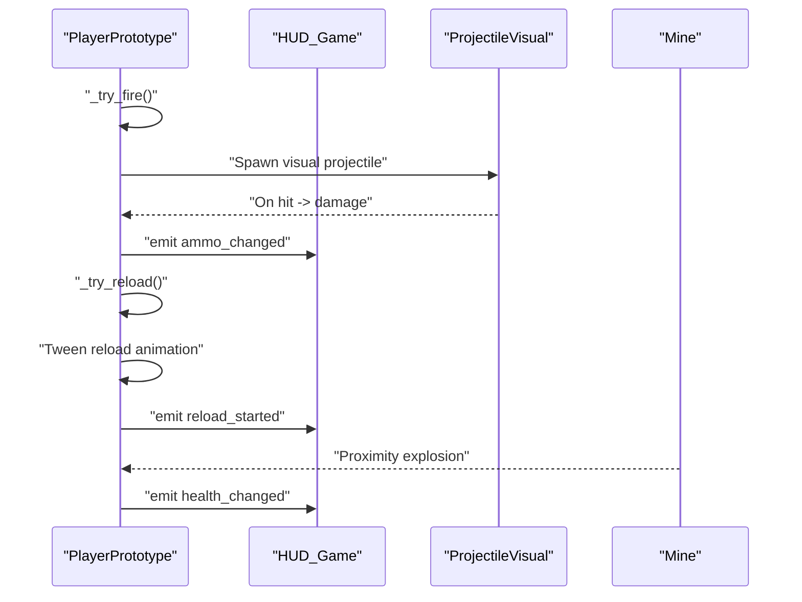
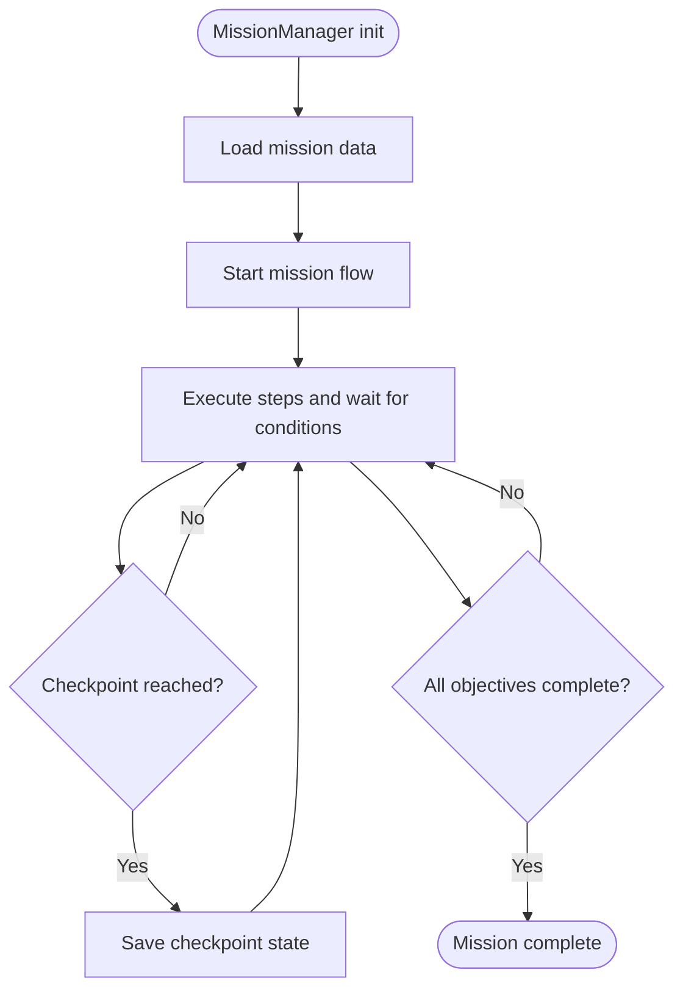
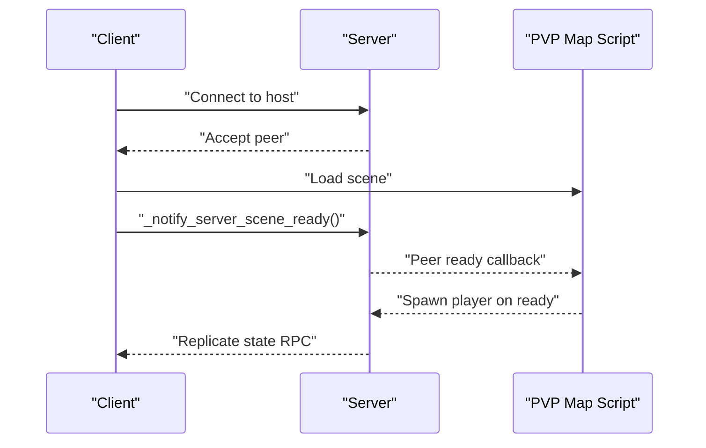
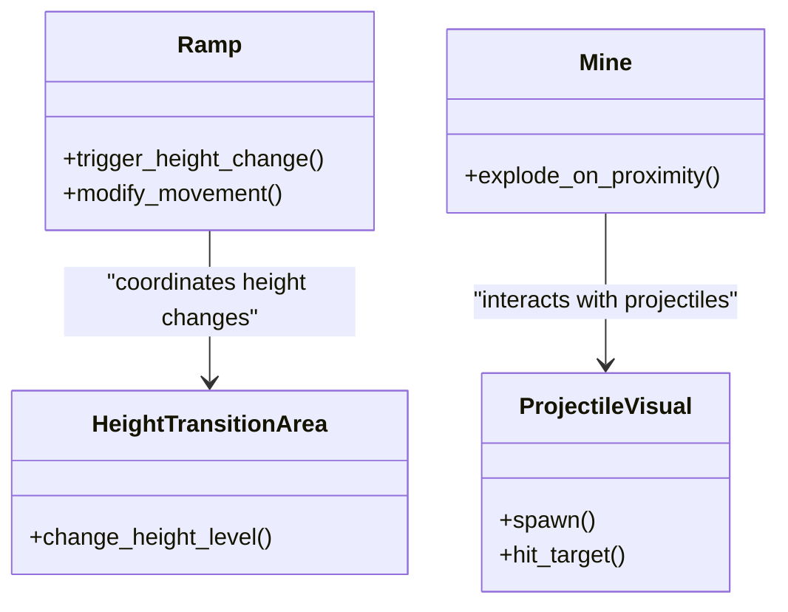
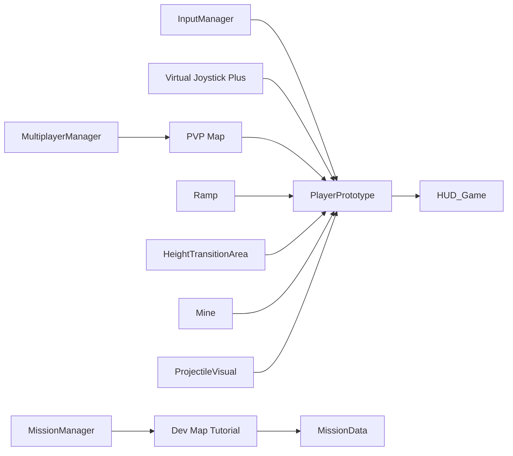

# Core Systems

<cite>
**Referenced Files in This Document**
- [player_prototype.gd](file://Scripts/player_prototype.gd)
- [input_manager.gd](file://Game/input_manager.gd)
- [virtual_joystick_plus.gd](file://addons/virtual_joystick_plus/virtual_joystick_plus.gd)
- [hud_game.gd](file://Menu/HUD/hud_game.gd)
- [minimap.gd](file://Menu/HUD/minimap.gd)
- [multiplayer_manager.gd](file://Scripts/multiplayer_manager.gd)
- [pvp_map.gd](file://Scripts/pvp_map.gd)
- [mission_manager.gd](file://Scripts/mission_manager.gd)
- [mission_data.gd](file://Scripts/mission_data.gd)
- [dev_map_tutorial.gd](file://Scripts/dev_map_tutorial.gd)
- [mina.gd](file://Scripts/mina.gd)
- [projectile_visual.gd](file://Scripts/projectile_visual.gd)
- [ramp.gd](file://Scripts/ramp.gd)
- [height_transition_area.gd](file://Scripts/height_transition_area.gd)
- [spawn_point.gd](file://Scripts/spawn_point.gd)
- [global_settings.gd](file://Scripts/global_settings.gd)
- [player.tscn](file://player.tscn)
- [HUD_Game.tscn](file://Menu/HUD/HUD_Game.tscn)
- [pvp_map.tscn](file://Maps/pvp_map.tscn)
- [multiplayer_menu.tscn](file://Menu/multiplayer_menu.tscn)
- [lobby.tscn](file://Menu/lobby.tscn)
- [main_menu.tscn](file://Menu/main_menu.tscn)
- [game_over_menu.tscn](file://Menu/game_over_menu.tscn)
- [InputManager.tscn](file://Game/InputManager.tscn)
</cite>

## Table of Contents
1. [Introduction](#introduction)
2. [Project Structure](#project-structure)
3. [Core Components](#core-components)
4. [Architecture Overview](#architecture-overview)
5. [Detailed Component Analysis](#detailed-component-analysis)
6. [Dependency Analysis](#dependency-analysis)
7. [Performance Considerations](#performance-considerations)
8. [Troubleshooting Guide](#troubleshooting-guide)
9. [Conclusion](#conclusion)

## Introduction
This document describes the core game systems that define TFA Agents gameplay: player movement and controls, combat mechanics, mission progression, and multiplayer networking. It explains how these systems are structured, initialized, and integrated to deliver a cohesive experience across single-player and multiplayer modes. Design decisions, runtime behavior, and common configuration options are covered to help developers and designers extend and maintain the systems effectively.

## Project Structure
The project is organized around scenes and scripts that implement gameplay subsystems:
- Player character and controls live under Scripts and scenes.
- HUD and UI elements are in Menu and HUD.
- Multiplayer orchestration is handled by dedicated managers and map handlers.
- Mission systems are implemented via managers and data containers.
- Auxiliary systems (projectiles, ramps, height transitions, mines) support core mechanics.

**Diagram sources**
- [player.tscn](file://player.tscn)
- [player_prototype.gd](file://Scripts/player_prototype.gd)
- [input_manager.gd](file://Game/input_manager.gd)
- [virtual_joystick_plus.gd](file://addons/virtual_joystick_plus/virtual_joystick_plus.gd)
- [HUD_Game.tscn](file://Menu/HUD/HUD_Game.tscn)
- [hud_game.gd](file://Menu/HUD/hud_game.gd)
- [minimap.gd](file://Menu/HUD/minimap.gd)
- [multiplayer_manager.gd](file://Scripts/multiplayer_manager.gd)
- [pvp_map.gd](file://Scripts/pvp_map.gd)
- [multiplayer_menu.tscn](file://Menu/multiplayer_menu.tscn)
- [lobby.tscn](file://Menu/lobby.tscn)
- [mission_manager.gd](file://Scripts/mission_manager.gd)
- [mission_data.gd](file://Scripts/mission_data.gd)
- [dev_map_tutorial.gd](file://Scripts/dev_map_tutorial.gd)
- [ramp.gd](file://Scripts/ramp.gd)
- [height_transition_area.gd](file://Scripts/height_transition_area.gd)
- [mina.gd](file://Scripts/mina.gd)
- [projectile_visual.gd](file://Scripts/projectile_visual.gd)
- [spawn_point.gd](file://Scripts/spawn_point.gd)

**Section sources**
- [player_prototype.gd:214-301](file://Scripts/player_prototype.gd#L214-L301)
- [hud_game.gd:63-91](file://Menu/HUD/hud_game.gd#L63-L91)
- [multiplayer_manager.gd:1-136](file://Scripts/multiplayer_manager.gd#L1-L136)
- [pvp_map.gd:55-91](file://Scripts/pvp_map.gd#L55-L91)
- [mission_manager.gd](file://Scripts/mission_manager.gd)
- [mission_data.gd](file://Scripts/mission_data.gd)
- [dev_map_tutorial.gd:27-61](file://Scripts/dev_map_tutorial.gd#L27-L61)

## Core Components
- Player Movement and Controls: Implements WASD/Arrow movement, analog stick input, mouse aiming, touch aim/fire, height-level toggling, and physics-based movement with smoothing and collision.
- Combat Mechanics: Handles firing, reloading, ammo tracking, weapon visuals, and hit detection via projectiles and proximity mines.
- Mission Progression: Manages mission lifecycle, checkpoints, tutorial steps, and completion conditions.
- Multiplayer Networking: Provides lobby management, scene readiness handshake, authority-based updates, and per-peer synchronization.

**Section sources**
- [player_prototype.gd:214-301](file://Scripts/player_prototype.gd#L214-L301)
- [input_manager.gd](file://Game/input_manager.gd)
- [virtual_joystick_plus.gd:283-328](file://addons/virtual_joystick_plus/virtual_joystick_plus.gd#L283-L328)
- [hud_game.gd:63-91](file://Menu/HUD/hud_game.gd#L63-L91)
- [mina.gd](file://Scripts/mina.gd)
- [projectile_visual.gd](file://Scripts/projectile_visual.gd)
- [mission_manager.gd](file://Scripts/mission_manager.gd)
- [mission_data.gd](file://Scripts/mission_data.gd)
- [dev_map_tutorial.gd:27-61](file://Scripts/dev_map_tutorial.gd#L27-L61)
- [multiplayer_manager.gd:1-136](file://Scripts/multiplayer_manager.gd#L1-L136)
- [pvp_map.gd:55-91](file://Scripts/pvp_map.gd#L55-L91)

## Architecture Overview
The systems integrate around a central player prototype that receives input, updates state, and synchronizes with peers. HUD tracks player stats and exposes UI elements. Multiplayer managers coordinate lobby and scene readiness. Mission systems orchestrate scripted events and checkpoints. Environment elements (ramps, height areas, mines) modify gameplay dynamics.

**Diagram sources**
- [input_manager.gd](file://Game/input_manager.gd)
- [player_prototype.gd:214-301](file://Scripts/player_prototype.gd#L214-L301)
- [hud_game.gd:63-91](file://Menu/HUD/hud_game.gd#L63-L91)
- [multiplayer_manager.gd:1-136](file://Scripts/multiplayer_manager.gd#L1-L136)
- [pvp_map.gd:55-91](file://Scripts/pvp_map.gd#L55-L91)

## Detailed Component Analysis

### Player Movement and Controls
- Input sources: Keyboard/WASD, directional keys, analog sticks, mouse, and touch.
- Movement: Direction vector computed from inputs, normalized target velocity, smooth acceleration/deceleration, and collision-based sliding.
- Aiming: Mouse-based rotation with easing; optional touch-stick aim-and-fire.
- Height-level toggling: Toggle between predefined levels using input actions.
- Authority and replication: Non-authority instances ignore local input; authority sends periodic state RPCs to remotes.

**Diagram sources**
- [player_prototype.gd:257-301](file://Scripts/player_prototype.gd#L257-L301)
- [virtual_joystick_plus.gd:283-328](file://addons/virtual_joystick_plus/virtual_joystick_plus.gd#L283-L328)

**Section sources**
- [player_prototype.gd:214-301](file://Scripts/player_prototype.gd#L214-L301)
- [input_manager.gd](file://Game/input_manager.gd)
- [virtual_joystick_plus.gd:283-328](file://addons/virtual_joystick_plus/virtual_joystick_plus.gd#L283-L328)

### Combat Mechanics
- Firing: Left mouse button triggers weapon fire; input is gated by authority in multiplayer.
- Reloading: R-key reloads; triggers tweened reload animation and updates ammo counters.
- Ammunition: Tracks current and total clips; emits signals consumed by HUD.
- Projectiles: Visual effects and behaviors are handled by dedicated scripts.
- Mines: Proximity-triggered explosives that affect health and status.

**Diagram sources**
- [player_prototype.gd:214-301](file://Scripts/player_prototype.gd#L214-L301)
- [projectile_visual.gd](file://Scripts/projectile_visual.gd)
- [mina.gd](file://Scripts/mina.gd)
- [hud_game.gd:63-91](file://Menu/HUD/hud_game.gd#L63-L91)

**Section sources**
- [player_prototype.gd:214-301](file://Scripts/player_prototype.gd#L214-L301)
- [projectile_visual.gd](file://Scripts/projectile_visual.gd)
- [mina.gd](file://Scripts/mina.gd)
- [hud_game.gd:63-91](file://Menu/HUD/hud_game.gd#L63-L91)

### Mission Progression
- Mission Manager: Central coordinator for mission lifecycle, commands, and flow execution.
- Mission Data: Defines mission metadata and objectives.
- Tutorial Flow: Specialized handler for development/tutorial missions, including checkpoints and thresholds for movement and mouse input.
- Checkpoints: Persist last checkpoint and restore position and height level upon respawn or trigger.

**Diagram sources**
- [mission_manager.gd](file://Scripts/mission_manager.gd)
- [mission_data.gd](file://Scripts/mission_data.gd)
- [dev_map_tutorial.gd:27-61](file://Scripts/dev_map_tutorial.gd#L27-L61)
- [player_prototype.gd:214-224](file://Scripts/player_prototype.gd#L214-L224)

**Section sources**
- [mission_manager.gd](file://Scripts/mission_manager.gd)
- [mission_data.gd](file://Scripts/mission_data.gd)
- [dev_map_tutorial.gd:27-61](file://Scripts/dev_map_tutorial.gd#L27-L61)
- [player_prototype.gd:214-224](file://Scripts/player_prototype.gd#L214-L224)

### Multiplayer Networking
- Multiplayer Manager: ENet-based lobby and match orchestration, connection/disconnection, and ready signals.
- PVP Map: Scene readiness handshake; clients notify server when loaded; server spawns players and manages scoreboard updates.
- Authority and Synchronization: Only authority instances process input; non-authority instances receive replicated state via RPCs.

**Diagram sources**
- [multiplayer_manager.gd:1-136](file://Scripts/multiplayer_manager.gd#L1-L136)
- [pvp_map.gd:55-91](file://Scripts/pvp_map.gd#L55-L91)
- [player_prototype.gd:295-301](file://Scripts/player_prototype.gd#L295-L301)

**Section sources**
- [multiplayer_manager.gd:1-136](file://Scripts/multiplayer_manager.gd#L1-L136)
- [pvp_map.gd:55-91](file://Scripts/pvp_map.gd#L55-L91)
- [player_prototype.gd:295-301](file://Scripts/player_prototype.gd#L295-L301)

### Environment Systems
- Ramps: Modify movement characteristics or provide traversal aids.
- Height Transition Areas: Trigger height-level changes with optional visuals.
- Mines: Proximity-triggered explosions affecting nearby players.
- Projectile Visuals: Dedicated script for projectile effects and lifecycle.

**Diagram sources**
- [ramp.gd](file://Scripts/ramp.gd)
- [height_transition_area.gd](file://Scripts/height_transition_area.gd)
- [mina.gd](file://Scripts/mina.gd)
- [projectile_visual.gd](file://Scripts/projectile_visual.gd)

**Section sources**
- [ramp.gd](file://Scripts/ramp.gd)
- [height_transition_area.gd](file://Scripts/height_transition_area.gd)
- [mina.gd](file://Scripts/mina.gd)
- [projectile_visual.gd](file://Scripts/projectile_visual.gd)

## Dependency Analysis
- Player depends on InputManager and Virtual Joystick for input, and on HUD for UI feedback.
- HUD subscribes to player signals for health, ammo, and reload events.
- Multiplayer Manager integrates with PVP Map for scene readiness and with Player for state synchronization.
- Mission Manager coordinates with Mission Data and Tutorial Flow scripts.
- Environment scripts are passive but interact with Player during collisions or triggers.

**Diagram sources**
- [input_manager.gd](file://Game/input_manager.gd)
- [virtual_joystick_plus.gd:283-328](file://addons/virtual_joystick_plus/virtual_joystick_plus.gd#L283-L328)
- [player_prototype.gd:214-301](file://Scripts/player_prototype.gd#L214-L301)
- [hud_game.gd:63-91](file://Menu/HUD/hud_game.gd#L63-L91)
- [multiplayer_manager.gd:1-136](file://Scripts/multiplayer_manager.gd#L1-L136)
- [pvp_map.gd:55-91](file://Scripts/pvp_map.gd#L55-L91)
- [mission_manager.gd](file://Scripts/mission_manager.gd)
- [mission_data.gd](file://Scripts/mission_data.gd)
- [dev_map_tutorial.gd:27-61](file://Scripts/dev_map_tutorial.gd#L27-L61)
- [ramp.gd](file://Scripts/ramp.gd)
- [height_transition_area.gd](file://Scripts/height_transition_area.gd)
- [mina.gd](file://Scripts/mina.gd)
- [projectile_visual.gd](file://Scripts/projectile_visual.gd)

**Section sources**
- [player_prototype.gd:214-301](file://Scripts/player_prototype.gd#L214-L301)
- [hud_game.gd:63-91](file://Menu/HUD/hud_game.gd#L63-L91)
- [multiplayer_manager.gd:1-136](file://Scripts/multiplayer_manager.gd#L1-L136)
- [pvp_map.gd:55-91](file://Scripts/pvp_map.gd#L55-L91)
- [mission_manager.gd](file://Scripts/mission_manager.gd)
- [mission_data.gd](file://Scripts/mission_data.gd)
- [dev_map_tutorial.gd:27-61](file://Scripts/dev_map_tutorial.gd#L27-L61)
- [ramp.gd](file://Scripts/ramp.gd)
- [height_transition_area.gd](file://Scripts/height_transition_area.gd)
- [mina.gd](file://Scripts/mina.gd)
- [projectile_visual.gd](file://Scripts/projectile_visual.gd)

## Performance Considerations
- Movement smoothing: Velocity lerping reduces jitter and stabilizes motion; tune acceleration/deceleration coefficients to balance responsiveness and stability.
- Input gating: In multiplayer, non-authority instances skip input processing to avoid redundant work and conflicts.
- Synchronization cadence: State RPCs are sent every N frames to reduce bandwidth while maintaining responsiveness.
- HUD updates: Connect to player signals rather than polling to minimize overhead.
- Environment interactions: Keep mine and projectile logic efficient; reuse nodes and avoid frequent allocations.

[No sources needed since this section provides general guidance]

## Troubleshooting Guide
- Player not responding to input:
  - Verify input actions are mapped and InputManager is attached to the scene.
  - Confirm authority checks are not blocking input in multiplayer.
- HUD not updating:
  - Ensure HUD_Game connects to player signals and subscribes to health/ammo/reload events.
- Multiplayer desync:
  - Check that only authority instances process input and send RPCs.
  - Verify scene readiness handshake completes on both client and server.
- Mission not progressing:
  - Confirm MissionManager is running and Tutorial flow is connected to checkpoint and step signals.
- Mines not triggering:
  - Validate collision shapes and proximity detection logic; ensure explosion callbacks are invoked.

**Section sources**
- [input_manager.gd](file://Game/input_manager.gd)
- [hud_game.gd:63-91](file://Menu/HUD/hud_game.gd#L63-L91)
- [multiplayer_manager.gd:1-136](file://Scripts/multiplayer_manager.gd#L1-L136)
- [pvp_map.gd:55-91](file://Scripts/pvp_map.gd#L55-L91)
- [mission_manager.gd](file://Scripts/mission_manager.gd)
- [dev_map_tutorial.gd:27-61](file://Scripts/dev_map_tutorial.gd#L27-L61)
- [mina.gd](file://Scripts/mina.gd)

## Conclusion
TFA Agents’ core systems are designed around a robust player prototype that integrates input, movement, combat, and multiplayer synchronization. Mission systems provide structured progression, while HUD and environment elements enrich the gameplay loop. The architecture emphasizes authority-based processing, signal-driven UI updates, and efficient network synchronization to deliver a responsive and scalable experience.

[No sources needed since this section summarizes without analyzing specific files]