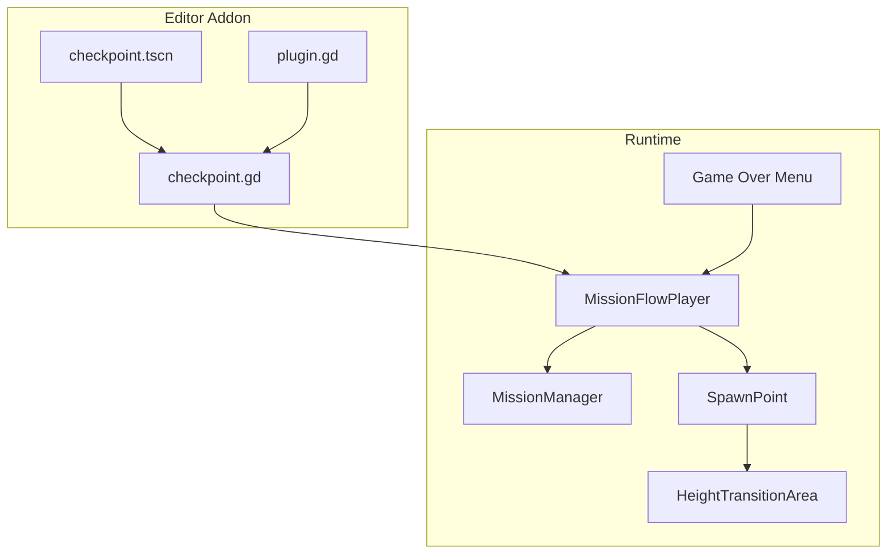
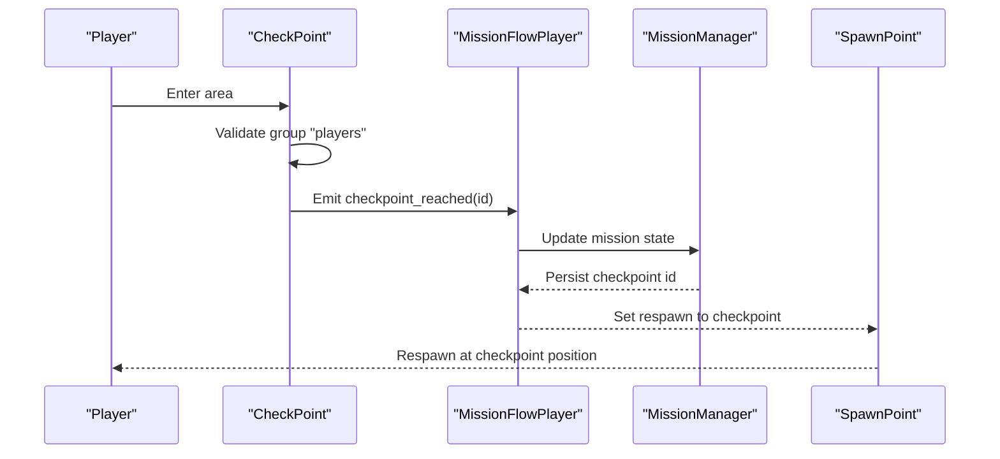
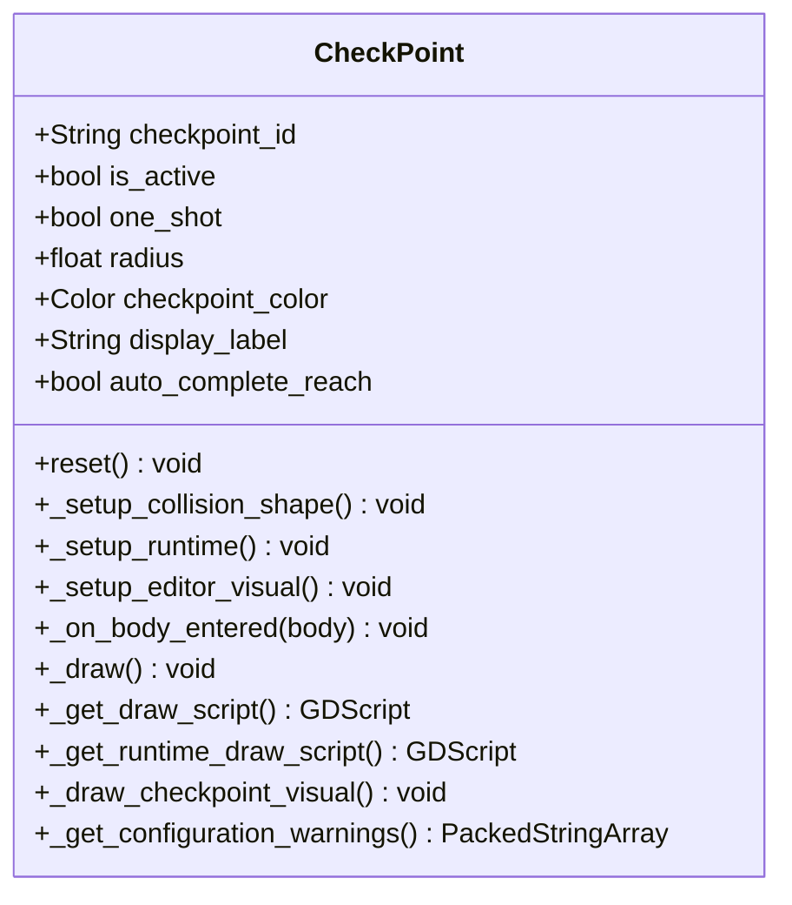
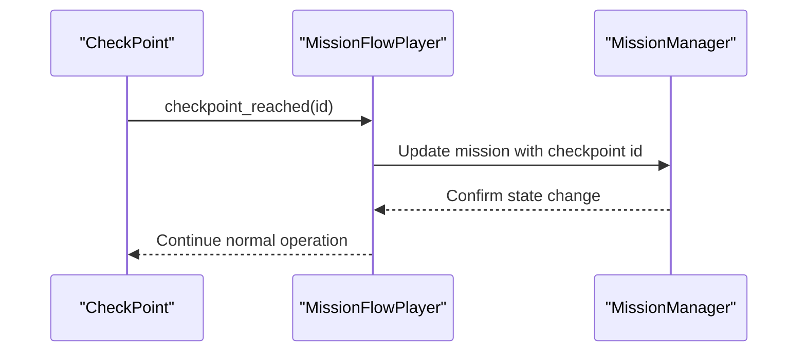
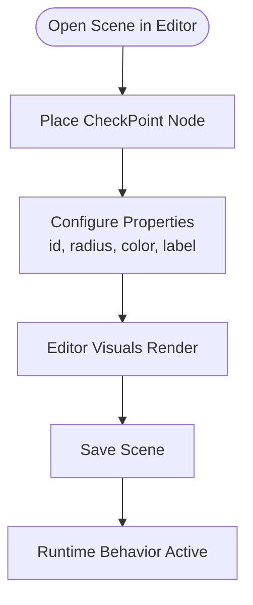
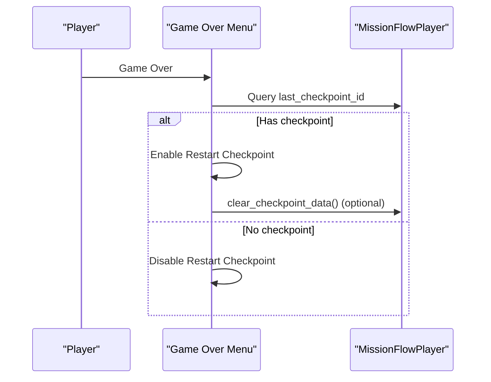
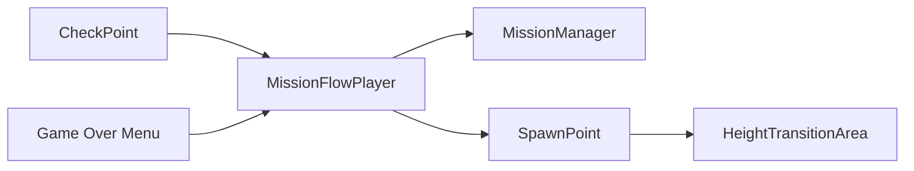

# Checkpoint System

<cite>
**Referenced Files in This Document**
- [checkpoint.gd](file://addons/mission_editor/checkpoint.gd)
- [checkpoint.tscn](file://addons/mission_editor/checkpoint.tscn)
- [plugin.gd](file://addons/mission_editor/plugin.gd)
- [mission_flow_player.gd](file://addons/mission_editor/mission_flow_player.gd)
- [mission_manager.gd](file://Scripts/mission_manager.gd)
- [spawn_point.gd](file://Scripts/spawn_point.gd)
- [height_transition_area.gd](file://Scripts/height_transition_area.gd)
- [game_over_menu.gd](file://Menu/game_over_menu.gd)
- [main_menu.gd](file://Menu/main_menu.gd)
- [dev_map_tutorial.gd](file://Scripts/dev_map_tutorial.gd)
</cite>

## Table of Contents
1. [Introduction](#introduction)
2. [Project Structure](#project-structure)
3. [Core Components](#core-components)
4. [Architecture Overview](#architecture-overview)
5. [Detailed Component Analysis](#detailed-component-analysis)
6. [Dependency Analysis](#dependency-analysis)
7. [Performance Considerations](#performance-considerations)
8. [Troubleshooting Guide](#troubleshooting-guide)
9. [Conclusion](#conclusion)

## Introduction
This document provides comprehensive documentation for the Checkpoint System in TFA Agents. It covers checkpoint placement and activation logic, mission state persistence, the checkpoint editor functionality within the mission editor addon, checkpoint triggers and player respawns, mission restart mechanisms, and integration with level transitions and height changes. The goal is to enable both developers and mission designers to effectively configure, place, and utilize checkpoints for robust gameplay experiences.

## Project Structure
The checkpoint system spans several components:
- Editor addon for placing and configuring checkpoints
- Runtime checkpoint logic integrated with mission flows
- Player respawn and mission restart mechanisms
- Integration with mission manager and tutorial flows

**Diagram sources**
- [checkpoint.tscn](file://addons/mission_editor/checkpoint.tscn)
- [checkpoint.gd](file://addons/mission_editor/checkpoint.gd)
- [plugin.gd](file://addons/mission_editor/plugin.gd)
- [mission_flow_player.gd](file://addons/mission_editor/mission_flow_player.gd)
- [mission_manager.gd](file://Scripts/mission_manager.gd)
- [spawn_point.gd](file://Scripts/spawn_point.gd)
- [height_transition_area.gd](file://Scripts/height_transition_area.gd)
- [game_over_menu.gd](file://Menu/game_over_menu.gd)

**Section sources**
- [checkpoint.gd:1-230](file://addons/mission_editor/checkpoint.gd#L1-L230)
- [checkpoint.tscn](file://addons/mission_editor/checkpoint.tscn)
- [plugin.gd](file://addons/mission_editor/plugin.gd)

## Core Components
- CheckPoint (Area2D): A placed checkpoint that detects player entry, emits events to the mission flow, and optionally auto-completes missions. It supports editor visuals, runtime drawing, activation toggling, and one-shot behavior.
- MissionFlowPlayer: Receives checkpoint events and updates mission state accordingly.
- MissionManager: Manages mission progress and persists state for restart/reload scenarios.
- SpawnPoint: Defines player respawn locations and integrates with checkpoint logic.
- HeightTransitionArea: Handles height changes during level transitions and interacts with checkpoint state.
- Game Over Menu: Provides checkpoint restart and full reset functionality.

Key implementation references:
- CheckPoint class definition and exported properties
- Runtime setup and collision shape configuration
- Trigger detection and event emission
- One-shot and activation toggling behavior
- Visual rendering in editor and runtime
- Warning generation for missing identifiers

**Section sources**
- [checkpoint.gd:1-230](file://addons/mission_editor/checkpoint.gd#L1-L230)
- [mission_flow_player.gd](file://addons/mission_editor/mission_flow_player.gd)
- [mission_manager.gd](file://Scripts/mission_manager.gd)
- [spawn_point.gd](file://Scripts/spawn_point.gd)
- [height_transition_area.gd](file://Scripts/height_transition_area.gd)
- [game_over_menu.gd](file://Menu/game_over_menu.gd)

## Architecture Overview
The checkpoint system operates through a clear pipeline:
- Placement in the editor via the mission editor addon
- Runtime detection when players enter the checkpoint area
- Event emission to MissionFlowPlayer for mission state updates
- Optional auto-complete of REACH/ACTIVATE missions
- Persistence of last checkpoint for restart/reload
- Integration with spawn points and height transitions

**Diagram sources**
- [checkpoint.gd:114-129](file://addons/mission_editor/checkpoint.gd#L114-L129)
- [mission_flow_player.gd](file://addons/mission_editor/mission_flow_player.gd)
- [mission_manager.gd](file://Scripts/mission_manager.gd)
- [spawn_point.gd](file://Scripts/spawn_point.gd)

## Detailed Component Analysis

### CheckPoint Component
The CheckPoint extends Area2D and provides:
- Unique identifier (checkpoint_id) for mission flows
- Activation controls (is_active) and one-shot behavior (one_shot)
- Visual configuration (radius, color, optional label)
- Auto-complete for REACH missions (auto_complete_reach)
- Editor and runtime visual rendering
- Signal emission to MissionFlowPlayer upon player entry

**Diagram sources**
- [checkpoint.gd:1-230](file://addons/mission_editor/checkpoint.gd#L1-L230)

**Section sources**
- [checkpoint.gd:1-230](file://addons/mission_editor/checkpoint.gd#L1-L230)

### MissionFlowPlayer Integration
MissionFlowPlayer listens for checkpoint_reached signals and coordinates mission updates. It maintains the last checkpoint id and exposes methods for clearing checkpoint data during restarts.

**Diagram sources**
- [checkpoint.gd:125-129](file://addons/mission_editor/checkpoint.gd#L125-L129)
- [mission_flow_player.gd](file://addons/mission_editor/mission_flow_player.gd)

**Section sources**
- [checkpoint.gd:125-129](file://addons/mission_editor/checkpoint.gd#L125-L129)
- [mission_flow_player.gd](file://addons/mission_editor/mission_flow_player.gd)

### Editor Functionality (Mission Editor Addon)
The mission editor addon enables visual placement and configuration of checkpoints:
- Scene template (checkpoint.tscn) defines the visual representation
- Plugin integration allows adding checkpoints to scenes
- Editor visuals render circles and optional labels
- Exported properties support runtime behavior customization

**Diagram sources**
- [checkpoint.tscn](file://addons/mission_editor/checkpoint.tscn)
- [plugin.gd](file://addons/mission_editor/plugin.gd)
- [checkpoint.gd:171-179](file://addons/mission_editor/checkpoint.gd#L171-L179)

**Section sources**
- [checkpoint.tscn](file://addons/mission_editor/checkpoint.tscn)
- [plugin.gd](file://addons/mission_editor/plugin.gd)
- [checkpoint.gd:171-179](file://addons/mission_editor/checkpoint.gd#L171-L179)

### Player Respawn and Mission Restart
The game over menu and main menu integrate with checkpoint data to support:
- Restart from the last checkpoint
- Full reset of checkpoint data for new games
- Enabling/disabling checkpoint restart button based on availability

**Diagram sources**
- [game_over_menu.gd:229-264](file://Menu/game_over_menu.gd#L229-L264)
- [main_menu.gd:123-126](file://Menu/main_menu.gd#L123-L126)
- [mission_flow_player.gd](file://addons/mission_editor/mission_flow_player.gd)

**Section sources**
- [game_over_menu.gd:229-264](file://Menu/game_over_menu.gd#L229-L264)
- [main_menu.gd:123-126](file://Menu/main_menu.gd#L123-L126)

### Tutorial Integration Example
The tutorial map demonstrates hiding a checkpoint until a specific mission step is reached, showcasing checkpoint visibility and mission-driven reveal logic.

**Section sources**
- [dev_map_tutorial.gd:37-56](file://Scripts/dev_map_tutorial.gd#L37-L56)

## Dependency Analysis
The checkpoint system exhibits the following dependencies:
- CheckPoint depends on MissionFlowPlayer for state updates
- MissionFlowPlayer depends on MissionManager for persistent state
- SpawnPoint integrates with checkpoint data for respawn logic
- HeightTransitionArea interacts with checkpoint state during transitions
- Game Over Menu coordinates restart and reset actions with MissionFlowPlayer

**Diagram sources**
- [checkpoint.gd:1-230](file://addons/mission_editor/checkpoint.gd#L1-L230)
- [mission_flow_player.gd](file://addons/mission_editor/mission_flow_player.gd)
- [mission_manager.gd](file://Scripts/mission_manager.gd)
- [spawn_point.gd](file://Scripts/spawn_point.gd)
- [height_transition_area.gd](file://Scripts/height_transition_area.gd)
- [game_over_menu.gd](file://Menu/game_over_menu.gd)

**Section sources**
- [checkpoint.gd:1-230](file://addons/mission_editor/checkpoint.gd#L1-L230)
- [mission_flow_player.gd](file://addons/mission_editor/mission_flow_player.gd)
- [mission_manager.gd](file://Scripts/mission_manager.gd)
- [spawn_point.gd](file://Scripts/spawn_point.gd)
- [height_transition_area.gd](file://Scripts/height_transition_area.gd)
- [game_over_menu.gd](file://Menu/game_over_menu.gd)

## Performance Considerations
- Keep checkpoint radius minimal to reduce unnecessary overlap checks.
- Use one_shot behavior to prevent redundant triggers in dense layouts.
- Limit editor visuals to development builds; rely on runtime visuals for production.
- Avoid excessive checkpoint clustering to minimize collision overhead.

## Troubleshooting Guide
Common issues and resolutions:
- Missing checkpoint_id: The component generates a configuration warning requiring a unique identifier. Assign a non-empty checkpoint_id to resolve.
- Checkpoint not triggering: Verify is_active is true and the player belongs to the "players" group. Ensure one_shot is not preventing re-triggering if needed.
- Visual discrepancies: Confirm editor visuals are disabled in runtime and runtime visuals are enabled. Adjust radius and color for visibility.
- Restart button disabled: Ensure MissionFlowPlayer has recorded a last_checkpoint_id. Clear checkpoint data if restarting from the beginning.

**Section sources**
- [checkpoint.gd:226-230](file://addons/mission_editor/checkpoint.gd#L226-L230)
- [checkpoint.gd:114-129](file://addons/mission_editor/checkpoint.gd#L114-L129)
- [game_over_menu.gd:79-84](file://Menu/game_over_menu.gd#L79-L84)

## Conclusion
The Checkpoint System in TFA Agents provides a robust framework for mission-driven gameplay, enabling precise checkpoint placement, reliable trigger detection, and seamless integration with mission state persistence. Through the mission editor addon, designers can visually configure checkpoints, while developers can extend behaviors and integrate with respawn and transition systems. Proper configuration and understanding of the checkpoint lifecycle ensure smooth player experiences across scripted sequences and dynamic environments.