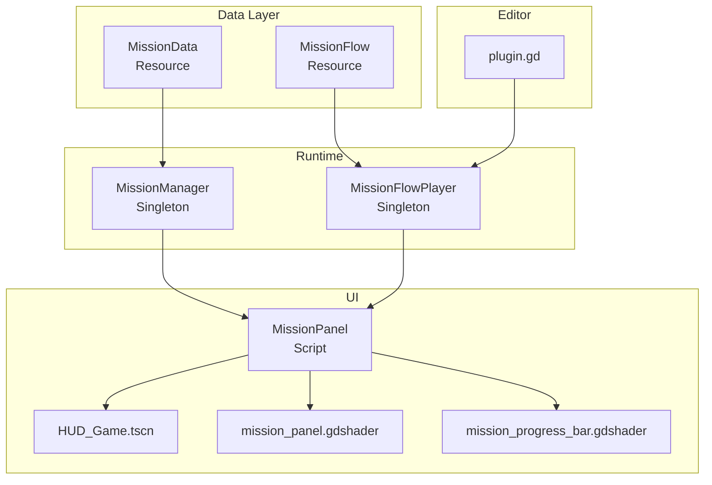
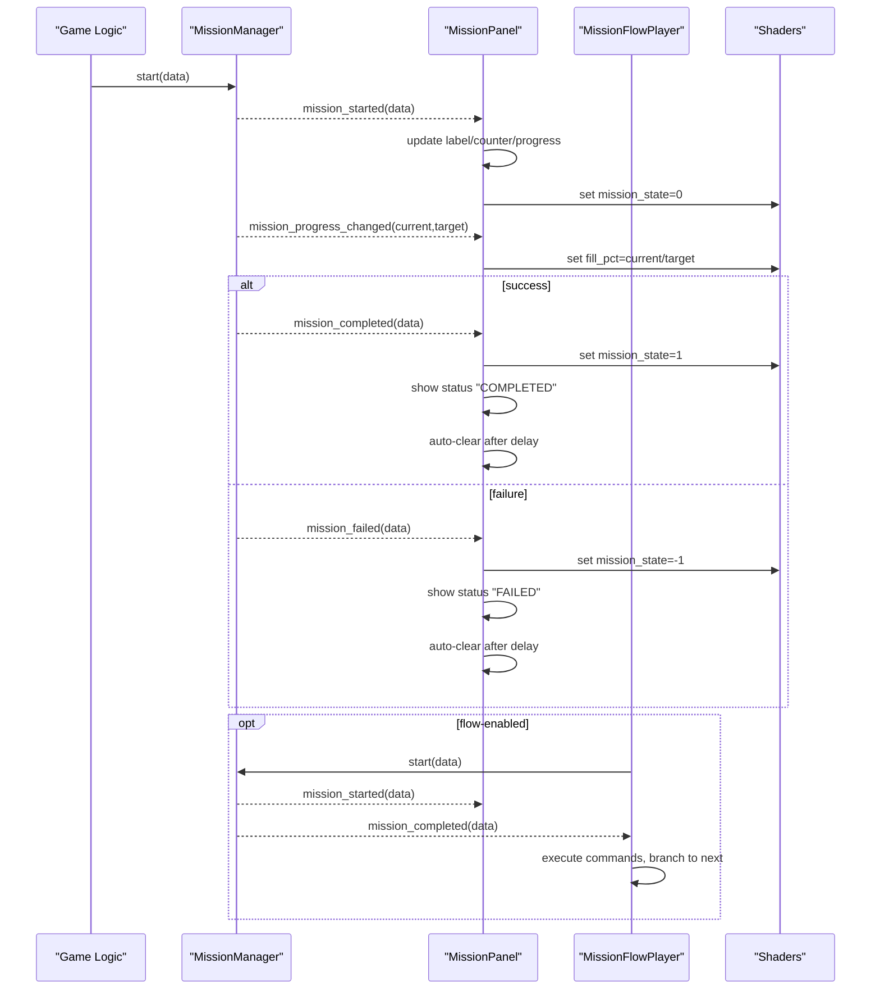
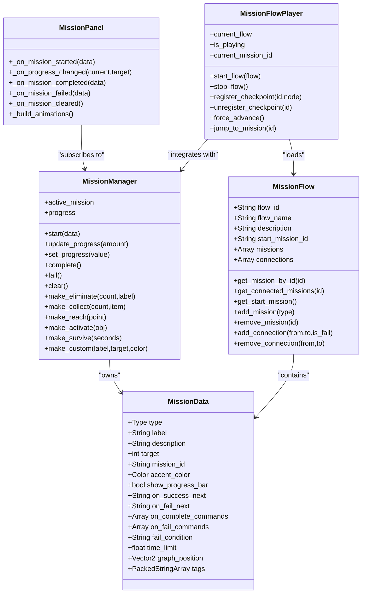
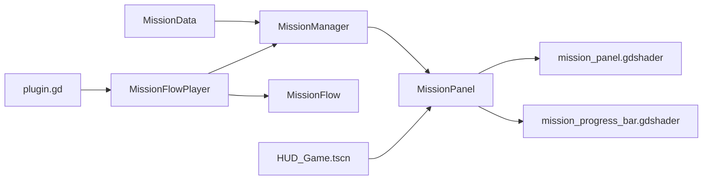

# Mission Data Structures

<cite>
**Referenced Files in This Document**
- [mission_data.gd](file://Scripts/mission_data.gd)
- [mission_panel.gd](file://Scripts/mission_panel.gd)
- [mission_manager.gd](file://Scripts/mission_manager.gd)
- [mission_panel.gdshader](file://Shaders/HUD/mission_panel.gdshader)
- [mission_progress_bar.gdshader](file://Shaders/HUD/mission_progress_bar.gdshader)
- [HUD_Game.tscn](file://Menu/HUD/HUD_Game.tscn)
- [hud_game.gd](file://Menu/HUD/hud_game.gd)
- [mission_flow.gd](file://addons/mission_editor/mission_flow.gd)
- [mission_flow_player.gd](file://addons/mission_editor/mission_flow_player.gd)
- [plugin.gd](file://addons/mission_editor/plugin.gd)
- [dev_map_tutorial.gd](file://Scripts/dev_map_tutorial.gd)
- [creazionemissioni.md](file://creazionemissioni.md)
</cite>

## Table of Contents
1. [Introduction](#introduction)
2. [Project Structure](#project-structure)
3. [Core Components](#core-components)
4. [Architecture Overview](#architecture-overview)
5. [Detailed Component Analysis](#detailed-component-analysis)
6. [Dependency Analysis](#dependency-analysis)
7. [Performance Considerations](#performance-considerations)
8. [Troubleshooting Guide](#troubleshooting-guide)
9. [Conclusion](#conclusion)
10. [Appendices](#appendices)

## Introduction
This document explains the Mission Data Structures and the Mission Panel system used in the project. It covers the MissionData class that defines mission types, objectives, targets, and metadata; the MissionPanel UI component that renders progress and integrates with the HUD; and the MissionManager singleton that orchestrates mission lifecycle events. It also documents the Mission Flow Editor plugin that enables branching, commands, and checkpoint-based flows. Practical guidance is included for creating custom mission types, configuring mission properties, implementing new objective types, and styling the Mission Panel with shaders and themes.

## Project Structure
The mission system spans several scripts and scenes:
- Data model: MissionData Resource
- Runtime manager: MissionManager singleton
- UI panel: MissionPanel script attached to HUD TopCenter
- HUD scene: HUD_Game.tscn with nodes and materials
- Shaders: mission_panel.gdshader and mission_progress_bar.gdshader
- Flow editor: MissionFlow Resource and MissionFlowPlayer singleton
- Tutorial integration: dev_map_tutorial.gd demonstrates end-to-end usage

**Diagram sources**
- [mission_data.gd:1-66](file://Scripts/mission_data.gd#L1-L66)
- [mission_manager.gd:1-169](file://Scripts/mission_manager.gd#L1-L169)
- [mission_panel.gd:1-359](file://Scripts/mission_panel.gd#L1-L359)
- [mission_flow.gd:1-134](file://addons/mission_editor/mission_flow.gd#L1-L134)
- [mission_flow_player.gd:1-379](file://addons/mission_editor/mission_flow_player.gd#L1-L379)
- [plugin.gd:1-109](file://addons/mission_editor/plugin.gd#L1-L109)
- [HUD_Game.tscn:1-312](file://Menu/HUD/HUD_Game.tscn#L1-L312)
- [mission_panel.gdshader:1-112](file://Shaders/HUD/mission_panel.gdshader#L1-L112)
- [mission_progress_bar.gdshader:1-63](file://Shaders/HUD/mission_progress_bar.gdshader#L1-L63)

**Section sources**
- [mission_data.gd:1-66](file://Scripts/mission_data.gd#L1-L66)
- [mission_manager.gd:1-169](file://Scripts/mission_manager.gd#L1-L169)
- [mission_panel.gd:1-359](file://Scripts/mission_panel.gd#L1-L359)
- [mission_flow.gd:1-134](file://addons/mission_editor/mission_flow.gd#L1-L134)
- [mission_flow_player.gd:1-379](file://addons/mission_editor/mission_flow_player.gd#L1-L379)
- [plugin.gd:1-109](file://addons/mission_editor/plugin.gd#L1-L109)
- [HUD_Game.tscn:1-312](file://Menu/HUD/HUD_Game.tscn#L1-L312)
- [mission_panel.gdshader:1-112](file://Shaders/HUD/mission_panel.gdshader#L1-L112)
- [mission_progress_bar.gdshader:1-63](file://Shaders/HUD/mission_progress_bar.gdshader#L1-L63)

## Core Components
- MissionData: Defines a single mission’s type, label, description, target, ID, accent color, progress bar preference, branching, commands, failure conditions, time limit, graph position, and tags.
- MissionManager: Singleton that starts missions, updates progress, emits lifecycle signals, and exposes convenience factories for common mission types.
- MissionPanel: HUD component that listens to MissionManager signals, updates UI nodes, applies styles, and drives shader visuals and animations.
- MissionFlow and MissionFlowPlayer: Editor-backed flow system enabling branching, commands, checkpoints, and time limits.
- Shaders: mission_panel.gdshader and mission_progress_bar.gdshader provide animated borders, state transitions, and visual feedback.

**Section sources**
- [mission_data.gd:7-66](file://Scripts/mission_data.gd#L7-L66)
- [mission_manager.gd:12-169](file://Scripts/mission_manager.gd#L12-L169)
- [mission_panel.gd:10-169](file://Scripts/mission_panel.gd#L10-L169)
- [mission_flow.gd:1-134](file://addons/mission_editor/mission_flow.gd#L1-L134)
- [mission_flow_player.gd:1-379](file://addons/mission_editor/mission_flow_player.gd#L1-L379)
- [mission_panel.gdshader:1-112](file://Shaders/HUD/mission_panel.gdshader#L1-L112)
- [mission_progress_bar.gdshader:1-63](file://Shaders/HUD/mission_progress_bar.gdshader#L1-L63)

## Architecture Overview
The system follows a publish-subscribe pattern:
- MissionManager emits signals for mission lifecycle events.
- MissionPanel subscribes to these signals and updates UI nodes and shaders.
- MissionFlowPlayer integrates with MissionManager to orchestrate flows with branching, commands, and timers.

**Diagram sources**
- [mission_manager.gd:23-100](file://Scripts/mission_manager.gd#L23-L100)
- [mission_panel.gd:53-169](file://Scripts/mission_panel.gd#L53-L169)
- [mission_flow_player.gd:175-216](file://addons/mission_editor/mission_flow_player.gd#L175-L216)
- [mission_panel.gdshader:10-112](file://Shaders/HUD/mission_panel.gdshader#L10-L112)
- [mission_progress_bar.gdshader:8-63](file://Shaders/HUD/mission_progress_bar.gdshader#L8-L63)

## Detailed Component Analysis

### MissionData: Mission Definition and Metadata
MissionData is a Resource that encapsulates:
- Type: ELIMINATE, COLLECT, REACH, ACTIVATE, SURVIVE, CUSTOM
- Label and Description: UI text and tooltips
- Target: completion threshold (0 for boolean objectives)
- mission_id: unique identifier for branching and flow
- accent_color: theme color for counters and highlights
- show_progress_bar: toggles numeric counter vs progress bar
- Flow control: on_success_next, on_fail_next, on_complete_commands, on_fail_commands, fail_condition, time_limit
- Graph metadata: graph_position, tags

Key behaviors:
- Boolean objectives (REACH/ACTIVATE) use target=0 and hide counter/progress bar.
- SURVIVE sets show_progress_bar=true by default.
- Flow editor fields enable branching and command execution.

**Section sources**
- [mission_data.gd:7-66](file://Scripts/mission_data.gd#L7-L66)

### MissionManager: Lifecycle Orchestration
MissionManager is an Autoload singleton exposing:
- Public API: start(data), update_progress(amount), set_progress(value), complete(), fail(), clear()
- Signals: mission_started, mission_progress_changed, mission_completed, mission_failed, mission_cleared
- Read-only properties: active_mission, progress
- Factory helpers: make_eliminate, make_collect, make_reach, make_activate, make_survive, make_custom

Behavior highlights:
- Auto-completion when progress reaches target for counter-based missions.
- Single active mission at a time; start() replaces current mission.
- Emits progress and completion signals for UI and flow integration.

**Section sources**
- [mission_manager.gd:12-169](file://Scripts/mission_manager.gd#L12-L169)

### MissionPanel: HUD Integration and Visual Feedback
MissionPanel attaches to HUD TopCenter and:
- Connects to MissionManager signals to render mission UI
- Manages nodes: MissionLabel, MissionCounter, MissionProgressBar, MissionStatus, MissionAnim
- Applies StyleBoxFlat styles for active/completed/failed states
- Drives shader visuals and animations based on graphics quality presets
- Updates shader parameters for panel and progress bar

Visual features:
- Animated slide-in/slide-out transitions
- Completion and failure flash animations
- Shader-driven border glow, state transitions, and edge effects
- Progress bar with shimmer, gradient, and edge glow

**Section sources**
- [mission_panel.gd:10-169](file://Scripts/mission_panel.gd#L10-L169)
- [mission_panel.gd:180-359](file://Scripts/mission_panel.gd#L180-L359)
- [HUD_Game.tscn:112-180](file://Menu/HUD/HUD_Game.tscn#L112-L180)

### Shaders: Visual Effects and State Feedback
- mission_panel.gdshader: Animated border glow, state-based color transitions (green for completed, red for failed), pulsing and traveling light effects, background tint protection for readable text.
- mission_progress_bar.gdshader: Fill color transitions (normal → completed → failed), shimmer, vertical gradient, edge glow, animated stripes, and state pulse.

Both shaders accept uniforms:
- mission_state: 0.0 (normal), 1.0 (completed), -1.0 (failed)
- state_time: resets on state change
- fill_pct: normalized progress for progress bar

**Section sources**
- [mission_panel.gdshader:10-112](file://Shaders/HUD/mission_panel.gdshader#L10-L112)
- [mission_progress_bar.gdshader:8-63](file://Shaders/HUD/mission_progress_bar.gdshader#L8-L63)
- [mission_panel.gd:323-359](file://Scripts/mission_panel.gd#L323-L359)

### Mission Flow Editor: Branching, Commands, and Checkpoints
- MissionFlow Resource: flow_id, flow_name, description, start_mission_id, missions[], connections[]
- MissionFlowPlayer: Autoload that integrates with MissionManager to:
  - Start flows and resume from checkpoints
  - Execute commands on completion/failure (play sound, change scene, spawn enemies, play animation, set variables, call methods, show dialog, toggle checkpoint)
  - Handle time_limit expiration and branching to success/fail next missions
  - Emit flow_started, flow_ended, mission_branch_taken, command_executed, checkpoint_reached

**Section sources**
- [mission_flow.gd:1-134](file://addons/mission_editor/mission_flow.gd#L1-L134)
- [mission_flow_player.gd:1-379](file://addons/mission_editor/mission_flow_player.gd#L1-L379)
- [plugin.gd:15-109](file://addons/mission_editor/plugin.gd#L15-L109)

### Tutorial Integration: Practical Flow Usage
The tutorial script demonstrates:
- Starting a MissionFlow via MissionFlowPlayer
- Detecting completion conditions per step (movement, mouse aim, firing, group clears)
- Dynamically updating mission targets and progress
- Using checkpoints and auto-completion timing

**Section sources**
- [dev_map_tutorial.gd:1-260](file://Scripts/dev_map_tutorial.gd#L1-L260)

## Architecture Overview

**Diagram sources**
- [mission_data.gd:7-66](file://Scripts/mission_data.gd#L7-L66)
- [mission_manager.gd:12-169](file://Scripts/mission_manager.gd#L12-L169)
- [mission_panel.gd:53-169](file://Scripts/mission_panel.gd#L53-L169)
- [mission_flow.gd:1-134](file://addons/mission_editor/mission_flow.gd#L1-L134)
- [mission_flow_player.gd:1-379](file://addons/mission_editor/mission_flow_player.gd#L1-L379)

## Detailed Component Analysis

### MissionData Class Structure
- Enum Type: ELIMINATE, COLLECT, REACH, ACTIVATE, SURVIVE, CUSTOM
- Exported fields: type, label, description, target, mission_id, accent_color, show_progress_bar
- Flow fields: on_success_next, on_fail_next, on_complete_commands, on_fail_commands, fail_condition, time_limit
- Graph fields: graph_position, tags

Implementation notes:
- Boolean objectives (REACH/ACTIVATE) set target=0 and hide counter/progress bar.
- SURVIVE defaults to progress bar for countdown visualization.
- Flow fields integrate with MissionFlowPlayer for branching and command execution.

**Section sources**
- [mission_data.gd:7-66](file://Scripts/mission_data.gd#L7-L66)

### MissionPanel UI Rendering and Animations
- Node resolution: looks up %MissionPanelInner, %MissionLabel, %MissionCounter, %MissionProgressBar, %MissionStatus, %MissionAnim
- Style overrides: style_active, style_completed, style_failed applied to panel
- Progress rendering: numeric counter or progress bar depending on show_progress_bar and target
- Shader integration: updates state_time and fill_pct uniforms
- Animation library: builds slide_in, slide_out, complete_flash, fail_flash based on graphics preset

**Section sources**
- [mission_panel.gd:10-169](file://Scripts/mission_panel.gd#L10-L169)
- [mission_panel.gd:180-359](file://Scripts/mission_panel.gd#L180-L359)
- [HUD_Game.tscn:112-180](file://Menu/HUD/HUD_Game.tscn#L112-L180)

### MissionManager Lifecycle and Factory Helpers
- Lifecycle: start → progress updates → complete/fail → clear
- Auto-completion: when progress ≥ target for counter-based missions
- Factory helpers: standardized labels, colors, and IDs for common mission types

**Section sources**
- [mission_manager.gd:49-169](file://Scripts/mission_manager.gd#L49-L169)

### Mission Flow Editor Integration
- MissionFlow: serializable graph of missions with connections and positions
- MissionFlowPlayer: runtime executor that:
  - Resumes from checkpoints
  - Executes commands on completion/failure
  - Handles time limits and branching
  - Emits signals for UI and logging

**Section sources**
- [mission_flow.gd:1-134](file://addons/mission_editor/mission_flow.gd#L1-L134)
- [mission_flow_player.gd:1-379](file://addons/mission_editor/mission_flow_player.gd#L1-L379)

### Tutorial Flow: Practical Usage
- Demonstrates stepwise progression: movement, aiming, firing, eliminating bots, collecting items, destroying barrels
- Uses MissionFlowPlayer to chain steps and MissionManager to signal completion
- Adjusts mission targets dynamically based on scene content

**Section sources**
- [dev_map_tutorial.gd:1-260](file://Scripts/dev_map_tutorial.gd#L1-L260)

## Dependency Analysis

**Diagram sources**
- [mission_data.gd:1-66](file://Scripts/mission_data.gd#L1-L66)
- [mission_manager.gd:1-169](file://Scripts/mission_manager.gd#L1-L169)
- [mission_panel.gd:1-359](file://Scripts/mission_panel.gd#L1-L359)
- [mission_flow.gd:1-134](file://addons/mission_editor/mission_flow.gd#L1-L134)
- [mission_flow_player.gd:1-379](file://addons/mission_editor/mission_flow_player.gd#L1-L379)
- [HUD_Game.tscn:1-312](file://Menu/HUD/HUD_Game.tscn#L1-L312)
- [plugin.gd:1-109](file://addons/mission_editor/plugin.gd#L1-L109)
- [mission_panel.gdshader:1-112](file://Shaders/HUD/mission_panel.gdshader#L1-L112)
- [mission_progress_bar.gdshader:1-63](file://Shaders/HUD/mission_progress_bar.gdshader#L1-L63)

**Section sources**
- [mission_data.gd:1-66](file://Scripts/mission_data.gd#L1-L66)
- [mission_manager.gd:1-169](file://Scripts/mission_manager.gd#L1-L169)
- [mission_panel.gd:1-359](file://Scripts/mission_panel.gd#L1-L359)
- [mission_flow.gd:1-134](file://addons/mission_editor/mission_flow.gd#L1-L134)
- [mission_flow_player.gd:1-379](file://addons/mission_editor/mission_flow_player.gd#L1-L379)
- [HUD_Game.tscn:1-312](file://Menu/HUD/HUD_Game.tscn#L1-L312)
- [plugin.gd:1-109](file://addons/mission_editor/plugin.gd#L1-L109)
- [mission_panel.gdshader:1-112](file://Shaders/HUD/mission_panel.gdshader#L1-L112)
- [mission_progress_bar.gdshader:1-63](file://Shaders/HUD/mission_progress_bar.gdshader#L1-L63)

## Performance Considerations
- Graphics quality presets: MissionPanel builds animations and shader effects conditionally based on quality level, reducing overhead on lower presets.
- Shader updates: MissionPanel updates shader parameters each frame; keep fill_pct and state_time minimal to reduce GPU work.
- Progress polling: In tutorial-style scenarios, poll at intervals (e.g., 0.3s) to avoid excessive checks.
- Flow commands: Heavy commands (scene changes, audio playback) should be executed asynchronously to prevent UI stalls.

[No sources needed since this section provides general guidance]

## Troubleshooting Guide
Common issues and resolutions:
- MissionPanel not visible: Ensure TopCenter has %MissionPanelInner and nodes with unique names (%MissionLabel, %MissionCounter, %MissionProgressBar, %MissionStatus, %MissionAnim).
- No progress updates: Verify MissionManager is emitting mission_progress_changed and MissionPanel connects to signals.
- Shader not applying: Confirm ShaderMaterial is assigned to MissionPanelInner and MissionProgressBar, and uniforms are set.
- Flow branching not working: Check MissionFlow connections and MissionData.on_success_next/on_fail_next fields.
- Tutorial step not completing: Ensure conditions are met and MissionManager.complete() is called; verify dynamic target updates.

**Section sources**
- [mission_panel.gd:53-169](file://Scripts/mission_panel.gd#L53-L169)
- [mission_panel.gd:323-359](file://Scripts/mission_panel.gd#L323-L359)
- [mission_flow_player.gd:175-216](file://addons/mission_editor/mission_flow_player.gd#L175-L216)
- [dev_map_tutorial.gd:100-260](file://Scripts/dev_map_tutorial.gd#L100-L260)

## Conclusion
The mission system combines a robust data model (MissionData), a flexible runtime manager (MissionManager), and a visually rich HUD panel (MissionPanel) with integrated shaders and animations. The Mission Flow Editor plugin extends the system with branching, commands, and checkpoint-based flows. Together, these components provide a scalable framework for designing diverse mission types, objectives, and visual feedback.

[No sources needed since this section summarizes without analyzing specific files]

## Appendices

### Creating Custom Mission Types and Configurations
- Define a new MissionData with desired type, label, target, and accent color.
- Use MissionManager factory helpers for quick creation of standard types.
- For complex flows, define a MissionFlow with connections and use MissionFlowPlayer to orchestrate.

**Section sources**
- [mission_data.gd:7-66](file://Scripts/mission_data.gd#L7-L66)
- [mission_manager.gd:105-169](file://Scripts/mission_manager.gd#L105-L169)
- [mission_flow.gd:1-134](file://addons/mission_editor/mission_flow.gd#L1-L134)

### Implementing New Objective Types
- Extend MissionData.Type and add logic in game code to detect completion conditions.
- For boolean objectives (REACH/ACTIVATE), set target=0 and rely on external triggers to call MissionManager.complete().
- For counter-based objectives, periodically call MissionManager.set_progress() or MissionManager.update_progress().

**Section sources**
- [mission_data.gd:7-15](file://Scripts/mission_data.gd#L7-L15)
- [mission_manager.gd:59-76](file://Scripts/mission_manager.gd#L59-L76)

### Mission Panel Styling and Visual Feedback
- Apply StyleBoxFlat styles for active/completed/failed states to MissionPanelInner.
- Use mission_panel.gdshader and mission_progress_bar.gdshader for animated borders, state transitions, and edge effects.
- Configure graphics preset to control animation complexity and shader usage.

**Section sources**
- [mission_panel.gd:17-21](file://Scripts/mission_panel.gd#L17-L21)
- [mission_panel.gdshader:10-112](file://Shaders/HUD/mission_panel.gdshader#L10-L112)
- [mission_progress_bar.gdshader:8-63](file://Shaders/HUD/mission_progress_bar.gdshader#L8-L63)
- [HUD_Game.tscn:112-180](file://Menu/HUD/HUD_Game.tscn#L112-L180)

### Serialization, Deserialization, and Storage
- MissionData is a Resource; save as .tres for reuse.
- MissionFlow is a Resource; save as .tres for editor-backed flows.
- MissionFlowPlayer loads flows at runtime; ensure resource paths are valid.

**Section sources**
- [mission_data.gd:1-66](file://Scripts/mission_data.gd#L1-L66)
- [mission_flow.gd:1-134](file://addons/mission_editor/mission_flow.gd#L1-L134)
- [plugin.gd:67-83](file://addons/mission_editor/plugin.gd#L67-L83)

### Example Workflows
- Basic mission: start with MissionManager.start(MissionManager.make_survive(30)); update progress each second; handle completion/failure.
- Flow-based mission: define MissionFlow with connections; start via MissionFlowPlayer; handle branching and commands automatically.

**Section sources**
- [mission_manager.gd:49-99](file://Scripts/mission_manager.gd#L49-L99)
- [mission_flow_player.gd:87-195](file://addons/mission_editor/mission_flow_player.gd#L87-L195)
- [creazionemissioni.md:246-262](file://creazionemissioni.md#L246-L262)