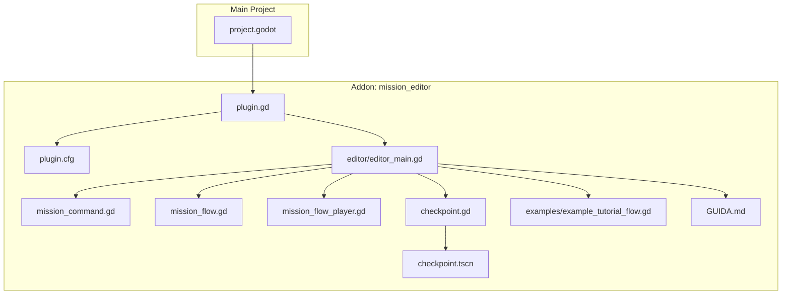
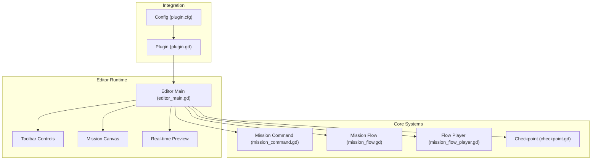
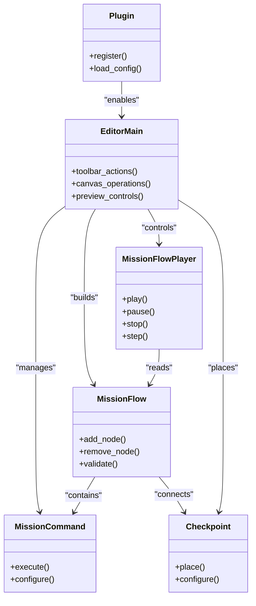
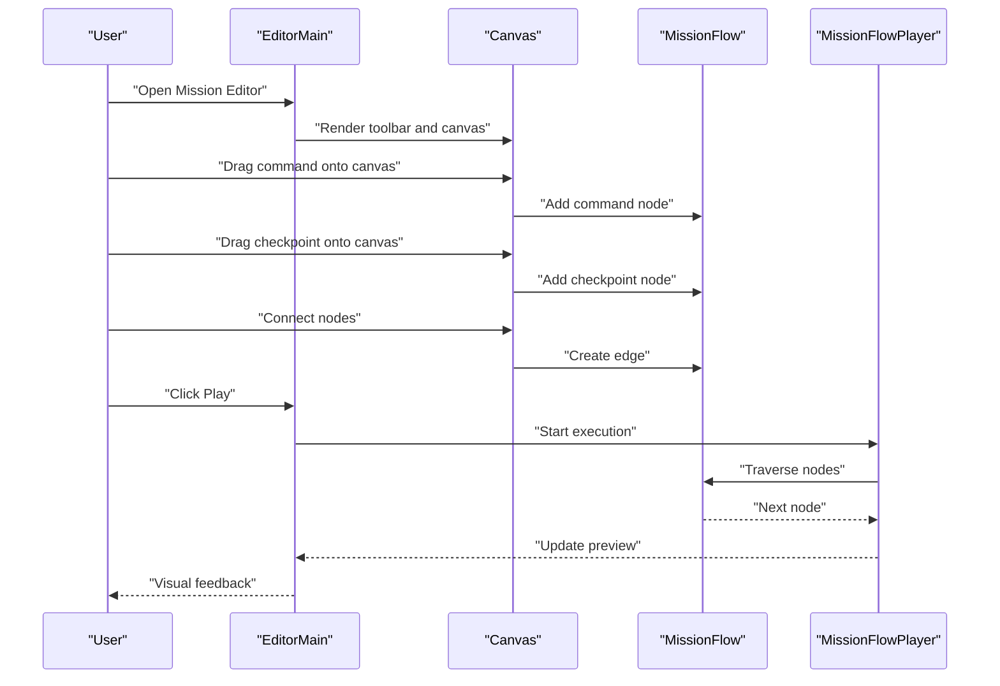
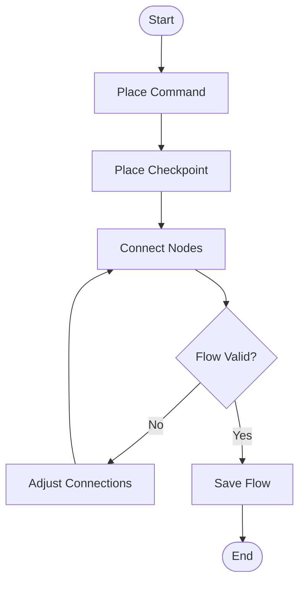
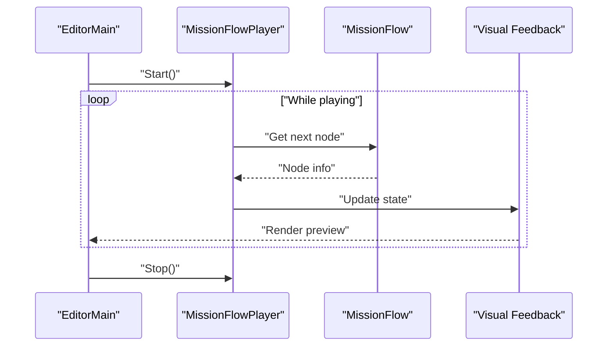
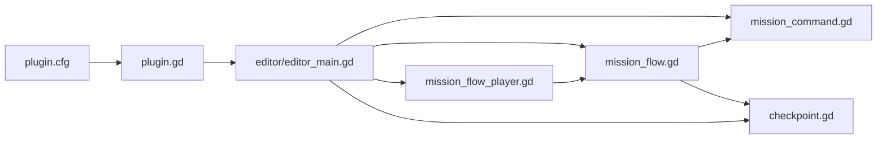

# Mission Editor Addon

<cite>
**Referenced Files in This Document**
- [plugin.gd](file://addons/mission_editor/plugin.gd)
- [plugin.cfg](file://addons/mission_editor/plugin.cfg)
- [GUIDA.md](file://addons/mission_editor/GUIDA.md)
- [editor_main.gd](file://addons/mission_editor/editor/editor_main.gd)
- [checkpoint.gd](file://addons/mission_editor/checkpoint.gd)
- [checkpoint.tscn](file://addons/mission_editor/checkpoint.tscn)
- [mission_command.gd](file://addons/mission_editor/mission_command.gd)
- [mission_flow.gd](file://addons/mission_editor/mission_flow.gd)
- [mission_flow_player.gd](file://addons/mission_editor/mission_flow_player.gd)
- [example_tutorial_flow.gd](file://addons/mission_editor/examples/example_tutorial_flow.gd)
- [creazionemissioni.md](file://creazionemissioni.md)
- [project.godot](file://project.godot)
</cite>

## Table of Contents
1. [Introduction](#introduction)
2. [Project Structure](#project-structure)
3. [Core Components](#core-components)
4. [Architecture Overview](#architecture-overview)
5. [Detailed Component Analysis](#detailed-component-analysis)
6. [Dependency Analysis](#dependency-analysis)
7. [Performance Considerations](#performance-considerations)
8. [Troubleshooting Guide](#troubleshooting-guide)
9. [Conclusion](#conclusion)
10. [Appendices](#appendices)

## Introduction
This document describes the Mission Editor Addon for the Godot-based project. It covers the visual mission creation interface, drag-and-drop workflow, real-time mission preview capabilities, editor main interface, toolbar functions, mission canvas operations, mission command scripting, checkpoint placement tools, and flow diagram creation. It also includes step-by-step tutorials for creating custom missions, configuring objectives, and testing mission flows, along with addon installation, configuration, and integration with the main game project.

## Project Structure
The Mission Editor Addon resides under the addons/mission_editor directory and integrates with the main Godot project via the plugin system. Key elements include:
- Plugin registration and configuration
- Editor main interface script
- Mission command and flow components
- Checkpoint tooling
- Example tutorial flow
- User guide and creation documentation

**Diagram sources**
- [plugin.gd](file://addons/mission_editor/plugin.gd)
- [plugin.cfg](file://addons/mission_editor/plugin.cfg)
- [editor_main.gd](file://addons/mission_editor/editor/editor_main.gd)
- [mission_command.gd](file://addons/mission_editor/mission_command.gd)
- [mission_flow.gd](file://addons/mission_editor/mission_flow.gd)
- [mission_flow_player.gd](file://addons/mission_editor/mission_flow_player.gd)
- [checkpoint.gd](file://addons/mission_editor/checkpoint.gd)
- [checkpoint.tscn](file://addons/mission_editor/checkpoint.tscn)
- [example_tutorial_flow.gd](file://addons/mission_editor/examples/example_tutorial_flow.gd)
- [GUIDA.md](file://addons/mission_editor/GUIDA.md)
- [project.godot](file://project.godot)

**Section sources**
- [plugin.gd](file://addons/mission_editor/plugin.gd)
- [plugin.cfg](file://addons/mission_editor/plugin.cfg)
- [project.godot](file://project.godot)

## Core Components
- Plugin registration: Declares the addon and its editor module(s) to the engine.
- Editor main interface: Provides the visual editor surface, toolbar, and canvas operations.
- Mission command scripting: Defines executable commands that represent scripted actions in a mission.
- Mission flow: Represents the flow graph connecting commands and checkpoints.
- Mission flow player: Executes the mission flow in real time for preview/testing.
- Checkpoint tooling: Handles placement and management of checkpoints in the mission canvas.
- Example tutorial flow: Demonstrates a complete flow for tutorial missions.
- Documentation: Internal guide and external creation guide for mission authors.

**Section sources**
- [plugin.gd](file://addons/mission_editor/plugin.gd)
- [editor_main.gd](file://addons/mission_editor/editor/editor_main.gd)
- [mission_command.gd](file://addons/mission_editor/mission_command.gd)
- [mission_flow.gd](file://addons/mission_editor/mission_flow.gd)
- [mission_flow_player.gd](file://addons/mission_editor/mission_flow_player.gd)
- [checkpoint.gd](file://addons/mission_editor/checkpoint.gd)
- [checkpoint.tscn](file://addons/mission_editor/checkpoint.tscn)
- [example_tutorial_flow.gd](file://addons/mission_editor/examples/example_tutorial_flow.gd)
- [GUIDA.md](file://addons/mission_editor/GUIDA.md)
- [creazionemissioni.md](file://creazionemissioni.md)

## Architecture Overview
The addon extends the Godot editor with a mission authoring environment. The plugin registers editor extensions, and the main editor script orchestrates UI controls, canvas interactions, and runtime flow execution.

**Diagram sources**
- [plugin.gd](file://addons/mission_editor/plugin.gd)
- [plugin.cfg](file://addons/mission_editor/plugin.cfg)
- [editor_main.gd](file://addons/mission_editor/editor/editor_main.gd)
- [mission_command.gd](file://addons/mission_editor/mission_command.gd)
- [mission_flow.gd](file://addons/mission_editor/mission_flow.gd)
- [mission_flow_player.gd](file://addons/mission_editor/mission_flow_player.gd)
- [checkpoint.gd](file://addons/mission_editor/checkpoint.gd)

## Detailed Component Analysis

### Plugin Registration
The plugin declares the addon and its editor module(s) to the engine. It enables the editor extension and exposes the mission editor UI.

Key responsibilities:
- Register editor plugin
- Load configuration
- Expose editor interface

Integration points:
- Godot editor plugin system
- Editor main interface activation

**Section sources**
- [plugin.gd](file://addons/mission_editor/plugin.gd)
- [plugin.cfg](file://addons/mission_editor/plugin.cfg)

### Editor Main Interface
The editor main interface manages the visual mission creation experience, including:
- Toolbar functions for adding/removing elements and controlling playback
- Mission canvas operations for placing and connecting commands and checkpoints
- Real-time mission preview execution

Core workflows:
- Drag-and-drop placement of mission commands and checkpoints
- Connecting commands to form a flow diagram
- Running the mission flow for immediate feedback

UI and interaction model:
- Toolbar buttons trigger actions on the canvas
- Canvas supports selection, movement, and connection of nodes
- Preview mode executes the flow and updates visuals accordingly

**Section sources**
- [editor_main.gd](file://addons/mission_editor/editor/editor_main.gd)

### Mission Command Scripting
Mission commands define scripted actions that can be placed on the canvas. They represent atomic units of behavior within a mission.

Characteristics:
- Executable units that participate in the flow
- Configurable parameters exposed via the editor
- Integrated with the flow system for sequencing

Usage:
- Commands are instantiated and placed on the canvas
- Parameters are edited through the editor UI
- Commands are linked in the flow to create sequences

**Section sources**
- [mission_command.gd](file://addons/mission_editor/mission_command.gd)

### Mission Flow
The mission flow represents the logical sequence of commands and checkpoints. It forms a directed graph that defines how a mission progresses.

Key aspects:
- Nodes represent commands and checkpoints
- Edges represent transitions and conditions
- Supports branching and looping constructs
- Serialized for persistence and loading

Canvas operations:
- Connect nodes to build the flow
- Reorder nodes to adjust timing
- Validate connections for correctness

**Section sources**
- [mission_flow.gd](file://addons/mission_editor/mission_flow.gd)

### Mission Flow Player
The mission flow player executes the mission flow in real time, enabling live preview and testing.

Responsibilities:
- Interpret the flow graph
- Execute commands in order
- Manage state transitions
- Provide feedback during execution

Preview features:
- Play/pause/stop controls
- Step-through execution
- Visual indicators for current position
- Error reporting for invalid flows

**Section sources**
- [mission_flow_player.gd](file://addons/mission_editor/mission_flow_player.gd)

### Checkpoint Placement Tools
Checkpoints mark significant locations or events in a mission. They can act as triggers, targets, or synchronization points.

Features:
- Placement on the mission canvas
- Parameterization for behavior (e.g., trigger radius, activation conditions)
- Integration with the flow system for conditional progression

Workflow:
- Place checkpoints via toolbar or canvas context menu
- Configure checkpoint properties in the inspector
- Connect checkpoints to commands to form meaningful sequences

**Section sources**
- [checkpoint.gd](file://addons/mission_editor/checkpoint.gd)
- [checkpoint.tscn](file://addons/mission_editor/checkpoint.tscn)

### Example Tutorial Flow
The example tutorial flow demonstrates a complete, working mission that new users can study and adapt. It showcases:
- Typical command sequences
- Checkpoint usage patterns
- Flow construction best practices

Learning value:
- Reference implementation for common scenarios
- Starting point for custom missions
- Validation of editor tooling capabilities

**Section sources**
- [example_tutorial_flow.gd](file://addons/mission_editor/examples/example_tutorial_flow.gd)

### Internal and External Documentation
Internal documentation (GUIDA.md) provides developer-focused guidance on the addon’s internals and usage. External creation guide (creazionemissioni.md) offers mission authoring instructions for end users.

Topics covered:
- How to install and enable the addon
- How to create and edit missions
- How to test and iterate on mission flows
- Best practices for organizing complex missions

**Section sources**
- [GUIDA.md](file://addons/mission_editor/GUIDA.md)
- [creazionemissioni.md](file://creazionemissioni.md)

## Architecture Overview

**Diagram sources**
- [plugin.gd](file://addons/mission_editor/plugin.gd)
- [editor_main.gd](file://addons/mission_editor/editor/editor_main.gd)
- [mission_command.gd](file://addons/mission_editor/mission_command.gd)
- [mission_flow.gd](file://addons/mission_editor/mission_flow.gd)
- [mission_flow_player.gd](file://addons/mission_editor/mission_flow_player.gd)
- [checkpoint.gd](file://addons/mission_editor/checkpoint.gd)

## Detailed Component Analysis

### Editor Main Interface Workflow
The editor orchestrates drag-and-drop placement, flow building, and real-time preview.

**Diagram sources**
- [editor_main.gd](file://addons/mission_editor/editor/editor_main.gd)
- [mission_flow.gd](file://addons/mission_editor/mission_flow.gd)
- [mission_flow_player.gd](file://addons/mission_editor/mission_flow_player.gd)

### Flow Construction Logic
Building a mission flow involves adding nodes, connecting them, and validating the graph.

**Diagram sources**
- [mission_flow.gd](file://addons/mission_editor/mission_flow.gd)
- [checkpoint.gd](file://addons/mission_editor/checkpoint.gd)
- [mission_command.gd](file://addons/mission_editor/mission_command.gd)

### Real-time Preview Execution
The flow player executes the mission in real time, updating the preview continuously.

**Diagram sources**
- [mission_flow_player.gd](file://addons/mission_editor/mission_flow_player.gd)
- [mission_flow.gd](file://addons/mission_editor/mission_flow.gd)
- [editor_main.gd](file://addons/mission_editor/editor/editor_main.gd)

## Dependency Analysis
The addon depends on the Godot editor plugin system and integrates tightly with the editor main interface. The mission flow system is central, with commands and checkpoints as leaf nodes, and the flow player consuming the flow graph.

**Diagram sources**
- [plugin.gd](file://addons/mission_editor/plugin.gd)
- [plugin.cfg](file://addons/mission_editor/plugin.cfg)
- [editor_main.gd](file://addons/mission_editor/editor/editor_main.gd)
- [mission_command.gd](file://addons/mission_editor/mission_command.gd)
- [mission_flow.gd](file://addons/mission_editor/mission_flow.gd)
- [mission_flow_player.gd](file://addons/mission_editor/mission_flow_player.gd)
- [checkpoint.gd](file://addons/mission_editor/checkpoint.gd)

**Section sources**
- [plugin.gd](file://addons/mission_editor/plugin.gd)
- [plugin.cfg](file://addons/mission_editor/plugin.cfg)
- [editor_main.gd](file://addons/mission_editor/editor/editor_main.gd)
- [mission_flow.gd](file://addons/mission_editor/mission_flow.gd)
- [mission_flow_player.gd](file://addons/mission_editor/mission_flow_player.gd)
- [mission_command.gd](file://addons/mission_editor/mission_command.gd)
- [checkpoint.gd](file://addons/mission_editor/checkpoint.gd)

## Performance Considerations
- Keep mission flows reasonably sized to avoid heavy graph traversal during preview.
- Minimize expensive operations inside mission commands to maintain smooth preview performance.
- Use checkpoints judiciously; excessive checkpoints can increase graph complexity.
- Prefer modular command composition to reduce duplication and simplify maintenance.

## Troubleshooting Guide
Common issues and resolutions:
- Addon not visible in editor: Verify plugin registration and configuration are present and enabled.
- Flow fails to play: Validate flow connectivity and ensure all nodes are properly connected.
- Checkpoint not triggering: Confirm checkpoint parameters and placement align with intended behavior.
- Canvas operations not responding: Ensure the editor is focused and the correct tool is selected.

**Section sources**
- [plugin.gd](file://addons/mission_editor/plugin.gd)
- [plugin.cfg](file://addons/mission_editor/plugin.cfg)
- [editor_main.gd](file://addons/mission_editor/editor/editor_main.gd)
- [mission_flow_player.gd](file://addons/mission_editor/mission_flow_player.gd)
- [checkpoint.gd](file://addons/mission_editor/checkpoint.gd)

## Conclusion
The Mission Editor Addon provides a robust, visual environment for designing and testing missions. Its plugin-based architecture integrates seamlessly with the Godot editor, while the flow-based design enables flexible and powerful mission scripting. With the included documentation and example flows, users can quickly become productive in creating custom missions.

## Appendices

### Installation and Integration Steps
- Enable the addon in the project settings under the Plugins tab.
- Open the editor and locate the Mission Editor panel.
- Use the toolbar to add commands and checkpoints to the canvas.
- Build the flow by connecting nodes and save the mission.
- Use the preview controls to test and iterate on the flow.

**Section sources**
- [plugin.cfg](file://addons/mission_editor/plugin.cfg)
- [project.godot](file://project.godot)
- [GUIDA.md](file://addons/mission_editor/GUIDA.md)
- [creazionemissioni.md](file://creazionemissioni.md)

### Step-by-Step Tutorials
- Creating a basic linear mission:
  - Open the editor and place a start checkpoint.
  - Add a series of commands to represent actions.
  - Connect commands sequentially and save.
  - Run the preview to verify the flow.
- Adding objectives and branching:
  - Place conditional checkpoints to branch the flow.
  - Add objective commands that modify mission state.
  - Validate branches and save the mission.
  - Test each branch in preview mode.
- Testing mission flows:
  - Use play/pause/stop controls to navigate the flow.
  - Inspect visual feedback and adjust timing as needed.
  - Iterate until the desired behavior is achieved.

**Section sources**
- [creazionemissioni.md](file://creazionemissioni.md)
- [example_tutorial_flow.gd](file://addons/mission_editor/examples/example_tutorial_flow.gd)
- [mission_flow_player.gd](file://addons/mission_editor/mission_flow_player.gd)