# Mission Flow Management

<cite>
**Referenced Files in This Document**
- [mission_flow.gd](file://addons/mission_editor/mission_flow.gd)
- [mission_flow_player.gd](file://addons/mission_editor/mission_flow_player.gd)
- [mission_data.gd](file://Scripts/mission_data.gd)
- [mission_manager.gd](file://Scripts/mission_manager.gd)
- [mission_command.gd](file://addons/mission_editor/mission_command.gd)
- [checkpoint.gd](file://addons/mission_editor/checkpoint.gd)
- [example_tutorial_flow.gd](file://addons/mission_editor/examples/example_tutorial_flow.gd)
- [mission_panel.gd](file://Scripts/mission_panel.gd)
- [plugin.gd](file://addons/mission_editor/plugin.gd)
- [editor_main.gd](file://addons/mission_editor/editor/editor_main.gd)
- [GUIDA.md](file://addons/mission_editor/GUIDA.md)
- [ramp_events.gd](file://Scripts/ramp_events.gd)
- [game_events.gd](file://Scripts/game_events.gd)
</cite>

## Table of Contents
1. [Introduction](#introduction)
2. [Project Structure](#project-structure)
3. [Core Components](#core-components)
4. [Architecture Overview](#architecture-overview)
5. [Detailed Component Analysis](#detailed-component-analysis)
6. [Dependency Analysis](#dependency-analysis)
7. [Performance Considerations](#performance-considerations)
8. [Troubleshooting Guide](#troubleshooting-guide)
9. [Conclusion](#conclusion)
10. [Appendices](#appendices)

## Introduction
This document describes the Mission Flow Management system for creating, editing, and executing branching missions in a top-down game. It covers:
- Objective tracking and progression logic
- State management across missions and flows
- Scripting system for branching missions, conditional objectives, and dynamic mission generation
- Runtime execution and synchronization with gameplay mechanics
- API, signals, and event-driven architecture

The system builds on an existing MissionManager and integrates with a visual Mission Flow Editor plugin, enabling designers and developers to build complex narrative-driven sequences with checkpoints, timers, and scripted events.

## Project Structure
The Mission Flow system spans editor and runtime components:
- Editor plugin adds a dock, autoload, and custom node types for designing flows
- Runtime components orchestrate flow playback, branching, and command execution
- Existing systems (MissionManager, HUD) remain compatible and are extended by the flow player

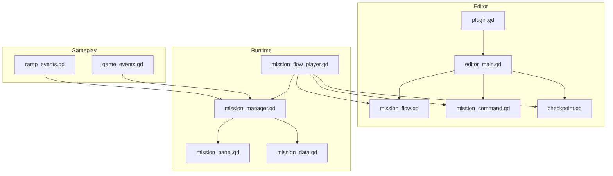

**Diagram sources**
- [plugin.gd:1-109](file://addons/mission_editor/plugin.gd#L1-L109)
- [editor_main.gd:1-778](file://addons/mission_editor/editor/editor_main.gd#L1-L778)
- [mission_flow.gd:1-134](file://addons/mission_editor/mission_flow.gd#L1-L134)
- [mission_command.gd:1-98](file://addons/mission_editor/mission_command.gd#L1-L98)
- [checkpoint.gd:1-231](file://addons/mission_editor/checkpoint.gd#L1-L231)
- [mission_flow_player.gd:1-379](file://addons/mission_editor/mission_flow_player.gd#L1-L379)
- [mission_manager.gd:1-169](file://Scripts/mission_manager.gd#L1-L169)
- [mission_data.gd:1-66](file://Scripts/mission_data.gd#L1-L66)
- [mission_panel.gd:1-359](file://Scripts/mission_panel.gd#L1-L359)
- [ramp_events.gd:1-9](file://Scripts/ramp_events.gd#L1-L9)
- [game_events.gd:1-5](file://Scripts/game_events.gd#L1-L5)

**Section sources**
- [plugin.gd:1-109](file://addons/mission_editor/plugin.gd#L1-L109)
- [editor_main.gd:1-778](file://addons/mission_editor/editor/editor_main.gd#L1-L778)
- [mission_flow.gd:1-134](file://addons/mission_editor/mission_flow.gd#L1-L134)
- [mission_command.gd:1-98](file://addons/mission_editor/mission_command.gd#L1-L98)
- [checkpoint.gd:1-231](file://addons/mission_editor/checkpoint.gd#L1-L231)
- [mission_flow_player.gd:1-379](file://addons/mission_editor/mission_flow_player.gd#L1-L379)
- [mission_manager.gd:1-169](file://Scripts/mission_manager.gd#L1-L169)
- [mission_data.gd:1-66](file://Scripts/mission_data.gd#L1-L66)
- [mission_panel.gd:1-359](file://Scripts/mission_panel.gd#L1-L359)
- [ramp_events.gd:1-9](file://Scripts/ramp_events.gd#L1-L9)
- [game_events.gd:1-5](file://Scripts/game_events.gd#L1-L5)

## Core Components
- MissionFlow: A savable Resource representing a graph of missions, entry point, and explicit connections used by the editor.
- MissionData: Declares a single mission objective with type, target, branching fields, commands, and optional time limit.
- MissionManager: Autoload singleton managing active mission state, progress, completion, failure, and HUD signals.
- MissionFlowPlayer: Autoload runtime orchestrator that starts flows, manages branching, executes commands, handles checkpoints, and timers.
- MissionCommand: Resource describing executable actions triggered on mission completion or failure.
- CheckPoint: Area2D node that triggers mission completion for REACH/ACTIVATE and coordinates with the flow player.
- Editor Dock: Visual graph editor, inspector, and command editor for authoring flows.
- HUD Panel: Displays active mission state and reacts to MissionManager signals.

Key runtime APIs and signals are documented in the “Usage” and “Signals” sections of the plugin guide.

**Section sources**
- [mission_flow.gd:1-134](file://addons/mission_editor/mission_flow.gd#L1-L134)
- [mission_data.gd:1-66](file://Scripts/mission_data.gd#L1-L66)
- [mission_manager.gd:1-169](file://Scripts/mission_manager.gd#L1-L169)
- [mission_flow_player.gd:1-379](file://addons/mission_editor/mission_flow_player.gd#L1-L379)
- [mission_command.gd:1-98](file://addons/mission_editor/mission_command.gd#L1-L98)
- [checkpoint.gd:1-231](file://addons/mission_editor/checkpoint.gd#L1-L231)
- [mission_panel.gd:1-359](file://Scripts/mission_panel.gd#L1-L359)
- [GUIDA.md:305-344](file://addons/mission_editor/GUIDA.md#L305-L344)

## Architecture Overview
The system is event-driven and layered:
- Editor layer: Authoring and saving flows as Resources
- Runtime layer: Playback orchestrated by MissionFlowPlayer
- Gameplay layer: MissionManager tracks progress and emits signals consumed by HUD and other systems
- Integration layer: CheckPoints and external events trigger mission completion

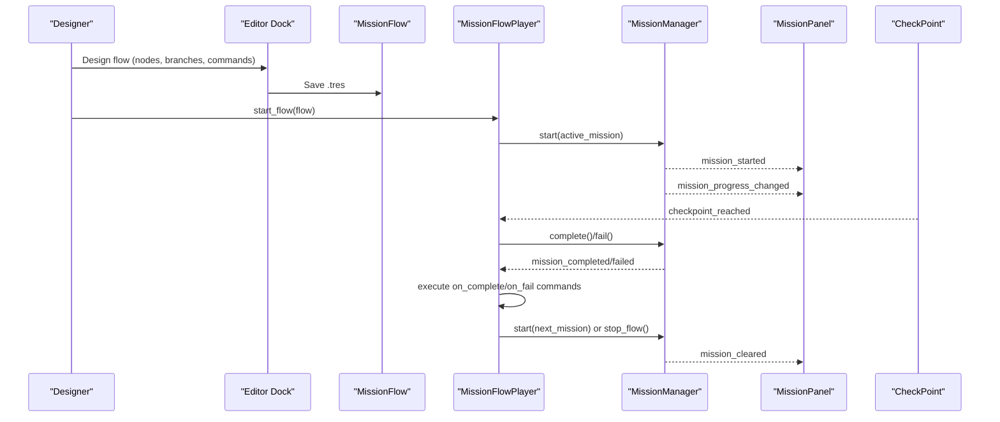

**Diagram sources**
- [editor_main.gd:350-360](file://addons/mission_editor/editor/editor_main.gd#L350-L360)
- [mission_flow_player.gd:87-115](file://addons/mission_editor/mission_flow_player.gd#L87-L115)
- [mission_manager.gd:49-99](file://Scripts/mission_manager.gd#L49-L99)
- [mission_panel.gd:53-169](file://Scripts/mission_panel.gd#L53-L169)
- [checkpoint.gd:114-149](file://addons/mission_editor/checkpoint.gd#L114-L149)

## Detailed Component Analysis

### MissionFlow (Flow Graph Resource)
MissionFlow encapsulates:
- Unique flow metadata (flow_id, flow_name, description)
- Start mission selection
- Missions array and explicit connections for the editor graph
- Utility methods to fetch missions, compute connected nodes, add/remove missions, and maintain connection integrity

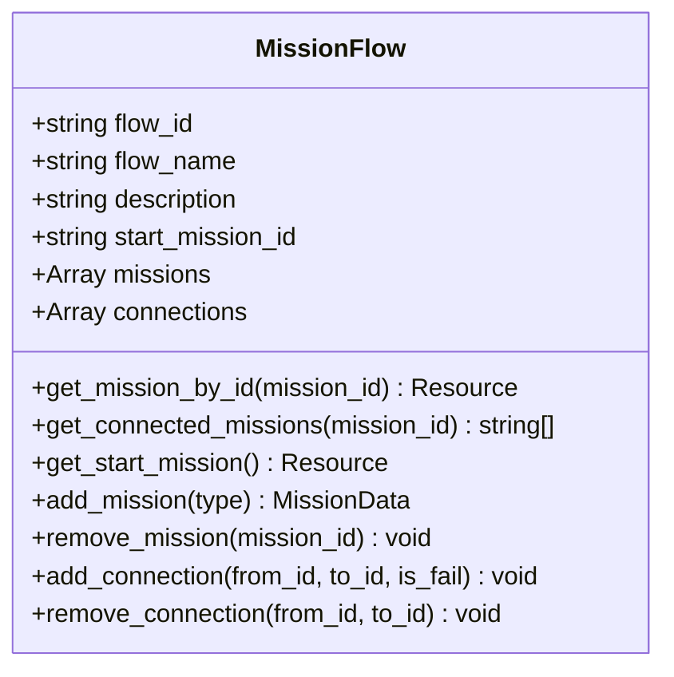

**Diagram sources**
- [mission_flow.gd:5-25](file://addons/mission_editor/mission_flow.gd#L5-L25)
- [mission_flow.gd:28-134](file://addons/mission_editor/mission_flow.gd#L28-L134)

**Section sources**
- [mission_flow.gd:1-134](file://addons/mission_editor/mission_flow.gd#L1-L134)

### MissionData (Objective Definition)
MissionData defines a single mission objective:
- Type enumeration (ELIMINATE, COLLECT, REACH, ACTIVATE, SURVIVE, CUSTOM)
- Target and progress presentation (counter vs progress bar)
- Branching fields (on_success_next, on_fail_next)
- Commands arrays (on_complete_commands, on_fail_commands)
- Optional time_limit and fail_condition
- Graph position and tags for editor

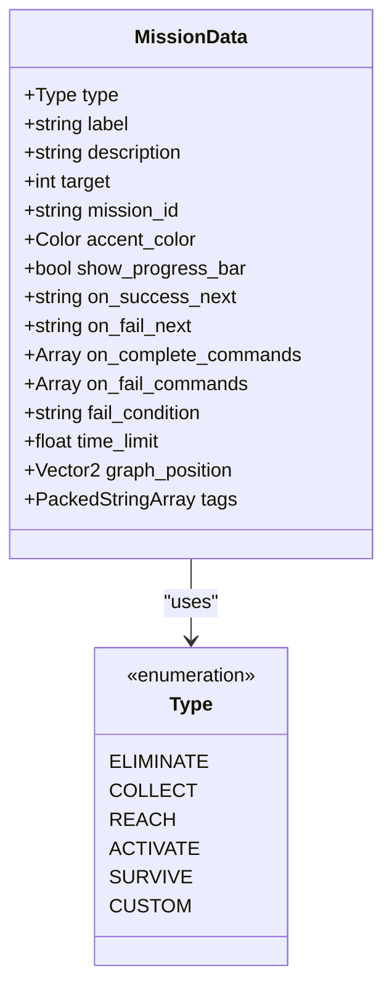

**Diagram sources**
- [mission_data.gd:4-66](file://Scripts/mission_data.gd#L4-L66)

**Section sources**
- [mission_data.gd:1-66](file://Scripts/mission_data.gd#L1-L66)

### MissionManager (Progression Logic)
MissionManager maintains:
- Active mission, progress, and completion flag
- Signals for UI and orchestration
- Public API to start, update, complete, fail, and clear missions
- Factory helpers to quickly create common mission types

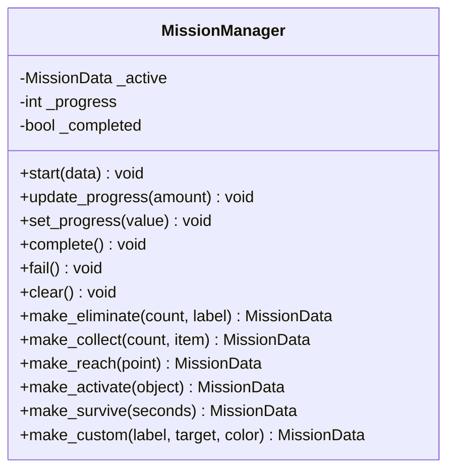

**Diagram sources**
- [mission_manager.gd:18-169](file://Scripts/mission_manager.gd#L18-L169)

**Section sources**
- [mission_manager.gd:1-169](file://Scripts/mission_manager.gd#L1-L169)

### MissionFlowPlayer (Runtime Execution)
MissionFlowPlayer orchestrates:
- Lifecycle: start_flow, stop_flow, jump_to_mission, force_advance
- State: current flow, current mission, playing flag, time remaining, checkpoint registry
- Branching: on mission completion/failure, select next mission and start it
- Commands: execute on_complete/on_fail commands with delays and parameters
- Checkpoints: register/unregister, emit checkpoint_reached, resume from saved checkpoint
- Timers: enforce time_limit and trigger failure when expired

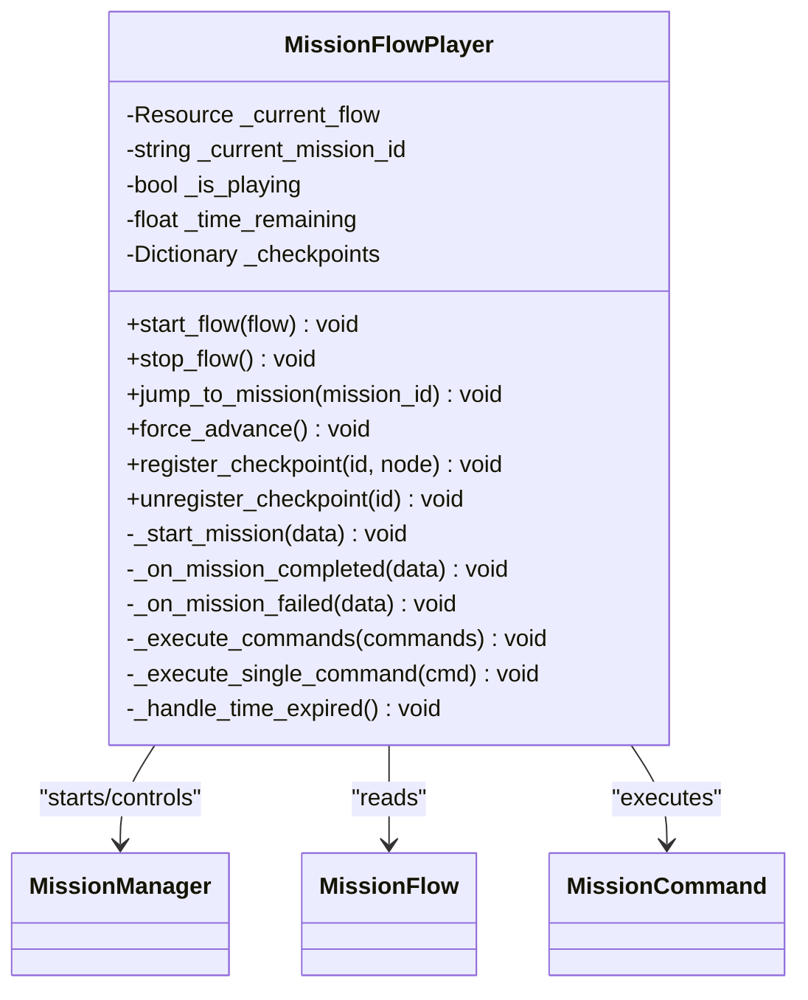

**Diagram sources**
- [mission_flow_player.gd:10-379](file://addons/mission_editor/mission_flow_player.gd#L10-L379)

**Section sources**
- [mission_flow_player.gd:1-379](file://addons/mission_editor/mission_flow_player.gd#L1-L379)

### MissionCommand (Dynamic Mission Generation)
MissionCommand defines executable actions:
- CommandType enumeration (PLAY_SOUND, CHANGE_SCENE, SPAWN_ENEMIES, PLAY_ANIMATION, SET_VARIABLE, CALL_METHOD, SHOW_DIALOG, ENABLE_CHECKPOINT, DISABLE_CHECKPOINT, DELAY)
- Parameters dictionary per command type
- Delay and enabled flags
- Editor-friendly display name and type color

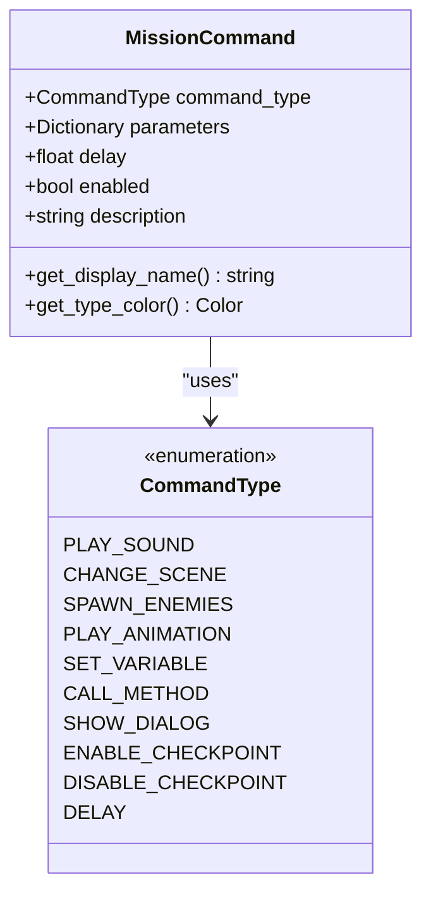

**Diagram sources**
- [mission_command.gd:5-98](file://addons/mission_editor/mission_command.gd#L5-L98)

**Section sources**
- [mission_command.gd:1-98](file://addons/mission_editor/mission_command.gd#L1-L98)

### CheckPoint (Objective Trigger)
CheckPoint integrates with flows and gameplay:
- Registers with MissionFlowPlayer on ready
- Detects player enter (group "players")
- Emits checkpoint_reached signal
- Auto-completes REACH/ACTIVATE missions whose IDs match
- Supports one-shot activation and visual effects

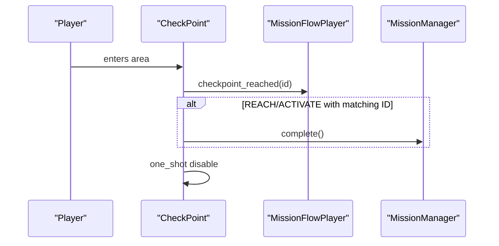

**Diagram sources**
- [checkpoint.gd:86-150](file://addons/mission_editor/checkpoint.gd#L86-L150)
- [checkpoint.gd:114-149](file://addons/mission_editor/checkpoint.gd#L114-L149)

**Section sources**
- [checkpoint.gd:1-231](file://addons/mission_editor/checkpoint.gd#L1-L231)

### Editor Dock (Authoring)
The editor dock provides:
- Toolbar actions (new, open, save, add/delete mission)
- Flow Graph tab with drag-and-connect nodes
- Mission List tab for quick selection
- Inspector for mission properties and branching
- Command editor for on-complete/on-fail actions
- Saving/loading of .tres resources

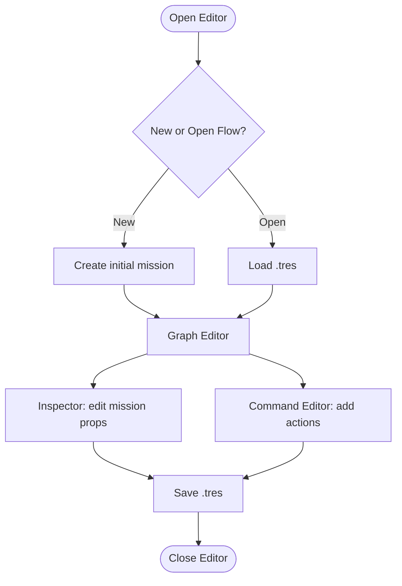

**Diagram sources**
- [editor_main.gd:133-171](file://addons/mission_editor/editor/editor_main.gd#L133-L171)
- [editor_main.gd:350-360](file://addons/mission_editor/editor/editor_main.gd#L350-L360)
- [editor_main.gd:697-778](file://addons/mission_editor/editor/editor_main.gd#L697-L778)

**Section sources**
- [editor_main.gd:1-778](file://addons/mission_editor/editor/editor_main.gd#L1-L778)

### Example Tutorial Flow (Scripted Creation)
The example demonstrates building a flow programmatically:
- Creates multiple missions with branching and fallbacks
- Adds on_complete commands (sound, scene change)
- Sets start mission and returns the flow

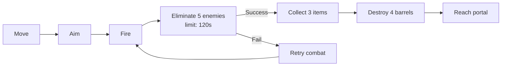

**Diagram sources**
- [example_tutorial_flow.gd:14-153](file://addons/mission_editor/examples/example_tutorial_flow.gd#L14-L153)

**Section sources**
- [example_tutorial_flow.gd:1-153](file://addons/mission_editor/examples/example_tutorial_flow.gd#L1-L153)

### HUD Integration (MissionPanel)
MissionPanel connects to MissionManager signals to render:
- Mission label, counter/progress bar, status
- Styles and animations for active/completed/failed states
- Automatic clearing after completion

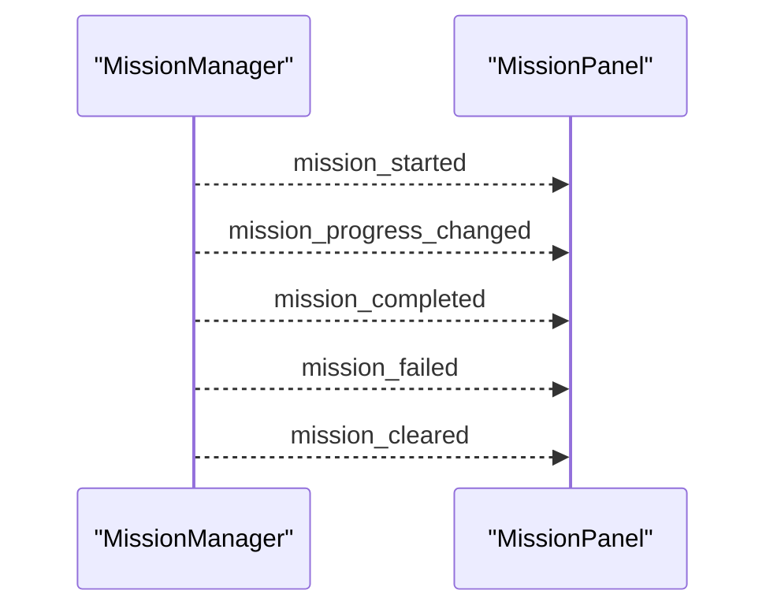

**Diagram sources**
- [mission_panel.gd:43-169](file://Scripts/mission_panel.gd#L43-L169)

**Section sources**
- [mission_panel.gd:1-359](file://Scripts/mission_panel.gd#L1-L359)

## Dependency Analysis
- MissionFlowPlayer depends on MissionManager, MissionFlow, MissionCommand, and CheckPoint
- MissionManager is independent but emits signals consumed by HUD and flow player
- Editor Dock depends on MissionFlow, MissionCommand, and CheckPoint for authoring
- CheckPoint depends on MissionFlowPlayer and MissionManager for runtime behavior

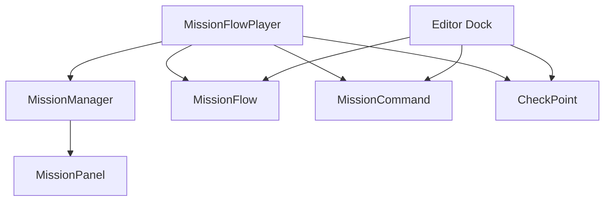

**Diagram sources**
- [mission_flow_player.gd:12-32](file://addons/mission_editor/mission_flow_player.gd#L12-L32)
- [mission_manager.gd:23-27](file://Scripts/mission_manager.gd#L23-L27)
- [mission_panel.gd:43-48](file://Scripts/mission_panel.gd#L43-L48)
- [editor_main.gd:350-360](file://addons/mission_editor/editor/editor_main.gd#L350-L360)

**Section sources**
- [mission_flow_player.gd:1-379](file://addons/mission_editor/mission_flow_player.gd#L1-L379)
- [mission_manager.gd:1-169](file://Scripts/mission_manager.gd#L1-L169)
- [mission_panel.gd:1-359](file://Scripts/mission_panel.gd#L1-L359)
- [editor_main.gd:1-778](file://addons/mission_editor/editor/editor_main.gd#L1-L778)

## Performance Considerations
- Minimize heavy command operations during tight loops; use DELAY to stagger effects
- Prefer reusable scenes and pooled audio players to avoid frequent allocations
- Keep mission graphs reasonably sized to reduce graph rendering overhead
- Use checkpoint toggling to avoid unnecessary collision checks when inactive
- Avoid long-running timers inside missions; rely on MissionFlowPlayer’s centralized timer handling

## Troubleshooting Guide
Common issues and resolutions:
- Flow does not start: Verify MissionFlowPlayer is registered as autoload and MissionManager is present
- Branching not working: Ensure on_success_next/on_fail_next IDs exist and are unique
- Checkpoint not triggering: Confirm checkpoint_id matches mission label or ID for REACH/ACTIVATE and player group membership
- Commands not executing: Validate command_type and parameters JSON; ensure enabled flag is true
- HUD not updating: Confirm MissionPanel is attached and connected to MissionManager signals

**Section sources**
- [checkpoint.gd:114-149](file://addons/mission_editor/checkpoint.gd#L114-L149)
- [mission_command.gd:22-42](file://addons/mission_editor/mission_command.gd#L22-L42)
- [mission_panel.gd:43-48](file://Scripts/mission_panel.gd#L43-L48)

## Conclusion
The Mission Flow Management system provides a robust, event-driven framework for designing and executing branching missions. By combining a visual editor with a runtime orchestrator and a flexible command system, it enables dynamic storytelling while maintaining compatibility with existing gameplay systems. Developers can create complex sequences, integrate checkpoints and timers, and extend functionality through custom commands and signals.

## Appendices

### API and Signals Reference
- MissionFlowPlayer
  - Signals: flow_started, flow_ended, mission_branch_taken, command_executed, checkpoint_reached
  - Methods: start_flow, stop_flow, jump_to_mission, force_advance, register_checkpoint, unregister_checkpoint
  - Properties: is_playing, current_flow, current_mission_id
- MissionManager
  - Signals: mission_started, mission_progress_changed, mission_completed, mission_failed, mission_cleared
  - Methods: start, update_progress, set_progress, complete, fail, clear, factory helpers
- MissionCommand
  - Fields: command_type, parameters, delay, enabled, description
  - Methods: get_display_name, get_type_color

**Section sources**
- [mission_flow_player.gd:18-48](file://addons/mission_editor/mission_flow_player.gd#L18-L48)
- [mission_manager.gd:23-99](file://Scripts/mission_manager.gd#L23-L99)
- [mission_command.gd:22-98](file://addons/mission_editor/mission_command.gd#L22-L98)

### Integration Examples
- Starting a flow from code: [example_tutorial_flow.gd:14-153](file://addons/mission_editor/examples/example_tutorial_flow.gd#L14-L153)
- Using signals: [GUIDA.md:324-335](file://addons/mission_editor/GUIDA.md#L324-L335)
- HUD integration: [mission_panel.gd:43-169](file://Scripts/mission_panel.gd#L43-L169)